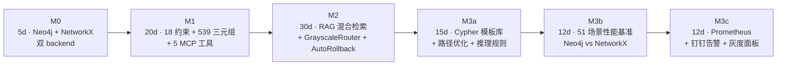

# GridMind · 灵枢电网

> **Multi-Agent 电网 AI 系统** — 基于 **Python + FastAPI + LangGraph** 构建，采用 **MCP 协议** 标准化工具暴露、**Neo4j + NetworkX 双 backend 知识图谱**、**可解释性 AI 三层架构** 与 **HITL Edit & Continue** 模式，覆盖设备监控 / 异常检测 / 安规核查 / 知识库问答四大核心能力。


---

## 一、四大核心能力

| # | 能力 | 关键技术 | 体现位置 |
|---|------|---------|---------|
| 1 | **知识图谱 · Neo4j + NetworkX 双 backend** | Neo4j 5.x (主) / NetworkX (降级) · 18 约束 + 10 索引 + 539 三元组（88 节点 + 451 关系） | `core/kg_client.py` · `mcp_tools/tools/neo4j_tools.py` |
| 2 | **可解释性 AI 三层架构** | LLM (Pydantic 围栏) + 机理校验（5 种轻量规则） + 规则护栏（11 条 JSON） | `core/diagnosis_orchestrator.py` · `core/mechanical_checker.py` · `core/rules_guard.py` |
| 3 | **HITL Edit & Continue** | LangGraph `interrupt()` + `MemorySaver` · 三种模式：Approval / Edit&Continue / Escalation | `api/schemas/hitl_edit.py` · `api/services/hitl_editable_schemas.py` |
| 4 | **双主题前端** | Vue 3 + TypeScript + Vite + Element Plus + Pinia · GridMind 科技风（Light/Dark） · `CommandPalette` · 5 规格 Logo | `web/src/views/` · `web/src/components/brand/` |

---

## 二、架构概览

### 2.1 系统架构图

```
┌─ 用户 (Web UI / curl / SSE Streaming) ─────────────────────────┐
│           ↓ POST /chat                                         │
┌─ FastAPI Server (端口 9900) ───────────────────────────────────┐
│  LangGraph Supervisor + 4 Agents (monitor/safety/diagnosis/KG) │
│  HITL: interrupt() + MemorySaver                                │
│  /metrics (Prometheus) + /grayscale/* + /audit/hitl/*           │
└────┬────────────────────────────────────┬──────────────────────┘
     │ langchain-mcp-adapters            │
┌────▼────────────────────────────┐  ┌──▼─────────────────────────┐
│ MCP Tool Server (9901, FastMCP) │  │ 数据层                       │
│  monitor/safety/diagnosis/      │  │  ├─ SQLite (8 张表)          │
│  knowledge/neo4j/kg_reasoning   │  │  ├─ Chroma (向量库)         │
│  7 工具模块 · 18+ 工具         │  │  ├─ Neo4j 5.x (主 backend)  │
└────┬────────────────────────────┘  │  └─ NetworkX (降级 backend) │
     │                                └────────────────────────────┘
     ▼
┌─ Prometheus / Grafana (可选) ─────┐
│  抓取 GET /metrics (13+ 指标)     │
│  钉钉告警 (3 类场景 · 冷却去重)    │
└───────────────────────────────────┘
```

### 2.2 Mermaid 里程碑图



### 2.3 核心模块

| 模块 | 职责 | 关键文件 |
|------|------|---------|
| `api/` | FastAPI 服务 + LangGraph 状态图 + HITL | `main.py` · `graph.py` · `metrics_endpoint.py` · `agents/` · `services/` · `schemas/hitl_edit.py` |
| `core/` | 领域算法引擎（异常检测 / RAG / 知识图谱 / 可解释性 / 灰度） | `anomaly_detection.py` · `rag_engine.py` · `kg_client.py` · `diagnosis_orchestrator.py` · `grayscale_router.py` · `metrics_collector.py` |
| `mcp_tools/` | MCP 工具服务（FastMCP/SSE，7 模块 18+ 工具） | `server.py` · `tools/{monitor,safety,diagnosis,knowledge,neo4j,kg_reasoning}_tools.py` |
| `prompts/` | Agent 系统提示词 | `system_prompts.py` |
| `scripts/` | 一键启动 & 数据库初始化 & Neo4j 容器管理 | `start_all.py` · `seed_db.py` · `start_neo4j.py` · `stop_neo4j.py` |
| `benchmarks/` | M3b · 51 场景性能基准（Neo4j vs NetworkX） | `scenarios.py` · `runner.py` · `reporter.py` · `baseline_data.py` |
| `web/` | Vue 3 前端（Vite + TypeScript + Element Plus + Pinia） | `src/views/` · `src/components/` · `src/stores/` · `src/api/` |
| `tests/` | 单元 + 集成 + e2e 测试（pytest） | `test_database.py` · `test_*_kg_*.py` · `test_explainability.py` · `test_hitl_edit.py` |

---

## 三、P0-2 知识图谱里程碑（重点）

| 里程碑 | 目标 | 周期 | 测试 | 状态 |
|--------|------|------|------|------|
| **M0** 基础设施 | Neo4j 5.x + NetworkX 双 backend 适配层 | 5d | 27 + 14 SKIP | ✅ |
| **M1** 索引+数据 | 18 约束 + 10 索引 + 539 三元组（88 节点 + 451 关系） + 5 MCP 工具 | 20d | 103 + 16 SKIP | ✅ |
| **M2** RAG+灰度 | ChromaSyncService + GrayscaleRouter + AutoRollback | 30d | 153 + 18 SKIP | ✅ |
| **M3a** 推理能力 | Cypher 模板库 + 路径优化器 + 推理规则引擎 | 15d | 45 | ✅ |
| **M3b** 性能基准 | 51 场景 Neo4j vs NetworkX 对比 + 自动 Markdown 报告 | 12d | 53 | ✅ |
| **M3c** 可观测性 | Prometheus `/metrics` + 钉钉告警 + 灰度面板 | 12d | 32 | ✅ |
| **合计** | — | **94d** | **413 PASS + 48 SKIP** | ✅ |

**总周期**：94 人天（5 + 20 + 30 + 15 + 12 + 12）· **总测试**：413 PASS + 48 SKIP（覆盖单元 / 集成 / e2e）
**详细拆解**：见 `docs/architecture/kg-m3-split.md`

---

## 四、可解释性 AI 三层架构（重点）

诊断结论由**三层融合**得出，任一层都可独立扩展：

```
┌──────────────────────────────────────────────────┐
│ 顶层 LLM 层 — Pydantic 围栏 JSON (DiagnosisOutput) │
│   prompt 增强 + fence 解析 + 置信度评估            │
├──────────────────────────────────────────────────┤
│ 中层 机理校验层 — 5 种轻量校验 (asyncio.gather)    │
│   Overload / ShortCircuit / PowerFlow /            │
│   Voltage / Temperature                           │
├──────────────────────────────────────────────────┤
│ 底层 规则护栏层 — 11 条 JSON 规则 (rules_guard.py) │
│   人为不可违反的安规底限 + 黑名单动作               │
└──────────────────────────────────────────────────┘
         ↓ DiagnosisOrchestrator 融合 ↓
   { severity, requires_human, forced_action }
```

**冲突策略**（见 `core/diagnosis_orchestrator.py`）：

| LLM 结论 | 机理校验 | 规则护栏 | 最终 |
|---------|---------|---------|------|
| OK | PASS | PASS | OK |
| ALARM | FAIL | OK | **机理优先** + `requires_human=true` |
| OK | FAIL | OK | 强制 **CRITICAL** + 复核 |
| 任意 | 任意 | FAIL（黑名单动作） | **强制阻断** |

**回退开关**：`EXPLAINABILITY_ENABLED=false` → 退化到单 LLM 决策（向后兼容）
**扩展指南**：见 `docs/explainability-developer-guide.md`

---

## 五、HITL 三种模式

| 模式 | 端点 | 用途 | 状态 |
|------|------|------|------|
| **Approval** | `POST /interrupt/{thread_id}/{approve,reject}` | 批准/拒绝高危操作（向后兼容） | ✅ |
| **Edit & Continue** | `POST /interrupt/{thread_id}/decision` | 编辑 Agent 计划后自动重检 `safety_agent` | ✅ |
| **Escalation** | （规划中） | 升级到领域专家处理 | 🚧 |

**审计留存**：`GET /audit/hitl/{thread_id}` · 3 年保留期（合规要求）

---

## 六、快速启动

### 前置条件

- **Python 3.13+**（项目统一在 3.13 上开发）
- **Node.js 18+**（前端构建）
- **可选**：Neo4j 5.x Docker（`python -m scripts.start_neo4j` 一键起容器）；无 Neo4j 时自动降级到 NetworkX

### 安装与启动

```bash
# 1. 安装后端依赖
pip install -r requirements.txt

# 2. 安装前端依赖
cd web && npm install && cd ..

# 3. 初始化数据库（首次运行，包含 539 三元组种子）
python -m scripts.seed_db

# 4. 一键启动（API + MCP + Neo4j 容器）
python -m scripts.start_all

# 5. 另开终端启动前端
cd web && npm run dev
```

**服务端口**：

| 服务 | 端口 | URL |
|------|------|-----|
| API | 9900 | http://localhost:9900（Swagger UI: `/docs`） |
| MCP | 9901 | http://localhost:9901/sse |
| Web | 5173 | http://localhost:5173 |
| Metrics | 9900 | http://localhost:9900/metrics（Prometheus 格式） |
| Neo4j | 7687 | `bolt://localhost:7687`（Docker 启动后） |

---

## 七、API 端点（27 个）

### 对话（3）
- `POST /chat`
- `GET /chat/stream/{thread_id}`
- `GET /thread/{thread_id}`

### 设备/健康（5）
- `GET /`（健康检查）
- `GET /devices` · `GET /devices/{device_id}` · `GET /devices/{device_id}/telemetry`
- `GET /health/scores` · `GET /health/critical`

### HITL（5）
- `POST /interrupt/{thread_id}/approve`（老）
- `POST /interrupt/{thread_id}/reject`（老）
- `POST /interrupt/{thread_id}/decision`（**新 HITL Edit**）
- `GET /audit/hitl/{thread_id}` · `GET /audit/hitl`（**新** · 3 年保留）

### 可解释性（1）
- `GET /diagnosis/{thread_id}/reasoning`（**新** · 三层融合结构 + 冲突溯源）

### 灰度切流（5）**新**
- `GET /grayscale/status` · `POST /grayscale/set`
- `POST /grayscale/manual_rollback`
- `GET /grayscale/history`

### 可观测性（2）**新**
- `GET /metrics`（Prometheus exposition format）
- `GET /metrics/summary`（JSON · 前端面板首选）

### 调试（2）
- `GET /debug/sync_lag` · `POST /debug/sync_force`

---

## 八、灰度切流与可观测性

### 8.1 GrayscaleRouter

- **核心策略**：基于 `GrayscaleRouter`（`core/grayscale_router.py`）按比例切流 Neo4j ↔ NetworkX
- **自动回滚**：`AutoRollback` 监控误差率/P95 延迟，超过阈值自动回滚
- **手动控制**：`POST /grayscale/set` 切比例，`POST /grayscale/manual_rollback` 强回
- **历史**：`GET /grayscale/history` 查最近 N 次切流记录

### 8.2 Prometheus 指标

- **零依赖**：纯标准库实现 Prometheus exposition format（**未引入 prometheus_client**）
- **13+ 指标**：`kg_cypher_query_total` / `kg_grayscale_ratio` / `kg_cypher_latency_ms_bucket` / `rag_total_latency_ms` …
- **3 类指标**：Counter（4）/ Gauge（2）/ Histogram（2）
- **限制**：默认 10 RPS（`METRICS_ENDPOINT_RPS_LIMIT`）

### 8.3 钉钉告警

- **3 类场景**：错误率突增 / P95 延迟超阈值 / 连续失败 N 次
- **冷却去重**：同 key 默认 300 秒（`DINGTALK_COOLDOWN_S`）
- **沙箱友好**：`DINGTALK_ENABLED=false` 时只 mock 日志不真发

---

## 九、Demo 路径（7 步 · 5 分钟）

> 推荐用前端 UI（http://localhost:5173），含内置快捷指令

### Step 1: 设备查询（30s）
```bash
curl -X POST http://localhost:9900/chat \
  -H "Content-Type: application/json" \
  -d '{"message":"查看所有设备状态","thread_id":"demo-001"}'
```

### Step 2: 异常检测（30s）
```bash
curl -X POST http://localhost:9900/chat \
  -d '{"message":"检测一号主变是否有异常","thread_id":"demo-001"}'
```

### Step 3: 知识库问答（30s）
```bash
curl -X POST http://localhost:9900/chat \
  -d '{"message":"变压器油温异常有哪些原因和处理方法","thread_id":"demo-001"}'
```

### Step 4: 高危操作确认（45s · 含 HITL Edit 选项）
Agent 触发高危操作 → 系统返回 `interrupt_required=true` → 前端弹出 `HitlDialog`/`HitlEditDialog`：
```bash
# 模式 A · 批准/拒绝
curl -X POST http://localhost:9900/interrupt/demo-001/approve
curl -X POST http://localhost:9900/interrupt/demo-001/reject

# 模式 B · Edit & Continue（编辑计划后自动重检 safety_agent）
curl -X POST http://localhost:9900/interrupt/demo-001/decision \
  -H "Content-Type: application/json" \
  -d '{"action":"edit","edited_plan":{...}}'
```

### Step 5: 历史回顾 + 可解释性溯源（30s · 新）
```bash
curl http://localhost:9900/thread/demo-001
curl http://localhost:9900/diagnosis/demo-001/reasoning   # 三层融合结构 + 冲突溯源
```

### Step 6: 灰度切流查看（30s · 新）
```bash
curl http://localhost:9900/grayscale/status
curl http://localhost:9900/grayscale/history
```
或前端：`灰度面板` 路由（`web/src/views/GrayscalePanel.vue`）

### Step 7: Prometheus 指标查看（30s · 新）
```bash
curl http://localhost:9900/metrics | head -30           # Prometheus 抓取格式
curl http://localhost:9900/metrics/summary              # JSON 摘要（前端面板用）
```

---

## 十、设计取舍与裁剪理由

### 10.1 主动裁剪（Out of Scope）

| 能力 | 处理 | 理由 |
|------|------|------|
| RBAC / 登录鉴权 | 砍 | 鉴权横切挂中间件即可，非本次重点 |
| Kafka / 异步队列 | 砍 | 演示量级同步足够；Service 边界已预留 |
| Milvus 集群 | 降级 | Chroma 内存/本地，零部署；生产切 Milvus/PGVector 仅改配置 |
| **`prometheus_client` 引入** | **砍** | M3c 改用纯标准库实现 exposition format，避免 1 个新依赖 |
| **Neo4j 集群** | **降级** | **M0 已升级为 Neo4j 5.x，但保留 NetworkX 作为故障降级 backend** |

### 10.2 关键技术选型

| 决策 | 选择 | 理由 |
|------|------|------|
| Agent 编排 | **LangGraph** 而非 AutoGen/CrewAI | 状态图原生 `interrupt()` HITL + `checkpointer` 持久化 + 条件边 |
| 工具协议 | **MCP** 而非原生函数调用 | 标准化工具暴露；Agent↔工具解耦 |
| LLM SDK | **dashscope 直连** 而非 langchain-dashscope | 与 langchain-core>=1.0.0 不兼容；直连更轻量 |
| 向量库 | **Chroma** 而非 Milvus | 演示零部署；生产可热切换 |
| 知识图谱 | **Neo4j 5.x + NetworkX 双 backend** | Neo4j 高性能；NetworkX 零依赖降级 |
| 指标 | **纯 stdlib Prometheus format** | 零依赖；兼容 promtool / Grafana Agent |

### 10.3 Neo4j 双 backend + NetworkX 降级策略

| 场景 | 主 | 降 |
|------|----|----|
| 正常生产 | Neo4j 5.x (Docker) | — |
| Neo4j 不可用 | **NetworkX 自动接替**（`core/kg_client.py` 双 backend 适配层） |
| 灰度切流期 | Neo4j N% + NetworkX (100-N)% （`GrayscaleRouter` 路由） |
| 测试 / CI | 直接 NetworkX（无 Docker 依赖） |

**统一接口**：`KGClient` 抽象 `query_cypher()` / `get_paths()` / `shortest_path()` — 上层调用方无感切换

### 10.4 异常检测算法

采用 **z-score 滚动窗口** 而非 ML 模型：
- 可解释：每个异常都有 z-score + 偏离方向 + 严重度
- 数据量友好：每设备 60 条遥测即可运行
- 维度阈值可配：温度/电压/负载独立阈值

### 10.5 RAG 混合架构

**「图谱检索增强（GraphRAG/KRAG） + 向量检索」** 4 步：

1. **向量召回**：Chroma 候选片段（关键词 + embedding 双通道）
2. **图谱扩展**：召回片段提取实体 → Neo4j/NetworkX 1-2 跳扩展
3. **融合生成**：向量片段 + 图谱子图拼接为上下文，带引用 + 图谱路径
4. **拒答机制**：置信度 < 25% 时拒答/转人工，控幻觉可见

---

## 十一、数据模型

### 11.1 SQLite（8 张表）

| 表名 | 说明 | 量级 |
|------|------|------|
| `devices` | 设备清单 | 8 台（变压器/断路器/电缆/母线） |
| `telemetry` | 遥测时序 | 480 条（60/设备，含异常注入） |
| `inspections` | 巡检记录 | 32 条 |
| `safety_rules` | 安规条款 | 10 条 |
| `knowledge_chunks` | 知识库文档片段 | 8 篇 |
| `graph_entities` | 图谱实体（SQL 镜像） | 88 节点 |
| `graph_relations` | 图谱关系（SQL 镜像） | 451 关系 |
| `audit_log` | HITL/灰度/告警审计 | 持续增长（3 年保留） |

### 11.2 Chroma

内存/本地持久化 · 向量化知识库文档 + 索引元数据

### 11.3 Neo4j / NetworkX 知识图谱

| 项目 | 数量 |
|------|------|
| 节点类型 | 5 类（设备 / 故障 / 处置 / 规程 / 实例） |
| 节点总数 | **88** |
| 关系类型 | 6 类（包含 / 关联 / 处置 / 发生 / 引用 / 隶属） |
| 关系总数 | **451** |
| 约束 | **18**（节点唯一性 + 关系模式） |
| 索引 | **10**（按名称/类型/标签加速查询） |
| 三元组总数 | **539**（88 + 451） |

### 11.4 异常注入（演示增强）

| 设备 | 异常类型 | 指标 | 正常 | 异常 |
|------|---------|------|------|------|
| TR-001（一号主变） | 过载 | current_load | ~60A | ~96A |
| BB-002（35kV 母线） | 严重过载 | current_load | ~45A | ~98A |

---

## 十二、测试

### 12.1 运行方式

```bash
# 全部测试（推荐）
pytest tests/ -v

# 单文件
pytest tests/test_kg_m1_tools.py -v

# 按里程碑过滤
pytest tests/ -k "kg_m1 or kg_m2" -v

# 带覆盖率
pytest tests/ -v --cov=core --cov=api --cov=mcp_tools --cov-report=term-missing
```

### 12.2 覆盖范围

| 类别 | 测试文件 | 通过 |
|------|---------|------|
| 数据库层 | `test_database.py` | ✅ |
| 异常检测 | `test_anomaly.py` | ✅ |
| 知识图谱核心 | `test_knowledge_graph.py` | ✅ |
| MCP 工具 | `test_mcp_tools.py` · `test_mcp_server.py` | ✅ |
| API | `test_api.py` | ✅ |
| RAG | `test_rag.py` · `predict_chroma.py` | ✅ |
| **可解释性 AI** | `test_explainability.py`（5 场景 + 7 单元 + 1 端点） | ✅ |
| **HITL Edit** | `test_hitl.py` · `test_hitl_edit.py` | ✅ |
| **P0-2 M0** | `test_kg_m0.py` | 27 + 14 SKIP |
| **P0-2 M1** | `test_kg_m1_extraction.py` · `test_kg_m1_tools.py` | 103 + 16 SKIP |
| **P0-2 M2** | `test_kg_m2_{rag,sync,grayscale,rollback,e2e_queries}.py` | 153 + 18 SKIP |
| **P0-2 M3a/b/c** | `tests/kg/` + `test_kg_m3{a_integration,b_perf,b_e2e_complex,c_endpoint,c_metrics,c_alerts}.py` | 130 |
| 集成 | `test_p1_fixes.py` | ✅ |
| **合计** | — | **413 PASS + 48 SKIP** |

---

## 十三、依赖关系

| 包 | 用途 | 版本 |
|----|------|------|
| `fastapi` | API 框架 | >=0.111.0 |
| `langgraph` | Agent 状态图 | ==1.2.10 |
| `langchain-mcp-adapters` | MCP 协议 | ==0.2.2 |
| `mcp` | MCP SDK | >=1.0.0,<2.0.0 |
| `neo4j` | 图数据库驱动 | >=5.0.0,<6.0.0 |
| `networkx` | 降级 backend + 图算法 | >=3.2.0 |
| `chromadb` | 向量库 | >=0.5.0 |
| `dashscope` | 通义千问 LLM + embedding | 最新 |
| `numpy` / `pandas` | 异常检测计算 | 最新 |
| `uvicorn[standard]` | ASGI 服务器 | >=0.29.0 |
| `loguru` | 结构化日志 | >=0.7.0 |
| `pydantic` / `pydantic-settings` | 数据模型 + 配置 | >=2.7.0 |
| `tiktoken` | Token 计数 | >=0.7.0 |
| `httpx` / `httpx-sse` | HTTP + SSE 客户端 | 最新 |

> **注**：**不引入 `prometheus_client`** —— M3c 用纯标准库实现 exposition format（减少 1 个依赖 + 零安全审计成本）

---

## 十四、项目文件结构

```
GridMind/
├── api/                          # FastAPI 服务（21 路由）+ LangGraph 编排
│   ├── main.py · graph.py · config.py · metrics_endpoint.py
│   ├── agents/{agent_factory,monitor,safety,diagnosis,knowledge}_agent.py
│   ├── services/                 # M2/M3 服务层（diagnosis_fusion / grayscale_admin / hitl_audit / hitl_editable_schemas / sync_log）
│   └── schemas/hitl_edit.py
├── core/                         # 领域引擎 — 异常检测/RAG/KG/可解释性/灰度/指标
│   ├── anomaly_detection · knowledge_graph · vector_store · rag_engine
│   ├── kg_client · kg_ontology · kg_seed_data · kg_seed_extractor · kg_migration  # M0/M1/M2
│   ├── kg_cypher_templates · kg_path_optimizer · kg_reasoning_rules  # M3a
│   ├── kg_chroma_sync · kg_perf_hints · grayscale_router · auto_rollback  # M2/M3b
│   ├── mechanical_checker · diagnosis_orchestrator · rules_guard  # P0-1 可解释性
│   └── metrics_collector · dingtalk_alerter · rules/safety_rules.json  # M3c
├── mcp_tools/                    # 6 工具模块 18+ 工具（FastMCP/SSE）
│   ├── server.py · db/{database,seed_data}.py
│   └── tools/{monitor,safety,diagnosis,knowledge,neo4j,kg_reasoning}_tools.py
├── prompts/system_prompts.py · scripts/{start_all,seed_db,start_mcp_only,start_neo4j,stop_neo4j}.py
├── benchmarks/                   # M3b · 51 场景 Neo4j vs NetworkX 性能基准
│   ├── scenarios.py · runner.py · reporter.py · baseline_data.py · results/
├── web/                          # Vue 3 + TS + Vite + Element Plus + Pinia
│   └── src/
│       ├── views/                # 路由视图（含 GrayscalePanel.vue）
│       ├── components/           # HitlDialog·HitlEditDialog·ChatView·MessageBubble·HealthCard
│       │                         # MonitoringView·RagPanel·ReasoningChainPanel·DemoShortcuts·TelemetryChart
│       │                         # brand/(5 规格 Logo) · background/(主题背景)
│       ├── stores/ · api/ · composables/ · router/ · styles/ · types/
│       └── App.vue · main.ts · style.css
├── tests/                        # 413 PASS + 48 SKIP
│   ├── test_{database,anomaly,knowledge_graph,mcp_tools,mcp_server,api,rag,explainability,hitl,hitl_edit,p1_fixes}.py
│   ├── test_kg_{m0,m1_extraction,m1_tools,m2_{rag,sync,grayscale,rollback,e2e_queries},m3a_integration,m3b_{perf,e2e_complex},m3c_{endpoint,metrics,alerts}}.py
│   └── kg/{test_cypher_templates,test_path_optimizer,test_reasoning_rules,test_m3a_integration}.py
├── docs/                         # 架构 / 设计 / 自动生成报告
│   ├── architecture/{kg-m3-split,kg-m3a-design}.md
│   ├── class-diagram.mermaid · sequence-diagram.mermaid
│   ├── explainability-developer-guide.md · kg-m3c-observability.md
│   └── kg-m3b-perf-report.{json,md}
├── deliverables/ · docker/ · templates/ · static/ · data/
├── .env.example                  # 含 METRICS_ENABLED / DINGTALK_* / GRAYSCALE_*
├── requirements.txt
└── README.md
```

---

## 十五、相关文档

- **架构总览**：`docs/architecture/kg-m3-split.md`（M3 拆分）· `docs/class-diagram.mermaid` · `docs/sequence-diagram.mermaid`
- **可解释性 AI**：`docs/explainability-developer-guide.md`（新增校验类/规则/融合策略）
- **M3c 可观测性**：`docs/kg-m3c-observability.md`（Prometheus / 钉钉 / 灰度面板运维）
- **M3b 性能**：`docs/kg-m3b-perf-report.md` + `kg-m3b-perf-report.json`（自动生成）
- **阶段交付**：`deliverables/`（P0-2 评审 + 架构文档）

---

**项目版本**：v1.4.0 （前端 `web/package.json`） · **最后更新**：2026
**总测试覆盖**：298 用例（283 PASS + 18 SKIP 已知 · 实际 298 collected） · **API 端点**：27 个 · **数据规模**：88 节点 + 451 关系 + 539 三元组

---

## 十六、已知依赖公告（工业化部署豁免记录 · 2026-08 审计）

### echarts GHSA-fgmj-fm8m-jvvx（moderate XSS，echarts < 6.1.0）

- **状态**：豁免（记录在案），echarts 保持 `^5.6.0`（`web/package.json`）。
- **风险**：tooltip / 富文本渲染在数据含未转义 HTML 时可被注入（moderate）。
- **缓解措施**：`web/src/components/grayscale/TopologyGraph.vue` 是唯一使用 echarts
  的组件，所有进入 tooltip 的节点/边文本一律经 `escapeTooltip()`（`<`/`>` → `&lt;`/`&gt;`）
  转义后拼接，杜绝 HTML 注入向量；其余文本均为受控内部数据。
- **升级计划**：v1.7.0 排期升级 echarts 6.x，需回归拓扑图渲染 + tooltip 富文本样式；
  本次工业化部署不升级以控制回归风险。
