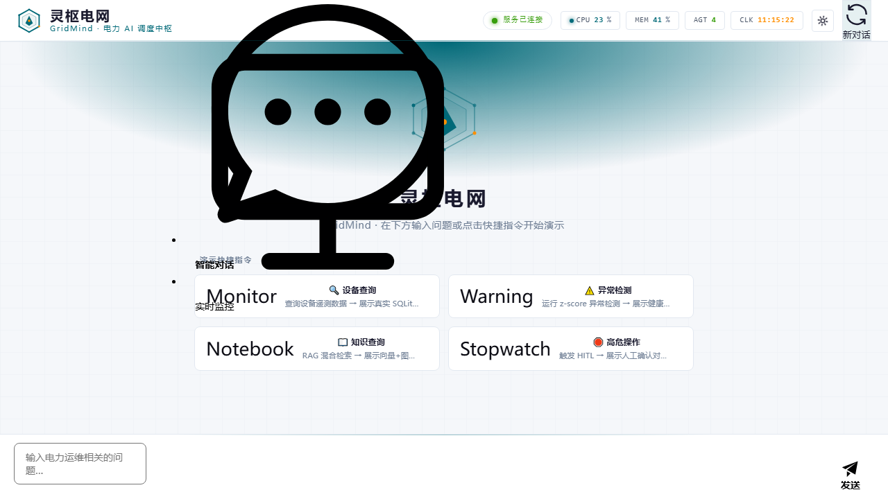

# GridMind · 灵枢电网

> **Multi-Agent 电网 AI 系统 v1.8.0（最终交付）** — 基于 **FastAPI + LangGraph** 构建，通过 **MCP 协议** 标准化工具调用、**Neo4j + NetworkX 双 backend 知识图谱**、**可解释性 AI 三层架构**、**HITL Edit & Continue**、**多用户 + RBAC 五角色 + 真实登录/注册**，覆盖设备监控 / 异常检测 / 安规核查 / 知识库问答 / 图谱问答 / 会话管理六大核心能力。



---

## 一、核心能力清单

| # | 能力 | 说明 |
|---|------|------|
| 1 | **多用户 + RBAC 五角色** | `dispatcher / operator / kb_admin / auditor / admin`；会话按 owner 隔离；端点×角色权限矩阵（后端权威，前端零硬编码） |
| 2 | **真实登录 / 注册** | `/auth/*` 7 端点：login / register / refresh（轮换）/ logout / me / change-password / dev-login；JWT access（仅内存）+ refresh（localStorage，轮换成链）；bcrypt 密码 + 锁定/限流/防枚举 |
| 3 | **per-session 模型** | 每个会话独立记忆模型选择（`threads.model_id ?? 全局`），切换会话不串模型 |
| 4 | **KB 来源引用链** | RAG 来源结构化引用（SourceRef 11 字段）、score 归一化 0-1、`citation_min_score=0.25` 拒答过滤 |
| 5 | **图谱问答 UI** | 实体识别 → 图谱检索 → 多跳路径 → 自然语言回答（NetworkX 内存图默认，Neo4j 启用即复用） |
| 6 | **会话管理 + 导出** | 会话列表/重命名/归档/恢复/软删；前端侧栏 + JSON/Markdown 导出 |
| 7 | **权限矩阵** | `GET /rbac/matrix` 单一权威定义序列化；用户管理页 Tab「权限矩阵」只读可视化 |
| 8 | **演示 / 标准模式** | `X-Display-Mode` header（standard/presentation）驱动 mock/真实 LLM 路径；`--mock` 一键演示 |
| 9 | **大屏接口预留** | `/bigscreen` 路由 + `isBigScreen` 计算属性扩展点（大屏 UI 待后续实现） |
| 10 | **可解释性 AI 三层架构** | LLM（Pydantic 围栏）+ 机理校验（5 种）+ 规则护栏（11 条）+ 融合（冲突检测/人工复核） |
| 11 | **HITL Edit & Continue** | 高危操作人工审批；编辑后自动 safety 重检；3 年审计留存 |
| 12 | **知识图谱 Neo4j + NetworkX 双 backend** | 539 三元组（88 节点 + 451 关系）；灰度切流 + 自动回滚 + 双向同步 |

---

## 二、技术栈

| 层 | 选型 |
|----|------|
| 后端 | Python 3.13+ · FastAPI · LangGraph（状态图 + checkpointer）· slowapi（IP 限流） |
| 前端 | Vue 3 · Vite · TypeScript · Element Plus · Pinia · ECharts |
| 知识图谱 | Neo4j 5.x（主）/ NetworkX（降级）双 backend · Chroma（向量库） |
| 向量库 | Chroma（本地持久化；生产可热切换 Milvus/PGVector） |
| LLM | DashScope 通义千问（qwen-plus 默认）+ DeepSeek 备用；MCP 协议工具暴露（FastMCP/SSE） |
| 认证 | JWT（HS256，access 15min / refresh 7d）+ refresh 轮换（SHA-256 落库）+ bcrypt（cost 12） |
| 数据 | SQLite（WAL + 幂等迁移）· Prometheus 指标（纯 stdlib 实现）· 钉钉告警 |

---

## 三、架构概览

### 3.1 系统架构图

```
┌─ 用户 (Web UI / curl / SSE Streaming) ──────────────────────┐
│           ↓ POST /chat · GET /chat/stream/{id}             │
┌─ FastAPI Server (端口 9900) ────────────────────────────────┐
│  LangGraph Supervisor + 4 Agents (monitor/safety/diagnosis/KG)│
│  HITL: interrupt() + checkpointer（AsyncSqliteSaver）        │
│  认证: /auth/* · 用户: /users* · RBAC: /rbac/matrix          │
│  会话: /sessions* · 审计: /audit/* · 灰度: /grayscale/*      │
│  /metrics (Prometheus) + /debug/sync_* + /admin/checkpoint-* │
└────┬────────────────────────────────────┬───────────────────┘
     │ langchain-mcp-adapters            │
┌────▼────────────────────────────┐  ┌──▼──────────────────────┐
│ MCP Tool Server (9901, FastMCP) │  │ 数据层                   │
│  monitor/safety/diagnosis/      │  │  ├─ SQLite (threads/     │
│  knowledge/neo4j/kg_reasoning   │  │  │  users/refresh_tokens/│
│  7 工具模块 · 18+ 工具         │  │  │  auth_audit_log/... )  │
└────┬────────────────────────────┘  │  ├─ Chroma (向量库)      │
     │                                │  ├─ Neo4j 5.x (主)      │
     ▼                                │  └─ NetworkX (降级)     │
┌─ Prometheus / Grafana (可选) ──────┐
│  抓取 GET /metrics (13+ 指标)      │
│  钉钉告警 (3 类场景 · 冷却去重)     │
└────────────────────────────────────┘
```

### 3.2 认证与会话隔离

- **JWT claims**：`sub`/`user_id` = users.id、`role` = 5 角色之一、`name`、`iss`/`iat`/`exp`；**绝不注入 `thread_id`**（防 owner 快速路径误伤）。
- **refresh 轮换**：每次刷新旧 token 立即作废（`revoked_at` + `replaced_by` 成链）；改密/禁用撤销全部 refresh；后端 `BEGIN IMMEDIATE` 原子轮换（同一 token 至多成功一次）。
- **owner 校验**：生产模式 `ensure_thread_owned`（懒登记 + 403/404 + 软删会话 404）；管理员角色 / `X-Admin-Token` 等效放行。

### 3.3 核心模块

| 模块 | 职责 | 关键文件 |
|------|------|---------|
| `api/` | FastAPI 服务 + LangGraph 状态图 + 认证/RBAC/会话/审计 | `main.py` · `graph.py` · `routers/{auth,users,rbac}.py` · `services/{auth_service,user_service,rbac_matrix,thread_store}.py` |
| `core/` | 领域算法引擎（异常检测 / RAG / KG / 可解释性 / 灰度 / 图谱问答） | `anomaly_detection.py` · `rag_engine.py` · `kg_client.py` · `kg_qa.py` · `diagnosis_orchestrator.py` |
| `mcp_tools/` | MCP 工具服务（FastMCP/SSE，7 模块 18+ 工具）+ SQLite 幂等迁移 | `server.py` · `db/database.py` · `tools/{monitor,safety,diagnosis,knowledge,neo4j,kg_reasoning}_tools.py` |
| `web/` | Vue 3 前端（登录/注册、会话侧栏、图谱问答、权限矩阵、审计、灰度面板） | `src/views/` · `src/stores/` · `src/api/`（共享 httpClient 401 自动 refresh） |
| `scripts/` | 一键启动（端口预检/就绪轮询/日志落盘/注册端点自检） | `start_all.py` · `start_mcp_only.py` · `seed_db.py` |
| `tests/` | 单元 + 集成 + e2e（pytest 817+ passed） | `test_auth_api.py` · `test_register_api.py` · `test_rbac_matrix.py` · `test_multiuser_ownership.py` 等 |

---

## 四、快速开始

### 4.1 前置条件

- **Python 3.13+**、**Node.js 18+**
- **可选**：Neo4j 5.x Docker（`python -m scripts.start_neo4j`）；无 Neo4j 时自动降级 NetworkX

### 4.2 安装

```bash
# 后端依赖
pip install -r requirements.txt

# 前端依赖
cd web && npm install && cd ..

# 初始化数据库（幂等；首次含种子数据 + 初始 admin）
python -m scripts.seed_db        # 或直接 start_all（内部自动 init_db + seed）
```

### 4.3 一键启动（推荐）

```bash
# 演示模式（无需 DashScope Key，LLM 走 Mock 路径）
python -m scripts.start_all --mock

# 完整模式（需 .env 配置 DASHSCOPE_API_KEY）
python -m scripts.start_all
```

一键启动自动完成：端口预检（9900/9901/5173）→ DB 初始化 → MCP 就绪轮询 → API 就绪轮询 → 注册端点自检 → 前端启动；日志落盘 `logs/{mcp,api,frontend}.log`。

### 4.4 手动启动

```bash
# 1) MCP 工具服务（9901）
python -m uvicorn mcp_tools.server:app --port 9901   # 或 python -m scripts.start_mcp_only

# 2) FastAPI API（9900）
python -m uvicorn api.main:app --host 0.0.0.0 --port 9900

# 3) 前端 Vite（5173）
cd web && npm run dev
```

### 4.5 服务端口

| 服务 | 端口 | URL |
|------|------|-----|
| API | 9900 | http://localhost:9900（Swagger UI: `/docs`） |
| MCP | 9901 | http://localhost:9901/sse |
| Web | 5173 | http://localhost:5173 |
| Metrics | 9900 | http://localhost:9900/metrics |
| Neo4j | 7687 | `bolt://localhost:7687`（可选） |

### 4.6 .env 关键配置

| 变量 | 说明 | 默认 |
|------|------|------|
| `DASHSCOPE_API_KEY` | 通义千问 LLM + embedding Key（LLM 功能必需） | `sk-placeholder` |
| `DEEPSEEK_API_KEY` | 备用 LLM（可选） | 空 |
| `JWT_SECRET` | JWT 签名密钥（**生产必须覆盖为强随机值**） | `gridmind-dev-secret-change-in-prod` |
| `ADMIN_TOKEN` | 灰度/管理端点 `X-Admin-Token`（**生产必须覆盖**） | `gridmind-admin-token` |
| `ADMIN_INITIAL_PASSWORD` | 初始 admin 密码（生产必配；无 admin 且未配 → 启动拒绝） | 空（dev 用 `Admin@123456`） |
| `DEFAULT_MODEL` | 默认 LLM 模型 | `qwen-plus` |
| `APP_ENV` | `production` 启用生产安全策略（强制 JWT + 密钥门禁） | `dev` |
| `LOGIN_RATE_LIMIT_PER_MINUTE` / `REGISTER_RATE_LIMIT_PER_MINUTE` | 登录/注册 per-IP 限流 | `10` / `5` |

---

## 五、认证与角色

### 5.1 认证流程

| 端点 | 说明 |
|------|------|
| `POST /auth/login` | 用户名+密码 → access + refresh；失败统一 401（防枚举）；禁用 403；锁定 423 + Retry-After |
| `POST /auth/register` | 开放注册（默认 `dispatcher`，注册即登录；请求体不含 role 防提权）；409/422/429 |
| `POST /auth/refresh` | refresh → 新 access + **轮换后**新 refresh（旧 token 立即作废，前端 401 自动刷新） |
| `POST /auth/logout` | revoke refresh（幂等） |
| `GET /auth/me` | 当前用户 + 密码过期提醒（dev 返回占位用户） |
| `POST /auth/change-password` | 改密（撤销该用户全部 refresh） |
| `POST /auth/dev-login` | **仅 dev**：按角色签发真实 JWT（生产 404 fail-closed） |

### 5.2 五角色说明

| 角色 | 会话 | 灰度 | KB 写 | KB 读 | 审计 | 系统配置 | 模型切换 |
|------|:---:|:---:|:---:|:---:|:---:|:---:|:---:|
| `dispatcher` 调度员 | ✓(本人) | ✗ | ✗ | ✓ | ✓(本人) | ✗ | ✓ |
| `operator` 运维 | ✓(本人) | ✓ | ✗ | ✓ | ✓(全部) | ✓ | ✓ |
| `kb_admin` 知识管理员 | ✓(本人) | ✗ | ✓ | ✓ | ✓(本人) | ✗ | ✓ |
| `auditor` 审计 | ✓(本人) | ✗ | ✗ | ✓ | ✓(全部) | ✗ | ✓ |
| `admin` 管理员 | ✓(全部) | ✓ | ✓ | ✓ | ✓(全部) | ✓ | ✓ |

> 矩阵实时由 `GET /rbac/matrix` 下发（后端单一权威，前端**零硬编码**权限布尔值）；实际访问仍由后端 `require_role` / `verify_*` 判定（前端矩阵只读，不承担安全边界）。

### 5.3 用户管理

- 初始 admin：lifespan `ensure_initial_admin` 幂等创建（`must_change_password=1` 首次登录强制改密）。
- `GET/POST /users`、`PATCH /users/{id}`（改角色/禁用/重置密码；最后一个 admin 禁止禁用/降级 409）。
- 前端 `/admin/users`（仅 admin 可见；`X-Admin-Token` 等效管理员，dev 放行）。

### 5.4 dev 调试

- dev 默认零登录体验：未登录访问受保护路由放行；`UserBadge` 提供「以 X 角色登录」下拉（调 `/auth/dev-login`）。
- 生产（`APP_ENV=production`）：路由守卫拦截未登录 → `/login?redirect=`；401 自动 refresh 失效 → 清 token 跳登录。

---

## 六、主要 API 概览

| 类别 | 端点 | 鉴权 |
|------|------|------|
| 对话 | `POST /chat` · `GET /chat/stream/{thread_id}` | `verify_jwt_if_prod` / owner |
| 历史 | `GET /thread/{thread_id}` | owner |
| 会话管理 | `GET /sessions` · `PATCH /sessions/{id}` · `POST /sessions/{id}/archive\|restore` · `DELETE /sessions/{id}` | owner / admin 全量 |
| 会话控制 | `POST /sessions/{id}/pause\|resume\|rewind\|abort` · `GET /sessions/{id}/events`（SSE） | owner |
| HITL | `POST /interrupt/{id}/approve\|reject\|decision` | owner |
| 认证 | `/auth/login` · `/auth/register` · `/auth/refresh` · `/auth/logout` · `/auth/me` · `/auth/change-password` · `/auth/dev-login` | 公开 / JWT |
| 用户管理 | `GET/POST /users` · `PATCH /users/{id}` | admin |
| 权限矩阵 | `GET /rbac/matrix` | admin（dev 放行） |
| 知识库 | `POST /knowledge/upload` · `GET /knowledge/uploads` · `DELETE /knowledge/uploads/{id}` · `GET/POST /knowledge/feature-intro` | KB 写=kb_admin/admin；读=全员 |
| 图谱问答 | `GET /api/kg-qa/ask`（图谱问答）+ 前端 GraphQAPanel | `verify_jwt_if_prod` |
| 诊断 | `GET /diagnosis/{thread_id}/reasoning`（三层融合推理链） | owner |
| 审计 | `GET /audit/hitl` · `GET /audit/hitl/{thread_id}` · `GET /audit/pending-count` | 角色过滤 / 公开 |
| 灰度 | `GET /grayscale/status\|history\|metrics` · `POST /grayscale/set\|manual_rollback` | operator/admin |
| 模型 | `GET /models` · `POST /models/switch`（支持会话级） | 全员 + owner |
| 系统 | `GET /admin/checkpoint-stats` · `GET /debug/sync_lag` · `POST /debug/sync_force` | operator/admin |
| 监控 | `GET /devices*` · `GET /health/scores\|critical` · `GET /metrics` · `GET /metrics/summary` | `verify_jwt_if_prod` / 公开 |

---

## 七、测试

### 7.1 运行

```bash
# 全部测试（基线 817 passed / 18 skipped，v1.8.0）
pytest tests/ -q -p no:cacheprovider

# 单文件 / 关键字过滤
pytest tests/test_auth_api.py -v
pytest tests/ -k "auth or rbac or register" -v
```

### 7.2 覆盖范围（tests/，~40 文件）

| 类别 | 测试文件 |
|------|---------|
| 认证（V1.8.0） | `test_auth_api.py` · `test_auth_db_migration.py` · `test_register_api.py` · `test_users_admin.py` · `test_refresh_concurrency.py`（final-audit 新增） |
| RBAC / 多用户 | `test_rbac_matrix.py` · `test_multiuser_ownership.py` · `test_thread_store.py` · `test_endpoint_auth_matrix.py` |
| 会话 | `test_session_models.py` · `test_session_mgmt_api.py` · `test_session_control.py` · `test_session_lock.py` · `test_multi_tab_lock.py` |
| 审计 / HITL | `test_audit_pending_count.py`（final-audit 新增）· `test_hitl.py` · `test_hitl_edit.py` · `test_hitl_schema_sync.py` · `test_sse_event_emitter.py` |
| 知识库 / 图谱 | `test_kb_upload_api.py` · `test_kb_citation_sources.py` · `test_kg_m0.py` · `test_kg_m1_*.py` · `test_kg_m2_*.py` · `test_kg_m3*.py` · `test_kg_qa_*.py` |
| 其它 | `test_admin_endpoints.py` · `test_demo_mode.py` · `test_checkpoint_*.py` · `test_ttl_cleanup.py` · `test_backend_integration_e2e.py` 等 |

---

## 八、部署

### 8.1 生产必配环境变量

```bash
export APP_ENV=production
export JWT_SECRET=$(openssl rand -hex 32)        # 必须强随机
export ADMIN_TOKEN=$(openssl rand -hex 18)       # 必须强随机
export ADMIN_INITIAL_PASSWORD=$(openssl rand -base64 18)  # 必须设置（无 admin 时启动拒绝）
export DASHSCOPE_API_KEY=sk-...                  # LLM 必需
```

> 生产模式安全门禁：`JWT_SECRET` / `ADMIN_TOKEN` 仍为公开默认值 → 启动拒绝（fail-closed）；`/auth/dev-login` 404；数据端点强制 JWT。

### 8.2 Docker

```bash
docker compose up -d          # 或 docker build -t gridmind .
```

`docker-compose.yml` / `Dockerfile` 已提供（API + MCP + Neo4j 一体化编排，Neo4j 凭据经容器注入）。

### 8.3 GitHub

- 仓库：`https://github.com/fengguadehaoda/GridMind`
- 推送脚本：`push-to-github.sh` / `push-to-github.ps1`

---

## 九、相关文档

- 架构 / 设计：`docs/`（auth-architecture、register-rbac、multiuser、session-mgmt、kb-citation、kg-qa、explainability-developer-guide、kg-m3b-perf-report 等）
- 版本记录：`RELEASE-NOTES.md`
- 依赖：`requirements.txt` / `requirements-dev.txt`

---

**项目版本**：v1.8.0（2026-08-11）· **API 版本**：`GET /` 返回 1.8.0 · **测试基线**：817 passed / 18 skipped · **RBAC 角色**：5 个 · **知识图谱**：88 节点 + 451 关系 + 539 三元组

---

## 附：已知依赖公告（工业化部署豁免记录 · 2026-08 审计）

### echarts GHSA-fgmj-fm8m-jvvx（moderate XSS，echarts < 6.1.0）

- **状态**：豁免（记录在案），echarts 保持 `^5.6.0`。
- **缓解措施**：唯一使用 echarts 的 `TopologyGraph.vue` 对进入 tooltip 的节点/边文本一律经 `escapeTooltip()` 转义，杜绝 HTML 注入向量。
- **升级计划**：后续版本排期升级 echarts 6.x（需回归拓扑图渲染 + tooltip 富文本样式）。
