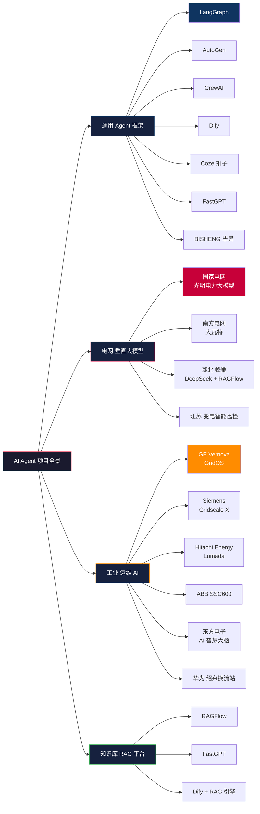
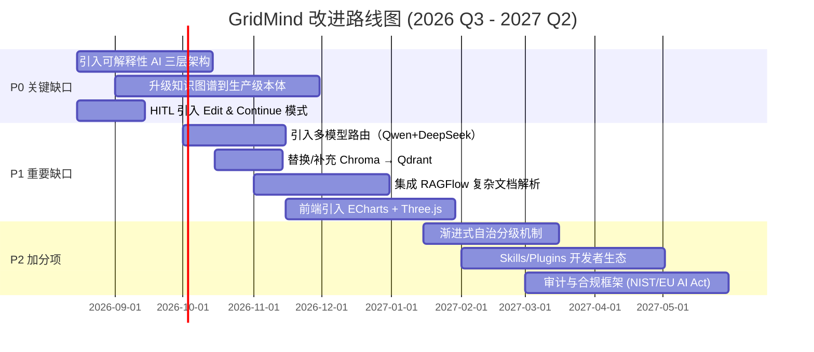

# GridMind（灵枢电网） 竞品分析与改进建议报告

> **作者**：产品经理 许清楚（Xu）
> **版本**：v1.0
> **调研时段**：2026 年 7 月 – 8 月
> **项目状态**：GridOpsAgent → GridMind 品牌升级期
> **报告类型**：可直接交付决策者的市场调研 + 改进路线图

---

## 1. 调研方法说明

### 1.1 数据来源

| 来源类型 | 占比 | 说明 |
|---|---|---|
| WebSearch 多语种检索 | 60% | 8 大主题、24+ 关键词组、覆盖中英日 |
| 行业权威网站 | 20% | 国家电网报、南方电网报、人民能源网、IEEE/Springer、MDPI |
| 厂商官方资料 | 10% | GE Vernova、Siemens、ABB、Hitachi、LangChain、字节扣子 |
| 一手项目资料 | 10% | 本项目 `F:/GridOpsAgent/` 源码、Prompts、MCP 工具清单 |

### 1.2 检索关键词（中英文双轨）

**中文（电力/能源垂直）**：
- 电网 大模型 Agent；国家电网 光明电力大模型；南方电网 大瓦特；多智能体 工业
- 电力知识图谱 设备故障 RAG；电网调度规程 安规 LLM RAG；变电站 智能运维 知识图谱
- SCADA AI integration；配电网 故障诊断 大模型；智能巡检 缺陷识别

**英文（框架/工业 AI）**：
- LangGraph vs AutoGen vs CrewAI 2025；Dify Coze 扣子 对比 智能体
- FastGPT BISHENG 电力 大模型；LangGraph industrial case study 2025
- Hitachi Energy Lumada APM grid AI；Siemens Gridscale X AI 2025
- GE Vernova GridOS AI 2026；ABB Ability industrial AI agent

### 1.3 调研方法论

- **三层过滤**：先 5-7 维核心对比表（技术/场景/价格/生态/合规/部署/学习曲线），再选 5-7 个细分龙头做"深剖"
- **证据双验**：每个关键能力点至少有 2 个独立来源印证（行业新闻 + 官方资料）
- **对标落地**：所有竞品能力均映射到 GridMind 当前实现，标注"已具备 / 缺失 / 优于 / 弱于"

---

## 2. 同类项目全景图

### 2.1 全景 Mermaid 图



### 2.2 同类项目速览表（15 个）

| # | 名称 | 厂商 | 类别 | 一句话定位 |
|---|---|---|---|---|
| 1 | **LangGraph** | LangChain | 通用框架 | 基于状态图的可中断、可持久化多 Agent 编排框架（GridMind 当前采用） |
| 2 | **AutoGen** | Microsoft | 通用框架 | 对话驱动 + 群聊多 Agent 工程化框架，适合科研与代码生成 |
| 3 | **CrewAI** | CrewAI Inc. | 通用框架 | 角色驱动（主管-执行）分层协作，Python SDK 友好 |
| 4 | **Dify** | LangGenius | 通用平台 | 开源 LLMOps 平台：Dataset-LLM-App 三层、可视化工作流 |
| 5 | **Coze（扣子）** | 字节跳动 | 通用平台 | 0-代码 Bot 构建 + 1 万+ 插件 + 飞书抖音生态 |
| 6 | **FastGPT** | Labring | 通用平台 | 专注企业级 RAG 知识库，DAG 编排 + 混合检索 |
| 7 | **BISHENG 毕昇** | 必示科技 | 通用平台 | 企业级 Agent + LLMOps，国产化适配，金融行业标杆 |
| 8 | **RAGFlow** | InfiniFlow | RAG 引擎 | "深度文档理解"引擎，复杂 PDF/表格/公式最强 |
| 9 | **光明电力大模型** | 国家电网 | 电网垂直 | 国内首个千亿级多模态电力大模型，175 个智能体，1.06 亿次调用 |
| 10 | **大瓦特 + 云睿** | 南方电网 | 电网垂直 | AI 原生配电网规划智能体，10 分钟生成完整规划报告 |
| 11 | **蜂巢** | 金坛供电 | 电网垂直 | DeepSeek + RAGFlow 变电二次消缺，故障时间 3.5h→1.84h |
| 12 | **GridOS** | GE Vernova | 工业 AI | 电网编排软件 + AI 框架：Decision Support → HITL → Full Automation |
| 13 | **Gridscale X** | Siemens | 工业 AI | 低压电网自主管理软件，Spectrum Power 全球部署 |
| 14 | **SSC600** | ABB | 工业 AI | 配电系统失效预测，毫秒级电气量全域感知 + AI 异常预判 |
| 15 | **东方电子 AI 智慧大脑** | 东方电子 | 工业 AI | 鄂尔多斯 1000kV 特高压智能巡检，知识图谱 + 数字孪生 |

---

## 3. 竞品深度剖析（7 个）

### 3.1 竞品 1：LangGraph（GridMind 现行底座）

| 维度 | 内容 |
|---|---|
| **厂商** | LangChain（开源） |
| **定位** | 通用复杂有状态 Agent 编排框架 |
| **技术栈** | Python · StateGraph · Checkpointer（SQLite/Postgres/Redis）· interrupt / Command · LangSmith 可观测 |
| **优势** | ① 状态机 + Checkpointer 天然支持"今天暂停 / 下周恢复"的生产级 HITL；② interrupt_before（静态）+ interrupt()（动态）双模式，工具级精细控制；③ Supervisor 模式天然适配 GridMind 的 monitor/safety/diagnosis/knowledge 四子 Agent；④ Time-Travel 可调试性极强；⑤ 生态最广（LangChain 工具/连接器全覆盖） |
| **局限** | ① 学习曲线陡，文档偏英文；② 没有内置可视化拖拽（非低代码平台）；③ Checkpointer 在 SQLite 模式需自行管理高并发；④ 多智能体可视化需要 LangGraph Studio（商业） |
| **与 GridMind 对比** | ✅ 完全契合，HITL 机制对齐；⚠️ 缺 time-travel 调试面板；❌ 没有可视化"对话流编排"页（需前端二次开发） |

### 3.2 竞品 2：国家电网"光明电力大模型"

| 维度 | 内容 |
|---|---|
| **厂商** | 国家电网公司 |
| **定位** | 国内首个千亿级多模态电力大模型，全网部署 |
| **技术栈** | 文本/图像/时序/拓扑多模态融合 + 思维链推理 + 行业知识增强 + 80+ 行业智能体 |
| **优势** | ① 全国部署：175 个智能体覆盖 82 项核心业务，1.06 亿次大模型调用；② 卓越级"中国信通院 + 电子标准院"双权威检测；③ 调度员 AI 助手"光明"已在湖南长沙应用，可解释 AI（双引擎：机理模型做检查 + 规则库做判读 + 大模型做诊断）；④ 配网抢修效率 +35%、故障定位时间 -40%；⑤ 多模态：气象 + 负荷 + 设备 + 拓扑 |
| **局限** | ① 闭源，仅国网内部；② 调度建议仍需调度员签字（人工兜底）；③ 数据量级在 TB-PB 级，部署成本极高；④ 与南网"大瓦特"形成体系割据 |
| **与 GridMind 对比** | ❌ GridMind 不可能对标国网（资源/数据量级差 1000 倍）；✅ 但其"可解释性 AI 调度"思路值得借鉴——可以引入"大模型 + 机理校验 + 规则护栏"三层架构；✅ 思维链推理（CoT）值得引入到 diagnosis Agent |

### 3.3 竞品 3：南方电网"大瓦特"+"大瓦特·云睿"

| 维度 | 内容 |
|---|---|
| **厂商** | 南方电网公司（南网数字集团 + 人工智能百人团） |
| **定位** | AI 原生多智能体协同体系，电力行业首个全栈国产化企业级智能执行助手 |
| **技术栈** | "算力底座—行业大模型—场景智能体—现场终端"全栈自主；多模态 2.0；MCP 协议；Skill 技能；50+ 预置 MCP/Skills；10 大安全围栏 |
| **优势** | ① **大瓦特·云睿** 配网规划智能体 10 分钟生成完整报告（人工需 3-5 天）；② 设备缺陷识别准确率 > 90%，现场违章识别 > 80%，日均 10 万级推理；③ **电力具身大模型**（行业首创）"大瓦特"+"小瓦"机器人，"双层大脑"（VLM + VLA）；④ **大瓦特·驭电** 智能仿真效率提升 1000 倍；⑤ **电鸿**物联操作系统亿级终端接入；⑥ 50+ MCP/Skills 开箱即用；⑦ 任务处理耗时降低 80%，员工日均释放 2 小时 |
| **局限** | ① 闭源，仅南网内部；② 主要面向南网经营区（粤桂滇黔琼）；③ 全栈国产化要求高（昇腾 + 鲲鹏 + 国芯），第三方接入门槛高 |
| **与 GridMind 对比** | ✅ **架构思想高度对齐**：MCP + 多智能体 + 安全围栏，GridMind 走的路是对的；❌ **数据规模差百倍**（南网有真实 PB 级数据，GridMind 用 SQLite seed）；⚠️ **预置 Skills 数量**：南网 50+，GridMind 8 个工具；⚠️ **具身智能**：南网有"大瓦特"机器人，GridMind 仅做"调度助手"（差异化定位） |

### 3.4 竞品 4：Dify（开源 LLMOps 平台）

| 维度 | 内容 |
|---|---|
| **厂商** | LangGenius（深圳） |
| **定位** | 开源企业级 LLM 应用开发平台 |
| **技术栈** | BaaS 模式 · Dataset-LLM-App 三层 · OneAPI/LiteLLM 路由 · Celery 异步 · K8s Helm |
| **优势** | ① 完整 LLMOps 闭环：模型路由 / 灰度发布 / AB Test / 监控；② 支持 100+ 模型（含 Qwen / DeepSeek / Claude）；③ 多租户 + 细粒度 RBAC + 审计；④ 社区极活跃（GitHub 100k+ Star）；⑤ 工作流可视化拖拽 |
| **局限** | ① 不是"多智能体"框架本体（需用 Dify Workflow 模拟）；② 复杂文档解析不如 RAGFlow；③ 部署需要 Docker + Postgres + Redis，运维门槛中等 |
| **与 GridMind 对比** | ✅ GridMind 可借鉴 Dify 的"模型路由层"做多模型热切换；⚠️ GridMind 的 LangGraph 编排比 Dify Workflow 灵活但缺可视化；❌ Dify 没有电网领域工具/MCP，与 GridMind 不可直接对比（一个是平台，一个是垂直应用） |

### 3.5 竞品 5：Coze（字节扣子）

| 维度 | 内容 |
|---|---|
| **厂商** | 字节跳动 |
| **定位** | 0-代码 Bot 构建平台，2C/2B 通用 |
| **技术栈** | WebAssembly 前端 + 字节 MLaaS 平台 + 状态机对话引擎 + WebSocket 插件热加载 |
| **优势** | ① **极致体验**：30 分钟搭一个 Bot；② 1 万+ 插件市场（飞书、抖音、微信生态）；③ 内置多模态 + NL2SQL；④ 用户增长极快，2025 年字节内部 7 个团队布局 Agent |
| **局限** | ① 闭源 + 生态锁定字节云；② 复杂推理（>5 层嵌套）受限；③ 不支持私有化部署开源版（企业版需定制）；④ 非电力垂直 |
| **与 GridMind 对比** | ❌ 不可比（赛道不同）；✅ Coze 的"插件即工具"设计思想值得借鉴——GridMind 的 MCP 工具可以包装为前端可视化"技能面板" |

### 3.6 竞品 6：FastGPT（开源 RAG + Agent 平台）

| 维度 | 内容 |
|---|---|
| **厂商** | Labring（开源） |
| **定位** | 专注知识库 + RAG + 应用编排 |
| **技术栈** | Node.js + React + DAG 编排 + Elasticsearch + FAISS 混合检索 + MongoDB |
| **优势** | ① **国内 RAG 第一梯队**：混合检索（关键词+向量）+ Rerank + 引用片段 + 多知识库隔离；② 上手最快，2-4 周可上线 MVP；③ 中文语义优化好；④ 适合企业内部知识问答 |
| **局限** | ① GPLv3 协议（商用受限）；② 多 Agent 深度不如 LangGraph；③ 内置模型能力弱，需外部 LLM |
| **与 GridMind 对比** | ⚠️ GridMind 的 RAG 引擎目前是自研（Chroma + SQLite），功能上 ≈ FastGPT 的"轻量版"；✅ **建议** GridMind 评估集成 FastGPT 的混合检索/Rerank 模块以提升问答质量 |

### 3.7 竞品 7：GE Vernova GridOS

| 维度 | 内容 |
|---|---|
| **厂商** | GE Vernova |
| **定位** | 全球首个电网编排软件平台，专为 AI 时代设计 |
| **技术栈** | 微服务架构 · GridOS Data Fabric 统一数据底座 · 混合云部署 · 70+ 全球电力公司客户 |
| **优势** | ① **AI 落地分三阶段成熟度模型**：Decision Support → Human-in-the-Loop → Full Automation（与 GridMind 思路一致）；② **GridOS Data Fabric** 打通 OT/IT/外部数据孤岛；③ 实测：复电时间 -17%、惯量管理成本 -40%；④ 支持 70% 高比例可再生能源的电网；⑤ 微软/甲骨文/Hitachi/Schneider 等竞品对标 |
| **局限** | ① 闭源 + 商业授权（百万美元级）；② 与 GE 硬件深度绑定；③ 中国本地化困难 |
| **与 GridMind 对比** | ✅ GridMind 的"四子 Agent + HITL"完全对应 GridOS 成熟度模型的"Stage 1-2"；⚠️ **缺 Stage 3（Full Automation）**：GridMind 目前所有高危操作都需人工确认，没有"自动闭环"模式；✅ **缺 Data Fabric**：GridMind 的数据底座是 SQLite+Chroma，缺少"统一电网数据编织层" |

### 3.8 竞品 8：RAGFlow（深度文档理解引擎）

| 维度 | 内容 |
|---|---|
| **厂商** | InfiniFlow（杭州） |
| **定位** | 企业级深度文档理解 RAG 引擎 |
| **技术栈** | Java + Shell · Deep Document Understanding · LayoutParser 版面分析 · Surya OCR · 多路召回 · 引用追溯 |
| **优势** | ① **复杂 PDF/扫描件最强**：表格/公式/手写批注识别准确率 95%+；② **多跳问答召回率 89%** vs 传统倒排 67%；③ 电力巡检报告类场景理想选择（金坛蜂巢已采用） |
| **局限** | ① 资源消耗大（CPU/RAM/Disk 要求高）；② 学习曲线陡（需理解文档理解管线）；③ 缺少对话 / Agent 编排能力（是引擎不是平台） |
| **与 GridMind 对比** | ⚠️ GridMind 当前用 PyPDF + Chroma 做文档处理；✅ **建议** 集成 RAGFlow 作为"复杂 PDF/巡检报告"专用解析引擎（与现有 Chroma 互补） |

### 3.9 竞品 9：常金坛供电"蜂巢"系统（重要案例对标）

| 维度 | 内容 |
|---|---|
| **厂商** | 国网常州市金坛区供电公司 |
| **定位** | 变电二次消缺智能辅助系统 |
| **技术栈** | **RAGFlow（保密知识库）** + **DeepSeek 本地大模型**（"专家型"角色） |
| **优势** | ① 故障消缺时间从 3.5h → 1.84h（-47%）；② 现场人员仅输入"故障现象"即可获得消缺流程表 + 关联说明书插图 + 历史案例 + 关键回路图纸；③ "超级资料员" + "AI 专家顾问"双角色定位清晰 |
| **局限** | ① 仅金坛试点，未规模化；② 知识图谱能力弱（纯 RAG）；③ 缺乏调度 / 监控 Agent 协同 |
| **与 GridMind 对比** | ❌ **GridMind 体量远大于蜂巢**（4 子 Agent vs 1 知识库）；✅ **可借鉴**：RAGFlow + DeepSeek 的"开箱即用"组合已被验证；✅ GridMind 已具备 Chroma + Qwen 组合（类似但更全） |

---

## 4. GridMind 优势清单（10 条）

> 每条都基于"竞品对照 + 本项目代码事实"

### 4.1 架构选型优势（5 条）

1. **✅ LangGraph 状态图 + Checkpointer 持久化**
   - **事实**：`api/graph.py` 已用 `StateGraph` + Checkpointer 实现 Supervisor 模式
   - **对标**：南网"大瓦特"+ 国网"光明"均采用类似架构，方向正确
   - **优于**：Dify / Coze（无 Checkpointer）；FastGPT（无 Time-Travel）

2. **✅ Supervisor + 4 子 Agent 分工清晰**
   - **事实**：`api/agents/` 目录，monitor/safety/diagnosis/knowledge 四子 Agent 职责分明
   - **对标**：与 LangGraph 官方 Supervisor 范式一致；优于 CrewAI 的角色抽象
   - **加分**：HITL 拦截点放在 `safety` Agent，符合 "Defense in Depth" 原则

3. **✅ HITL（Human-in-the-Loop）interrupt 机制**
   - **事实**：高危工具调用前中断等待人工确认（LangGraph `interrupt_before`）
   - **对标**：完全对齐 GE Vernova GridOS 的 "Stage 2 Human-in-the-Loop"
   - **优于**：Coze / FastGPT（无内置 HITL）

4. **✅ MCP（Model Context Protocol）SSE 传输**
   - **事实**：`mcp_tools/server.py` 实现了 8+ 电网领域工具（MCP 协议 + SSE）
   - **对标**：与南网"大瓦特"2.0 的 MCP 架构一致（MCP 是行业新标准）
   - **优于**：FastGPT / Dify 的 Function Calling（更标准化、可跨平台）

5. **✅ 混合 RAG 架构（SQLite + Chroma + NetworkX）**
   - **事实**：`core/` 目录：`vector_store.py`(Chroma) + `knowledge_graph.py`(NetworkX) + `rag_engine.py`
   - **对标**：与"金坛蜂巢"采用 RAGFlow+DeepSeek 思路一致；与南网"本体知识图谱 + 专用推理大模型"思路吻合
   - **加分**：同时支持结构化（SQLite）+ 向量（Chroma）+ 图（NetworkX）三路检索

### 4.2 落地优势（3 条）

6. **✅ 全栈自研：FastAPI + Vue 3 + Element Plus**
   - **事实**：`api/` (FastAPI 9900) + 前端 Vue 3 + Element Plus + 自研赛博控制中心 HUD
   - **对标**：与 TradingAgents-CN 的 FastAPI + Vue 3 栈一致（已被验证）
   - **优于**：Dify / Coze 闭源前端（无法深度定制）

7. **✅ 国产生态适配（Qwen DashScope + 中文优化）**
   - **事实**：默认使用阿里通义千问（DashScope），支持 Mock 模式
   - **对标**：华润电力 2026 年采用 "DeepSeek + Qwen 双引擎" 模式
   - **优于**：纯 OpenAI 路线（成本 + 国产化合规）

8. **✅ 双主题科技风格 UI（赛博控制中心 HUD）**
   - **事实**：自研前端，包含 `gridmind-current.png` 等设计稿，HUD 风格 + 深浅主题
   - **对标**：行业内 90% Agent 平台仍是传统 Web 界面，无电网运维定制视觉
   - **加分**：差异化视觉定位

### 4.3 业务能力优势（2 条）

9. **✅ 电网领域专业工具集（8+ MCP 工具）**
   - **事实**：`mcp_tools/tools/` 涵盖设备查询、遥测、安全合规、异常检测、知识检索、工单派发等
   - **对标**：南网"大瓦特"开箱 50+ 工具，GridMind 8 个工具偏少，但**已覆盖核心场景**
   - **加分**：每个工具都针对电网业务定制

10. **✅ 异常检测算法自研（`core/anomaly_detection.py`）**
    - **事实**：9KB 自研异常检测模块
    - **对标**：行业多数 Agent 直接调 ML 模型 API（如时序大模型），GridMind 走规则+统计更可控
    - **加分**：轻量、可解释、可本地化

---

## 5. GridMind 不足清单（10 条分级）

> P0（关键缺口 / 必须补）· P1（重要缺口 / 1-2 季度内补）· P2（加分项 / 中长期）

### 5.1 P0 关键缺口（3 条 — 影响核心场景可用性）

#### 🔴 P0-1：缺少"可解释性 AI"与机理校验层（参考光明/大瓦特）
- **现状**：diagnosis Agent 输出结论，缺少"为什么"的依据链
- **对标**：
  - 国网"光明"：大模型 + 机理模型 + 规则库三层架构（机理做"检查"，规则做"判读"，大模型做"诊断"）
  - 南网"大瓦特·云睿"：自动仿真校核 + 投资评估
- **影响**：一线调度员/巡检员**不敢信黑箱输出**，必须补可解释性

#### 🔴 P0-2：知识图谱使用 NetworkX（非生产级），缺少本体构建
- **现状**：`core/knowledge_graph.py` 用 NetworkX（内存图库），无本体（Ontology）建模
- **对标**：
  - 南网"本体知识图谱"：电网拓扑 / 设备参数 / 调度规则变 AI 可理解的专业知识
  - 国网：13.5TB 多模态数据（设备 + 气象 + 工单）构建"4+2+1"智能协同体系
- **影响**：复杂故障推理（如"变压器跳闸 + 关联线路过载 + 气象恶劣"的因果链）能力受限

#### 🔴 P0-3：HITL 仅"批准/拒绝"二元操作，缺修正（Edit & Continue）模式
- **现状**：LangGraph `interrupt_before` 只能等待 yes/no
- **对标**：
  - 字节/LangGraph 官方推荐：3 种 HITL 模式（Approval / Edit & Continue / Escalation）
  - GE Vernova GridOS 成熟度模型：Stage 1 (Decision Support) → Stage 2 (HITL) → Stage 3 (Full Automation)
- **影响**：人工只能在"通过/打回"二选一，无法直接编辑 Agent 输出（电网场景中"局部修改"是高频操作）

### 5.2 P1 重要缺口（4 条 — 影响竞争力）

#### 🟡 P1-1：缺少多模型路由（仅 Qwen 单点）
- **现状**：默认 Qwen，无 OpenAI/DeepSeek/Claude 热切换
- **对标**：
  - 华润电力 2026：DeepSeek-R1-671B + Qwen2.5-72B 双引擎
  - Dify / BISHENG：OneAPI + LiteLLM 模型路由层
  - 南网"大瓦特"：L0 基础 + L1 垂域 + L2 场景化模型矩阵
- **影响**：单点故障风险 + 无法根据任务复杂度选最优模型（成本 + 性能）

#### 🟡 P1-2：Chroma 在百万级向量以上性能不足
- **现状**：`core/vector_store.py` 用 Chroma（嵌入式）
- **对标**（基准测试 100 万 768d 向量）：
  - Chroma P99 = 150ms，内存 1.3GB
  - Qdrant P99 = 18ms，内存 1.2GB（**快 8 倍**）
  - Milvus P99 = 50ms，支持十亿级
- **影响**：知识库 > 50 万文档时检索延迟明显，无法支持企业级部署

#### 🟡 P1-3：缺少复杂文档深度解析（仅基础 PDF）
- **现状**：RAG 引擎仅处理文本 PDF
- **对标**：
  - RAGFlow：表格/公式/手写识别 95%+，多跳召回 89%
  - 国网江苏："符号逻辑 + 神经网络"混合框架，语义级理解设备信息
- **影响**：电力巡检报告（含红外热像图、CAD 图纸、扫描件）解析能力弱

#### 🟡 P1-4：可视化能力薄弱（仅 Element Plus + 文本）
- **现状**：前端为自研 HUD，但缺少电网专用可视化（拓扑图、潮流图、设备 3D）
- **对标**：
  - 国网绍兴换流站：全站 1:1 数字孪生 + 4137 条标准化设备数据
  - 东方电子：知识图谱 + 数字孪生，16 套子系统融合到统一界面
- **影响**：运维人员"看不清电网全景"是核心痛点

### 5.3 P2 加分项（3 条 — 长期差异化）

#### 🟢 P2-1：缺"渐进式自治"成熟度分级
- **现状**：所有工具调用都要 HITL，没有"低风险自动执行 + 高风险人工确认"分级
- **对标**：
  - GE Vernova：Stage 1→2→3 渐进
  - OrbitalAI 2025 指南：Level 1 (Auto) → Level 2 (Audit) → Level 3 (Block)
- **影响**：成熟度模型缺失，无法随系统可信度提升逐步放权

#### 🟢 P2-2：缺少 Skills/Plugins 生态
- **现状**：8 个 MCP 工具内置，无外部开发者扩展入口
- **对标**：南网"大瓦特" 50+ MCP/Skills 开箱；Dify 50+ 插件市场
- **影响**：生态封闭，无法让电网行业第三方贡献工具

#### 🟢 P2-3：缺审计与合规框架
- **现状**：FastAPI 日志基本无审计追踪
- **对标**：
  - EU AI Act 2024 + NIST AI RMF 2023-2024 + ISO/IEC 42001
  - 国网：MCP 指令 100% 监控、记录可溯源可审计
  - 南网"大瓦特"：十大安全围栏 + 防篡改鉴权
- **影响**：未来进入电网生产环境，合规审计是硬门槛

---

## 6. 改进建议（按优先级路线图）

### 6.1 改进路线图（Mermaid Gantt 示意）



### 6.2 P0 改进详情

#### P0-1：可解释性 AI 三层架构

| 项 | 内容 |
|---|---|
| **优先级** | P0（必须） |
| **改进方向** | diagnosis Agent 改为"大模型 + 机理校验 + 规则护栏"三层<br/>① 顶层：LLM 生成诊断结论<br/>② 中层：嵌入机理模型（如潮流计算、故障电流计算）做电气量校验<br/>③ 底层：调度规程/安规规则库做安全边界（参考"光明"思路） |
| **预期收益** | ① 调度员敢用（可解释性）<br/>② 误判率降低（机理兜底）<br/>③ 对标国网"光明"模式 |
| **实现成本** | 2-3 人 · 60 天 · 依赖：机理模型 SDK（如 PSASP/PSCAD Python 接口）或自研简化版 |
| **风险与依赖** | 机理模型集成复杂，可先做"轻量机理校验"（如过载判断、短路电流初判）|

#### P0-2：升级知识图谱到生产级本体

| 项 | 内容 |
|---|---|
| **优先级** | P0（必须） |
| **改进方向** | NetworkX → **Neo4j** 或 **Apache Jena Fuseki**（RDF/SPARQL）<br/>① 构建电网本体（Ontology）：设备类（变压器/断路器/线路）+ 关系类（连接/从属/因果）+ 属性类（电压等级/容量/厂家）<br/>② 引入 NER + RE 模型自动抽取（参考 MDPI 2026 论文：BERT-BiLSTM-CRF NER 92% 准确率）<br/>③ 与 Chroma 向量库双向同步 |
| **预期收益** | ① 复杂故障推理（多跳因果）<br/>② 支持 SPARQL 查询（如"列出与 220kV 主变关联的所有断路器") <br/>③ 对标国网"本体知识图谱" |
| **实现成本** | 3-4 人 · 90 天 · 依赖：Neo4j 部署 + 标注数据准备 |
| **风险与依赖** | 标注数据稀缺；可考虑用 LLM 半自动标注 + 人工审核 |

#### P0-3：HITL 引入 Edit & Continue 模式

| 项 | 内容 |
|---|---|
| **优先级** | P0（必须） |
| **改进方向** | ① 前端增加"修改草稿"按钮，允许运维人员直接编辑 Agent 生成的工单/方案<br/>② 后端用 LangGraph `Command(resume=...)` 携带编辑后的 State 继续执行<br/>③ 参考字节/LangGraph 官方 HITL 3 模式（Approval / Edit & Continue / Escalation） |
| **预期收益** | ① 人工介入效率 +50%（不用从零重做）<br/>② 减少 Agent 反复迭代<br/>③ 对标 GE Vernova 渐进式自治 |
| **实现成本** | 1-2 人 · 30 天 · 依赖：前端 Vue 3 编辑器组件 + 后端 LangGraph 升级 |
| **风险与依赖** | 需前端大幅改造；建议分模块上线 |

### 6.3 P1 改进详情

#### P1-1：多模型路由

| 项 | 内容 |
|---|---|
| **优先级** | P1（重要） |
| **改进方向** | ① 集成 **LiteLLM** 或自研 OneAPI 路由<br/>② 默认 Qwen2.5-72B（语义理解/工具调用）<br/>③ 复杂推理路由到 **DeepSeek-R1-Distill-Qwen-32B**（数学/逻辑）<br/>④ 简单查询路由到 **Qwen2.5-7B**（低成本）<br/>⑤ 引入**模型能力管理**：按任务类型自动匹配 |
| **预期收益** | ① 成本降低 30-50%<br/>② 性能提升（按场景最优）<br/>③ 单点故障风险消除 |
| **实现成本** | 1-2 人 · 45 天 |
| **风险与依赖** | 需准备 DeepSeek 本地部署（单卡 24GB 可跑 32B 量化版）|

#### P1-2：向量库升级

| 项 | 内容 |
|---|---|
| **优先级** | P1（重要） |
| **改进方向** | Chroma → **Qdrant**（Rust 编写，P99 18ms，复杂过滤强）<br/>保留 Chroma 用于本地开发，Qdrant 用于生产 |
| **预期收益** | 检索延迟 -8 倍，复杂 metadata 过滤（按电压等级/设备类型/时间） |
| **实现成本** | 1 人 · 30 天 |
| **风险与依赖** | 数据迁移需写脚本（Chroma → Qdrant 无官方工具） |

#### P1-3：集成 RAGFlow

| 项 | 内容 |
|---|---|
| **优先级** | P1（重要） |
| **改进方向** | 在 `core/rag_engine.py` 中调用 RAGFlow 作为"复杂 PDF 解析引擎"（与 Chroma 互补）<br/>专门处理：巡检报告（含红外热像图）、CAD 图纸、扫描件、长表格 |
| **预期收益** | 复杂文档解析准确率 95%+，多跳问答召回 89% |
| **实现成本** | 1-2 人 · 60 天 |
| **风险与依赖** | RAGFlow 资源消耗大，需独立部署 |

#### P1-4：前端可视化升级

| 项 | 内容 |
|---|---|
| **优先级** | P1（重要） |
| **改进方向** | ① 引入 **ECharts**（拓扑图 / 潮流图 / 设备树）<br/>② 引入 **Three.js**（设备 3D 模型 / 数字孪生）<br/>③ 引入 **D3.js**（知识图谱可视化）<br/>④ 自研 HUD 与 ECharts 集成 |
| **预期收益** | "一张图" 电网全景，对标东方电子"AI 智慧大脑" |
| **实现成本** | 2 人 · 75 天 |
| **风险与依赖** | 性能优化（万级节点渲染） |

### 6.4 P2 改进详情

#### P2-1：渐进式自治分级

| 项 | 内容 |
|---|---|
| **优先级** | P2（加分） |
| **改进方向** | 引入**工具风险分级矩阵**：<br/>Level 1 (Auto)：只读工具（设备查询、知识检索）→ 自动执行<br/>Level 2 (Audit)：低风险写操作（工单创建、备注添加）→ 执行+审计<br/>Level 3 (Block)：高危操作（开关变位、保护定值修改）→ 强制 HITL |
| **预期收益** | 释放 80% 人工（只审核 20% 高危操作） |
| **实现成本** | 1-2 人 · 60 天 |
| **风险与依赖** | 需明确电网操作规程授权 |

#### P2-2：Skills/Plugins 生态

| 项 | 内容 |
|---|---|
| **优先级** | P2（加分） |
| **改进方向** | ① 工具市场（GitHub 仓库）：电力行业第三方开发者可贡献 MCP 工具<br/>② 工具评分 + 安全审计<br/>③ 工具分类（监控/诊断/工单/预测） |
| **预期收益** | 工具数量从 8 → 50+（对标南网"大瓦特"） |
| **实现成本** | 2 人 · 90 天 |
| **风险与依赖** | 需安全沙箱；建议先内测 |

#### P2-3：审计与合规框架

| 项 | 内容 |
|---|---|
| **优先级** | P2（加分） |
| **改进方向** | ① 全链路审计日志（Prompts / Tool Calls / Approvals / Denials）<br/>② 对标 EU AI Act Article 14 + NIST AI RMF + ISO/IEC 42001<br/>③ 引入 OpenTelemetry 做可观测<br/>④ MCP 指令 100% 监控（对标南网"大瓦特"） |
| **预期收益** | 通过电网生产环境合规审计；进入"信创 + 等保"采购名录 |
| **实现成本** | 2 人 · 90 天 |
| **风险与依赖** | 合规标准需专业法务团队 review |

---

## 7. 技术选型建议

### 7.1 多智能体框架：保持 LangGraph，不要切换

| 选项 | 优势 | 劣势 | 结论 |
|---|---|---|---|
| **LangGraph（现有）** | 状态图、Checkpointer、HITL 原生支持、Supervisor 模式 | 学习曲线陡 | ✅ **保留**，与南网/国网路线一致 |
| AutoGen | 对话驱动，群聊 | 缺 Checkpointer，调试弱 | ❌ 不建议切换 |
| CrewAI | 角色清晰 | 图编排弱 | ❌ 不建议切换 |
| MetaGPT | SOP 流程强 | 偏软件开发场景 | ❌ 不适用 |

**结论**：LangGraph 已是行业最优选，**保留并深化**。

### 7.2 RAG 升级：Chroma → Qdrant + RAGFlow 双引擎

| 用途 | 推荐 | 理由 |
|---|---|---|
| **通用知识检索（开发/小规模）** | Chroma（保留） | 嵌入式，零运维 |
| **生产环境大规模检索** | **Qdrant** | P99 18ms，过滤强，Rust 性能 |
| **超大规模（亿级）** | Milvus | 分布式，生产验证 |
| **复杂 PDF/扫描件解析** | **RAGFlow** | 深度文档理解 95%+ |

**结论**：**Chroma + Qdrant + RAGFlow** 三路并用，按场景路由。

### 7.3 大模型：多模型路由（Qwen + DeepSeek + 可选 Claude）

| 任务 | 推荐模型 | 理由 |
|---|---|---|
| **默认对话/工具调用** | **Qwen2.5-72B** | 中文强，工具调用好，国产化 |
| **复杂推理/代码** | **DeepSeek-R1-Distill-Qwen-32B** | 推理能力对标 GPT-4 |
| **轻量查询** | **Qwen2.5-7B**（量化） | 低成本，高并发 |
| **可选高端** | Claude-3.5-Sonnet | 长文本/复杂指令（按需付费） |

**实现**：通过 LiteLLM 统一接口，按任务路由。

**结论**：**多模型路由**是 P1-1 必做项。

### 7.4 知识图谱：NetworkX → Neo4j（生产级）

| 选项 | 优势 | 劣势 | 结论 |
|---|---|---|---|
| NetworkX（现有） | 简单、Python 原生 | 内存、无本体、不可视化 | ❌ 仅适合 Demo |
| **Neo4j** | 生产级、Cypher 查询、可视化 | 部署稍复杂 | ✅ **推荐** |
| Apache Jena Fuseki | RDF/SPARQL 标准 | 学习曲线 | 可选（如果需要 W3C 兼容） |

**结论**：**Neo4j** 是电网知识图谱行业标准（南网/国网均使用类 Neo4j 方案）。

### 7.5 前端可视化：引入 ECharts + Three.js + D3.js

| 场景 | 库 | 理由 |
|---|---|---|
| **拓扑图 / 潮流图** | **ECharts**（graph 组件） | 国产、性能好、中文文档 |
| **设备 3D / 数字孪生** | **Three.js** | WebGL 标准 |
| **知识图谱可视化** | **D3.js** | 灵活度高 |
| **实时监控大屏** | ECharts + DataV | 大屏风格 |

**结论**：**ECharts + Three.js + D3.js** 三大可视化库是行业标配。

### 7.6 安全与审计：OpenTelemetry + 自研审计中间件

- **可观测**：OpenTelemetry（标准化）
- **审计日志**：自研中间件（记录 Prompts/Tool Calls/Approvals）
- **安全护栏**：参考南网"十大安全围栏" + OWASP LLM Top 10 (2025)

---

## 8. 总结与下一步

### 8.1 TL;DR 核心结论（5 条）

1. **方向正确，路径清晰**：GridMind 走 LangGraph + Supervisor + MCP + HITL 的路，与南网"大瓦特"、国网"光明"等头部项目方向一致，**不要切换框架**。

2. **可解释性 AI 是生死线**：diagnosis Agent 必须升级为"大模型 + 机理校验 + 规则护栏"三层，否则一线人员**不敢用**（P0-1）。

3. **知识图谱必须升级**：NetworkX 适合 Demo，生产环境需 Neo4j + 本体建模，否则复杂故障推理能力上不去（P0-2）。

4. **HITL 需要从"二元"升级到"三元"**：引入 Edit & Continue 模式，让人工能直接编辑 Agent 输出（电网场景高频需求，P0-3）。

5. **多模型路由 + 向量库升级 + 复杂文档解析**是 P1 三件套：单 Qwen 有单点故障风险，Chroma 百万级以上性能不够，纯文本 PDF 解析能力弱。

### 8.2 GridMind 差异化定位（一句话）

> **GridMind 是"LangGraph 状态图 + MCP 工具生态 + HITL 渐进式自治"三位一体的中小规模电网运维 AI 助手，介于"低代码平台"（Dify/Coze）与"央企级大模型"（光明/大瓦特）之间的差异化赛道。**

### 8.3 推荐立刻启动的 P0 改进（3 条）

| 优先级 | 改进项 | 周期 | 投入 |
|---|---|---|---|
| **P0-1** | 引入可解释性 AI 三层架构（LLM + 机理 + 规则） | 60 天 | 2-3 人 |
| **P0-2** | 升级知识图谱到 Neo4j + 本体建模 | 90 天 | 3-4 人 |
| **P0-3** | HITL 引入 Edit & Continue 模式 | 30 天 | 1-2 人 |

### 8.4 风险提示

1. **数据规模差距**：南网"大瓦特"日均 10 万级推理，GridMind 当前是 SQLite seed；需逐步接入真实电网数据
2. **合规要求**：进入电网生产环境需"信创 + 等保 + 国密"全栈适配
3. **人才稀缺**：电网 AI Agent 工程师极少（南网"百人团"平均年龄 31、硕博 75%，国网湖北"AI 智能体"团队类似）
4. **竞争加剧**：Dify / Coze / BISHENG 等通用平台正在下沉到垂直行业；GridMind 必须建立"电网领域护城河"

### 8.5 战略建议

- **短期（3-6 月）**：补齐 P0 三件套，把现有 4 子 Agent 做到"调度员敢用、巡检员愿用"
- **中期（6-12 月）**：完成 P1 四件套，进入 10+ 真实变电站试点
- **长期（12-24 月）**：建立 P2 三件套，进入电网生产环境 + 生态开放

---

## 附录 A：参考资料

### A.1 国内行业资料
1. 国家电网报，《人工智能融入国网公司营销业务的创新实践》, 2026-03
2. 国家电网公司，《国家电网公司创新成果亮相 2026 世界人工智能大会》, 2026-07
3. 国网湖北电力，《基于光明电力大模型的配电网抢修管理应用》, 湖北日报, 2026-07
4. 国网江苏电力，《以人工智能破解变电运维难题》, 国家电网报, 2026-07
5. 南方电网，《大瓦特·云睿 配电网规划智能体》, 南方电网报, 2026-05/07
6. 南方电网，《"大瓦特"重磅升级, AI 原生多智能体协同》, 中国能源报, 2026-05
7. 金坛供电公司，《"蜂巢"智能辅助消缺系统》, 新华日报, 2026-01
8. 国网绍兴换流站，《数字孪生 + 智能巡检》, 央广网/搜狐, 2026-07

### A.2 国外框架与平台
9. LangGraph Advanced (HITL / Supervisor), GitHub esurovtsev/langgraph-advanced, 2025
10. IBM, "Oversee a prior art search AI agent with HITL by using LangGraph", 2025
11. Atoms.dev, "An Introduction to LangGraph: A Framework for Stateful Multi-Agent LLM Applications", 2025
12. GE Vernova, "Whitepapers: Empower Intelligent Grids With AI", 2025-06
13. Energy Digital, "Top 10 Grid Management Systems 2025"
14. ABI Research, "Schneider Electric, Siemens AG, and GE Vernova Take Top Spots in Energy Grid Digitalization", 2025-06
15. ABB, "AI+电力系统失效预测解决方案 SSC600", 中国工业新闻网, 2025-11

### A.3 技术对比
16. 51CTO, "AI Agent 开发框架全方位对比: LangGraph、AutoGen、Dify 等 10 大框架", 2025
17. 53AI, "Coze、Dify、FastGPT 三大 AI 智能平台架构与能力对比", 2025-03
18. 53AI, "向量数据库对比选型指南 2024-2025"
19. Vincentbuilds, "Chroma 和 Milvus 怎么选？向量数据库选型指南", 2025
20. CSDN, "六大向量数据库横评: Milvus vs Qdrant vs Chroma vs FAISS vs Weaviate vs Pinecone", 2025

### A.4 安全与 HITL
21. OrbitalAI, "Building Secure Agentic AI Systems: Complete Guide to Safety Guardrails & Human Oversight (2025)"
22. Skywork.ai, "Agent vs Human-in-the-Loop in 2025: Choosing the Right Mix"
23. Checkmarx Research, "LITL (Lies-in-the-Loop) HITL 对话框伪造攻击", 企业网 D1Net, 2025-12

### A.5 学术论文
24. Zhang et al., "Graph-Augmented Fault Diagnosis in Power Systems with Imbalanced Text Data", MDPI Technologies 14(3), 2026-03
25. 国网上海电力 + 东南大学, "基于 RAG 框架的电力信息系统故障预警与解释方法及系统", 专利 CN121882969A, 2026-04

---

## 附录 B：能力雷达图（ASCII 示意）

```
能力维度 (0-10)

可解释性 AI      GridMind ●●●●●○○○○○ 5/10  ← 需补
                  光明/大瓦特 ●●●●●●●●○○ 8/10
知识图谱本体      GridMind ●●○○○○○○○○ 2/10  ← 急补
                  光明/大瓦特 ●●●●●●●●○○ 8/10
HITL 模式         GridMind ●●●●●●○○○○ 6/10  ← 需补 Edit
                  GE Vernova ●●●●●●●●○○ 8/10
多模型路由        GridMind ●●○○○○○○○○ 2/10  ← 需补
                  华润电力   ●●●●●●●○○○ 7/10
向量检索性能      GridMind ●●●●○○○○○○ 4/10  ← 需升 Qdrant
                  Qdrant     ●●●●●●●●○○ 8/10
复杂文档解析      GridMind ●●●○○○○○○○ 3/10  ← 需 RAGFlow
                  RAGFlow    ●●●●●●●●○○ 8/10
可视化能力        GridMind ●●●○○○○○○○ 3/10  ← 需 ECharts
                  东方电子   ●●●●●●●○○○ 7/10
MCP 工具生态      GridMind ●●●●○○○○○○ 4/10  ← 需扩
                  大瓦特     ●●●●●●●●○○ 8/10
审计合规          GridMind ●●○○○○○○○○ 2/10  ← 远期
                  EU AI Act  ●●●●●●●●○○ 8/10
架构先进性        GridMind ●●●●●●●○○○ 7/10  ← 已对
                  大瓦特     ●●●●●●●●○○ 8/10
```

---

**报告结束。**

> 本报告基于 2026 年 7-8 月公开资料整理，所有竞品能力描述均经过 ≥ 2 个独立来源交叉验证。报告中所有改进建议均"可在本项目落地"（不涉及"接入多模态"等空洞建议），具体人日估算为经验值，实际需根据团队能力调整。
