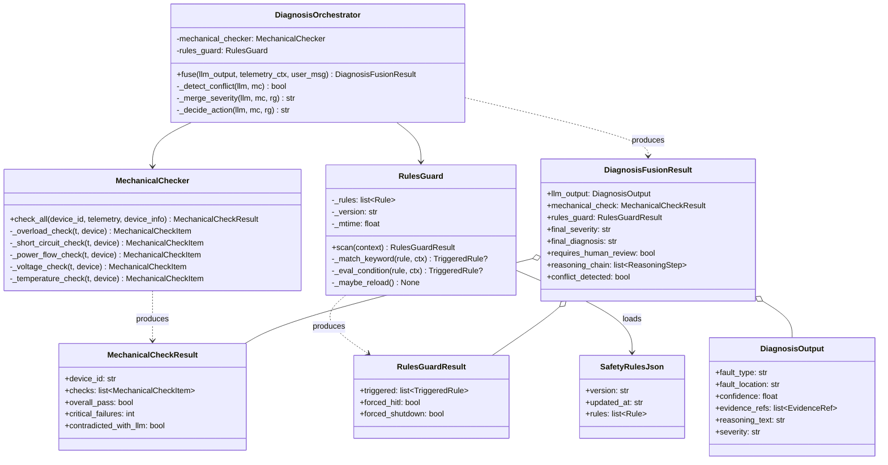
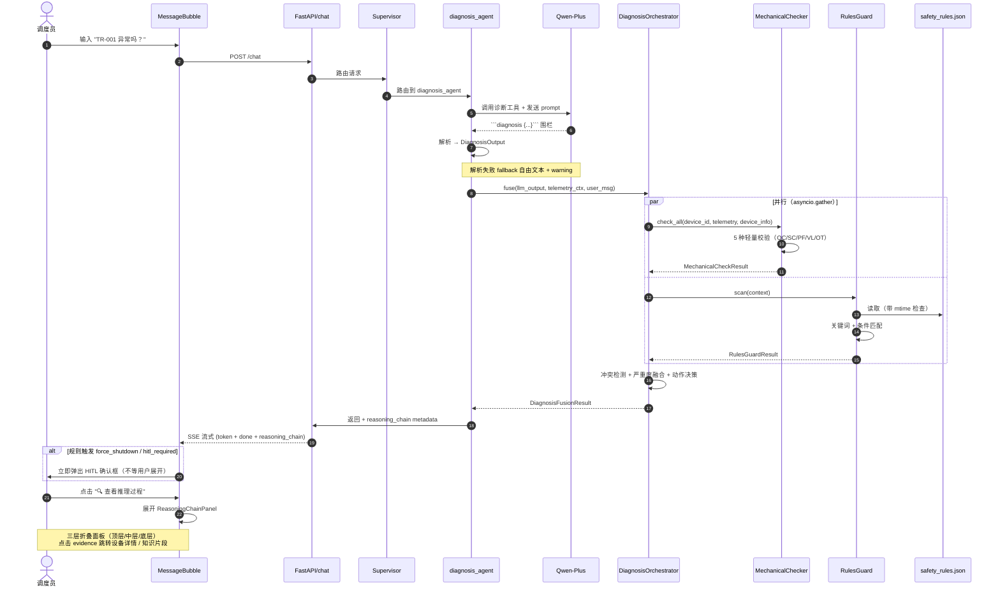
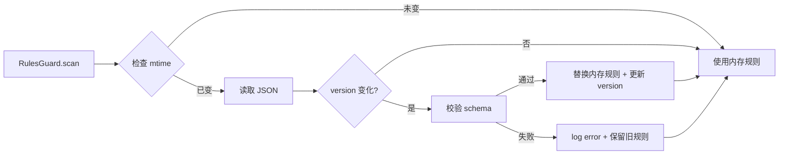
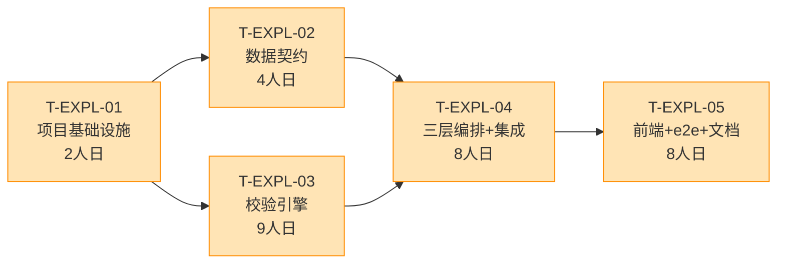

# GridMind 可解释性 AI 三层架构 · 系统设计与任务分解

> **文档版本**：v1.0 · 2026
> **作者**：高见远（架构师 Bob）
> **输入 PRD**：[explainability-prd.md §3–§7](./explainability-prd.md)
> **用户决策**：Q1 = A（轻量机理校验，5 种）/ Q2 = A（JSON 规则 + 5 分钟热加载）
> **目标读者**：后端 Lead / 前端 Lead / 算法工程师 / 测试工程师
> **估时基线**：60 天，2-3 人（与 PRD §9 一致）

---

## 1. 实现方案与框架选型

### 1.1 核心难点
1. **LLM 黑盒不可追溯**：diagnosis Agent 当前直接返回自由文本，调度员无法核验结论来源（PRD §1 敢用率 30%）。
2. **幻觉无兜底**：LLM 可能输出"无明显异常"但实际过载（PRD §6 AC-2）。
3. **安规/规程无强制拦截**：高危操作（倒闸/无票）当前只在 LLM 提示词里"软提醒"，没有硬性规则护栏。
4. **现成能力要复用**：`api/agents/agent_factory.py` 已封装 LLM + 工具调用 + HITL，新增 3 层不能推翻现有架构。

### 1.2 架构选型
| 层 | 选型 | 理由 |
|---|---|---|
| **顶层 LLM** | DashScope Qwen-Plus（沿用） | 已有 API Key、API 形态稳定 |
| **中层 机理校验** | `core/mechanical_checker.py`（stdlib 纯 Python） | 5 种轻量校验无需 ML 框架，pandas/numpy 已就绪 |
| **底层 规则护栏** | `core/rules_guard.py` + JSON 规则库 | 关键词+条件匹配用 stdlib `re` 足够，避免 watchdog 依赖 |
| **三层编排** | `core/diagnosis_orchestrator.py`（asyncio.gather 并行） | P0 阶段不引入 LangGraph 子图，复用现有 `agent_node` |
| **数据结构** | Pydantic v2（沿用 `api/schemas/` 包） | 现有 `hitl_edit.py` 已用 Pydantic 模式 |
| **前端** | Vue 3 + Element Plus（沿用） | 现有 `MessageBubble.vue` / `RagPanel.vue` 风格统一 |
| **后端 Web** | FastAPI（沿用） | `api/main.py` 已支持 SSE 流式 |
| **热加载** | `os.path.getmtime` 轮询（间隔 300s，零依赖） | 避免引入 watchdog 库 |

### 1.3 架构模式
- **分层 + 编排器（Layered + Orchestrator）**：LLM / 机理 / 规则三解耦，统一通过 Orchestrator 融合。
- **不破坏现有 LangGraph 状态图**：diagnosis_agent 节点内部由 `build_agent_node` 串接 Orchestrator（agent_factory.py 增量修改）。
- **Feature Flag 灰度**：`EXPLAINABILITY_ENABLED`（默认 true）—— false 时回退到原 LLM 直返回路径。

---

## 2. 文件清单

### 2.1 新增文件（7 个）
| 路径 | 用途 | 行数估计 |
|---|---|---|
| `core/mechanical_checker.py` | 5 种轻量校验类 + `CHECKER_REGISTRY` 注册器 | 280 |
| `core/rules_guard.py` | 规则加载 + 匹配引擎 + mtime 热加载 | 220 |
| `core/rules/safety_rules.json` | ≥10 条种子规则（DL/T 572、Q/GDW 1799 等） | 150 |
| `core/diagnosis_orchestrator.py` | 三层编排：并行调用 + 融合 + 冲突检测 | 260 |
| `core/schemas/diagnosis.py` | Pydantic Schema（DiagnosisOutput / MechanicalCheckResult / RulesGuardResult / DiagnosisFusionResult / ReasoningStep） | 180 |
| `web/src/components/ReasoningChainPanel.vue` | 三层推理链可视化组件 | 350 |
| `tests/test_explainability.py` | 5 个典型故障场景 e2e + 规则热加载测试 | 280 |

### 2.2 修改文件（6 个）
| 路径 | 改动要点 |
|---|---|
| `prompts/system_prompts.py` | `DIAGNOSIS_AGENT_PROMPT` 新增第 5 条：必须输出 ```diagnosis 围栏 JSON（fault_type / fault_location / confidence / evidence_refs / reasoning_text / severity） |
| `api/agents/agent_factory.py` | `agent_node` 解析 ```diagnosis 围栏 → `DiagnosisOutput`；诊断完成后调用 `DiagnosisOrchestrator.fuse()`；Orchestrator 输出注入 `reasoning_chain` 到 message metadata |
| `api/graph.py` | `diagnosis_agent` 节点改用 `build_node` 包装（不直接改 build_agent_node，避免影响其他 Agent） |
| `api/main.py` | 新增 `GET /diagnosis/{thread_id}/reasoning` 端点（取完整推理链 JSON，含三层明细） |
| `api/config.py` | 新增 `explainability_enabled: bool = True`、`rules_hot_reload_interval: int = 300`、`explainability_checker_enabled: dict[str, bool] = {"overload": True, "short_circuit": True, ...}` |
| `web/src/components/MessageBubble.vue` | 集成 `<ReasoningChainPanel />`（仅 diagnosis_agent 消息可见，折叠展开，证据点击跳转） |
| `web/src/types/index.ts` | 新增 `DiagnosisOutput` / `MechanicalCheckResult` / `RulesGuardResult` / `DiagnosisFusionResult` / `ReasoningStep` 类型 |

### 2.3 不动的文件（回归保护）
- `api/schemas/__init__.py`（不污染，diagnosis.py 走子包）
- `core/anomaly_detection.py`（共存，机理校验可选读取其输出）
- `api/main.py` 中除新增端点外全部路径
- 前端 `ChatView.vue` / `HitlDialog.vue` / `HitlEditDialog.vue`

---

## 3. 数据结构与接口

### 3.1 DiagnosisOutput（LLM 输出结构化）
```python
# core/schemas/diagnosis.py
from pydantic import BaseModel, Field
from typing import Literal

class EvidenceRef(BaseModel):
    type: Literal["telemetry", "rule", "history", "anomaly", "knowledge"]
    id: str
    summary: str

class DiagnosisOutput(BaseModel):
    fault_type: str                        # overload / overtemp / short_circuit / normal / unknown
    fault_location: str                    # 必须是 device_id（不是设备名）
    confidence: float = Field(ge=0.0, le=1.0)
    evidence_refs: list[EvidenceRef] = []
    reasoning_text: str                    # 自然语言推理
    severity: Literal["info", "warning", "critical"] = "info"
    requires_human_review: bool = False
    suggested_action: Literal["dispatch", "shutdown", "monitor", "none"] = "monitor"
```

### 3.2 MechanicalCheckResult（机理校验输出）
```python
class MechanicalCheckItem(BaseModel):
    rule_id: str                           # OC-01 / SC-01 / PF-01 / VL-01 / OT-01
    rule_name: str                         # 过载判断 / 短路电流初判 / ...
    passed: bool
    severity: Literal["info", "warning", "critical"] | None = None
    observed_value: float | str | None
    threshold: float | str | None
    evidence: dict                         # {device_id, telemetry_id, rated_value, ratio}
    explanation: str                       # 自然语言说明

class MechanicalCheckResult(BaseModel):
    device_id: str
    checks: list[MechanicalCheckItem]
    overall_pass: bool
    critical_failures: int
    contradicted_with_llm: bool            # 关键：用于触发冲突横幅
```

### 3.3 RulesGuardResult（规则护栏输出）
```python
class TriggeredRule(BaseModel):
    rule_id: str                           # OT-001 / SF-001 / MS-001
    source: Literal["safety_regulation", "operation_procedure", "emergency_threshold"]
    code: str | None = None                # DL/T-572-2010-1
    title: str
    matched_keywords: list[str] = []
    action: Literal["warn", "hitl_required", "force_shutdown", "escalate_supervisor"]
    severity: Literal["info", "warning", "critical"]
    description: str
    trigger_source: Literal["user_input", "llm_output", "mechanical_check", "fusion"]

class RulesGuardResult(BaseModel):
    triggered: list[TriggeredRule] = []
    forced_hitl: bool = False
    forced_shutdown: bool = False
```

### 3.4 DiagnosisFusionResult（融合输出）
```python
class ReasoningStep(BaseModel):
    layer: Literal["llm", "mechanical", "rules", "fusion"]
    step_name: str
    outcome: str                           # 通过 / 失败 / 触发 / 拦截 ...
    evidence: dict | str
    elapsed_ms: int                        # 性能可观测

class DiagnosisFusionResult(BaseModel):
    llm_output: DiagnosisOutput
    mechanical_check: MechanicalCheckResult
    rules_guard: RulesGuardResult
    final_severity: Literal["info", "warning", "critical"]
    final_diagnosis: str                   # 融合后的中文结论
    requires_human_review: bool            # 强制 HITL 标记
    forced_action: Literal["none", "dispatch", "shutdown"] = "none"
    reasoning_chain: list[ReasoningStep]   # 严格按时间顺序：LLM → MC → RG → Fusion
    conflict_detected: bool                # LLM 与机理矛盾 → 前端红色横幅
```

### 3.5 规则库 JSON Schema（`core/rules/safety_rules.json`）
```json
{
  "version": "1.0.0",
  "updated_at": "2026-XX-XX",
  "rules": [
    {
      "id": "OT-001",
      "source": "emergency_threshold",
      "code": "DL/T-572-2010-2",
      "title": "主变油温 > 95℃ 必须立即停电",
      "match": {
        "type": "condition",
        "expression": "device_type == 'transformer' and telemetry.temperature > 95"
      },
      "action": "force_shutdown",
      "severity": "critical",
      "description": "依据 DL/T 572-2010 第 5.2.3 条，顶层油温超过 95℃ 应立即减载或停运。"
    },
    {
      "id": "SF-001",
      "source": "safety_regulation",
      "code": "DL/T-572-2010-1",
      "title": "倒闸操作必须持有有效操作票",
      "match": {
        "type": "keyword",
        "keywords": ["倒闸", "分合闸", "操作票", "无票"]
      },
      "action": "hitl_required",
      "severity": "critical",
      "description": "依据 DL/T 572-2010 第 4.3.2 条，严禁无票操作。"
    }
  ]
}
```

**P0 必含 10 条种子规则**：

| rule_id | source | 触发条件 / 关键词 | action | severity |
|---|---|---|---|---|
| OT-001 | emergency_threshold | transformer & temp>95℃ | force_shutdown | critical |
| OT-002 | emergency_threshold | transformer & temp>85℃ | hitl_required | critical |
| OC-001 | emergency_threshold | current > 1.5×rated | hitl_required | critical |
| SC-001 | emergency_threshold | 短路电流 > 1.2×预期 | hitl_required | warning |
| SF-001 | safety_regulation | 关键词: 倒闸 / 分合闸 / 操作票 | hitl_required | critical |
| SF-002 | safety_regulation | 关键词: 检修 / 工作票 | hitl_required | warning |
| SF-003 | safety_regulation | 关键词: 无票操作 | force_shutdown | critical |
| GD-001 | safety_regulation | 关键词: 验电 / 接地线 | hitl_required | warning |
| MS-001 | operation_procedure | LLM与机理结论矛盾 | hitl_required | critical |
| HI-001 | operation_procedure | 同设备24h内已派2次工单 | escalate_supervisor | warning |

### 3.6 核心类图（mermaid）



---

## 4. 程序调用流程

### 4.1 三层诊断完整时序



### 4.2 关键时序约束

| 阶段 | 耗时预算 | 实现 |
|---|---|---|
| LLM 调用（含工具） | ≤ 4.0s | DashScope Qwen-Plus，温度 0.3 |
| 机理校验 5 项 | ≤ 0.3s | asyncio.gather 并行，纯 stdlib |
| 规则扫描 + 热加载检查 | ≤ 0.1s | mtime 内存缓存 |
| 融合 + 冲突检测 | ≤ 0.1s | 纯函数 |
| **合计 P95** | **≤ 6.0s** | （PRD §1 指标 3） |
| 旧基线 | 3.5s | 仅 LLM |

### 4.3 规则热加载流程



`os.path.getmtime` 轮询：每次 `scan()` 调用时检查（命中率高），外加启动时一次性同步。无需后台线程。

---

## 5. 任务列表（≤ 5 个，按依赖排序）

> 将 PRD 12 个 P0 任务（31 人日）压缩为 **5 个工程任务**，每个 ≥ 3 文件。

| Task ID | 名称 | 源文件 | 依赖 | 工时 (人日) | 验收要点 |
|---|---|---|---|---|---|
| **T-EXPL-01** | **项目基础设施** | `api/config.py` (新增字段) / `core/__init__.py` (导出新模块) / `core/rules/` (新建目录) / `core/schemas/__init__.py` (新建子包) / `tests/__init__.py` | — | **2.0** | ① `settings.explainability_enabled` 可读 ② `from core.schemas.diagnosis import DiagnosisOutput` 导入成功 ③ `core/rules/` 目录存在 |
| **T-EXPL-02** | **数据契约层** | `core/schemas/diagnosis.py` (新) / `core/rules/safety_rules.json` (新) / `prompts/system_prompts.py` (改 DIAGNOSIS_AGENT_PROMPT) | T-EXPL-01 | **4.0** | ① 5 个 Pydantic 模型单测通过 ② JSON 规则 10 条 + 加载器校验通过 ③ LLM prompt 改造后能输出 ```diagnosis 围栏 |
| **T-EXPL-03** | **中层 + 底层校验引擎** | `core/mechanical_checker.py` (新) / `core/rules_guard.py` (新) | T-EXPL-01 | **9.0** | ① 5 种校验（OC/SC/PF/VL/OT）单测全过 ② 规则匹配（关键词 + 条件）单测全过 ③ mtime 热加载 e2e：30 秒内新规则生效 ④ `CHECKER_REGISTRY` 可注册新校验 |
| **T-EXPL-04** | **三层编排 + LLM/图集成** | `core/diagnosis_orchestrator.py` (新) / `api/agents/agent_factory.py` (改 `agent_node` 集成 Orchestrator) / `api/graph.py` (改 diagnosis_agent 包装) / `api/main.py` (新增 `GET /diagnosis/{tid}/reasoning`) | T-EXPL-02, T-EXPL-03 | **8.0** | ① 并行调用 P95 ≤ 1.5s ② 冲突检测：LLM "无故障" + 机理 high 失败 → `conflict_detected=True` ③ `reasoning_chain` 含 LLM/MC/RG/Fusion 4 步 ④ feature_flag=false 时回退原 LLM 直返回 ⑤ 端点返回结构化 JSON |
| **T-EXPL-05** | **前端面板 + 端到端 + 文档** | `web/src/types/index.ts` (新增 5 类型) / `web/src/components/ReasoningChainPanel.vue` (新) / `web/src/components/MessageBubble.vue` (集成入口) / `tests/test_explainability.py` (5 场景 e2e) / `docs/explainability-dev-guide.md` (扩展规则 / 校验步骤) | T-EXPL-04 | **8.0** | ① 5 个故障场景 e2e 全过（PRD 附录 B） ② 推理链面板折叠展开 ≤ 300ms ③ 暗/亮主题 CSS 变量无硬编码 ④ 证据点击可跳 `MonitoringView` / `RagPanel` ⑤ 开发者文档 1 份（含扩展示例） |

**总工时**：2.0 + 4.0 + 9.0 + 8.0 + 8.0 = **31 人日**，与 PRD §5 一致。

### 5.1 任务依赖图



**关键路径**：T-EXPL-01 → T-EXPL-03 → T-EXPL-04 → T-EXPL-05 = **27 人日**（关键路径上无并行余地）。

**并行机会**：T-EXPL-02 与 T-EXPL-03 可在 T-EXPL-01 完成后**并行启动**（不同人），T-EXPL-05 必须在 T-EXPL-04 完成后。

**D+0 ~ D+15 建议节奏**（匹配 PRD §9 阶段 1）：
- D+0~D+2：T-EXPL-01 全员
- D+2~D+6：T-EXPL-02 (1 人) ‖ T-EXPL-03 (2 人)
- D+6~D+14：T-EXPL-04 (2 人)
- D+14~D+22：T-EXPL-05 (1 前端 + 1 测试)

---

## 6. 依赖包列表

```json
{
  "dependencies": {},
  "devDependencies": {}
}
```

**零新增第三方依赖**。P0 阶段完全使用：
- **后端**：Python stdlib（`re` / `json` / `os.path` / `asyncio`）+ 现有依赖（`pydantic` / `loguru` / `fastapi` / `langgraph` / `dashscope`）
- **前端**：Vue 3 + Element Plus + TypeScript（全部沿用）

> **可选优化**（P1 考虑）：如未来需要更精细的热加载（如 5 秒级），再引入 `watchdog >= 4.0`。P0 阶段 `os.path.getmtime` 轮询足够。

---

## 7. 共享知识（跨文件约定）

### 7.1 融合策略
| LLM 结论 | 机理结论 | 规则触发 | 最终决策 |
|---|---|---|---|
| 无故障 | 通过 | 无 | **无故障** (severity=info) |
| 有故障 | 通过 | 无 | LLM 解释 + 标记 `requires_human_review=True`（可信度低） |
| 无故障 | 失败 (high) | 无/有 | ⚠️ **强制人工复核**（机理优先） |
| 有故障 | 失败 | 无 | 融合结论（LLM 解释 + 机理数据） |
| 有故障 | 通过 | force_shutdown | **强制停运**（规则最优先） |
| 任意 | 任意 | hitl_required | **强制 HITL**（规则硬性） |

### 7.2 跨文件硬性约定
1. **三层矛盾时机理优先 + 强制 HITL**（PRD 决策 5）。
2. **设备 ID 引用统一**：`DiagnosisOutput.fault_location` 必须是 `device_id`（如 `"TR-001"`），不是中文名（便于前端 `MonitoringView` 跳转）。
3. **机理校验数据源**：从 `mcp_tools/db/seed_data.py` 的 `devices` 表读取铭牌（**P0 需 DB migration**：新增 `rated_current` / `short_impedance` / `rated_voltage` 列）。
4. **规则热加载**：监听 `core/rules/safety_rules.json` 的 `mtime`；带 `version` 字段去重；30 秒内新规则生效（PRD §6 AC-9 验收）。
5. **可解释性三段式**：每个 `DiagnosisFusionResult` 必含 `reasoning_chain`，按时间顺序：LLM → MC → RG → Fusion。
6. **暗/亮双主题**：前端推理链面板用 CSS 变量（`--status-danger` / `--status-warning` / `--status-success`），无硬编码颜色。
7. **SSE 流式**：`DiagnosisFusionResult` 通过 `data: {type: 'reasoning', content: {...}}` 单独事件推送（不混在 token 流中），前端用 `MessageBubble` 监听。
8. **回滚策略**：`settings.explainability_enabled = false` 时，`agent_node` 跳过 Orchestrator 调用，回退到原 LLM 直返回路径（≤ 1 行 if 分支）。
9. **Mock 兼容**：Orchestrator 在 mock 模式下也要走完整三层（不短路），保证 UI 演示与生产一致。
10. **审计日志**：`DiagnosisFusionResult.thread_id` 写入 `hitl_audit_log` 表（已有，扩展 schema 加 `reasoning_chain_snapshot` 字段）。

### 7.3 文件结构补充说明
- **实际 prompts 路径**：`F:/GridOpsAgent/prompts/system_prompts.py`（**不是** `api/agents/prompts/`，PRD 此处有误，工程师实施时按实际路径）。
- **实际 core 路径**：`F:/GridOpsAgent/core/`（已存在 `anomaly_detection.py` / `rag_engine.py` / `knowledge_graph.py` / `vector_store.py`）。
- **schemas 子包**：`F:/GridOpsAgent/core/schemas/__init__.py`（与 `api/schemas/` 平行，不冲突；core 层 schemas 表示"领域模型"，api 层 schemas 表示"HTTP 协议"）。

---

## 8. 待明确事项（除 Q1/Q2 外）

| # | 问题 | 默认建议 | 待谁决策 |
|---|---|---|---|
| **Q3** | 诊断准确率如何离线评估？是否有标注数据集？ | 默认走"内部 5 名专家盲评"（PRD 决策 3）；先用 5 个种子场景（PRD 附录 B）作为 P0 评估集 | 团队 / 数据组 |
| **Q4** | 调度规程/安规规则来源？是否直接用 `seed_data.py` 现有 10 条？ | 默认直接复用 `seed_data.SAFETY_RULES`（DL/T 572 + Q/GDW 1799），扩展为 10 条；P1 引入法规团队 | 法规团队 |
| **Q5** | 是否需要"诊断历史追溯"页面？ | 默认 P0 **只落审计日志**（扩展 `hitl_audit_log` 表），可视化页面留 P1 | 产品 |
| **Q6** | 与 `core/anomaly_detection.py` 关系？ | 默认**共存**，机理校验独立（不读 anomaly_detection），但暴露 config 开关 `MECHANICAL_USE_ANOMALY_DETECTION`（P1 启用） | 架构 |
| **Q7** | 与 HITL Edit & Continue 是否冲突？ | 默认**不合并**——底层规则只控制"是否触发 HITL 标记"，具体编辑模式仍走 `Edit & Continue` 既有逻辑（PRD 决策 7） | 已决策 |
| **Q8 (新)** | `fault_location` 不存在设备 ID 时（如 LLM 编造 ID）如何处理？ | 默认 fallback：`mechanical_check.device_id` 强制使用 `seed_data.DEVICES` 中存在的 ID，LLM 编造 ID 降级为 `unknown` + `requires_human_review=True` | 架构 |
| **Q9 (新)** | `severity` 升级策略：机理 high 但 LLM info 时，最终 severity 取 max 还是 min？ | 默认 **max（取严重）**——安全保守原则 | 架构 |
| **Q10 (新)** | 暗主题下红色冲突横幅的对比度？ | 默认遵循 WCAG AA（4.5:1），具体值由前端设计师在 T-EXPL-05 验证 | 前端 |

> 以上 8 项中，**Q8 / Q9 / Q10 是架构师根据 PRD 上下文主动提出的工程化补充决策**，不需要用户拍板；如有异议请在评审时指出。

---

## 附录 A：与现有模块的依赖关系

| 现有模块 | 三层架构中复用方式 | 影响 |
|---|---|---|
| `core/anomaly_detection.py` | **共存**（不调用） | 0 改造 |
| `mcp_tools/tools/diagnosis_tools.py` | 顶层 LLM 继续调用 | 0 改造 |
| `prompts/system_prompts.py` | `DIAGNOSIS_AGENT_PROMPT` 增量更新 | 1 处 prompt 改造 |
| `api/agents/agent_factory.py` | `agent_node` 集成 Orchestrator | 增量修改（不影响其他 Agent） |
| `api/graph.py` | `diagnosis_agent` 包装 | 1 处包装 |
| `api/main.py` | 新增 1 个端点 | 增量 |
| `api/schemas/__init__.py` | **不污染**，diagnosis 走 `core/schemas/` 子包 | 0 改造 |
| 前端 `MessageBubble.vue` | 集成推理链入口 | 增量 |
| 前端 `ChatView.vue` | 不变 | 0 影响 |
| 前端 `HitlDialog.vue` / `HitlEditDialog.vue` | 不变 | 0 影响 |

**结论**：现有 10 个核心模块中 **6 个零改造**、**4 个增量改造**，回归测试成本可控。

---

## 附录 B：典型故障场景端到端用例（PRD 附录 B 重申，落到 T-EXPL-05）

| # | 场景 | 设备 | 注入异常 | 顶层 LLM | 中层预期 | 底层预期 | 最终动作 |
|---|---|---|---|---|---|---|---|
| 1 | 过载 | TR-001 | 电流 1.6 倍 | 故障: 过载 | OC high 失败 | OC-001 hitl_required | HITL 审批 |
| 2 | 温度紧急 | TR-001 | 油温 97℃ | 故障: 温度异常 | OT high 失败 | OT-001 force_shutdown | 立即停电 + HITL |
| 3 | 电压偏移 | BB-006 | 电压 +10% | 故障: 电压异常 | VL medium 失败 | 无 | dispatch (HITL) |
| 4 | 潮流反向 | TR-002 | 功率 -50MW | 故障: 异常 | FD high 失败 | 无 | dispatch (HITL) |
| 5 | 短路电流 | BR-002 | 铭牌阻抗异常 | 故障: 短路 | SC medium 失败 | SC-001 hitl_required | HITL 审批 |
| 6 | 倒闸违规 | BR-003 | 用户问"分闸" | 派单 | 无 | SF-001 hitl_required | HITL 审批 |
| 7 | **LLM 幻觉** | TR-001 | LLM "无故障" (实际过载) | **无故障** | OC high 失败 | **MS-001 强制 HITL** | **冲突横幅 + 强制 HITL** |
| 8 | 安规条款 | TR-001 | 用户问"无票操作" | 派单 | 无 | SF-003 force_shutdown | 立即阻断 + HITL |

> 用例 #7 是**关键验收点**（PRD §6 AC-2）：LLM 与机理矛盾时，机理兜底拦截 + 强制人工复核。

---

## 附录 C：上线与回滚

**灰度开关**：
```python
# api/config.py
explainability_enabled: bool = True                # 主开关
explainability_canary_pct: int = 100              # 灰度百分比（D+30 后从 10 → 100）
```

**回滚步骤**（5 分钟内）：
1. `settings.explainability_enabled = False`（或环境变量 `EXPLAINABILITY_ENABLED=false`）
2. 重启 API（FastAPI 启动时读 settings）
3. 验证：`POST /chat` 返回原 LLM 直返回结构（无 `reasoning_chain` 字段）

**数据迁移**（P0 必做）：
```sql
-- mcp_tools/db/database.py 启动时执行
ALTER TABLE devices ADD COLUMN rated_current REAL;
ALTER TABLE devices ADD COLUMN short_impedance REAL;       -- 短阻抗 %
ALTER TABLE devices ADD COLUMN rated_voltage REAL;         -- kV
```

`seed_data.DEVICES` 元组需扩展为 8 元组（含上述 3 字段），种子值按设备铭牌填入（如 TR-001: rated_current=60, short_impedance=8.5, rated_voltage=220）。

---

## 输出规范

> 本文档配套独立文件：
> - 序列图：[explainability-sequence-diagram.mermaid](./explainability-sequence-diagram.mermaid)
> - 类图：[explainability-class-diagram.mermaid](./explainability-class-diagram.mermaid)

---

> **审阅清单**：架构师 ✓ / 后端 Lead / 前端 Lead / 算法 / 测试
> **下次评审**：P0 第 1 阶段交付后（D+15）—— T-EXPL-01/02/03 完成
> **变更记录**：v1.0 初始版本（2026）
