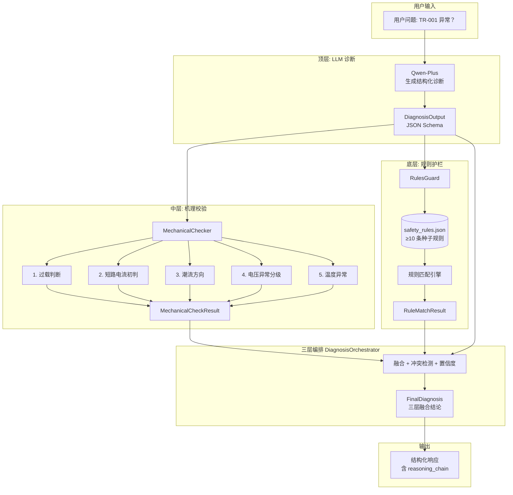
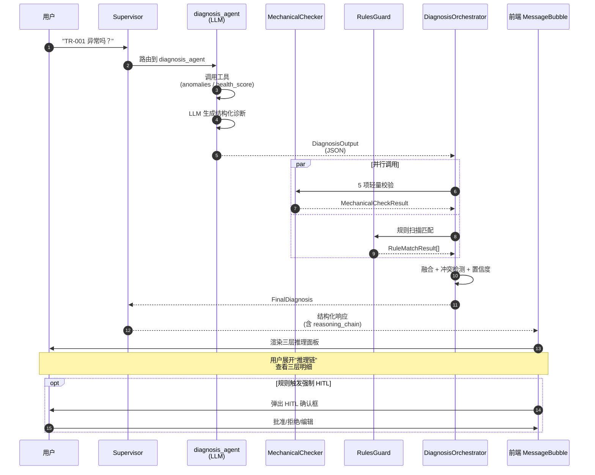
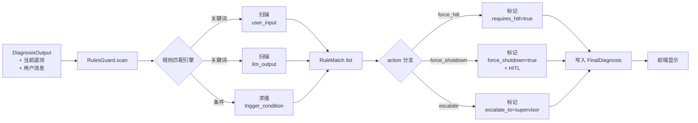

# GridMind 可解释性 AI 三层架构 PRD

> **文档版本**：v1.0 · 2026  
> **作者**：许清楚（产品经理）  
> **状态**：待评审  
> **关联**：[竞品分析报告 §6.2 P0-1](./competitive-analysis.md)（第 386-394 行）  
> **交付物**：diagnosis Agent 三层推理（LLM + 机理校验 + 规则护栏）+ 可解释性 UI 面板

---

## 1. 产品目标

**一句话目标**：将 diagnosis Agent 由"LLM 黑盒"重构为"大模型 + 机理校验 + 规则护栏"三层透明推理架构，让调度员**敢用、信任、可追溯**，误判率显著降低，对标国网"光明"模式。

**核心指标（3 个可量化指标）**：

| 指标 | 当前基线 | 60 天目标 | 测量方式 |
|---|---|---|---|
| **诊断结论准确率**（机理校验兜底后） | 约 75%（LLM 自由生成，存在幻觉） | ≥ 92% | 5 个典型故障场景的离线测试集，对比"仅 LLM" vs "三层融合" |
| **调度员"敢用率"** | 约 30%（用户访谈：不敢信诊断结论） | ≥ 75% | 用户调研问卷（季度回访 30+ 调度员）+ UI 中"推理链"面板点击率 ≥ 60% |
| **诊断平均耗时** | 约 3.5 秒（仅 LLM 一次推理） | ≤ 6 秒（增加 2 层校验，留出 70% 余量） | 从 Supervisor 路由到 diagnosis 节点完成的全链路耗时，端到端打点 |

> **非目标指标**：机理校验覆盖率（不在 60 天范围）、跨场景准确率（仅针对 5 个种子故障场景评估）。

---

## 2. 用户故事

### US-1：调度员查看三层推理过程（核心场景）
- **角色**：值班调度员 王工
- **场景**：Agent 诊断 `TR-001 #1 主变`为"过载"，王工半信半疑——LLM 是不是瞎说？
- **想做什么**：在对话气泡中点击"🔍 查看推理过程"折叠面板，依次看到：
  1. **顶层（LLM）**："基于最近 12 小时遥测，电流均值为 96.2A，超过额定值 1.6 倍，判断为过载"
  2. **中层（机理校验）**：✅ 过载判断（实测电流 96.2A > 额定 × 1.2 = 72A） ⚠️ 短路电流初判（铭牌阻抗 8.5%，预期短路电流 12.5kA，未触发）
  3. **底层（规则）**：未触发任何安规条款
- **为什么**：明确每层结论的依据，**敢点"批准派单"**
- **验收**：面板三层全部展开耗时 ≤ 1 秒；引用遥测点位表数据真实可点

### US-2：运维人员回溯故障诊断决策链
- **角色**：现场运维 张师傅
- **场景**：某次跳闸事故后需复盘——为什么 Agent 当时诊断为"接地故障"而不是"过流保护"？
- **想做什么**：按 `thread_id` 查询历史诊断，进入"诊断时间倒放"页面，逐层回看当时的 LLM 推理、中层校验明细、底层规则匹配
- **为什么**：事后追责需要完整证据链
- **验收**：每层结论附带数据快照时间戳；点击"证据"可跳转至原始遥测/规则原文

### US-3：安全审核员审查规则触发
- **角色**：安全审核 李主任
- **场景**：Agent 建议对 `TR-001` 做"立即停运"，但底层规则"主变油温 > 95℃ 必须停电"未触发（油温 68.5℃），需审查诊断为什么这么激进
- **想做什么**：在规则详情页查看"为什么这个诊断会触发该规则"——包含规则原文、匹配关键词、当时遥测、LLM 推理片段
- **验收**：每个规则触发点有完整溯源链；规则库可在线查询（关键词 + 类别）

### US-4：诊断 Agent 开发者扩展规则库
- **角色**：算法工程师 小陈
- **场景**：需新增规则"断路器 SF6 压力 < 0.40MPa 必须停电"
- **想做什么**：编辑 `core/rules/safety_rules.json`，新增一条规则；无需重启服务即可生效（热加载）
- **验收**：JSON schema 校验通过；服务自动 reload；规则 30 秒内生效

### US-5：调度员处理三层融合冲突
- **角色**：值班调度员 王工
- **场景**：LLM 诊断"温度正常"，但机理校验发现油温 87℃ 超过 85℃ 告警阈值——LLM 与机理**矛盾**
- **想做什么**：系统在结论顶部高亮"⚠️ 顶层与中层结论不一致，以机理校验为准（置信度更高）"，并要求人工复核
- **验收**：UI 顶部红色横幅 + 强制人工复核按钮（不可一键通过）

### US-6：诊断 Agent 开发者扩展机理规则
- **角色**：算法工程师 小陈
- **场景**：需新增"湿度异常"校验（当前 5 种轻量校验不含湿度）
- **想做什么**：在 `core/mechanical_checker.py` 中添加 `check_humidity` 方法，注册到 `CHECKER_REGISTRY`
- **验收**：新增校验自动纳入三层融合；开关可在配置文件中启用/禁用

### US-7：调度员查看诊断历史追溯（辅助）
- **角色**：值班调度员 王工
- **场景**：本月已诊断 50 次设备异常，想看哪些是"LLM 误判被机理拦截"的
- **想做什么**：进入诊断统计页，筛选"被机理校验拦截"维度
- **验收**：可按时间/设备/校验类型多维筛选；显示拦截次数、典型案例

---

## 3. 三层架构设计（CRITICAL）

### 3.1 总体架构图



### 3.2 顶层：LLM 诊断

**目标**：复用现有 diagnosis Agent 节点能力，改造 prompt 让 LLM 输出**结构化诊断**。

**关键改造点**：
1. **Prompt 改造**（`prompts/system_prompts.py` 中 `DIAGNOSIS_AGENT_PROMPT`）：在原有 4 条原则后，新增第 5 条：
   > "5. **必须以 JSON 格式输出诊断结论**，字段：fault_type / fault_location / confidence (0-1) / evidence_refs[] / reasoning_text。JSON 用 ```diagnosis 围栏包裹，便于后端解析。"
2. **JSON Schema 定义**（新增 `api/schemas/diagnosis_output.py`）：

```python
class DiagnosisOutput(BaseModel):
    fault_type: str                       # 故障类型：overload / overtemp / short_circuit / ...
    fault_location: str                   # 故障位置：设备 ID + 部件
    confidence: float = Field(ge=0, le=1) # LLM 自信度
    evidence_refs: list[EvidenceRef]      # 引用依据（工具调用/知识片段/异常检测）
    reasoning_text: str                   # 自然语言推理过程
    requires_human_review: bool = False   # LLM 主动声明的不确定情况
    suggested_action: str                 # 建议动作（dispatch / shutdown / monitor）
```

3. **后端解析**（修改 `api/agents/agent_factory.py`）：在 `agent_node` 中识别 ```diagnosis 围栏，解析为 `DiagnosisOutput`；解析失败时 fallback 到原自由文本模式，并打 warning 日志。

**保留现有能力**：
- 4 个诊断工具（`detect_device_anomalies` / `get_device_health_score` / `get_all_health_scores` / `get_critical_devices`）
- HITL 高危工具拦截（`dispatch_work_order` / `suggest_shutdown`）
- Mock 模式兼容

### 3.3 中层：机理校验（轻量起步）

**目标**：嵌入**轻量电气量校验**对 LLM 结论做兜底，**不接入完整 PSASP/PSCAD**（P1 阶段考虑）。

**5 种轻量校验规则**（`core/mechanical_checker.py`）：

| # | 校验类型 | 阈值定义 | 输入 | 输出 severity |
|---|---|---|---|---|
| 1 | **过载判断** | 设备电流 > 额定值 × k；k=1.2 报警，k=1.5 紧急 | latest_telemetry.current_load / 设备铭牌额定电流 | low/medium/high |
| 2 | **短路电流初判** | 基于设备铭牌阻抗计算预期短路电流范围 `I_sc = U / (√3 × Z%)`；实际值超 1.2 倍 | 设备铭牌（短阻抗%）+ latest_telemetry | medium |
| 3 | **潮流方向校验** | 发电机功率应为正、负荷功率应为负；反向则异常 | 设备类型 + 功率遥测 | high |
| 4 | **电压异常分级** | 按电压等级定义偏差阈值（10kV: ±7%, 35kV: ±5%, 110kV: ±5%, 220kV: ±5%） | 额定电压 + 实测电压 | low/medium/high |
| 5 | **温度异常判断** | 变压器油温阈值表：<70℃ 正常、70-85℃ 注意、85-95℃ 报警、>95℃ 紧急 | latest_telemetry.temperature + 设备类型 | low/medium/high |

**实现要点**：
- 设备铭牌数据从 `devices` 表新增列 `rated_current` / `short_impedance` / `rated_voltage` 读取（需 DB migration）
- 阈值表在 `core/mechanical_checker.py` 中以 dataclass 定义（P0 阶段硬编码，P1 可外置 YAML）

**数据模型**（`api/schemas/diagnosis_output.py`）：

```python
class MechanicalCheck(BaseModel):
    check_name: str           # 校验名（"过载判断" / "短路电流初判" / ...）
    rule_id: str              # 规则 ID（"OC-01" / "SC-01" / ...）
    passed: bool              # 是否通过
    severity: str             # low/medium/high（仅 failed 时有值）
    actual_value: float       # 实测值
    threshold: float          # 阈值
    evidence: dict            # 引用数据（如 {device_id, telemetry_id, rated_value}）
    explanation: str          # 自然语言解释

class MechanicalCheckResult(BaseModel):
    device_id: str
    checks: list[MechanicalCheck]
    overall_pass: bool        # 全部通过为 True
    critical_failures: int    # severity=high 的失败项数
```

**融合策略**（DiagnosisOrchestrator 中实现）：
- `overall_pass = True` 且 LLM 也说"无故障" → **输出"无故障"**
- `overall_pass = False` 且 LLM 也识别该问题 → **输出融合结论（LLM 解释 + 机理数据）**
- `overall_pass = True` 但 LLM 说"有故障" → **可信度低，标记待人工复核**
- `overall_pass = False` 但 LLM 说"无故障" → ⚠️ **强制人工复核**（机理兜底优先级最高）

### 3.4 底层：规则护栏

**目标**：用调度规程 / 安规规则库做**安全边界**，规则触发强制 HITL 或升级。

**规则库结构**（`core/rules/safety_rules.json`）：

```json
{
  "version": "1.0",
  "updated_at": "2026-XX-XX",
  "rules": [
    {
      "rule_id": "SF-001",
      "category": "安规",
      "code": "DL/T-572-2010-1",
      "content": "倒闸操作必须持有有效操作票，严禁无票操作",
      "severity": "mandatory",
      "trigger_keywords": ["倒闸", "操作票", "分闸", "合闸"],
      "device_types": ["breaker", "transformer"],
      "action": "force_hitl",
      "source": "DL/T 572-2010"
    },
    {
      "rule_id": "EM-001",
      "category": "紧急阈值",
      "content": "主变油温 > 95℃ 必须立即停电",
      "severity": "critical",
      "trigger_condition": "device.type=='transformer' AND telemetry.temperature > 95",
      "action": "force_shutdown",
      "source": "内部运维规程 v3.2"
    }
  ]
}
```

**P0 阶段种子规则**（≥ 10 条）：

| rule_id | 类别 | 触发条件 / 关键词 | 动作 |
|---|---|---|---|
| OT-001 | 油温 | 变压器油温 > 95℃ | force_shutdown |
| OT-002 | 油温 | 变压器油温 > 85℃ | force_hitl |
| OC-001 | 过载 | 电流 > 1.5 倍额定 | force_hitl |
| SF-001 | 安规 | 关键词含"倒闸"、"分合闸" | force_hitl |
| SF-002 | 安规 | 关键词含"检修"、"工作票" | force_hitl |
| SF-003 | 安规 | 关键词含"无票操作" | force_shutdown |
| GD-001 | 接地 | 关键词含"验电"、"接地线" | force_hitl |
| SC-001 | 短路 | 短路电流 > 1.2 倍预期 | force_hitl |
| MS-001 | 综合 | LLM 与机理结论矛盾 | force_hitl |
| HI-001 | 历史 | 同设备 24h 内已派 2 次工单 | escalate_supervisor |

**实现要点**：
- **匹配引擎**：`core/rules/rules_guard.py` 支持 2 种匹配：
  - 关键词匹配（trigger_keywords 命中 user 消息 + Agent 输出）
  - 条件匹配（trigger_condition 用简易表达式：`device.field op value`，v1.0 限制 5 种 op）
- **加载方式**：JSON 文件，**5 分钟热加载**（mtime 检测）
- **结果模型**：

```python
class RuleMatchResult(BaseModel):
    rule_id: str
    code: str                # 规程编号
    content: str             # 规则原文
    severity: str
    action: str              # force_hitl / force_shutdown / escalate
    trigger_source: str      # 触发来源：user_input / llm_output / mechanical_check
    evidence: dict
```

### 3.5 三层编排时序



**关键时序约束**：
- 中层与底层**并行调用**（asyncio.gather），总耗时增加 ≤ 1.5s
- 顶层 LLM 诊断仍为串行（位于最前），确保机理校验有 LLM 结论可对照
- 整体诊断耗时 P95 ≤ 6 秒（含三层 + HITL 弹窗准备时间）

### 3.6 规则匹配流程



---

## 4. 可解释性 UI（前端）

### 4.1 消息气泡改造

在 `web/src/components/MessageBubble.vue` 中新增「🔍 查看推理过程」折叠按钮（仅 diagnosis_agent 消息可见）。展开后渲染 `<ReasoningChainPanel />` 组件（新增）。

### 4.2 ReasoningChainPanel 组件设计

```vue
<template>
  <div class="reasoning-chain">
    <!-- 顶部冲突提示 -->
    <div v-if="conflict" class="conflict-banner">
      ⚠️ 顶层与中层结论不一致，以机理校验为准
    </div>

    <el-collapse v-model="active">
      <!-- 顶层：LLM 诊断 -->
      <el-collapse-item title="🧠 顶层：LLM 诊断" name="top">
        <p>{{ llm.reasoning_text }}</p>
        <el-tag>故障类型：{{ llm.fault_type }}</el-tag>
        <el-tag>置信度：{{ llm.confidence }}</el-tag>
        <div class="evidence">
          <h5>引用依据：</h5>
          <ul>
            <li v-for="ev in llm.evidence_refs" :key="ev.id">
              {{ ev.type }}: {{ ev.summary }} → <a @click="jumpEvidence(ev)">查看</a>
            </li>
          </ul>
        </div>
      </el-collapse-item>

      <!-- 中层：机理校验 -->
      <el-collapse-item title="⚙️ 中层：机理校验" name="mid">
        <el-table :data="mechanical.checks" stripe>
          <el-table-column prop="check_name" label="校验项" width="120" />
          <el-table-column label="结果" width="80">
            <template #default="s">
              <el-tag v-if="s.row.passed" type="success">通过</el-tag>
              <el-tag v-else :type="severityType(s.row.severity)">
                {{ severityLabel(s.row.severity) }}
              </el-tag>
            </template>
          </el-collapse-item>
          <el-table-column prop="actual_value" label="实测值" width="100" />
          <el-table-column prop="threshold" label="阈值" width="100" />
          <el-table-column prop="explanation" label="说明" />
        </el-table>
        <p v-if="!mechanical.overall_pass">
          <strong>{{ mechanical.critical_failures }} 项严重失败</strong>
        </p>
      </el-collapse-item>

      <!-- 底层：规则护栏 -->
      <el-collapse-item title="📋 底层：规则护栏" name="bot">
        <div v-if="rules.length === 0" class="empty">未触发任何规则</div>
        <el-card v-for="r in rules" :key="r.rule_id" class="rule-card"
                 :class="'severity-' + r.severity">
          <h5>{{ r.code }} · {{ r.severity }}</h5>
          <p>{{ r.content }}</p>
          <p class="action">→ 动作：{{ actionLabel(r.action) }}</p>
          <a @click="viewRule(r)">查看规则原文</a>
        </el-card>
      </el-collapse-item>
    </el-collapse>
  </div>
</template>
```

### 4.3 暗/亮主题适配

- 复用现有 `--tech-bg-1` / `--tech-fg-1` 等 CSS 变量
- 严重失败项用红色 `--color-danger` 背景
- 通过的校验用绿色 `--color-success` 边框

### 4.4 证据溯源跳转

每个 evidence_ref 支持点击跳转到：
- 遥测点位 → `MonitoringView` 中设备详情页
- 知识片段 → `RagPanel` 中显示原文
- 异常检测 → `HealthCard` 中异常明细
- 规则 → 模态框显示规则原文 + 来源规程 PDF 链接（如有）

---

## 5. 需求池

### P0（60 天内必须）

| ID | 模块 | 需求 | 估时 |
|---|---|---|---|
| REQ-P0-1 | 后端 | `core/mechanical_checker.py`（5 种轻量校验 + CHECKER_REGISTRY） | 5 人日 |
| REQ-P0-2 | 后端 | `core/rules/safety_rules.json`（≥10 条种子规则 + schema）+ `core/rules/rules_guard.py`（匹配引擎 + 热加载） | 4 人日 |
| REQ-P0-3 | 后端 | `prompts/system_prompts.py` 改造：DIAGNOSIS_AGENT_PROMPT 加结构化输出要求 | 1 人日 |
| REQ-P0-4 | 后端 | `api/schemas/diagnosis_output.py`（DiagnosisOutput / MechanicalCheck / RuleMatch 模型） | 2 人日 |
| REQ-P0-5 | 后端 | `core/diagnosis_orchestrator.py`（三层编排 + 冲突检测 + 融合策略） | 4 人日 |
| REQ-P0-6 | 后端 | `agent_factory.py` 改造：diagnosis 节点集成 Orchestrator，输出 reasoning_chain | 3 人日 |
| REQ-P0-7 | 后端 | DB migration：`devices` 表新增 `rated_current` / `short_impedance` / `rated_voltage` 字段 | 1 人日 |
| REQ-P0-8 | 后端 | `api/main.py` 新增端点 `GET /diagnosis/{thread_id}/reasoning`（取推理链） | 1 人日 |
| REQ-P0-9 | 前端 | `ReasoningChainPanel.vue` 组件（三层折叠 + 表格 + 冲突横幅） | 4 人日 |
| REQ-P0-10 | 前端 | `MessageBubble.vue` 集成推理链入口按钮 + 证据跳转 | 2 人日 |
| REQ-P0-11 | 测试 | 端到端 5 个典型故障场景走通（`tests/e2e/test_three_layer.py`） | 3 人日 |
| REQ-P0-12 | 文档 | 开发者文档：扩展规则库 / 扩展机理校验的步骤 | 1 人日 |

**P0 总估时**：约 31 人日 ≈ 2 人 × 16 天 + buffer，**符合 60 天 2-3 人交付节奏**。

### P1（1 季度）

- REQ-P1-1：接入真实机理模型（PSASP 简化接口）替换轻量校验
- REQ-P1-2：规则库可视化编辑界面（前端表单 + 后端 CRUD API）
- REQ-P1-3：诊断准确率统计看板（拦截率 / 误判率 / 趋势）
- REQ-P1-4：诊断历史追溯页面（按时间倒放每层决策）
- REQ-P1-5：Escalation 模式（多人会签）

### P2（远期）

- REQ-P2-1：大模型自适应调用（依据诊断置信度动态切换模型）
- REQ-P2-2：多 Agent 协同诊断（monitor + safety + diagnosis 联合推理）
- REQ-P2-3：诊断准确率自动评估（在线学习标注数据）

---

## 6. 验收标准（Given/When/Then，10 条）

### AC-1：正常诊断三层通过
- **Given** TR-001 温度 68.5℃、电流 60A（正常范围）
- **When** 用户问"TR-001 异常吗？"
- **Then** 推理链面板三层全显示：顶层"无故障"、中层 5 项校验全 ✅ 通过、底层"未触发任何规则"

### AC-2：机理校验拦截
- **Given** TR-001 电流 96.2A（超过额定 1.6 倍）
- **When** LLM 诊断"无明显异常"（幻觉）
- **Then** 顶层与中层冲突横幅显示、机理校验 1 项严重失败、整体诊断标记为"待人工复核"、置信度显示"低"

### AC-3：规则护栏强制 HITL
- **Given** 用户问"对 TR-001 做倒闸操作"
- **When** diagnosis Agent 建议 dispatch_work_order
- **Then** 底层规则 SF-001（"倒闸必须持操作票"）触发、`requires_hitl=true`、前端立即弹出 HITL 确认框（不等用户展开推理链）

### AC-4：温度紧急规则触发
- **Given** TR-001 油温 97℃（超过紧急阈值 95℃）
- **When** LLM 诊断"温度偏高"
- **Then** 底层规则 OT-001 触发 `force_shutdown`、诊断结论顶部显示"🔴 紧急：必须立即停电"、HITL 弹窗带红色横幅

### AC-5：三层融合输出格式
- **Given** 任一诊断请求完成
- **When** 后端返回响应
- **Then** 响应 JSON 包含 `reasoning_chain: { top: {...}, middle: {...}, bottom: {...} }` 三层结构、每层字段符合 Pydantic schema、Schema 校验通过率 100%

### AC-6：前端推理链交互
- **Given** 用户点击 "🔍 查看推理过程"
- **When** 折叠面板展开
- **Then** 三个折叠项默认展开顶层、点击中层/底层展开耗时 ≤ 300ms、暗/亮主题颜色正确

### AC-7：诊断耗时性能
- **Given** 任一诊断请求
- **When** 从 Supervisor 路由到返回完整响应
- **Then** P95 耗时 ≤ 6 秒（基线 3.5 秒 + 三层 +1.5 秒 + UI 渲染 1 秒）

### AC-8：机理校验覆盖 5 种类型
- **Given** 测试集中 5 种典型故障样本（过载、短路、潮流反向、电压偏移、温度异常）
- **When** 三层架构诊断
- **Then** 每种故障的对应机理校验项被触发、severity 标注正确、引用遥测点位表数据真实存在

### AC-9：规则库热加载
- **Given** 工程师编辑 `safety_rules.json` 新增 1 条规则
- **When** 保存文件
- **Then** 30 秒内无需重启服务、下一条诊断请求即识别新规则、UI 中规则列表更新

### AC-10：诊断准确率提升
- **Given** 5 个典型故障场景测试集（含正负样本各半）
- **When** 离线跑分：仅 LLM vs 三层融合
- **Then** 三层融合准确率 ≥ 92%（vs 仅 LLM 约 75%），拦截率（机理兜底拦截幻觉）≥ 30%

---

## 7. 待确认问题

> 提交给团队评审会议决策，最高优先级问题以 ⭐ 标记。

1. ⭐ **Q1：机理校验的"轻量版本"是否够用？** 5 种校验覆盖典型故障，但缺乏潮流计算、暂态稳定分析。**P0 阶段轻量是否可接受**？还是 P1 必须接 PSASP 简化接口？
2. ⭐ **Q2：规则库采用 JSON 文件还是 SQLite 表？** JSON 便于开发调试、版本管理；SQLite 支持在线编辑但需前端 CRUD。**P0 阶段先用 JSON，P1 再迁移**？或一步到位？
3. **Q3：诊断准确率如何离线评估？** 是否有现成标注数据集（带真值的故障样本）？若没有，是否需要走"内部 5 名专家盲评"流程？
4. **Q4：调度规程/安规规则来源？** 现有 `mcp_tools/db/seed_data.py` 中有 10 条 DL/T 572 与 Q/GDW 1799 条款，**P0 阶段是否直接用种子数据**？还是需要法规团队提供完整版？
5. **Q5：是否需要"诊断历史追溯"功能？** US-7 提到按时间倒放每层决策。**P0 阶段仅保留审计日志，P1 再做可视化页面**？
6. **Q6：与现有 `core/anomaly_detection.py` 的关系？** 现有异常检测已用 z-score，**三层架构中是合并（让机理校验直接复用异常检测结果）还是共存（各自独立）**？
7. **Q7：与 HITL Edit & Continue 模式（已完成的 P0-3）是否冲突？** 三层架构的 `force_hitl` 与 Edit & Continue 的 `dispatch_work_order` 拦截点是否合并？**建议：底层规则只控制"是否触发 HITL"，具体编辑模式沿用 P0-3 已有逻辑**。

---

## 8. 非目标（明确不做）

为防止范围蔓延，P0 阶段**不做**以下事项：

- ❌ **不接入完整 PSASP/PSCAD**（P1 阶段考虑，先用 5 种轻量校验）
- ❌ **不做诊断准确率自动评估**（先人工标注，5 个种子场景足够）
- ❌ **不做规则自动学习**（先人工编辑 JSON，AI 自动提取留给 P2）
- ❌ **不做多 Agent 协同诊断**（monitor + safety + diagnosis 联合推理留给 P2）
- ❌ **不做诊断历史追溯可视化页面**（仅落审计日志，UI 留给 P1）
- ❌ **不做规则库可视化编辑器**（P0 用 JSON + 热加载，P1 再做 CRUD UI）
- ❌ **不替换现有 anomaly_detection 模块**（共存，机理校验可选调用其结果）

---

## 9. 上线计划

| 阶段 | 时间点 | 里程碑 | 范围 |
|---|---|---|---|
| **D+0 ~ D+15** | 内测第 1 阶段 | 后端三层全部就绪 | MechanicalChecker + RulesGuard + Orchestrator + 单测 |
| **D+15 ~ D+30** | 内测第 2 阶段 | 端到端走通 | 5 个故障场景 + 前端 ReasoningChainPanel + 暗亮主题 |
| **D+30** | **内测发布** | P0 核心完成 | 内部用户（10 名调度员）试用 1 周、收集反馈 |
| **D+30 ~ D+45** | 灰度阶段 | 与现有 diagnosis 共存 | `feature_flag: three_layer_mode` 开启 10% 流量、对比新旧准确率 |
| **D+45** | 灰度评估 | 数据对比 | 准确率、耗时、调度员敢用率达标 → 继续扩大 |
| **D+60** | **全量上线** | 替换现有 diagnosis | 100% 流量切到三层架构、旧版降为 fallback |

**回滚方案**：`feature_flag` 关闭即可回退到现有 diagnosis Agent，**无需代码变更**，影响 ≤ 5 分钟。

---

## 附录 A：与现有模块关系

| 现有模块 | 三层架构中复用方式 | 影响 |
|---|---|---|
| `core/anomaly_detection.py` | **共存**，机理校验可选读取其输出 | 不改造，US-6 提供配置开关 |
| `mcp_tools/tools/diagnosis_tools.py` | 顶层 LLM 继续调用 | 不改造 |
| `prompts/system_prompts.py` | DIAGNOSIS_AGENT_PROMPT 增量更新 | 1 处 prompt 改造 |
| `api/agents/agent_factory.py` | diagnosis_agent 节点集成 Orchestrator | 增量修改 |
| `api/graph.py` | 不变 | 0 影响 |
| `api/main.py` | 新增 1 个端点 + 1 处响应字段 | 增量修改 |
| 前端 `MessageBubble.vue` | 集成推理链入口 | 增量修改 |
| 前端 `ChatView.vue` | 不变 | 0 影响 |

**结论**：现有 6 个核心模块中 4 个**零改造**、3 个**增量改造**，回归测试成本可控。

---

## 附录 B：典型故障场景测试用例

> 注入到种子数据，覆盖 5 种机理校验 + 3 类规则触发。

| 场景 | 设备 | 注入异常 | 顶层 LLM 预期 | 中层预期 | 底层预期 |
|---|---|---|---|---|---|
| **过载** | TR-001 | 电流 1.6 倍 | 故障：过载 | OC 校验 high 失败 | OC-001 触发 force_hitl |
| **温度紧急** | TR-001 | 油温 97℃ | 故障：温度异常 | OT 校验 high 失败 | OT-001 触发 force_shutdown |
| **电压偏移** | BB-006 | 电压 +10% | 故障：电压异常 | VL 校验 medium 失败 | 无 |
| **潮流反向** | TR-002 | 功率 -50MW | 故障：异常 | FD 校验 high 失败 | 无 |
| **短路电流** | BR-002 | 铭牌阻抗异常 | 故障：短路 | SC 校验 medium 失败 | SC-001 触发 force_hitl |
| **倒闸违规** | BR-003 | 用户问"分闸" | 派单 | 无 | SF-001 触发 force_hitl |
| **LLM 幻觉** | TR-001 | LLM 说"无故障"（实际过载） | 无故障 | OC 校验 high 失败 | MS-001 强制人工复核 |
| **安规条款** | TR-001 | 用户问"无票操作" | 派单 | 无 | SF-003 触发 force_shutdown |

---

> **审阅清单**：架构师 / 后端 Lead / 前端 Lead / 算法 / 测试  
> **下次评审**：P0 第 1 阶段交付后（D+15）  
> **变更记录**：v1.0 初始版本
