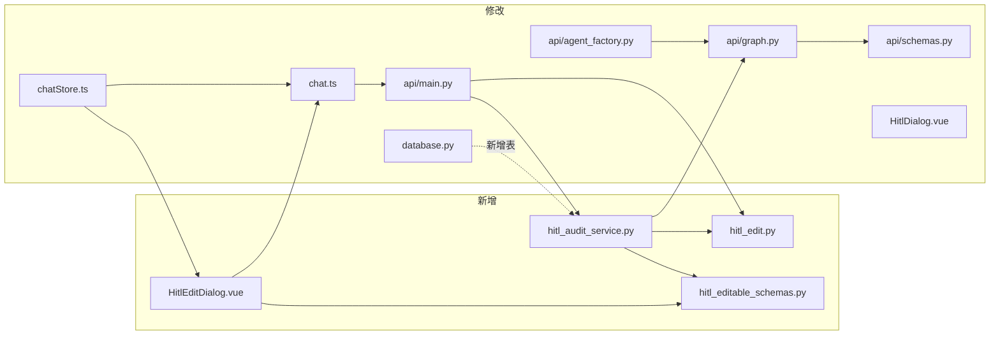
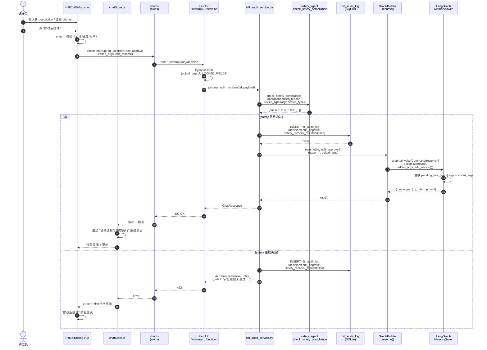
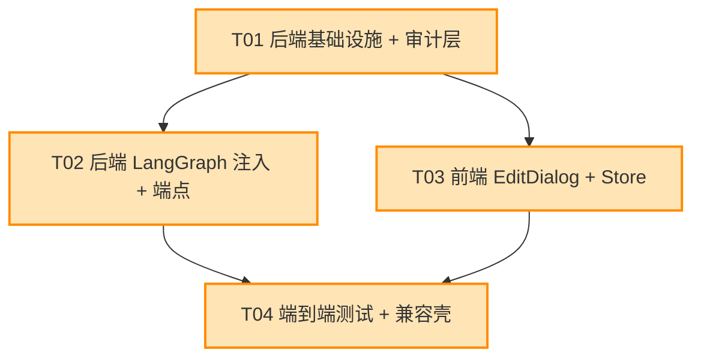

# GridMind HITL Edit & Continue 系统架构设计

> **文档版本**：v1.0 · 2026  
> **作者**：高见远（架构师）  
> **输入**：PRD `deliverables/hitl-edit-prd.md` v1.0  
> **状态**：待评审（含 1 项需用户决策：Q3 审计保留期）  
> **目标读者**：工程师（实现依据）、产品（确认假设）、法务/合规（Q3）

---

## TL;DR

- **核心改造面**：仅前端 `HitlDialog.vue` → `HitlEditDialog.vue`、后端 `InterruptRequest` schema + 1 个新端点 `POST /interrupt/{tid}/decision`、LangGraph `resume()` 接收 `edited_args`、新增 `hitl_audit_log` 表与审计写入服务。
- **零新增依赖**：Element Plus `<el-form>` 已含 `<el-input>`/`<el-select>`，LangGraph `Command(resume=...)` 现有 API 已支持结构化注入。
- **向后兼容**：`InterruptRequest` 扩展为 `decision: approve|reject|edit_approve`，老客户端 `decision=approve` 仍工作。
- **关键约束**：`device_id` 不可编辑（后端 Pydantic 黑名单拦截），`edit_approve` 必须经 `check_safety_compliance` 重检。
- **P0 估算**：8 人日，2 名工程师 4 天可交付。
- **⚠️ 须用户决策**：Q3 审计日志保留期（建议 3 年，电力行业规程默认值，详见 §8）。

---

## 1. 实现方案与框架选型

### 1.1 核心难点分析

| 难点 | 风险 | 应对 |
|---|---|---|
| `Command(resume=...)` 需注入编辑后 args，替换原 plan | 中断点与 `pending_tool_plan` 持久化的耦合 | 在 `resume()` 内对 `pending_tool_plan[i].args` 做深度替换，写回 checkpointer |
| `decision` 枚举扩展不破坏老客户端 | 现有前端调用 `/approve` `/reject` 路径 | **保留两条老端点 + 新增统一 `/decision` 端点**，新端点支持 `edit_approve`，老端点行为不变 |
| 编辑后 args 必须重检 `safety_agent` | 重检失败时不能继续执行 | 在 `api/services/hitl_audit_service.py` 中封装"重检 + 写日志 + 决定是否 resume"三步原子操作，失败时 **不** 触发 `Command(resume=...)` |
| 设备 ID 误改引发安全事故 | 调度员自由编辑 `device_id` 不可接受 | 后端在 `/decision` 入口用 Pydantic 黑名单校验 `edited_args` 不得含 `device_id`/`work_order_id`/`shutdown_id` 等系统字段 |
| 编辑字段定义前后端双写易漂移 | 前端 `<el-input>` 与后端 Pydantic 字段不一致 | **集中化定义**：`api/services/hitl_editable_schemas.py`（Python） + `web/src/api/hitlSchemas.ts`（TS 镜像）由同一 PRD 同步生成，CI 校验字段名一致 |

### 1.2 框架选型

| 层 | 现状 | 改造 | 理由 |
|---|---|---|---|
| 后端 Web | FastAPI 0.110+ | **保持 + 1 个新端点** | 已有 `/chat` `/interrupt/{tid}/{approve,reject}` 风格一致；统一为 `POST /interrupt/{tid}/decision` 接收 `{decision, reason, edited_args, edit_reason}` |
| 后端图编排 | LangGraph 0.2 + MemorySaver | **保持 + `resume()` 签名扩展** | `Command(resume={action, edited_args})` 在 LangGraph 0.2 已支持复杂对象注入，无需切换 |
| LLM 路由 | DashScope Qwen-Plus | 不变 | — |
| HITL 拦截 | `agent_factory.py` `_execute_tools` 内 `interrupt()` | **保持 + 拦截 payload 携带原始 args** | 中断 payload 改为 `{type, tool, args, original_args, message}`，便于审计回溯 |
| 前端框架 | Vue 3 + Element Plus + Pinia + Vite | **保持 + 新组件** | Element Plus `<el-form>` / `<el-input>` / `<el-select>` 已满足需求 |
| 前端状态 | Pinia `chatStore` | **保持 + 新 action `approveWithEdit`** | 与现有 `approveHitl` / `rejectHitl` 风格一致 |
| 数据库 | SQLite | **保持 + 1 张新表** | 与 `safety_rules` / `telemetry` 风格一致，单文件零运维 |
| 审计写入 | 无 | **新增** `api/services/hitl_audit_service.py` | 单一职责，便于测试 |

### 1.3 架构模式

**MVVM（前端） + 分层服务（后端）**，与现有代码保持一致：
- 前端：Component（HitlEditDialog.vue）→ Store（chatStore）→ API（chat.ts）→ FastAPI
- 后端：Router（main.py）→ Service（hitl_audit_service.py）→ Schema（hitl_edit.py）→ GraphBuilder.resume

---

## 2. 文件清单（新增 + 修改）

### 2.1 新增文件（4 个）

| 相对路径 | 职责 | 行数估算 |
|---|---|---|
| `api/schemas/hitl_edit.py` | `EditInterruptRequest` / `EditDecisionEnum` / `EditableField` Pydantic 模型 | 60 |
| `api/services/hitl_audit_service.py` | 审计写入 + safety 重检 + 禁编辑字段校验三步原子 | 120 |
| `api/services/hitl_editable_schemas.py` | `EDITABLE_SCHEMA: dict[str, list[EditableField]]` 集中定义 | 80 |
| `web/src/components/HitlEditDialog.vue` | 720px 弹窗，`<el-form>` 动态字段渲染 + 三按钮 | 350 |

### 2.2 修改文件（8 个）

| 相对路径 | 改动点 |
|---|---|
| `api/schemas.py` | `InterruptAction` 枚举扩展 `'edit_approve'`；`InterruptRequest` 不变（向后兼容老端点） |
| `api/main.py` | **新增** `POST /interrupt/{thread_id}/decision` 端点；**保留** `approve/reject` 老端点为薄壳（转发到新 service） |
| `api/graph.py` | `resume()` 签名扩展为 `resume(thread_id, action, reason="", edited_args=None, edit_reason="")`；将 `edited_args` 注入 `Command(resume={action, reason, edited_args})`；同时回写 `pending_tool_plan` 替换对应工具 args |
| `api/agents/agent_factory.py` | `interrupt()` payload 增加 `original_args` 字段（与 `args` 同值，供前端编辑时显示原值 diff） |
| `web/src/components/HitlDialog.vue` | **保留为薄壳**：仅保留"仅批准"按钮 + 透传 props，包装 `HitlEditDialog`（迁移期兼容，未升级前端的旧用户仍可用） |
| `web/src/stores/chatStore.ts` | 新增 `approveWithEdit(threadId, editedArgs, editReason)` action；扩展 `interruptArgs` state 保存 `original_args` |
| `web/src/api/chat.ts` | 新增 `decideInterrupt(threadId, payload)` 函数；`payload: {decision, reason?, edited_args?, edit_reason?}` |
| `mcp_tools/db/database.py` | 新增 `hitl_audit_log` 表 + 2 个索引（thread_id, created_at） |

### 2.3 文件依赖图



---

## 3. 数据结构 / 接口（CRITICAL）

### 3.1 扩展枚举与请求体

```python
# api/schemas.py — 扩展
class InterruptAction(str, Enum):
    pending       = "pending"
    approved      = "approved"
    rejected      = "rejected"
    edit_approved = "edit_approved"   # 新增

# api/schemas/hitl_edit.py — 新增
class EditDecisionEnum(str, Enum):
    approve       = "approve"        # 老路径，edited_args 必为 null
    reject        = "reject"         # 老路径
    edit_approve  = "edit_approve"   # 新路径，edited_args 必非空

# 禁编辑字段黑名单（后端强制）
LOCKED_FIELDS: set[str] = {
    "device_id", "work_order_id", "shutdown_id",
    "created_at", "thread_id", "audit_id",
}

class EditInterruptRequest(BaseModel):
    decision: EditDecisionEnum
    reason: str = Field(default="", max_length=200)
    edited_args: dict[str, Any] | None = None
    edit_reason: str = Field(default="", max_length=200)

    @model_validator(mode="after")
    def check_edited_args_locked(self):
        if self.decision == "edit_approve":
            if not self.edited_args:
                raise ValueError("edit_approve 必须提供 edited_args")
            if not self.edit_reason:
                raise ValueError("edit_approve 必须填写 edit_reason")
            for k in self.edited_args:
                if k in LOCKED_FIELDS:
                    raise ValueError(f"字段 '{k}' 不可编辑")
        return self
```

### 3.2 前端 TypeScript 接口（向后兼容）

```typescript
// web/src/api/chat.ts — 扩展
export type EditDecision = 'approve' | 'reject' | 'edit_approve'

export interface InterruptDecision {
  decision: EditDecision
  reason?: string
  edited_args?: Record<string, unknown>   // 仅 edit_approve 必填
  edit_reason?: string                     // 仅 edit_approve 必填
}

export interface InterruptPayload {
  tool: string
  args: Record<string, unknown>            // Agent 原始 args
  original_args?: Record<string, unknown>  // 显式原值，用于 diff 显示
  message: string
  thread_id: string
}
```

### 3.3 `hitl_audit_log` 表 Schema

```sql
-- mcp_tools/db/database.py — 新增
CREATE TABLE IF NOT EXISTS hitl_audit_log (
    id                       INTEGER PRIMARY KEY AUTOINCREMENT,
    thread_id                TEXT    NOT NULL,
    interrupt_node           TEXT    NOT NULL,        -- 触发的工具名（dispatch_work_order 等）
    tool_name                TEXT    NOT NULL,
    user_id                  TEXT    NOT NULL DEFAULT 'anonymous',
    user_name                TEXT,
    user_role                TEXT,
    decision                 TEXT    NOT NULL CHECK(decision IN ('approve','reject','edit_approve')),
    original_args            TEXT    NOT NULL,        -- JSON
    edited_args              TEXT,                     -- JSON，仅 edit_approve 有值
    edit_reason              TEXT,                     -- 仅 edit_approve 有值
    safety_recheck_result    TEXT,                     -- JSON: {passed: bool, rules: [...]}
    reason                   TEXT,                     -- 拒绝/批准原因
    ip_address               TEXT,
    user_agent               TEXT,
    created_at               TEXT    NOT NULL DEFAULT (datetime('now'))
);

CREATE INDEX IF NOT EXISTS idx_hitl_audit_thread  ON hitl_audit_log(thread_id);
CREATE INDEX IF NOT EXISTS idx_hitl_audit_created ON hitl_audit_log(created_at);
CREATE INDEX IF NOT EXISTS idx_hitl_audit_user    ON hitl_audit_log(user_id, created_at);
```

### 3.4 可编辑字段 Schema（CRITICAL — 前端/后端共享）

**位置**：`api/services/hitl_editable_schemas.py`（Python 定义）+ `web/src/api/hitlSchemas.ts`（TS 镜像，由 CI 同步校验）

```python
# api/services/hitl_editable_schemas.py
from typing import Literal

EditableFieldType = Literal["text", "textarea", "select", "number"]

class EditableField(BaseModel):
    key: str                              # 对应工具参数 key
    type: EditableFieldType
    label: str                            # 中文标签
    required: bool = True
    max_length: int | None = None
    options: list[str] | None = None      # 仅 type=select
    placeholder: str = ""
    help_text: str = ""

EDITABLE_SCHEMA: dict[str, list[EditableField]] = {
    "dispatch_work_order": [
        EditableField(
            key="description", type="textarea", label="故障描述",
            required=True, max_length=500,
            placeholder="请描述故障现象、影响范围、初步判断",
            help_text="必填，≤ 500 字",
        ),
        EditableField(
            key="priority", type="select", label="优先级",
            required=True, options=["high", "medium", "low"],
            help_text="高危时段请选择 medium 及以下",
        ),
        # device_id 不可编辑（在 LOCKED_FIELDS 中）
    ],
    "suggest_shutdown": [
        EditableField(
            key="reason", type="textarea", label="停运原因",
            required=True, max_length=200,
            placeholder="说明停运必要性、预计时长、保电替代方案",
            help_text="必填，≤ 200 字",
        ),
    ],
}
```

---

## 4. 程序调用流程（Edit & Continue 完整时序）



**关键节点**：
- **步骤 4-5**：前端 Pydantic 镜像校验（避免无效请求）
- **步骤 7-8**：后端最终守门（防绕过前端）
- **步骤 9-12**：safety 重检 + 审计写库为**原子**（同一事务，fail-closed）
- **步骤 13-17**：仅重检通过才触发 `Command(resume=...)`，并把 `edited_args` 注入到 `pending_tool_plan` 替换原 args

---

## 5. 任务列表（8 个 P0 → 4 个工程任务）

> **拆解原则**：PRD 8 个 P0 合并为 4 个工程任务（按"基础设施 / 数据层 / 前端 / 端到端"分层），每个任务 ≥ 3 个相关文件。详见后续工程师交付清单。

| Task ID | 标题 | 目标产物 | 依赖 | 工时 | 验收要点 |
|---|---|---|---|---|---|
| **T-HITL-EDIT-01** | 后端基础设施 + 审计层 | `api/schemas/hitl_edit.py`<br/>`api/services/hitl_audit_service.py`<br/>`api/services/hitl_editable_schemas.py`<br/>`mcp_tools/db/database.py`（新增表） | — | **2 人日** | ① Pydantic `LOCKED_FIELDS` 拦截通过单测<br/>② `init_db` 自动建表 + 索引<br/>③ 审计写入 3 步原子（safety+写库+resume）单测 |
| **T-HITL-EDIT-02** | 后端 LangGraph 注入 + 端点 | `api/main.py`（新端点）<br/>`api/graph.py`（`resume()` 扩展）<br/>`api/agents/agent_factory.py`（payload 增字段） | T01 | **1.5 人日** | ① `/decision` 端点 Pydantic 文档 OK<br/>② `Command(resume=edited_args)` 替换 `pending_tool_plan` 生效<br/>③ 老 `/approve` `/reject` 端点行为不变（向后兼容回归） |
| **T-HITL-EDIT-03** | 前端 EditDialog 组件 + Store | `web/src/components/HitlEditDialog.vue`<br/>`web/src/api/hitlSchemas.ts`<br/>`web/src/stores/chatStore.ts`（新 action）<br/>`web/src/api/chat.ts`（`decideInterrupt`） | T01 | **2.5 人日** | ① 三按钮（拒绝/仅批准/修改后批准）联动正确<br/>② `description` 长度超限置灰 + 计数器红色<br/>③ 修改原因必填<br/>④ 暗/亮主题 CSS 变量继承<br/>⑤ 与 `chatStore` 现有 `approveHitl` 风格一致 |
| **T-HITL-EDIT-04** | 端到端测试 + HitlDialog 兼容壳 | `web/src/components/HitlDialog.vue`（改为薄壳）<br/>`tests/e2e/hitl_edit.spec.ts`（Playwright）<br/>`tests/unit/test_hitl_audit_service.py` | T01, T02, T03 | **1.5 人日** | ① AC-1 ~ AC-10 全部通过（10 条验收标准）<br/>② 老用户走薄壳路径仍可"仅批准"<br/>③ 安全重检失败场景可重现<br/>④ 审计日志可通过 `sqlite3` CLI 查询验证 |

**P0 合计：7.5 人日**（2 名工程师 ≈ 4 个工作日）

### 5.1 任务依赖图



**关键路径**：T01 → T02 → T04 或 T01 → T03 → T04（2 名工程师可并行 T02/T03）。

---

## 6. 依赖包列表

```json
{
  "dependencies": {},
  "devDependencies": {}
}
```

**零新增依赖**。Element Plus `<el-form>` / `<el-input>` / `<el-select>` 已在 `web/package.json`；LangGraph `Command(resume=...)` 已支持结构化对象注入；Pydantic v2 `@model_validator` 已在 `api/schemas.py` 使用。

---

## 7. 共享知识（跨文件约定）

工程师实现时**必须遵守**：

1. **向后兼容原则**：`InterruptRequest` 是扩展，不破坏现有字段。前端检测 `decision === 'edit_approve'` 才读 `edited_args`，否则按老路径处理。
2. **审计写入时机**：`api/services/hitl_audit_service.py::process_edit_decision` 在 safety 重检完成后、Command resume **之前**同步写库（fail-closed：写库失败则抛 500，不 resume）。
3. **可编辑字段定义集中化**：`api/services/hitl_editable_schemas.py`（Python） + `web/src/api/hitlSchemas.ts`（TS 镜像），由 CI 同步校验字段名一致，**禁止**前/后端各自重复定义。
4. **设备 ID 安全**：后端在 `/decision` 入口用 Pydantic 黑名单校验 `edited_args` 中**不得**含 `device_id` / `work_order_id` / `shutdown_id` 等系统字段，违反则 422 拒绝。
5. **主题适配**：编辑器组件继承全局 CSS 变量 `var(--bg-card)`、`var(--text-primary)`、`var(--status-danger)`，**不引入新色值**。
6. **错误回滚**：safety 重检 fail 时，前端弹窗 `el-alert` 显示拒绝原因（红色），审计 log 记录 `decision='edit_approve'` 但 `safety_recheck_result.passed=false`，**不**触发 `Command(resume=...)`。
7. **action 命名**：`InterruptAction` 枚举值用 `edit_approved`（过去式，与 `approved`/`rejected` 风格一致），HTTP payload 用 `edit_approve`（祈使式，与 `approve`/`reject` 风格一致）—— 在 service 层做映射。
8. **`pending_tool_plan` 替换语义**：`resume(edited_args)` 时，只替换 `plan` 中**第一个**匹配 `interrupt_tool` 的工具的 args（不支持批量编辑），多工具场景由前端按 tool 多次弹窗。
9. **审计保留期**：见 §8 Q3。

---

## 8. 待明确事项

### Q1 ~ Q6 决策建议

| Q | 主题 | 建议默认值 | 决策状态 |
|---|---|---|---|
| **Q1** | 编辑后是否自动重检 `safety_agent` | **是**（PRD D1 已建议） | ✅ 架构上无歧义，采用 |
| **Q2** | "修改后批准"是否需二次确认弹窗 | **否**（节省点击，safety 重检已把关） | ✅ UX 上无歧义 |
| **Q3** | **审计日志保留期** | **3 年**（电力规程默认值，参考《国家电网电力安全工作规程》及行业惯例） | ⚠️ **必须由法务/合规确认** |
| **Q4** | 是否需要"撤销修改 → 回到原值"按钮 | **是**（"仅批准"按钮即视为撤销，低本 UX 提升） | ✅ PRD 假设合理 |
| **Q5** | Escalation 是否对接 OA | **P0 不做**（PRD D6 明确） | ✅ 范围外 |
| **Q6** | 网络中断 localStorage 暂存 | **否**（小窗口，失败重试即可，PRD Out-of-Scope 暗含） | ✅ P2 再议 |

### ⚠️ Q3 必须用户决策

> **本设计标注**：`[USER-DECISION-REQUIRED: 审计日志保留期]`

**3 个候选方案**：

| 方案 | 保留期 | 实施成本 | 风险 |
|---|---|---|---|
| **A（推荐）** | 3 年 | 低：SQLite 直接保留 | 满足行业惯例 |
| **B** | 5 年 | 中：需冷归档脚本（PRD REQ-P1-5） | 覆盖部分地方规程 |
| **C** | 7 年 | 高：需独立审计库 + 定期迁移 | 覆盖事故追溯完整周期 |

**架构影响**：方案 A 直接落地；方案 B 需 T01 增加 `archive_old_logs.py` 脚本；方案 C 需独立数据库（超出 P0 范围）。

**行动项**：请法务/合规确认 → 选择 A/B/C → 在 T01 实施前回复。

### 其他需确认的次要项

| 项 | 现状假设 | 建议确认方 |
|---|---|---|
| 用户身份字段（`user_id`/`user_name`/`user_role`） | 暂用 `anonymous` 占位 | 后端需对接 SSO/JWT 后再回填 |
| `client_ip` / `user_agent` 采集 | 通过 FastAPI `Request` 注入 | 安全负责人 |
| `safety_recheck_result` 是否包含完整 rule 列表 | 是（便于审计追溯） | 产品 |
| `pending_tool_plan` 中**多工具同时编辑**是否支持 | 否（按 tool 顺序逐个弹窗） | 产品 |

---

## 附录 A：关键文件行号索引

| 文件 | 关键位置 | 改造点 |
|---|---|---|
| `api/main.py:121-123` | `InterruptRequest` | 不变（向后兼容） |
| `api/main.py:292-312` | `/approve` 端点 | 保留为薄壳，转发到新 service |
| `api/main.py:315-335` | `/reject` 端点 | 同上 |
| `api/main.py:新增` | `/decision` 端点 | 新增，支持 `edit_approve` |
| `api/graph.py:332-348` | `resume()` 方法 | 扩展为接收 `edited_args` |
| `api/agents/agent_factory.py:202-208` | `interrupt()` payload | 增加 `original_args` 字段 |
| `mcp_tools/db/database.py:99-` | `init_db()` | 追加 `hitl_audit_log` 建表 SQL |
| `web/src/components/HitlDialog.vue:1-` | 整个组件 | 改为薄壳 |
| `web/src/stores/chatStore.ts:227-258` | `approveHitl()` | 保留，**新增** `approveWithEdit` |

---

**版本记录**：
- v1.0（2026）：初版，基于 PRD v1.0 + 现有代码全量审查
