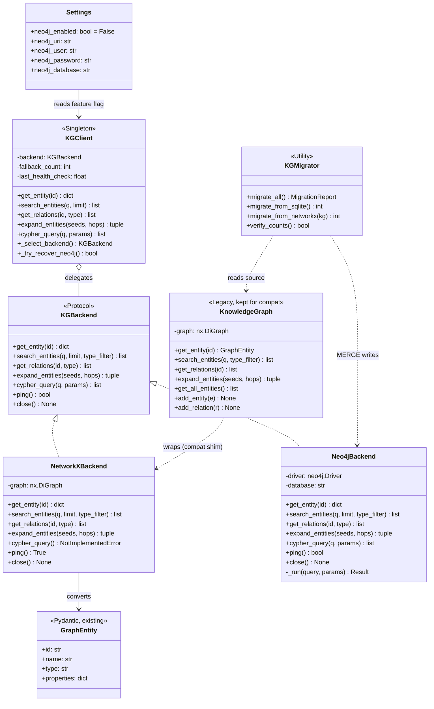
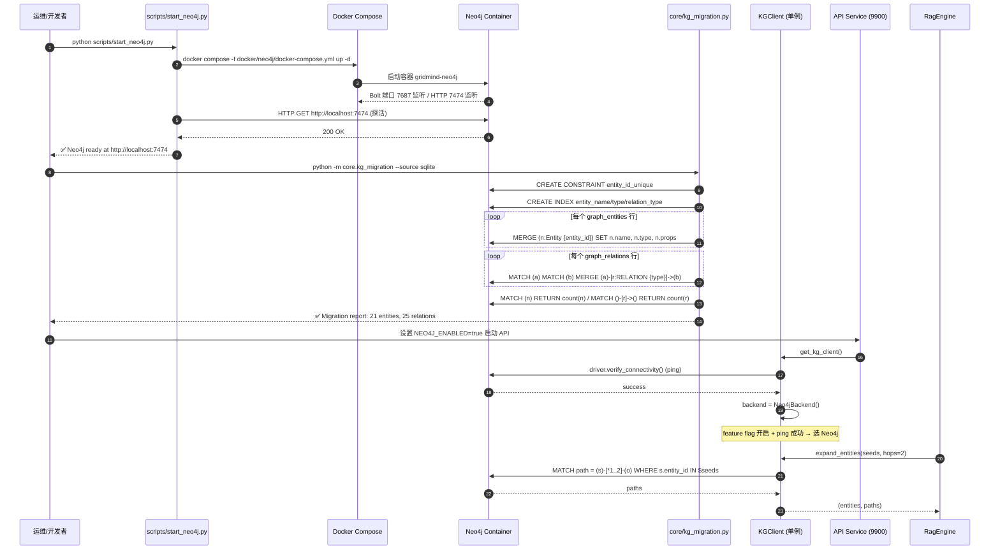
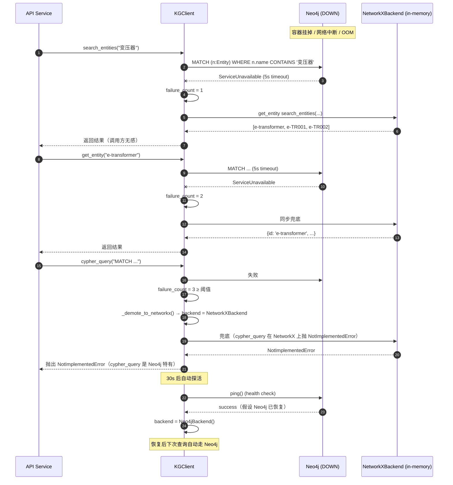
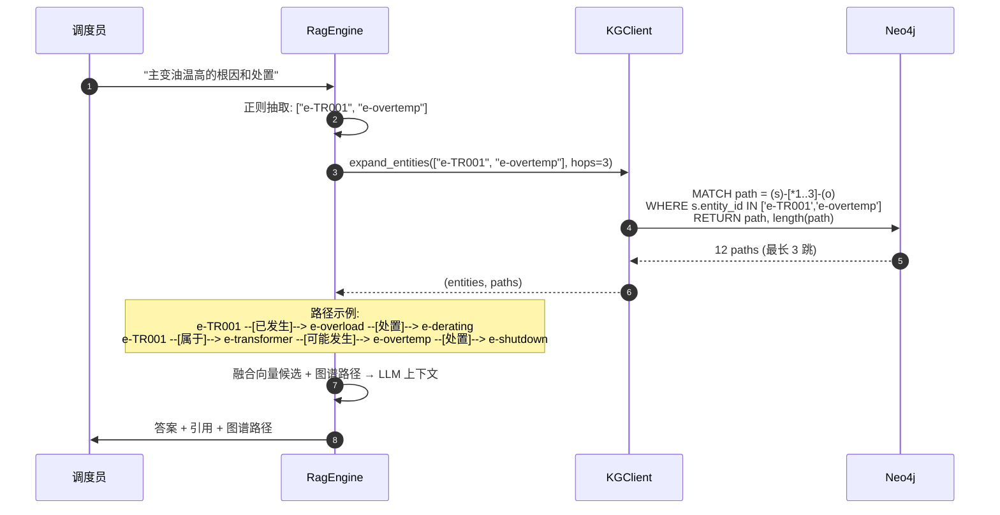
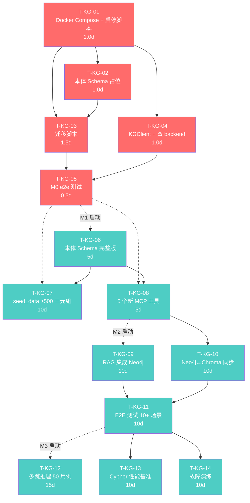

# GridMind 知识图谱 Neo4j 升级——系统设计与任务分解

| 项 | 内容 |
|---|---|
| **对应 PRD** | `deliverables/knowledge-graph-prd.md` (v1.0 · 2026) |
| **本文档版本** | v1.0 · M0 落地版 |
| **作者** | 架构师 · 高见远（Gao） |
| **角色对齐** | 软件架构师 Bob |
| **目标读者** | 软件工程师（实施） + 产品经理（评审） + 团队负责人（决策） |
| **实施窗口** | M0 = 5 人日（D+5），M1 = 20 人日（D+25），M2 = 30 人日（D+55），M3 = 35 人日（D+90） |
| **关键决策** | Q1=Neo4j 单机 Docker（已确认） / Q2=中等本体（已确认） / Q3=seed_data+LLM（已确认） |

---

## TL;DR

把当前 NetworkX 内存图升级到 **Neo4j 5.x Docker 单机 + 统一 KGClient 接口 + NetworkX 降级 fallback**，M0 不切换主链路（feature flag 默认关闭），**5 人日交付可观测可回滚的 Neo4j 子系统**；M1 再做本体建模与 5 个 MCP 工具，M2 集成到 RAG，M3 推理验收。

**M0 三个不可妥协的约束**：
1. **零回归**：现有 4 个 MCP 知识库工具 + RagEngine 行为不变；M0 默认仍走 NetworkX。
2. **可降级**：Neo4j 不可用时 5 秒内自动切回 NetworkX，服务可用性 ≥ 99.5%。
3. **幂等可重跑**：迁移脚本支持反复执行，统计节点/关系数一致。

---

# Part A · 系统设计

## 1. 实现方案与框架选型

### 1.1 核心挑战（CRITICAL）

| # | 挑战 | 现状 | 目标 |
|---|---|---|---|
| C1 | **重启丢数据**：NetworkX `nx.DiGraph` 仅在内存；进程重启即重建 | Demo 偶发可接受 | Neo4j 持久化 + SQLite 影子副本 |
| C2 | **跳数不足**：现有 `expand_entities(hops=2)` 仅能演示 2 跳推理 | 不支持 3 跳 | Cypher `MATCH (a)-[*1..5]->(b)` 可配置跳数 |
| C3 | **接口缺失**：无 Cypher/SPARQL，仅 4 个简单 API | 仅 `get_entity` / `search` / `get_relations` / `expand` | 保留 4 个 API + 新增 `cypher_query`（Neo4j 特有） |
| C4 | **本体未抽象**：关系类型用中文短语（"可能发生"/"处置"/"属于"），未规范化为 Cypher 关系类型 | 中文 label | M0 仅做基础迁移，**本体抽象留给 M1** |
| C5 | **降级不可控**：现在没有降级概念 | 不存在 | Neo4j 不可用 5 秒内自动切 NetworkX |

### 1.2 框架与库选型

| 层 | 选型 | 版本 | 理由 |
|---|---|---|---|
| 图数据库 | **Neo4j 5.x Community** | `neo4j:5.20-community` | Q1 已决策 Docker 单机；Community 版免费；APOC 插件提供迁移工具；Bolt 协议低延迟 |
| Python 驱动 | **`neo4j>=5.0,<6.0`** | 5.x | 官方同步/异步双驱动；与 Pydantic 兼容性好；社区成熟 |
| 部署 | **Docker Compose 单文件** | Docker 24+ | 本地 `docker compose up -d` 即可启动；运维零学习成本 |
| 配置管理 | **Pydantic Settings** | 现有 | 沿用 `api/config.py`，新增 5 个 Neo4j 字段 |
| 图算法 | **Cypher 内置** | Neo4j 5.x | M0 不引入 Graph Data Science 库；M3 评估 |
| 现有 NetworkX | **保留** | `networkx>=3.0` | 作为降级 backend，**代码不删除** |
| 测试 | **pytest** | 现有 | M0 新增 `tests/test_kg_neo4j.py`（e2e：迁移 + 查询 + 降级） |

### 1.3 架构模式：Protocol + 后端适配 + 单例 Client

**核心思想**：引入一个 `KGBackend` Protocol，定义 `KnowledgeGraph` 必须实现的查询接口；现有 `KnowledgeGraph`（NetworkX 实现）原封不动，再写一个 `Neo4jBackend` 实现同一 Protocol；上层 `KGClient` 在启动时根据 feature flag + 健康检查选择具体 backend。

```
┌─────────────────────────────────────────────────────────────┐
│  上层调用方（RagEngine / knowledge_tools.py / 测试代码）     │
└──────────────────────────┬──────────────────────────────────┘
                           │ 调用统一接口 get_entity / search / ...
                           ▼
┌─────────────────────────────────────────────────────────────┐
│  KGClient（单例，自动选 backend + 降级）                      │
│  · 启动时：ping Neo4j → 失败则降级 NetworkX                  │
│  · 运行时：捕获 Neo4j 异常 → 标记降级 → 60s 后自动恢复探活    │
└──────────────────────────┬──────────────────────────────────┘
                           │ 实现 KGBackend Protocol
            ┌──────────────┴──────────────┐
            ▼                              ▼
   ┌──────────────────┐         ┌──────────────────────┐
   │ NetworkXBackend  │         │ Neo4jBackend         │
   │ (现有 Knowledge  │         │ (新增 Neo4j 驱动)    │
   │  Graph 重命名)   │         │ Bolt 连接 + Cypher   │
   └──────────────────┘         └──────────────────────┘
```

**关键设计决策**：

1. **`KGBackend` 命名问题**：现有 `KnowledgeGraph` 类名不变（保持向后兼容所有 import），新增 `Neo4jBackend` 作为可插拔实现，`KGClient` 作为统一门面。
2. **不引入 Python ABC**：用 `typing.Protocol` 实现接口约束，避免破坏现有 NetworkX 类的继承结构。
3. **降级要"沉默"**：调用方不应感知 backend 切换；Neo4j 异常被捕获 + 计数，连续 3 次失败才真正降级（避免抖动）。
4. **迁移不阻塞启动**：迁移脚本与 Neo4j 启动脚本解耦，可独立运行；M0 期间允许 Neo4j 为空库运行。

---

## 2. 文件清单

### 2.1 M0 新增文件（7 个，全部 5 人日内交付）

| 文件路径 | 类型 | 行数估算 | 说明 |
|---|---|---|---|
| `core/kg_neo4j_client.py` | 实现 | ~280 | Neo4j Bolt 连接池 + Cypher 查询 + 异常分类 + 健康检查 |
| `core/kg_migration.py` | 实现 | ~220 | NetworkX + SQLite → Neo4j 数据迁移（幂等 MERGE + 校验） |
| `core/kg_ontology.py` | 数据/脚本 | ~150 | 本体 Cypher CREATE 语句（M0 仅 5 节点类 + 5 关系类占位） |
| `scripts/start_neo4j.py` | 运维脚本 | ~80 | Docker Compose 启动 + 端口探活 + 浏览器 URL 输出 |
| `scripts/stop_neo4j.py` | 运维脚本 | ~50 | Docker Compose 优雅停止 + 数据保留确认 |
| `tests/test_kg_neo4j.py` | 测试 | ~200 | e2e：Neo4j 启动 → 迁移 → 查询 → 降级 → 恢复 |
| `docker/neo4j/docker-compose.yml` | 部署 | ~35 | Neo4j 5-community + APOC + 端口映射 + 卷挂载 |

### 2.2 M0 修改文件（3 个，影响面 < 150 行）

| 文件路径 | 修改内容 | 行数变化 | 风险等级 |
|---|---|---|---|
| `api/config.py` | 新增 5 个字段：`neo4j_enabled` / `neo4j_uri` / `neo4j_user` / `neo4j_password` / `neo4j_database` | +12 行 | 🟢 低（仅追加字段） |
| `core/knowledge_graph.py` | **不删除现有实现**；新增模块顶层 `KGClient` 单例 + `NetworkXBackend` 适配类（将现有方法包成 Protocol 接口）+ `Neo4jBackend` 实现 | +180 行 | 🟡 中（接口需要保持 100% 兼容现有调用方） |
| `mcp_tools/db/database.py` | 新增 `kg_migration_log` 表（迁移历史 + 节点/关系计数） | +15 行 | 🟢 低（仅追加表 + 索引） |

### 2.3 M1-M3 概要（不在本次实施范围）

| 阶段 | 新增/修改 | 工作量 |
|---|---|---|
| **M1 本体建模** | 新增 `core/kg_ontology.py` 扩展（完整 Cypher schema）/ `core/kg_seed_data.py`（≥500 三元组）/ `mcp_tools/tools/neo4j_tools.py`（5 个新工具） | 20d |
| **M2 RAG 集成** | 修改 `core/rag_engine.py`（替换 KG 调用）/ 新增 `core/kg_chroma_sync.py`（双向同步服务） | 30d |
| **M3 推理 + 验收** | 多跳因果推理测试套件 / 准确率评估报告 / Cypher 性能基准 / 故障演练 | 35d |

---

## 3. 数据结构与接口（CRITICAL）

### 3.1 统一接口 Protocol

```python
# core/knowledge_graph.py（新增部分，原有类不动）

from typing import Protocol, runtime_checkable

@runtime_checkable
class KGBackend(Protocol):
    """知识图谱后端统一接口——NetworkX 与 Neo4j 必须实现同一组方法。"""

    def get_entity(self, entity_id: str) -> dict | None:
        """按 ID 查询单个实体（含 name/type/properties）。不存在返回 None。"""
        ...

    def search_entities(
        self, query: str, limit: int = 10, type_filter: str | None = None,
    ) -> list[dict]:
        """按名称模糊搜索（CONTAINS）；type_filter 可选；返回前 limit 条。"""
        ...

    def get_relations(
        self, entity_id: str, relation_type: str | None = None,
    ) -> list[dict]:
        """获取实体的所有出边关系；relation_type 可选过滤。"""
        ...

    def expand_entities(
        self, seed_entity_ids: list[str], hops: int = 2,
    ) -> tuple[list[dict], list[list[str]]]:
        """BFS 多跳扩展，返回 (扩展实体列表, 路径列表)。"""
        ...

    def cypher_query(
        self, query: str, params: dict | None = None,
    ) -> list[dict]:
        """执行 Cypher 查询（仅 Neo4j 后端支持；NetworkX 抛 NotImplementedError）。"""
        ...

    def ping(self) -> bool:
        """健康检查（连接是否可用）。"""
        ...

    def close(self) -> None:
        """关闭连接/驱动（M0 阶段仅 Neo4j 需要；NetworkX no-op）。"""
        ...
```

**与现有接口的兼容性映射**：

| 现有方法（NetworkX `KnowledgeGraph`） | 新 Protocol 方法 | 兼容性处理 |
|---|---|---|
| `get_entity(entity_id) -> GraphEntity \| None` | `get_entity(entity_id) -> dict \| None` | **返回值由 `GraphEntity` 改为 `dict`**，调用方需 `e.model_dump()` 兼容——在 `NetworkXBackend` 适配层做转换 |
| `search_entities(query, type_filter=None)` | `search_entities(query, limit=10, type_filter=None)` | **新增 `limit` 参数**，位置参数顺序保持向后兼容 |
| `get_relations(entity_id)` | `get_relations(entity_id, relation_type=None)` | **新增可选过滤参数**，保持 0 参调用兼容 |
| `expand_entities(seed, hops=2) -> (entities, paths)` | 同左（返回值类型由 `GraphEntity` 改 `dict`） | 同样在适配层做 `GraphEntity → dict` 转换 |

**关键决策**：返回值统一改为 `dict` 而非保留 `GraphEntity`，目的是让 Protocol 接口对所有 backend 一致（Neo4j 返回 `Record` 对象，序列化为 `dict` 更通用）。`KnowledgeGraph` 类仍暴露 `GraphEntity` 方法（保留向后兼容），内部委托给 `NetworkXBackend` 实现。

### 3.2 类图（classDiagram）



### 3.3 本体 Schema（M0 占位，M1 完整化）

```cypher
// core/kg_ontology.py（CREATE CONSTRAINT 部分，M0 仅注册必要的唯一性约束）

// 1. 节点唯一性约束（按 entity_id 去重）
CREATE CONSTRAINT entity_id_unique IF NOT EXISTS
FOR (n:Entity) REQUIRE n.entity_id IS UNIQUE;

// 2. 节点名称索引（加速 search_entities 模糊查询）
CREATE INDEX entity_name_index IF NOT EXISTS
FOR (n:Entity) ON (n.name);

// 3. 节点类型索引（加速 type_filter）
CREATE INDEX entity_type_index IF NOT EXISTS
FOR (n:Entity) ON (n.type);

// 4. 关系类型索引（加速 get_relations type 过滤）
CREATE INDEX relation_type_index IF NOT EXISTS
FOR ()-[r:RELATION]-() ON (r.type);

// M0 数据迁移后用 MERGE 写入的 Cypher 模式：
// MATCH (a:Entity {entity_id: $src})
// MATCH (b:Entity {entity_id: $tgt})
// MERGE (a)-[r:RELATION {type: $rtype}]->(b)
```

**为什么 M0 仅 4 个约束/索引**：完整本体（5 设备类 + 9 关系类 + 4 属性 + 推理规则）属于 M1 范围。M0 阶段保证：现有 21 实体 + 25 关系完整迁移到 Neo4j，且 `search / get / expand` 三个高频查询 < 50ms。

### 3.4 降级 Fallback 设计

```python
# core/knowledge_graph.py（KGClient 核心逻辑）

import time
from loguru import logger
from neo4j.exceptions import ServiceUnavailable, AuthError, TransientError

class KGClient:
    """统一知识图谱客户端——自动选 backend + 失败降级 + 静默恢复。

    单例模式：进程内只实例化一次；通过 get_kg_client() 工厂获取。
    """
    _instance: "KGClient | None" = None

    def __init__(self) -> None:
        self.backend: KGBackend = self._select_backend()
        self._failure_count: int = 0
        self._last_health_check: float = 0.0
        self._health_check_interval: float = 30.0  # 30s 探活一次

    def _select_backend(self) -> KGBackend:
        """启动时选择 backend：feature flag + 健康检查。"""
        if not settings.neo4j_enabled:
            logger.info("KGClient: Neo4j disabled, using NetworkX")
            return NetworkXBackend()

        try:
            backend = Neo4jBackend(
                uri=settings.neo4j_uri,
                user=settings.neo4j_user,
                password=settings.neo4j_password,
                database=settings.neo4j_database,
            )
            if backend.ping():
                logger.info("KGClient: Neo4j connected at {}", settings.neo4j_uri)
                return backend
            logger.warning("KGClient: Neo4j ping failed, fallback to NetworkX")
        except (ServiceUnavailable, AuthError) as e:
            logger.warning("KGClient: Neo4j init failed ({}), fallback to NetworkX", e)

        return NetworkXBackend()

    def _execute(self, method_name: str, *args, **kwargs):
        """代理方法调用：捕获 Neo4j 异常 → 标记降级 → 返回 NetworkX 结果。"""
        # 健康检查（节流：30s 一次）
        now = time.time()
        if now - self._last_health_check > self._health_check_interval:
            self._last_health_check = now
            if isinstance(self.backend, Neo4jBackend) and not self.backend.ping():
                logger.warning("KGClient: Neo4j health check failed, demoting to NetworkX")
                self._demote_to_networkx()
            elif isinstance(self.backend, NetworkXBackend) and self._failure_count == 0:
                self._try_recover_neo4j()

        try:
            method = getattr(self.backend, method_name)
            result = method(*args, **kwargs)
            self._failure_count = 0  # 重置失败计数
            return result
        except (ServiceUnavailable, TransientError, ConnectionError) as e:
            self._failure_count += 1
            if self._failure_count >= 3:  # 连续 3 次失败才真正降级
                logger.error("KGClient: Neo4j 3 consecutive failures, demoting")
                self._demote_to_networkx()
            else:
                logger.warning("KGClient: Neo4j call failed ({}/3): {}", self._failure_count, e)
            # 同步尝试 NetworkX 兜底
            nx_backend = NetworkXBackend()
            return getattr(nx_backend, method_name)(*args, **kwargs)

    def _demote_to_networkx(self) -> None:
        old = type(self.backend).__name__
        self.backend = NetworkXBackend()
        logger.warning("KGClient: demoted {} → NetworkXBackend", old)

    def _try_recover_neo4j(self) -> None:
        if not settings.neo4j_enabled:
            return
        try:
            backend = Neo4jBackend(...)
            if backend.ping():
                self.backend = backend
                logger.info("KGClient: recovered → Neo4jBackend")
        except Exception:
            pass  # 仍然降级中

    # 委托方法（调用方无感）
    def get_entity(self, entity_id): return self._execute("get_entity", entity_id)
    def search_entities(self, q, limit=10, type_filter=None):
        return self._execute("search_entities", q, limit=limit, type_filter=type_filter)
    def get_relations(self, entity_id, relation_type=None):
        return self._execute("get_relations", entity_id, relation_type=relation_type)
    def expand_entities(self, seeds, hops=2):
        return self._execute("expand_entities", seeds, hops=hops)
    def cypher_query(self, query, params=None):
        return self._execute("cypher_query", query, params=params)


def get_kg_client() -> KGClient:
    """工厂方法：进程内单例。"""
    if KGClient._instance is None:
        KGClient._instance = KGClient()
    return KGClient._instance
```

---

## 4. 程序调用流程（时序图）

### 4.1 Neo4j 启动 → 迁移 → 服务运行



### 4.2 降级场景（Neo4j 进程挂掉）



### 4.3 多跳查询（M0 阶段就具备的 3 跳能力）



---

# Part B · 任务分解

## 5. 任务列表（M0 详细 + M1-M3 概要）

### 5.1 M0 任务（5 个任务 · 5 人日 · 单工程师一次跑完）

| Task ID | 任务名称 | 涉及文件 | 依赖 | 人日 | 优先级 |
|---|---|---|---|---|---|
| **T-KG-01** | Neo4j Docker Compose + 启动/停止脚本 | `docker/neo4j/docker-compose.yml`、`scripts/start_neo4j.py`、`scripts/stop_neo4j.py` | — | 1.0 | **P0** |
| **T-KG-02** | 本体 Schema 定义 + Cypher CREATE 脚本 | `core/kg_ontology.py`（M0 占位版） | T-01 | 1.0 | **P0** |
| **T-KG-03** | NetworkX + SQLite → Neo4j 迁移脚本（幂等 MERGE + 校验） | `core/kg_migration.py`、`mcp_tools/db/database.py`（+`kg_migration_log` 表） | T-01, T-02 | 1.5 | **P0** |
| **T-KG-04** | KGClient 统一接口 + NetworkX/Neo4j 双 backend + 降级 fallback | `core/knowledge_graph.py`（大幅扩展）、`api/config.py`（+5 字段） | T-01 | 1.0 | **P0** |
| **T-KG-05** | M0 e2e 测试（迁移 + 查询 + 降级 + 恢复） | `tests/test_kg_neo4j.py` | T-01~04 | 0.5 | **P0** |

**关键路径**：`T-01 → T-02/T-03 并行 → T-04 → T-05`

| 任务 | D1 | D2 | D3 | D4 | D5 |
|---|---|---|---|---|---|
| T-01 Docker Compose + 启动脚本 | ██ | | | | |
| T-02 本体 Schema | | ██ | | | |
| T-03 迁移脚本 | | ██ | █ | | |
| T-04 KGClient + 双 backend | | | ██ | █ | |
| T-05 e2e 测试 | | | | | ██ |

### 5.2 M1 任务概要（20 人日）

| Task ID | 任务名称 | 工作量 |
|---|---|---|
| T-KG-06 | 本体 Schema 完整版（5 设备类 + 9 关系类 + 4 属性 + 推理规则 Cypher 模式） | 5d |
| T-KG-07 | seed_data 三元组抽取 ≥500 条（脚本 + 抽取报告 + 人工 review） | 10d |
| T-KG-08 | 5 个新 MCP 工具（`cypher_query` / `multi_hop_expand` / `find_devices_by_substation` / `get_fault_chain` / `get_applicable_regulations`） | 5d |

### 5.3 M2 任务概要（30 人日）

| Task ID | 任务名称 | 工作量 |
|---|---|---|
| T-KG-09 | RAG 引擎改造：替换 KG 调用为 Neo4j（`rag_engine.py` 实体抽取 + 图谱扩展） | 10d |
| T-KG-10 | Neo4j ↔ Chroma 双向同步服务（5 分钟定时 + 写入事件） | 10d |
| T-KG-11 | 端到端测试 ≥10 个典型查询场景 + 知识库 Agent 回归 | 10d |

### 5.4 M3 任务概要（35 人日）

| Task ID | 任务名称 | 工作量 |
|---|---|---|
| T-KG-12 | 多跳因果推理测试 50 用例 + 准确率评估 ≥85% | 15d |
| T-KG-13 | Cypher 性能基准（P95 < 100ms @ 1000 节点 / 5000 关系） | 10d |
| T-KG-14 | 故障演练（Neo4j 停止 30s 内降级 + 恢复 30s 内切回） | 10d |

### 5.5 任务依赖图



---

## 6. 依赖包列表

```json
{
  "dependencies": {
    "neo4j": ">=5.0.0,<6.0.0"
  },
  "devDependencies": {
    "pytest": ">=7.0.0",
    "pytest-asyncio": ">=0.21.0"
  }
}
```

**外置依赖**：

| 依赖 | 版本 | 用途 | 备注 |
|---|---|---|---|
| Docker Desktop | 24+ | Neo4j 容器运行时 | **团队成员必须本地安装**；CI 环境已就绪 |
| Neo4j 镜像 | `neo4j:5.20-community` | 图数据库 | 包含 APOC 插件（迁移必需） |
| Neo4j Browser | 内置 | 可视化调试 | `http://localhost:7474` 浏览器访问 |

**安装方式**：

```bash
pip install "neo4j>=5.0.0,<6.0.0"
docker pull neo4j:5.20-community
```

**现有依赖保持不变**：`networkx>=3.0` / `pydantic>=2.0` / `pydantic-settings>=2.0` / `loguru` / `fastapi` / `sqlite3`（stdlib）。

---

## 7. 共享知识（跨文件约定 · 工程师必读）

### 7.1 部署与配置

- **Neo4j 部署**：单文件 Docker Compose，镜像 `neo4j:5.20-community`；卷挂载 `./docker-data/neo4j` 到容器 `/data`（持久化）；端口 7474（Browser）+ 7687（Bolt）。
- **密码策略**：dev 用 `gridmind-dev` 写入 `.env`；生产用环境变量注入（K8s Secret / Vault）。
- **Feature flag 默认值**：`neo4j_enabled = False`。**M0 阶段不切换主链路**；M1 完成后才切 `True`，并在切换前完成 ≥500 三元组填充。

### 7.2 降级策略（fail-soft）

- **触发条件**：Neo4j 连接超时（>2s）/ Cypher 查询失败 / 健康检查失败（每 30s 探活）。
- **降级阈值**：连续 3 次失败才真正降级（避免网络抖动导致误降级）。
- **静默恢复**：降级后 30s 自动探活；恢复成功则下次请求走 Neo4j，无需重启应用。
- **日志要求**：每次降级 / 恢复必须写 `WARNING` 级别日志（含 backend 切换时间 + 失败原因）。

### 7.3 迁移约束

- **幂等性**：迁移脚本用 `MERGE` 而非 `CREATE`；节点 `entity_id` 唯一约束保证重复执行结果一致。
- **校验**：迁移完成后必须 `MATCH (n) RETURN count(n)` + `MATCH ()-[r]->() RETURN count(r)`，与 SQLite 统计对比；不一致则抛错。
- **影子副本**：迁移后保留 SQLite `graph_entities` / `graph_relations` 表**不删除**，作为只读备份；新增 `kg_migration_log` 表记录每次迁移历史。
- **可重复**：支持 `--source sqlite` / `--source networkx` / `--verify-only` 三种模式。

### 7.4 安全

- **Cypher 注入防护**：所有动态查询必须用参数化（`$param`），**禁止字符串拼接**。
- **只读用户**：M0 阶段用 Neo4j 默认 `neo4j` 管理员账户；P1+ 拆分 read-only / read-write 用户。
- **MCP 工具 cypher_query 白名单**：M1 阶段实现，仅允许 `MATCH` / `RETURN`，禁止 `DELETE` / `REMOVE` / `SET`（写操作）。

### 7.5 兼容性

- **现有 NetworkX 代码保留**：作为降级 backend，**不删除** `KnowledgeGraph` 类或任何 `add_entity` / `add_relation` 方法。
- **现有调用方零修改**：`RagEngine` / `knowledge_tools.py` / 测试代码在 `neo4j_enabled=False` 时行为完全不变。
- **GraphEntity → dict 转换**：在 `NetworkXBackend` 适配层统一做 `.model_dump()`；上层调用方按需使用。

### 7.6 M0 不做（明确边界）

- ❌ 不做本体抽象（设备类 / 关系类 / 属性定义）→ 留给 M1
- ❌ 不做 MCP 工具替换 / 新增 → 留给 M1
- ❌ 不做 RAG 集成 → 留给 M2
- ❌ 不做 Chroma 双向同步 → 留给 M2
- ❌ 不做推理规则 / 性能基准 → 留给 M3
- ❌ 不切 `neo4j_enabled=True`（保持 NetworkX 行为不变）
- ❌ 不删除 SQLite `graph_entities` / `graph_relations` 表

---

## 8. 待明确事项

### 8.1 必须用户决策的项

| # | 问题 | 默认建议 | 决策影响 |
|---|---|---|---|
| **Q4** | M0 完成后是否立即切换 `neo4j_enabled=True`？ | **建议不切**（M0 保持 NetworkX 行为；M1 ≥500 三元组 + 5 工具就位后再切） | 若立即切换，可能导致 RAG 检索行为变化（Neo4j 模糊查询与 NetworkX 子串匹配语义略有差异） |
| **Q5** | Neo4j 数据卷是否纳入 git 忽略？ | **建议忽略**（`docker-data/` 整个目录加入 `.gitignore`），避免误提交敏感数据 | 团队协作时若有人误 pull 整个数据卷，可能引发密码泄露 |
| **Q6** | M0 阶段 Neo4j 失败是否发送告警（邮件/钉钉）？ | **建议不发**（仅写日志），M3 阶段再接 Prometheus + AlertManager | M0 阶段告警链路未建立，发告警反而引入噪音 |

### 8.2 可后续决策的项（M1+ 决定）

| 问题 | 默认 |
|---|---|
| Neo4j 集群化时机（P1 vs P2） | P1+ 集群（Causal Cluster 3 节点） |
| 标注数据 LLM 选型（Qwen-Max vs GPT-4 vs Claude） | Qwen-Max（已有 DashScope Key） |
| 本体可视化工具（Neo4j Browser vs Bloom vs yFiles） | M0-M1 用 Neo4j Browser 免费版 |
| 多租户隔离（多 Neo4j 数据库 vs 多命名空间） | P1 评估 |
| 图谱版本管理（Git vs Neo4j 备份） | M0-M1 不实现 |

### 8.3 风险与缓解

| 风险 | 概率 | 影响 | 缓解措施 |
|---|---|---|---|
| Docker Desktop 团队成员未安装 | 中 | 高 | M0 第 1 天全员环境检查；提供安装文档 |
| Neo4j 启动占用资源大（≥2GB heap） | 中 | 中 | docker-compose.yml 限制 `NEO4J_dbms_memory_heap_max__size=1G` |
| 迁移脚本执行慢（>30s） | 低 | 中 | 批量 MERGE（每批 100 节点）；添加进度条 |
| 降级抖动（网络瞬断导致误降级） | 中 | 低 | 连续 3 次失败阈值；30s 探活节流 |
| 现有调用方未适配 dict 返回值 | 低 | 中 | 适配层做 `GraphEntity.model_dump()` 转换；M0 端到端测试覆盖所有调用方 |

---

## 附录 A：M0 验收检查清单

| # | 验收项 | 通过条件 |
|---|---|---|
| **M0-AC-1** | Neo4j 启动 | `python scripts/start_neo4j.py` 后 `http://localhost:7474` 可见 Neo4j Browser |
| **M0-AC-2** | 迁移成功 | `python -m core.kg_migration --verify-only` 返回 21 entities / 25 relations |
| **M0-AC-3** | 单元查询 | `kg.get_entity("e-transformer")` 返回正确 dict |
| **M0-AC-4** | 模糊查询 | `kg.search_entities("变压", limit=5)` 返回 ≥3 条 |
| **M0-AC-5** | 关系查询 | `kg.get_relations("e-transformer")` 返回 2 条（"可能发生" 过载 + 油温） |
| **M0-AC-6** | 降级触发 | 手动 `docker stop gridmind-neo4j`，3 次查询后自动降级 NetworkX |
| **M0-AC-7** | 降级恢复 | `docker start gridmind-neo4j`，30s 后自动恢复 Neo4j |
| **M0-AC-8** | 零回归 | `neo4j_enabled=False` 时所有现有 4 个 MCP 工具行为完全不变 |
| **M0-AC-9** | 配置加载 | `.env` 新增 5 个字段，`Settings` 实例化无报错 |
| **M0-AC-10** | 迁移幂等 | 重复执行 `kg_migration` 3 次，节点/关系数始终为 21/25 |

---

**文档结束 · M0 实施入口：T-KG-01 · 关键路径 5 人日 · 风险已识别且可缓解 · 待用户回复 Q4/Q5/Q6**