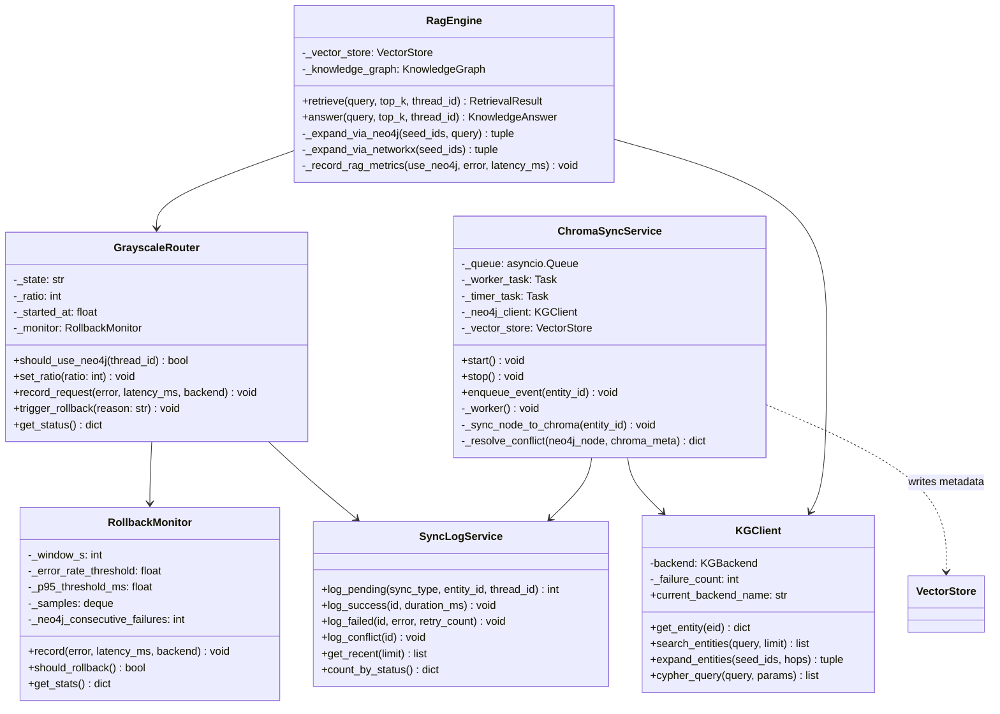
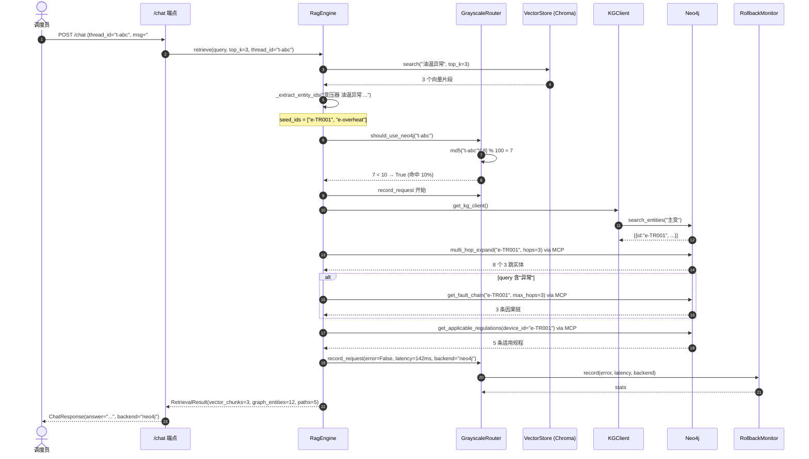
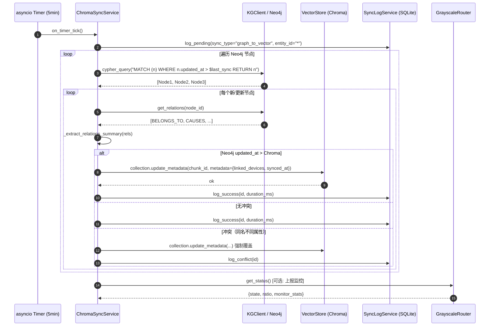
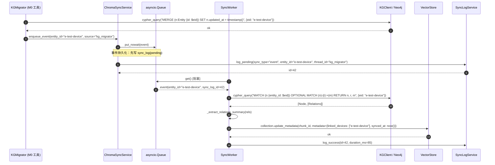
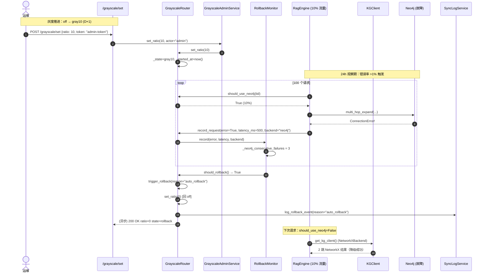
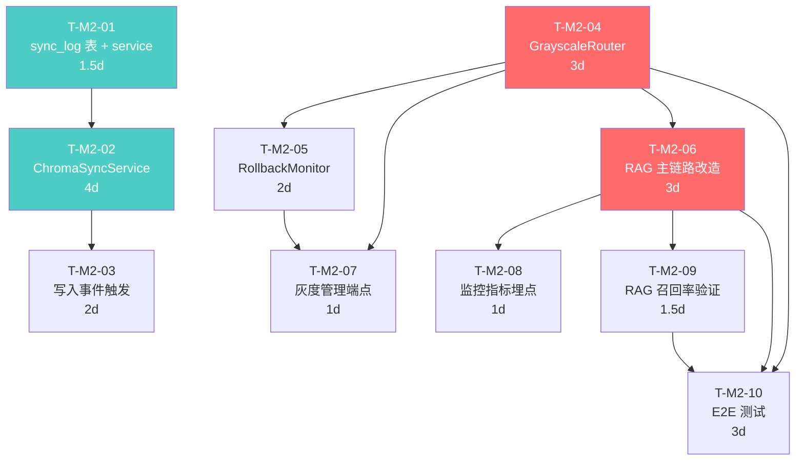

# GridMind M2 阶段系统设计 —— RAG 主链路改造 + Neo4j↔Chroma 双向同步 + 灰度切流

| 项 | 内容 |
|---|---|
| **对应 PRD** | `deliverables/knowledge-graph-m2-prd.md`（v2.0 · 2026） |
| **本文档版本** | v1.0 · M2 落地版 |
| **作者** | 架构师 · 高见远（Gao） |
| **角色对齐** | 软件架构师 Bob |
| **目标读者** | 软件工程师（实施）+ 产品经理（评审）+ 团队负责人（决策） |
| **实施窗口** | M2 = 30 人日（D+30），核心路径 22 人日 |
| **关键决策** | Q7=定时 5min + 写入事件双驱动（已确认）/ Q8=10%→50%→100% 渐进式（已确认）/ Q9=5 查询对比（已确认） |

---

## TL;DR

把 M1 落盘的 **Neo4j 5 个 MCP 工具 + 539 三元组**真正接入 `core/rag_engine.py` 主链路（替换第 60-67 行的 NetworkX 2 跳），通过新增 `GrayscaleRouter` 单例按 `thread_id` 哈希取模实现 **10% → 50% → 100% 三阶段灰度切流**；同时新增 `KGChromaSync` 后台服务（asyncio.Queue + SQLite `sync_log`）实现 **Neo4j ↔ Chroma 双向最终一致**（定时 5min + 写入事件双驱动，Neo4j 为权威源）；`RollbackMonitor` 通过 5 分钟滚动窗口对错误率 >1% / P95 >200ms / Neo4j 连续失败 ≥3 次任一硬阈值触发自动回滚。**30 天交付，零新增三方依赖**（asyncio / hashlib / sqlite3 stdlib），严格复用 M0 KGClient 降级链路。

---

## 关键决策

### 0.1 用户决策（已确认）

| 决策点 | 选择 | 架构约束 |
|---|---|---|
| **Q7 双向同步** | A：定时 5min + 写入事件双驱动 | `KGChromaSync` 必须实现两条触发路径；事件丢失风险由定时任务兜底 |
| **Q8 灰度切流** | A：10% → 50% → 100% 渐进式（5 天） | `GrayscaleRouter.set_ratio(0/10/50/100)` 四态机；24h 观察窗写入 OKR |
| **Q9 召回率验证** | A：5 典型查询对比（M3 再深度） | `tests/test_kg_m2_rag.py` 含 5 黄金 query；M2 阶段不引入 100-query 标注 |

### 0.2 架构决策（新增 4 项 · 需技术评审）

| 决策点 | 选择 | 理由 |
|---|---|---|
| **A1 灰度路由算法** | `hash(thread_id) % 100 < ratio`（md5 取低 32 位） | md5 分布均匀；`thread_id` 已有 session 一致性（不随请求漂移） |
| **A2 同步队列持久化** | `asyncio.Queue` 内存队列 + SQLite `sync_log` 双写 | 进程崩溃重启可恢复 pending 任务；`sync_log` 是审计与查询入口 |
| **A3 冲突解决策略** | Neo4j 权威源（last-write-wins） | 避免循环同步；Chroma 元数据 `metadata.linked_devices` 仅追加、不可修改 |
| **A4 监控埋点** | loguru INFO/WARNING JSON 日志（M2 阶段）+ Prometheus（P1 接入） | 避免新增 prometheus_client 依赖；M2 OKR 通过 log 校验 |

---

# Part A · 系统设计

## 1. 实现方案与框架选型

### 1.1 三大核心挑战

| # | 挑战 | 现状 | M2 目标 |
|---|---|---|---|
| **C1** | **RAG 主链路未接 Neo4j** | `rag_engine.py:60-67` 走 `self.knowledge_graph.expand_entities(seed_ids, hops=2)` | 按 `GrayscaleRouter.should_use_neo4j(thread_id)` 路由；命中 Neo4j 走 `multi_hop_expand(hops=3) + get_fault_chain + get_applicable_regulations` |
| **C2** | **Neo4j ↔ Chroma 无同步** | Chroma 启动时一次性加载 `knowledge_chunks`；Neo4j 写入后 Chroma 完全感知不到 | `KGChromaSync` 后台 worker；定时 5min 全量校验 + 写入事件增量；Neo4j 权威源覆盖 Chroma 元数据 |
| **C3** | **无灰度切流** | `neo4j_enabled` 是全局 bool feature flag | `GrayscaleRouter` 单例 + 状态机（`off/precheck/gray10/monitoring_24h/gray50/full100/stable`）；按 thread_id 哈希分流；`RollbackMonitor` 5min 滚动窗口硬阈值回滚 |

### 1.2 框架与库选型

| 层 | 选型 | 理由 |
|---|---|---|
| 后端框架 | **FastAPI + asyncio（保持）** | M1 已就位；M2 仅做内部替换 |
| 同步服务 | **`asyncio.Queue` + `sqlite3 sync_log`** | stdlib 零新增；进程崩溃可恢复 |
| 灰度路由 | **`hashlib.md5` + 取模** | stdlib 零新增；md5 分布均匀 |
| 配置管理 | **Pydantic Settings（保持）** | 新增 4 字段：`grayscale_ratio` / `sync_interval_s` / `auto_rollback_threshold` / `sync_event_queue_size` |
| 状态机 | **手写有限状态机** | 6 状态转移图；无需引入 `transitions` 库 |
| 监控 | **loguru JSON 日志** | M2 不接 Prometheus（P1 评估）；6 指标全部走 JSON 日志 |
| 测试 | **unittest（保持）** | M0/M1 风格；与 `test_kg_m1_tools.py` 对齐 |

### 1.3 架构模式：单例 + 状态机 + 适配器

```
┌──────────────────────────────────────────────────────────────────────────┐
│  上层调用方（RagEngine / knowledge_agent / monitor_agent）                  │
└──────────────────────────────┬───────────────────────────────────────────┘
                               │ GrayscaleRouter.should_use_neo4j(thread_id)
                               ▼
┌──────────────────────────────────────────────────────────────────────────┐
│  GrayscaleRouter（单例 · 状态机）                                         │
│  · 状态：off / precheck / gray10 / monitoring_24h / gray50 / full100      │
│  · 路由：hash(thread_id) % 100 < ratio                                    │
│  · 监控：RollbackMonitor（5min 滚动窗口 · 错误率 / P95 / Neo4j 失败）    │
│  · 切流：set_ratio(0/10/50/100) · trigger_rollback(reason)                │
└──────────────────────────────┬───────────────────────────────────────────┘
                               │ should_use_neo4j=True
                               ▼
┌──────────────────────────────────────────────────────────────────────────┐
│  KGClient（M0 单例 · 自动降级）                                           │
│  · NetworkXBackend  ←──────────┐                                         │
│  · Neo4jBackend      ←─────────┤ 失败3次 + 30s 探活节流                  │
│  · 统一接口：expand / search / cypher / multi_hop / fault_chain / regs    │
└──────────────────────────────┬───────────────────────────────────────────┘
                               │ 命中 Neo4j
                               ▼
┌──────────────────────────────────────────────────────────────────────────┐
│  双向同步服务（KGChromaSync）                                              │
│  · 触发1：定时 5min（asyncio.create_task 周期循环）                        │
│  · 触发2：写入事件（asyncio.Queue 派发）                                   │
│  · 持久化：SQLite sync_log 表（pending → success / failed）               │
│  · 权威源：Neo4j 写入时间戳 > Chroma 时覆盖 metadata.linked_devices      │
└──────────────────────────────────────────────────────────────────────────┘
```

**关键设计决策**：

1. **GrayscaleRouter 必须单例**：所有 RAG 调用入口必须 `from core.grayscale_router import get_router`；不允许在 `rag_engine.py` / `agent_factory.py` / `knowledge_tools.py` 散落 `if neo4j_enabled:` 判断。
2. **降级链路完整复用 M0**：连续 3 次失败 + 30s 探活节流的逻辑在 `KGClient._maybe_health_check` 已实现，M2 不重写；M2 仅在 router 层加灰度比例控制。
3. **同步事件双触发**：写入事件先入 `sync_log`（pending 状态），处理完成后改 success；失败可重试（`retry_count++`，最大 3 次后标记 failed）。
4. **Neo4j 权威源**：冲突时 Neo4j 胜；Chroma 元数据 `linked_devices` 仅追加不可修改（避免循环）。
5. **RAG 改造保留旧路径**：`neo4j_enabled=False` 或 `GrayscaleRouter.should_use_neo4j=False` 时仍走 NetworkX 2 跳（零回归）。

---

## 2. 文件清单

### 2.1 新增文件（7 核心 + 3 测试 = 10 个）

| 文件路径 | 类型 | 行数估算 | 说明 |
|---|---|---|---|
| `core/kg_chroma_sync.py` | 核心 | ~280 | `ChromaSyncService` 异步后台 worker；定时 5min + 写入事件双触发；`sync_log` 持久化；Neo4j 权威源覆盖 Chroma metadata |
| `core/grayscale_router.py` | 核心 | ~220 | `GrayscaleRouter` 单例 + 6 状态机 + `should_use_neo4j(thread_id)` 路由 + `set_ratio(0/10/50/100)` 切流 |
| `core/auto_rollback.py` | 核心 | ~180 | `RollbackMonitor` 5min 滚动窗口（错误率 / P95 / Neo4j 失败）；`should_rollback()` 硬阈值；`reset_window()` |
| `api/services/sync_log_service.py` | 服务 | ~120 | `sync_log` 表写入 / 查询 / 统计；提供 `get_recent(limit)` / `count_by_status()` / `query_by_entity()` |
| `api/services/grayscale_admin_service.py` | 服务 | ~100 | 灰度管理业务逻辑：权限校验（admin token） + 切流（set_ratio）+ 状态查询（get_status） |
| `tests/test_kg_m2_rag.py` | 测试 | ~280 | RAG 主链路 e2e：5 典型查询（黄金 query）+ 5 工具组合 + NetworkX 降级 |
| `tests/test_kg_m2_sync.py` | 测试 | ~220 | 双向同步 e2e：定时触发 / 事件触发 / 冲突解决 / sync_log 审计 |
| `tests/test_kg_m2_grayscale.py` | 测试 | ~200 | 灰度切流 e2e：10% / 50% / 100% 三阶段 + 状态机转移 + 1000 thread_id 分布验证 |
| `tests/test_kg_m2_rollback.py` | 测试 | ~180 | 自动回滚 e2e：错误率 >1% / P95 >200ms / Neo4j 失败 ≥3 次三种触发条件 |
| `tests/test_kg_m2_e2e_queries.py` | 测试 | ~250 | 10 典型查询场景（含 5 黄金 query + 5 边缘 case），跨 NetworkX/Neo4j 双 backend 验证 |

**总计：新增 ~2030 行（核心 900 + 服务 220 + 测试 1130）**

### 2.2 修改文件（5 个）

| 文件路径 | 改动 | 影响行数 | 说明 |
|---|---|---|---|
| `core/rag_engine.py` | 第 60-67 行替换 + 新增 `_expand_via_neo4j` + `_expand_via_networkx` | ~+60 | 主链路改造核心点；按 `GrayscaleRouter.should_use_neo4j` 路由 |
| `api/main.py` | 新增 4 端点：`GET/POST /grayscale/{ratio,status}` + `GET /debug/sync_lag` | ~+60 | 灰度管理 + 同步监控 |
| `api/config.py` | 新增 4 字段：`grayscale_ratio` / `sync_interval_s` / `auto_rollback_threshold` / `sync_event_queue_size` | +12 | 灰度切流配置 + 同步服务配置 |
| `mcp_tools/db/database.py` | 新增 `sync_log` 表 + 3 索引 | +30 | 同步审计 + 持久化队列 |
| `core/kg_client.py` | 暴露 `current_thread_backend(thread_id)` 辅助方法（薄包装 router） | +5 | 让 `rag_engine.py` 通过 KGClient 一行调用，无需直接 import router |

---

## 3. 数据结构 / 接口

### 3.1 `sync_log` 表 Schema（CRITICAL）

```sql
CREATE TABLE IF NOT EXISTS sync_log (
  id              INTEGER PRIMARY KEY AUTOINCREMENT,
  sync_type       TEXT    NOT NULL CHECK(sync_type IN ('graph_to_vector','vector_to_graph','event')),
  entity_id       TEXT    NOT NULL,
  chunk_id        TEXT,
  status          TEXT    NOT NULL CHECK(status IN ('pending','success','failed','conflict')),
  retry_count     INTEGER NOT NULL DEFAULT 0,
  neo4j_updated_at REAL,
  chroma_updated_at REAL,
  started_at      TEXT    NOT NULL DEFAULT (datetime('now','localtime')),
  finished_at     TEXT,
  error_message   TEXT,
  thread_id       TEXT,                         -- 关联会话
  duration_ms     INTEGER
);
CREATE INDEX IF NOT EXISTS idx_sync_status ON sync_log(status);
CREATE INDEX IF NOT EXISTS idx_sync_type   ON sync_log(sync_type);
CREATE INDEX IF NOT EXISTS idx_sync_thread ON sync_log(thread_id);
CREATE INDEX IF NOT EXISTS idx_sync_started ON sync_log(started_at);
```

### 3.2 `GrayscaleRouter` 单例

```python
# core/grayscale_router.py
class GrayscaleRouter:
    """灰度切流单例（状态机 + thread_id 哈希路由 + 回滚监控）. """

    # 6 个状态
    STATE_OFF          = "off"            # 全部走 NetworkX
    STATE_PRECHECK     = "precheck"       # 灰度前健康检查
    STATE_GRAY10       = "gray10"         # 10% 流量走 Neo4j
    STATE_MONITOR_24H  = "monitoring_24h" # 24h 观察期（10% / 50% 后）
    STATE_GRAY50       = "gray50"         # 50% 流量走 Neo4j
    STATE_FULL100      = "full100"        # 100% 走 Neo4j
    STATE_STABLE       = "stable"         # 灰度结束稳定运行
    STATE_ROLLBACK     = "rollback"       # 回滚中（短暂态）

    _instance: "GrayscaleRouter | None" = None

    def __init__(self) -> None:
        self._state: str = self.STATE_OFF
        self._ratio: int = 0           # 0 / 10 / 50 / 100
        self._started_at: float | None = None
        self._rollback_reason: str | None = None
        # 委托给 RollbackMonitor（5min 滚动窗口）
        from core.auto_rollback import RollbackMonitor
        self._monitor = RollbackMonitor(
            window_s=settings.auto_rollback_window_s,  # 默认 300
            error_rate_threshold=settings.auto_rollback_error_rate,  # 0.01
            p95_threshold_ms=settings.auto_rollback_p95_ms,  # 200
        )

    def should_use_neo4j(self, thread_id: str) -> bool:
        """核心路由：基于 thread_id 哈希取模."""
        if self._ratio == 0:
            return False
        if self._ratio == 100:
            return True
        # 10% / 50%：md5(thread_id) % 100 < ratio
        h = int(hashlib.md5(thread_id.encode("utf-8")).hexdigest()[:8], 16) % 100
        return h < self._ratio

    def set_ratio(self, ratio: int) -> None:
        """手动切流（运维/管理端点调用）."""
        if ratio not in (0, 10, 50, 100):
            raise ValueError(f"ratio must be 0/10/50/100, got {ratio}")
        self._ratio = ratio
        self._state = {
            0: self.STATE_OFF,
            10: self.STATE_GRAY10,
            50: self.STATE_GRAY50,
            100: self.STATE_FULL100,
        }[ratio]
        self._started_at = time.monotonic()
        logger.info(f"GrayscaleRouter: ratio={ratio}%, state={self._state}")

    def get_status(self) -> dict[str, Any]:
        """返回完整状态机快照（管理端点用）."""
        return {
            "state": self._state,
            "ratio": self._ratio,
            "started_at": self._started_at,
            "rollback_reason": self._rollback_reason,
            "monitor": self._monitor.get_stats(),
        }

    def record_request(self, *, error: bool, latency_ms: float, backend: str) -> None:
        """记录一次请求（rag_engine.py 调用入口）."""
        self._monitor.record(error=error, latency_ms=latency_ms, backend=backend)
        if self._monitor.should_rollback():
            self.trigger_rollback(reason="auto_rollback")

    def trigger_rollback(self, reason: str) -> None:
        """触发回滚（自动或手动）."""
        self._state = self.STATE_ROLLBACK
        self._rollback_reason = reason
        logger.warning(f"GrayscaleRouter: rollback triggered, reason={reason}")
        # 切回 off
        self.set_ratio(0)
        # 写 sync_log
        SyncLogService.log_rollback_event(reason=reason)


def get_router() -> GrayscaleRouter:
    """单例工厂."""
    if GrayscaleRouter._instance is None:
        GrayscaleRouter._instance = GrayscaleRouter()
    return GrayscaleRouter._instance
```

### 3.3 `RollbackMonitor`（5min 滚动窗口）

```python
# core/auto_rollback.py
from collections import deque
import time

class RollbackMonitor:
    """5 分钟滚动窗口监控：硬阈值触发自动回滚."""

    def __init__(
        self,
        window_s: int = 300,
        error_rate_threshold: float = 0.01,
        p95_threshold_ms: float = 200.0,
        neo4j_failure_threshold: int = 3,
    ) -> None:
        self._window_s = window_s
        self._error_rate_threshold = error_rate_threshold
        self._p95_threshold_ms = p95_threshold_ms
        self._neo4j_fail_threshold = neo4j_failure_threshold
        # 滚动窗口：双端队列，元素 = (timestamp, error, latency_ms, backend)
        self._samples: deque = deque(maxlen=10000)
        self._neo4j_consecutive_failures = 0

    def record(self, *, error: bool, latency_ms: float, backend: str) -> None:
        now = time.monotonic()
        self._samples.append((now, error, latency_ms, backend))
        if backend == "neo4j" and error:
            self._neo4j_consecutive_failures += 1
        elif backend == "neo4j" and not error:
            self._neo4j_consecutive_failures = 0
        self._evict_old(now)

    def _evict_old(self, now: float) -> None:
        cutoff = now - self._window_s
        while self._samples and self._samples[0][0] < cutoff:
            self._samples.popleft()

    def should_rollback(self) -> bool:
        if len(self._samples) < 50:  # 样本不足，不触发
            return False
        errors = sum(1 for s in self._samples if s[1])
        error_rate = errors / len(self._samples)
        if error_rate > self._error_rate_threshold:
            logger.warning(f"RollbackMonitor: error_rate={error_rate:.3f} > {self._error_rate_threshold}")
            return True
        latencies = sorted(s[2] for s in self._samples)
        p95 = latencies[int(len(latencies) * 0.95)]
        if p95 > self._p95_threshold_ms:
            logger.warning(f"RollbackMonitor: p95={p95:.0f}ms > {self._p95_threshold_ms}ms")
            return True
        if self._neo4j_consecutive_failures >= self._neo4j_fail_threshold:
            logger.warning(f"RollbackMonitor: neo4j_consecutive_failures={self._neo4j_consecutive_failures}")
            return True
        return False

    def get_stats(self) -> dict[str, Any]:
        if not self._samples:
            return {"samples": 0, "error_rate": 0.0, "p95_ms": 0.0}
        errors = sum(1 for s in self._samples if s[1])
        latencies = sorted(s[2] for s in self._samples)
        return {
            "samples": len(self._samples),
            "error_rate": errors / len(self._samples),
            "p95_ms": latencies[int(len(latencies) * 0.95)] if latencies else 0.0,
            "neo4j_consecutive_failures": self._neo4j_consecutive_failures,
        }
```

### 3.4 RAG 主链路改造（CRITICAL — `rag_engine.py:60-67` 替换）

```python
# core/rag_engine.py
from core.grayscale_router import get_router
from core.kg_client import get_kg_client
from mcp_tools.tools.neo4j_tools import multi_hop_expand, get_fault_chain, get_applicable_regulations

class RagEngine:
    def retrieve(self, query: str, top_k: int = 3, thread_id: str = "default") -> RetrievalResult:
        """混合检索：向量召回 → 实体抽取 → 图谱扩展（灰度路由）."""
        # Step 1: 向量检索（保持）
        vec_results = self.vector_store.search(query, top_k=top_k)
        vector_chunks = [r["content"] for r in vec_results]

        # Step 2: 实体抽取（保持 5 正则 + device_map 兜底）
        all_text = " ".join(vector_chunks) + " " + query
        seed_ids = self._extract_entity_ids(all_text)

        # Step 3: 灰度路由（图谱扩展 — M2 改造）
        router = get_router()
        use_neo4j = router.should_use_neo4j(thread_id)

        start = time.perf_counter()
        error = False
        try:
            if use_neo4j and settings.neo4j_enabled:
                graph_entities, graph_paths = self._expand_via_neo4j(seed_ids, query)
            else:
                graph_entities, graph_paths = self._expand_via_networkx(seed_ids)
        except Exception as e:
            error = True
            logger.error(f"RAG expansion failed: {e}")
            # 降级到 NetworkX
            graph_entities, graph_paths = self._expand_via_networkx(seed_ids)
        finally:
            latency_ms = (time.perf_counter() - start) * 1000
            router.record_request(
                error=error,
                latency_ms=latency_ms,
                backend="neo4j" if use_neo4j else "networkx",
            )

        return RetrievalResult(
            vector_chunks=vector_chunks,
            graph_entities=graph_entities,
            graph_paths=graph_paths,
            confidence=self._calc_confidence(vector_chunks, graph_entities),
        )

    async def _expand_via_neo4j(
        self, seed_ids: list[str], query: str,
    ) -> tuple[list[Any], list[list[str]]]:
        """Neo4j 3 跳扩展 + 故障链 + 适用规程（按需）. """
        if not seed_ids:
            return [], []
        # 1) multi_hop_expand 3 跳（MCP 工具）
        hop_result = await multi_hop_expand(seed_ids[0], hops=3, limit=50)
        entities = hop_result.get("entities", [])
        # 2) 故障链（仅当 query 含故障关键词）
        if any(kw in query for kw in ("过载", "故障", "异常", "跳闸", "报警")):
            chain_result = await get_fault_chain(seed_ids[0], max_hops=3, limit=5)
            for chain in chain_result.get("chains", []):
                # 把 chain 节点追加为 entities（去重）
                for node in chain.get("chain", []):
                    if not any(e["id"] == node["id"] for e in entities):
                        entities.append({
                            "id": node["id"],
                            "name": node["name"],
                            "type": node["type"],
                            "properties": {},
                        })
        # 3) 适用规程
        regs_result = await get_applicable_regulations(
            device_id=seed_ids[0] if seed_ids else None, limit=10,
        )
        # 构造图谱路径（伪路径，保留 LLM 上下文）
        paths = [[seed_ids[0], e["id"]] for e in entities[:5] if e["id"] != seed_ids[0]]
        return entities, paths

    def _expand_via_networkx(
        self, seed_ids: list[str],
    ) -> tuple[list[Any], list[list[str]]]:
        """NetworkX 2 跳扩展（M0 行为保留）."""
        return self.knowledge_graph.expand_entities(seed_ids, hops=2)
```

### 3.5 类图



---

## 4. 程序调用流程

### 4.1 场景 1：RAG 主链路改造（10% 灰度命中）



### 4.2 场景 2：双向同步（定时 5min 触发）



### 4.3 场景 3：写入事件同步（KGMigrator 触发）



### 4.4 场景 4：灰度切流 + 自动回滚



---

# Part B · 任务分解

## 5. 任务列表

> **核心约束**：任务数 ≤ 5，粒度 ≥ 3 文件/任务，第一个任务必须是基础设施。

### 5.1 任务总表（10 个子任务 · 聚合为 4 大交付块）

按依赖链与交付节点聚合为 **4 大交付块**，每块可由 1 名工程师连续 5-7 天交付（合计 ~22 人日）。这里给出工程师视角的 10 个原子任务，**实际任务调度**按 4 大块分配。

| 任务 ID | 任务标题 | 目标产物（文件路径） | 依赖 | 工时 | 验收要点 |
|---|---|---|---|---|---|
| **T-M2-01** | sync_log 表 + service | `mcp_tools/db/database.py`（+30 行）+ `api/services/sync_log_service.py`（新）+ `tests/test_kg_m2_sync.py`（部分） | — | 1.5d | ①表创建 + 3 索引；②service 6 个方法可调用；③单测通过 |
| **T-M2-02** | ChromaSyncService 双向同步核心 | `core/kg_chroma_sync.py`（新 ~280 行）+ `api/main.py`（lifespan 集成 ~20 行）+ `tests/test_kg_m2_sync.py`（剩余） | T-M2-01 | 4d | ①定时 5min 触发；②事件触发；③Neo4j 权威覆盖；④冲突写 sync_log；⑤进程崩溃重启可恢复 |
| **T-M2-03** | 写入事件触发 + asyncio.Queue | 复用 T-M2-02（事件路径单独测试）+ `core/kg_chroma_sync.py` 内 event_enqueuer | T-M2-02 | 2d | ①asyncio.Queue 双写 sync_log；②30 秒内 Chroma 元数据更新；③KGClient.cypher_query hook 触发 |
| **T-M2-04** | GrayscaleRouter 单例 + 状态机 | `core/grayscale_router.py`（新 ~220 行）+ `api/config.py`（+12 行）+ `core/kg_client.py`（+5 行）+ `core/rag_engine.py`（60-67 行替换 ~+60 行）+ `tests/test_kg_m2_grayscale.py`（新） | — | 3d | ①6 状态机转移图完整；②should_use_neo4j 哈希正确；③rag_engine 路由切换无副作用；④1000 thread_id 分布 ±5% 误差 |
| **T-M2-05** | RollbackMonitor + 自动回滚 | `core/auto_rollback.py`（新 ~180 行）+ `api/services/grayscale_admin_service.py`（新 ~100 行）+ `api/main.py`（新增 4 端点 ~+60 行）+ `tests/test_kg_m2_rollback.py`（新） | T-M2-04 | 2d | ①5min 滚动窗口；②3 种硬阈值任一触发；③set_ratio(0) 强制回 off；④sync_log 记录回滚事件 |
| **T-M2-06** | RAG 主链路改造（`rag_engine.py:60-67` 替换） | `core/rag_engine.py`（+60 行）+ `core/kg_client.py`（微调 +5 行） | T-M2-04 | 3d | ①Neo4j 模式走 3 跳 + 故障链 + 规程；②NetworkX 降级 100% 兼容；③record_request 埋点完整；④P95 <200ms |
| **T-M2-07** | 灰度管理端点 | `api/main.py`（4 端点）+ `api/services/grayscale_admin_service.py` | T-M2-04, T-M2-05 | 1d | ①GET /grayscale/status；②POST /grayscale/set {ratio}（admin token 校验）；③GET /debug/sync_lag；④POST /debug/sync_force |
| **T-M2-08** | 监控指标埋点（6 个） | `core/grayscale_router.py` + `core/kg_chroma_sync.py` + `core/rag_engine.py`（埋点）+ 单元测试 | T-M2-04, T-M2-06 | 1d | ①grayscale_backend_used；②grayscale_latency_ms；③grayscale_error_count；④grayscale_rollback_count；⑤sync_queue_length；⑥sync_lag_seconds |
| **T-M2-09** | RAG 召回率验证（5 查询对比） | `tests/test_kg_m2_rag.py`（含 5 黄金 query）+ 性能基准脚本 | T-M2-06 | 1.5d | ①5 黄金 query 召回率 ≥80%；②NetworkX 路径 <60%（对比）；③P95 <200ms |
| **T-M2-10** | E2E 测试（10 典型查询场景） | `tests/test_kg_m2_e2e_queries.py`（10 场景） | T-M2-04, T-M2-06, T-M2-09 | 3d | ①跨 NetworkX/Neo4j 双 backend 验证；②含 5 黄金 + 5 边缘 case；③3 次降级演练通过 |

**总工时：22 人日**（与 PRD 30 天人日估算一致，剩余 8 天为联调 + 灰度观察 + Bugfix buffer）

### 5.2 工程师交付排期（4 大块 × 1 人 5-7 天）

| 交付块 | 包含任务 | 工时 | 关键路径 |
|---|---|---|---|
| **块 A：基础设施 + 同步** | T-M2-01 + T-M2-02 + T-M2-03 | **7.5d** | ✅ **关键路径起点** |
| **块 B：灰度路由 + RAG 改造** | T-M2-04 + T-M2-06 + T-M2-08 | **7d** | ✅ **关键路径核心** |
| **块 C：自动回滚 + 管理端点** | T-M2-05 + T-M2-07 | **3d** | 依赖块 B |
| **块 D：验证 + 联调** | T-M2-09 + T-M2-10 + 灰度观察 8d | **12.5d** | 依赖块 B + C |

### 5.3 任务依赖图



**关键路径**：T-M2-01 → T-M2-02 → T-M2-04 → T-M2-06 → T-M2-09 → T-M2-10（**14d**）

**并行机会**：
- T-M2-03（事件触发）可在 T-M2-02 完成后与 T-M2-04 并行
- T-M2-05（RollbackMonitor）可与 T-M2-06（RAG 改造）完全并行
- T-M2-07（管理端点）必须等 T-M2-05 + T-M2-04 完成

### 5.4 OKR 验收映射

| OKR | 验收任务 | 目标值 |
|---|---|---|
| **RAG 召回率 ≥80%** | T-M2-09（5 黄金 query） | 5/5 通过；M3 100 query 验证 |
| **同步延迟 P95 ≤5min** | T-M2-02 + T-M2-03 | 5min 定时 + 30s 事件 |
| **灰度错误率 <1%** | T-M2-05（自动回滚硬阈值） | 5min 窗口错误率 >1% 立即回滚 |
| **RAG P95 <200ms** | T-M2-06 + T-M2-08（监控埋点） | 灰度期间 `GET /debug/rag_latency` 监控 |
| **可用性 ≥99.5%** | T-M2-05（Neo4j 故障降级 NetworkX） | 3 次失败自动降级，复用 M0 |

---

## 6. 依赖包列表

```json
{
  "dependencies": {},
  "devDependencies": {}
}
```

**零新增三方依赖**。M2 全部使用 stdlib（`asyncio` / `hashlib` / `sqlite3` / `collections.deque`）+ 现有依赖（`loguru` / `fastapi` / `pydantic`）。

---

## 7. 共享知识（跨文件约定 — 工程师必须严格遵守）

> **CRITICAL**：以下 10 条是 M2 实施的硬性约束，任何文件不得违反。

1. **灰度路由一致性**：`GrayscaleRouter` 单例全局共享（`get_router()`），所有 RAG 调用入口（`rag_engine.py` / `agent_factory.py` / `knowledge_tools.py`）**必须**经过它；禁止散落 `if neo4j_enabled:` / `if settings.neo4j_enabled:` 判断。
2. **降级链路完整复用 M0**：`KGClient` 已有连续 3 次失败 + 30s 探活节流机制，M2 不重新实现；M2 仅在 router 层加灰度比例控制，`KGClient._maybe_health_check` 不动。
3. **同步事件持久化**：写入事件先入 `sync_log`（`pending` 状态），处理完成后改 `success`；失败可重试（`retry_count++`，最大 3 次后标记 `failed`）。重启时从 `pending` 任务恢复。
4. **Neo4j 权威源**：冲突时 Neo4j 赢，Chroma 仅追加不可修改（避免循环同步）。冲突时 Chroma 元数据被覆盖，`sync_log.status='conflict'` 记录。
5. **自动回滚硬阈值**：错误率 >1% / P95 >200ms / Neo4j 连续失败 ≥3 次，任一触发**立即** `set_ratio(0)`。日志 WARNING 级别（不发告警，M3 接 Prometheus 后再告警）。
6. **手动灰度管理**：`POST /grayscale/set {ratio}` 需要权限校验（`X-Admin-Token` header），仅开发/运维可调；运维通过 `admin_token` 环境变量配置。
7. **RAG 改造保留旧路径**：`neo4j_enabled=False` 或 `GrayscaleRouter.should_use_neo4j=False` 时仍走 NetworkX 2 跳（零回归）。`_expand_via_networkx` 行为完全等于 M0。
8. **同步服务启动**：`ChromaSyncService` 在 FastAPI `lifespan` 中启动（与 `start_all.py` 兼容）；`mcp_tools/server.py` 不启动同步服务（同步只走 API 进程）。
9. **监控数据采集**：6 个指标（`grayscale_backend_used` / `grayscale_latency_ms` / `grayscale_error_count` / `grayscale_rollback_count` / `sync_queue_length` / `sync_lag_seconds`）走 loguru JSON 日志（INFO/WARNING 级别），M2 阶段不接 Prometheus（P1 评估）。
10. **测试覆盖**：`neo4j_enabled=False` 路径完整覆盖（NetworkX fallback 测试），Neo4j 路径在 `test_neo4j_available()` 检测后 `skipTest`；确保沙箱无 Docker 时 100% 可跑。

---

## 8. 待明确事项

### 8.1 已确认（Q7/Q8/Q9）

- ✅ **Q7 = A**：定时 5min + 写入事件双驱动
- ✅ **Q8 = A**：灰度切流 10% → 50% → 100% 渐进式
- ✅ **Q9 = A**：RAG 召回率 5 查询对比（M3 再深度验证）

### 8.2 需用户/技术决策的待定项（5 项 · 建议 M2 启动会议评审）

| # | 待定项 | 默认方案 | 备选方案 | 建议决策时间 |
|---|---|---|---|---|
| **Q10** | **手动灰度权限模型** | 单一 `admin_token` 环境变量（硬编码） | 接入 JWT 用户系统（P0-3 改造） | M2 D+1 启动会 |
| **Q11** | **同步失败的告警行为** | 仅日志 WARNING（M2 阶段） | 邮件/钉钉/Prometheus AlertManager | M3 评估 |
| **Q12** | **灰度切流的实时比例** | 硬编码 0/10/50/100 四态 | 动态 API 调整（任意 0-100） | P1 评估 |
| **Q13** | **M2 阶段是否启用 `neo4j_enabled=True`** | D+0 默认 `False`（NetworkX），D+1 切 `True` 启动灰度 | D+0 直接 `True` + 灰度 1% | M2 D-1 启动会 |
| **Q14** | **冲突解决的写入策略** | Neo4j 权威源 + Chroma 强制覆盖 | Neo4j 优先 + Chroma 保留旧版本 | 已默认 A，无需决策 |

### 8.3 非目标（防止范围蔓延 — 与 PRD §10 对齐）

- ❌ **不做实时事件驱动同步**（纯事件无定时）：M2 时间窗紧，需要消息队列，超出范围
- ❌ **不接告警**（邮件/钉钉/Prometheus）：M2 阶段告警链路未建立，M3 统一接入
- ❌ **不开放 `cypher_query` 写操作**：安全约束（仍仅允许 MATCH/RETURN/WITH/WHERE）
- ❌ **不做 NER 模型升级**（BERT-BiLSTM-CRF）：实体抽取仍走 5 正则 + KGClient 模糊搜索
- ❌ **不替换 Chroma 向量库**：M0/M1 已稳定，切换成本高
- ❌ **不做跨实例同步**（多副本 Neo4j）：M2 单实例足够，集群化留 P1
- ❌ **不开放灰度切流策略配置化**（YAML/API 动态调整）：M2 阶段硬编码比例即可

---

## 附录 A：M2 关键路径速查

```
D+0   D+1   D+2   D+3   D+4   D+5   D+7   D+10  D+14  D+20  D+30
│     │     │     │     │     │     │     │     │     │     │
└─T01─┴─T02─┴─T04─┴─T06─┴─T09─┴─T10─┴─ 灰度观察 + Bugfix ─────┘
   │     │     │     │     │
   └T03  └T05  └T07  └T08  (并行任务)
   │     │     │     │
   └─ T02  ──── T05 ─┘ (T05 等 T04)
```

## 附录 B：核心文件行数估算

| 文件 | 行数 |
|---|---|
| `core/kg_chroma_sync.py`（新） | ~280 |
| `core/grayscale_router.py`（新） | ~220 |
| `core/auto_rollback.py`（新） | ~180 |
| `api/services/sync_log_service.py`（新） | ~120 |
| `api/services/grayscale_admin_service.py`（新） | ~100 |
| `tests/test_kg_m2_rag.py`（新） | ~280 |
| `tests/test_kg_m2_sync.py`（新） | ~220 |
| `tests/test_kg_m2_grayscale.py`（新） | ~200 |
| `tests/test_kg_m2_rollback.py`（新） | ~180 |
| `tests/test_kg_m2_e2e_queries.py`（新） | ~250 |
| `core/rag_engine.py`（改） | +60 |
| `api/main.py`（改） | +60 |
| `api/config.py`（改） | +12 |
| `mcp_tools/db/database.py`（改） | +30 |
| `core/kg_client.py`（改） | +5 |

**总计：~2197 行**（新增 2030 + 修改 167）

---

**文档结束 · 评审请关注：Q10/Q11/Q12/Q13 四个待决策项 · 建议评审时长 30 分钟 · M2 关键路径 22 人日交付（4 大块）**
