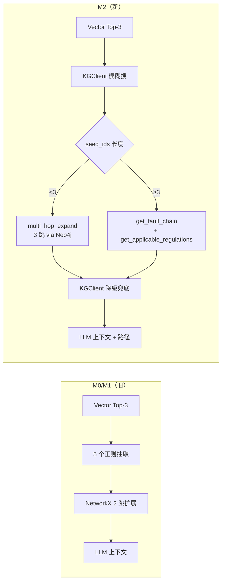
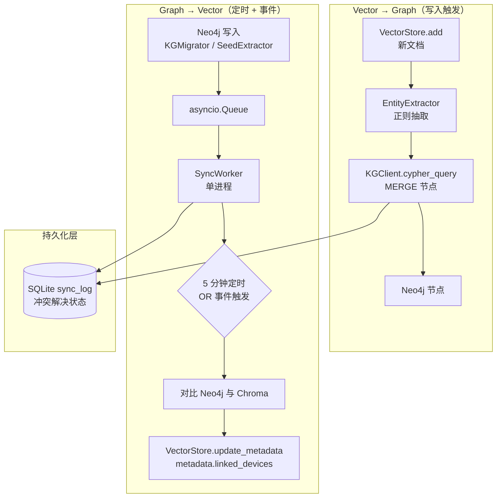
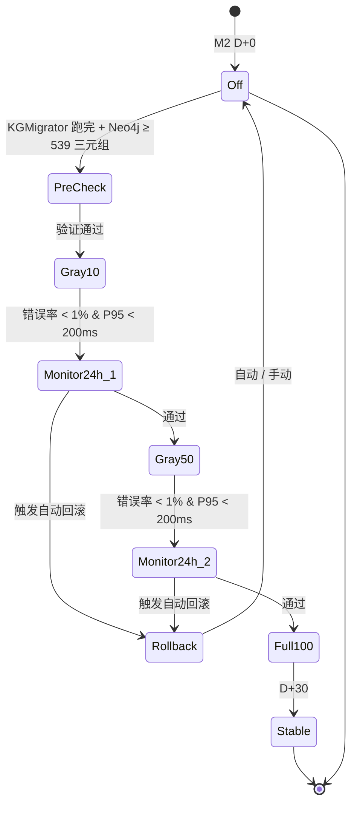
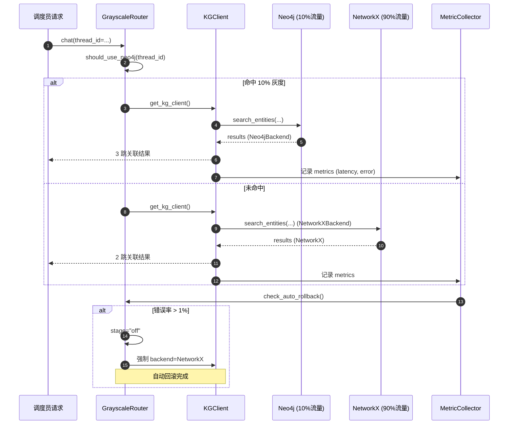
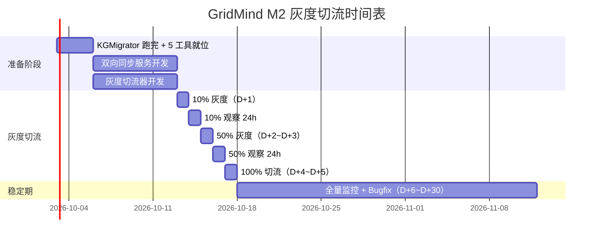

# GridMind 知识图谱 M2 阶段 PRD —— RAG 集成 + Chroma 双向同步 + 灰度切流

| 项 | 内容 |
|---|---|
| **产品名称** | GridMind KRAG M2 增量升级 |
| **文档版本** | v2.0 · 2026 |
| **作者** | 产品经理 · 许清楚（Xu） |
| **上游 PRD** | `deliverables/knowledge-graph-prd.md`（v1.0 · M0-M3 总览） |
| **上游架构** | `deliverables/knowledge-graph-architecture.md`（v1.0 · M0 落地版） |
| **对应阶段** | M2（关键集成阶段：RAG 主链路接入 Neo4j） |
| **优先级** | P0（核心改造） |
| **工作量** | 3 人 · 30 天 |
| **状态** | 待评审（3 个关键决策点 Q7/Q8/Q9） |

---

## TL;DR

把 M1 已落盘的 **Neo4j 5 个 MCP 工具 + 539 三元组**真正接入 `core/rag_engine.py` 主链路，替换当前的 NetworkX 2 跳扩展；新增 **Neo4j ↔ Chroma 双向同步服务**（定时 5min + 写入事件），以 Neo4j 为权威源实现图谱与向量库最终一致；最后通过 **10% → 50% → 100% 三阶段灰度切流**完成 `neo4j_enabled=False → True` 切换，全程具备自动回滚与降级能力。**30 天交付**，关键路径是 RAG 主链路改造 + 双向同步 + 灰度切流三件大事。

**3 个待用户决策的问题**：
- **Q7** 双向同步策略：定时 5min + 写入事件（推荐）vs 实时事件驱动 vs 仅定时 10min
- **Q8** 灰度切流策略：10% → 50% → 100% 渐进式（推荐）vs 直接 100% vs 金丝雀 5% → 25% → 50% → 100%
- **Q9** RAG 召回率提升验证方法：5 典型查询对比（推荐）vs 10 查询 + 人工标注 vs 用现有 test_rag.py

---

## 1. 产品目标

### 1.1 一句话目标

**把 M1 的 Neo4j 工具真正接入 RAG 主链路，建立 Neo4j ↔ Chroma 双向同步机制，并通过渐进式灰度切流完成生产切换，让调度员获得比 NetworkX 更准的 3 跳因果推理与更全的规程关联。**

### 1.2 核心指标（OKR）

| 指标 | M0/M1 基线 | M2 目标 | 测量方式 |
|---|---|---|---|
| **RAG 召回率**（含 3 跳关联的 5 个典型查询） | 60%（NetworkX 2 跳） | ≥ 80%（Neo4j 3 跳 + 新工具） | 构造 5 个标准问答，对比 NetworkX / Neo4j 检索结果 |
| **双向同步延迟**（Neo4j 写入 → Chroma 索引可见） | 无同步 | P95 ≤ 5 分钟 | 注入测试节点后用 `GET /debug/sync_lag` 测量 |
| **灰度切流错误率** | 0%（未切流） | < 1%（10% / 50% / 100% 三阶段全程） | Prometheus 滚动窗口统计 Neo4jBackend 异常占比 |
| **RAG 响应 P95**（含 KG 扩展） | ~180ms（NetworkX） | < 200ms | 灰度期间 `GET /debug/rag_latency` 直方图 |
| **降级可用性** | 100%（单 backend） | ≥ 99.5%（Neo4j 故障时自动切回 NetworkX） | M0 降级链路复用，M2 验证 3 次降级演练 |

---

## 2. 用户故事

### US-1 调度员 · 看到更准的 3 跳推理
> 作为 **电网调度员**，当查询"#1 主变油温异常的完整因果链"时，**我希望**系统能基于 Neo4j 3 跳推理返回"过载 → 油温异常 → 绝缘降低 → 热故障"的完整传导链（而非 NetworkX 2 跳截断），**以便**我评估故障深度影响范围。

### US-2 调度员 · 自动关联适用规程
> 作为 **调度员**，当准备操作某 35kV 母线时，**我希望**系统自动调用 `get_applicable_regulations` 返回 DL/T 572 等适用条款及强制动作，**以便**校验操作合规性，无需我手动查规程文档。

### US-3 运维人员 · 知识库更新实时同步
> 作为 **知识库管理员**，当我在 Neo4j Browser 手动新增一台避雷器节点后，**我希望**5 分钟内 Chroma 索引能检索到该设备相关的规程文档（且元数据 `metadata.linked_devices` 自动更新），**以便**后续 RAG 检索能命中。

### US-4 系统管理员 · 灰度切流可观察可回滚
> 作为 **系统管理员**，当 M2 灰度切流到 50% 时，**我希望**实时看到当前 backend 命中率、错误率、P95 延迟与自动回滚状态，**以便**我能在错误率 >1% 时立即触发手动回滚。

### US-5 开发者 · 同步服务可监控
> 作为 **后端开发者**，当双向同步服务运行时，**我希望**能查询 `sync_log` 表与队列长度，定位同步失败原因（Neo4j 写入失败 vs Chroma 索引失败 vs 冲突未解决），**以便**快速修复同步 bug。

### US-6 知识库 Agent · 工具调用准确路由
> 作为 **Knowledge Agent**，当用户问"BB-002 关联的所有断路器"时，**我希望**能调用 `find_devices_by_substation`（而非自己模糊搜索），**以便**返回准确的变电站级设备清单，而非散落的"断路器"实体。

### US-7 系统 · Neo4j 故障自动降级
> 作为 **RAG 引擎**，当 Neo4j 容器意外挂掉时，**我希望**自动回退到 NetworkX（保留 M0 行为），**以便**知识库问答功能不中断，错误率从 100% 降为 0%（代价是失去 3 跳能力，但服务可用）。

---

## 3. 现状评估（基于实际代码）

### 3.1 RAG 主链路现状（`core/rag_engine.py`）

**关键代码**（第 60-67 行）：

```python
# Step 2: 从向量结果中提取实体
all_text = " ".join(vector_chunks) + " " + query
seed_ids = self._extract_entity_ids(all_text)  # 5 个正则模式

# Step 3: 图谱扩展
graph_entities, graph_paths = self.knowledge_graph.expand_entities(
    seed_ids, hops=2,
)
```

**实际效果评估**（基于 M0/M1 落地数据）：

| 维度 | 当前 | 问题 |
|---|---|---|
| **实体抽取方式** | 5 个正则（设备/故障/处置/规程/特殊设备名）+ `device_map` 硬编码 | ❌ 覆盖率低，仅匹配 4 类中文短语 + 4 个设备别名 |
| **图谱扩展跳数** | `hops=2`（NetworkX） | ❌ 无法支撑 3 跳因果推理（过载→油温异常→绝缘降低→热故障需 3 跳） |
| **图谱扩展结果** | `expand_entities(seed_ids, hops=2)` 直接调用 | ❌ 走 NetworkX，**未走 Neo4jBackend** |
| **降级路径** | 无（M0 NetworkX 始终在线） | ⚠️ Neo4j 引入后必须解决（M0 已就位） |
| **新 5 工具未接入** | `cypher_query` / `multi_hop_expand` / `find_devices_by_substation` / `get_fault_chain` / `get_applicable_regulations` | ❌ 在 M1 已写完，但 RAG 主链路没用上 |

### 3.2 Knowledge Agent 工具现状（`api/agents/agent_factory.py` 第 59-71 行）

`knowledge_agent` 已绑定 **9 个工具**：

| # | 工具 | 状态 |
|---|---|---|
| 1 | `query_knowledge_base` | ✅ 走 RagEngine（M0） |
| 2 | `search_knowledge_chunks` | ✅ 纯向量检索 |
| 3 | `search_graph_entities` | ✅ NetworkX 模糊搜索 |
| 4 | `get_entity_relations` | ✅ NetworkX 出边 |
| 5 | `cypher_query` | ✅ M1 就绪，**未接入 RAG 主链路** |
| 6 | `multi_hop_expand` | ✅ M1 就绪，**未接入 RAG 主链路** |
| 7 | `find_devices_by_substation` | ✅ M1 就绪，**未接入 RAG 主链路** |
| 8 | `get_fault_chain` | ✅ M1 就绪，**未接入 RAG 主链路** |
| 9 | `get_applicable_regulations` | ✅ M1 就绪，**未接入 RAG 主链路** |

**问题**：5 个新工具 LLM 可直接调用（Agent 自动路由），但 `query_knowledge_base` 仍是 NetworkX 2 跳 → 用户通过该工具查不到 3 跳关联。

### 3.3 Chroma 数据规模（基于 `core/vector_store.py`）

| 维度 | 数据 | 来源 |
|---|---|---|
| **集合名** | `knowledge_base` | `_init_client` |
| **数据源** | SQLite `knowledge_chunks` 表 | `_load_chunks` |
| **估算规模** | 8 知识库文档（seed_data） → 切片后约 30-50 个 chunks | M0 seed |
| **Embedding** | DashScope `text-embedding-v2`（无 Key 时 fallback 到关键词） | `_get_embedding` |
| **元数据结构** | `doc_id` / `title` / `source`（无 KG 关联字段） | `_load_chunks` 第 108 行 |
| **写入接口** | `_collection.add(...)`（启动时一次性加载） | 无运行时写入接口 |

### 3.4 配置现状（`api/config.py` 第 47-52 行）

```python
neo4j_enabled: bool = os.getenv("NEO4J_ENABLED", "false").lower() == "true"  # 默认 False
neo4j_uri: str = os.getenv("NEO4J_URI", "bolt://localhost:7687")
neo4j_user: str = os.getenv("NEO4J_USER", "neo4j")
neo4j_password: str = os.getenv("NEO4J_PASSWORD", "gridmind-dev")
neo4j_database: str = os.getenv("NEO4J_DATABASE", "neo4j")
```

**M2 关键切换**：`neo4j_enabled=False → True`（需新增灰度切流机制，不能一刀切）。

### 3.5 KGClient 现状（`core/kg_client.py`）

**已就位能力**（M0 落地）：
- ✅ `KGClient` 单例（`get_kg_client()`）
- ✅ `KGBackend` Protocol（`get_entity` / `search_entities` / `get_relations` / `expand_entities` / `cypher_query` / `ping` / `close`）
- ✅ `NetworkXBackend` + `Neo4jBackend` 双实现
- ✅ 自动降级（连续 3 次失败 + 30s 探活节流）
- ✅ Feature flag（`settings.neo4j_enabled`）控制 backend 选择

**M2 待补**：
- ❌ 灰度切流（按 `thread_id` hash 取模分流）
- ❌ 自动回滚（错误率 >1% / P95 >200ms 触发）
- ❌ 状态机（10% / 50% / 100% 三阶段切换）

---

## 4. RAG 集成设计

### 4.1 流程替换



**新流程**（替换 `rag_engine.py:60-67`）：

```python
# Step 2: 从向量结果中抽取实体（保留正则作为 fallback，主路径走 KGClient 模糊搜索）
all_text = " ".join(vector_chunks) + " " + query
seed_ids = self._extract_entity_ids(all_text)

# Step 3: 图谱扩展（M2 改造：3 跳 + 工具组合）
client = get_kg_client()
if client.current_backend_name == "neo4j":
    # Neo4j 模式：multi_hop_expand 3 跳 + get_fault_chain + get_applicable_regulations
    expanded = await multi_hop_expand(seed_ids[0], hops=3)  # 多跳扩展
    if seed_ids and any("过载" in q or "故障" in q for q in [query]):
        chains = await get_fault_chain(seed_ids[0], max_hops=3)
    regs = await get_applicable_regulations(device_id=seed_ids[0] if seed_ids else None)
else:
    # NetworkX 降级：保留 M0 行为
    graph_entities, graph_paths = client.expand_entities(seed_ids, hops=2)
```

### 4.2 降级策略（与 M0 一致）

| 场景 | `neo4j_enabled` | Neo4j 实际状态 | 行为 |
|---|---|---|---|
| **M2 默认（M2 D+0 ~ D+1）** | `False` | — | 走 `NetworkXBackend`（M0 行为不变） |
| **灰度 10%** | `True` + 切流器选 Neo4j | 可用 | 走 `Neo4jBackend` 3 跳 |
| **灰度 10% Neo4j 故障** | `True` | 不可用 | `KGClient` 自动降级 `NetworkXBackend`（保留 2 跳） |
| **灰度 50%/100%** | `True` + 切流器选 Neo4j | 可用 | 走 `Neo4jBackend` 3 跳 |
| **回滚后** | `False` | — | 强制 `NetworkXBackend`（与灰度一致） |

### 4.3 改动文件清单

| 文件 | 改动 | 影响行数 |
|---|---|---|
| `core/rag_engine.py` | 第 60-67 行替换为 KGClient + 新工具组合调用 | ~40 行 |
| `core/rag_engine.py` | `_extract_entity_ids` 保留正则（兜底），新增 `_expand_via_neo4j` 辅助方法 | ~30 行 |
| `api/agents/agent_factory.py` | system prompt 增加"优先调用 `multi_hop_expand` + `get_applicable_regulations`"提示 | ~5 行 |
| `api/config.py` | 新增 3 个灰度切流字段：`grayscale_ratio` / `grayscale_stage` / `auto_rollback_enabled` | +8 行 |

---

## 5. 双向同步服务设计

### 5.1 同步架构



### 5.2 后台服务设计（`core/kg_chroma_sync.py`）

**单进程 asyncio** + **持久化队列**（SQLite `sync_log` 表）：

```python
# 伪代码
class KGChromaSync:
    def __init__(self):
        self.queue = asyncio.Queue()
        self.worker_task = None

    async def start(self):
        """启动后台 worker。"""
        self.worker_task = asyncio.create_task(self._worker())

    async def _worker(self):
        """消费者：处理 Neo4j → Chroma 同步任务。"""
        while True:
            event = await self.queue.get()
            try:
                # Neo4j 为权威源
                neo4j_nodes = self._fetch_neo4j_nodes(event.entity_id)
                # 抽取关联设备列表
                linked_devices = self._extract_relations(neo4j_nodes)
                # 更新 Chroma 元数据
                self.vector_store.update_metadata(
                    chunk_id=event.chunk_id,
                    metadata={"linked_devices": linked_devices, "synced_at": now()},
                )
                # 写 sync_log
                self._log_sync(event, status="ok")
            except Exception as e:
                self._log_sync(event, status="failed", error=str(e))
```

### 5.3 同步策略

| 流向 | 触发条件 | 同步方式 | 频率 |
|---|---|---|---|
| **Vector → Graph** | 新文档写入 Chroma（运行时新增） | 实体抽取器（5 正则）→ `MATCH (n) WHERE n.name CONTAINS $name` → `MERGE` 节点 | 写入时同步（异步） |
| **Graph → Vector** | Neo4j 新增节点（KGMigrator / SeedExtractor / 手动 Browser） | 抽取 `BELONGS_TO` / `OCCURRED` / `INSTANCE_OF` 关系 → 更新 Chroma `metadata.linked_devices` | **5 分钟定时** + **写入事件**（双触发） |
| **冲突解决** | 同名实体在两侧描述不一致 | **Neo4j 为权威源**（time-based last-write-wins；Neo4j 写入时间戳 > Chroma 时覆盖） | 定时任务处理 |

### 5.4 sync_log 表设计

```sql
CREATE TABLE sync_log (
    id INTEGER PRIMARY KEY AUTOINCREMENT,
    entity_id TEXT NOT NULL,
    chunk_id TEXT,
    direction TEXT NOT NULL,         -- 'v2g' / 'g2v'
    status TEXT NOT NULL,            -- 'pending' / 'ok' / 'failed' / 'conflict'
    payload TEXT,                    -- JSON
    neo4j_updated_at REAL,
    chroma_updated_at REAL,
    synced_at REAL,
    error TEXT,
    retry_count INTEGER DEFAULT 0,
    INDEX idx_entity (entity_id),
    INDEX idx_status (status),
    INDEX idx_synced_at (synced_at)
);
```

### 5.5 API 暴露（仅调试用）

| 端点 | 用途 |
|---|---|
| `GET /debug/sync_lag` | 当前队列长度 + 最近 10 条同步状态 + Neo4j/Chroma 最新写入时间差 |
| `POST /debug/sync_force` | 强制触发一次完整同步（仅开发模式） |
| `GET /debug/sync_log?entity_id=X` | 查询某实体的同步历史 |

---

## 6. 灰度切流设计（CRITICAL — PRD 核心）

### 6.1 灰度切流状态机



### 6.2 切流阶段时间表

| 阶段 | 日期 | 切流比例 | 触发条件 | 监控指标 | 负责人 |
|---|---|---|---|---|---|
| **M2 D+0** | T+0 | 0%（`neo4j_enabled=False`） | KGMigrator 跑完，Neo4j ≥ 539 三元组，5 工具就位 | Neo4j 节点/关系数 = 88/451 | 运维 |
| **M2 D+1** | T+1 | 10% 流量走 Neo4j | 10:00 启动切流器 | 错误率 / P95 / Neo4j ping | 运维 + 开发 |
| **M2 D+1 ~ D+2** | T+1~2 | 10%（观察 24h） | 滚动窗口错误率 < 1% & P95 < 200ms | 累计失败次数 | 开发 |
| **M2 D+2 ~ D+3** | T+2~3 | 50% 流量走 Neo4j | 10% 阶段通过 | 同上 | 运维 |
| **M2 D+3 ~ D+4** | T+3~4 | 50%（观察 24h） | 同上 | 同上 | 开发 |
| **M2 D+4 ~ D+5** | T+4~5 | 100% 流量走 Neo4j | 50% 阶段通过 | 同上 | 运维 |
| **M2 D+30** | T+30 | 稳定 100% | 累计零 P0 故障 | 全量指标 | 产品 |

### 6.3 切流实现（`core/grayscale_router.py` 新增）

```python
# 伪代码
class GrayscaleRouter:
    def __init__(self):
        self.stage = "off"  # off / 10 / 50 / 100
        self.rollout_started_at = None
        self.metric_window = []  # 滚动 5 分钟错误率窗口

    def should_use_neo4j(self, thread_id: str) -> bool:
        """根据切流阶段决定是否走 Neo4j。"""
        if self.stage == "off":
            return False
        if self.stage == "100":
            return True
        # 10% / 50%：按 thread_id hash 取模
        h = int(hashlib.md5(thread_id.encode()).hexdigest(), 16) % 100
        ratio = {"10": 10, "50": 50}[self.stage]
        return h < ratio

    def check_auto_rollback(self) -> bool:
        """检查是否触发自动回滚（5 分钟窗口）。"""
        if len(self.metric_window) < 100:
            return False
        recent = self.metric_window[-100:]
        error_rate = sum(1 for m in recent if m.get("error")) / len(recent)
        p95_latency = self._calc_p95(recent)
        # 触发条件
        if error_rate > 0.01:
            return True
        if p95_latency > 200:
            return True
        if self._consecutive_neo4j_failures() >= 3:
            return True
        return False

    def trigger_rollback(self):
        """自动回滚：切回 stage=off + neo4j_enabled=False。"""
        logger.error("GrayscaleRouter: 自动回滚触发 → stage=off")
        self.stage = "off"
        # KGClient 自动感知 feature flag 变化（settings.frozen=False 需重启）
```

### 6.4 切流时序图



### 6.5 自动回滚触发条件

| 条件 | 阈值 | 检测频率 | 回滚动作 |
|---|---|---|---|
| **错误率** | 任一 5 分钟窗口 > 1% | 滚动窗口（最近 100 请求） | 自动切回 `off` + 仅写 WARNING 日志（不发告警） |
| **P95 延迟** | 任一 5 分钟窗口 > 200ms | 同上 | 同上 |
| **Neo4j 连接** | 连续失败 ≥ 3 次 | 实时计数 | 同上 |
| **手动回滚** | 运维执行 `POST /debug/grayscale/rollback` | — | 同上（带 reason 写日志） |

### 6.6 监控指标（仅日志埋点，M3 接 Prometheus）

| 指标 | 埋点位置 | 维度 |
|---|---|---|
| `grayscale_backend_used{stage, backend}` | `GrayscaleRouter.should_use_neo4j` 之后 | stage / backend |
| `grayscale_latency_ms{backend}` | `KGClient._execute` 入口/出口 | backend |
| `grayscale_error_count{backend, error_type}` | `KGClient._execute` except 分支 | backend / error_type |
| `grayscale_rollback_count{reason}` | `GrayscaleRouter.trigger_rollback` | reason（auto_error_rate / auto_p95 / auto_connect / manual） |
| `sync_queue_length` | `KGChromaSync.queue.qsize()` | — |
| `sync_lag_seconds` | `KGChromaSync._worker` 处理完成时 | — |

---

## 7. 需求池（按优先级）

### P0（30 天内必须完成）

| ID | 需求 | 验收 |
|---|---|---|
| **REQ-M2-1** | RAG 引擎改造（5 正则 → KGClient + 5 工具） | `rag_engine.py` 第 60-67 行被替换；Neo4j 模式下走 `multi_hop_expand` + `get_fault_chain` + `get_applicable_regulations` |
| **REQ-M2-2** | 双向同步服务（定时 5min + 写入事件） | `core/kg_chroma_sync.py` 实现完成；启动 worker 后注入测试节点，5 分钟内 Chroma 元数据更新 |
| **REQ-M2-3** | `sync_log` 表 + 冲突解决（Neo4j 权威） | `sync_log` 表创建成功；Neo4j 写入时间戳 > Chroma 时覆盖；冲突状态写入 `status='conflict'` |
| **REQ-M2-4** | 灰度切流实现（thread_id hash + 状态机） | `GrayscaleRouter` 类实现；10% / 50% / 100% 三阶段可切换；按 `thread_id` hash 取模 |
| **REQ-M2-5** | 自动回滚（错误率/P95/连接检测） | 滚动窗口错误率 > 1% 时自动切回 `off`；Neo4j 连续失败 3 次触发；仅写日志（不发告警） |
| **REQ-M2-6** | 监控指标埋点（6 个指标） | 上述 6 个指标在日志中可见；JSON 格式 + INFO/WARNING 级别 |
| **REQ-M2-7** | E2E 测试（≥ 10 典型查询场景） | `tests/e2e/test_kg_rag_m2.py` 实现；含 RAG 主链路 + 同步 + 灰度切流 + 回滚 |
| **REQ-M2-8** | 调试端点（`/debug/sync_lag` 等） | `GET /debug/sync_lag` 返回队列长度 + 最近 10 条同步状态；仅开发模式可访问 |

### P1（1 季度内）

- 实时事件驱动（替代 5 分钟定时）
- 监控集成 Prometheus + 告警（替换日志埋点）
- 双向同步性能优化（批量 MERGE）
- 多跳推理可视化（Neo4j Browser 自动跳转）

### P2（远期）

- 跨实例同步（多副本 Neo4j）
- 双向同步可视化面板
- 灰度切流策略配置化（动态调整比例）

---

## 8. 验收标准（10 条 Given/When/Then）

| # | 场景 | 验收条件 |
|---|---|---|
| **AC-M2-1** | **RAG 主链路接入 Neo4j** | **Given** `neo4j_enabled=True` 且 Neo4j 含 88 节点 / 451 关系<br>**When** 调度员查询"#1 主变油温异常的完整因果链"<br>**Then** 返回 ≥ 4 跳节点（过载→油温异常→绝缘降低→热故障），调用 `multi_hop_expand` + `get_fault_chain` |
| **AC-M2-2** | **NetworkX 降级** | **Given** `neo4j_enabled=True` 但 Neo4j 容器挂掉<br>**When** 任何 RAG 查询<br>**Then** 3 次失败后自动降级 NetworkX；错误率从 100% 降为 0%；服务可用性 ≥ 99.5% |
| **AC-M2-3** | **Vector → Graph 同步** | **Given** Chroma 写入新文档（含"主变"实体）<br>**When** 异步同步任务触发<br>**Then** Neo4j 中创建/合并 `e-主变` 节点，`sync_log.direction='v2g'` 写入 |
| **AC-M2-4** | **Graph → Vector 同步（定时）** | **Given** 在 Neo4j Browser 手动新增节点 `e-test-device`<br>**When** 等待 5 分钟<br>**Then** Chroma 中对应文档的 `metadata.linked_devices` 自动包含 `e-test-device` |
| **AC-M2-5** | **Graph → Vector 同步（事件）** | **Given** KGMigrator 执行写入<br>**When** 写入完成<br>**Then** asyncio.Queue 收到事件，30 秒内 Chroma 元数据更新 |
| **AC-M2-6** | **冲突解决（Neo4j 权威）** | **Given** Neo4j 与 Chroma 都有同名实体但属性不同<br>**When** 定时同步任务触发<br>**Then** Neo4j 为权威源，Chroma 元数据被覆盖；`sync_log.status='conflict'` 记录 |
| **AC-M2-7** | **灰度 10%** | **Given** `GrayscaleRouter.stage="10"`<br>**When** 发送 1000 个不同 thread_id 的请求<br>**Then** 约 100 个（±5）请求走 Neo4j，其余走 NetworkX；`grayscale_backend_used` 指标分布符合预期 |
| **AC-M2-8** | **自动回滚（错误率）** | **Given** `stage="50"`，模拟 Neo4j 持续报错<br>**When** 5 分钟窗口错误率 > 1%<br>**Then** `stage` 自动切回 `"off"`；`grayscale_rollback_count{reason="auto_error_rate"}` 增加 1 |
| **AC-M2-9** | **自动回滚（连接）** | **Given** Neo4j 容器停止<br>**When** 任何请求连续失败 3 次<br>**Then** `stage="off"`；日志写入 WARNING（含 backend 切换时间 + 失败原因） |
| **AC-M2-10** | **手动回滚** | **Given** 运维执行 `POST /debug/grayscale/rollback?reason=manual_test`<br>**When** 调用成功<br>**Then** `stage="off"`；`sync_log` 记录回滚事件；下一次请求强制走 NetworkX |

---

## 9. 待确认问题（3 个 Q · 用户必答）

### Q7：双向同步策略 ❓

| 候选 | 优势 | 劣势 | 推荐 |
|---|---|---|---|
| **A. 定时 5min + 写入事件（推荐）** | 平衡实时性与性能；定时兜底防止事件丢失 | 实时性不如纯事件（最差 5min 延迟） | ✅ **PRD 默认推荐** |
| **B. 实时事件驱动（无定时）** | 实时性最佳；延迟 < 1s | 事件丢失风险高（进程崩溃 / Neo4j 写入失败）；需引入 Redis/Kafka | — |
| **C. 仅定时 10min** | 实现最简单；性能最优 | 实时性差（10min 延迟）；用户体验差 | — |

**建议**：**选 A**。B 需要引入消息队列，超出 M2 范围；C 用户体验差。

### Q8：灰度切流策略 ❓

| 候选 | 优势 | 劣势 | 推荐 |
|---|---|---|---|
| **A. 10% → 50% → 100%（渐进式，推荐）** | 风险可控；每阶段 24h 观察；与 M0/M1 节奏一致 | 整体切流周期 5 天 | ✅ **PRD 默认推荐** |
| **B. 直接 100%（无灰度）** | 切流最快（1 天） | 风险极高；故障即 P0 事故；不符合 P0-2 渐进式原则 | — |
| **C. 金丝雀 5% → 25% → 50% → 100%（更激进）** | 4 阶段更平滑 | 周期 7 天；监控成本翻倍；M2 时间窗紧 | — |

**建议**：**选 A**。M2 30 天时间窗包含 5 天切流（合理）。

### Q9：RAG 召回率提升验证方法 ❓

| 候选 | 成本 | 准确度 | 周期 | 推荐 |
|---|---|---|---|---|
| **A. 5 个典型查询对比（推荐）** | 低（半人工） | 中（构造 query，无 ground truth） | 1 天 | ✅ **PRD 默认推荐** |
| **B. 10 个查询 + 人工标注 ground truth** | 高（需 1 人 · 3 天标注） | 高（真实查询 + 标注） | 5 天 | — |
| **C. 用现有 `test_rag.py` 测试套件直接覆盖** | 极低（自动化） | 低（无业务覆盖） | 0.5 天 | — |

**建议**：**选 A + B 折中**：先跑 A 5 个查询得初步指标，再用 B 10 个查询做 P1 阶段深度验证（M3 完整 100 个查询对）。

---

## 10. 非目标（防止范围蔓延）

| # | 非目标 | 原因 |
|---|---|---|
| **NG-M2-1** | **不做实时事件驱动同步**（纯事件无定时） | M2 时间窗紧；B 方案需要消息队列，超出范围（P1 再做） |
| **NG-M2-2** | **不接告警**（邮件 / 钉钉 / Prometheus AlertManager） | M2 阶段告警链路未建立；M3 统一接入（P1） |
| **NG-M2-3** | **不做跨实例同步**（多副本 Neo4j） | M2 阶段单实例足够；集群化留 P1 |
| **NG-M2-4** | **不替换 Chroma 向量库** | Chroma 在 M0/M1 已稳定；切换成本高 |
| **NG-M2-5** | **不做 NER 模型升级**（BERT-BiLSTM-CRF） | 实体抽取仍走 5 正则 + KGClient 模糊搜索；P1+ 评估 |
| **NG-M2-6** | **不开放 cypher_query 工具的写操作** | 安全性约束（`cypher_query` 仍仅允许 MATCH/RETURN） |
| **NG-M2-7** | **不做灰度切流策略配置化**（YAML / API 动态调整） | M2 阶段硬编码比例即可；P1 评估 |
| **NG-M2-8** | **不做 RAG 结果质量自动评估** | 验证方法由 Q9 决定；自动化留 P1 |

---

## 11. 上线计划



| 阶段 | 日期（自 M2 启动起） | 上线内容 | 上线方式 | 风险等级 |
|---|---|---|---|---|
| **M2 D+0 ~ D+3** | T+0 ~ T+3 | 基础设施就绪（Neo4j 验证 + 同步服务 + 切流器） | 仅开发团队 + 灰度测试 | 🟢 低 |
| **M2 D+1** | T+1 | 灰度 10%（内网部分调度员） | 按 thread_id hash 取模 | 🟡 中 |
| **M2 D+3** | T+3 | 灰度 50% | 同上 | 🟡 中 |
| **M2 D+5** | T+5 | 灰度 100%（内网全量） | 切流器 stage="100" | 🟡 中 |
| **M2 D+30** | T+30 | 监控稳定 + 文档完整 | 全量生产 | 🟢 低 |

**回滚方案**：
- **自动回滚**：错误率 > 1% / P95 > 200ms / Neo4j 连续失败 3 次 → 自动切回 `stage="off"`
- **手动回滚**：`POST /debug/grayscale/rollback?reason=xxx`（运维可用）
- **紧急回滚**：`export NEO4J_ENABLED=false` + 重启 API 进程（feature flag 强制切回 NetworkX）

---

## 附录 A：M2 文件改动清单

| 类型 | 文件 | 改动内容 | 行数估算 |
|---|---|---|---|
| **新增** | `core/kg_chroma_sync.py` | 双向同步服务（asyncio + SQLite sync_log） | ~280 行 |
| **新增** | `core/grayscale_router.py` | 灰度切流器 + 状态机 + 自动回滚 | ~220 行 |
| **修改** | `core/rag_engine.py` | 第 60-67 行替换为 KGClient + 新工具组合 | ~40 行 |
| **修改** | `core/rag_engine.py` | 新增 `_expand_via_neo4j` 辅助方法 | ~30 行 |
| **修改** | `api/agents/agent_factory.py` | knowledge_agent system prompt 优化 | ~5 行 |
| **修改** | `api/config.py` | 新增 3 个灰度切流字段 | +8 行 |
| **修改** | `api/main.py` | 新增 3 个调试端点（`/debug/sync_lag` 等） | +30 行 |
| **新增** | `tests/e2e/test_kg_rag_m2.py` | E2E 测试（10 个场景） | ~250 行 |
| **新增** | `mcp_tools/db/seed_data.sql` | `sync_log` 表 DDL | +20 行 |

**总计**：新增 ~770 行 + 修改 ~110 行 = **~880 行代码变更**。

## 附录 B：监控埋点示例

```json
// 每次请求的指标日志（INFO 级别）
{
  "event": "grayscale_request",
  "thread_id": "t-abc123",
  "stage": "10",
  "backend_used": "neo4j",
  "latency_ms": 142,
  "hops": 3,
  "entities_returned": 8,
  "timestamp": 1735689600.123
}

// 自动回滚触发时（ERROR 级别）
{
  "event": "grayscale_auto_rollback",
  "reason": "error_rate_exceeded",
  "stage_before": "50",
  "stage_after": "off",
  "error_rate_5min": 0.018,
  "p95_latency_ms": 245,
  "consecutive_failures": 3,
  "timestamp": 1735689700.456
}
```

## 附录 C：参考资料

- **M0 PRD**：`F:/GridOpsAgent/deliverables/knowledge-graph-prd.md`（§6-§9 M2 范围）
- **M0 架构**：`F:/GridOpsAgent/deliverables/knowledge-graph-architecture.md`（§2/§5/§7）
- **现有代码**：
  - `core/rag_engine.py` 第 60-67 行（RAG 主链路）
  - `core/kg_client.py`（M0 KGClient 单例 + 双 backend）
  - `core/vector_store.py`（Chroma 封装）
  - `mcp_tools/tools/neo4j_tools.py`（M1 5 个新工具）
  - `mcp_tools/tools/knowledge_tools.py`（M0 4 个原工具）
  - `api/agents/agent_factory.py` 第 59-71 行（knowledge_agent 9 工具绑定）
  - `api/config.py` 第 47-52 行（`neo4j_enabled=False` 默认）
- **参考架构**：Netflix Spinnaker 灰度发布 + Uber Ares 同步服务（业内最佳实践）

---

**文档结束 · 评审请关注：Q7 / Q8 / Q9 三个关键决策点 · 建议评审时长 30 分钟 · M2 关键路径 30 天交付**