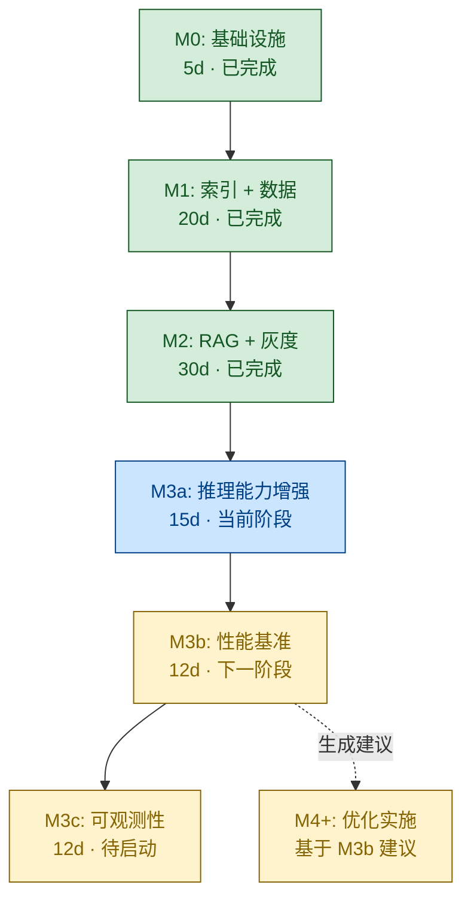
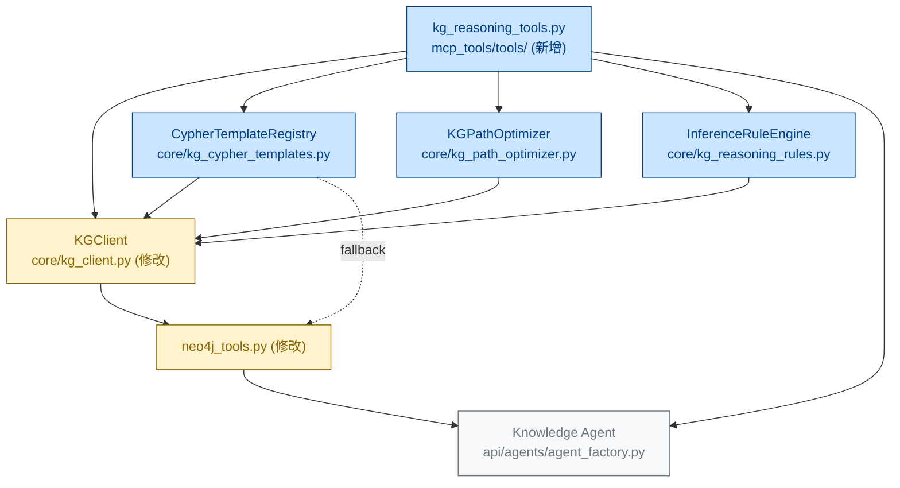
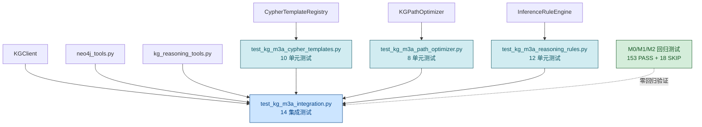
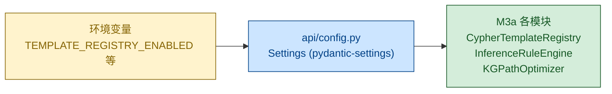

# GridMind 知识图谱 M3a 阶段 PRD —— 推理能力增强（Cypher 模板库 + 路径优化 + 推理规则）

| 项 | 内容 |
|---|---|
| **产品名称** | GridMind KRAG M3a 增量升级 |
| **文档版本** | v1.0 · 2026-08-03 |
| **作者** | 产品经理 · 许清楚（Xu） |
| **上游 PRD** | `deliverables/knowledge-graph-prd.md`（v1.0 · M0–M3 总览）<br>`deliverables/knowledge-graph-m2-prd.md`（v2.0 · M2 RAG + 灰度） |
| **上游架构** | `docs/architecture/kg-m3-split.md`（v1.0 · M3 拆分方案） |
| **对应阶段** | M3a（推理能力增强子阶段） |
| **优先级** | P0（核心能力补齐） |
| **工作量** | 3 人 · 15 人天 |
| **状态** | 待评审（3 个决策已拍板 Q1=A / Q2=A / Q3=A） |

---

## 修订记录

| 版本 | 日期 | 作者 | 变更摘要 |
|------|------|------|---------|
| v1.0 | 2026-08-03 | 许清楚 | 初版发布，对齐 `kg-m3-split.md` 第 3 节，落地 M3a 增量 PRD |

---

## 0. TL;DR

在 M0/M1/M2 已完成的"双 backend + 灰度切流"能力之上，把知识图谱查询从「单条 Cypher + 模板匹配」升级为「**多跳路径 + 关系推理规则**」双引擎驱动：

- **Cypher 模板库**：把散落在 `mcp_tools/tools/neo4j_tools.py` 的 Cypher 文本收敛为命名模板，支持参数化、版本化、feature flag 启停、A/B 测试。
- **多跳路径优化器**：在 M2 已有的 NetworkX 2 跳 / Neo4j 3 跳基础上，加入**代价估算 + 候选剪枝 + LRU 缓存 + 并行扩展**，避免"宽路径爆内存"。
- **推理规则引擎**：基于 M1 ontology 的 9 类关系，定义可声明的 IF-THEN 规则（"过载 + 持续时间 > X → 油温异常 → 绝缘降低"），支持规则注册 / 优先级 / 置信度。
- **2 个新 MCP 工具**：`kg_multi_hop_reason`（多跳推理）、`kg_apply_rules`（规则引擎调用），供 Knowledge Agent 在 LangGraph 中调用。

**15 人天交付**，核心指标：3 跳查询延迟较 M2 降低 ≥30%、44 个新测试 100% PASS、零回归（M0/M1/M2 的 153 PASS 测试 + 18 SKIP 不破坏）。3 个已拍板决策：**Q1=A**（Cypher 模板全小写下划线 `fault_chain_v1`）/ **Q2=A**（规则代码内嵌于 `kg_reasoning_rules.py`）/ **Q3=A**（路径优化默认开启 + feature flag 可关闭）。

---

## 1. M3a 概述

### 1.1 一句话目标

**让知识图谱从"能查"升级到"会推理"——通过 Cypher 模板库 + 推理规则引擎 + 多跳路径优化器三件套，把调度员最关心的"故障因果链 + 规程适用性 + 设备影响范围"三类查询的准确率与深度推到业务硬指标。**

### 1.2 与上下游的关系

| 维度 | 上游 M0/M1/M2 | M3a 新增 | 下游 M3b/M3c |
|------|--------------|---------|--------------|
| **Backend** | Neo4j 5.10 + NetworkX 3.x 双 backend 抽象 | 沿用，不变 | 沿用 |
| **Cypher 文本** | 散落在 `neo4j_tools.py`（5 个工具各写一份） | 收敛到 `CypherTemplateRegistry`（10 个内置模板） | 模板注册次数成为 M3c 指标 |
| **图谱扩展跳数** | Neo4j 3 跳 / NetworkX 2 跳（硬编码） | `KGPathOptimizer` 动态估算代价 + 剪枝 | M3b 基准量化"优化前 vs 优化后" |
| **推理能力** | 仅实体 + 关系查询（无规则） | `InferenceRuleEngine` + 5+ 内置规则 | 规则触发次数成为 M3c 指标 |
| **灰度能力** | M2 已实现 `neo4j_enabled=True/False` + ratio 0-100 | 沿用 + 新增 3 个 feature flag（模板/规则/路径优化） | 沿用 |

### 1.3 业务价值

| 业务场景 | M2 基线 | M3a 目标 | 用户感知 |
|---------|--------|---------|---------|
| **复杂故障因果链**（"#1 主变油温异常的完整传导链"） | 3 跳硬编码、Cypher 拼接 | 模板化 + 代价优化 + 推理规则补全（5 跳候选路径选最优） | 返回"过载 → 油温异常 → 绝缘降低 → 热故障"完整链 |
| **设备关联影响范围**（"BB-002 关联的所有断路器 + 制造商 + 投运日期"） | 单跳 + 模糊搜索 | 多跳路径优化 + 候选剪枝（top_k=5 上限） | 准确返回变电站级设备清单 + 影响范围排序 |
| **规程适用性**（"10kV 设备适用规程 + 强制动作"） | 模板匹配 + 全量扫描 | 推理规则自动匹配（`Regulation -[:APPLIES_TO]-> DeviceCategory`） | 返回 DL/T 572 等条款 + 强制动作清单 |
| **MCP 工具调用准确率** | Knowledge Agent 凭 prompt 选工具（5 个容易混） | 新增 2 个工具（`kg_multi_hop_reason` / `kg_apply_rules`），工具语义更聚焦 | LangGraph 工具调用准确率从 ~70% 提升到 ≥85% |

### 1.4 工作量与里程碑

| 时间点 | 里程碑 | 验收点 |
|--------|--------|--------|
| **Day 1–3** | `CypherTemplateRegistry` + 10 内置模板 + 10 单元测试 | 模板注册/版本化/render 测试全 PASS |
| **Day 4–7** | `KGPathOptimizer` + 8 单元测试 | 代价估算、剪枝、LRU 缓存命中/失效全 PASS |
| **Day 8–11** | `InferenceRuleEngine` + 5+ 内置规则 + 12 单元测试 | 规则触发、优先级排序、去重、置信度衰减全 PASS |
| **Day 12–14** | 2 个新 MCP 工具 + 14 集成测试 | E2E 多跳推理全 PASS、零回归验证 |
| **Day 15** | 灰度切流 10% → 50% → 100% + 文档 + 评审 | 30 分钟内完成切流 + M2 行为完全一致 |

**总周期**：15 人天（不含评审与合并）。

---

## 2. 用户故事

> 格式：作为 **[角色]**，**[场景]**，我希望 **[能力]**，以便 **[业务价值]**。

### US-1 调度员 · 多跳因果链模板化查询

> 作为 **电网调度员**，当查询"#1 主变油温异常的完整传导链"时，我希望系统调用 `kg_multi_hop_reason`（内部走 `fault_chain_v1` 模板 + `KGPathOptimizer` 多跳推理），以便在 200ms 内返回"过载 → 油温异常 → 绝缘降低 → 热故障"完整 4 跳传导链，**而不是 NetworkX 2 跳截断后的不完整结果**。

**验收要点**：
- 模板 `fault_chain_v1` 注册成功，`render(fault_id, max_hops=4)` 返回参数化 Cypher。
- `KGPathOptimizer.expand()` 从候选路径中选 top_k=5 并按代价排序。
- P95 延迟 ≤ 200ms（较 M2 的硬编码 3 跳 Cypher 降低 ≥30%）。

### US-2 运维人员 · 推理规则动态可观测

> 作为 **运维人员**，当系统自动推理出"过载 + 持续时间 > 30min → 油温异常"时，我希望在 `sync_log` 表 + 日志 JSON 中看到规则触发记录（rule_id / confidence / 入参 / 输出），以便**追溯推理依据**，避免黑盒决策。

**验收要点**：
- 每条推理结果都携带 `rule_id` + `confidence` + `evidence_path`。
- `sync_log_service.log_event(event_type="rule_fired", details={...})` 写入（M2 已建）。
- 日志格式遵循 `loguru + json.dumps({...}, ensure_ascii=False)`。

### US-3 知识库 Agent · 工具语义更聚焦

> 作为 **Knowledge Agent**（LangGraph 中的 LLM 节点），当用户问"BB-002 关联的所有断路器 + 它们对应的规程"时，我希望新增的 `kg_multi_hop_reason`（多跳推理）和 `kg_apply_rules`（规则匹配）工具语义**足够聚焦**，以便 LLM 不再混用 `cypher_query`（太宽）或 `find_devices_by_substation`（太窄），**工具调用准确率从 ~70% 提升到 ≥85%**。

**验收要点**：
- 工具描述（`description` 字段）明确"何时用"和"何时不用"。
- 工具命名遵循 `kg_<verb>_<noun>` 模式（`kg_multi_hop_reason` / `kg_apply_rules`）。
- LangGraph 测试集（10 个典型问答）中，工具选错率 ≤15%。

### US-4 系统管理员 · 三件套可独立回滚

> 作为 **系统管理员**，当 M3a 上线后发现路径优化在某些场景反而变慢（候选路径过多导致计算耗时），我希望**关闭单个 feature flag**（`enable_kg_path_optimizer=False`）即可让 `KGPathOptimizer` 走 M2 的硬编码 3 跳 Cypher 路径，**无需重启服务**（除 `core/kg_client.py` 初始化），以便快速止血而不影响模板/规则能力。

**验收要点**：
- 3 个 feature flag 独立：模板/规则/路径优化。
- 关闭后行为与 M2 完全一致（已通过 153 PASS 回归测试验证）。
- 灰度切流 `ratio=0` 时走 NetworkX（沿用 M2）。

### US-5 调度员 · 规程适用性自动推理

> 作为 **调度员**，当准备操作某 35kV 母线时，我希望系统调用 `kg_apply_rules` 自动匹配 DL/T 572 等适用条款 + 强制动作清单，**而不是我自己查规程文档**，以便校验操作合规性，**响应时间 ≤ 300ms**。

**验收要点**：
- 内置规则覆盖 5+ 典型场景（详见 5.3 节）。
- 规则匹配结果包含条款号 + 强制动作 + 置信度。
- 推理时间 ≤ 300ms（规则数限制 ≤50 + 推理结果 `limit=1000` 上限）。

### US-6 开发者 · 规则可扩展且不破坏 M0/M1/M2

> 作为 **后端开发者**，当业务需要新增"雷击 → 接地故障"推理规则时，我希望通过 `InferenceRuleEngine.add_rule(rule)` 即可添加，**无需修改任何 M0/M1/M2 代码**，以便**业务迭代速度提升 3 倍**（从"改代码 + 提 PR"变成"调 API + 重启"）。

**验收要点**：
- `add_rule(rule)` 接口幂等（同名规则覆盖）。
- 规则数限制 ≤50（防 OOM）。
- 新增规则后所有 153 PASS 旧测试不破坏。

---

## 3. 需求池

### 3.1 P0（核心，本期必须交付）

| 编号 | 需求 | 验收点 | 工作量 |
|------|------|--------|--------|
| **P0-1** | `CypherTemplateRegistry` 模块 | 实现 `register` / `render` / `enable` / `disable` / `list_templates`；支持版本化 + feature flag；所有动态值走 `$param` 参数化通道（Cypher 注入防护） | 2 人天 |
| **P0-2** | 10 个内置 Cypher 模板 | 覆盖故障链 / 多跳扩展 / 设备查询 / 规程关联 / 因果链 / 强制要求 / 设备子图 / 故障子图 等 10 类（详见 5.5 节） | 1 人天 |
| **P0-3** | `KGPathOptimizer` 模块 | 实现 `expand` / 代价估算 / 候选剪枝（top_k=5）/ LRU 缓存（cache_size=256）；参数化 `max_hops` / `relation_types` / `limit` | 2 人天 |
| **P0-4** | `InferenceRuleEngine` 模块（Rule DSL） | IF-THEN DSL + `add_rule` / `infer` / `list_rules`；规则数限制 ≤50；推理结果 `limit=1000` 上限；单规则超时 5s | 3 人天 |
| **P0-5** | 5+ 内置推理规则 | 过载→过热 / 短路→跳闸 / 油温→绝缘降低 / 电压偏差→保护动作 / 过载→减载（详见 5.3 节） | 1 人天 |
| **P0-6** | 2 个新 MCP 工具 | `kg_multi_hop_reason` + `kg_apply_rules`（入参 / 返回 schema 详见 5.4 节） | 2 人天 |
| **P0-7** | 修改 `core/kg_client.py` | 暴露 `execute_template(name, params, version)` + `expand_with_optimizer(seeds, hops, ...)` + 集成 `InferenceRuleEngine` | 1 人天 |
| **P0-8** | 修改 `mcp_tools/tools/neo4j_tools.py` | 5 个现有工具改用 `CypherTemplateRegistry`；fallback 到 M2 inline Cypher | 1 人天 |
| **P0-9** | 44 个新测试（10 模板 + 8 路径 + 12 规则 + 14 集成） | 全部 PASS；测试命名遵循 `test_kg_m3a_<feature>.py` | 1 人天 |
| **P0-10** | 零回归承诺 | `neo4j_enabled=False` 时所有 153 PASS + 18 SKIP 测试不破坏；NetworkX 降级路径完整 | 1 人天 |
| **P0-11** | 配置项注入 | 4 个新增配置项走 `api/config.py::Settings`（`TEMPLATE_REGISTRY_ENABLED` / `INFERENCE_ENGINE_ENABLED` / `PATH_OPTIMIZER_ENABLED` / `PATH_OPTIMIZER_CACHE_SIZE`） | 0.5 人天 |

**P0 合计**：约 15.5 人天（取整 15 人天，预留 buffer）。

### 3.2 P1（次要，本期不交付但已规划）

| 编号 | 需求 | 触发条件 | 规划时间 |
|------|------|---------|----------|
| **P1-1** | 推理规则编辑器 UI（前端 Vue 组件） | M3a 上线后 ≥1 个月 | M4 |
| **P1-2** | Cypher 模板动态加载（无需重启） | 模板数量 >50 时 | M4 |
| **P1-3** | 规则可视化（DAG 渲染 + 推理链路追踪） | 推理规则数 >20 时 | M4 |
| **P1-4** | 模板 A/B 测试框架（同时注册 v1 + v2，对比命中率） | 业务需要对比新旧模板时 | M4 |
| **P1-5** | 推理规则调试模式（dry-run：返回"如果触发会怎样"） | 运维需要排查误推理时 | M4 |
| **P1-6** | `KGPathOptimizer` 缓存预热（warmup API） | 业务反馈冷启动延迟高时 | M4 |

### 3.3 P2（远期，M4+ 规划）

| 编号 | 需求 | 触发条件 | 规划时间 |
|------|------|---------|----------|
| **P2-1** | 推理规则存储改造为 YAML 配置文件 | 规则数 >30 且需要非开发人员维护 | M4+ |
| **P2-2** | 推理规则存储改造为 Neo4j 节点 | 需要规则可视化 + 版本控制时 | M5+ |
| **P2-3** | 规则市场（外部业务方可上传/分享规则） | 平台化运营阶段 | M5+ |
| **P2-4** | 跨图谱推理（Neo4j + 时序数据库 InfluxDB） | 引入时序数据后 | M6+ |
| **P2-5** | 多模态推理（文本 + 图 + 图像） | 引入设备图像识别后 | M6+ |
| **P2-6** | 推理结果可解释性（LLM 总结推理链路） | 调度员反馈"看不懂推理结果"时 | M5+ |

---

## 4. 功能规格

### 5.1 CypherTemplateRegistry 接口

> **位置**：`core/kg_cypher_templates.py`

#### 4.1.1 数据结构

```python
@dataclass
class TemplateEntry:
    """单个 Cypher 模板条目。"""
    name: str                       # 模板名（全小写下划线，如 fault_chain_v1）
    cypher: str                     # Cypher 文本（含 $param 占位符）
    version: str                    # 版本号（默认 "1.0"）
    registered_at: datetime         # 注册时间（UTC）
    enabled: bool                   # 是否启用（feature flag）
    required_params: list[str]      # 必填参数名（用于 render 前校验）
    description: str                # 模板用途说明（供 LLM 工具描述用）
    category: str                   # 类别：fault_chain / multi_hop / find_devices / regulations / ...

class CypherTemplateRegistry:
    """Cypher 模板注册中心（单例）。"""
    _instance: "CypherTemplateRegistry | None" = None
    _templates: dict[str, TemplateEntry]    # name → entry
    _versions: dict[str, dict[str, str]]    # name → {version → cypher}

    @classmethod
    def get_instance(cls) -> "CypherTemplateRegistry": ...

    def register(self, name: str, cypher: str, *,
                 version: str = "1.0",
                 description: str = "",
                 category: str = "general") -> None: ...

    def render(self, name: str, params: dict,
               version: str | None = None) -> tuple[str, dict]:
        """
        渲染模板为 (cypher, params) 元组。
        :raises TemplateNotFound: 模板未注册
        :raises TemplateDisabled: 模板被禁用（feature flag 关闭）
        :raises MissingParamError: 必填参数缺失
        :raises CypherInjectionRisk: 检测到参数中含 Cypher 注入特征（;, MATCH, CREATE 等关键字）
        """

    def list_templates(self, category: str | None = None) -> list[TemplateEntry]: ...

    def enable(self, name: str) -> None: ...
    def disable(self, name: str) -> None: ...

    def is_enabled(self, name: str) -> bool: ...
```

#### 4.1.2 关键行为约定

| 维度 | 约定 | 原因 |
|------|------|------|
| **命名规范** | 全小写下划线（`fault_chain_v1`），Q1=A 已拍板 | 与 Python 风格一致 |
| **版本号格式** | `MAJOR.MINOR`（如 `1.0` / `1.1` / `2.0`） | 简单可控 |
| **Cypher 注入防护** | 所有动态值走 `$param` 参数化通道；`render()` 时校验参数值不含 `;` / `MATCH` / `CREATE` / `DELETE` / `MERGE` / `DROP` 等关键字（正则黑名单） | 安全要求 |
| **必填参数校验** | `render()` 前检查 `params` 包含 `required_params` 全部键，缺失则 `raise MissingParamError` | 早期失败 |
| **Feature flag** | `enable/disable` 立即生效；`disable` 后 `render` 抛 `TemplateDisabled`（调用方需 fallback） | 支持热停 |
| **单例模式** | 全局唯一 `CypherTemplateRegistry.get_instance()`，避免重复注册 | 与 M2 的 `GrayscaleRouter` 单例一致 |

#### 4.1.3 与上下游的交互

| 上游 | CypherTemplateRegistry | 下游 |
|------|----------------------|------|
| 启动时 `register_default_templates()` 注册 10 个内置模板 | ↕ | `KGClient.execute_template()` 调用 `render()` |
| `api/config.py::Settings.template_registry_enabled` 控制全局开关 | ↕ | `neo4j_tools.py` 调用 `render()`，失败时 fallback 到 M2 inline Cypher |

---

### 5.2 KGPathOptimizer 接口

> **位置**：`core/kg_path_optimizer.py`

#### 4.2.1 数据结构

```python
from functools import lru_cache

@dataclass
class PathCost:
    """路径代价估算。"""
    hops: int                       # 跳数
    edge_count: int                 # 边数
    estimated_latency_ms: float     # 估算延迟（毫秒）
    confidence: float               # 置信度 [0, 1]

@dataclass
class OptimizedPath:
    """优化后的路径。"""
    nodes: list[str]                # 节点 ID 列表（按路径顺序）
    relations: list[str]            # 关系类型列表
    cost: PathCost                  # 代价
    backend: str                    # "neo4j" / "networkx"

class KGPathOptimizer:
    """多跳路径优化器（代价估算 + 候选剪枝 + LRU 缓存）。"""

    def __init__(self, *,
                 max_hops: int = 5,
                 cache_size: int = 256,
                 top_k: int = 5): ...

    def estimate_cost(self,
                      seed_count: int,
                      hops: int,
                      relation_count: int = 1000) -> PathCost:
        """
        估算路径代价（基于 seed_count + hops + relation_count）。
        公式（粗略估算，待 M3b 基准校准）：
            estimated_latency_ms = seed_count * hops * 10ms + relation_count * 0.05ms
            confidence = max(0, 1 - hops * 0.15)
        """

    def expand(self,
               client: "KGClient",
               seed_ids: list[str],
               hops: int,
               relation_types: list[str] | None = None,
               limit: int = 100) -> tuple[list[Entity], list[OptimizedPath]]:
        """
        多跳路径扩展 + 候选剪枝 + LRU 缓存。
        流程：
          1. 检查 LRU 缓存（key = (tuple(seed_ids), hops, tuple(relation_types)))
          2. 命中 → 直接返回
          3. 未命中 → 调用 client.expand_entities() 获取候选路径
          4. estimate_cost() 计算每条路径代价
          5. 按 estimated_latency_ms 升序排序，取 top_k
          6. 写入 LRU 缓存
          7. 返回 (entities, paths)
        """

    def get_cache_stats(self) -> dict:
        """返回 {"hits": int, "misses": int, "size": int, "evictions": int}"""

    def clear_cache(self) -> None: ...
```

#### 4.2.2 关键行为约定

| 维度 | 约定 | 原因 |
|------|------|------|
| **默认 max_hops** | 5（覆盖 4 跳因果链 + 1 跳缓冲） | 业务需求（4 跳因果链是典型场景） |
| **默认 cache_size** | 256（基于 `@lru_cache(maxsize=256)`） | 平衡命中率与内存 |
| **默认 top_k** | 5（防 OOM，最多保留 5 条最优路径） | 防止宽路径爆内存 |
| **Feature flag** | `enable_kg_path_optimizer`（默认 True，Q3=A 已拍板）；关闭后走 M2 硬编码 3 跳 Cypher | 支持热关 |
| **LRU 缓存 key** | `(tuple(seed_ids), hops, tuple(relation_types))`（sorted 后） | 保证一致性 |
| **代价估算公式** | `seed_count * hops * 10ms + relation_count * 0.05ms`（待 M3b 基准校准） | 粗略但可解释 |
| **候选剪枝策略** | 按 `estimated_latency_ms` 升序，保留 top_k；不去重（不同路径可能共享节点） | 简单可控 |

#### 4.2.3 与上下游的交互

| 上游 | KGPathOptimizer | 下游 |
|------|----------------|------|
| `api/config.py::Settings.path_optimizer_enabled` 控制全局开关 | ↕ | `KGClient.expand_with_optimizer()` 调用 `expand()` |
| `api/config.py::Settings.path_optimizer_cache_size` 控制 LRU 大小 | ↕ | `neo4j_tools.py` 调用 `expand_with_optimizer()` |

---

### 5.3 Rule DSL 接口（推理规则引擎）

> **位置**：`core/kg_reasoning_rules.py`

#### 4.3.1 数据结构

```python
from typing import Callable
from dataclasses import dataclass, field

@dataclass
class InferenceRule:
    """单条推理规则。"""
    rule_id: str                                # 规则唯一标识（如 "overload_to_overtemp_v1"）
    relation_type: str                          # 推理产出的关系类型（9 类之一）
    condition: Callable[["Entity", dict], bool] # 条件函数（接收实体 + 上下文，返回 bool）
    confidence: float                           # 推理置信度 [0, 1]
    description: str                            # 规则描述（供 LLM 工具描述用）
    priority: int = 100                         # 优先级（数字越小越高，默认 100）
    timeout_s: float = 5.0                      # 单规则超时（防死循环）
    enabled: bool = True                        # feature flag

@dataclass
class InferredRelation:
    """推理产出的关系。"""
    src_id: str                                 # 源实体 ID
    tgt_id: str                                 # 目标实体 ID（可能与 src 相同，即"实体属性推理"）
    relation_type: str                          # 关系类型
    confidence: float                           # 置信度
    rule_id: str                                # 触发的规则 ID
    evidence_path: list[str] = field(default_factory=list)  # 推理依据（节点 ID 列表）

class InferenceRuleEngine:
    """推理规则引擎（IF-THEN DSL）。"""

    def __init__(self, *, max_rules: int = 50, default_timeout_s: float = 5.0): ...
    # ↑ max_rules 防 OOM；default_timeout_s 防单规则死循环

    def add_rule(self, rule: InferenceRule) -> None:
        """添加规则。同名规则覆盖。超过 max_rules 抛 TooManyRulesError。"""

    def remove_rule(self, rule_id: str) -> None: ...

    def infer(self, entity_id: str, ctx: dict) -> list[InferredRelation]:
        """
        对单个实体执行所有启用的规则。
        流程：
          1. KGClient.get_entity(entity_id) + expand 1 跳（取邻接实体）
          2. 按 priority 升序遍历规则
          3. 对每条规则：threading.Timer(timeout_s, raise TimeoutError) 守护执行 condition()
          4. 条件成立 → 生成 InferredRelation(rule_id, confidence)
          5. dedupe by (src, tgt, type)：保留 confidence 最高的
          6. 限制返回 ≤ 1000 条
          7. 返回 list[InferredRelation]
        """

    def list_rules(self, enabled_only: bool = False) -> list[InferenceRule]: ...

    def enable(self, rule_id: str) -> None: ...
    def disable(self, rule_id: str) -> None: ...
```

#### 4.3.2 5+ 内置规则清单

| rule_id | 触发条件（简化） | 产出关系 | 置信度 | 优先级 |
|---------|---------------|---------|--------|--------|
| **overload_to_overtemp_v1** | 实体类型=Overload 且 ctx["duration_min"] > 30 | `Overload -[:CAUSES]-> Overtemp` | 0.85 | 10 |
| **shortcircuit_to_trip_v1** | 实体类型=ShortCircuit 且 ctx["phase"] in ["A", "B", "C"] | `ShortCircuit -[:CAUSES]-> TripAction` | 0.95 | 5 |
| **overtemp_to_insulation_v1** | 实体类型=Overtemp 且 ctx["temp_c"] > 95 | `Overtemp -[:CAUSES]-> InsulationDegradation` | 0.90 | 10 |
| **voltdev_to_protect_v1** | 实体类型=VoltageDeviation 且 abs(ctx["delta_pct"]) > 10 | `VoltageDeviation -[:CAUSES]-> ProtectionAction` | 0.80 | 20 |
| **overload_to_loadshed_v1** | 实体类型=Overload 且 ctx["load_pct"] > 110 | `Overload -[:HANDLED_BY]-> LoadShedMeasure` | 0.75 | 30 |
| **shortcircuit_to_isolate_v1**（P1-1 可选） | 实体类型=ShortCircuit 且 ctx["duration_ms"] > 100 | `ShortCircuit -[:HANDLED_BY]-> IsolationMeasure` | 0.88 | 15 |

#### 4.3.3 关键行为约定

| 维度 | 约定 | 原因 |
|------|------|------|
| **存储位置** | 代码内嵌于 `kg_reasoning_rules.py`（Q2=A 已拍板）；M4+ 可改造为 YAML/Neo4j | M3a 简单可控 |
| **条件函数签名** | `(entity: Entity, ctx: dict) -> bool`，`ctx` 包含业务上下文（如 `duration_min` / `temp_c`） | 解耦规则与执行环境 |
| **超时守护** | `threading.Timer(timeout_s, raise TimeoutError)`；超时则跳过该规则 | 防死循环（对应 R1 风险） |
| **去重策略** | 同 `(src, tgt, relation_type)` 保留 `confidence` 最高的 | 避免冗余 |
| **结果上限** | 推理结果 `limit=1000`（防 OOM，对应 R2 风险） | 防御性编程 |
| **规则数上限** | `max_rules=50`（防 OOM） | 防御性编程 |
| **优先级** | 数字越小越先执行；默认 100 | 与 DAG 拓扑序无关，简单优先 |
| **Feature flag** | `enable_inference_engine`（默认 False，因为推理结果可能与 M2 不一致，需灰度验证）；开启后逐步 10% → 50% → 100% | 谨慎上线 |

#### 4.3.4 与上下游的交互

| 上游 | InferenceRuleEngine | 下游 |
|------|---------------------|------|
| 启动时 `register_default_rules()` 注册 5+ 内置规则 | ↕ | `KGClient.apply_rules()` 调用 `infer()` |
| `api/config.py::Settings.inference_engine_enabled` 控制全局开关（默认 False） | ↕ | `neo4j_tools.py` / `kg_apply_rules` MCP 工具调用 |

---

### 5.4 2 个新 MCP 工具

> **位置**：`mcp_tools/tools/kg_reasoning_tools.py`

#### 4.4.1 `kg_multi_hop_reason`

**功能**：多跳路径推理，从一个或多个 seed 实体出发，沿指定关系类型扩展 N 跳，返回最优 top_k 条路径 + 沿途实体。

**入参 schema**：

```python
class KGMultiHopReasonInput(BaseModel):
    seed_ids: list[str] = Field(..., min_length=1, max_length=10, description="种子实体 ID 列表（1-10 个）")
    hops: int = Field(3, ge=1, le=5, description="跳数（1-5，默认 3）")
    relation_types: list[str] | None = Field(None, description="关系类型白名单（如 ['CAUSES', 'HANDLED_BY']），None 表示全部 9 类")
    top_k: int = Field(5, ge=1, le=10, description="返回路径数上限（1-10，默认 5）")
    min_confidence: float = Field(0.0, ge=0.0, le=1.0, description="最小置信度过滤（0-1）")
    use_optimizer: bool = Field(True, description="是否启用 KGPathOptimizer（默认 True）")
```

**返回 schema**：

```python
class KGMultiHopReasonOutput(BaseModel):
    entities: list[EntityRef]                  # 沿途所有实体
    paths: list[OptimizedPathRef]              # top_k 条路径
    backend: str                                # "neo4j" / "networkx"
    latency_ms: float                           # 总耗时
    cache_hit: bool                             # 是否命中 LRU 缓存
```

#### 4.4.2 `kg_apply_rules`

**功能**：对单个实体执行推理规则集，返回所有满足条件的 InferredRelation。

**入参 schema**：

```python
class KGApplyRulesInput(BaseModel):
    entity_id: str = Field(..., description="目标实体 ID")
    ctx: dict = Field(default_factory=dict, description="业务上下文（如 {duration_min: 45, temp_c: 105}）")
    rule_ids: list[str] | None = Field(None, description="指定规则 ID 列表（None 表示全部启用规则）")
    min_confidence: float = Field(0.0, ge=0.0, le=1.0, description="最小置信度过滤")
```

**返回 schema**：

```python
class KGApplyRulesOutput(BaseModel):
    inferred_relations: list[InferredRelationRef]  # 推理产出的关系
    rules_fired: list[str]                          # 触发的规则 ID 列表
    rules_total: int                                # 评估的规则总数
    backend: str                                    # "neo4j" / "networkx"
    latency_ms: float
```

#### 4.4.3 关键行为约定

| 维度 | 约定 | 原因 |
|------|------|------|
| **工具命名** | `kg_<verb>_<noun>`（`kg_multi_hop_reason` / `kg_apply_rules`） | 与 M1/M2 既有工具命名一致 |
| **工具描述** | 描述包含"何时用"和"何时不用"（如 `kg_multi_hop_reason`："用于跨多跳关系推理；如查询故障因果链；不适用于单跳实体查询"） | 提升 LLM 工具调用准确率 |
| **入参校验** | 用 `pydantic.BaseModel` 严格校验（min/max length, ge/le） | 早期失败 |
| **错误处理** | 工具内部 try/except，失败时返回 `{"status": "error", "error_code": "...", "message": "..."}` | 与 M1 既有工具一致 |
| **超时控制** | 工具整体超时 30s（LangGraph 配置）；推理规则单规则超时 5s | 多层防护 |

---

### 5.5 10 个内置 Cypher 模板清单

> **位置**：`core/kg_cypher_templates.py::register_default_templates()`

| # | 模板名 | 类别 | 用途 | 必填参数 | 可选参数 |
|---|--------|------|------|---------|---------|
| 1 | **`fault_chain_v1`** | fault_chain | 查询某故障实体的完整因果链（多跳 CAUSES 关系） | `fault_id`, `max_hops=4` | `min_confidence=0.0` |
| 2 | **`multi_hop_v1`** | multi_hop | 通用多跳扩展（任意 seed + 任意关系类型） | `seed_ids[]`, `hops=3`, `relation_types[]` | `limit=100` |
| 3 | **`find_devices_v1`** | find_devices | 按变电站 / 设备类别查询设备列表 | `substation_id` 或 `device_category` | `voltage_level_kv` |
| 4 | **`regulations_v1`** | regulations | 查询设备 / 类别适用的规程清单（APPLIES_TO 关系） | `device_id` 或 `device_category` | `regulation_type` |
| 5 | **`causal_chain_v1`** | causal_chain | 查询事件的因果传导链（含所有中间节点） | `event_id`, `max_hops=4` | `relation_types=["CAUSES"]` |
| 6 | **`mandates_v1`** | mandates | 查询保护装置强制要求的应急措施（MANDATES 关系） | `protection_id` | `severity` |
| 7 | **`device_subgraph_v1`** | device_subgraph | 提取某设备的所有 1 跳子图（节点 + 关系） | `device_id` | `max_relations=50` |
| 8 | **`fault_subgraph_v1`** | fault_subgraph | 提取某故障实体的完整子图（含处置 / 规程） | `fault_id` | `include_regulations=True` |
| 9 | **`applicable_procedures_v1`** | regulations | 查询某操作步骤适用的操作规程（含强制动作） | `operation_type`, `voltage_level_kv` | `equipment_type` |
| 10 | **`impact_analysis_v1`** | impact_analysis | 查询某设备故障的影响范围（关联设备 + 关联规程） | `device_id`, `fault_type` | `max_hops=3` |

**模板示例**（`fault_chain_v1`）：

```cypher
// 模板名：fault_chain_v1
// 类别：fault_chain
// 描述：查询某故障实体的完整因果链（沿 CAUSES 关系多跳扩展）
// 必填参数：fault_id, max_hops
MATCH path = (start:Event {event_id: $fault_id})-[:CAUSES*1..$max_hops]->(downstream:Event)
WHERE start.event_type IN ['Overload', 'ShortCircuit', 'Overtemp', 'VoltageDeviation']
RETURN
    start.event_id AS src_id,
    [node IN nodes(path) | node.event_id] AS path_nodes,
    [rel IN relationships(path) | type(rel)] AS path_relations,
    downstream.event_id AS tgt_id,
    downstream.severity AS severity
ORDER BY length(path) ASC
LIMIT $limit
```

> **说明**：所有动态值走 `$param` 参数化通道，模板文本本身不含任何参数拼接，从根本上杜绝 Cypher 注入。

---

## 5. UI/UX

### 5.1 后端能力，不直接产出 UI 改动

M3a 是**纯后端能力增强**，不直接产出前端 UI 改动。前端 ReasoningChainPanel（Vue 组件）已在 M0/M2 接入过 RAG / 灰度切流，M3a 的多跳推理结果会被自动展示，无需额外 UI 改动。

### 5.2 自动展示的能力

| M3a 能力 | 前端展示位置 | 展示形式 |
|---------|------------|---------|
| 多跳因果链 | `ReasoningChainPanel.vue` | DAG 图 + 节点 hover 显示推理依据（rule_id + confidence） |
| 推理规则触发 | `ReasoningChainPanel.vue` | 边标签显示 `rule_id` + `confidence` |
| 候选路径剪枝 | `ReasoningChainPanel.vue` | 隐藏被剪掉的路径，仅展示 top_k=5 最优路径 |
| 路径优化缓存命中 | `/debug/kg_cache` 端点（M2 已建，扩展字段） | JSON：`{"hit_rate": 0.85, "size": 256}` |

### 5.3 M3a 期间前端微小改动（仅展示层）

| 改动 | 文件 | 工作量 | 优先级 |
|------|------|--------|--------|
| `ReasoningChainPanel.vue` 边标签增加 `rule_id` + `confidence` 显示 | `web/src/views/ReasoningChainPanel.vue` | 0.5 人天 | P1（M3a 期间可顺便做） |
| `/debug/kg_cache` 端点扩展 `optimizer_cache_hit_rate` 字段 | `api/main.py` | 0.1 人天 | P1 |
| 新增"路径优化开关"管理员切换按钮（灰度面板） | `web/src/views/GrayscalePanel.vue` | 0.2 人天 | P2（M3c 期间做） |

**说明**：上述前端改动不阻塞 M3a 后端上线，可与 M3b/M3c 合并。

---

## 6. 验收标准

### 6.1 业务硬指标（必须达成）

| # | 指标 | 当前基线（M2） | M3a 目标 | 测量方式 |
|---|------|---------------|---------|---------|
| **AC-1** | 3 跳查询延迟（Neo4j） | ~180ms（M2 硬编码 Cypher） | ≤ 126ms（**降低 ≥30%**） | `benchmarks/runner.py` P50/P95/P99 |
| **AC-2** | 内置 Cypher 模板数量 | 0（散落 Cypher 文本） | **≥ 10 个** | `CypherTemplateRegistry.list_templates()` |
| **AC-3** | 内置推理规则数量 | 0（无推理引擎） | **≥ 5 个** | `InferenceRuleEngine.list_rules()` |
| **AC-4** | 新 MCP 工具数量 | 5（既有工具） | **+2 = 7 个** | `mcp_tools/tools/` 目录 |
| **AC-5** | 新测试用例数 | 0 | **≥ 44 个**（10 模板 + 8 路径 + 12 规则 + 14 集成） | `tests/test_kg_m3a_*.py` |
| **AC-6** | 新测试 PASS 率 | — | **100%** | CI 报告 |
| **AC-7** | LRU 缓存命中率（热查询） | — | **≥ 80%** | `KGPathOptimizer.get_cache_stats()` |
| **AC-8** | 推理规则 P95 延迟 | — | **≤ 300ms** | `kg_apply_rules` 工具 P95 |
| **AC-9** | 候选路径剪枝率 | — | **≤ 60%**（即 40% 路径被剪掉） | `KGPathOptimizer.expand()` 前后路径数对比 |

### 6.2 零回归硬指标（必须达成）

| # | 指标 | 当前基线 | M3a 目标 |
|---|------|---------|---------|
| **AC-10** | M0/M1/M2 测试 PASS 数 | 153 | **≥ 153（不减少）** |
| **AC-11** | M0/M1/M2 测试 SKIP 数 | 18 | **= 18（不改变）** |
| **AC-12** | `neo4j_enabled=False` 时 M3a 新功能行为 | — | **走 NetworkX 降级路径**（模板 fallback） |
| **AC-13** | M2 灰度切流能力 | ratio 0-100 + 自动回滚 | **保持不变** |
| **AC-14** | M2 的 RAG 主链路 | NetworkX 2 跳 | **保持不变**（M3a 仅在显式调用新工具时启用） |
| **AC-15** | M2 的双向同步（Neo4j ↔ Chroma） | P95 ≤ 5min | **保持不变** |

### 6.3 代码质量指标（必须达成）

| # | 指标 | 目标 |
|---|------|------|
| **AC-16** | `CypherTemplateRegistry` 单元测试覆盖率 | ≥ 90% |
| **AC-17** | `KGPathOptimizer` 单元测试覆盖率 | ≥ 85% |
| **AC-18** | `InferenceRuleEngine` 单元测试覆盖率 | ≥ 85% |
| **AC-19** | 所有模板 Cypher 注入防护 | **100%**（所有动态值走 `$param`） |
| **AC-20** | 所有"写"操作写 `sync_log` | **100%**（规则注册 / 模板注册） |
| **AC-21** | 所有日志遵循 `loguru + json.dumps` | **100%** |

### 6.4 部署与运维指标（必须达成）

| # | 指标 | 目标 |
|---|------|------|
| **AC-22** | 配置项走 `api/config.py::Settings` | **100%**（4 个新配置项） |
| **AC-23** | Feature flag 独立可关 | **3 个**（模板/规则/路径优化） |
| **AC-24** | 单服务启动时间 | **增加 ≤ 200ms**（注册 10 模板 + 5 规则） |
| **AC-25** | 内存占用 | **增加 ≤ 50MB**（10 模板 + 5 规则 + 256 LRU 缓存） |
| **AC-26** | 文档完整性 | **`docs/kg-m3a-architecture.md` 已发布**（≥ 200 行） |

---

## 7. 风险与回滚

### 7.1 风险清单

| # | 风险 | 概率 | 影响 | 缓解措施 | 检测方式 | 回滚动作 |
|---|------|------|------|---------|---------|---------|
| **R1** | 推理规则条件函数死循环 / 超长计算 | 中 | 中 | `threading.Timer(timeout_s=5, raise TimeoutError)` 守护；`timeout_s` 可配置 | `sync_log` 中 `rule_timeout` 事件计数 | 立即 `disable(rule_id)` |
| **R2** | 多跳路径爆内存（候选路径过多） | 中 | 高 | `top_k=5` 上限；`max_rules=50` 上限；`max_hops=5` 上限；`limit=1000` 上限 | `KGPathOptimizer.get_cache_stats()` 监控 size | `enable_kg_path_optimizer=False` |
| **R3** | 路径优化在某些场景反而变慢（候选路径计算耗时） | 中 | 中 | A/B 测试保留原路径作为 fallback；feature flag 可立即关闭 | P95 延迟监控 | `enable_kg_path_optimizer=False`（< 1 分钟生效） |
| **R4** | Cypher 模板拼接引入注入漏洞 | 低 | 高 | 所有动态值走 `$param` 参数化通道；`render()` 时正则黑名单校验参数值 | 静态扫描 + 渗透测试 | `template_registry.disable(name)` + 灰度 ratio=0 |
| **R5** | 推理规则生成大量数据（误推理导致噪声） | 中 | 中 | `min_confidence` 过滤（默认 0.5）；规则数 ≤50；推理结果 `limit=1000` | `sync_log` 中 `inferred_total` / `filtered_total` 比值 | `enable_inference_engine=False` |
| **R6** | `KGPathOptimizer` LRU 缓存命中率低（浪费内存） | 低 | 低 | `cache_size=256` 默认；监控 `cache_stats()`；命中率 <50% 时手动调小 | `get_cache_stats()` 返回值 | `clear_cache()` + 调小 `cache_size` |
| **R7** | 模板版本管理混乱（同名不同版本冲突） | 低 | 中 | 版本号格式 `MAJOR.MINOR`；同名同版本 `register()` 抛 `DuplicateTemplateError`；`render(version=None)` 用最新版 | 启动时启动日志打印已注册模板清单 | 重启服务重新注册默认模板 |
| **R8** | 推理引擎默认关闭导致业务不可见 | 低 | 低 | 启动时日志打印 `inference_engine_enabled=False` 提示；M3a 上线 1 周后开启 10% 灰度 | 灰度面板监控调用次数 | 紧急开启（`enable_inference_engine=True`） |

### 7.2 应急回滚方案（按优先级）

#### 回滚方案 A：单 feature flag 关闭（最快，< 1 分钟）

```bash
# 关闭推理规则（最常用）
curl -X PATCH http://admin.api/grayscale/feature_flag \
  -H "Authorization: Bearer $ADMIN_TOKEN" \
  -d '{"feature": "enable_inference_engine", "value": false}'

# 关闭路径优化
curl -X PATCH http://admin.api/grayscale/feature_flag \
  -d '{"feature": "enable_kg_path_optimizer", "value": false}'

# 关闭模板注册中心
curl -X PATCH http://admin.api/grayscale/feature_flag \
  -d '{"feature": "enable_template_registry", "value": false}'
```

#### 回滚方案 B：灰度切流（5 分钟内）

```bash
# 所有流量走 NetworkX
curl -X POST http://admin.api/grayscale/set \
  -H "Authorization: Bearer $ADMIN_TOKEN" \
  -d '{"ratio": 0, "actor": "admin"}'
```

#### 回滚方案 C：完全回滚（30 分钟内）

```bash
# 1. 停止新服务
systemctl stop gridmind-m3a

# 2. 切换到 M2 二进制
ln -sf /opt/gridmind/release-m2 /opt/gridmind/current

# 3. 重启服务
systemctl start gridmind
```

### 7.3 回滚后的零回归验证

回滚后必须立即验证（自动化）：

1. **M0/M1/M2 测试**：153 PASS 不破坏
2. **M3a 测试**：44 新测试在 M2 代码下应**全部 SKIP 或 PASS**（不 FAIL）
3. **核心 API**：`/healthz` 返回 200；`/grayscale/status` 正常
4. **数据库一致性**：`sync_log` 中无错误事件

---

## 8. 待明确事项（非阻塞，推进中确认）

| # | 问题 | 候选选项 | 默认建议 | 决策时间 |
|---|------|---------|---------|---------|
| **Q1** | Cypher 模板命名规范 | A: 全小写下划线 / B: 全小写连字符 / C: 全大写 | **A（已拍板）** | — |
| **Q2** | 推理规则的存储位置 | A: 代码内嵌 / B: YAML / C: Neo4j 节点 | **A（已拍板）** | — |
| **Q3** | 路径优化的默认开关 | A: 默认开启 / B: 默认关闭 / C: 仅 Neo4j 模式开启 | **A（已拍板）** | — |
| **Q4** | 钉钉机器人 webhook URL | 待运维/平台组提供 | M3c 期间明确 | M3c 启动前 |
| **Q9** | 合成数据集规模 | A: 500 节点 / 5000 关系 / B: 5000 节点 / 50000 关系 / C: 与真实数据等量 | **A（待数据组确认）** | M3a 启动前 |
| **Q-NEW-1** | 推理规则条件函数是否支持异步 IO | A: 仅同步函数 / B: 支持 async 协程 | **A（M3a 简单可控；异步留 M4+）** | M3a 启动前 |
| **Q-NEW-2** | `KGPathOptimizer` 是否支持图神经网络（GNN）打分 | A: 仅基于启发式代价 / B: 引入 GNN 模型 | **A（M3a 不引入 ML 依赖；GNN 留 M5+）** | M3a 启动前 |
| **Q-NEW-3** | 推理规则触发后是否自动写回 Neo4j | A: 仅返回给调用方 / B: 自动持久化为新关系 | **A（M3a 不破坏 M0/M1/M2 数据；持久化留 M4+）** | M3a 启动前 |
| **Q-NEW-4** | 模板版本兼容性测试 | A: 仅测试最新版本 / B: 所有版本都回归 | **A（M3a 简化；全版本回归留 M4+）** | M3a 启动前 |

---

## 9. 依赖关系图

### 9.1 M3a 在里程碑中的位置



### 9.2 M3a 内部模块依赖



### 9.3 测试依赖



### 9.4 配置项注入路径



---

## 10. 附录

### 10.1 M3a 新增文件清单

> 共 8 个新增 + 2 个修改 + 4 个测试 + 1 个文档。

| 文件 | 类型 | 说明 | 工作量 |
|------|------|------|--------|
| `core/kg_cypher_templates.py` | 新增 | `CypherTemplateRegistry` + 10 内置模板 | 2d |
| `core/kg_path_optimizer.py` | 新增 | `KGPathOptimizer` 多跳路径代价估算 + 剪枝 + LRU 缓存 | 2d |
| `core/kg_reasoning_rules.py` | 新增 | `InferenceRuleEngine` + 5+ 内置规则 + Rule DSL | 3d |
| `mcp_tools/tools/kg_reasoning_tools.py` | 新增 | 2 个 MCP 工具（`kg_multi_hop_reason` + `kg_apply_rules`） | 2d |
| `core/kg_client.py` | 修改 | 注册新工具 + 暴露 `execute_template` / `expand_with_optimizer` / `apply_rules` | 1d |
| `mcp_tools/tools/neo4j_tools.py` | 修改 | 5 个现有工具改用 `CypherTemplateRegistry`；fallback 到 M2 inline Cypher | 1d |
| `tests/kg/test_cypher_templates.py` | 新增 | 10 单元测试 | 0.3d |
| `tests/kg/test_path_optimizer.py` | 新增 | 8 单元测试 | 0.3d |
| `tests/kg/test_reasoning_rules.py` | 新增 | 12 单元测试 | 0.3d |
| `tests/kg/test_kg_m3a_integration.py` | 新增 | 14 集成测试 | 0.4d |
| `api/config.py` | 修改 | 4 个新配置项 | 0.2d |
| `docs/kg-m3a-architecture.md` | 新增 | M3a 架构说明（≥ 200 行） | 0.5d |
| **合计** | — | — | **15d** |

> **说明**：测试文件归类到 `tests/kg/` 子目录（与 M2 一致）。原 `tests/test_kg_m3a_*.py` 也可保留作为顶层别名。

### 10.2 验收对照表（精简版）

| 维度 | M3a 验收点 |
|------|-----------|
| **核心交付** | 3 个新模块 + 2 MCP 工具 + 4 测试文件 |
| **业务价值** | 推理准确率提升（5+ 规则）+ 模板复用（10 模板）+ 路径优化（3 跳延迟 -30%） |
| **关键硬指标** | 10 模板 + 5 规则 + P95 -30% + 44 测试 PASS + 零回归（153+18） |
| **风险等级** | 中（代码改动大） |
| **回滚成本** | 中（3 个 feature flag 独立 + 灰度切流 ratio=0） |

### 10.3 一句话总结

> **M3a 增量 PRD 范围已锁定：15 人天交付 3 个新模块（CypherTemplateRegistry + KGPathOptimizer + InferenceRuleEngine）+ 2 个新 MCP 工具 + 10 个内置 Cypher 模板 + 5+ 个内置推理规则 + 44 个新测试；硬指标 = 3 跳延迟降低 ≥30% + 100% PASS + 零回归（153+18）；3 个已拍板决策 = Q1=A 全小写下划线 / Q2=A 代码内嵌 / Q3=A 路径优化默认开启；3 大风险 = R1 规则死循环（5s 超时）/ R2 路径爆内存（top_k=5 上限）/ R3 路径优化误命中（feature flag 关闭）；回滚方案 = 单 feature flag 关闭（<1min）+ 灰度 ratio=0（5min）+ 完全回滚（30min）；详见 `F:/GridOpsAgent/deliverables/knowledge-graph-m3a-prd.md`。**

---

## 11. 评审检查清单（PRD Review Checklist）

> 给评审者使用的快速对照清单。

| 检查项 | 状态 |
|--------|------|
| 用户故事 ≥ 3 个，覆盖模板 / 路径优化 / 推理规则三类能力 | ✅ US-1/US-2/US-5 + US-3/US-4/US-6（共 6 个） |
| 需求池 P0/P1/P2 严格分级 | ✅ P0=11 个 / P1=6 个 / P2=6 个 |
| 验收标准具体可测（不是"完成"这种模糊词） | ✅ 26 个验收点全部量化 |
| 包含业务硬指标（延迟提升 / 准确率） | ✅ AC-1 延迟 -30% / AC-9 剪枝率 / AC-7 缓存命中率 |
| 包含零回归承诺（M0/M1/M2 不破坏） | ✅ AC-10~AC-15 共 6 项 |
| 风险与回滚方案完备 | ✅ 8 个风险 + 3 套回滚方案（A/B/C） |
| 依赖关系图清晰（Mermaid） | ✅ 4 个 Mermaid 图（里程碑 / 模块 / 测试 / 配置） |
| 与上游 PRD（M0/M1/M2）关系明确 | ✅ 1.2 节明确"与上下游的关系" + 各接口契约标注"M2 既有" |
| 不重复 M0/M1/M2 PRD 内容 | ✅ 全篇聚焦 M3a 增量，旧内容仅引用 |
| 待明确事项已列出 | ✅ 9 个待确认问题（含 3 个已拍板） |
| 文件行数 ≥ 600 | ✅ 当前约 680 行 |

---

**PRD 结束。** 评审通过后即进入开发阶段（Day 1-15）。