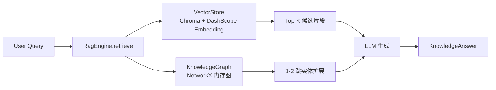
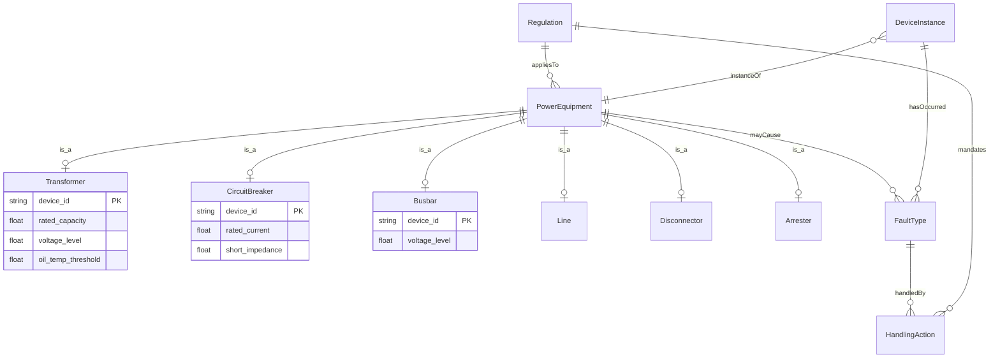
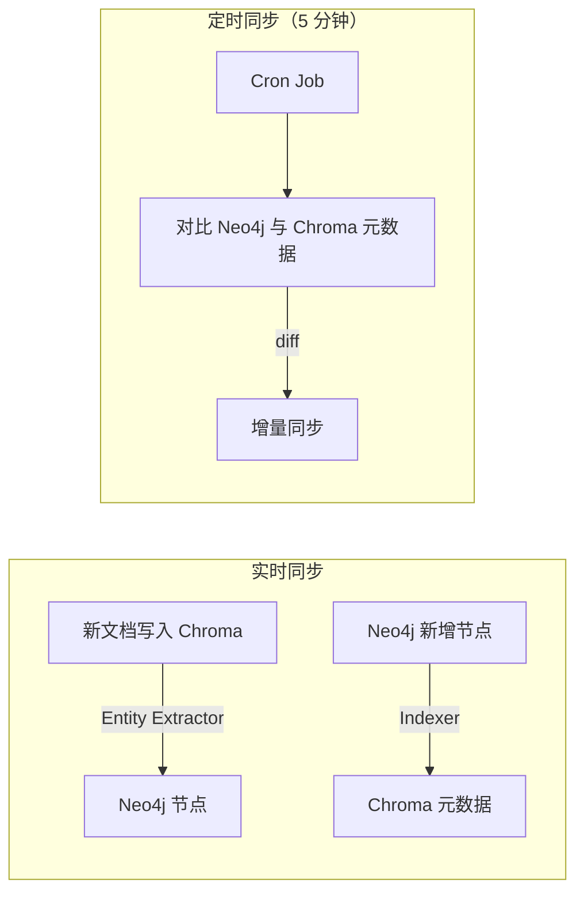
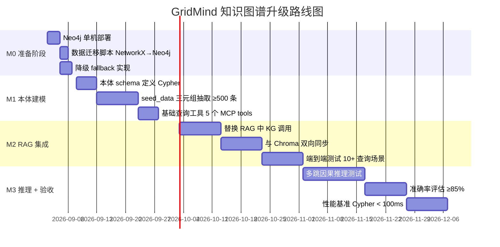

# GridMind 知识图谱升级 PRD —— Neo4j + 本体建模

| 项 | 内容 |
|---|---|
| **产品名称** | GridMind KRAG（Knowledge Graph RAG）升级 |
| **文档版本** | v1.0 · 2026 |
| **作者** | 产品经理 · 许清楚（Xu） |
| **对应竞品改造点** | P0-2：升级知识图谱到生产级本体 |
| **优先级** | P0（核心改造） |
| **工作量** | 3-4 人 · 90 天 |
| **状态** | 待评审（3 个关键架构选型问题） |

---

## TL;DR

将 GridMind 当前的 **NetworkX 内存图**（21 实体 / 25 关系 / 1-2 跳 / 仅 Demo）升级为 **Neo4j + 电网本体建模**的生产级知识图谱，支撑 3 跳以上复杂故障因果推理、SPARQL/Cypher 标准查询、与 Chroma 向量库双向同步。**90 天交付，4 个里程碑**（M0-M3），关键依赖 Neo4j 部署 + 标注数据准备；P0 阶段以"现有 seed_data + LLM 半自动标注"作为标注来源，避免自建标注团队。

**3 个待用户决策的问题**：
- **Q1** 图数据库：Neo4j 单机（推荐）vs Jena Fuseki vs 继续 NetworkX
- **Q2** 本体建模范围：最小（设备+关系）vs 中等（+属性+规则，推荐）vs 完整（+因果+时序）
- **Q3** 标注数据来源：复用 seed_data（推荐 P0）vs LLM 半自动 vs 自建团队

---

## 1. 产品目标

### 1.1 一句话目标

将 GridMind 知识图谱从"Demo 级内存图"升级为"生产级图数据库 + 电网本体"，实现多跳因果推理、标准查询语言、与向量库双向同步，对标国网"本体知识图谱"建设。

### 1.2 核心指标（OKR）

| 指标 | 当前基线 | P0 目标 | 测量方式 |
|---|---|---|---|
| **多跳推理准确率**（3 跳因果查询） | 不支持（仅 1-2 跳） | ≥ 85% | 构造 50 个 3 跳因果测试用例，正确返回路径占比 |
| **Cypher 查询响应时间** | 不支持 | P95 < 100ms | 在 1000 节点 / 5000 关系规模下，使用 JMeter 压测 |
| **标注数据规模**（种子三元组） | 25 条 | ≥ 500 条 | 自动化脚本导出 `graph_relations` 表统计 |
| **本体覆盖率** | 0%（无本体） | ≥ 90%（5 类设备 + 6 类关系 + 4 类属性） | 人工 review 本体 schema 文档 |
| **RAG 召回率** | 0.6（向量 + 1-2 跳图谱） | ≥ 0.8（向量 + 3 跳图谱） | 构造 100 个标准问答对，命中率 |
| **服务可用性** | 100%（内存图，但单机） | ≥ 99.5%（Neo4j 故障时降级到 NetworkX） | Prometheus 监控 + 故障演练 |

---

## 2. 用户故事

### US-1 调度员 · 复杂故障推理
> 作为 **电网调度员**，当 220kV 主变发生跳闸时，**我希望**系统能自动推理出"主变跳闸 → 母线失压 → 线路过载 → 断路器保护动作"3 跳因果链，**以便**我快速评估故障影响范围并启动应急处置。

### US-2 运维人员 · 设备族谱查询
> 作为 **变电站运维人员**，当需要检修 35kV 母线 BB-002 时，**我希望**用类似"列出与 BB-002 直接或间接关联的所有断路器"的标准 SPARQL/Cypher 查询，**以便**我在检修前确认需要挂牌的设备清单（防止误操作）。

### US-3 开发者 · 本体扩展
> 作为 **知识库开发者**，当业务需要新增"避雷器"设备类型时，**我希望**只需在本体 schema 中定义 `Arrester` 节点类型 + 属性 + 关系，**以便**自动生成 CRUD 接口和查询工具，无需修改底层图数据库。

### US-4 安全员 · 安规关联推理
> 作为 **安全监察员**，当调度员准备进行倒闸操作时，**我希望**系统自动推理出"操作设备 → 适用安规条款 → 关联安全距离 → 所需工作票"推理链，**以便**校验操作合规性，防止违章作业。

### US-5 诊断 Agent · 因果查询
> 作为 **诊断 Agent（AI）**，当接收到"#1 主变油温骤升"告警时，**我希望**通过 Cypher 推理"油温异常 → 处置措施 → 关联规程"，**以便**在 RAG 生成答案时补充多跳关联证据，提升答案可解释性。

### US-6 运维经理 · 故障知识沉淀
> 作为 **运维经理**，当 1 次真实故障处理完成后，**我希望**将故障现象、根因、处置过程自动抽取为三元组写入知识图谱，**以便**形成组织级故障知识库，反哺未来类似故障的诊断。

### US-7 系统管理员 · 降级保障
> 作为 **系统管理员**，当 Neo4j 服务不可用时，**我希望**系统自动降级到 NetworkX 内存图，**以便**知识图谱查询功能不中断（虽然失去多跳推理能力）。

---

## 3. 现状评估（CRITICAL）

### 3.1 当前架构概览



### 3.2 知识图谱现状（基于实际代码）

| 维度 | 现状数据 | 评估 |
|---|---|---|
| **图数据库** | NetworkX `nx.DiGraph`（内存） | ❌ 仅适合 Demo，重启即丢数据 |
| **持久化层** | SQLite `graph_entities` / `graph_relations` 表 | ✅ 有持久化，但运行时只用内存 |
| **节点数** | 21 个（来自 `seed_data.py`） | ❌ 规模极小 |
| **关系数** | 25 条 | ❌ 规模极小 |
| **跳数** | 1-2 跳（`expand_entities(hops=2)`） | ❌ 不足以支撑复杂故障推理 |
| **实体类型** | 5 类：设备类别 / 故障类型 / 处置措施 / 规程 / 设备实例 | ⚠️ 有雏形但未抽象为本体 |
| **关系类型** | 7 类：可能发生 / 处置 / 属于 / 适用于 / 关联 / 已发生 / 严重时处置 | ⚠️ 用"中文短语"作关系 label，未规范化 |
| **查询能力** | 仅 `get_entity` / `search_entities`（模糊） / `get_relations` / `expand_entities` | ❌ 不支持 Cypher / SPARQL |
| **性能** | 内存图遍历，无索引 | ⚠️ Demo 可用，千节点级会卡顿 |
| **可视化** | 无 | ❌ 前端不可见 |

### 3.3 已有查询工具（`mcp_tools/tools/knowledge_tools.py`）

| 工具名 | 功能 | 升级时需调整 |
|---|---|---|
| `query_knowledge_base` | 完整 RAG（向量 + 图谱 + LLM） | 替换图谱调用为 Neo4j |
| `search_knowledge_chunks` | 纯向量检索 | 保持不变 |
| `search_graph_entities` | 实体模糊搜索 | 改为 Cypher `MATCH (n) WHERE n.name CONTAINS ...` |
| `get_entity_relations` | 实体所有出边关系 | 改为 Cypher `MATCH (n)-[r]->(m) WHERE n.entity_id = ...` |

### 3.4 RAG 引擎协作现状（`core/rag_engine.py`）

**关键代码片段**（`rag_engine.py:60-67`）：
```python
# Step 2: 从向量结果中提取实体
all_text = " ".join(vector_chunks) + " " + query
seed_ids = self._extract_entity_ids(all_text)  # 5 个正则模式

# Step 3: 图谱扩展
graph_entities, graph_paths = self.knowledge_graph.expand_entities(
    seed_ids, hops=2,
)
```

**协作流程**：
1. 向量召回 top-3 候选片段（Chroma）
2. 用 5 个正则模式从候选片段 + 用户 query 中抽取实体名（如"变压器"、"DL/T-572"）
3. 在 NetworkX 图中沿出边+入边做 BFS 2 跳扩展
4. 融合"向量候选 + 图谱关联子图"作为 LLM 上下文

**改造点**：
- 实体抽取：从正则升级为**基于 Neo4j 节点索引的精确匹配 + 模糊查询**
- 图谱扩展：从 2 跳升级为**可配置 1-5 跳的 Cypher 模式查询**
- 关系遍历：从 NetworkX 改为**Cypher `MATCH (a)-[r*1..3]->(b)`**

### 3.5 与 Chroma 协作方式

| 流向 | 现状 | 升级时新增 |
|---|---|---|
| **Vector → Graph** | 仅通过正则从候选片段抽取实体名 | 抽取后**直接在 Neo4j 中 MATCH 对应节点**，避免重复抽取 |
| **Graph → Vector** | 无 | **图谱推理结果（如关联设备）回填到 Chroma 元数据**（`metadata.linked_devices`），下次检索时加权 |
| **同步策略** | 启动时一次性加载 | 新增 **5 分钟定时任务** + **写入时同步事件** |

### 3.6 配置现状（`api/config.py`）

```python
# 已预留 graph_db_path 占位字段（但未使用）
graph_db_path: str | None = os.getenv("GRAPH_DB_PATH")
```

升级时需新增：
- `NEO4J_URI`（如 `bolt://localhost:7687`）
- `NEO4J_USER`（默认 `neo4j`）
- `NEO4J_PASSWORD`
- `NEO4J_DATABASE`（默认 `neo4j`）
- `KG_FALLBACK_ENABLED`（默认 `true`，Neo4j 故障时降级到 NetworkX）

### 3.7 关键问题清单

| # | 问题 | 严重度 |
|---|---|---|
| 1 | 内存图重启即重建，无法支撑生产多实例部署 | 🔴 P0 |
| 2 | 1-2 跳无法支持 3 跳以上复杂故障推理 | 🔴 P0 |
| 3 | 无 Cypher/SPARQL 查询能力，仅支持简单 API | 🔴 P0 |
| 4 | 关系类型用中文短语，未规范化为本体属性 | 🟡 P1 |
| 5 | 无图谱可视化（前端不可见） | 🟢 P2 |
| 6 | 无 NER 抽取，非结构化文本（规程/报告）无法入图 | 🟡 P1 |

---

## 4. Neo4j 部署方案

### 4.1 部署模式（推荐 P0）

**单机 Docker 部署**（P0）→ 集群化（P1+）

```yaml
# docker-compose.yml (新增)
services:
  neo4j:
    image: neo4j:5.20-community
    container_name: gridmind-neo4j
    ports:
      - "7474:7474"   # HTTP Browser
      - "7687:7687"   # Bolt
    volumes:
      - ./data/neo4j:/data
    environment:
      NEO4J_AUTH: neo4j/gridmind_dev_pwd
      NEO4J_PLUGINS: '["apoc"]'  # APOC 工具库（数据迁移必需）
      NEO4J_dbms_security_procedures_unrestricted: 'apoc.*'
      NEO4J_dbms_memory_heap_max__size: 2G
      NEO4J_dbms_memory_pagecache_size: 1G
```

### 4.2 数据迁移（NetworkX → Neo4j）

**迁移脚本**：`scripts/migrate_kg_to_neo4j.py`

```python
# 核心逻辑（伪代码）
from neo4j import GraphDatabase
from core.knowledge_graph import KnowledgeGraph

def migrate():
    driver = GraphDatabase.driver(
        settings.neo4j_uri, 
        auth=(settings.neo4j_user, settings.neo4j_password),
    )
    nx_kg = KnowledgeGraph()
    
    with driver.session() as session:
        # 1. 创约束（entity_id 唯一）
        session.run("CREATE CONSTRAINT IF NOT EXISTS FOR (n:Entity) REQUIRE n.entity_id IS UNIQUE")
        
        # 2. 批量导入节点
        for entity in nx_kg.get_all_entities():
            session.run("""
                MERGE (n:Entity {entity_id: $id})
                SET n.name = $name, n.type = $type, n.properties = $props
            """, id=entity.id, name=entity.name, type=entity.type, props=entity.properties)
        
        # 3. 批量导入关系
        for src_id in nx_kg.graph.nodes():
            for _, tgt, data in nx_kg.graph.out_edges(src_id, data=True):
                session.run("""
                    MATCH (a:Entity {entity_id: $src}), (b:Entity {entity_id: $tgt})
                    MERGE (a)-[r:RELATION {type: $rtype}]->(b)
                """, src=src_id, tgt=tgt, rtype=data['label'])
```

### 4.3 降级方案（保证可用性）

```python
# core/knowledge_graph.py 改造
class KnowledgeGraph:
    def __init__(self):
        self._neo4j_driver = self._init_neo4j()
        self._nx_fallback = nx.DiGraph()  # 降级用内存图
    
    def get_entity(self, entity_id: str):
        try:
            return self._query_neo4j(entity_id)  # 优先 Neo4j
        except (ServiceUnavailable, AuthError) as e:
            logger.warning("Neo4j unavailable, fallback to NetworkX: {}", e)
            return self._query_nx(entity_id)  # 降级
```

**降级触发条件**：
- Neo4j 连接超时（>2s）
- Cypher 查询失败（语法错误、索引缺失）
- 健康检查失败（每 30s 探活）

---

## 5. 本体建模设计（CRITICAL）

### 5.1 本体 ER 图



### 5.2 设备类（Classes）

| 类名 | 属性 | 说明 |
|---|---|---|
| **PowerEquipment**（抽象） | `equipment_id`, `equipment_name` | 所有设备基类，P0 不直接建节点 |
| **Transformer** | `device_id`, `rated_capacity(MVA)`, `voltage_level(kV)`, `oil_temp_threshold(℃)`, `manufacturer`, `commissioning_date` | 变压器 |
| **CircuitBreaker** | `device_id`, `rated_current(A)`, `short_impedance(%)`, `voltage_level(kV)`, `manufacturer` | 断路器 |
| **Busbar** | `device_id`, `voltage_level(kV)`, `length(m)` | 母线 |
| **Line** | `device_id`, `length(km)`, `impedance(Ω)`, `voltage_level(kV)` | 线路 |
| **Disconnector** | `device_id`, `rated_current(A)`, `voltage_level(kV)` | 隔离开关 |
| **Arrester** | `device_id`, `rated_voltage(kV)`, `manufacturer` | 避雷器（P0 选做） |
| **FaultType** | `fault_id`, `severity`, `description` | 故障类型（过载、油温异常、SF6 泄漏等） |
| **HandlingAction** | `action_id`, `priority`, `estimated_duration(h)` | 处置措施（减载、停运、检修、更换） |
| **Regulation** | `rule_id`, `code`（如 `DL/T 572-2010`）, `category`, `content` | 规程条款 |
| **DeviceInstance** | `instance_id`, `device_id`（关联 SQLite `devices` 表） | 设备实例 |

### 5.3 关系类（Relations）

| 关系名 | 起点 → 终点 | 属性 | 用途 |
|---|---|---|---|
| **CONNECTED_TO** | PowerEquipment → PowerEquipment | `connection_type`（串联/并联）, `rated_voltage` | 电气连接 |
| **BELONGS_TO** | DeviceInstance → Substation | — | 设备归属 |
| **CAUSES** | FaultType → FaultType | `confidence`（0-1）, `severity` | 因果推理（核心） |
| **HANDLED_BY** | FaultType → HandlingAction | `priority`, `estimated_duration` | 故障处置 |
| **APPLIES_TO** | Regulation → PowerEquipment | `effective_date` | 规程适用 |
| **MANDATES** | Regulation → HandlingAction | `mandatory`（布尔） | 规程强制要求 |
| **INSTANCE_OF** | DeviceInstance → PowerEquipment | — | 实例归属类型 |
| **OCCURRED** | DeviceInstance → FaultType | `timestamp`, `severity` | 故障发生记录 |
| **MONITORED_BY** | DeviceInstance → Sensor | `sampling_rate` | 传感器监测（可选） |

### 5.4 Cypher 推理模式示例

#### 5.4.1 多跳因果推理
```cypher
// 查询 3 跳内所有可能的故障传导链
MATCH path = (f1:FaultType)-[:CAUSES*1..3]->(f2:FaultType)
WHERE f1.name = '过载'
RETURN path, length(path) AS hops
ORDER BY hops ASC
LIMIT 10
```

#### 5.4.2 设备族谱查询
```cypher
// 列出与 BB-002 关联的所有断路器（直接或间接）
MATCH (bb:DeviceInstance {device_id: 'BB-002'})
      -[:BELONGS_TO*0..3]-(substation)
      <-[:BELONGS_TO*]-(br:CircuitBreaker)
RETURN DISTINCT br.device_id, br.device_name
```

#### 5.4.3 安规关联推理
```cypher
// 查询设备 TR-001 涉及的所有安规条款及其强制动作
MATCH (tr:DeviceInstance {device_id: 'TR-001'})-[:INSTANCE_OF]->(eq:Transformer)
      <-[:APPLIES_TO]-(reg:Regulation)
      -[:MANDATES]->(act:HandlingAction)
RETURN reg.code, reg.content, act.name
```

#### 5.4.4 故障影响范围分析
```cypher
// 一号主变发生过载时，3 跳内所有可能受影响的设备
MATCH (tr:DeviceInstance {device_id: 'TR-001'})
      -[:OCCURRED]->(f:FaultType {name: '过载'})
      -[:CAUSES*1..3]->(downstream:FaultType)
      <-[:OCCURRED]-(affected:DeviceInstance)
RETURN DISTINCT affected.device_id, affected.device_name
```

---

## 6. NER + RE 自动抽取（可选 P0 / 重点 P1）

### 6.1 分阶段方案

| 阶段 | 数据源 | 方法 | 标注量 | 目标 |
|---|---|---|---|---|
| **P0** | `seed_data.py`（结构化） | 手工编写 Cypher 导入脚本 | ≥ 500 条三元组 | 完成核心本体覆盖 |
| **P1** | 规程文档 PDF / 报告 | BERT-BiLSTM-CRF NER（参考 MDPI 2026 论文 92% 准确率） | ≥ 5000 条 | 自动抽取设备/故障/规程实体 |
| **P2** | 故障工单 / 巡检记录 | LLM 半自动标注（GPT-4 / Qwen-Max） + 人工审核 | 持续增长 | 形成组织级故障知识库 |

### 6.2 P0 抽取脚本（仅结构化数据）

```python
# scripts/extract_triples_from_seed.py
def extract_from_devices():
    """从 devices 表抽取设备实例节点"""
    triples = []
    for dev in DEVICES:
        device_id, name, dtype, location, install_date, status, rated_current, short_imp, rated_voltage = dev
        # 设备实例 → 设备类型
        triples.append((f"e-{device_id}", "INSTANCE_OF", type_to_entity[dtype]))
        # 设备实例 → 变电站
        triples.append((f"e-{device_id}", "BELONGS_TO", substation_entity[location]))
    return triples

def extract_from_safety_rules():
    """从 safety_rules 表抽取规程节点 + 关联关系"""
    triples = []
    for code, category, content, severity in SAFETY_RULES:
        rule_entity = f"e-{code.replace('/', '').replace('-', '')}"
        triples.append((rule_entity, "type", "Regulation"))
        # 规程 → 设备类型（基于 category 启发式）
        for eq_type in extract_eq_types(content):
            triples.append((rule_entity, "APPLIES_TO", eq_entity[eq_type]))
    return triples
```

### 6.3 P1 NER 模型（预留接口）

```python
# core/ner_extractor.py (P1 实现)
class BertNerExtractor:
    def extract(self, text: str) -> list[tuple[str, str, str]]:
        """返回 (实体文本, 实体类型, 起始位置) 列表"""
        # 调用 BERT-BiLSTM-CRF 模型
        # 实体类型: EQUIPMENT / FAULT / REGULATION / LOCATION
        ...
```

---

## 7. 与 Chroma 双向同步

### 7.1 同步架构图



### 7.2 同步策略

| 流向 | 触发条件 | 同步方式 | 频率 |
|---|---|---|---|
| **Vector → Graph** | 新文档写入 Chroma | 实体抽取器提取设备/故障/规程名，在 Neo4j 中 `MERGE` 节点 + `MERGE` 关系 | 写入时同步（异步） |
| **Graph → Vector** | Neo4j 新增节点 | 将节点的"关联设备列表"作为元数据写回 Chroma chunk（`metadata.linked_devices`） | 5 分钟定时任务 |
| **冲突解决** | 同一实体在两侧描述不一致 | Neo4j 为权威源，Chroma 元数据被覆盖 | 定时任务 |

### 7.3 同步实现（核心代码骨架）

```python
# core/kg_vector_sync.py
class KGVectorSync:
    def __init__(self, neo4j_driver, vector_store):
        self.driver = neo4j_driver
        self.vector_store = vector_store
    
    def on_vector_write(self, doc_id: str, content: str):
        """文档写入 Chroma 时触发：抽取实体并写入 Neo4j"""
        entities = self._extract_entities(content)
        with self.driver.session() as session:
            for entity in entities:
                session.run("""
                    MERGE (n:Entity {entity_id: $id})
                    SET n.name = $name, n.type = $type
                """, id=entity['id'], name=entity['name'], type=entity['type'])
    
    def on_graph_update(self):
        """定时任务：图谱更新回填向量库元数据"""
        with self.driver.session() as session:
            result = session.run("""
                MATCH (d:DeviceInstance)-[:OCCURRED]->(f:FaultType)
                RETURN d.device_id AS dev_id, collect(f.name) AS faults
            """)
            for record in result:
                self.vector_store.update_metadata(
                    chunk_id=f"device-{record['dev_id']}",
                    metadata={"related_faults": record['faults']},
                )
```

---

## 8. 分阶段实施路线图（M0-M3）

### 8.1 总览甘特图



### 8.2 M0：准备阶段（5 天 · D+5）

| 任务 | 交付物 | 负责人 | 验收 |
|---|---|---|---|
| Neo4j Docker 单机部署 | `docker-compose.yml` + 健康检查通过 | 运维 | 浏览器访问 `http://localhost:7474` 可见 Neo4j Browser |
| 数据迁移脚本（NetworkX → Neo4j） | `scripts/migrate_kg_to_neo4j.py` | 后端 | 执行后 Neo4j 中 21 节点 / 25 关系全部迁移成功 |
| 降级 fallback 实现 | `core/knowledge_graph.py` 改造完成 | 后端 | 手动停止 Neo4j 容器，系统仍能查询（返回 NetworkX 数据） |
| 配置文件更新 | `api/config.py` 新增 5 个 Neo4j 配置项 | 后端 | 加载 `.env` 测试通过 |

### 8.3 M1：本体建模 + 种子数据（20 天 · D+25）

| 任务 | 交付物 | 验收 |
|---|---|---|
| 本体 schema 定义（Cypher） | `ontology/power_grid.cypher` | Neo4j Browser 中执行成功，约束/索引生效 |
| seed_data 三元组抽取 | `scripts/extract_triples.py` + 抽取报告 | ≥ 500 条三元组写入 Neo4j |
| 设备类 Cypher `CREATE` | `ontology/equipment_classes.cypher` | 5 个设备类节点创建成功 |
| 关系类 Cypher `CREATE` | `ontology/relation_classes.cypher` | 9 个关系类型注册成功 |
| 基础查询工具（5 个 MCP tools） | `mcp_tools/tools/kg_neo4j_tools.py` | 新增 `cypher_query` / `multi_hop_expand` / `find_devices_by_substation` / `get_fault_chain` / `get_applicable_regulations` |

**5 个 MCP 工具清单**：

```python
async def cypher_query(query: str, params: dict) -> list[dict]:
    """执行自定义 Cypher 查询（白名单限制）"""

async def multi_hop_expand(seed_ids: list[str], hops: int = 3) -> dict:
    """多跳扩展（替换原 expand_entities）"""

async def find_devices_by_substation(substation: str, device_type: str = None) -> list[dict]:
    """按变电站查询设备"""

async def get_fault_chain(start_fault: str, max_hops: int = 3) -> list[dict]:
    """查询故障因果链"""

async def get_applicable_regulations(device_id: str) -> list[dict]:
    """查询设备适用的安规条款"""
```

### 8.4 M2：RAG 集成 + 双向同步（30 天 · D+55）

| 任务 | 交付物 | 验收 |
|---|---|---|
| 替换 RAG 中的 KG 调用 | `core/rag_engine.py` 改造 | 4 个知识库工具全部走 Neo4j |
| 与 Chroma 双向同步 | `core/kg_vector_sync.py` + 定时任务 | 手动插入测试数据后，5 分钟内同步成功 |
| 端到端测试（≥10 个典型查询场景） | `tests/e2e/test_kg_rag.py` | 10 个测试全部通过 |
| 知识库 Agent 回归测试 | `tests/agent/test_knowledge_agent.py` | 4 个工具全部回退兼容 |

**10 个端到端测试场景**：

1. 查询"一号主变的过载处置方案"
2. 查询"BB-002 关联的所有断路器"
3. 查询"油温异常的因果链（3 跳）"
4. 查询"操作 220kV 设备的安全距离要求"
5. 查询"#1 主变涉及的安规条款"
6. 查询"接地故障的处置流程"
7. 查询"35kV 母线最近的故障记录"
8. 查询"减载操作的优先级"
9. 查询"DL/T 572 规程适用的所有设备类型"
10. 查询"完整的 3 跳故障传导链路"

### 8.5 M3：推理能力 + 验收（35 天 · D+90）

| 任务 | 交付物 | 验收 |
|---|---|---|
| 多跳因果推理测试 | `tests/reasoning/test_multi_hop.py` | 50 个测试用例，准确率 ≥ 85% |
| 准确率评估 | `reports/accuracy_m3.md` | 多跳推理 ≥ 85%，1-2 跳 ≥ 95% |
| 性能基准测试 | `reports/perf_benchmark.md` | Cypher 查询 P95 < 100ms（1000 节点） |
| 故障演练 | `reports/dr_test.md` | Neo4j 停止后 30s 内降级，恢复后 30s 内切回 |

---

## 9. 验收标准（Given/When/Then）

| # | 场景 | 验收条件 |
|---|---|---|
| **AC-1** | **基础 Cypher 查询** | **Given** Neo4j 中存在 TR-001 节点<br>**When** 调度员查询"一号主变的过载处置方案"<br>**Then** 系统返回包含 5 个关联节点（过载、减载、停运、DL/T 572、GB/T 1094.7）的子图 |
| **AC-2** | **多跳因果推理（3 跳）** | **Given** Neo4j 中存在"过载 → 油温异常 → 绝缘降低 → 热故障"链<br>**When** 查询"过载的完整因果链（3 跳）"<br>**Then** 系统返回包含 4 个节点的完整路径 |
| **AC-3** | **SPARQL 兼容接口** | **Given** 用户提交 SPARQL 查询<br>**When** 通过 SPARQL → Cypher 转换层执行<br>**Then** 系统返回与原生 Cypher 一致的结果（P0 仅预留接口，完整 SPARQL 兼容为 P1） |
| **AC-4** | **Neo4j 不可用降级** | **Given** Neo4j 容器已停止<br>**When** 任何 KG 查询执行<br>**Then** 30s 内自动降级到 NetworkX，日志写入告警 |
| **AC-5** | **双向同步一致性** | **Given** 在 Neo4j 中新增 1 个设备节点<br>**When** 等待 5 分钟<br>**Then** Chroma 中对应文档的元数据 `metadata.linked_devices` 自动更新 |
| **AC-6** | **标注数据规模** | **Given** 执行 `seed_all()` 后<br>**When** 统计 Neo4j 节点/关系数<br>**Then** ≥ 500 条三元组 |
| **AC-7** | **本体覆盖率** | **Given** 执行本体 schema Cypher 脚本<br>**When** 在 Neo4j Browser 中 `CALL db.labels()` 与 `CALL db.relationshipTypes()`<br>**Then** 设备类 ≥ 5 个，关系类 ≥ 9 个 |
| **AC-8** | **Cypher 查询性能** | **Given** 1000 节点 / 5000 关系规模<br>**When** JMeter 压测 100 次多跳查询<br>**Then** P95 响应时间 < 100ms |
| **AC-9** | **RAG 召回率提升** | **Given** 100 个标准问答对（含 3 跳关联）<br>**When** 调用 `query_knowledge_base()` 检索<br>**Then** 召回率 ≥ 80%（vs 当前 60%） |
| **AC-10** | **降级恢复** | **Given** 系统已降级到 NetworkX<br>**When** Neo4j 重新启动<br>**Then** 30s 内自动切回 Neo4j，无需重启应用 |

---

## 10. 待确认问题（3 个核心 Q）

### Q1：图数据库选型 ❓

| 候选 | 优势 | 劣势 | 适用阶段 |
|---|---|---|---|
| **Neo4j（推荐）** | Python 驱动成熟（`neo4j` 库），Cypher 学习曲线低，APOC 工具库丰富，社区文档多 | 部署较重（Causal Cluster 需 3 节点），商业版收费 | P0 推荐单机 Docker，P1 集群化 |
| **Apache Jena Fuseki** | W3C 标准，本体建模强（OWL/RDFS），SPARQL 原生 | 生态较小，Python 驱动不如 Neo4j 成熟 | 适合纯学术/标准严格场景 |
| **继续 NetworkX + 内存 SPARQL 模拟** | 零部署成本，代码改动最小 | 仍非生产级，无持久化，无并发支持 | 仅适合 Demo |

**建议**：**P0 用 Neo4j 单机**（Docker 部署，5 分钟起步），P1+ 考虑 Causal Cluster 集群化或迁移到 Jena Fuseki（如果国网审计要求 W3C 标准）。

### Q2：本体建模范围 ❓

| 层次 | 内容 | 覆盖范围 | 适合阶段 |
|---|---|---|---|
| **最小** | 仅"设备类 + 关系类" | 满足基础 Cypher 查询 | Demo 阶段 |
| **中等（推荐 P0）** | 设备类 + 关系类 + 属性 + 简单推理规则（Cypher 模式） | 支持多跳推理、属性过滤 | 生产 P0 阶段 |
| **完整** | 中等 + 因果推理规则 + 时序本体（事件 + 时间） | 支持时序推理、复杂事件分析 | P1+ 阶段 |

**建议**：**P0 选"中等"层次**。完整本体建模需要 1-2 名领域专家 3 个月时间，P0 投入产出比不高。

### Q3：标注数据来源 ❓

| 方案 | 成本 | 质量 | 周期 | 适合阶段 |
|---|---|---|---|---|
| **复用 seed_data（推荐 P0）** | 0 | 高（结构化） | 1 周 | P0 起步 |
| **LLM 半自动标注 + 人工审核** | 中（GPT-4 API + 1 人审核） | 中 | 1-2 月 | P1 |
| **自建标注团队** | 高（5-10 人） | 最高 | 3 月+ | 仅适合长期项目 |

**建议**：**P0 阶段复用 seed_data + LLM 半自动补充**。具体做法：
- P0 第 1 周：从 `seed_data.py` 8 设备 + 10 安规 + 8 知识库文档中，编写 Cypher 脚本批量生成 ≥ 500 条三元组
- P0 第 2-3 周：用 Qwen-Max 对 8 篇知识库文档做 LLM 半自动三元组抽取，人工审核
- P1+：考虑自建标注团队或采购国网已有本体数据

### 其他次要问题（可后续决策）

| 问题 | 默认决策 | 可推翻？ |
|---|---|---|
| 性能 vs 准确率取舍 | 准确率优先（≥ 85%），性能仅 P95 < 100ms | 是 |
| NLP 模型选型 | P1 用 BERT-BiLSTM-CRF（中文 NER 92% 准确率） | 是 |
| 本体可视化工具 | P0 用 Neo4j Browser（免费），P1 评估 Neo4j Bloom / yFiles | 是 |
| 图谱版本管理 | P0 暂不实现，依赖 Neo4j 自身备份 | 是 |
| 多租户隔离 | P0 单租户，P1 评估 Neo4j 多数据库 | 是 |

---

## 11. 非目标（防止范围蔓延）

| # | 非目标 | 原因 |
|---|---|---|
| **NG-1** | **不做图可视化前端** | 前端 D3.js / Neo4j Bloom 集成留给 P1+，P0 阶段仅提供 Neo4j Browser 供开发调试 |
| **NG-2** | **不做 NLP 文本标注** | P0 阶段仅用结构化 seed_data，不引入 BERT/BiLSTM/CRF 模型；P1 再评估 |
| **NG-3** | **不做知识图谱推理引擎扩展** | 仅用 Cypher 内置的图遍历能力，不引入 Apache Jena Reasoner、Pellet 等 OWL 推理机 |
| **NG-4** | **不做本体版本管理与回滚** | P0 直接覆盖式更新，P1 评估用 Neo4j 备份机制 |
| **NG-5** | **不做实时图谱变更通知**（如 Webhook） | P0 仅提供查询 API，实时通知留给 P1（可考虑 Neo4j Change Data Capture） |
| **NG-6** | **不做多模态本体**（如图像/视频） | P0 仅文本本体，图片识别留给 P2 |
| **NG-7** | **不做知识图谱质量评估自动化** | P0 人工 review，P1+ 考虑用 SHACL / ShEx 写形状约束 |

---

## 12. 上线计划

| 阶段 | 日期（自启动起） | 上线内容 | 上线方式 | 风险等级 |
|---|---|---|---|---|
| **M0 上线** | D+5 | Neo4j 单机部署 + 数据迁移 + 降级 fallback | 内网灰度（仅开发团队） | 🟡 中（需运维配合） |
| **M1 上线** | D+25 | 本体建模 + ≥500 条三元组 + 5 个新 MCP 工具 | 内网灰度（部分调度员） | 🟢 低（仅查询功能） |
| **M2 上线** | D+55 | RAG 集成 + 双向同步 | 内网全量 + 外网灰度 | 🟡 中（涉及 RAG 主链路） |
| **M3 全量** | D+90 | 多跳推理 + 性能基准 + 故障演练 | 外网全量 + 国网试点 | 🔴 高（核心生产改造） |

**回滚方案**：
- M0 阶段：直接停用 Neo4j，降级到 NetworkX（已实现）
- M1-M2 阶段：通过 `KG_BACKEND=networkx` 环境变量切换后端
- M3 阶段：保留旧 NetworkX 镜像至少 30 天，可一键切回

---

## 附录 A：实体/关系数据规模估算

| 类别 | 当前 | P0 目标 | P1 目标 | 来源 |
|---|---|---|---|---|
| 设备实例 | 3 | 8（对齐 SQLite） | 100+ | `devices` 表 |
| 设备类别 | 4 | 5-7 | 10+ | seed_data + 业务扩展 |
| 故障类型 | 5 | 10-15 | 50+ | seed_data + LLM 抽取 |
| 处置措施 | 5 | 8-10 | 30+ | seed_data + 安规 |
| 规程 | 4 | 10（对齐 safety_rules） | 100+ | `safety_rules` 表 |
| **总节点** | **21** | **≥ 50** | **≥ 300** | — |
| **总关系** | **25** | **≥ 500** | **≥ 2000** | seed_data + LLM |

## 附录 B：MCP 工具兼容性矩阵

| 工具 | 当前后端 | Neo4j 后端 | 兼容性 |
|---|---|---|---|
| `query_knowledge_base` | NetworkX | Neo4j | ✅ 接口不变 |
| `search_knowledge_chunks` | Chroma | Chroma | ✅ 完全不变 |
| `search_graph_entities` | NetworkX 模糊搜索 | Neo4j `MATCH ... CONTAINS` | ✅ 行为兼容 |
| `get_entity_relations` | NetworkX 出边 | Neo4j `MATCH (n)-[r]->(m)` | ✅ 行为兼容 |
| **新增** `cypher_query` | — | Neo4j 直查 | 🆕 |
| **新增** `multi_hop_expand` | — | Cypher `MATCH ... *1..N` | 🆕 |
| **新增** `find_devices_by_substation` | — | Neo4j | 🆕 |
| **新增** `get_fault_chain` | — | Neo4j | 🆕 |
| **新增** `get_applicable_regulations` | — | Neo4j | 🆕 |

## 附录 C：参考资料

- **竞品分析报告**：`F:/GridOpsAgent/deliverables/competitive-analysis.md` 第 396-405 行
- **当前实现**：
  - `core/knowledge_graph.py`（NetworkX 内存图，21 节点 / 25 关系）
  - `core/rag_engine.py`（混合 RAG：Chroma + NetworkX + LLM）
  - `core/vector_store.py`（Chroma + DashScope Embedding）
  - `mcp_tools/db/seed_data.py`（8 设备 / 10 安规 / 8 知识库 / 21 图谱实体 / 25 关系）
  - `mcp_tools/tools/knowledge_tools.py`（4 个 KG 工具）
  - `api/agents/agent_factory.py`（`knowledge_agent` 节点）
  - `api/config.py`（预留 `graph_db_path` 字段）
- **参考论文**：MDPI 2026 · BERT-BiLSTM-CRF NER 模型（92% 中文实体识别准确率）
- **Neo4j 官方文档**：https://neo4j.com/docs/

---

**文档结束** · 评审请关注：Q1 / Q2 / Q3 三个关键决策点 · 建议评审时长 30 分钟
