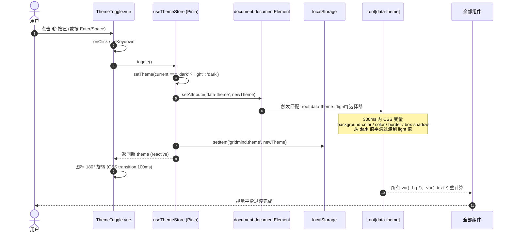
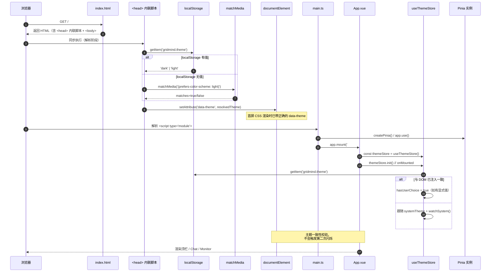
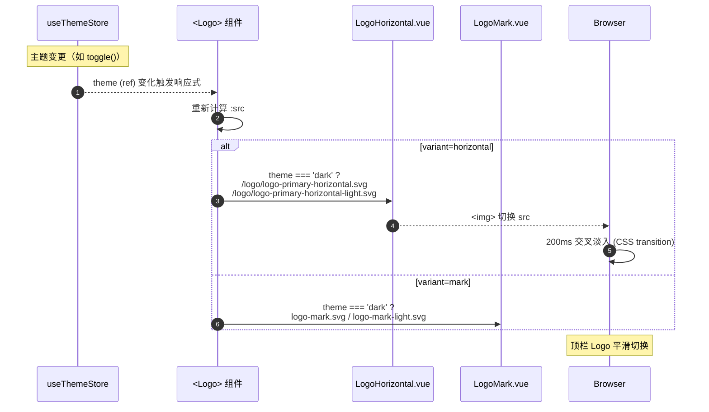
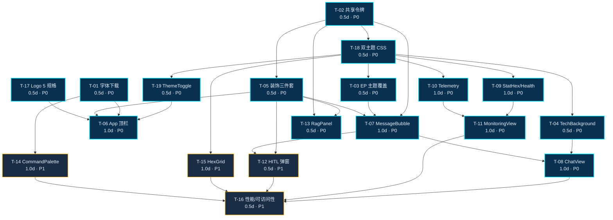

# GridMind 灵枢电网 · UI 重构架构设计与任务分解

> **项目代号**：GridMind（灵枢电网） · **版本**：v1.0.0-arch  
> **技术栈**：Vue 3.4 + TypeScript 5.5 + Vite 5.4 + Element Plus 2.7 + Pinia 2.1  
> **范围**：PRD v2 §11/§18 中 19 个 M1/M2 任务的实现设计与工程师可执行分解  
> **作者**：架构组 · 高见远（Gao）

---

## 0. TL;DR

- **目标**：把"通用深蓝后台"改造为"赛博控制中心 HUD + 全息电网驾驶舱"；**中文为主**（灵枢电网 / GridMind），全量支持 P0 双主题。
- **核心策略**：以 **CSS 变量 + Pinia 主题 Store** 为主轴，所有颜色/圆角/阴影/动效统一进 `tokens.scss`，组件内**禁用任何颜色字面量**；新增 `@vueuse/core` + `gsap` + `sass` 三个包，其余沿用现有。
- **Logo**：「灵枢电枢」六边形+中心电枢指针，5 种规格（主横/主竖/简版/单色×2 + favicon×3）。
- **任务**：19 项 19.5 人日（M1 = 13 任务 10.5 人日 / M2 = 4 任务 4.0 人日 / M3 = 5 任务 5.0 人日 · 推迟）。
- **关键路径**：`T-17 + T-02 + T-18 → T-19 → T-06 → T-16`，瓶颈在顶栏收口 + 性能验证。
- **最大风险**：双主题下 Element Plus 覆盖（按钮/菜单/抽屉/Tag）色板漂移；亮主题下 `ScanlineOverlay` 与 `TechBackground` 不能过亮。

---

## 1. 实现方案与框架选型

### 1.1 核心难点

| 难点 | 描述 | 应对 |
|---|---|---|
| **CSS 变量可主题化** | 现有 `style.css` 中变量是 `:root` 单主题硬编码 | 重构为 `tokens.shared.scss` + `tokens.dark.scss` + `tokens.light.scss`，入口按 `data-theme` 分发 |
| **反 FOUC** | 主题在 Vue mount 之后切换会闪烁 | `index.html` `<head>` 同步内联脚本，HTML 解析前完成 `data-theme` 注入 |
| **Element Plus 双主题** | EP 自带 `--el-color-*` 变量体系与暗色覆盖需要按 `data-theme` 双套 | `element-overrides.scss` 用 `[data-theme="dark"] .el-xxx` / `[data-theme="light"] .el-xxx` 双写 |
| **Logo 双主题切换** | 顶栏 Logo 在亮/暗底颜色不同 | Logo 组件 props 接 `theme`，`useThemeStore.theme` 响应式驱动 `:src` |
| **亮主题下装饰过亮** | `ScanlineOverlay`/`TechBackground`/`HexGrid` 暗底好看，亮底刺眼 | 三组件内置 `isLight` prop，亮主题降级（关闭扫描线、降低透明度、减少色彩） |
| **字体体积** | 阿里巴巴普惠体 + Orbitron + JetBrains Mono + Inter 全量 > 2 MB | 仅保留 `Orbitron 500/700` + `JetBrains Mono 400/600` + `Inter 400/600` + 阿里巴巴普惠体子集（~30 字"灵枢电网 控制中心"）|
| **类型安全** | Theme/Logo/StatHexagon 等新组件需要 TS 接口 | 全部放 `web/src/types/index.ts` 集中导出 |

### 1.2 框架与库选型

| 项 | 选择 | 版本 | 引入方式 | 包大小 (gzip) | 理由 |
|---|---|---|---|---|---|
| 视图 | Vue 3 | 3.4.x | 已有 | — | Composition API + `<script setup>` |
| 状态 | Pinia | 2.1.x | 已有 | ~6 KB | 新增 `useThemeStore` |
| 组件库 | Element Plus | 2.7.x | 已有 | 全量 ~280 KB · 按需 ~80 KB | 全部 UI 基底 |
| 工具集 | **@vueuse/core** | ^10.11 | **新增** | ~30 KB | `useMediaQuery`（监听系统主题）、`useLocalStorage`（持久化）、`usePreferredDark`（首屏兜底） |
| 动效 | **gsap** | ^3.12.5 | **新增** | 核心 ~25 KB | Logo 进场、命令面板、StatHexagon 计数动画、按需 import 不走 `gsap.all` |
| 预处理器 | **sass** | ^1.77 | **新增** (dev) | — | tokens 用 SCSS 嵌套 + mixin 复用 |
| 图标 | @element-plus/icons-vue | 2.3.x | 已有 | 按需 | 主题切换用自定义 SVG（太阳/月亮） |
| 字体 | Orbitron + JetBrains Mono + Inter + 阿里巴巴普惠体 | 自托管 | **新增** | 总 ~400 KB | `web/public/fonts/`，`<link rel="preload">` |
| 图表 | （暂不引入） | — | — | — | PRD v2 决策 ECharts 推迟至 M3 |
| 3D | （暂不引入） | — | — | — | three.js 推迟至 M3 |
| 实用工具 | lodash-es | 不引入 | — | — | 现有 `chatStore` 已手写辅助函数，无需新依赖 |

**不引入的项（明确禁止）**：
- ❌ `tailwindcss`（与 Element Plus 设计语言冲突，体积大）
- ❌ `monaco-editor`（M1 无代码编辑器诉求）
- ❌ `echarts`（M3 再说）
- ❌ `three.js`（M3 再说）
- ❌ `naive-ui` / `ant-design-vue`（与 EP 重复）

### 1.3 架构模式

- **MVVM** 经典 Vue 3 模式（`template` = View / `script setup` = ViewModel / `stores` + `api` = Model）。
- **设计令牌（Design Tokens）** 单向数据流：`tokens.scss` → `:root[data-theme]` → `var(--xxx)` → 组件 `style` → 用户视觉。
- **Pinia 主题 Store** 作为令牌系统的"可编程控制器"，负责：① 持久化；② 系统主题监听；③ 切换过渡编排。
- **原子化组件 + 容器化页面**：基础视觉原子（`PulseDot` / `DataStreamBadge` / `HexGrid` / `ScanlineOverlay`）零业务；业务组件（`StatHexagon` / `ThemeToggle`）组合原子；页面（`ChatView` / `MonitoringView`）组合业务组件。
- **BEM 风格**类名（`.app-header__logo`），所有自定义类前缀 `gm-`（`gm-card` / `gm-hex` / `gm-scanline`）避免与 EP 冲突。

---

## 2. 文件清单

### 2.1 新增文件（按目录结构）

```
web/
├── public/
│   ├── fonts/                                    ← 新增
│   │   ├── orbitron-500.woff2
│   │   ├── orbitron-700.woff2
│   │   ├── jetbrains-mono-400.woff2
│   │   ├── jetbrains-mono-600.woff2
│   │   ├── inter-400.woff2
│   │   ├── inter-600.woff2
│   │   ├── alibaba-heavy-subset.woff2            ← 灵枢电网 控制中心 等约 30 字
│   │   └── alibaba-regular-subset.woff2
│   ├── logo/                                     ← 新增（5 规格 SVG + 3 尺寸 favicon）
│   │   ├── logo-primary-horizontal.svg           ← 顶栏/登录页 · 暗底主用
│   │   ├── logo-primary-horizontal-light.svg     ← 亮底主用
│   │   ├── logo-primary-vertical.svg             ← 海报/PPT 封面
│   │   ├── logo-mark.svg                         ← 简版 · 暗底
│   │   ├── logo-mark-light.svg                   ← 简版 · 亮底
│   │   ├── logo-mono-light.svg                   ← 单色亮版（用于暗底）
│   │   ├── logo-mono-dark.svg                    ← 单色暗版（用于亮底）
│   │   ├── favicon-32.png
│   │   ├── favicon-192.png
│   │   ├── favicon-512.png
│   │   ├── favicon.ico
│   │   ├── apple-touch-icon.png
│   │   └── README.md                             ← 颜色/字体/导出规范
│   └── (移除 vite.svg 默认)
└── src/
    ├── styles/                                   ← 新增目录
    │   ├── tokens.shared.scss                    ← 共享令牌（圆角/间距/动效/字体）
    │   ├── tokens.dark.scss                      ← 暗色令牌（颜色/边框/阴影/发光）
    │   ├── tokens.light.scss                     ← 亮色令牌
    │   ├── tokens.scss                           ← 入口 + data-theme 分发
    │   ├── element-overrides.scss                ← EP 主题覆盖（按主题双写）
    │   ├── animations.scss                       ← 关键帧（pulse / scan / glow / hexSpin）
    │   ├── reset.scss                            ← 现代 CSS reset（* / html / body / 滚动条）
    │   └── utilities.scss                        ← 工具类（.gm-flex / .gm-text-mono 等）
    ├── components/
    │   ├── brand/                                ← 新增
    │   │   ├── Logo.vue                          ← 主组件（按 variant + theme 渲染）
    │   │   ├── LogoMark.vue                      ← 简版图形（六边形+指针+4 节点）
    │   │   └── LogoHorizontal.vue                ← 横版（图形+中文+英文+副标）
    │   ├── background/                           ← 新增
    │   │   ├── TechBackground.vue                ← 网格 + 渐变光晕（双主题）
    │   │   ├── ScanlineOverlay.vue               ← 扫描线（亮主题降级）
    │   │   ├── DataStreamBadge.vue               ← 数字流徽章（如 CPU 23%）
    │   │   ├── PulseDot.vue                      ← 脉冲点（连接/告警指示）
    │   │   └── HexGrid.vue                       ← 六边形拓扑背景（双主题）
    │   ├── controls/                             ← 新增
    │   │   ├── StatHexagon.vue                   ← 六边形统计卡
    │   │   ├── ThemeToggle.vue                   ← 🌓 主题切换
    │   │   └── CommandPalette.vue                ← ⌘K 全局命令面板
    │   └── chat/                                 ← 新增（可选拆分）
    │       ├── AgentBadge.vue                    ← 智能体徽章（monitor/diagnosis/...）
    │       └── ThinkingIndicator.vue             ← 思考中动画（替代原 thinking-dots）
    ├── stores/
    │   └── theme.ts                              ← 新增 · useThemeStore
    ├── composables/                              ← 新增目录
    │   ├── useTheme.ts                           ← 封装 useThemeStore + 业务便捷方法
    │   └── useReducedMotion.ts                   ← 响应 prefers-reduced-motion
    └── types/
        └── theme.ts                              ← 新增（拆分自 index.ts）
```

### 2.2 修改文件

| 路径 | 变更类型 | 变更摘要 |
|---|---|---|
| `web/index.html` | 修改 | ① 标题改为「灵枢电网 / GridMind · 控制中心」；② favicon 改 `/logo/favicon-32.png` + apple-touch-icon；③ `<head>` 注入反 FOUC 同步脚本（17.9）；④ `<link rel="preload">` 字体；⑤ lang="zh-CN" |
| `web/src/main.ts` | 修改 | ① 改为 `import './styles/tokens.scss'`（替代 `style.css`）；② 移除 `import 'element-plus/dist/index.css'` 改为按需；③ 注入主题 store；④ locale 仍为 `zhCn` |
| `web/src/App.vue` | 重构 | ① 顶栏改用 `<Logo variant="horizontal" />`；② 嵌入 `<ThemeToggle />`；③ 状态条改用 `<DataStreamBadge />`；④ 顶栏增加 `class="app-header gm-header"`；⑤ 移除硬编码色 |
| `web/src/style.css` | 删除/废弃 | 内容整体迁移至 `src/styles/*.scss`；保留为兼容 shim 文件 1 个迭代后删除 |
| `web/src/components/ChatView.vue` | 修改 | 背景改为 `<TechBackground />` + `<ScanlineOverlay />`；消息列表区应用玻璃拟态 |
| `web/src/components/MonitoringView.vue` | 重构 | 改用 `<StatHexagon />` + 升级 `<TelemetryChart />`；栅格化卡片 |
| `web/src/components/MessageBubble.vue` | 修改 | 4 种角色切角 + 左侧发光（按角色色 `var(--role-xxx)`）；思考中改用 `<ThinkingIndicator />` |
| `web/src/components/HealthCard.vue` | 修改 | 切角 + 进度条 + 玻璃底；颜色全用 `var(--xxx)` |
| `web/src/components/TelemetryChart.vue` | 重构 | SVG 折线图升级：网格底纹、渐变填充、指标色用 `var(--metric-xxx)`；双主题适配 |
| `web/src/components/RagPanel.vue` | 修改 | 切角 + 流光（`background-position` 动画）；引用 `<PulseDot />` 表示引用源 |
| `web/src/components/DemoShortcuts.vue` | 修改 | 切角胶囊 + hover 发光 |
| `web/src/components/HitlDialog.vue` | 修改 | 弹窗主题色统一，关闭按钮 + 按钮组应用 EP 双主题覆盖 |
| `web/src/stores/chatStore.ts` | 不改 | 仅在 store 内引用 `useThemeStore` 做"清空时清主题？"业务——**不推荐**，保持不变 |
| `web/src/stores/monitorStore.ts` | 不改 | 业务逻辑不变，仅 UI 消费方升级 |
| `web/src/api/chat.ts`、`monitor.ts` | 不改 | 纯数据层 |
| `web/src/router/index.ts` | 不改 | 路由不变 |
| `web/src/types/index.ts` | 修改 | 导出 `theme.ts` 的所有类型；新增 `LogoVariant` / `ThemeToggleSize` 等 |
| `web/vite.config.ts` | 修改 | ① 增加 `css.preprocessorOptions.scss.additionalData` 注入 `@use "@/styles/tokens.shared" as *`；② 启用 `resolve.alias` `@` → `src`；③ 增加 `build.assetsInlineLimit` 处理小 svg |
| `web/package.json` | 修改 | 依赖见 §6 |
| `web/tsconfig.json` | 修改 | 增加 `paths` 映射 `@/*` → `src/*` |
| `web/.env.example` | 可选 | 增加 `VITE_THEME_DEFAULT=dark` 等 |

### 2.3 文件总览统计

| 类别 | 新增 | 修改 | 合计 |
|---|---|---|---|
| 配置 / 构建 | 0 | 4（vite.config / tsconfig / package.json / index.html） | 4 |
| 样式 | 8 | 1（style.css 废弃） | 9 |
| 状态 / 工具 | 2（stores/theme + composables） | 0 | 2 |
| 组件 | 13（brand 3 + background 5 + controls 3 + chat 2） | 8（App + 7 业务组件） | 21 |
| 类型 | 1 | 1（types/index.ts 导出） | 2 |
| 静态资源 | 17（8 字体 + 9 logo/favicon） | 0 | 17 |
| **合计** | **41** | **14** | **55** |

---

## 3. 数据结构 / 接口（TypeScript）

### 3.1 主题相关类型（`web/src/types/theme.ts`）

```ts
// ─── 主题 ────────────────────────────────────────────
export type Theme = 'dark' | 'light'
export const THEME_STORAGE_KEY = 'gridmind.theme' as const

// ─── Logo ────────────────────────────────────────────
export type LogoVariant = 'horizontal' | 'vertical' | 'mark' | 'mono'
export type LogoTheme = 'auto' | 'dark' | 'light'   // auto = 跟随 useThemeStore

export interface LogoProps {
  variant?: LogoVariant          // 默认 'horizontal'
  theme?: LogoTheme              // 默认 'auto'
  size?: number | string         // 高度 px，默认 32
  showWordmark?: boolean         // horizontal 是否显示中英文字，默认 true
  alt?: string                   // 默认 '灵枢电网 / GridMind'
}

// ─── ThemeToggle ─────────────────────────────────────
export type ThemeToggleSize = 'sm' | 'md' | 'lg'
export type ThemeTogglePosition = 'inline' | 'fixed'

export interface ThemeToggleProps {
  size?: ThemeToggleSize         // 默认 'md' → 32px
  showLabel?: boolean            // 默认 false
  position?: ThemeTogglePosition // 默认 'inline'
}

export interface ThemeToggleEmits {
  (e: 'change', theme: Theme): void
}

// ─── 背景组件 ───────────────────────────────────────
export type BackgroundIntensity = 'low' | 'mid' | 'high'

export interface TechBackgroundProps {
  intensity?: BackgroundIntensity   // 默认 'mid'
  showGrid?: boolean                // 默认 true
  showGlow?: boolean                // 默认 true
}

export interface ScanlineOverlayProps {
  opacity?: number                  // 0-1，暗主题默认 0.6
  speed?: number                    // 周期秒数，默认 8s
  forceOff?: boolean                // 亮主题强制关闭，默认 false
}

export interface DataStreamBadgeProps {
  label: string                     // 'CPU' / 'MEM' / 'AGT' / 时钟
  value: string | number
  unit?: string                     // '%' / 'ms' / ''
  tone?: 'info' | 'success' | 'warning' | 'danger' | 'accent'
  pulse?: boolean                   // 是否脉冲
}

export interface PulseDotProps {
  tone?: 'success' | 'danger' | 'warning' | 'info' | 'accent'
  size?: number                     // px，默认 8
  speed?: number                    // 周期秒数，默认 2s
}

export interface HexGridProps {
  cols?: number                     // 默认 12
  rows?: number                     // 默认 8
  interactive?: boolean             // hover 节点高亮
}

// ─── StatHexagon ────────────────────────────────────
export interface StatHexagonProps {
  label: string
  value: string | number
  unit?: string
  delta?: number                    // 变化百分比，+12.5 / -3.2
  tone?: 'info' | 'success' | 'warning' | 'danger' | 'accent'
  icon?: string                     // element-plus icon name
  loading?: boolean
}

// ─── CommandPalette ─────────────────────────────────
export type CommandScope = 'global' | 'chat' | 'monitor' | 'rag'

export interface CommandItem {
  id: string
  scope: CommandScope
  title: string                     // '清空对话'
  subtitle?: string                 // 快捷键 / 描述
  shortcut?: string[]               // ['mod', 'k']
  icon?: string
  keywords?: string[]               // 搜索匹配
  action: () => void | Promise<void>
  disabled?: boolean
}

export interface CommandPaletteProps {
  open: boolean
  scope?: CommandScope              // 默认 'global'
}

// ─── Chat ───────────────────────────────────────────
export type AgentRole = 'user' | 'assistant' | 'system' | 'tool'

export interface AgentBadgeProps {
  agent: 'monitor' | 'diagnosis' | 'rag' | 'planner' | 'orchestrator' | 'user' | 'system'
  size?: 'sm' | 'md'
  showLabel?: boolean
}

export interface ThinkingIndicatorProps {
  label?: string                    // 默认 '思考中'
  speed?: number                    // 周期秒数，默认 1.2s
}
```

### 3.2 Pinia Store 接口（`web/src/stores/theme.ts`）

```ts
import { defineStore } from 'pinia'
import type { Ref } from 'vue'
import type { Theme } from '@/types/theme'
import { THEME_STORAGE_KEY } from '@/types/theme'

export interface ThemeStoreState {
  theme: Ref<Theme>
  systemTheme: Ref<Theme>             // 来自 prefers-color-scheme
  effectiveTheme: ComputedRef<Theme>  // 当前实际生效（暂未实现"跟随系统"，恒等于 theme）
  isDark: ComputedRef<boolean>
  isLight: ComputedRef<boolean>
}

export interface ThemeStoreActions {
  init(): void                        // mount 时调用：读 localStorage / 监听 system
  setTheme(theme: Theme): void
  toggle(): void
  followSystem(): void                // 清掉 localStorage，跟随系统
  watchSystem(): void                 // 启用 matchMedia 监听（仅在未显式设置时）
}

export const useThemeStore = defineStore('theme', () => {
  // ── State ──
  const theme = ref<Theme>('dark')
  const systemTheme = ref<Theme>(
    window.matchMedia('(prefers-color-scheme: light)').matches ? 'light' : 'dark'
  )
  const hasUserChoice = ref(false)    // 显式设置后置 true，停止跟随系统

  // ── Getters ──
  const isDark  = computed(() => theme.value === 'dark')
  const isLight = computed(() => theme.value === 'light')

  // ── Actions ──
  function apply(t: Theme) {
    theme.value = t
    document.documentElement.setAttribute('data-theme', t)
  }
  function persist(t: Theme) {
    try { localStorage.setItem(THEME_STORAGE_KEY, t) } catch { /* private mode */ }
  }
  function init() {
    try {
      const saved = localStorage.getItem(THEME_STORAGE_KEY)
      if (saved === 'light' || saved === 'dark') {
        hasUserChoice.value = true
        apply(saved)
        return
      }
    } catch { /* ignore */ }
    apply(systemTheme.value)
    watchSystem()
  }
  function setTheme(t: Theme) {
    hasUserChoice.value = true
    apply(t)
    persist(t)
  }
  function toggle() {
    setTheme(theme.value === 'dark' ? 'light' : 'dark')
  }
  function followSystem() {
    hasUserChoice.value = false
    try { localStorage.removeItem(THEME_STORAGE_KEY) } catch { /* ignore */ }
    apply(systemTheme.value)
    watchSystem()
  }
  function watchSystem() {
    const mq = window.matchMedia('(prefers-color-scheme: dark)')
    mq.addEventListener('change', (e) => {
      if (hasUserChoice.value) return
      systemTheme.value = e.matches ? 'dark' : 'light'
      apply(systemTheme.value)
    })
  }
  return { theme, systemTheme, isDark, isLight, init, setTheme, toggle, followSystem, watchSystem }
})
```

### 3.3 CSS 变量全量定义（令牌层）

> **约定**：所有变量都在 `tokens.{shared,dark,light}.scss` 声明；组件 `style` 内**只能**用 `var(--xxx)`，不允许颜色字面量、不允许 `[data-theme="..."]` 选择器（除 `element-overrides.scss` 内集中处理 EP 主题外）。

#### tokens.shared.scss（与主题无关）

| 分组 | 变量 | 值 | 说明 |
|---|---|---|---|
| **字体族** | `--font-display` | `'Orbitron', 'Alibaba PuHuiTi', system-ui, sans-serif` | 英文/数字标题 |
| | `--font-mono` | `'JetBrains Mono', 'SF Mono', Consolas, monospace` | 代码 / 数字 / 时间戳 |
| | `--font-body` | `'Inter', 'PingFang SC', 'Microsoft YaHei', sans-serif` | 中英正文 |
| | `--font-cn` | `'Alibaba PuHuiTi', 'PingFang SC', 'Microsoft YaHei', sans-serif` | 中文标题专用 |
| **字号** | `--fs-xs` | `11px` | 副标 / 单位 |
| | `--fs-sm` | `12px` | 状态文字 |
| | `--fs-md` | `14px` | 正文 |
| | `--fs-lg` | `16px` | 小标题 |
| | `--fs-xl` | `20px` | 卡片标题 |
| | `--fs-2xl` | `28px` | 页面标题 |
| | `--fs-3xl` | `40px` | 数字 Display |
| **字重** | `--fw-regular` | `400` | |
| | `--fw-medium` | `500` | |
| | `--fw-semibold` | `600` | |
| | `--fw-bold` | `700` | |
| **行高** | `--lh-tight` | `1.2` | 标题 |
| | `--lh-normal` | `1.5` | 正文 |
| | `--lh-loose` | `1.7` | 段落 |
| **间距** | `--space-1` | `4px` | |
| | `--space-2` | `8px` | |
| | `--space-3` | `12px` | |
| | `--space-4` | `16px` | |
| | `--space-5` | `20px` | |
| | `--space-6` | `24px` | |
| | `--space-8` | `32px` | |
| | `--space-10` | `40px` | |
| | `--space-12` | `48px` | |
| **圆角** | `--radius-sm` | `4px` | 按钮/小标签 |
| | `--radius-md` | `8px` | 卡片/输入框 |
| | `--radius-lg` | `12px` | 弹窗 |
| | `--radius-xl` | `16px` | 大卡片 |
| | `--radius-pill` | `999px` | 徽章 |
| **动效曲线** | `--ease-out-quint` | `cubic-bezier(0.22, 1, 0.36, 1)` | 入场 |
| | `--ease-in-out-cubic` | `cubic-bezier(0.65, 0, 0.35, 1)` | 主题切换 |
| | `--ease-spring` | `cubic-bezier(0.34, 1.56, 0.64, 1)` | 弹性反馈 |
| **动效时长** | `--dur-instant` | `100ms` | 按钮按下 |
| | `--dur-fast` | `200ms` | hover |
| | `--dur-base` | `300ms` | 主题切换 / 过渡 |
| | `--dur-slow` | `500ms` | 入场动画 |
| **主题切换** | `--theme-transition` | `background-color var(--dur-base) var(--ease-in-out-cubic), color var(--dur-base) var(--ease-in-out-cubic), border-color var(--dur-base) var(--ease-in-out-cubic), box-shadow var(--dur-base) var(--ease-in-out-cubic)` | 全局应用 |
| **z-index 阶梯** | `--z-base` | `1` | |
| | `--z-dropdown` | `100` | |
| | `--z-sticky` | `200` | |
| | `--z-header` | `300` | 顶栏 |
| | `--z-dialog` | `1000` | |
| | `--z-toast` | `2000` | |
| **断点** | `--bp-sm` | `640px` | |
| | `--bp-md` | `768px` | |
| | `--bp-lg` | `1024px` | |
| | `--bp-xl` | `1280px` | |
| **切角（clip-path）** | `--clip-corner-sm` | `polygon(0 8px, 8px 0, 100% 0, 100% calc(100% - 8px), calc(100% - 8px) 100%, 0 100%)` | 8px 切角 |
| | `--clip-corner-md` | `polygon(0 12px, 12px 0, 100% 0, 100% calc(100% - 12px), calc(100% - 12px) 100%, 0 100%)` | 12px 切角 |
| | `--clip-corner-lg` | `polygon(0 20px, 20px 0, 100% 0, 100% calc(100% - 20px), calc(100% - 20px) 100%, 0 100%)` | 20px 切角 |
| | `--clip-hex` | 自定义六边形 polygon | StatHexagon |
| **栅格** | `--grid-line` | `var(--grid-color)` | 走主题 |
| | `--grid-cell` | `32px` | |
| **玻璃** | `--glass-blur` | `12px` | |

#### tokens.dark.scss（暗色主题）

| 分组 | 变量 | 值 |
|---|---|---|
| **基础背景** | `--bg-base` | `#0d1b2a` |
| | `--bg-elevated` | `#132238` |
| | `--bg-card` | `rgba(255, 255, 255, 0.04)` |
| | `--bg-card-solid` | `#1a2d45` |
| | `--bg-input` | `#0f1f33` |
| | `--bg-overlay` | `rgba(13, 27, 42, 0.85)` |
| **品牌色** | `--brand-primary` | `#00E5FF` |
| | `--brand-primary-hover` | `#33EEFF` |
| | `--brand-primary-soft` | `rgba(0, 229, 255, 0.15)` |
| | `--brand-accent` | `#FFB300` |
| | `--brand-accent-soft` | `rgba(255, 179, 0, 0.15)` |
| **语义色** | `--status-success` | `#52c41a` |
| | `--status-warning` | `#faad14` |
| | `--status-danger` | `#FF5577` |
| | `--status-info` | `#1890ff` |
| **文字** | `--text-primary` | `#E6F1FF` |
| | `--text-secondary` | `#8FA3C7` |
| | `--text-muted` | `#5a6a8a` |
| | `--text-inverse` | `#0d1b2a` |
| **边框** | `--border-default` | `rgba(0, 229, 255, 0.2)` |
| | `--border-strong` | `rgba(0, 229, 255, 0.4)` |
| | `--border-muted` | `rgba(138, 153, 181, 0.15)` |
| **阴影** | `--shadow-sm` | `0 1px 2px rgba(0, 0, 0, 0.3)` |
| | `--shadow-card` | `0 4px 16px rgba(0, 0, 0, 0.35)` |
| | `--shadow-modal` | `0 12px 40px rgba(0, 0, 0, 0.55)` |
| **发光** | `--glow-primary` | `0 0 12px rgba(0, 229, 255, 0.45)` |
| | `--glow-accent` | `0 0 12px rgba(255, 179, 0, 0.5)` |
| | `--glow-danger` | `0 0 12px rgba(255, 85, 119, 0.5)` |
| | `--glow-success` | `0 0 10px rgba(82, 196, 26, 0.5)` |
| **栅格线** | `--grid-color` | `rgba(0, 229, 255, 0.08)` |
| | `--grid-glow` | `rgba(0, 229, 255, 0.15)` |
| **角色气泡** | `--role-user-bg` | `rgba(255, 179, 0, 0.08)` |
| | `--role-user-border` | `rgba(255, 179, 0, 0.4)` |
| | `--role-user-glow` | `var(--glow-accent)` |
| | `--role-assistant-bg` | `rgba(0, 229, 255, 0.06)` |
| | `--role-assistant-border` | `rgba(0, 229, 255, 0.3)` |
| | `--role-assistant-glow` | `var(--glow-primary)` |
| | `--role-tool-bg` | `rgba(138, 153, 181, 0.08)` |
| | `--role-system-bg` | `rgba(245, 34, 45, 0.06)` |
| **代码块** | `--code-bg` | `#0A1228` |
| | `--code-border` | `rgba(0, 229, 255, 0.15)` |
| **扫描线** | `--scanline-color` | `rgba(0, 229, 255, 0.06)` |
| | `--scanline-opacity` | `0.6` |

#### tokens.light.scss（亮色主题）

| 分组 | 变量 | 值 |
|---|---|---|
| **基础背景** | `--bg-base` | `#f5f7fa` |
| | `--bg-elevated` | `#ffffff` |
| | `--bg-card` | `#ffffff` |
| | `--bg-card-solid` | `#ffffff` |
| | `--bg-input` | `#ffffff` |
| | `--bg-overlay` | `rgba(245, 247, 250, 0.85)` |
| **品牌色** | `--brand-primary` | `#006978` |
| | `--brand-primary-hover` | `#005566` |
| | `--brand-primary-soft` | `rgba(0, 105, 120, 0.1)` |
| | `--brand-accent` | `#FF8F00` |
| | `--brand-accent-soft` | `rgba(255, 143, 0, 0.12)` |
| **语义色** | `--status-success` | `#389e0d` |
| | `--status-warning` | `#d48806` |
| | `--status-danger` | `#D32F2F` |
| | `--status-info` | `#096dd9` |
| **文字** | `--text-primary` | `#1a1a2e` |
| | `--text-secondary` | `#4a5568` |
| | `--text-muted` | `#718096` |
| | `--text-inverse` | `#ffffff` |
| **边框** | `--border-default` | `#e2e8f0` |
| | `--border-strong` | `#cbd5e0` |
| | `--border-muted` | `#edf2f7` |
| **阴影** | `--shadow-sm` | `0 1px 2px rgba(13, 27, 42, 0.06)` |
| | `--shadow-card` | `0 2px 12px rgba(13, 27, 42, 0.08)` |
| | `--shadow-modal` | `0 12px 40px rgba(13, 27, 42, 0.15)` |
| **发光** | `--glow-primary` | `0 0 8px rgba(0, 105, 120, 0.18)` |
| | `--glow-accent` | `0 0 8px rgba(255, 143, 0, 0.18)` |
| | `--glow-danger` | `0 0 8px rgba(211, 47, 47, 0.22)` |
| | `--glow-success` | `0 0 8px rgba(56, 158, 13, 0.18)` |
| **栅格线** | `--grid-color` | `#cbd5e0` |
| | `--grid-glow` | `rgba(0, 105, 120, 0.08)` |
| **角色气泡** | `--role-user-bg` | `rgba(255, 143, 0, 0.06)` |
| | `--role-user-border` | `rgba(255, 143, 0, 0.4)` |
| | `--role-user-glow` | `0 0 8px rgba(255, 143, 0, 0.18)` |
| | `--role-assistant-bg` | `rgba(0, 105, 120, 0.04)` |
| | `--role-assistant-border` | `rgba(0, 105, 120, 0.3)` |
| | `--role-assistant-glow` | `0 0 8px rgba(0, 105, 120, 0.18)` |
| | `--role-tool-bg` | `#edf2f7` |
| | `--role-system-bg` | `rgba(211, 47, 47, 0.04)` |
| **代码块** | `--code-bg` | `#F1F5F9` |
| | `--code-border` | `#cbd5e0` |
| **扫描线** | `--scanline-color` | `transparent`（亮主题关闭） |
| | `--scanline-opacity` | `0` |

#### tokens.scss（入口）

```scss
@use './tokens.shared.scss' as *;

:root[data-theme='dark']  { @use './tokens.dark.scss' as *; }
:root[data-theme='light'] { @use './tokens.light.scss' as *; }
```

> **实现提示**：因 SCSS 的 `@use` 是编译期，`[data-theme]` 动态分发实际可用 `:root[data-theme="dark"] { ... CSS 变量 ... }` 直接展开。推荐写法：把 dark/light 写成纯 CSS 变量声明文件（`.scss` 输出 `:root[data-theme="..."] { --x: ...; }`），由 `tokens.scss` 顺序 `@import` 即可。

---

## 4. 程序调用流程（Mermaid 时序图）

### 4.1 主题切换时序



### 4.2 应用启动时序（含反 FOUC）



### 4.3 Logo 主题联动时序



---

## 5. 任务列表（19 项 · 工程师可执行分解）

> 19 任务映射 PRD v2 §18.1；保留原始 ID 方便追溯。  
> 优先级：**P0** = M1 必交付 / **P1** = M2 / **P2** = M3（推迟）。  
> 验收要点 ≤ 5 条。

### 5.1 任务总表

| ID | 标题 | 目标产物（具体路径） | 工时 (人日) | 依赖 | 优先级 | 里程碑 |
|---|---|---|---|---|---|---|
| **T-01** | 字体下载与子集化 | `web/public/fonts/orbitron-500/700.woff2`、`jetbrains-mono-400/600.woff2`、`inter-400/600.woff2`、`alibaba-{heavy,regular}-subset.woff2` | 0.5 | — | P0 | M1 |
| **T-02** | 设计令牌 `tokens.shared.scss` | `web/src/styles/tokens.shared.scss` + `reset.scss` + `utilities.scss` | 0.5 | — | P0 | M1 |
| **T-17** | Logo 设计稿（5 规格 + favicon） | `web/public/logo/*` 全套 SVG/PNG/ico + `README.md` | 0.5 | — | P0 | M1 |
| **T-18** | 双主题 CSS 变量重构 | `web/src/styles/tokens.{dark,light,scss}` + `element-overrides.scss` | 0.5 | T-02 | P0 | M1 |
| **T-03** | Element Plus 主题覆盖（双主题） | 完善 `element-overrides.scss`（按钮/菜单/对话框/Tag/Alert/Progress 等） | 0.5 | T-02, T-18 | P0 | M1 |
| **T-04** | TechBackground 组件（双主题） | `web/src/components/background/TechBackground.vue` | 0.5 | T-02, T-18 | P0 | M1 |
| **T-05** | 基础装饰组件三件套 | `ScanlineOverlay.vue` + `DataStreamBadge.vue` + `PulseDot.vue` | 0.5 | T-02 | P0 | M1 |
| **T-19** | 主题切换组件 + 持久化 | `ThemeToggle.vue` + `stores/theme.ts` + `index.html` 内联脚本 + `composables/useTheme.ts` | 0.5 | T-18 | P0 | M1 |
| **T-06** | App.vue 顶栏重做 | `App.vue`（Logo + ThemeToggle + DataStreamBadge + 切角导航） | 1.0 | T-01, T-02, T-05, T-17, T-19 | P0 | M1 |
| **T-07** | MessageBubble 切角改造 | `MessageBubble.vue` 重构（含 4 角色切角/发光/ThinkingIndicator） | 1.0 | T-02, T-03 | P0 | M1 |
| **T-08** | ChatView 整体升级 | `ChatView.vue`（TechBackground + 玻璃卡 + 快捷指令切角） | 1.0 | T-04, T-07 | P0 | M1 |
| **T-09** | StatHexagon + HealthCard 改造 | `StatHexagon.vue` + `HealthCard.vue` 升级（六边形/玻璃底） | 1.0 | T-02, T-18 | P0 | M1 |
| **T-10** | TelemetryChart 升级 | `TelemetryChart.vue` 重构（SVG 折线 + 渐变 + 双主题） | 1.0 | T-02, T-18 | P0 | M1 |
| **T-11** | MonitoringView 大屏栅格 | `MonitoringView.vue`（HexGrid 背景 + StatHexagon × 4 + 表格 + 抽屉） | 1.0 | T-09, T-10 | P0 | M1 |
| **T-13** | RagPanel 切角 + 流光 | `RagPanel.vue`（切角 + 流光动画 + PulseDot 引用） | 0.5 | T-02, T-05 | P0 | M1 |
| **T-12** | HITL 弹窗改造 | `HitlDialog.vue`（双主题适配 + 切角） | 0.5 | T-05, T-07 | P1 | M2 |
| **T-14** | CommandPalette 全局命令面板 | `CommandPalette.vue` + `composables/useCommands.ts` 注册快捷键 | 1.0 | T-01 | P1 | M2 |
| **T-15** | HexGrid 拓扑背景 | `HexGrid.vue`（六边形网格 + 节点 hover + 双主题） | 1.0 | T-02, T-18 | P1 | M2 |
| **T-16** | 性能与可访问性验证 | Lighthouse / axe / 暗亮主题截图 + 验收清单 19.1/19.2/19.3 | 0.5 | T-08, T-11, T-12, T-15 | P1 | M2 |
| **合计** | — | — | **13.5** | — | — | M1 + M2 |

> **M3 推迟任务**（不计入 19.5 人日）：Sarasa Mono SC 字体引入、RadarSweep 雷达扫描、ContourHeat 等高线热力图、ECharts 升级、three.js 拓扑大屏。

### 5.2 每任务详细说明（含验收要点）

#### T-01 字体下载与子集化

- **目标产物**：
  - `web/public/fonts/orbitron-500.woff2`、`orbitron-700.woff2`
  - `web/public/fonts/jetbrains-mono-400.woff2`、`jetbrains-mono-600.woff2`
  - `web/public/fonts/inter-400.woff2`、`inter-600.woff2`
  - `web/public/fonts/alibaba-heavy-subset.woff2`（仅 ~30 字：灵枢电网 控制中心 等品牌字）
  - `web/public/fonts/alibaba-regular-subset.woff2`
  - `web/src/styles/reset.scss` 中新增 `@font-face` 6 条声明
- **依赖**：—
- **验收要点**：
  1. 所有 woff2 字体文件存在于 `web/public/fonts/`
  2. `@font-face` 声明完整（family / src / weight / display: swap）
  3. `index.html` 增加 `<link rel="preload" as="font" type="font/woff2" crossorigin>` 2 条
  4. 阿里巴巴普惠体字形子集 ≤ 5 KB / 字重
  5. DevTools Network 中字体加载 4xx = 0

#### T-02 设计令牌 tokens.shared.scss（共享部分）

- **目标产物**：
  - `web/src/styles/tokens.shared.scss`（字体/字号/字重/行高/间距/圆角/动效/z-index/clip-path/断点）
  - `web/src/styles/reset.scss`（现代 reset + 滚动条 + 全局过渡）
  - `web/src/styles/utilities.scss`（.gm-flex / .gm-text-mono / .gm-text-display 等）
  - `web/src/styles/animations.scss`（@keyframes pulse / scan / hexSpin / glowPulse / thinking）
- **依赖**：—
- **验收要点**：
  1. `tokens.shared.scss` 包含 §3.3 中所有"与主题无关"变量
  2. `reset.scss` 包含 `* { box-sizing: border-box }` + 滚动条 + `prefers-reduced-motion` 关闭
  3. `utilities.scss` 类名全部 `gm-` 前缀
  4. 4 种 keyframe 动画定义完整
  5. `vite.config.ts` `css.preprocessorOptions.scss.additionalData` 注入 `@use "@/styles/tokens.shared" as *`

#### T-17 Logo 设计稿（5 规格 + favicon）

- **目标产物**：
  - `web/public/logo/logo-primary-horizontal.svg`（暗底主用，#0d1b2a 背景）
  - `web/public/logo/logo-primary-horizontal-light.svg`（亮底主用）
  - `web/public/logo/logo-primary-vertical.svg`（240×320）
  - `web/public/logo/logo-mark.svg`（暗底简版）
  - `web/public/logo/logo-mark-light.svg`（亮底简版）
  - `web/public/logo/logo-mono-light.svg`（单色，用于暗底）
  - `web/public/logo/logo-mono-dark.svg`（单色，用于亮底）
  - `web/public/logo/favicon-32.png` + `favicon-192.png` + `favicon-512.png`
  - `web/public/logo/favicon.ico`（多尺寸合一）
  - `web/public/logo/apple-touch-icon.png`（180×180）
  - `web/public/logo/README.md`（颜色 / 字体 / 导出规范）
- **依赖**：—
- **验收要点**：
  1. 5 规格 SVG 文件名/内容与 PRD §16.2 一致
  2. 描边宽度 ≥ 2px（favicon 仍清晰）
  3. 双主题下文字对比度 ≥ 4.5:1（WCAG AA）
  4. favicon.ico 在 Chrome 100+ 正常显示
  5. `logo-primary-horizontal` 在 32px 高度下中文"灵枢电网"4 字清晰可读

#### T-18 双主题 CSS 变量重构

- **目标产物**：
  - `web/src/styles/tokens.dark.scss`（§3.3 中所有 dark 变量）
  - `web/src/styles/tokens.light.scss`（§3.3 中所有 light 变量）
  - `web/src/styles/tokens.scss`（入口，按 data-theme 分发）
  - `web/src/styles/element-overrides.scss`（EP 主题覆盖，按主题双写）
- **依赖**：T-02
- **验收要点**：
  1. 切换 `<html data-theme="dark|light">` 后所有颜色/边框/阴影/发光立即生效
  2. `element-overrides.scss` 包含按钮/菜单/对话框/Tag/Alert/Progress/Input/Select/Table/Drawer/Message/Notification
  3. 所有颜色 hex 仅出现在 `tokens.dark.scss` 与 `tokens.light.scss`
  4. 切换全局应用 `--theme-transition`（300ms cubic-bezier）
  5. `prefers-reduced-motion: reduce` 时过渡关闭

#### T-03 Element Plus 主题覆盖（双主题）

- **目标产物**：完善 `web/src/styles/element-overrides.scss`
  - `--el-color-primary` / `--el-color-success` / `--el-color-warning` / `--el-color-danger` / `--el-color-info` 按主题映射
  - Button / Menu / Dialog / Drawer / Tag / Alert / Progress / Input / Select / Table / Tooltip / Message / Notification 全部覆盖
- **依赖**：T-02, T-18
- **验收要点**：
  1. EP 按钮在亮/暗主题下文字 + 背景对比度均 ≥ 4.5:1
  2. EP 菜单 hover 状态在两主题下均有可见反馈
  3. EP 弹窗 + 抽屉的遮罩在亮主题下不刺眼（用 `rgba(13, 27, 42, 0.5)`）
  4. EP Tag 4 种类型（success/warning/danger/info/primary）双主题正常
  5. `primary` 主色与 `--brand-primary` 一致（青→深青）

#### T-04 TechBackground 组件

- **目标产物**：`web/src/components/background/TechBackground.vue`
  - SVG `<pattern>` 网格 + `<radialGradient>` 中心光晕
  - props: `intensity` / `showGrid` / `showGlow`
  - 亮主题自动降级：grid 线色 `--grid-color`（已切到亮色），glow 透明度降低
- **依赖**：T-02, T-18
- **验收要点**：
  1. 暗主题下背景有青色网格 + 顶部光晕
  2. 亮主题下背景为浅灰网格 + 极弱光晕
  3. `z-index: 0`，内容在 `z-index: 1` 之上
  4. 不影响页面滚动
  5. `prefers-reduced-motion` 时光晕静态

#### T-05 基础装饰组件三件套

- **目标产物**：
  - `ScanlineOverlay.vue`（`background: repeating-linear-gradient(var(--scanline-color), ...)` + 8s 垂直滚动）
  - `DataStreamBadge.vue`（`<PulseDot>` + 数字等宽字体 + 边框流光）
  - `PulseDot.vue`（8px 圆 + 脉冲 keyframe）
- **依赖**：T-02
- **验收要点**：
  1. ScanlineOverlay 亮主题 `display: none`（自动读 `--scanline-opacity: 0`）
  2. DataStreamBadge 数字用 `var(--font-mono)` 渲染
  3. PulseDot 5 种 tone（success/danger/warning/info/accent）正确着色
  4. 三组件不参与 layout 占位（`position: fixed/absolute`）
  5. `prefers-reduced-motion` 关闭动画

#### T-19 主题切换组件 + 持久化

- **目标产物**：
  - `web/src/components/controls/ThemeToggle.vue`（切角按钮 + 太阳/月亮 SVG + 100ms 旋转）
  - `web/src/stores/theme.ts`（§3.2 完整实现）
  - `web/src/composables/useTheme.ts`（re-export + 便捷方法）
  - `web/src/types/theme.ts`（§3.1 类型）
  - `web/index.html`（`<head>` 内联反 FOUC 脚本）
  - `web/src/types/index.ts`（导出 theme 类型）
- **依赖**：T-18
- **验收要点**：
  1. 内联脚本在 HTML 解析前完成 `data-theme` 注入（无 FOUC）
  2. 点击 ThemeToggle 触发 300ms 全局过渡
  3. 刷新后主题保持（`localStorage.gridmind.theme`）
  4. `prefers-color-scheme: light` 用户首次访问获得亮主题
  5. 切换按钮 `aria-label` + `role="switch"` + `aria-checked` 正确

#### T-06 App.vue 顶栏重做

- **目标产物**：`web/src/App.vue`
  - 顶栏布局：Logo（横版）→ 品牌名 → 搜索框 → 水平导航（对话/监控/知识库）→ ThemeToggle → DataStreamBadge（CPU/MEM/AGT/时间）
  - 切角 + 底部青色发光分隔线
  - 状态指示：服务已连接/未连接 用 PulseDot
- **依赖**：T-01, T-02, T-05, T-17, T-19
- **验收要点**：
  1. Logo 双主题切换正常（`<picture>` + Vue 动态 `:src` 双实现，二选一）
  2. ThemeToggle 嵌入顶栏右侧，hover 发光
  3. 状态条 4 个 DataStreamBadge 横向排列，时钟实时更新
  4. 顶栏高度 60px，水平导航 60px 居中
  5. 顶栏 `z-index: var(--z-header)` 不被其他元素遮挡

#### T-07 MessageBubble 切角改造

- **目标产物**：`web/src/components/MessageBubble.vue`
  - 4 种角色（user/assistant/tool/system）不同切角方向
  - 左侧（assistant）/ 右侧（user）发光条
  - `<ThinkingIndicator />` 替代原 thinking-dots
  - 角色标签改用 `<AgentBadge />`
- **依赖**：T-02, T-03
- **验收要点**：
  1. 4 种角色气泡切角方向不同（user ↗、assistant ↖、tool □、system ⬜）
  2. 暗主题 user 气泡有琥珀发光、assistant 有青色发光
  3. 亮主题发光降低饱和度
  4. `loading` 状态显示 `<ThinkingIndicator />`
  5. 代码块（`pre`）应用 `--code-bg` + `--code-border`

#### T-08 ChatView 整体升级

- **目标产物**：`web/src/components/ChatView.vue`
  - 最底层 `<TechBackground />`
  - 中层 `<ScanlineOverlay />`（仅暗主题）
  - 上层玻璃拟态消息容器
  - 底部 `<DemoShortcuts />` 切角胶囊
  - 输入框：切角 + 发送按钮切角
- **依赖**：T-04, T-07
- **验收要点**：
  1. 背景层 + 扫描线 + 内容层 z-index 正确（0/1/2）
  2. 消息区玻璃模糊 `backdrop-filter: blur(12px)`
  3. DemoShortcuts 切角 + hover 发光
  4. 输入框聚焦时边框 `--brand-primary` + 发光
  5. 亮主题扫描线自动隐藏

#### T-09 StatHexagon + HealthCard 改造

- **目标产物**：
  - `web/src/components/controls/StatHexagon.vue`（六边形 clip-path + label/value/delta）
  - `web/src/components/HealthCard.vue` 升级（玻璃底 + 切角 + EP Progress 双主题）
- **依赖**：T-02, T-18
- **验收要点**：
  1. StatHexagon 六边形用 `var(--clip-hex)` 实现
  2. delta 正值绿色、负值红色、零灰色
  3. HealthCard 5 个指标进度条双主题正常
  4. 两组件 `prefers-reduced-motion` 关闭脉冲
  5. StatHexagon `loading` 态显示骨架

#### T-10 TelemetryChart 升级

- **目标产物**：`web/src/components/TelemetryChart.vue`（SVG 折线图）
  - 5 个指标：电压/电流/温度/功率/频率
  - 网格底纹 + 渐变填充 + 折线 `--brand-primary`
  - legend 用 `var(--font-mono)`
  - 双主题：暗色亮色折线自动切换
- **依赖**：T-02, T-18
- **验收要点**：
  1. SVG `<defs>` 渐变 `var(--metric-xxx)` 5 条
  2. 双主题下坐标轴/网格/折线/填充 全部可见
  3. 图例标签用 `font-mono` 12px
  4. 数据点 hover 显示 tooltip
  5. 视口宽度 < 768px 时隐藏图例

#### T-11 MonitoringView 大屏栅格

- **目标产物**：`web/src/components/MonitoringView.vue`
  - 顶部：4 个 `<StatHexagon />`
  - 中部：`<TelemetryChart />`（2 个并排）
  - 下部：设备表格（EP el-table 切角覆盖）+ 抽屉详情
  - 可选背景 `<HexGrid />`（T-15 未完成时用 TechBackground 占位）
- **依赖**：T-09, T-10
- **验收要点**：
  1. 4 个 StatHexagon 自适应栅格（≥1024px 4列，<1024 2列）
  2. 表格行 hover 切角左侧发光
  3. 抽屉打开动画 300ms
  4. 健康评分 < 60 的设备行整体红色
  5. 整体视觉与 ChatView 一致（背景/字体/切角统一）

#### T-13 RagPanel 切角 + 流光

- **目标产物**：`web/src/components/RagPanel.vue`
  - 切角容器 + 顶部流光（`background-position` keyframe）
  - 每条引用：`<PulseDot tone="info" />` + 文档名 + 相似度
- **依赖**：T-02, T-05
- **验收要点**：
  1. 切角 12px（`--clip-corner-md`）
  2. 流光动画 4s 循环
  3. 引用列表 ≤ 5 条
  4. 暗主题背景色 `--bg-card`，亮主题白底
  5. `prefers-reduced-motion` 关闭流光

#### T-12 HITL 弹窗改造

- **目标产物**：`web/src/components/HitlDialog.vue`
  - EP el-dialog 主题色统一
  - 标题栏左侧青色发光条
  - 按钮组（通过/拒绝）切角 + 发光
  - 中间内容区玻璃底
- **依赖**：T-05, T-07
- **验收要点**：
  1. 弹窗在亮/暗主题下文字 + 背景对比度均 ≥ 4.5:1
  2. 标题栏左侧发光 3px 宽青色条
  3. 通过按钮 = `--brand-primary`，拒绝按钮 = `--status-danger`
  4. 弹窗打开有 `slide-up` 入场动画
  5. ESC 关闭 + 遮罩点击关闭

#### T-14 CommandPalette 全局命令面板

- **目标产物**：
  - `web/src/components/controls/CommandPalette.vue`（⌘K / Ctrl+K 唤起）
  - `web/src/composables/useCommands.ts`（命令注册中心 + 快捷键）
  - 内置命令：清空对话、切换主题、跳到监控、知识检索、设置、文档等
- **依赖**：T-01
- **验收要点**：
  1. ⌘K / Ctrl+K 唤起，ESC 关闭
  2. 命令列表支持中文/拼音/英文模糊匹配
  3. 上下箭头选择，Enter 执行
  4. 切角 + 玻璃底（与全站统一）
  5. 亮/暗主题均正常

#### T-15 HexGrid 拓扑背景

- **目标产物**：`web/src/components/background/HexGrid.vue`
  - SVG 六边形 `pattern` 铺满
  - 4 个节点（monitor/diagnosis/rag/planner）可点击
  - 双主题：暗色全色，亮色单色描边
- **依赖**：T-02, T-18
- **验收要点**：
  1. 节点 hover 高亮（青色发光）
  2. 节点连线（可选）
  3. 亮主题降级为单色描边
  4. 不影响所在容器滚动
  5. 可作为 MonitoringView 背景

#### T-16 性能与可访问性验证

- **目标产物**：
  - Lighthouse 报告（Performance ≥ 90 / Accessibility ≥ 95 / Best Practices ≥ 95 / SEO ≥ 90）
  - axe-core 报告（0 critical issue）
  - 暗/亮主题截图各 5 张
  - 验收清单 19.1/19.2/19.3 全部勾选
- **依赖**：T-08, T-11, T-12, T-15
- **验收要点**：
  1. 首屏 LCP < 2.5s（局域网）
  2. CLS < 0.1
  3. 所有交互元素键盘可访问
  4. axe-core 0 critical
  5. 暗/亮主题各页面截图无错位/对比度问题

### 5.3 任务依赖图（Mermaid）



### 5.4 关键路径与并行机会

**关键路径**（决定 M1 最短工期）：

```
T-02 (0.5d) → T-18 (0.5d) → T-19 (0.5d) → T-06 (1.0d) → T-16 (0.5d)
   ↓            ↓             ↓
  T-03 (0.5d)  T-04 (0.5d)  T-09 (1.0d) → T-11 (1.0d) → T-16
                ↓             ↓
              T-05 (0.5d)  T-10 (1.0d)
                ↓
              T-07 (1.0d) → T-08 (1.0d) → T-16
```

**关键路径长度**：T-02 → T-18 → T-09 → T-11 → T-16 = **3.5 人日（单人串行）**；  
但 T-19 与 T-03/T-04/T-05 可与 T-18 并行，实际 **2 人小队并行 5.5 人日** 完成 M1。

**并行机会（推荐双人小队：A 同学 + B 同学）**：

| 时间窗 | A 同学 | B 同学 |
|---|---|---|
| Day 1 上午 | T-01 字体下载 | T-17 Logo 5 规格 |
| Day 1 下午 | T-02 共享令牌 | T-17 收尾 |
| Day 2 | T-18 双主题 CSS | T-05 装饰三件套 |
| Day 3 | T-03 EP 覆盖 | T-04 TechBackground |
| Day 4 | T-19 ThemeToggle | T-07 MessageBubble |
| Day 5 | T-06 App 顶栏（重头戏） | T-09 StatHexagon + T-13 RagPanel |
| Day 6 | T-08 ChatView 升级 | T-10 TelemetryChart |
| Day 7 | T-11 MonitoringView | T-08 收尾 |
| Day 8 | T-16 性能 + 验收 | T-12 HITL 弹窗 + T-14 CommandPalette |
| Day 9 | T-15 HexGrid | T-16 收尾 + Lighthouse + axe |

**关键路径压缩建议**：
- T-19（ThemeToggle）可以与 T-06（App 顶栏）**合并为一个 1.5 人日任务**，由 A 同学包干（顶栏 1.0d + 切换组件 0.5d）。
- T-03（EP 覆盖）可拆为"按钮+菜单+弹窗 0.3d"+"Tag+Alert+Progress 0.2d"，前者与 T-04 并行，后者与 T-05 并行。

### 5.5 风险与缓解

| 风险 | 概率 | 影响 | 缓解 |
|---|---|---|---|
| 阿里巴巴普惠体商用授权 | 中 | 高 | 仅做字形子集化、不嵌入完整字库；保留 fallback PingFang/YaHei |
| Element Plus 暗色覆盖不全 | 高 | 中 | T-03 列出 13 个 EP 组件清单，逐个测；记录遗漏至 T-16 验收 |
| gsap 体积超预期 | 低 | 中 | 仅在 `<Logo>` `<CommandPalette>` `<StatHexagon>` 按需 import 子模块 |
| 字体加载 FOUT | 中 | 低 | `<link rel="preload">` + `font-display: swap` + fallback 字体一致 |
| 双主题变量命名冲突 | 中 | 中 | §3.3 严格 `--bg-*` `--brand-*` `--status-*` 命名空间；代码审查时 grep `#` 颜色字面量 |
| Logo 配色与品牌主色不一致 | 中 | 中 | T-17 完成后 A/B 同学 review；T-06 顶栏集成时统一微调 |

---

## 6. 依赖包列表

### 6.1 `package.json` 变更

```json
{
  "dependencies": {
    "@element-plus/icons-vue": "^2.3.1",
    "@vueuse/core": "^10.11.0",
    "axios": "^1.7.0",
    "element-plus": "^2.7.0",
    "pinia": "^2.1.0",
    "vue": "^3.4.0",
    "vue-router": "^4.6.4"
  },
  "devDependencies": {
    "@vitejs/plugin-vue": "^5.0.0",
    "gsap": "^3.12.5",
    "sass": "^1.77.0",
    "typescript": "~5.5.0",
    "vite": "^5.4.0",
    "vue-tsc": "^2.0.0"
  }
}
```

### 6.2 包作用与引入位置

| 包 | 版本 | 类别 | 作用 | 引入位置 | 体积 (gzip) |
|---|---|---|---|---|---|
| **@vueuse/core** | ^10.11 | runtime | 提供 `useLocalStorage`（主题持久化）、`useMediaQuery`（系统主题监听）、`usePreferredDark`（首屏兜底）、`useEventListener`（键盘事件） | `stores/theme.ts` + `composables/useTheme.ts` + `App.vue` 注册快捷键 | ~30 KB |
| **gsap** | ^3.12 | runtime | Logo 进场动画、StatHexagon 数字滚动、命令面板过渡、MessageBubble 入场 | 按需：`import { gsap } from 'gsap'` 仅在使用的组件中引用 | 核心 ~25 KB / 全量 ~60 KB |
| **sass** | ^1.77 | dev | 编译 `.scss` 文件，支持嵌套 + `@use` + mixin | Vite 自动加载 | — |

### 6.3 安装命令

```bash
cd F:/GridOpsAgent/web
npm install @vueuse/core@^10.11.0
npm install -D sass@^1.77.0 gsap@^3.12.5
```

### 6.4 包大小影响估算

| 资源 | 当前 (gzip) | 预计 (gzip) | 增量 |
|---|---|---|---|
| Vue + Vue Router + Pinia | ~40 KB | 同 | 0 |
| Element Plus (全量) | ~280 KB | ~280 KB | 0 |
| **@vueuse/core** | 0 | ~30 KB | +30 KB |
| **gsap 核心** | 0 | ~25 KB | +25 KB |
| 字体（4 种） | 0 | ~120 KB | +120 KB |
| Logo (5 规格 SVG) | 0 | ~8 KB | +8 KB |
| **总增量** | — | — | **~183 KB** |

> 仍可接受。**如对体积敏感**，可进一步：① 阿里巴巴普惠体不子集（仅 fallback）；② gsap 仅在 Logo 组件引用核心包。

---

## 7. 共享知识（跨文件约定）

### 7.1 CSS 变量命名规则

| 前缀 | 含义 | 示例 |
|---|---|---|
| `--bg-*` | 背景色（含 -base / -elevated / -card / -input / -overlay） | `--bg-base` / `--bg-card-solid` |
| `--text-*` | 文字色 | `--text-primary` / `--text-muted` |
| `--brand-*` | 品牌色（青/琥珀） | `--brand-primary` / `--brand-accent-soft` |
| `--status-*` | 语义色（success/warning/danger/info） | `--status-success` |
| `--border-*` | 边框 | `--border-default` / `--border-strong` |
| `--shadow-*` | 阴影 | `--shadow-card` / `--shadow-modal` |
| `--glow-*` | 发光 | `--glow-primary` / `--glow-danger` |
| `--font-*` | 字体族 | `--font-display` / `--font-mono` |
| `--fs-*` | 字号 | `--fs-md` / `--fs-3xl` |
| `--fw-*` | 字重 | `--fw-bold` |
| `--lh-*` | 行高 | `--lh-normal` |
| `--space-*` | 间距 | `--space-4` |
| `--radius-*` | 圆角 | `--radius-md` / `--radius-pill` |
| `--dur-*` | 动效时长 | `--dur-base` / `--dur-slow` |
| `--ease-*` | 动效曲线 | `--ease-out-quint` / `--ease-spring` |
| `--z-*` | z-index 阶梯 | `--z-dialog` |
| `--clip-*` | clip-path | `--clip-corner-md` / `--clip-hex` |
| `--role-*` | 消息角色气泡 | `--role-user-bg` |
| `--metric-*` | 遥测指标色（5 个） | `--metric-voltage` |
| `--grid-*` | 栅格线 | `--grid-color` / `--grid-glow` |
| `--code-*` | 代码块 | `--code-bg` / `--code-border` |
| `--scanline-*` | 扫描线 | `--scanline-color` / `--scanline-opacity` |
| `--glass-*` | 玻璃模糊 | `--glass-blur` |

### 7.2 类名前缀

| 前缀 | 用途 | 示例 |
|---|---|---|
| `gm-` | 自定义视觉类（卡片/徽章/装饰） | `.gm-card` / `.gm-hex` / `.gm-scanline` / `.gm-text-mono` |
| `el-` | Element Plus 内部（不要自建） | `.el-button` |
| `app-*` | App.vue 顶层布局 | `.app-header` / `.app-nav` / `.app-main` |
| BEM 块 | 业务组件内部 | `.message-bubble` / `.message-bubble__avatar` / `.message-bubble--user` |

> **禁止**：① 自定义类名使用 `el-` 前缀（与 EP 冲突）；② 使用 `@apply` 风格的 utility（未引入 Tailwind）。

### 7.3 颜色字面量规则

```scss
/* ❌ 禁止 */
.message-bubble--user {
  background: rgba(255, 179, 0, 0.08);   /* 不允许硬编码颜色 */
  border: 1px solid #FFB300;               /* 不允许 */
}

/* ✅ 正确 */
.message-bubble--user {
  background: var(--role-user-bg);
  border: 1px solid var(--role-user-border);
  box-shadow: 0 0 12px var(--role-user-glow);
}
```

**例外**（仅限以下场景）：
- `tokens.dark.scss` / `tokens.light.scss` 中定义变量本身
- `element-overrides.scss` 中按 `[data-theme="dark"]` / `[data-theme="light"]` 双写 EP 主题变量
- SVG `<defs>` 中作为图标 / Logo 内部颜色（这些是设计师交付物，不在应用样式系统内）

**代码审查 checklist**：在 PR review 时 `git diff` 过滤 `\.vue$` `\.scss$` 中 `#` 开头 / `rgb` / `hsl` 字面量，必须有正当理由（见上"例外"）。

### 7.4 主题切换规则

```scss
/* ❌ 禁止在业务组件中按主题硬绑定 */
.card { background: white; }
[data-theme="dark"] .card { background: #0d1b2a; }   /* 反模式！ */

/* ✅ 正确：所有颜色都走 var()，主题切换由 tokens 接管 */
.card { background: var(--bg-card); }
```

**组件内允许的 `[data-theme="..."]` 用法**：
- `element-overrides.scss` 内（EP 主题变量映射，**唯一**例外）
- Logo 组件按 theme 切换 `src`（这是图片资源，不是样式）
- `TechBackground` / `ScanlineOverlay` / `HexGrid` 通过 props `intensity="low"` 在父级按主题判断（业务组件，**组件内**仍走 var）

### 7.5 Logo 文件命名

**规范**（PRD v2 §16.6）：

| 类别 | 前缀 | 例子 |
|---|---|---|
| 主版 | `logo-primary-{horizontal,vertical}` | `logo-primary-horizontal.svg` |
| 简版 | `logo-mark[-{theme}]` | `logo-mark.svg` / `logo-mark-light.svg` |
| 单色 | `logo-mono-{light,dark}` | `logo-mono-light.svg`（亮色用于暗底） |
| Favicon | `favicon-{32,192,512}.png` / `favicon.ico` | |
| iOS | `apple-touch-icon.png` | |

**主题后缀**：`<name>-light.svg` 用于暗底、`<name>-dark.svg` 用于亮底（**命名直觉化**）。

### 7.6 字体引用

```scss
/* 中文标题 */
.title { font-family: var(--font-cn); }      /* 阿里巴巴普惠体 Heavy */
.title-en { font-family: var(--font-display); } /* Orbitron 700 */

/* 数字/时间戳/代码 */
.metric { font-family: var(--font-mono); }   /* JetBrains Mono */

/* 正文 */
.body { font-family: var(--font-body); }     /* Inter + 中文 fallback */
```

**禁止**在组件内写死 `font-family: 'Orbitron'`，必须用 `var(--font-*)`。

### 7.7 动效曲线

```scss
/* 入场/出场 */
.fade-in { transition: all var(--dur-slow) var(--ease-out-quint); }

/* 主题切换 / 全局过渡 */
.theme-transition { transition: var(--theme-transition); }

/* 弹性反馈（按钮按下） */
.press { transition: transform var(--dur-instant) var(--ease-spring); }
```

**4 种标准曲线**（必须使用，**禁止**自创 `cubic-bezier(...)`）：

| 名称 | var | 适用 |
|---|---|---|
| ease-out-quint | `var(--ease-out-quint)` | 入场、消息气泡升起 |
| ease-in-out-cubic | `var(--ease-in-out-cubic)` | 主题切换、颜色过渡 |
| ease-spring | `var(--ease-spring)` | 弹性反馈、徽章弹跳 |
| linear | `linear` | 扫描线、流光（匀速） |

### 7.8 Pinia Store 命名

- `useChatStore`（已有）
- `useMonitorStore`（已有）
- **`useThemeStore`**（新增）

**约定**：所有 store 文件名 `xxxStore.ts` 放 `stores/`，类型导出放 `types/`。

### 7.9 国际化与中文

- `<title>`：**中文在前**「灵枢电网 / GridMind · 控制中心」
- 用户可见文案：**中文**（`zhCn` locale 已启用）
- 技术 ID（路由路径、变量名、组件名、store 名、localStorage key）：**英文**
- localStorage key：命名空间前缀 `gridmind.`（如 `gridmind.theme`）

### 7.10 性能与可访问性硬性要求

| 项 | 目标 |
|---|---|
| 首屏 LCP（局域网） | < 2.5s |
| CLS | < 0.1 |
| Lighthouse Performance | ≥ 90 |
| Lighthouse Accessibility | ≥ 95 |
| axe-core critical issues | 0 |
| 文字对比度（暗/亮） | ≥ 4.5:1（WCAG AA） |
| 键盘可访问 | 所有交互元素 Tab/Enter/Space 可达 |
| ARIA | 切换按钮 `role="switch"` + `aria-checked` |
| 减少动效 | `prefers-reduced-motion: reduce` 全局关闭 |

---

## 8. 待明确事项

| # | 问题 | 默认建议 | 影响 |
|---|---|---|---|
| 1 | 阿里巴巴普惠体 2.0 商用授权是否已确认？ | 默认采用，PRD 已要求；若未授权则改为思源黑体 / 阿里巴巴普惠体仅作 fallback | T-01 / T-06 / 全站中文显示 |
| 2 | Logo "灵枢电枢" 是否需要再迭代 1 轮设计稿（用户仅看了推荐方向）？ | T-17 默认 0.5 人日为 1 轮设计 + 1 轮微调；若需 2 轮则延长至 1.0 人日 | T-17 工时 / T-06 集成 |
| 3 | 顶栏右侧的状态条是否需要包含"时钟"（HH:MM:SS）？ | PRD §18.4.1 已有"14:32:08"，包含 | T-05 DataStreamBadge 数量 |
| 4 | `CommandPalette` 是否在 M1 就必须完成？ | T-14 划入 M2（M1 完成后做）；如要求 M1 必交付则将 T-14 工时从 1.0d 调到 M1 末位 | M1 工期 / 工程师节奏 |
| 5 | `HexGrid` 节点是否需要可点击跳转？ | 默认仅 hover 高亮，不绑定路由；如需交互则补 0.3 人日 | T-15 工时 |
| 6 | 移动端断点是否需要专门优化？ | PRD 目标 Chrome 100+ 桌面端，移动端仅做 ≤ 768px 不破版；M3 再说 | 不影响 M1 |
| 7 | `gsap` 是否必须？若可接受 CSS 动画可砍掉 | 推荐保留（Logo/StatHexagon 体验更好），但若严格控制 bundle 可去掉 | T-06 顶栏 Logo 进场效果弱化 |
| 8 | `useChatStore` 是否需要在主题切换时清空消息？ | **不建议**；主题与数据独立 | 业务逻辑 |
| 9 | Element Plus 是否切换为按需 unplugin-vue-components 自动导入？ | T-03 阶段评估；若全量 280KB 影响 Lighthouse 则启用 | T-03 工时 +0.2d |
| 10 | 是否需要提供 Storybook / 组件库文档？ | M3 再说；M1/M2 仅写本设计文档 | 不影响 M1 |

---

## 附录 A：交付物清单（合并 PRD §19 验收 Checklist）

### A.1 命名规范（对应 §19.1）

- [ ] 浏览器 `<title>` 改为「灵枢电网 / GridMind · 控制中心」
- [ ] 顶栏 Logo 旁标中文主、英文副
- [ ] 加载页、登录页、About 页文案统一（如有）
- [ ] 文档标题使用「灵枢电网 (GridMind)」格式
- [ ] Footer 版权更新
- [ ] 控制台 banner 注入（可选）
- [ ] 包名/类名/路由/环境变量等技术 ID 仍用英文

### A.2 Logo 设计（对应 §19.2）

- [ ] `logo-primary-horizontal.svg` + `logo-primary-horizontal-light.svg` 已交付
- [ ] `logo-primary-vertical.svg` 已交付
- [ ] `logo-mark.svg` + `logo-mark-light.svg` 已交付
- [ ] `logo-mono-light.svg` + `logo-mono-dark.svg` 已交付
- [ ] `favicon-32/192/512.png` + `favicon.ico` + `apple-touch-icon.png` 已交付
- [ ] 双主题下对比度均 ≥ 4.5:1
- [ ] `web/public/logo/README.md` 写入颜色/字体/导出规范
- [ ] 顶栏已集成新 Logo
- [ ] favicon 已在 `index.html` 引用

### A.3 双主题切换（对应 §19.3）

- [ ] 首次访问能根据 `prefers-color-scheme` 自动选择主题
- [ ] 切换后刷新页面主题保持
- [ ] 切换有 300ms 渐变过渡
- [ ] 顶栏右侧 🌓 切换按钮可用，键盘可访问
- [ ] 顶栏 Logo 随主题切换
- [ ] 暗主题所有文字对比度 ≥ 4.5:1
- [ ] 亮主题所有文字对比度 ≥ 4.5:1
- [ ] 扫描线在亮主题降级或关闭
- [ ] 玻璃拟态卡片在亮主题正确降级为白底 + 阴影
- [ ] `prefers-reduced-motion: reduce` 时过渡关闭
- [ ] 首屏无 FOUC
- [ ] `localStorage` 键名 `gridmind.theme`

---

## 附录 B：关键 ASCII 视觉块（与 PRD v2 §18.4 对齐）

### B.1 顶栏线框（v2 最终版）

```
┌──────────────────────────────────────────────────────────────────────────────────────┐
│ [◆ 灵枢电网  GridMind · 电力 AI 调度中枢]   [对话] [监控]   [🌓]  🟢 CPU 23% MEM 41% 14:32:08 │
└──────────────────────────────────────────────────────────────────────────────────────┘
       ↑中文主品牌                  ↑中文导航    ↑主题切换 ↑状态条
                  ↑英文副品牌
```

### B.2 整体草图

```
╔═══════════════════════════════════════════════════════════════════════════════════════╗
║ ◆ 灵枢电网  ⌕ 搜索...   [对话] [监控]   [🌓]  🟢 CPU 23% MEM 41% AGT 4/4  14:32:08  ║
║   GridMind · 电力 AI 调度中枢                                                          ║
╠═══════════════════════════════════════════════════════════════════════════════════════╣
║ ┌──[对话 · COPILOT]───────────────────────────────────────────[清空][设置][导出]──┐  ║
║ │                                                                          ╲ 网格背景 ║
║ │   ▸ monitor 智能体已激活                                          14:32:01         ║
║ │                                                                                    ║
║ │              ┌─◆─ diagnosis ─────────────────┐                                    ║
║ │              │ 油温传感器读数 +1.2°C/h 持续   │ ← 切角 + 左侧青色发光              ║
║ │              │ 上升, 已超过阈值 1.0°C/h      │                                    ║
║ │              │ ▸ 工具: query_telemetry         │                                    ║
║ │              │ 14:32:05 · ⚡ 142ms            │                                    ║
║ │              └────────────────────────────────┘                                    ║
║ │                                                                                    ║
║ │   ┌─[用户]────────────────────────┐                                                ║
║ │   │ 帮我检查所有变压器温度        │ ← 切角 + 右侧琥珀发光                          ║
║ │   │ 14:32:08                      │                                                ║
║ │   └────────────────────────────────┘                                                ║
║ │                                                                                    ║
║ │ ┌[快捷指令]────────────────────────────────────────────────────────────────────┐    ║
║ │ │  [诊断变压器]  [查询告警]  [生成报告]  [设备巡检]  [知识检索]  ...           │    ║
║ │ └────────────────────────────────────────────────────────────────────────────┘    ║
║ │                                                                                    ║
║ │ ┌─[输入消息...                                              ]──────[发送 ⏎]──┐    ║
║ └────────────────────────────────────────────────────────────────────────────────┘    ║
║                                                                                       ║
║ 灵枢电网 / GridMind © 2026                                                             ║
╚═══════════════════════════════════════════════════════════════════════════════════════╝
```

---

## 附录 C：变更影响面（Code-Level Impact Map）

> 便于工程师快速定位"我改这个文件会动到谁"。

| 改动 | 影响文件 | 影响范围 |
|---|---|---|
| `tokens.shared.scss` 变更 | 全站样式（继承关系） | 字体/间距/圆角/动效 |
| `tokens.dark.scss` / `tokens.light.scss` 变更 | 全站颜色 | 颜色/边框/阴影/发光 |
| `element-overrides.scss` 变更 | EP 组件外观 | 按钮/菜单/弹窗/表格... |
| `useThemeStore` 变更 | 顶栏 + ThemeToggle + App.vue | 主题切换流程 |
| `<Logo>` 组件变更 | App.vue 顶栏 | Logo 显示 |
| `index.html` 变更 | 全站（favicon / 标题 / 内联脚本） | 反 FOUC / 浏览器 tab |
| `vite.config.ts` 变更 | 构建产物 | SCSS 编译 / alias |

---

**文档结束。** 如对任务粒度、依赖、并行策略有调整意见，请回复"修订"并指出条目编号。
