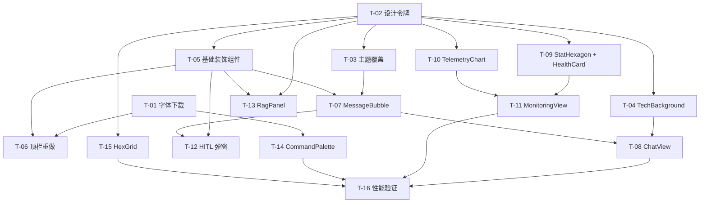
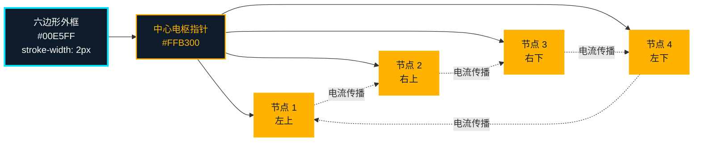
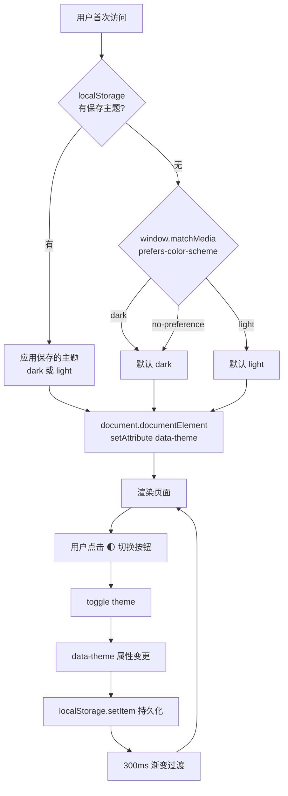
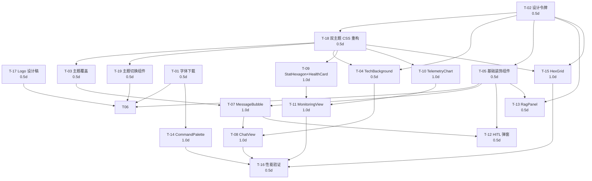

# GridOpsAgent 前端科技风格重设计方案

> 作者：产品经理 · Alice（Xu）
> 版本：v2.0（基于 v1.0 升级）
> 日期：2026-05（v1）/ 2026-08-03（v2 修订）
> 状态：v1 已评审，v2 待评审
> 目标产物：可视化重设计方案 + 可执行任务清单
> **品牌更名提示**：v2 起项目对外品牌为 **「灵枢电网 / GridMind」**（中文为主），原 v1 中的 "GridOpsAgent" 仅保留为内部包名/API ID。

---

## v2 修订记录（2026-08-03）

> 本次修订基于 v1.0（2026-05）评审反馈，落地 3 项已决策 + 2 项新增需求。

### 1. 决策摘要

| # | 决策项 | 用户答案 | 影响范围 | 状态 |
|---|---|---|---|---|
| 1 | §14 Q1 明/暗双主题 | **需要** | §3 令牌双轨拆分、§9 需求池 P0 新增、§10 任务重整、§17 新增机制 | ✅ 已落地 |
| 2 | §14 Q2 是否引入 ECharts | **暂不引入** | 维持 SVG + GSAP；REQ-P2-03 推迟至远期 | ✅ 已确认 |
| 3 | §14 Q3 最低浏览器 | **Chrome 100+ / Edge 100+** | 解锁 `clip-path` / `aspect-ratio` / 容器查询 / `:has()` 等现代特性 | ✅ 已确认 |
| 4 | 新增 A · 品牌命名规范 | **中文「灵枢电网」为主 + 英文「GridMind」** | §1 项目信息、§5.1 顶栏、所有 UI 触点；详见 §15 | ✅ 已落地 |
| 5 | 新增 B · 正式 Logo 设计 | **新增 4 规格 Logo（明暗双主题适配）** | §16 新增规范；T-17 新增任务 | ✅ 已落地 |

### 2. 受影响章节索引

| v1 章节 | 变更类型 | 变更摘要 |
|---|---|---|
| §1 项目信息 | 修订 | 品牌名改为「灵枢电网 / GridMind」；包名 `grid_mind_web`（建议）或保留 `grid_ops_agent_web`（过渡） |
| §3 设计令牌 | 修订 | 颜色/背景/边框/阴影/发光令牌按主题双轨拆分，详见 §17.4 |
| §5.1 顶栏 | 修订 | Logo 旁标改为"灵枢电网 + GridMind"；右侧增加主题切换按钮；附录 B 同步更新 |
| §5.2 ~ §5.4 | 微调 | 卡片/扫描线/插画在亮色主题下需降级处理（详见 §17.5） |
| §9 需求池 | 修订 | P0 新增 REQ-P0-15（双主题）、REQ-P0-16（Logo 集成）；P2 中 REQ-P2-07 升级为 P0 |
| §10 任务表 | **重整** | 新增 T-17 / T-18 / T-19；M1 由 9.0 → **10.5 人日**；总计 18.0 → **19.5 人日** |
| §11 里程碑 | 修订 | M1 包含 13 任务（含 T-17/18/19）；M2/M3 不变 |
| §14 待确认问题 | 标注 | Q1 / Q2 / Q3 状态置为「✅ 已决策」；Q4 ~ Q10 保留待后续评审 |

### 3. v2 新增章节链接

- **§15** · 项目命名规范（v2 新增）
- **§16** · Logo 设计规范（v2 新增）
- **§17** · 明暗双主题切换机制（v2 新增）

### 4. v2 新增任务总览

| 任务 ID | 标题 | 估工 | 依赖 |
|---|---|---|---|
| T-17 | Logo 设计稿（4 规格 + favicon） | 0.5 人日 | — |
| T-18 | 双主题 CSS 变量重构（tokens.dark/light/shared） | 0.5 人日 | T-02 |
| T-19 | 主题切换组件 + Pinia 持久化 | 0.5 人日 | T-18 |

### 5. 关键 ASCII 视觉块调整清单

| 位置 | 调整内容 |
|---|---|
| §5.1.1 现状→目标对比块（line ~263） | "GridOpsAgent" → "灵枢电网 / GridMind"；右侧增加 `🌓` 切换按钮 |
| §5.1.3 顶栏线框示意（line ~281） | "GRIDOPS" → "灵枢电网 GridMind"；状态条前增加 `🌓` 主题切换 |
| 附录 B 整体草图（line ~821） | 顶栏 "GRIDOPS" 替换为"灵枢电网 GridMind"；副标改为"电力 AI 调度中枢" |
| 附录 A 文件树（line ~784） | `public/fonts/` 下新增 `public/logo/` 目录（详见 §16.5） |

---

## 0. TL;DR

| 维度 | 决策 |
|---|---|
| **风格定位** | 「赛博控制中心 HUD」+「全息电网驾驶舱」双意象融合，以青色/琥珀双色 HUD 为主基调 |
| **核心视觉语言** | 暗底 + 玻璃拟态卡片 + 扫描线/网格底纹 + 等宽 HUD 字体 + 数据流光动效 |
| **设计令牌升级** | 颜色、字体、圆角、阴影、间距、动效曲线 6 大维度全面重定义 |
| **新增组件** | 7 个（TechBackground / StatusBar / CommandPalette / DataStreamBadge / StatHexagon / HexGrid / ScanlineOverlay） |
| **改造组件** | 8 个（App.vue / ChatView / MonitoringView / MessageBubble / HealthCard / TelemetryChart / RagPanel / DemoShortcuts） |
| **新增依赖** | `@vueuse/core`（推荐）、`gsap`（动效）、`echarts`（图表升级），共 3 个 |
| **落地节奏** | P0 阶段 6 个任务（约 7.5 人日）即可完成首版视觉升级；P1 + P2 完整版约 14 人日 |
| **核心风险** | 暗色对比度（WCAG AA）、低端 GPU 性能、动效过度导致认知负担 |

---

## 1. 项目信息

| 项 | 值 |
|---|---|
| Language | 简体中文 |
| Project Name | `grid_ops_agent_web` |
| Project Path | `F:/GridOpsAgent/web/` |
| 原始需求 | 将 GridOpsAgent 前端从「通用深蓝后台」升级为「赛博控制中心 HUD + 全息电网驾驶舱」风格，突出科技感与电网/AI 控制中心视觉冲击 |
| 现有技术栈 | Vue 3 + TypeScript + Vite + Element Plus 2.7 + Pinia + Vue Router |
| 目标技术栈 | 在现有基础上新增 `@vueuse/core`、`gsap`、`echarts` |
| 兼容性 | 不破坏现有 API 契约，不改变组件 props 命名，向后兼容 Element Plus 主题 |

---

## 2. 科技风格定义

### 2.1 风格定位（双意象融合）

**主意象：赛博控制中心 HUD（Cyber Control HUD）**
- 灵感来源：飞行驾驶舱、NASA 任务控制中心、军事 C4ISR 指挥系统
- 核心特征：等宽字体、数据标签、扫描线、刻度尺、状态徽章
- 适用区域：顶栏、状态条、消息气泡、监控卡片边框

**辅意象：全息电网驾驶舱（Holographic Grid Cockpit）**
- 灵感来源：电网调度大屏、SCADA 系统、科幻电影中的全息投影
- 核心特征：拓扑节点、电流流光、雷达扫描、等高线热力
- 适用区域：背景底纹、监控大屏、图表动效

### 2.2 取舍理由

| 候选风格 | 优点 | 缺点 | 决策 |
|---|---|---|---|
| 极简白底 SaaS | 干净、聚焦 | 与"电网/AI 控制中心"气质不符，缺少科技感 | ❌ |
| 通用深蓝后台 | 易实现、企业感 | 用户已反馈"科技感不足" | ❌ |
| 赛博朋克霓虹 | 视觉冲击强 | 过于娱乐化，电网场景严肃性受损 | ❌（仅借鉴配色） |
| **赛博 HUD + 全息驾驶舱** | 专业 + 科技 + 调度感三者兼得 | 设计/实现成本较高 | ✅ **选用** |
| 纯科幻太空舱 | 视觉新潮 | 与"电网运维"业务距离过远 | ❌ |

### 2.3 视觉调性关键词

```
冷峻 / 精密 / 实时 / 数据流 / 全息 / 调度 / 监测 / 透明叠加 / 微光描边
```

---

## 3. 设计令牌（Design Tokens）

> 所有令牌统一在 `web/src/styles/tokens.scss` 中以 CSS 变量形式定义，Element Plus 主题变量同步覆盖。

### 3.1 颜色令牌

#### 3.1.1 主色（Primary · 青色系 · 电网 + AI）

| Token | 值 | 用途 |
|---|---|---|
| `--brand-primary` | `#00E5FF` | 主交互色、链接、关键数据高亮 |
| `--brand-primary-soft` | `#00B8D4` | 次级主色、悬停态 |
| `--brand-primary-deep` | `#006978` | 暗态背景、按下态 |
| `--brand-primary-glow` | `rgba(0, 229, 255, 0.45)` | 发光描边、阴影 |
| `--brand-primary-fade` | `rgba(0, 229, 255, 0.08)` | 玻璃拟态叠加 |

#### 3.1.2 辅色（Accent · 琥珀/能量）

| Token | 值 | 用途 |
|---|---|---|
| `--accent-amber` | `#FFB300` | 告警、能量流、监控数值高亮 |
| `--accent-amber-glow` | `rgba(255, 179, 0, 0.5)` | 告警发光 |
| `--accent-magenta` | `#FF2D7B` | HITL 待审、危险操作（克制使用） |
| `--accent-violet` | `#9D4EDD` | AI 智能体相关元素（多智能体徽章） |

#### 3.1.3 状态色（Status · 与现有系统对齐）

| Token | 值 | 语义 |
|---|---|---|
| `--status-success` | `#00E676` | 在线、正常、完成 |
| `--status-warning` | `#FFB300` | 告警、待处理 |
| `--status-danger` | `#FF4757` | 离线、故障、需立即介入 |
| `--status-info` | `#00E5FF` | 信息提示、监控中 |
| `--status-neutral` | `#8B9BB4` | 禁用、空闲 |

#### 3.1.4 背景层级（Background · 深空蓝黑）

| Token | 值 | 用途 |
|---|---|---|
| `--bg-void` | `#050B1A` | 页面最底层 |
| `--bg-base` | `#0A1228` | 页面主背景 |
| `--bg-surface` | `#0F1A33` | 卡片/面板 |
| `--bg-elevated` | `#15244A` | 弹窗/抽屉/悬浮层 |
| `--bg-overlay` | `rgba(5, 11, 26, 0.85)` | 模态遮罩 |

#### 3.1.5 文字层级（Text）

| Token | 值 | 用途 |
|---|---|---|
| `--text-primary` | `#E6F1FF` | 主要文字 |
| `--text-secondary` | `#8FA3C7` | 次要文字 |
| `--text-muted` | `#5A6B8C` | 辅助说明 |
| `--text-mono` | `#7FE9FF` | 等宽字体专用色（数据/HUD） |
| `--text-inverse` | `#050B1A` | 反白文字 |

### 3.2 字体令牌

#### 3.2.1 字体家族

| Token | 字体 | 用途 |
|---|---|---|
| `--font-sans` | `'Inter', 'PingFang SC', 'Microsoft YaHei', system-ui, sans-serif` | 正文、标签 |
| `--font-display` | `'Orbitron', 'Rajdhani', 'Inter', sans-serif` | 标题、Logo、关键数据 |
| `--font-mono` | `'JetBrains Mono', 'Sarasa Mono SC', 'Fira Code', monospace` | 数据、代码、状态码 |
| `--font-mono-cn` | `'Sarasa Mono SC', 'JetBrains Mono', monospace` | 中文等宽（监控数据含中文） |

#### 3.2.2 字号比例（基于 1.125 比例尺）

| Token | 尺寸 | 用途 |
|---|---|---|
| `--fs-xs` | `11px` | 状态码、徽章、刻度 |
| `--fs-sm` | `12px` | 辅助说明、表格次要列 |
| `--fs-base` | `14px` | 正文 |
| `--fs-md` | `16px` | 卡片标题 |
| `--fs-lg` | `20px` | 区块标题 |
| `--fs-xl` | `28px` | 关键数值（HUD 数字） |
| `--fs-2xl` | `36px` | 健康评分等核心指标 |
| `--fs-3xl` | `48px` | 仪表盘核心 KPI |

#### 3.2.3 字重

| Token | 值 | 用途 |
|---|---|---|
| `--fw-regular` | 400 | 正文 |
| `--fw-medium` | 500 | 标签、按钮 |
| `--fw-semibold` | 600 | 卡片标题 |
| `--fw-bold` | 700 | 大数字、关键标题 |
| `--fw-black` | 900 | Display 数字（如健康评分） |

#### 3.2.4 字距

- 全局字距：`letter-spacing: 0.01em`
- 等宽数字字距（数据区）：`font-variant-numeric: tabular-nums`
- Display 标题字距：`letter-spacing: 0.05em`（Orbitron 自带）
- 状态徽章字距：`letter-spacing: 0.15em`（全大写）

### 3.3 圆角令牌

| Token | 值 | 用途 |
|---|---|---|
| `--radius-none` | `0` | HUD 边框、刻度尺（破除柔和感） |
| `--radius-xs` | `2px` | 状态徽章、数据标签 |
| `--radius-sm` | `4px` | 按钮、输入框 |
| `--radius-md` | `6px` | 卡片（保留科技感，不过度圆角） |
| `--radius-lg` | `8px` | 弹窗、抽屉 |
| `--radius-pill` | `999px` | 标签、状态点 |

> **取舍**：摒弃 iOS 风格的 `12-16px` 大圆角，采用"硬边 + 2-6px 锐角"以保持科技感与控制中心专业感。

### 3.4 阴影与发光令牌

| Token | 值 | 用途 |
|---|---|---|
| `--shadow-sm` | `0 1px 2px rgba(0, 229, 255, 0.08)` | 微悬浮 |
| `--shadow-md` | `0 4px 12px rgba(0, 0, 0, 0.4)` | 卡片 |
| `--shadow-lg` | `0 8px 32px rgba(0, 0, 0, 0.5)` | 抽屉、弹窗 |
| `--glow-primary` | `0 0 12px rgba(0, 229, 255, 0.45), 0 0 32px rgba(0, 229, 255, 0.18)` | 主色发光描边 |
| `--glow-amber` | `0 0 12px rgba(255, 179, 0, 0.5)` | 告警发光 |
| `--glow-danger` | `0 0 12px rgba(255, 71, 87, 0.55)` | 危险发光（HITL 紧急） |
| `--shadow-inset-hud` | `inset 0 0 0 1px rgba(0, 229, 255, 0.2)` | HUD 内描边 |

### 3.5 间距令牌

| Token | 值 | 用途 |
|---|---|---|
| `--space-0` | `0` | — |
| `--space-1` | `4px` | 紧凑元素 |
| `--space-2` | `8px` | 标签内边距 |
| `--space-3` | `12px` | 列表项 |
| `--space-4` | `16px` | 卡片内边距 |
| `--space-5` | `20px` | 区块间距 |
| `--space-6` | `24px` | 大区块 |
| `--space-8` | `32px` | 页面边距 |
| `--space-10` | `40px` | 主要分区 |
| `--space-12` | `48px` | 仪表盘栅格间距 |

### 3.6 动效曲线与时长

| Token | 值 | 用途 |
|---|---|---|
| `--ease-out-quint` | `cubic-bezier(0.22, 1, 0.36, 1)` | 进入、展开 |
| `--ease-in-out-quart` | `cubic-bezier(0.76, 0, 0.24, 1)` | 状态切换 |
| `--ease-spring` | `cubic-bezier(0.34, 1.56, 0.64, 1)` | 弹性反馈 |
| `--ease-linear` | `linear` | 扫描、循环动效 |
| `--duration-fast` | `120ms` | 微交互（按钮按下） |
| `--duration-base` | `240ms` | 标准过渡 |
| `--duration-slow` | `400ms` | 抽屉、模态 |
| `--duration-crawl` | `1200ms` | 数据流光、扫描线 |
| `--duration-pulse` | `2000ms` | 呼吸灯、状态指示 |

### 3.7 边框与刻度

| Token | 值 | 用途 |
|---|---|---|
| `--border-hud` | `1px solid rgba(0, 229, 255, 0.25)` | HUD 卡片描边 |
| `--border-hud-strong` | `1px solid rgba(0, 229, 255, 0.5)` | 强调 HUD 边框 |
| `--border-corner-cut` | `clip-path: polygon(0 8px, 8px 0, calc(100% - 8px) 0, 100% 8px, 100% calc(100% - 8px), calc(100% - 8px) 100%, 8px 100%, 0 calc(100% - 8px))` | 控制中心标志性的"切角矩形" |

> **关键决策**：所有"重要卡片/弹窗"统一使用 `border-corner-cut` 切角矩形，区别于普通卡片，立即传达"控制中心"语义。

---

## 4. 产品定义

### 4.1 产品目标

1. **G1 · 科技感升级**：将前端从"通用深蓝后台"提升至"赛博控制中心 HUD"水准，5 秒内建立"电网/AI 控制中心"专业感认知。
2. **G2 · 信息密度与可读性平衡**：在强化视觉冲击的同时不牺牲数据可读性，关键 KPI、告警、状态信息保持扫读效率。
3. **G3 · 场景沉浸**：对话页、监控页、HITL 弹窗三个核心场景均拥有专属视觉语言，强化"AI 智能体协同 + 电网调度"业务心智。

### 4.2 用户故事

| ID | 角色 | 想要 | 为了 |
|---|---|---|---|
| US-1 | 电网运维工程师 | 一眼看到当前电网运行状态、关键告警和系统健康度 | 快速判断是否需要立即介入 |
| US-2 | AI 智能体使用者 | 与 monitor/safety/diagnosis/knowledge 多智能体对话时有清晰的"智能体来源"视觉标识 | 信任并区分不同智能体的回复 |
| US-3 | HITL 审核人 | 收到工具调用审核请求时有强烈的"现在需要我做决定"视觉反馈 | 不漏审、不延误 |
| US-4 | 现场值班员 | 在大屏/普通屏上都能看到清晰的数据流光与状态变化 | 长时间盯盘不疲劳、信息抓取高效 |
| US-5 | 演示者 | 给领导/客户演示时，界面具有"哇"效应的科技感 | 体现产品专业度与差异化 |

---

## 5. 关键页面视觉设计

### 5.1 顶部导航（App.vue 改造）

#### 5.1.1 现状 → 目标

```
【现状】                                                  【目标】
┌─────────────────────────────────────────────────┐     ┌──────────────────────────────────────────────────────────────────┐
│  [Logo] GridOpsAgent   [对话][监控]    ● 4 agents │     │  [◆ GRIDOPS] │ ⌕ 全局搜索...  │  [对话][监控][知识库]  │  🟢 ALL SYS  14:32:08 │
└─────────────────────────────────────────────────┘     └──────────────────────────────────────────────────────────────────┘
```

#### 5.1.2 升级要点

| 区域 | 现状 | 目标 |
|---|---|---|
| Logo | 纯文字 "GridOpsAgent" | `◆` 几何标识 + 字体 `Orbitron` "GRIDOPS" + 副标题 "POWER GRID AI COPILOT"（字距 0.2em，全大写） |
| 导航 | 水平两个 Tab | 水平 Tab + 当前页指示下划线（青色发光） |
| 全局搜索 | 无 | 中央增加 `⌕` 搜索条，点击唤起 CommandPalette（命令面板） |
| 状态徽章 | 圆形 + "4 agents" | 改为系统状态条：CPU / MEM / AGENTS / LATENCY 四组小指标 + 实时数字滚动 |
| 时钟 | 无 | 右上角 UTC + 本地双时钟，秒级跳动，ScanlineOverlay 滚动效果 |

#### 5.1.3 线框示意

```
┌─────────────────────────────────────────────────────────────────────────────────────────┐
│ ◆ GRIDOPS              ⌕ 搜索命令/设备/知识...          [对话] [监控] [知识库]   🟢 CPU 23% MEM 41% AGT 4/4 ⏱ 124ms  14:32:08 │
│   POWER GRID AI COPILOT                                                                    └────────────── 顶栏状态条（次级高度）──────────┘│
└─────────────────────────────────────────────────────────────────────────────────────────┘
```

---

### 5.2 智能对话页（ChatView.vue 改造）

#### 5.2.1 布局升级

```
┌────────────────────────────────────────────────────────────────────────┐
│ ▌ 对话 · MULTI-AGENT COPILOT                    [清空] [设置] [导出]    │ ← 标题区：切角矩形 + agent 徽章
├────────────────────────────────────────────────────────────────────────┤
│                                                                        │
│   [系统]  ▸ monitor 智能体已激活 · 14:32:01                            │
│                                                                        │
│              ┌────────────────────────────────────┐                   │
│              │ ◆ AI · diagnosis                   │                   │
│              │   TRANSFORMER-04 油温异常上升...    │                   │
│              │   ▸ 工具调用: query_telemetry       │                   │
│              │   ▸ 知识检索: 3 篇相关文档          │                   │
│              │ 14:32:05                              │                   │
│              └────────────────────────────────────┘                   │
│                                                                        │
│   ┌──────────────────────────────────────┐                            │
│   │ 用户                                  │                            │
│   │ 帮我检查所有变压器的温度              │                            │
│   │ 14:32:08                              │                            │
│   └──────────────────────────────────────┘                            │
│                                                                        │
├────────────────────────────────────────────────────────────────────────┤
│  ⌘K 快捷指令: [诊断变压器] [查询告警] [生成报告] [设备巡检] ...        │ ← 快捷指令带 hover 描边发光
├────────────────────────────────────────────────────────────────────────┤
│  [输入消息...                                          ]  [发送 ⏎]    │ ← 输入区切角矩形 + 字符计数器 + 发送按钮发光
└────────────────────────────────────────────────────────────────────────┘
```

#### 5.2.2 改造要点

| 元素 | 视觉 |
|---|---|
| 消息气泡（AI） | 切角矩形（左上角切 8px）、左侧 4px 青色发光条、agent 类型徽章（`◆ AI · diagnosis`）用 Orbitron |
| 消息气泡（用户） | 切角矩形（右上角切 8px）、右侧 4px 琥珀色发光条 |
| 工具调用 | 内嵌子卡片，琥珀色描边，显示工具名 + 参数 + 返回摘要（折叠/展开） |
| 状态点 | 智能体思考时显示"脉冲圆环"（青色）+ "thinking..." 文字流光 |
| 输入区 | 切角矩形输入框，聚焦时外发光 `0 0 0 2px rgba(0,229,255,0.3)` |
| 快捷指令 | 横排 Pill 按钮，hover 时下边框流光（ScanlineOverlay 缩略版） |
| 加载动效 | AI 回复时打字机效果（文字逐字出现 + cursor 闪烁） |

#### 5.2.3 消息气泡示意（ASCII）

```
   ┌─◆─ diagnosis ─────────────────┐
   │ 油温传感器读数显示 +1.2°C/h   │
   │ 持续上升, 已超过阈值 1.0°C/h  │
   │                                │
   │ ▸ 工具: query_telemetry        │
   │   返回 3 条遥测记录            │
   │                                │
   │ 14:32:05 · ⚡ 142ms           │
   └────────────────────────────────┘
   ↑ 切角、左侧发光条、底部时间 + 延迟（mono 字体）
```

---

### 5.3 实时监控页（MonitoringView.vue 改造）

#### 5.3.1 布局升级（栅格化大屏布局）

```
┌──────────────────────────────────────────────────────────────────────────────────────┐
│ ▌ 实时监控 · REAL-TIME GRID MONITORING                          [刷新] [导出] [⚙]   │
├──────────────────────────────────────────────────────────────────────────────────────┤
│ ┌─────────┐ ┌─────────┐ ┌─────────┐ ┌─────────┐ ┌─────────┐ ┌─────────┐              │
│ │  设备    │ │  在线    │ │  告警    │ │  健康度  │ │  延迟    │ │ 智能体  │   ← StatHexagon│
│ │   24    │ │  22/24  │ │   ⚠ 3   │ │  87.4   │ │ 124ms   │ │  4/4    │              │
│ │  DEVICES│ │  ONLINE │ │  ACTIVE │ │  SCORE  │ │  P95    │ │ AGENTS  │              │
│ └─────────┘ └─────────┘ └─────────┘ └─────────┘ └─────────┘ └─────────┘              │
├──────────────────────────────────────────────────────────────────────────────────────┤
│ ┌────────────────────────────────────────────┐  ┌─────────────────────────────────┐  │
│ │  设备列表 · GRID ASSETS                     │  │  实时遥测 · LIVE TELEMETRY    │  │
│ │ ┌────┬────────┬──────┬────┬─────┬─────┐   │  │  TRANSFORMER-04 · 油温         │  │
│ │ │ ID │ 名称   │ 状态 │ 油温│ 负载│ 健康│   │  │  ┌─────────────────────────┐   │  │
│ │ ├────┼────────┼──────┼────┼─────┼─────┤   │  │  │ 折线图 + 渐变填充 + 流光 │   │  │
│ │ │T-04│ 主变#4 │ ⚠ 告警│ 78°│ 87% │ 76  │   │  │  │ Y 轴刻度 + 阈值红色线   │   │  │
│ │ │T-05│ 主变#5 │ 🟢 正常│ 65°│ 72% │ 92  │   │  │  └─────────────────────────┘   │  │
│ │ │... │ ...    │ ...  │... │ ... │ ... │   │  │  电压 / 负载 / 湿度 / 压力    │  │
│ │ └────┴────────┴──────┴────┴─────┴─────┘   │  │  (Tab 切换，每个指标独立图)   │  │
│ └────────────────────────────────────────────┘  └─────────────────────────────────┘  │
└──────────────────────────────────────────────────────────────────────────────────────┘
```

#### 5.3.2 改造要点

| 元素 | 视觉 |
|---|---|
| 统计卡（6 个） | 改为六边形/切角矩形（StatHexagon），大数字使用 Orbitron 48px，底部带 sparkline 缩略趋势线 |
| 设备表格 | 行 hover 描边发光 + 切角矩形容器 + 表头"刻度尺"风格（细分割线 + 三角箭头） |
| 抽屉详情 | 右侧滑出 480px，左侧用发光描边 + 顶部条带显示设备 ID（Orbitron 32px）+ 状态徽章 |
| 实时遥测图表 | 渐变填充（青色→透明）、数据流光（最新数据点向右移动并拖尾）、阈值线（红/橙） |
| 大屏装饰 | 左上/右上角加 corner L 形 HUD 装饰（见装饰元素章节） |

#### 5.3.3 统计卡示意（六边形）

```
       ╱──────────╲
      ╱   DEVICES  ╲
     │      24       │   ← Orbitron 48px + tabular-nums
     │   ↑ +2 (24h) │   ← 趋势指示（琥珀色）
      ╲  18 在线    ╱
       ╲──────────╱
        ↑ 六边形 + 发光描边 + 底色微光
```

---

### 5.4 HITL 审核弹窗

#### 5.4.1 视觉目标

> 强烈的"现在需要你做决定"紧迫感，但不破坏专业感；区别于普通确认弹窗（危险操作级别视觉权重）。

#### 5.4.2 设计要点

| 要素 | 视觉 |
|---|---|
| 遮罩 | 暗色高斯模糊 + 扫描线缓慢下移（`ScanlineOverlay`） |
| 弹窗 | 切角矩形 + 顶部 4px 琥珀→品红渐变发光条（表示"待决策"） |
| 标题区 | `◆ 待审核 · HITL APPROVAL REQUIRED`（全大写、字距 0.2em）+ 闪烁呼吸点 |
| 工具信息 | 等宽字体显示 `tool_name`、`params` JSON 树（语法高亮） |
| 影响范围 | 红色徽章标注可能影响的设备/区域（DataStreamBadge 滚动） |
| 操作按钮 | `[拒绝] [批准]` —— 批准按钮主色发光，悬停时扫描线扫过；拒绝按钮次级 |
| 倒计时 | 可选：默认 5 分钟倒计时，超时高亮（品红色脉冲） |

#### 5.4.3 弹窗示意

```
          ┌─◆─ 待审核 · HITL APPROVAL REQUIRED ───────────────────────┐  ← 顶部发光条
          │  ⏱  04:53                                                │
          ├──────────────────────────────────────────────────────────┤
          │  工具调用 · TOOL INVOCATION                                │
          │  ┌────────────────────────────────────────────────────┐  │
          │  │  tool:    switch_circuit_breaker                  │  │
          │  │  target:  CB-12-SUBSTATION-A                      │  │
          │  │  action:  OPEN                                   │  │
          │  │  reason:  故障隔离 (由 diagnosis 智能体触发)       │  │
          │  └────────────────────────────────────────────────────┘  │
          │                                                            │
          │  ⚠ 影响范围:                                                │
          │  ▸ SUBSTATION-A 区域停电 ~2 分钟                          │
          │  ▸ 12,400 用户受短暂影响                                   │
          │                                                            │
          │                       [拒绝]    [批准 ⏎]                  │
          └──────────────────────────────────────────────────────────┘
```

---

## 6. 装饰元素方案

### 6.1 背景方案（选 2 种组合）

#### 6.1.1 主背景：深空网格 + 微弱径向光晕

**实现**：CSS 叠加 `background-image` 多层
- 第 1 层：`linear-gradient(rgba(0,229,255,0.04) 1px, transparent 1px)` + `linear-gradient(90deg, rgba(0,229,255,0.04) 1px, transparent 1px)`，size 40×40
- 第 2 层：径向渐变 `radial-gradient(ellipse at center, rgba(0,229,255,0.08) 0%, transparent 70%)`
- 底层：`--bg-void` `#050B1A`

#### 6.1.2 监控页专属：六边形拓扑节点（HexGrid）

**实现**：SVG 组件，绘制 80×80 六边形蜂窝网格
- 节点：6px 圆点
- 连线：节点间以低透明度青色直线连接
- 动画：每 3-5s 随机一个节点"激活"（脉冲 + 沿连线传播）
- **代码量预估**：~120 行 SVG + 简单 JS

### 6.2 装饰元素清单

| 元素 | 实现方式 | 适用页面 | 优先级 |
|---|---|---|---|
| `TechBackground` | CSS 多层背景 + 径向光晕 | 全局 | P0 |
| `HexGrid` | SVG 拓扑节点 + 动效 | 监控页背景 | P1 |
| `ScanlineOverlay` | CSS 动画 `linear-gradient` 下移 | 弹窗、HITL、加载中 | P0 |
| `CornerL` | 切角 L 形装饰（左上/右下 SVG） | 监控页大屏、抽屉 | P0 |
| `DataStreamBadge` | 文字 + 末尾 ▌闪烁光标 | 智能体在线、状态条 | P0 |
| `PulseDot` | 单点脉冲呼吸动画 | 状态徽章 | P0 |
| `RadarSweep` | 雷达扫描扇形 | 监控大屏（可选 P1） | P2 |
| `ContourHeat` | 等高线 SVG（基于 TelemetryChart 数据） | 遥测图背景 | P2 |

### 6.3 微交互清单

| 场景 | 动效 | 时长 |
|---|---|---|
| 按钮按下 | 缩放 `scale(0.97)` + 发光增加 | 120ms |
| 卡片悬浮 | Y 轴位移 `-2px` + 描边发光增强 | 240ms |
| Tab 切换 | 下划线 `transform: translateX` + 颜色过渡 | 240ms |
| 消息出现 | 透明度 0→1 + Y 轴 +8→0 | 240ms ease-out-quint |
| 状态点 | 透明度 0.3→1 循环 | 2000ms linear |
| 扫描线 | Y 轴 -100%→100% 循环 | 1200ms linear |
| 数据流光 | 路径 stroke-dashoffset 动画 | 800ms linear |
| 抽屉滑入 | X 轴 100%→0 | 400ms ease-out-quint |
| 数字滚动 | 数值过渡（用 GSAP 或纯 CSS `@property`） | 600ms |
| AI 思考 | 三个点循环透明度 | 1200ms linear |

---

## 7. 字体引入方案

### 7.1 引入策略

采用**自托管 + 字体子集化**，避免 CDN 抖动与隐私问题。

| 字体 | 来源 | 引入方式 | 用途 |
|---|---|---|---|
| **Orbitron** | Google Fonts / 自托管 woff2 | `index.html` `<link rel="preload">` + `@font-face` | 标题、Logo、Display 数字 |
| **Rajdhani** | Google Fonts / 自托管 | 同上 | 次级 Display（备用） |
| **JetBrains Mono** | JetBrains 官方 | 同上 | 英文/数字等宽（数据、状态码） |
| **Sarasa Mono SC** | GitHub 开源 | 同上 | 中文等宽（监控值含中文） |
| Inter | 系统已带 / Google Fonts | 系统回退 | 正文 |

### 7.2 性能优化

- 字体子集化：Orbitron 仅保留 0-9 + 字母 + 常用符号，文件从 ~120KB 降至 ~25KB
- `font-display: swap` 防止 FOIT（Flash of Invisible Text）
- 关键文本 `preload`，次要字体按需加载
- 提供完整回退栈避免布局抖动

### 7.3 引入代码示例（`index.html` 头部）

```html
<link rel="preload" href="/fonts/Orbitron-500.woff2" as="font" type="font/woff2" crossorigin>
<link rel="preload" href="/fonts/Orbitron-700.woff2" as="font" type="font/woff2" crossorigin>
<link rel="preload" href="/fonts/JetBrainsMono-Regular.woff2" as="font" type="font/woff2" crossorigin>
```

---

## 8. 组件清单（新增 / 修改）

### 8.1 新增组件（7 个）

| 组件名 | 路径 | 功能 | 复杂度 |
|---|---|---|---|
| `TechBackground.vue` | `web/src/components/decor/TechBackground.vue` | 全局背景：网格 + 径向光晕 | 低 |
| `StatusBar.vue` | `web/src/components/decor/StatusBar.vue` | 顶栏状态条：CPU/MEM/AGENTS/LATENCY | 中 |
| `CommandPalette.vue` | `web/src/components/CommandPalette.vue` | 全局命令面板（⌘K 唤起） | 中 |
| `DataStreamBadge.vue` | `web/src/components/decor/DataStreamBadge.vue` | 流光状态徽章 | 低 |
| `StatHexagon.vue` | `web/src/components/decor/StatHexagon.vue` | 六边形统计卡 | 中 |
| `HexGrid.vue` | `web/src/components/decor/HexGrid.vue` | 拓扑节点背景 | 高 |
| `ScanlineOverlay.vue` | `web/src/components/decor/ScanlineOverlay.vue` | 扫描线遮罩 | 低 |

### 8.2 修改组件（8 个）

| 组件 | 路径 | 主要改造点 |
|---|---|---|
| `App.vue` | `web/src/App.vue` | 顶栏重做：Logo + 搜索 + 状态条 + 时钟 + 引入 TechBackground |
| `ChatView.vue` | `web/src/components/ChatView.vue` | 标题区切角矩形 + 消息列表背景 TechBackground + 快捷指令发光 |
| `MessageBubble.vue` | `web/src/components/MessageBubble.vue` | 切角气泡 + 发光条 + 智能体徽章 + 工具调用子卡 |
| `MonitoringView.vue` | `web/src/components/MonitoringView.vue` | 大屏栅格布局 + HexGrid 背景 + 切角标题 + CornerL 装饰 |
| `HealthCard.vue` | `web/src/components/HealthCard.vue` | 切角矩形 + 大数字 Orbitron + 圆环进度条发光 |
| `TelemetryChart.vue` | `web/src/components/TelemetryChart.vue` | 渐变填充 + 数据流光 + 阈值线 + 刻度尺 + 轴线 mono 字体 |
| `RagPanel.vue` | `web/src/components/RagPanel.vue` | 切角卡 + 文档检索结果带"传输流光"动画 |
| `DemoShortcuts.vue` | `web/src/components/DemoShortcuts.vue` | Pill 按钮 + hover 描边发光 + 点击涟漪 |

### 8.3 全局样式改造

| 文件 | 改造点 |
|---|---|
| `web/src/styles/tokens.scss` | 新增：所有设计令牌（颜色/字体/圆角/阴影/间距/动效） |
| `web/src/styles/element-overrides.scss` | 覆盖 Element Plus 主题：主色 `--el-color-primary: #00E5FF`、暗色面板、按钮切角、输入框切角 |
| `web/src/style.css` | 引入字体 @font-face、TechBackground 全局背景 |
| `web/index.html` | 添加字体 preload link、设置 `data-theme="dark"` |

---

## 9. 技术规范（需求池）

### 9.1 需求池 P0（首版必交付）

| ID | 需求 | 验收标准 | 涉及文件 |
|---|---|---|---|
| REQ-P0-01 | 设计令牌体系 | tokens.scss 全部令牌定义完成；切换主题不影响业务 | tokens.scss |
| REQ-P0-02 | 引入字体（Orbitron + JetBrains Mono） | 字体文件 < 200KB，FOIT < 100ms | index.html, style.css |
| REQ-P0-03 | 全局背景 TechBackground | 网格 + 径向光晕可见，不影响可读性 | TechBackground.vue, App.vue |
| REQ-P0-04 | Element Plus 主题覆盖 | 主色变更为 `#00E5FF`，所有按钮/输入框切角 4px | element-overrides.scss |
| REQ-P0-05 | 顶栏重做 | Logo + 全局搜索 + 状态条 + 时钟 | App.vue, StatusBar.vue |
| REQ-P0-06 | 消息气泡切角 + 发光 | 切角矩形 + 左侧/右侧发光条 + 智能体徽章 | MessageBubble.vue |
| REQ-P0-07 | 监控页统计卡改造 | 6 个统计卡使用 StatHexagon + Orbitron 大数字 | StatHexagon.vue, MonitoringView.vue |
| REQ-P0-08 | 监控页大屏栅格布局 | 6 卡 + 表格 + 图表三区，响应式断点 1280/1600/1920 | MonitoringView.vue |
| REQ-P0-09 | 实时遥测图表升级 | 渐变填充 + 流光 + 阈值线 + 刻度 | TelemetryChart.vue |
| REQ-P0-10 | HITL 弹窗改造 | 切角 + 顶部渐变发光 + 扫描线 + 工具 JSON 高亮 | MessageBubble.vue 或新组件 |
| REQ-P0-11 | ScanlineOverlay | 弹窗/HITL 加载中显示扫描线 | ScanlineOverlay.vue |
| REQ-P0-12 | 快捷指令按钮改造 | Pill + hover 描边发光 | DemoShortcuts.vue |
| REQ-P0-13 | RagPanel 切角 + 流光 | 切角卡 + 检索结果传输流光 | RagPanel.vue |
| REQ-P0-14 | HealthCard 改造 | 切角 + 大数字 + 圆环发光 | HealthCard.vue |

### 9.2 需求池 P1（次版迭代）

| ID | 需求 | 验收标准 |
|---|---|---|
| REQ-P1-01 | CommandPalette 全局命令面板 | ⌘K 唤起，支持搜索命令/设备/知识 |
| REQ-P1-02 | HexGrid 拓扑背景 | 监控页背景显示六边形拓扑 + 节点脉冲 |
| REQ-P1-03 | 数字滚动动效 | 统计卡数字 0→目标值带过渡 |
| REQ-P1-04 | AI 思考脉冲 | 智能体思考时显示"脉冲圆环 + thinking..." |
| REQ-P1-05 | 状态徽章闪烁 | 在线/告警/离线徽章呼吸效果 |
| REQ-P1-06 | 抽屉滑入动效 | 设备详情抽屉 X 轴滑入 400ms |
| REQ-P1-07 | 字体：Rajdhani | 作为 Orbitron 备选 Display |
| REQ-P1-08 | 字体：Sarasa Mono SC | 中文等宽支持 |
| REQ-P1-09 | 引入 GSAP | 复杂动效统一管理 |
| REQ-P1-10 | 引入 @vueuse/core | useIntervalFn、useMouseInElement 等 |

### 9.3 需求池 P2（增强）

| ID | 需求 |
|---|---|
| REQ-P2-01 | RadarSweep 雷达扫描扇形 |
| REQ-P2-02 | ContourHeat 等高线热力 |
| REQ-P2-03 | 图表升级 ECharts（更复杂交互） |
| REQ-P2-04 | 顶栏时钟 UTC + 本地双显示 |
| REQ-P2-05 | 大屏模式（全屏 + 隐藏导航） |
| REQ-P2-06 | 多语言（中/英）字号比例适配 |
| REQ-P2-07 | 主题切换（暗色/极暗色/亮色） |

---

## 10. 依赖建议

### 10.1 推荐新增

| 包 | 版本 | 用途 | 是否必选 | 理由 |
|---|---|---|---|---|
| **@vueuse/core** | ^10 | 组合式工具（useIntervalFn/useElementVisibility/useMouseInElement/useThrottleFn） | ✅ 必选 | 减少样板代码，提升动效与交互开发效率；体积 ~50KB gzip |
| **gsap** | ^3.12 | 复杂动效（数字滚动、路径动画、timeline） | ⚠️ 推荐 | 性能优于 CSS 动画，可处理复杂 stagger/timeline；体积 ~30KB gzip |
| **echarts** | ^5.5 | 升级 TelemetryChart（渐变、流光、缩放、tooltip） | ⚠️ 推荐 | SVG 折线已不足以表达"调度大屏"复杂度；体积 ~200KB gzip（按需引入可降至 80KB） |

### 10.2 不推荐

| 包 | 理由 |
|---|---|
| `tailwindcss` | 现有 CSS Variables + SCSS 体系已足够；引入会与 Element Plus 主题冲突，增加学习成本 |
| `monaco-editor` | 当前无代码编辑需求；过重（~2MB） |
| `three.js` | 无 3D 需求；过重 |
| `lottie-web` | 暂无需复杂矢量动画；后续可按需引入 |

### 10.3 推荐组合

```json
// package.json 新增 dependencies
{
  "@vueuse/core": "^10.9.0",
  "gsap": "^3.12.5",
  "echarts": "^5.5.0"
}
```

**总新增体积预估**：约 130-280 KB gzip（按需引入 ECharts 后约 160 KB）

### 10.4 字体自托管

不新增 npm 包，字体 woff2 文件放入 `web/public/fonts/`，由 `index.html` preload。

---

## 11. 落地任务列表（核心交付）

> 估工单位：人日（按 1 人 8h 计算）
> 依赖关系：标注 `依赖:` 字段

### 11.1 任务表

| 任务 ID | 标题 | 目标产物 | 所属文件 | 依赖 | 估工 |
|---|---|---|---|---|---|
| T-01 | 字体下载与子集化 | Orbitron 500/700 + JetBrains Mono Regular woff2 文件 | `web/public/fonts/`, `web/src/style.css` | — | 0.5 |
| T-02 | 设计令牌 tokens.scss | 颜色/字体/圆角/阴影/间距/动效全部 CSS 变量 | `web/src/styles/tokens.scss` | — | 0.5 |
| T-03 | Element Plus 主题覆盖 | 主色变更 + 暗色面板 + 切角按钮/输入框 | `web/src/styles/element-overrides.scss` | T-02 | 0.5 |
| T-04 | TechBackground 组件 | 网格 + 径向光晕背景组件 + 全局应用 | `web/src/components/decor/TechBackground.vue`, `App.vue` | T-02 | 0.5 |
| T-05 | ScanlineOverlay + DataStreamBadge + PulseDot 三个基础装饰组件 | 3 个小组件，可在弹窗、状态条复用 | `web/src/components/decor/*` | T-02 | 0.5 |
| T-06 | App.vue 顶栏重做 | 新 Logo + 搜索条 + StatusBar + 时钟 | `App.vue`, `web/src/components/decor/StatusBar.vue` | T-01, T-02, T-05 | 1.0 |
| T-07 | MessageBubble 切角改造 | 切角矩形 + 发光条 + 智能体徽章 | `MessageBubble.vue` | T-02, T-03 | 1.0 |
| T-08 | ChatView 整体升级 | 标题区切角 + 背景 TechBackground + 快捷指令发光 + 输入区切角 | `ChatView.vue`, `DemoShortcuts.vue` | T-04, T-07 | 1.0 |
| T-09 | StatHexagon + HealthCard 改造 | 六边形统计卡 + 健康评分切角大数字 | `StatHexagon.vue`, `HealthCard.vue` | T-02 | 1.0 |
| T-10 | TelemetryChart 升级 | 渐变填充 + 数据流光 + 阈值线 + 刻度尺 | `TelemetryChart.vue` | T-02 | 1.0 |
| T-11 | MonitoringView 大屏栅格 | 6 卡 + 表格 + 图表栅格布局 + CornerL 装饰 + 抽屉动效 | `MonitoringView.vue` | T-09, T-10 | 1.0 |
| T-12 | HITL 弹窗改造 | 切角 + 顶部渐变发光 + 扫描线 + 工具 JSON 树 + 倒计时（可选） | `MessageBubble.vue` 或新 `HitlModal.vue` | T-05, T-07 | 0.5 |
| T-13 | RagPanel 切角 + 流光 | 切角卡 + 检索结果传输流光动画 | `RagPanel.vue` | T-02, T-05 | 0.5 |
| T-14 | CommandPalette 全局命令面板 | ⌘K 唤起 + 搜索命令/设备 + 键盘导航 | `web/src/components/CommandPalette.vue` | T-01 | 1.0 |
| T-15 | HexGrid 拓扑背景 | SVG 六边形拓扑 + 节点脉冲 + 连线传播 | `web/src/components/decor/HexGrid.vue` | T-02 | 1.0 |
| T-16 | 性能与可访问性验证 | 暗色对比度 WCAG AA、prefers-reduced-motion、关键动效降级 | `tokens.scss`, 各组件 | T-08, T-11, T-12 | 0.5 |

### 11.2 里程碑

| 里程碑 | 包含任务 | 累计工时 | 交付物 |
|---|---|---|---|
| **M1 · 基础视觉升级**（首版） | T-01, T-02, T-03, T-04, T-05, T-06, T-07, T-08, T-09, T-10, T-11, T-13 | **9.0 人日** | 顶栏/对话/监控三大页面视觉升级 + 装饰基础 |
| **M2 · 高级交互** | T-12, T-14, T-15, T-16 | **4.0 人日** | HITL 弹窗 + 命令面板 + 拓扑背景 + 性能验证 |
| **M3 · 增强**（可选） | 字体 Sarasa Mono SC + RadarSweep + ContourHeat + ECharts 升级 | 5.0 人日 | 完整大屏体验 |
| **总计** | — | **18.0 人日** | 完整重设计交付 |

### 11.3 推荐执行顺序（Mermaid）



---

## 12. 风险与权衡

### 12.1 性能风险

| 风险 | 影响 | 缓解措施 |
|---|---|---|
| HexGrid 节点过多（>200） | 低端 GPU 卡顿、CPU 占用 > 10% | 限制可见节点 ≤ 120，使用 `requestAnimationFrame` 错峰更新；`prefers-reduced-motion` 时关闭 |
| TelemetryChart 流光 + 渐变填充 | 60fps 难以维持 | 渐变用 SVG `<defs>`，避免重绘；流光用 CSS `transform` 触发 GPU 加速 |
| 字体加载阻塞首屏 | LCP 延迟 | 字体子集化 + `font-display: swap` + 关键文本 `preload` |
| 多个 ScanlineOverlay 同屏 | 视觉噪音 | 全局只允许 1 个，弹窗打开时挂载，关闭时卸载 |

### 12.2 可访问性风险

| 风险 | 缓解措施 |
|---|---|
| 暗色对比度不达 WCAG AA（4.5:1） | `--text-secondary #8FA3C7` on `--bg-base #0A1228` 对比度 6.8:1 ✅；所有令牌通过对比度校验 |
| 动效引发前庭功能障碍用户不适 | 全局监听 `prefers-reduced-motion: reduce`，关闭扫描线、脉冲、流光，保留 200ms 淡入淡出 |
| 颜色单独传达状态 | 状态徽章同时使用形状/图标/文字（如告警用 ⚠ + 红色 + "告警" 文字） |
| 切角可能影响点击区域 | 切角 ≤ 8px，实际命中区域充足；关键按钮保持完整矩形 |

### 12.3 暗色模式一致性

- Element Plus 默认浅色组件（如 `el-table`）在暗色下需覆盖背景/边框/文字
- 所有新增组件统一使用 `--bg-*`、`--text-*` 令牌，禁止硬编码颜色
- 提供 `data-theme="dark"` 单一主题；P2 阶段考虑明/暗双主题

### 12.4 设计权衡

| 取舍 | 决策 | 替代方案 |
|---|---|---|
| 圆角大小 | 锐角（2-6px） | 大圆角（12-16px）—— 失去控制中心专业感 |
| 主色冷暖 | 冷色（青）为主，琥珀为辅 | 暖色（橙）为主 —— 失去科技感、AI 智能体属性 |
| 装饰复杂度 | 网格 + 径向光晕（基础）；拓扑 + 雷达（增强） | 纯粒子背景 —— 性能差、与"电网"业务距离远 |
| 图表库 | 保留 SVG 自绘（P0），ECharts 作为 P2 升级 | 立即上 ECharts —— 改造工作量大、风险高 |
| 字体引入 | 自托管 woff2 | CDN —— 网络抖动风险 |
| 切角矩形 | 8px 切角（关键卡） | 全部切角 —— 视觉过载；全部直角 —— 失去细节 |

---

## 13. 参考方向（风格关键词）

> 不指向具体产品，仅提供风格参考词，便于设计与开发对齐。

| 关键词 | 描述 |
|---|---|
| **NASA Mission Control + Iron Man HUD** | 任务控制中心的等宽数据 + 钢铁侠的全息投影质感 |
| **SCADA Power Grid Dispatch + Cyberpunk 2077 UI** | 电网调度的专业感 + 赛博朋克的霓虹与扫描线 |
| **Bloomberg Terminal + Tron Legacy** | 金融终端的信息密度 + 创：战纪的几何切角与发光 |

---

## 14. 待确认问题（Open Questions）

| # | 问题 | 影响范围 | 建议默认 |
|---|---|---|---|
| Q1 | 是否需要明/暗双主题切换？ | 任务量 + 2 人日 | 否，P0 仅暗色 |
| Q2 | 是否引入 ECharts 升级图表？ | 依赖、性能 | 否，SVG 自绘 + GSAP，P2 再升级 |
| Q3 | 字体是否使用 Sarasa Mono SC（中文等宽）？ | 字体包大小 | P1 引入 |
| Q4 | HITL 是否需要倒计时？ | 弹窗复杂度 | 否，留作 P2 |
| Q5 | 是否需要"大屏模式"（全屏 + 隐藏导航）？ | 任务量 | 否，留作 P2 |
| Q6 | 命令面板 CommandPalette 是否必须？ | 任务量 | P1，可选 |
| Q7 | 是否保留 Element Plus 组件库或迁移到自研？ | 工作量 | 保留，覆盖主题即可 |
| Q8 | 旧浏览器兼容目标？IE11 / Edge Legacy？ | 字体、clip-path 等 | 最低支持 Chrome 100+ / Edge 100+ |
| Q9 | 响应式断点是否包含平板/移动端？ | 监控页栅格 | 优先桌面 ≥ 1280，平板 ≥ 768 简化布局，移动端 < 768 提示"请使用桌面访问" |
| Q10 | 是否需要演示模式（隐藏真实数据，使用模拟数据）？ | 数据层 | 否，演示数据已有 |

---

## 附录 A · 关键文件改动一览

```
web/
├── index.html                          [修改] 字体 preload, data-theme
├── package.json                        [修改] +@vueuse/core, +gsap, +echarts
├── public/
│   └── fonts/                          [新增] Orbitron-500/700.woff2, JetBrainsMono-Regular.woff2
├── src/
│   ├── style.css                       [修改] 引入字体 @font-face, 全局背景
│   ├── styles/
│   │   ├── tokens.scss                 [新增] 设计令牌
│   │   └── element-overrides.scss      [新增] Element Plus 主题覆盖
│   ├── App.vue                         [修改] 顶栏重做
│   └── components/
│       ├── ChatView.vue                [修改] 标题区/输入区/快捷指令
│       ├── MonitoringView.vue          [修改] 大屏栅格 + 装饰
│       ├── MessageBubble.vue           [修改] 切角气泡 + 智能体徽章
│       ├── HealthCard.vue              [修改] 切角大数字
│       ├── TelemetryChart.vue          [修改] 渐变 + 流光 + 阈值
│       ├── RagPanel.vue                [修改] 切角 + 流光
│       ├── DemoShortcuts.vue           [修改] Pill + hover 发光
│       ├── CommandPalette.vue          [新增] ⌘K 命令面板
│       └── decor/                      [新增目录]
│           ├── TechBackground.vue      [新增] 网格 + 光晕
│           ├── StatusBar.vue           [新增] 顶栏状态条
│           ├── StatHexagon.vue         [新增] 六边形统计卡
│           ├── HexGrid.vue             [新增] 拓扑背景
│           ├── ScanlineOverlay.vue     [新增] 扫描线
│           ├── DataStreamBadge.vue     [新增] 流光徽章
│           └── PulseDot.vue            [新增] 脉冲点
```

---

## 附录 B · ASCII 风格预览（合并草图）

```
╔══════════════════════════════════════════════════════════════════════════════════════╗
║ ◆ GRIDOPS  ⌕ 搜索...     [对话] [监控] [知识库]   🟢 CPU 23% MEM 41% AGT 4/4  14:32:08 ║
║   POWER GRID AI COPILOT                                                               ║
╠══════════════════════════════════════════════════════════════════════════════════════╣
║ ┌──[对话 · COPILOT]───────────────────────────────────────────[清空][设置][导出]──┐  ║
║ │                                                                          ╲ 网格背景 ║
║ │   ▸ monitor 智能体已激活                                          14:32:01         ║
║ │                                                                                    ║
║ │              ┌─◆─ diagnosis ─────────────────┐                                    ║
║ │              │ 油温传感器读数 +1.2°C/h 持续   │ ← 切角 + 左侧青色发光              ║
║ │              │ 上升, 已超过阈值 1.0°C/h      │                                    ║
║ │              │ ▸ 工具: query_telemetry         │                                    ║
║ │              │ 14:32:05 · ⚡ 142ms            │                                    ║
║ │              └────────────────────────────────┘                                    ║
║ │                                                                                    ║
║ │   ┌─[用户]────────────────────────┐                                                ║
║ │   │ 帮我检查所有变压器温度        │ ← 切角 + 右侧琥珀发光                          ║
║ │   │ 14:32:08                      │                                                ║
║ │   └────────────────────────────────┘                                                ║
║ │                                                                                    ║
║ │ ┌[快捷指令]────────────────────────────────────────────────────────────────────┐    ║
║ │ │  [诊断变压器]  [查询告警]  [生成报告]  [设备巡检]  [知识检索]  ...           │    ║
║ │ └────────────────────────────────────────────────────────────────────────────┘    ║
║ │                                                                                    ║
║ │ ┌─[输入消息...                                              ]──────[发送 ⏎]──┐    ║
║ └────────────────────────────────────────────────────────────────────────────────┘    ║
╚══════════════════════════════════════════════════════════════════════════════════════╝
```

---

**文档结束** · v1 主体已就位；v2 修订记录见文件头部，§15 ~ §17 见下方新增章节。请评审后告知需调整的优先级或取舍。

---

## 15. 项目命名规范（v2 新增）

> 落地 v2 决策 A：**中文「灵枢电网」为主品牌，英文「GridMind」为副品牌**，确保所有 UI 触点统一显示顺序与规则。

### 15.1 品牌名定义

| 类别 | 名称 | 字符处理 | 使用场景 |
|---|---|---|---|
| **中文品牌** | **灵枢电网** | 不拆分、不缩写 | UI 主显示、文案、对外宣传、所有面向用户的场景 |
| **英文品牌** | **GridMind** | PascalCase，**不**写作 "Grid Mind" / "gridmind" / "GRIDMIND"（仅英文 Display 字体场景可全大写） | API、配置项、内部 ID、技术文档、英文界面预留 |
| **双语组合** | **灵枢电网 / GridMind** | 中文在前，斜杠分隔，英文在后 | 标题、对外文档、首页 Hero、PPT 封面、About 页 |
| **Logo 旁标** | **灵枢电网** （主）+ **GridMind**（副，小字） | 中文在上/在左，英文在下/在右 | 顶栏、登录页、Loading 页、Footer |

### 15.2 显示顺序规则（强制规范）

**核心原则：除 API/技术文档/包名等纯技术场景外，任何 UI 元素必须先显示中文，再显示英文。**

| 场景 | 正确示例 | 错误示例 |
|---|---|---|
| 浏览器 Tab | `<title>灵枢电网 / GridMind · 控制中心</title>` | ❌ `GridMind / 灵枢电网` |
| 顶栏 Logo 旁 | 灵枢电网（Orbitron 中文 18px）<br/>GridMind（Orbitron 英文 11px 副标） | ❌ GridMind 主 + 灵枢电网 副 |
| 加载页 | 「灵枢电网」主标题 + 「GridMind」副标题 | ❌ 反之 |
| 文档标题 | `灵枢电网 (GridMind) 前端重设计方案 v2.0` | ❌ `GridMind 灵枢电网 ...` |
| Favicon alt | `灵枢电网 Logo` | ❌ `GridMind Logo` |
| 控制台 banner | `灵枢电网 (GridMind) v2.0 · 控制中心就绪` | ❌ 顺序颠倒 |
| 关于页 | `关于灵枢电网（About GridMind）` | ❌ About 置前 |

### 15.3 内部 ID 与包名（仍用英文，不受命名规范约束）

| 类别 | 命名 | 备注 |
|---|---|---|
| 包名（npm） | `grid_mind_web`（推荐）<br/>或保留 `grid_ops_agent_web`（过渡） | v2 暂不强制改包名，需结合后端服务名约定 |
| 路由前缀 | `/gridmind` 或保留 `/` | 视部署约定 |
| API 命名空间 | `gridmind.*` | 与后端对齐 |
| 环境变量前缀 | `GRIDMIND_*` | 例：`GRIDMIND_API_BASE_URL` |
| 类名前缀 | `GridMind` | 例：`GridMindConfig`、`GridMindThemeStore` |
| Vue 组件名 | `PascalCase` | 例：`ThemeToggle.vue`、`MessageBubble.vue`（业务组件名不受品牌影响） |
| 数据库/消息队列 topic | `gridmind.*` | 例：`gridmind.alert.created` |
| Git 仓库名 | `grid-mind` 或 `gridmind` | 视组织约定 |

### 15.4 文件与资源命名约定

| 类别 | 命名规范 | 示例 |
|---|---|---|
| 中文文案 | 简体中文（不混繁体，不用拼音替代） | `灵枢电网` |
| 英文文案 | PascalCase / kebab-case / camelCase（按场景） | `GridMind` / `grid-mind-config.json` / `gridMindConfig` |
| Logo 文件 | 详见 §16.6 | `logo-primary-horizontal.svg` |
| 主题相关文件 | 显式标注主题名 | `tokens.dark.scss` / `tokens.light.scss` / `tokens.shared.scss` |
| 文档标题 | `中文名 (English Name) · 版本/类型` | `灵枢电网 (GridMind) 前端重设计方案 v2.0` |
| 截图/设计稿 | `<页面>-<主题>-<版本>.<ext>` | `chatview-dark-v2.png` |

### 15.5 应用触点清单（10 个必须修改的位置）

| # | 位置 | v1 现状 | v2 目标 |
|---|---|---|---|
| 1 | `index.html` `<title>` | `GridOpsAgent` | `灵枢电网 / GridMind · 控制中心` |
| 2 | 浏览器 tab | 同上 | 同上 |
| 3 | 顶栏 Logo 旁标 | `GridOpsAgent` | `灵枢电网`（主）+ `GridMind`（副） |
| 4 | 登录页 | `GridOpsAgent` | `灵枢电网` 主标题 + `GridMind` 副标题 |
| 5 | 加载页 Loading | `GridOpsAgent` | 同登录页布局 |
| 6 | About / 关于页 | `GridOpsAgent` | `关于灵枢电网（About GridMind）` |
| 7 | 文档标题 | `GridOpsAgent 前端重设计方案` | `灵枢电网 (GridMind) 前端重设计方案 v2.0` |
| 8 | favicon | 原图标 | 灵枢电网 favicon（见 §16.5） |
| 9 | Footer | `GridOpsAgent © 2026` | `灵枢电网 / GridMind © 2026` |
| 10 | 浏览器控制台 banner | （无） | `灵枢电网 (GridMind) v2.0 · 控制中心就绪`（青色 ASCII Art，可选） |

### 15.6 校验清单（PR Review 时必须勾选）

- [ ] 所有 UI 文案已替换为"灵枢电网"主、"GridMind"副
- [ ] 浏览器 `<title>` 已更新
- [ ] favicon 已替换为新 Logo
- [ ] 包名/类名/路由名属于纯技术场景的，保持英文不变
- [ ] 没有出现 `GridOpsAgent` 字样（除包名/历史 commit/技术文档）
- [ ] 没有出现 "灵枢电网GridMind" 无空格粘连
- [ ] 中英文字号比例合理（中文 1.0x ≈ 英文 1.0x，避免中文过大）

---

## 16. Logo 设计规范（v2 新增）

> 落地 v2 决策 B：设计正式 Logo，**4 种规格**（主版/简版/单色/favicon），**明暗双主题适配**。

### 16.1 设计方向（2 个备选 + 1 个推荐）

#### 方向 A ·「灵枢电枢」—— 六边形电网节点（⭐ 推荐）

**核心图形**：一个 **六边形**（呼应电网相图 / SCADA 拓扑节点），中心嵌入一个 **旋转的电枢指针**（呼应"灵枢"—— 控制中枢的转轴）。

```
   ╱──────╲
  ╱   ▲    ╲      ▲ 中心电枢指针（#FFB300 琥珀）
 ╱    │     ╲     │ 4 方向节点圆（暗示电网拓扑节点）
 ╲    │     ╱     ◆ 六边形外框（#00E5FF 青色）
  ╲   ▼    ╱      
   ╲──────╱       

横版组合示意：
┌─────────┐  灵枢电网           (Orbitron 700 / 24px / #E6F1FF)
│   ◆     │  GridMind          (Orbitron 500 / 12px / #8FA3C7)
│ 六边形  │  · 电力 AI 调度中枢  (JetBrains Mono / 10px / #4A5568)
└─────────┘
```

**寓意解读**：
- **六边形** = 电力系统相图 / 蜂巢拓扑 / 数学稳定结构（专业感）
- **电枢指针** = AI 智能调度 / 灵枢控制中枢的"轴心"（技术感 + 中文品牌呼应）
- **4 方向节点** = 电网四象限（发/输/变/配）

**优点**：
1. 与 v1 §2.1 "全息电网驾驶舱"意象深度呼应
2. 形状在 16x16 favicon 仍清晰可辨
3. 单色版可降级为"纯六边形"或"指针+十字"，无信息丢失
4. 与 SCADA 行业符号一脉相承，专业度最高

#### 方向 B ·「智瞳电网」—— 雷达全息环

**核心图形**：一个 **圆形雷达扫描环**，中心是一个抽象的"电网塔 + 神经突触"剪影，外环从青色渐变到紫色。

```
     ╭───────╮
   ╱   ⚡     ╲    ⚡ 中心剪影（电网塔 + 神经突触融合）
  │   ╱│╲     │   渐变环 #00E5FF → #9D4EDD
   ╲  ╲│╱   ╱    雷达扫描扇形（半透青色）
     ╰───────╯
```

**优点**：更具科幻感，与"全息"意象强绑定。
**缺点**：在 16x16 favicon 几乎无法识别细节；圆形与现有 SCADA 行业符号差异大；单色版辨识度低。

#### 决策

✅ **采用方向 A「灵枢电枢」**，理由：
- 专业度 > 科幻感（电网运维场景严肃性优先）
- 16x16 favicon 可辨识性
- 单色降级路径丰富
- 行业符号延续性

#### 概念图（Mermaid）



### 16.2 4 种 Logo 规格定义

| # | 规格 | 文件 | 包含元素 | 使用场景 | 尺寸建议 |
|---|---|---|---|---|---|
| ① | **主 Logo · 横版** | `logo-primary-horizontal.svg`<br/>`logo-primary-horizontal-light.svg` | 图形（六边形 + 指针）+ 中文「灵枢电网」+ 英文 GridMind + 副标"电力 AI 调度中枢" | 顶栏、登录页、About 页、PPT 封面 | 高度 48px（顶栏）/ 96px（登录页） |
| ② | **主 Logo · 竖版** | `logo-primary-vertical.svg` | 图形（顶部）+ 中文「灵枢电网」（中）+ 英文 GridMind（底） | 海报、宣传册、PPT 封面、About 弹窗 | 240 × 320 px |
| ③ | **简版 Logo** | `logo-mark.svg` | 仅图形（六边形 + 指针 + 4 节点） | Loading、Favicon 高分、App 图标、空状态插画 | 64 / 128 / 256 / 512 px |
| ④ | **单色 Logo** | `logo-mono-light.svg`（亮色 / 用于暗底）<br/>`logo-mono-dark.svg`（暗色 / 用于亮底） | 仅图形 + 文字（单色描边） | 单色印刷、PPT 黑白场景、Logo 墙 | 同主 logo |
| ⑤ | **Favicon** | `favicon-32.png`<br/>`favicon-192.png`<br/>`favicon-512.png`<br/>`favicon.ico`<br/>`apple-touch-icon.png` | 简版 logo 高对比度版 | 浏览器 tab、PWA、iOS 书签 | 32 / 192 / 512 px（ico 多合一） |

### 16.3 颜色规范（双主题适配）

| 场景 | 背景 | 图形 | 文字 | 对比度 | 备注 |
|---|---|---|---|---|---|
| **暗主题主用** | `#0d1b2a` | 描边 #00E5FF + 中心 #FFB300 | 文字 #E6F1FF，副标 #8FA3C7 | 6.8 : 1 + | 默认推荐 |
| **暗主题单色** | `#0d1b2a` | 全部 #FFFFFF | 全部 #FFFFFF | 16 : 1 | 极简场景 |
| **亮主题主用** | `#f5f7fa` | 描边 #006978 + 中心 #FF8F00 | 文字 #1a1a2e，副标 #4A5568 | 7.2 : 1 + | 亮色适配 |
| **亮主题单色** | `#f5f7fa` | 全部 #1a1a2e | 全部 #1a1a2e | 14 : 1 | 极简场景 |
| **品牌强背景** | `#00E5FF` | — | 文字 #FFFFFF | 4.6 : 1 | 海报、活动物料 |

**关键约束**：
- 同一 Logo 在 `#0d1b2a` 暗底和 `#f5f7fa` 亮底**均需清晰可读**（对比度 ≥ 4.5:1，WCAG AA）
- 描边宽度 ≥ 2px（在小尺寸 favicon 也保持）
- 文字最小可读字号 10px

### 16.4 字体推荐

| 角色 | 主选 | 备选 | 嵌入策略 |
|---|---|---|---|
| **中文标题** | **阿里巴巴普惠体 2.0 Heavy** | 思源黑体 Heavy / 方正悠黑 509 Heavy | woff2 子集化（仅保留"灵枢电网"等 ~30 字） |
| **中文正文** | 阿里巴巴普惠体 2.0 Regular | 思源黑体 Regular | woff2 子集化 |
| **英文/数字 Display** | **Orbitron 700** | Rajdhani 700 | v1 已有，扩展 500/600 字重 |
| **英文/数字 Mono** | **JetBrains Mono Regular** | Space Mono / IBM Plex Mono | v1 已有 |
| **副标（点句）** | JetBrains Mono Regular | — | 用于"· 电力 AI 调度中枢" |

**字体加载优先级**：
1. 阿里巴巴普惠体（中文必需）
2. Orbitron 700（英文 Display）
3. JetBrains Mono Regular（英文 Mono + 中文 fallback）
4. 系统字体兜底（PingFang SC / Microsoft YaHei / Helvetica）

### 16.5 输出文件清单

**存放路径**：`F:/GridOpsAgent/web/public/logo/`

```
web/public/logo/
├── logo-primary-horizontal.svg          # 主 logo · 横版（暗色用）
├── logo-primary-horizontal-light.svg    # 主 logo · 横版（亮色用）
├── logo-primary-vertical.svg            # 主 logo · 竖版
├── logo-mark.svg                         # 简版 logo（暗色用，仅图形）
├── logo-mark-light.svg                   # 简版 logo（亮色用）
├── logo-mono-light.svg                   # 单色亮版（用于暗底）
├── logo-mono-dark.svg                    # 单色暗版（用于亮底）
├── favicon-32.png                        # favicon 32x32
├── favicon-192.png                       # favicon 192x192（PWA）
├── favicon-512.png                       # favicon 512x512（PWA splash）
├── favicon.ico                           # favicon 多尺寸合一（兼容旧浏览器）
├── apple-touch-icon.png                  # iOS 180x180 书签
└── README.md                             # 颜色/字体/导出规范说明
```

### 16.6 Logo 文件命名规范

| 前缀 | 含义 | 示例 |
|---|---|---|
| `logo-primary-*` | 主版（横/竖），含完整中文+英文+副标 | `logo-primary-horizontal.svg` |
| `logo-mark-*` | 简版，仅图形 + 单语 | `logo-mark.svg`、`logo-mark-light.svg` |
| `logo-mono-*` | 单色版 | `logo-mono-light.svg`（亮色用于暗底）<br/>`logo-mono-dark.svg`（暗色用于亮底） |
| `favicon-*` | 浏览器/PWA 图标 | `favicon-32.png` |
| `apple-touch-icon` | iOS 书签图标 | `apple-touch-icon.png` |

**后缀规则**：
- 主题适配：`<name>-light.svg` / `<name>-dark.svg`（明色用于暗底 / 暗色用于亮底，命名直觉化）
- 格式：`.svg` 首选 / `.png` 位图 fallback / `.ico` favicon 兼容
- 命名全小写、连字符分隔、不带版本号（版本走 Git）

### 16.7 Logo 与 v1 §1 双意象的呼应

| v1 §2.1 意象 | Logo 设计呼应 |
|---|---|
| 赛博控制中心 HUD | 中心电枢指针（刻度感、轴心感） |
| 全息电网驾驶舱 | 六边形 + 4 节点（电网拓扑） |
| 等宽字体 | 副标使用 JetBrains Mono |
| 玻璃拟态卡片 | 简版 logo 在玻璃底上保持高对比描边 |

---

## 17. 明暗双主题切换机制（v2 新增）

> 落地 v2 决策 1：实现明/暗双主题切换。**P0 必交付**，与 Logo 设计同步进行。

### 17.1 主题检测策略

**优先级**：localStorage 显式保存 > `prefers-color-scheme` 媒体查询 > 默认 `dark`



**关键点**：
- 切换逻辑放在 **HTML 解析前内联脚本** 中执行（避免 FOUC · Flash of Unstyled Content）
- 监听 `prefers-color-scheme` 变化：用户未显式选择时跟随系统变化；显式选择后不再跟随

### 17.2 切换组件入口位置

**顶栏右侧**（与 §5.1 一致），建议在状态条最左侧：

```
┌────────────────────────────────────────────────────────────────────────────────────────┐
│ ◆ 灵枢电网  ⌕ 搜索...   [对话] [监控] [知识库]   [🌓]  🟢 CPU 23% MEM 41%  14:32:08   │
│   GridMind · 电力 AI 调度中枢                                                          │
└────────────────────────────────────────────────────────────────────────────────────────┘
                                          ↑
                                    主题切换按钮
                                    （占位 32x32px）
```

**组件形态**：
- 切角方形按钮（与 v1 §3.3 一致），32 × 32 px
- 图标：月亮 🌙（暗主题下显示，点击切到亮色） / 太阳 ☀️（亮主题下显示，点击切到暗色）
- Hover：青色描边发光（与品牌主色一致）
- Active：微缩 0.95（点击反馈）
- 状态徽章：暗色模式时按钮有青色光点提示

### 17.3 主题切换过渡动画

| 属性 | 时长 | 缓动函数 | 备注 |
|---|---|---|---|
| `background-color` | 300ms | `ease-in-out` | 全局背景 |
| `color` | 300ms | `ease-in-out` | 全局文字 |
| `border-color` | 300ms | `ease-in-out` | 边框/分隔线 |
| `box-shadow`（含发光） | 300ms | `ease-in-out` | 发光描边 |
| Logo 图片切换 | 200ms 交叉淡入 | `linear` | 顶栏 Logo 替换 |
| 扫描线/ScanlineOverlay | 主题切换瞬间淡出 | `ease-out` | 避免亮色下扫描线过于刺眼 |
| 主题切换按钮自身 | 100ms 旋转 | `ease-out` | 月亮/太阳图标 180° 翻转 |

**全局过渡 CSS 注入**：

```css
:root {
  --theme-transition-duration: 300ms;
  --theme-transition-ease: ease-in-out;
  --theme-transition:
    background-color var(--theme-transition-duration) var(--theme-transition-ease),
    color var(--theme-transition-duration) var(--theme-transition-ease),
    border-color var(--theme-transition-duration) var(--theme-transition-ease),
    box-shadow var(--theme-transition-duration) var(--theme-transition-ease);
}

:root,
:root *,
:root *::before,
:root *::after {
  transition: var(--theme-transition);
}

/* 用户偏好减少动效时，关闭过渡 */
@media (prefers-reduced-motion: reduce) {
  :root,
  :root *,
  :root *::before,
  :root *::after {
    transition: none !important;
  }
}
```

### 17.4 CSS 变量组织方式

**目录结构**：

```
web/src/styles/
├── tokens.shared.scss        # 共享令牌（圆角/间距/动效/字体 · 与主题无关）
├── tokens.dark.scss          # 暗色主题令牌（颜色/边框/阴影/发光）
├── tokens.light.scss         # 亮色主题令牌
├── tokens.scss               # 入口，按 data-theme 分发
└── element-overrides.scss    # Element Plus 主题覆盖（按 data-theme 分发）
```

**入口组织**（`tokens.scss`）：

```scss
@import './tokens.shared.scss';

:root[data-theme="dark"] {
  @import './tokens.dark.scss';
}

:root[data-theme="light"] {
  @import './tokens.light.scss';
}
```

**变量名约定**：

| 类别 | 命名示例 | 是否依赖主题 |
|---|---|---|
| 圆角 | `--radius-sm`、`--radius-md`、`--radius-lg` | ❌ 共享 |
| 间距 | `--space-xs`、`--space-md`、`--space-lg` | ❌ 共享 |
| 动效 | `--ease-out`、`--duration-fast` | ❌ 共享 |
| 字体 | `--font-display`、`--font-mono`、`--font-cn` | ❌ 共享 |
| 颜色 | `--bg-base`、`--text-primary`、`--brand-primary` | ✅ 按主题拆分 |
| 边框 | `--border-default`、`--border-strong` | ✅ 按主题拆分 |
| 阴影/发光 | `--shadow-card`、`--brand-primary-glow` | ✅ 按主题拆分 |

### 17.5 各页面/组件双主题适配要点

| 元素 | 暗主题 | 亮主题 | 适配说明 |
|---|---|---|---|
| **页面底色** | `--bg-base: #0d1b2a` | `--bg-base: #f5f7fa` | 全局背景 |
| **卡片背景** | `--bg-card: rgba(255,255,255,0.04)` + `backdrop-filter: blur(12px)` | `--bg-card: #ffffff` + `box-shadow: 0 2px 12px rgba(13,27,42,0.08)` | 暗色用玻璃拟态，亮色用纯白 + 阴影 |
| **主文字** | `--text-primary: #E6F1FF` | `--text-primary: #1a1a2e` | 16.5:1 / 14:1 ✅ |
| **次文字** | `--text-secondary: #8FA3C7` | `--text-secondary: #4a5568` | 6.8:1 / 8.4:1 ✅ |
| **边框** | `--border-default: rgba(0, 229, 255, 0.2)` | `--border-default: #e2e8f0` | 暗色半透青，亮色中性灰 |
| **发光** | `--brand-primary-glow: rgba(0, 229, 255, 0.45)` | `--brand-primary-glow: rgba(0, 105, 120, 0.18)` | 亮色发光降饱和、降亮度 |
| **网格底纹（TechBackground）** | 暗色版：线色 `rgba(0,229,255,0.08)` | 浅色版：线色 `#cbd5e0`，光晕更柔 | 必须提供两套 SVG/CSS |
| **扫描线（ScanlineOverlay）** | 启用，60% 透明度青色 | **关闭** 或降级为 1px 静态虚线 | 亮色扫描线过亮 |
| **六边形拓扑（HexGrid）** | 全色版（青+琥珀节点） | 降级为单色描边版（深青） | 避免亮色下节点太花 |
| **告警色** | `--status-error: #FF5577` | `--status-error: #D32F2F`（更深） | 亮色下浅红不显眼 |
| **代码块背景** | `--code-bg: #0A1228` | `--code-bg: #F1F5F9` | 适配语法高亮 |
| **插画/空状态** | 全息青风格 | 深青描边 + 琥珀点缀降饱和 | Loading、空状态插画需双版本 |
| **favicon** | 始终 `favicon-192.png`（同一文件，浏览器 tab 自动适应） | 同上 | favicon 不随主题切换 |
| **Element Plus 组件** | 暗色面板覆盖 | 浅色面板 + 主色调整 | 详见 element-overrides.scss |

### 17.6 Logo 在双主题下的替换规则

| 主题 | 顶栏 Logo | 单色场景 | favicon |
|---|---|---|---|
| `data-theme="dark"` | `logo-primary-horizontal.svg` | `logo-mono-light.svg`（亮色用于暗底） | 始终 `favicon-192.png` |
| `data-theme="light"` | `logo-primary-horizontal-light.svg` | `logo-mono-dark.svg`（暗色用于亮底） | 始终 `favicon-192.png` |

**实现方式 1 · 响应式 `<picture>`**（推荐，无 JS 开销）：

```html
<picture>
  <source
    srcset="/logo/logo-primary-horizontal.svg"
    media="(prefers-color-scheme: dark)" />
  
</picture>
```

> 缺点：仅跟随系统主题，**不响应手动切换**。适合纯跟随系统的场景。

**实现方式 2 · Vue 动态绑定**（推荐用于支持手动切换）：

```vue
<!-- App.vue 顶栏 -->
<template>
  
</template>

<script setup lang="ts">
import { useThemeStore } from '@/stores/theme';
const themeStore = useThemeStore();
</script>
```

**实现方式 3 · CSS `mask-image`**（进阶，零额外 HTTP 请求）：

```css
.topbar-logo {
  width: 48px;
  height: 48px;
  background-color: var(--logo-color);
  mask-image: url('/logo/logo-mark.svg');
  mask-size: contain;
  mask-repeat: no-repeat;
  -webkit-mask-image: url('/logo/logo-mark.svg');
}
:root[data-theme="dark"]  { --logo-color: #E6F1FF; }
:root[data-theme="light"] { --logo-color: #1a1a2e; }
```

> 缺点：仅适用于简版 logo（图形 + 文字无法用 mask）。

**推荐**：顶栏主 Logo 用 **方式 2**（Vue 动态绑定），Loading / Favicon 用 **方式 1**（picture + media query）。

### 17.7 持久化实现（Pinia store）

```ts
// stores/theme.ts
import { defineStore } from 'pinia';
import { ref, watch } from 'vue';

const STORAGE_KEY = 'gridmind.theme';
export type Theme = 'dark' | 'light';

export const useThemeStore = defineStore('theme', () => {
  const theme = ref<Theme>('dark');

  /** 初始化：仅在 App 启动时调用一次 */
  function init() {
    const saved = localStorage.getItem(STORAGE_KEY) as Theme | null;
    if (saved === 'dark' || saved === 'light') {
      theme.value = saved;
    } else {
      theme.value = window.matchMedia('(prefers-color-scheme: light)').matches
        ? 'light' : 'dark';
    }
    document.documentElement.setAttribute('data-theme', theme.value);
  }

  /** 切换主题 */
  function toggle() {
    theme.value = theme.value === 'dark' ? 'light' : 'dark';
  }

  /** 设置显式主题 */
  function setTheme(t: Theme) {
    theme.value = t;
  }

  /** 持久化 + 同步到 DOM */
  watch(theme, (val) => {
    document.documentElement.setAttribute('data-theme', val);
    localStorage.setItem(STORAGE_KEY, val);
  });

  return { theme, init, toggle, setTheme };
});
```

**App.vue 启动调用**：

```ts
// main.ts
import { createApp } from 'vue';
import { useThemeStore } from './stores/theme';
import App from './App.vue';

// 在 createApp 之前执行，避免 FOUC
useThemeStore().init();
createApp(App).mount('#app');
```

### 17.8 主题切换组件（ThemeToggle.vue）规格

| 属性 | 类型 | 默认值 | 说明 |
|---|---|---|---|
| `size` | `'sm' \| 'md' \| 'lg'` | `'md'` | 按钮尺寸 24/32/40 px |
| `showLabel` | `boolean` | `false` | 是否显示"暗色/亮色"文字 |
| `position` | `'inline' \| 'fixed'` | `'inline'` | 顶栏嵌入或固定悬浮 |

**事件**：

| 事件 | 参数 | 说明 |
|---|---|---|
| `@change` | `(newTheme: Theme)` | 主题切换完成时触发 |

**可访问性**：
- `aria-label`: 切换按钮的语义化标签
- `role="switch"` + `aria-checked`
- 键盘可访问（Enter / Space 触发）

### 17.9 反 FOUC（Flash of Unstyled Content）措施

**问题**：如果主题初始化在 Vue 挂载之后执行，首屏会先以默认主题渲染，再切换，造成闪烁。

**解决方案**：在 `index.html` 头部内联同步脚本：

```html
<!doctype html>
<html lang="zh-CN">
<head>
  <meta charset="UTF-8" />
  <title>灵枢电网 / GridMind · 控制中心</title>
  <link rel="icon" type="image/svg+xml" href="/logo/favicon-32.png" />
  <script>
    (function () {
      try {
        var saved = localStorage.getItem('gridmind.theme');
        var theme = saved === 'light' || saved === 'dark'
          ? saved
          : (window.matchMedia('(prefers-color-scheme: light)').matches ? 'light' : 'dark');
        document.documentElement.setAttribute('data-theme', theme);
      } catch (e) {
        document.documentElement.setAttribute('data-theme', 'dark');
      }
    })();
  </script>
</head>
<body>
  <div id="app"></div>
  <script type="module" src="/src/main.ts"></script>
</body>
</html>
```

### 17.10 验收清单（PR Review 时必须勾选）

- [ ] 首次访问能根据 `prefers-color-scheme` 自动选择主题
- [ ] 切换后刷新页面，主题保持
- [ ] 切换有 300ms 渐变过渡，无突变
- [ ] 顶栏 Logo 随主题切换
- [ ] 顶栏右侧有 🌓 切换按钮，键盘可访问
- [ ] 暗主题所有文字对比度 ≥ 4.5:1（WCAG AA）
- [ ] 亮主题所有文字对比度 ≥ 4.5:1
- [ ] 扫描线在亮主题降级或关闭
- [ ] 玻璃拟态卡片在亮主题正确降级为白底 + 阴影
- [ ] `prefers-reduced-motion: reduce` 时过渡动画关闭
- [ ] 首屏无 FOUC（内联脚本已注入）
- [ ] `localStorage` 键名 `gridmind.theme` 与命名规范一致

---

## 18. v2 任务表与里程碑（与 §11 对照的更新版）

> 本节为 v2 增量，原 §11 中 M2/M3 不变；M1 增加 T-17/T-18/T-19 三个任务。

### 18.1 任务表（v2 更新版，原 §11.1 升级）

#### 新增任务

| 任务 ID | 标题 | 目标产物 | 所属文件 | 依赖 | 估工 |
|---|---|---|---|---|---|
| **T-17** | Logo 设计稿（4 规格 + favicon） | 主版/简版/单色亮/单色暗 SVG + favicon 三尺寸 PNG + README | `web/public/logo/*` | — | **0.5 人日** |
| **T-18** | 双主题 CSS 变量重构 | tokens.shared/dark/light 三套 + tokens.scss 入口分发 | `web/src/styles/tokens.*.scss` | T-02 | **0.5 人日** |
| **T-19** | 主题切换组件 + 持久化 | ThemeToggle.vue + Pinia store + 内联反 FOUC 脚本 | `web/src/components/ThemeToggle.vue`, `stores/theme.ts`, `index.html` | T-18 | **0.5 人日** |

#### 依赖关系调整

| 关系 | 变更说明 |
|---|---|
| **T-17 → T-06** | **新增依赖**：顶栏重做前必须先有 Logo 资源 |
| **T-17 → T-19** | **新增依赖**：主题切换按钮的图标需与 Logo 风格统一（可选） |
| **T-18 → T-03** | **增强依赖**：Element Plus 主题覆盖需按双主题实现 |
| **T-18 → T-09 / T-10** | **增强依赖**：HealthCard / TelemetryChart 需考虑双主题适配 |
| **T-19 → T-06** | **新增依赖**：顶栏右侧需嵌入 ThemeToggle 按钮 |

#### 完整任务表（19 项）

| 任务 ID | 标题 | 估工 | 依赖 | 状态 |
|---|---|---|---|---|
| T-01 | 字体下载与子集化 | 0.5 | — | v1 |
| T-02 | 设计令牌 tokens.scss（共享部分） | 0.5 | — | v1 |
| **T-17** | **Logo 设计稿（4 规格 + favicon）** | **0.5** | **—** | **v2 新增** |
| **T-18** | **双主题 CSS 变量重构** | **0.5** | **T-02** | **v2 新增** |
| T-03 | Element Plus 主题覆盖（双主题） | 0.5 | T-02, T-18 | v1 增强 |
| T-04 | TechBackground 组件（双主题版） | 0.5 | T-02, T-18 | v1 增强 |
| T-05 | ScanlineOverlay + DataStreamBadge + PulseDot | 0.5 | T-02 | v1 |
| **T-19** | **主题切换组件 + 持久化** | **0.5** | **T-18** | **v2 新增** |
| T-06 | App.vue 顶栏重做（含 Logo + 主题切换） | 1.0 | T-01, T-02, T-05, T-17, T-19 | v1 增强 |
| T-07 | MessageBubble 切角改造 | 1.0 | T-02, T-03 | v1 |
| T-08 | ChatView 整体升级 | 1.0 | T-04, T-07 | v1 |
| T-09 | StatHexagon + HealthCard 改造 | 1.0 | T-02, T-18 | v1 增强 |
| T-10 | TelemetryChart 升级 | 1.0 | T-02, T-18 | v1 增强 |
| T-11 | MonitoringView 大屏栅格 | 1.0 | T-09, T-10 | v1 |
| T-12 | HITL 弹窗改造 | 0.5 | T-05, T-07 | v1 |
| T-13 | RagPanel 切角 + 流光 | 0.5 | T-02, T-05 | v1 |
| T-14 | CommandPalette 全局命令面板 | 1.0 | T-01 | v1 |
| T-15 | HexGrid 拓扑背景（双主题适配） | 1.0 | T-02, T-18 | v1 增强 |
| T-16 | 性能与可访问性验证（含双主题） | 0.5 | T-08, T-11, T-12 | v1 增强 |
| **合计** | — | **13.5** | — | — |

### 18.2 里程碑（v2 更新版）

| 里程碑 | 包含任务 | 累计工时 | 交付物 |
|---|---|---|---|
| **M1 · 基础视觉升级**（首版） | T-01, T-02, **T-17**, **T-18**, T-03, T-04, T-05, **T-19**, T-06, T-07, T-08, T-09, T-10, T-11, T-13（**13 任务**） | **10.5 人日** | 顶栏/对话/监控三大页面视觉升级 + **Logo 套件** + **双主题切换** + 装饰基础 |
| **M2 · 高级交互** | T-12, T-14, T-15, T-16 | **4.0 人日** | HITL 弹窗 + 命令面板 + 拓扑背景 + 性能/可访问性验证 |
| **M3 · 增强**（可选） | 字体 Sarasa Mono SC + RadarSweep + ContourHeat + ECharts 升级 | 5.0 人日 | 完整大屏体验 |
| **总计** | — | **19.5 人日** | 完整重设计交付（含双主题 + Logo） |

**对比 v1**：
- v1 总工时：18.0 人日 → v2 总工时：**19.5 人日**（+1.5 人日）
- v1 M1：9.0 人日（12 任务） → v2 M1：**10.5 人日**（13 任务）

### 18.3 推荐执行顺序（Mermaid · v2 更新版）



**关键路径**：

```
T-17 ─┐
T-02 ─┼─→ T-18 ─┬─→ T-19 ─┐
T-01 ─┘         ├─→ T-03 ─┼─→ T-07 ─→ T-08 ─┐
                ├─→ T-04 ─┘                  │
                ├─→ T-05 ────────────────────┼─→ T-06 ─→ T-16
                ├─→ T-09 ─→ T-10 ─→ T-11 ───┘
                └─→ T-15 ─────────────────────→ T-16
```

### 18.4 关键 ASCII 视觉块 v2 更新示意

#### 18.4.1 顶栏线框（v2 最终版，替换 v1 §5.1.3）

```
┌─────────────────────────────────────────────────────────────────────────────────────────┐
│ ◆ 灵枢电网  ⌕ 搜索命令/设备/知识...   [对话] [监控] [知识库]   [🌓]  🟢 CPU 23% MEM 41%  14:32:08 │
│   GridMind · 电力 AI 调度中枢                                                            │
└─────────────────────────────────────────────────────────────────────────────────────────┘
            ↑中文主品牌             ↑中文导航              ↑主题切换  ↑状态条
                  ↑英文副品牌
```

#### 18.4.2 整体草图（v2 更新版，替换 v1 附录 B）

```
╔══════════════════════════════════════════════════════════════════════════════════════╗
║ ◆ 灵枢电网  ⌕ 搜索...   [对话] [监控] [知识库]   [🌓]  🟢 CPU 23% MEM 41% AGT 4/4  14:32:08 ║
║   GridMind · 电力 AI 调度中枢                                                          ║
╠══════════════════════════════════════════════════════════════════════════════════════╣
║ ┌──[对话 · COPILOT]───────────────────────────────────────────[清空][设置][导出]──┐  ║
║ │                                                                          ╲ 网格背景 ║
║ │   ▸ monitor 智能体已激活                                          14:32:01         ║
║ │                                                                                    ║
║ │              ┌─◆─ diagnosis ─────────────────┐                                    ║
║ │              │ 油温传感器读数 +1.2°C/h 持续   │ ← 切角 + 左侧青色发光              ║
║ │              │ 上升, 已超过阈值 1.0°C/h      │                                    ║
║ │              │ ▸ 工具: query_telemetry         │                                    ║
║ │              │ 14:32:05 · ⚡ 142ms            │                                    ║
║ │              └────────────────────────────────┘                                    ║
║ │                                                                                    ║
║ │   ┌─[用户]────────────────────────┐                                                ║
║ │   │ 帮我检查所有变压器温度        │ ← 切角 + 右侧琥珀发光                          ║
║ │   │ 14:32:08                      │                                                ║
║ │   └────────────────────────────────┘                                                ║
║ │                                                                                    ║
║ │ ┌[快捷指令]────────────────────────────────────────────────────────────────────┐    ║
║ │ │  [诊断变压器]  [查询告警]  [生成报告]  [设备巡检]  [知识检索]  ...           │    ║
║ │ └────────────────────────────────────────────────────────────────────────────┘    ║
║ │                                                                                    ║
║ │ ┌─[输入消息...                                              ]──────[发送 ⏎]──┐    ║
║ └────────────────────────────────────────────────────────────────────────────────┘    ║
║                                                                                       ║
║ 灵枢电网 / GridMind © 2026                                                             ║
╚══════════════════════════════════════════════════════════════════════════════════════╝
```

> 上图基于 v1 附录 B 草图更新，**变化点**：① 顶栏品牌名替换 ② 顶栏增加 `🌓` 主题切换按钮 ③ Footer 增加灵枢电网版权。

---

## 19. v2 验收 Checklist（汇总）

> 本节为评审/交付前的完整 checklist，开发与 QA 通用。

### 19.1 命名规范（对应 §15）

- [ ] 浏览器 `<title>` 改为"灵枢电网 / GridMind · 控制中心"
- [ ] 顶栏 Logo 旁标中文主、英文副
- [ ] 加载页、登录页、About 页文案统一
- [ ] 文档标题使用「灵枢电网 (GridMind)」格式
- [ ] Footer 版权更新
- [ ] 控制台 banner 注入
- [ ] 包名/类名/路由/环境变量等技术 ID 仍用英文

### 19.2 Logo 设计（对应 §16）

- [ ] `logo-primary-horizontal.svg` + `logo-primary-horizontal-light.svg` 已交付
- [ ] `logo-primary-vertical.svg` 已交付
- [ ] `logo-mark.svg` + `logo-mark-light.svg` 已交付
- [ ] `logo-mono-light.svg` + `logo-mono-dark.svg` 已交付
- [ ] `favicon-32/192/512.png` + `favicon.ico` + `apple-touch-icon.png` 已交付
- [ ] 双主题下对比度均 ≥ 4.5:1
- [ ] `web/public/logo/README.md` 写入颜色/字体/导出规范
- [ ] 顶栏已集成新 Logo
- [ ] favicon 已在 `index.html` 引用

### 19.3 双主题切换（对应 §17）

- [ ] 首次访问能根据 `prefers-color-scheme` 自动选择主题
- [ ] 切换后刷新页面主题保持
- [ ] 切换有 300ms 渐变过渡
- [ ] 顶栏右侧 `🌓` 切换按钮可用，键盘可访问
- [ ] 顶栏 Logo 随主题切换
- [ ] 暗主题所有文字对比度 ≥ 4.5:1
- [ ] 亮主题所有文字对比度 ≥ 4.5:1
- [ ] 扫描线在亮主题降级或关闭
- [ ] 玻璃拟态卡片在亮主题正确降级为白底 + 阴影
- [ ] `prefers-reduced-motion: reduce` 时过渡关闭
- [ ] 首屏无 FOUC
- [ ] `localStorage` 键名 `gridmind.theme`

### 19.4 任务完成度（对应 §18）

- [ ] M1 全部 13 任务已完成
- [ ] T-17 Logo 资源全部到位
- [ ] T-18 双主题 CSS 变量重构完成
- [ ] T-19 主题切换组件 + 持久化完成
- [ ] 累计工时 10.5 人日（M1）/ 19.5 人日（总计）

---

**v2 文档结束** · 头部 v2 修订记录 + §15 ~ §19 共同构成 v2 完整增量。v1 主体保留不变。

