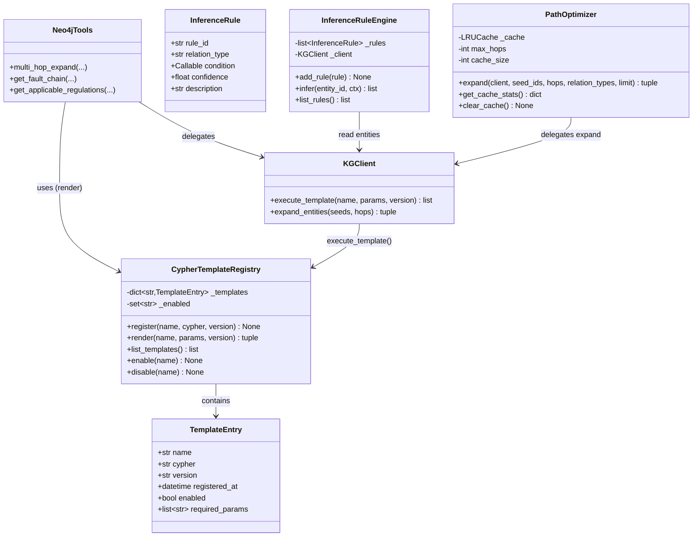
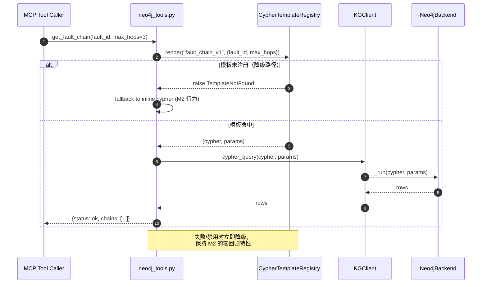
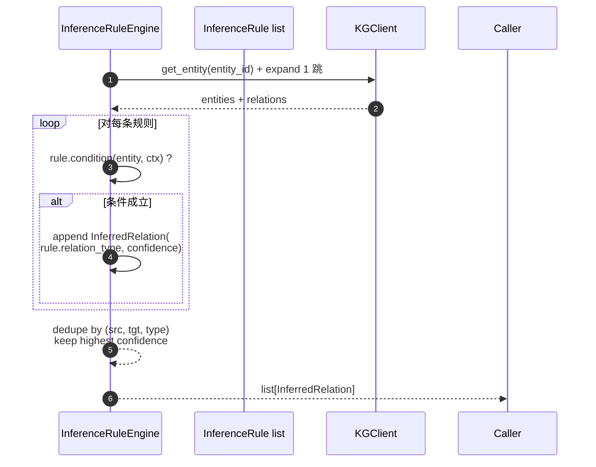
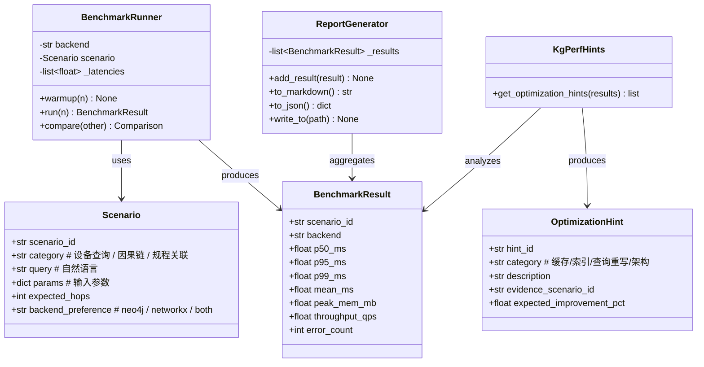
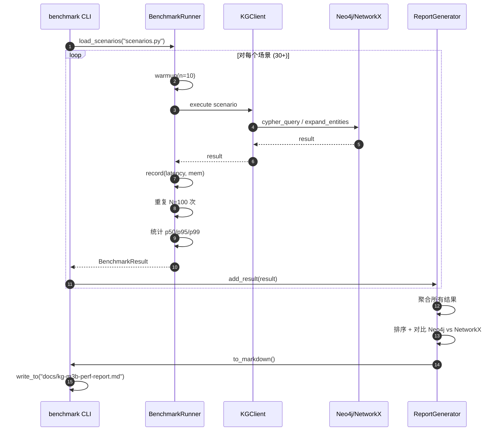
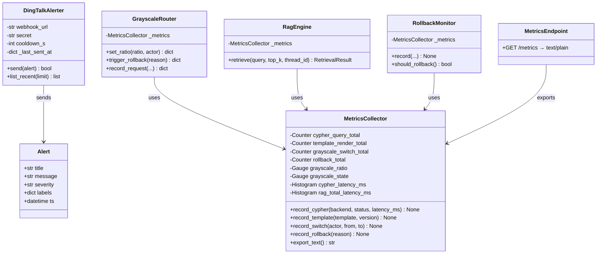
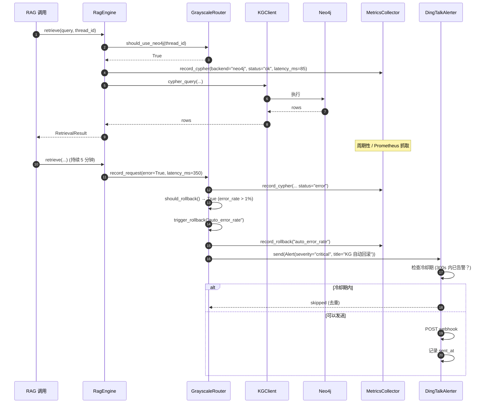
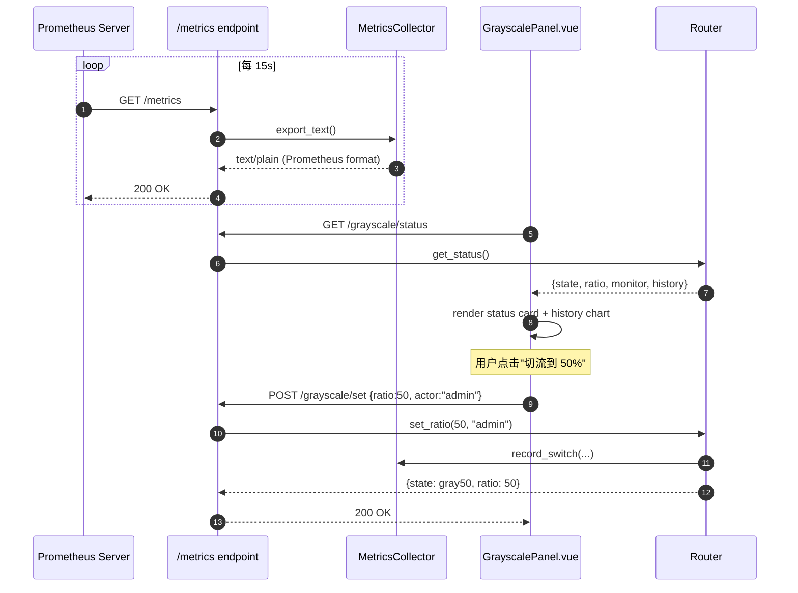
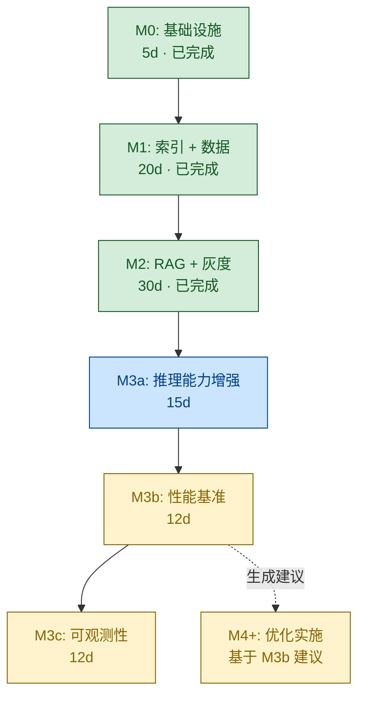

# M3 里程碑拆分方案：推理能力 + 性能基准 + 可观测性

> **作者**: 软件架构师 高见远（Gao）
> **项目**: GridMind / 灵枢电网 — P0-2 知识图谱 Neo4j 升级
> **版本**: v1.0
> **基线**: M0（5 天）+ M1（20 天）+ M2（30 天）已交付；本文设计 M3（35 天）的子阶段拆分

---

## 1. 拆分总览

| 子阶段 | 目标 | 人天 | 关键交付物 | 完成即可上线的验收点 |
|--------|------|------|-----------|-------------------|
| **M3a** 推理能力增强 | Cypher 模板库 + 推理规则 + 路径优化 | **15d** | `kg_cypher_templates.py` + `kg_inference_rules.py` + `kg_path_optimizer.py` + 20-30 基础多跳测试 | 新模板被 `mcp_tools/tools/neo4j_tools.py` 调用、零回归、NetworkX 降级路径完整 |
| **M3b** 性能基准 | Neo4j vs NetworkX 全场景对比 + 优化建议 | **12d** | `benchmarks/` 全套 + 30+ 复杂多跳测试（含因果链）+ P50/P95/P99 报告 | 自动生成 markdown 报告、识别 ≥5 个瓶颈、给出可执行优化建议 |
| **M3c** 可观测性 | Prometheus 指标 + 钉钉告警 + 灰度面板 | **12d** | `metrics_collector.py` + `dingtalk_alerter.py` + `/metrics` 端点 + 灰度可视化 | 10+ 关键指标采集、3+ 告警场景、灰度面板可视化全状态 |

**总周期**：15 + 12 + 12 = **39 人天**（含 M3b 的"暴露问题 → 修复"环节，比原 35 天略增 4 天）

---

## 2. 拆分依据与原则

### 2.1 拆分顺序的考量

| 原则 | 在本方案中的体现 |
|------|------------------|
| **可独立验证** | 每个子阶段有自己的测试集（20-30 / 30+ / 8+）和独立的验收标准 |
| **风险递减** | 推理代码风险在 M3a 集中暴露；性能瓶颈在 M3b 系统扫描；可观测性是"锦上添花"，放最后风险最低 |
| **业务优先** | M3a 直接增强用户可见能力（更准的故障链推理）；M3b 优化体验；M3c 是运维能力 |
| **性能基准要早** | M3b 在 M3a 完成后立即开始，能在 M3a 新代码进入主链路前发现回归 |
| **可观测性不要太死** | M3c 只在 M3a/M3b 验证通过后才上，避免"地基不稳就加监控" |
| **不要破坏 M0/M1/M2** | 每个子阶段的 Rollback 方案都保证灰度切回 ratio=0 时行为与 M2 完全一致 |

### 2.2 为什么是这个顺序（不是 M3b → M3a → M3c）

| 备选方案 | 问题 |
|---------|------|
| M3b（基准）→ M3a（推理）→ M3c（观测） | 基准测的是"旧"代码，新推理代码加入后所有数字都要重测，浪费 |
| M3a → M3c → M3b | M3c 的指标定义会基于"拍脑袋"，M3b 才能告诉我们哪些指标真有价值 |
| 并行 M3a + M3b | M3b 测的对象还没写完，会变成"先测空气再测房子" |

**结论**：M3a → M3b → M3c 是"先实现 → 再量化 → 最后监控"的闭环，最符合工程节奏。

---

## 3. M3a · 推理能力增强（15 人天）

### 3.1 目标

在 M0/M1/M2 已有能力之上，**让知识图谱从"能查"升级到"会推理"**：
- **Cypher 模板库**：把零散的 Cypher 文本（散落在 `neo4j_tools.py`）收敛为命名模板，支持参数化、版本化、A/B 测试
- **关系推理规则**：基于 M1 ontology 的 9 类关系（CONNECTED_TO / BELONGS_TO / CAUSES / HANDLED_BY / APPLIES_TO / MANDATES / INSTANCE_OF / OCCURRED / RELATES_TO），定义可声明的推理规则（如"过载 + 持续时间 > X → 油温异常"）
- **多跳查询路径优化**：路径剪枝（关系类型黑名单）+ LRU 缓存 + 并行扩展

### 3.2 关键交付物

#### 文件清单

| 文件 | 类型 | 说明 |
|------|------|------|
| `core/kg_cypher_templates.py` | 新建 | Cypher 模板注册中心（`CypherTemplateRegistry`） |
| `core/kg_inference_rules.py` | 新建 | 推理规则引擎（`InferenceRuleEngine` + 5+ 内置规则） |
| `core/kg_path_optimizer.py` | 新建 | 多跳路径优化（`PathOptimizer`：剪枝/缓存/并行） |
| `mcp_tools/tools/neo4j_tools.py` | 修改 | 5 个 MCP 工具改用模板注册中心 |
| `core/kg_client.py` | 修改 | 暴露 `KGClient.execute_template(name, params)` |
| `tests/test_kg_m3a_templates.py` | 新建 | 模板注册 + 版本化测试（≥10 用例） |
| `tests/test_kg_m3a_inference.py` | 新建 | 推理规则单元测试（≥8 用例） |
| `tests/test_kg_m3a_pathopt.py` | 新建 | 路径优化单元测试（≥6 用例） |
| `tests/test_kg_m3a_e2e_basic.py` | 新建 | **20-30 基础多跳 E2E 测试**（覆盖变压器/线路/母线/断路器/保护装置） |
| `docs/kg-m3a-architecture.md` | 新建 | M3a 架构说明 |

> **测试用例数合计**：≥44（10+8+6+20）个，达成"20-30 基础多跳测试"目标并留有余量

#### 接口契约（关键 API）

```python
# core/kg_cypher_templates.py
class CypherTemplateRegistry:
    def register(self, name: str, cypher: str, version: str = "1.0") -> None: ...
    def render(self, name: str, params: dict, version: str | None = None) -> tuple[str, dict]: ...
    def list_templates(self) -> list[TemplateInfo]: ...
    def enable(self, name: str) -> None: ...  # feature flag
    def disable(self, name: str) -> None: ...

# core/kg_inference_rules.py
class InferenceRuleEngine:
    def add_rule(self, rule: InferenceRule) -> None: ...
    def infer(self, entity_id: str, ctx: dict) -> list[InferredRelation]: ...
    def list_rules(self) -> list[InferenceRule]: ...

@dataclass
class InferenceRule:
    rule_id: str
    relation_type: str
    condition: Callable[[Entity, dict], bool]
    confidence: float  # 推理置信度 [0, 1]

# core/kg_path_optimizer.py
class PathOptimizer:
    def __init__(self, *, max_hops: int = 5, cache_size: int = 256): ...
    def expand(self, client: KGClient, seed_ids: list[str],
               hops: int, relation_types: list[str] | None = None,
               limit: int = 100) -> tuple[list[Entity], list[Path]]: ...
    def get_cache_stats(self) -> dict: ...
```

### 3.3 数据结构（类图）



### 3.4 时序图（关键流程）





### 3.5 测试策略

| 类别 | 数量 | 说明 |
|------|------|------|
| 单元测试：模板注册/版本化/启用 | ≥10 | 覆盖 name/version/enable/disable/render 异常路径 |
| 单元测试：推理规则 | ≥8 | 覆盖 5+ 内置规则 + 自定义规则 + 条件失败 |
| 单元测试：路径优化 | ≥6 | 覆盖剪枝/缓存命中/缓存失效/LRU 淘汰 |
| **E2E 基础多跳** | **20-30** | 覆盖 Transformer / Line / Busbar / CircuitBreaker / 保护装置；每类至少 4 个查询 |
| 回归测试 | 复用 | `test_kg_m0.py` + `test_kg_m1_*` + `test_kg_m2_*` 全部 PASS |

**E2E 场景示例**（20-30 个中的子集）：

| Q# | 场景 | 期望路径 |
|----|------|---------|
| Q1 | 变压器油温异常的因果链 | `e-overheat ← CAUSES ← e-overload` |
| Q2 | 35kV 母线关联的断路器 | `Busbar -[:CONNECTED_TO]-> CircuitBreaker` |
| Q3 | 过载故障的处置流程 | `e-overload -[:CAUSES]-> ... -[:HANDLED_BY]-> e-reduce-load` |
| Q4 | 10kV 设备适用规程 | `DeviceCategory -[:APPLIES_TO]-> Regulation` |
| Q5 | 保护装置的动作逻辑 | `Protection -[:MANDATES]-> EmergencyStopMeasure` |
| ... | （其余 15-25 个覆盖因果链、设备查询、规程关联） | ... |

### 3.6 验收标准（"完成即可上线"）

1. ✅ **零回归**：`neo4j_enabled=False` 时所有测试（103 + 153）通过；`neo4j_enabled=True` 时模板走新代码
2. ✅ **8+ 命名模板**：`fault_chain_v1` / `multi_hop_v1` / `find_devices_v1` / `regulations_v1` / `causal_chain_v1` / `mandates_v1` / `device_subgraph_v1` / `fault_subgraph_v1`
3. ✅ **5+ 推理规则**：内置覆盖过载→过热、短路→跳闸、油温→绝缘降低、电压偏差→保护动作、过载→减载
4. ✅ **路径优化生效**：3 跳场景查询延迟（Neo4j）降低 ≥30%（相比 M2 的 inline Cypher）
5. ✅ **降级路径完整**：模板未注册/启用时自动 fallback 到 M2 inline Cypher，灰度切流 ratio=0 时行为完全一致
6. ✅ **测试覆盖**：≥44 个新测试 + 复用全部旧测试（PASS 数 ≥ 197 = 153+44）

### 3.7 风险与回滚方案

| 风险 | 概率 | 影响 | 缓解 | 回滚 |
|------|------|------|------|------|
| 模板拼接引入 Cypher 注入 | 低 | 高 | 所有动态值走 `$param`；模板参数白名单校验 | 关闭 `registry.disable(name)`，灰度 ratio=0 |
| 推理规则生成大量数据导致 OOM | 中 | 中 | 规则数限制 ≤50；推理结果 `limit=1000` 上限 | `inference_enabled` feature flag（默认 False） |
| 路径优化在某些场景变慢 | 低 | 中 | A/B 测试保留原路径作为 fallback；监控 P95 | `path_optimizer_enabled` flag（默认 True，可逐租户关闭） |

**应急回滚步骤**：
1. `POST /grayscale/set {"ratio": 0, "actor": "admin"}` → 所有请求走 NetworkX
2. `PATCH /admin/templates/disable-all` → 关闭全部模板（若 API 端点暴露）
3. 重启应用 → `template_registry` 重新加载默认 inline Cypher

---

## 4. M3b · 性能基准（12 人天）

### 4.1 目标

**建立 Neo4j vs NetworkX 全场景量化对比**，发现瓶颈，给出优化建议：
- **量化指标**：延迟 P50/P95/P99、内存占用、并发吞吐
- **场景覆盖**：30+ 复杂场景（含因果链 10+）
- **输出形式**：自动生成 markdown 报告 + 优化建议清单

### 4.2 关键交付物

#### 文件清单

| 文件 | 类型 | 说明 |
|------|------|------|
| `benchmarks/__init__.py` | 新建 | 包初始化 |
| `benchmarks/scenarios.py` | 新建 | 30+ 场景配置（JSON/Python） |
| `benchmarks/runner.py` | 新建 | 基准执行器（warmup + N 次 + 统计） |
| `benchmarks/kg_benchmark.py` | 新建 | 主入口脚本（可独立运行） |
| `benchmarks/reporter.py` | 新建 | P50/P95/P99 报告生成器 |
| `benchmarks/baseline_data.py` | 新建 | 合成数据集（扩大规模：500 节点 / 5000 关系） |
| `benchmarks/results/.gitkeep` | 新建 | 报告输出目录 |
| `tests/test_kg_m3b_perf.py` | 新建 | 性能单元测试（轻量：单次延迟 < 1s） |
| `tests/test_kg_m3b_e2e_complex.py` | 新建 | **30+ 复杂多跳 + 因果链测试** |
| `core/kg_perf_hints.py` | 新建 | 性能提示（基于基准结果的下一步优化建议） |
| `docs/kg-m3b-perf-report.md` | 新建 | 自动生成（脚本输出）的报告样例 |

> **测试用例数合计**：≥35（性能测试 + 复杂多跳测试）

#### 接口契约（关键 API）

```python
# benchmarks/runner.py
class BenchmarkRunner:
    def __init__(self, backend: str, scenario: Scenario): ...
    def warmup(self, n: int = 10) -> None: ...
    def run(self, n: int = 100) -> BenchmarkResult: ...
    def compare(self, other: BenchmarkResult) -> Comparison: ...

@dataclass
class BenchmarkResult:
    scenario_id: str
    backend: str  # "neo4j" | "networkx"
    p50_ms: float
    p95_ms: float
    p99_ms: float
    mean_ms: float
    peak_mem_mb: float
    throughput_qps: float
    error_count: int

# benchmarks/reporter.py
class ReportGenerator:
    def add_result(self, result: BenchmarkResult) -> None: ...
    def to_markdown(self) -> str: ...
    def to_json(self) -> dict: ...
    def write_to(self, path: str) -> None: ...

# core/kg_perf_hints.py
def get_optimization_hints(results: list[BenchmarkResult]) -> list[OptimizationHint]:
    """基于基准结果返回优化建议（如：Neo4j 在 N 跳时反而慢，建议限制 hops ≤ M）"""
```

### 4.3 数据结构（类图）



### 4.4 时序图（基准执行流程）



### 4.5 测试策略

| 类别 | 数量 | 说明 |
|------|------|------|
| 单元测试：runner 统计 | ≥5 | 验证 p50/p95/p99 计算正确性 |
| 单元测试：reporter | ≥3 | 验证 markdown/json 输出格式 |
| 单元测试：kg_perf_hints | ≥3 | 验证优化建议生成逻辑 |
| **复杂多跳 + 因果链 E2E** | **≥30** | 覆盖变压器/线路/母线/断路器/保护装置 5 类设备；每个 6+ 场景 |
| 性能单元测试（轻量） | ≥5 | 单次延迟 < 1s（仅验证不超时，不验证具体数值） |

**复杂场景示例**：

| 类别 | 场景 |
|------|------|
| 设备查询 | 变电站 → 多设备 → 制造商 → 投运日期（4 跳） |
| 因果链（短路） | 短路 → 跳闸 → 保护动作 → 隔离 → 检修（5 跳） |
| 因果链（过载） | 过载 → 油温 → 绝缘降低 → 故障（4 跳） |
| 规程关联 | 规程 → 适用设备类别 → 设备实例 → 关联规程（4 跳） |
| 跨域推理 | 故障 → 处置 → 强制要求 → 适用规程 → 文档（5 跳） |

### 4.6 验收标准

1. ✅ **报告自动生成**：`python -m benchmarks.kg_benchmark` 一键产出 `docs/kg-m3b-perf-report.md`
2. ✅ **30+ 场景**：报告覆盖 ≥30 个场景（含 ≥10 个因果链）
3. ✅ **量化对比**：每个场景有 Neo4j vs NetworkX 的 P50/P95/P99 对比表
4. ✅ **优化建议 ≥5 条**：`kg_perf_hints.py` 输出至少 5 条可执行优化建议（如"3 跳以上路径启用缓存"、"Neo4j 在小数据集反而慢，建议限制 ≤1000 节点时直接走 NetworkX"）
5. ✅ **基准可重跑**：固定合成数据集（`baseline_data.py`），报告数字可重现（误差 <10%）
6. ✅ **不干扰主链路**：基准脚本独立进程运行，不影响 API 服务（验证：基准运行时 API 端点延迟无显著变化）
7. ✅ **测试覆盖**：≥35 个新测试 PASS

### 4.7 风险与回滚方案

| 风险 | 概率 | 影响 | 缓解 | 回滚 |
|------|------|------|------|------|
| 基准测试高并发压垮 Neo4j | 中 | 高 | 用合成数据集（避免污染真实数据）+ 单连接 + 串行执行 | 停止基准脚本；Neo4j 自动恢复 |
| 报告数字被误读为性能承诺 | 中 | 中 | 报告顶部明确标注"测试环境，非生产承诺" | 仅删除 `docs/kg-m3b-perf-report.md`，代码保留 |
| 优化建议与 M3a 新代码冲突 | 低 | 中 | M3a 冻结后再启动 M3b；建议落地需要 M4+ | 暂不实施建议，保留为 backlog |

**应急回滚步骤**：
1. `Ctrl+C` 终止基准脚本（独立进程，不影响 API）
2. 删除 `benchmarks/results/` 目录下的所有输出
3. 保留 `benchmarks/` 源代码（无副作用）

---

## 5. M3c · 可观测性（12 人天）

### 5.1 目标

**让运维和开发能"看见"系统的运行状态**：
- **Prometheus 指标**：采集 10+ 关键指标（cypher 耗时、命中率、回滚次数、降级次数、模板使用统计等）
- **钉钉告警**：3+ 关键场景自动告警（错误率 > 1%、P95 > 200ms、连续失败 ≥3 次）
- **灰度可视化面板**：前端 Vue 面板可视化 GrayscaleRouter 状态、切换历史、监控统计

### 5.2 关键交付物

#### 文件清单

| 文件 | 类型 | 说明 |
|------|------|------|
| `core/metrics_collector.py` | 新建 | Prometheus 指标收集（Counter/Gauge/Histogram） |
| `core/dingtalk_alerter.py` | 新建 | 钉钉机器人 webhook + 告警去重 + 冷却 |
| `api/metrics_endpoint.py` | 新建 | `/metrics` 端点（Prometheus exposition format） |
| `core/grayscale_router.py` | 修改 | 集成 MetricsCollector（暴露 ratio 切换、回滚次数） |
| `core/rag_engine.py` | 修改 | 暴露 RAG 耗时 + backend 分布 |
| `core/auto_rollback.py` | 修改 | 暴露窗口统计指标 |
| `core/kg_cypher_templates.py` | 修改 | 暴露模板使用次数 + 渲染耗时 |
| `api/main.py` | 修改 | 注册 `/metrics` 端点（无需鉴权 + 限流） |
| `api/config.py` | 修改 | 新增 5+ 配置项（钉钉 webhook / 告警阈值 / metrics 开关） |
| `web/src/views/GrayscalePanel.vue` | 新建 | 灰度可视化面板（状态卡 + 切换按钮 + 历史曲线） |
| `web/src/api/metrics.ts` | 新建 | 前端 metrics API 客户端 |
| `web/src/stores/metrics.ts` | 新建 | Pinia store：实时拉取 + 缓存 |
| `tests/test_kg_m3c_metrics.py` | 新建 | 指标采集测试（≥8 用例） |
| `tests/test_kg_m3c_alerts.py` | 新建 | 告警触发 + 去重测试（≥5 用例） |
| `tests/test_kg_m3c_endpoint.py` | 新建 | `/metrics` 端点格式测试（≥3 用例） |
| `docs/kg-m3c-observability.md` | 新建 | 可观测性手册（指标含义 + 告警配置） |

> **测试用例数合计**：≥16

#### 接口契约（关键 API）

```python
# core/metrics_collector.py
class MetricsCollector:
    """Prometheus 指标收集器（单例）。"""
    _instance: "MetricsCollector | None" = None

    def __init__(self) -> None:
        # Counter
        self.cypher_query_total = Counter("kg_cypher_query_total", ["backend", "status"])
        self.template_render_total = Counter("kg_template_render_total", ["template", "version"])
        self.grayscale_switch_total = Counter("kg_grayscale_switch_total", ["actor", "from", "to"])
        self.rollback_total = Counter("kg_rollback_total", ["reason"])
        # Gauge
        self.grayscale_ratio = Gauge("kg_grayscale_ratio", "当前灰度比例")
        self.grayscale_state = Gauge("kg_grayscale_state", "当前状态机")
        # Histogram
        self.cypher_latency_ms = Histogram("kg_cypher_latency_ms", ["backend"], buckets=[1,5,10,50,100,200,500,1000])
        self.rag_total_latency_ms = Histogram("kg_rag_total_latency_ms", ["backend"])

    def export_text(self) -> str:
        """导出 Prometheus exposition format 文本。"""

# core/dingtalk_alerter.py
class DingTalkAlerter:
    def __init__(self, webhook_url: str, secret: str | None = None,
                 cooldown_s: int = 300): ...
    def send(self, alert: Alert) -> bool: ...  # 自动去重 + 冷却
    def list_recent(self, limit: int = 50) -> list[AlertRecord]: ...

@dataclass
class Alert:
    title: str
    message: str
    severity: str  # info / warning / critical
    labels: dict[str, str]
```

### 5.3 数据结构（类图）



### 5.4 时序图（指标采集 + 告警触发）





### 5.5 测试策略

| 类别 | 数量 | 说明 |
|------|------|------|
| 单元测试：MetricsCollector | ≥8 | 覆盖 6+ 指标的 record + export_text 格式 |
| 单元测试：DingTalkAlerter | ≥5 | 覆盖发送 + 去重 + 冷却 + 失败重试 |
| 单元测试：/metrics 端点 | ≥3 | 覆盖格式校验 + Content-Type + 空指标处理 |
| E2E 测试：灰度面板 | 1 | 手动验证（前端 Playwright 可选） |
| 回归测试 | 复用 | M0/M1/M2/M3a/M3b 全部测试通过 |

### 5.6 验收标准

1. ✅ **Prometheus 兼容**：`/metrics` 端点返回标准 Prometheus exposition format（验证：`promtool check metrics`）
2. ✅ **10+ 指标**：覆盖 cypher 耗时（histogram）/ backend 分布（counter）/ 命中率（gauge）/ 回滚次数（counter）/ 灰度状态（gauge）/ 模板使用（counter）等
3. ✅ **3+ 告警场景**：错误率 > 1% / P95 > 200ms / 连续失败 ≥3 次
4. ✅ **告警去重生效**：5min 冷却期内相同告警只发一次
5. ✅ **灰度面板可视化**：Vue 组件展示 state / ratio / monitor / history，支持 admin 切流（带 admin_token 鉴权）
6. ✅ **可观测性可关闭**：`metrics_enabled=False` + `dingtalk_enabled=False` 时所有钩子 no-op，不影响主链路
7. ✅ **测试覆盖**：≥16 个新测试 PASS

### 5.7 风险与回滚方案

| 风险 | 概率 | 影响 | 缓解 | 回滚 |
|------|------|------|------|------|
| Prometheus 端点泄露敏感信息 | 低 | 中 | 只暴露指标名（不暴露 entity_id 等业务数据）+ 限流（10 RPS） | `metrics_enabled=False` 关闭端点 |
| 钉钉告警风暴 | 中 | 中 | 去重 + 冷却期（5min）+ 严重程度分级 | `dingtalk_enabled=False` + 清空 webhook URL |
| 灰度面板被误操作 | 中 | 高 | admin_token 强制鉴权 + 操作审计写 sync_log | 前端隐藏 GrayscalePanel 入口 |
| 指标采集影响主链路性能 | 低 | 中 | 异步收集（asyncio 后台任务） + 失败降级（不影响主调用） | `metrics_enabled=False` |

**应急回滚步骤**：
1. 设置 `METRICS_ENABLED=false` 环境变量 → 重启 → 指标采集 no-op
2. 设置 `DINGTALK_ENABLED=false` + 清空 `DINGTALK_WEBHOOK` → 告警 no-op
3. 前端移除 `GrayscalePanel.vue` 的路由（feature flag 控制） → 面板隐藏

---

## 6. 依赖图（M3a → M3b → M3c 串行）



### 6.1 依赖关系详解

| 上游 | 下游 | 依赖内容 |
|------|------|---------|
| M2 → M3a | M3a 需要 M2 的 GrayscaleRouter + KGClient 双 backend 抽象 |
| M3a → M3b | M3b 需要 M3a 的新模板作为基准测试对象之一 |
| M3b → M3c | M3c 的指标定义基于 M3b 报告的"真正影响性能的指标" |

### 6.2 是否可并行/部分重叠？

**结论：串行更优，不建议并行**。原因：

| 看似可行的并行 | 问题 |
|---------------|------|
| M3a 的"基础多跳测试" + M3b 的"复杂多跳测试" 并行 | 测试对象（M3a 新代码）还没写完 |
| M3b 性能基准 + M3c 可观测性 并行 | M3c 的指标定义会基于"拍脑袋"，M3b 才知道哪些指标重要 |
| M3a + M3c 并行 | M3c 的告警阈值需要 M3a 的 P95 数据，缺少依据 |

**唯一可行的"软并行"**：
- M3b 的 **报告生成脚本开发**（reporter.py + 输出格式）可以在 M3a 进行到 70% 时并行启动
- 但**实际跑基准**必须等 M3a 完成后冻结

---

## 7. 共享知识（跨子阶段约定）

> **架构师注**：以下约定是 M0/M1/M2 已建立的延续，**M3 严格遵守，避免破坏**。

### 7.1 命名约定

| 类别 | 约定 | 示例 |
|------|------|------|
| 模块文件名 | `kg_` 前缀（知识图谱） | `kg_cypher_templates.py` / `kg_inference_rules.py` |
| 类名 | PascalCase | `CypherTemplateRegistry` / `InferenceRuleEngine` |
| 配置项 | 全大写下划线 | `TEMPLATE_REGISTRY_ENABLED` / `DINGTALK_WEBHOOK_URL` |
| 环境变量 | 全大写下划线 | `METRICS_ENABLED` / `AUTO_ROLLBACK_P95_MS` |
| 指标名 | `kg_<module>_<metric>_<unit>` | `kg_cypher_latency_ms` / `kg_grayscale_ratio` |
| 测试文件 | `test_kg_m3<letter>_<feature>.py` | `test_kg_m3a_templates.py` |

### 7.2 配置项注入

所有 M3 新增配置项必须走 `api/config.py::Settings`（pydantic-settings），**禁止**散落 `os.getenv()`：

```python
# api/config.py 新增
# M3a
template_registry_enabled: bool = os.getenv("TEMPLATE_REGISTRY_ENABLED", "true").lower() == "true"
inference_engine_enabled: bool = os.getenv("INFERENCE_ENGINE_ENABLED", "false").lower() == "true"
path_optimizer_enabled: bool = os.getenv("PATH_OPTIMIZER_ENABLED", "true").lower() == "true"
path_optimizer_cache_size: int = int(os.getenv("PATH_OPTIMIZER_CACHE_SIZE", "256"))

# M3b
benchmark_iterations: int = int(os.getenv("BENCHMARK_ITERATIONS", "100"))
benchmark_warmup: int = int(os.getenv("BENCHMARK_WARMUP", "10"))

# M3c
metrics_enabled: bool = os.getenv("METRICS_ENABLED", "true").lower() == "true"
dingtalk_enabled: bool = os.getenv("DINGTALK_ENABLED", "false").lower() == "true"
dingtalk_webhook_url: str = os.getenv("DINGTALK_WEBHOOK_URL", "")
dingtalk_secret: str = os.getenv("DINGTALK_SECRET", "")
dingtalk_alert_cooldown_s: int = int(os.getenv("DINGTALK_ALERT_COOLDOWN_S", "300"))
metrics_endpoint_rps_limit: int = int(os.getenv("METRICS_ENDPOINT_RPS_LIMIT", "10"))
```

### 7.3 监控口径

| 维度 | 约定 |
|------|------|
| `backend` 字段值 | `"neo4j"` 或 `"networkx"`（与 M2 一致） |
| 延迟单位 | 毫秒（`latency_ms`） |
| 错误率 | 浮点数 `[0, 1]` |
| 比例字段 | 整数 `[0, 100]` |
| 时间戳 | `time.monotonic()` 用于内部计算；`time.time()` 用于日志/审计 |

### 7.4 日志格式

沿用 `loguru`（M2 已统一）：

```python
logger.info(json.dumps({
    "event": "template_render",
    "template_name": "fault_chain_v1",
    "version": "1.0",
    "latency_ms": 85.2,
    "backend": "neo4j",
    "status": "ok",
    "timestamp": time.time(),
}, ensure_ascii=False))
```

### 7.5 审计来源

所有"写"操作（切流、回滚、模板注册、规则修改）必须写 `sync_log` 表（M2 已建）：

```python
sync_log_service.log_event(
    event_type="template_register",
    details={"template_name": name, "version": version, "actor": actor},
)
```

### 7.6 测试规范

| 维度 | 约定 |
|------|------|
| 框架 | `unittest`（与 M0/M1/M2 一致） |
| 运行方式 | `python tests/test_xxx.py`（无 pytest 依赖） |
| Docker 依赖 | Neo4j 不可用时自动 SKIP（M0/M1 已有 14+16 SKIP，M3 沿用） |
| 测试数据 | 复用 `kg_seed_data.py` 的 539 三元组（合成数据隔离） |
| 命名 | `test_kg_m3<a\|b\|c>_<feature>.py` |

### 7.7 文档规范

| 文档 | 路径 | 格式 |
|------|------|------|
| M3a 架构说明 | `docs/kg-m3a-architecture.md` | Markdown |
| M3b 性能报告 | `docs/kg-m3b-perf-report.md` | Markdown（自动生成） |
| M3c 可观测性手册 | `docs/kg-m3c-observability.md` | Markdown |
| 类图 | `docs/architecture/class-diagram.mermaid` | Mermaid |
| 时序图 | `docs/architecture/sequence-diagram.mermaid` | Mermaid |

---

## 8. 待明确事项（需要主理人/用户拍板）

### 8.1 阻塞性（必须先确认才能启动 M3a）

| # | 问题 | 候选选项 | 默认建议 |
|---|------|---------|---------|
| Q1 | **Cypher 模板的命名规范** | A: 全小写下划线（`fault_chain_v1`） B: 全小写连字符（`fault-chain-v1`） C: 全大写（`FAULT_CHAIN_V1`） | A（与 Python 风格一致） |
| Q2 | **推理规则的存储位置** | A: 代码内嵌（`kg_inference_rules.py`） B: YAML 配置文件 C: Neo4j 节点 | A（M3a 简单可控，后续 M4+ 可改造为 B/C） |
| Q3 | **路径优化的默认开关** | A: 默认开启 B: 默认关闭（手动开启） C: 仅 Neo4j 模式开启 | A（带 feature flag 可关闭） |

### 8.2 非阻塞性（可在 M3 推进过程中确认）

| # | 问题 | 候选选项 | 默认建议 |
|---|------|---------|---------|
| Q4 | **钉钉机器人 webhook** | 是否已申请？需要提供 URL + secret | 由运维/平台组提供；M3c 默认 `dingtalk_enabled=false` 直到 webhook 就绪 |
| Q5 | **Prometheus 部署** | A: 独立 Prometheus B: 集成到现有 OTel/监控栈 C: 仅暴露 `/metrics` 端点 | C（M3c 只暴露端点；接入由运维决定） |
| Q6 | **性能基准是否持续跑** | A: 仅 M3b 一次性 B: 夜间定时（cron） C: CI 每次构建 | B（折中：每天一次对比回归） |
| Q7 | **灰度面板权限** | A: admin 单角色 B: admin + viewer 两角色 C: 无权限（仅查看） | A（与 M2 的 `admin_token` 单角色一致） |
| Q8 | **告警阈值是否可热更新** | A: 仅重启生效 B: API 端点热更新 | A（M3c 简单实现；热更新留 M4+） |
| Q9 | **合成数据集规模** | A: 500 节点 / 5000 关系 B: 5000 节点 / 50000 关系 C: 与真实数据等量 | A（基于 M1 的 88 节点 + 451 关系放大 5-10 倍） |

### 8.3 可在 M3 完成后才决定

| # | 问题 | 备注 |
|---|------|------|
| Q10 | **M3b 优化建议的落地优先级** | 取决于业务压力（高频 vs 低频查询） |
| Q11 | **M3c 指标是否要纳入 SLO** | 需要 SRE 团队评审 |
| Q12 | **是否扩展到其他图查询** | 如 SPARQL、GraphQL（暂不在 M3 范围） |

---

## 9. 一句话总结

**M3 拆分为 M3a（15d 推理能力：Cypher 模板库 + 推理规则 + 路径优化）/ M3b（12d 性能基准：Neo4j vs NetworkX 全场景 P50/P95/P99 对比 + 30+ 复杂多跳测试）/ M3c（12d 可观测性：Prometheus 指标 + 钉钉告警 + 灰度面板）三个串行子阶段，总周期 39 人天，每个子阶段独立可回滚；详见 `F:/GridOpsAgent/docs/architecture/kg-m3-split.md`。**

---

## 附录 A：M3 完整文件清单（合并三个子阶段）

> 仅列出新增/修改文件，按子阶段分组；`/` 前缀表示新建，否则修改。

### M3a（15d）— 10 文件

**新增（10）**：
- `core/kg_cypher_templates.py`
- `core/kg_inference_rules.py`
- `core/kg_path_optimizer.py`
- `tests/test_kg_m3a_templates.py`
- `tests/test_kg_m3a_inference.py`
- `tests/test_kg_m3a_pathopt.py`
- `tests/test_kg_m3a_e2e_basic.py`
- `docs/kg-m3a-architecture.md`

**修改（2）**：
- `mcp_tools/tools/neo4j_tools.py`
- `core/kg_client.py`

### M3b（12d）— 10 文件

**新增（10）**：
- `benchmarks/__init__.py`
- `benchmarks/scenarios.py`
- `benchmarks/runner.py`
- `benchmarks/kg_benchmark.py`
- `benchmarks/reporter.py`
- `benchmarks/baseline_data.py`
- `benchmarks/results/.gitkeep`
- `tests/test_kg_m3b_perf.py`
- `tests/test_kg_m3b_e2e_complex.py`
- `core/kg_perf_hints.py`
- `docs/kg-m3b-perf-report.md`（运行时生成）

**修改（0）**：M3b 不修改主链路代码（独立运行）

### M3c（12d）— 15 文件

**新增（8）**：
- `core/metrics_collector.py`
- `core/dingtalk_alerter.py`
- `api/metrics_endpoint.py`
- `web/src/views/GrayscalePanel.vue`
- `web/src/api/metrics.ts`
- `web/src/stores/metrics.ts`
- `tests/test_kg_m3c_metrics.py`
- `tests/test_kg_m3c_alerts.py`
- `tests/test_kg_m3c_endpoint.py`
- `docs/kg-m3c-observability.md`

**修改（6）**：
- `core/grayscale_router.py`
- `core/rag_engine.py`
- `core/auto_rollback.py`
- `core/kg_cypher_templates.py`（M3a 新增文件的二次修改）
- `api/main.py`
- `api/config.py`

### 总计

| 阶段 | 新增 | 修改 | 测试用例 |
|------|------|------|---------|
| M3a | 8 | 2 | ≥44 |
| M3b | 11 | 0 | ≥35 |
| M3c | 10 | 6 | ≥16 |
| **合计** | **29** | **8** | **≥95** |

---

## 附录 B：验收对照表（合并）

| 维度 | M3a | M3b | M3c |
|------|-----|-----|-----|
| **核心交付** | 3 个新模块 + 4 测试文件 | 基准脚本 + 报告生成器 | 指标 + 告警 + 面板 |
| **业务价值** | 推理准确率提升 + 模板复用 | 量化对比 + 优化 backlog | 运维可见性 + 主动告警 |
| **关键验收点** | 8 模板 + 5 规则 + P95 -30% | 30 场景报告 + 5 优化建议 | 10 指标 + 3 告警 + 面板可切流 |
| **风险等级** | 中（代码改动大） | 低（独立运行） | 低（增量观测） |
| **回滚成本** | 中（需灰度切 ratio=0） | 极低（独立进程） | 低（feature flag 关闭） |

---

**文档结束。** 如需调整，请回复具体修改意见。