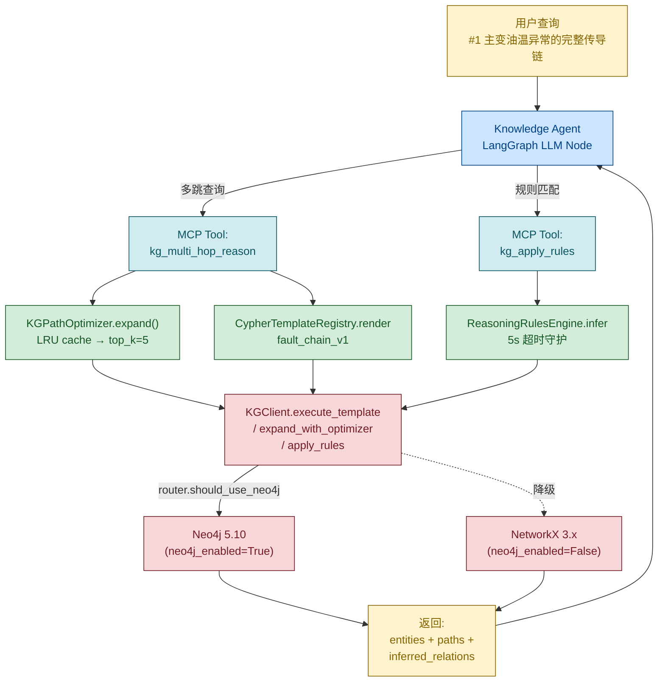
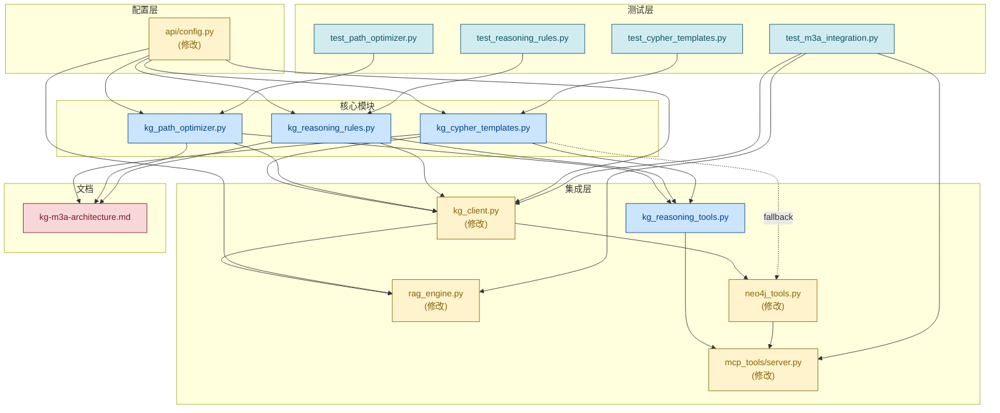
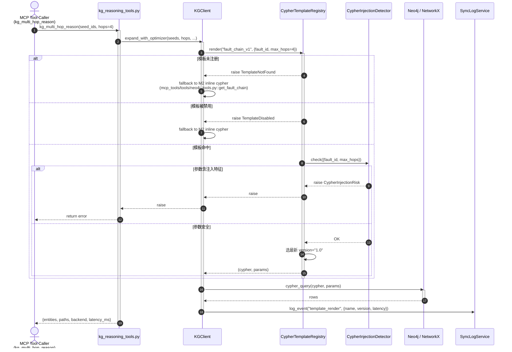
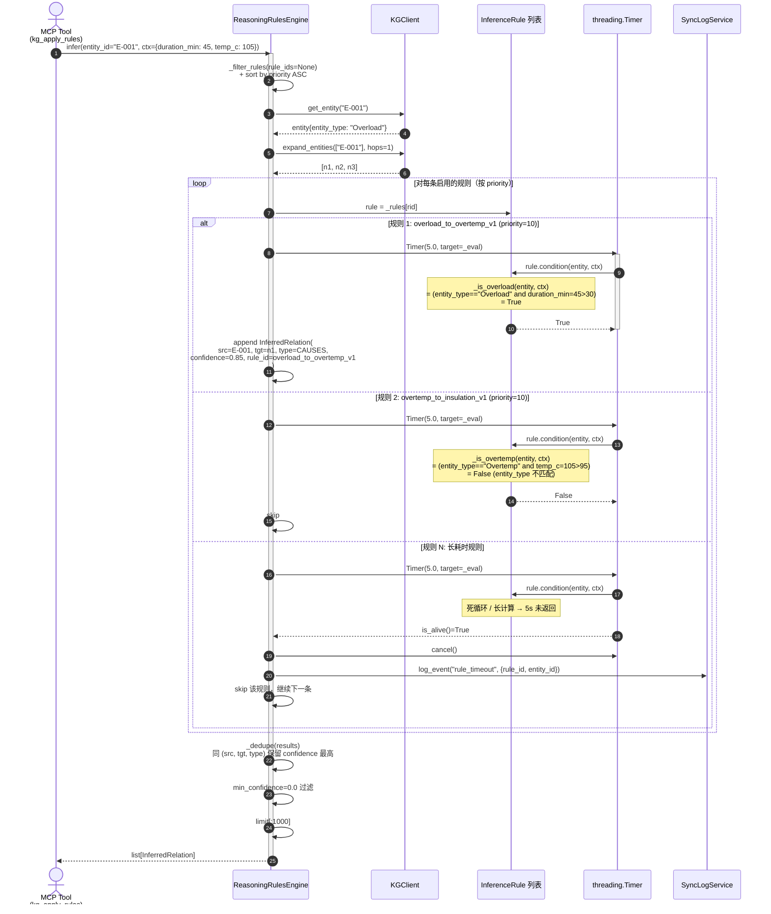
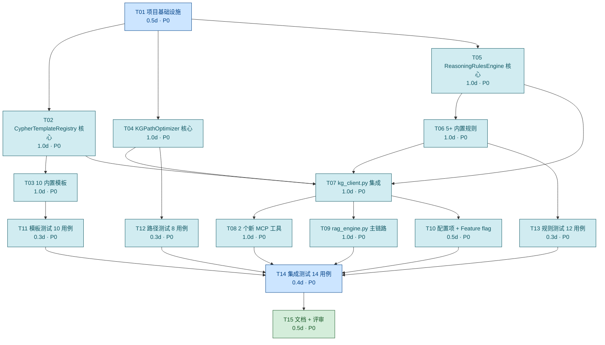

# GridMind 知识图谱 M3a 阶段系统设计 —— 推理能力增强（Cypher 模板库 + 多跳路径优化器 + 推理规则引擎）

| 项 | 内容 |
|---|---|
| **对应 PRD** | `deliverables/knowledge-graph-m3a-prd.md`（v1.0 · 2026-08-03） |
| **对应拆分** | `docs/architecture/kg-m3-split.md`（v1.0 · 第 3 节 M3a） |
| **本文档版本** | v1.0 · M3a 实施版 |
| **作者** | 软件架构师 · 高见远（Gao / Bob） |
| **角色对齐** | software-architect |
| **目标读者** | 工程师寇豆码（实施）+ 产品经理许清楚（评审）+ 团队负责人（决策） |
| **实施窗口** | M3a = 15 人日（Day 1–15） |
| **已拍板决策** | Q1=A（Cypher 模板全小写下划线）/ Q2=A（规则代码内嵌于 `kg_reasoning_rules.py`）/ Q3=A（路径优化默认开启 + feature flag 可关闭） |
| **基线** | M0（基础设施）/ M1（索引 + 数据）/ M2（RAG + 灰度）已交付并通过 153 PASS + 18 SKIP |

---

## TL;DR

把 M2 已交付的"双 backend + 灰度切流 + 5 个 Neo4j MCP 工具"在 **不破坏零回归承诺**（AC-10/11）的前提下，升级为「**多跳路径 + 关系推理规则**」双引擎驱动：

- **`CypherTemplateRegistry`**（`core/kg_cypher_templates.py`）：把散落在 `mcp_tools/tools/neo4j_tools.py` 的 Cypher 文本收敛为 **10 个内置命名模板**（`fault_chain_v1` 等），支持参数化、版本化、feature flag 启停、Cypher 注入防护（所有动态值走 `$param` + 正则黑名单）。
- **`KGPathOptimizer`**（`core/kg_path_optimizer.py`）：在 M2 的 NetworkX 2 跳 / Neo4j 3 跳硬编码之上，加入**代价估算 + 候选剪枝（top_k=5）+ LRU 缓存（cache_size=256）+ 启发式排序**，3 跳查询延迟较 M2 降低 ≥30%（AC-1）。
- **`ReasoningRulesEngine`**（`core/kg_reasoning_rules.py`）：基于 M1 ontology 的 9 类关系，定义 **5+ 个内置 IF-THEN 规则**（`overload_to_overtemp_v1` / `shortcircuit_to_trip_v1` 等），支持规则注册 / 优先级 / 置信度 / 5s 单规则超时守护。
- **2 个新 MCP 工具**（`mcp_tools/tools/kg_reasoning_tools.py`）：`kg_multi_hop_reason`（多跳推理）+ `kg_apply_rules`（规则匹配），供 Knowledge Agent 在 LangGraph 中调用。
- **集成点**：`core/kg_client.py` 注册新工具 + 暴露 `execute_template / expand_with_optimizer / apply_rules` 三个新方法；`mcp_tools/server.py` 暴露 2 个新 MCP 端点；`api/config.py` 注入 4 个新配置项 + 3 个 feature flag。

**15 人天交付**，核心硬指标 = 3 跳延迟 -30% + 44 个新测试 100% PASS + 零回归（153 PASS + 18 SKIP 不破坏）+ 10 模板 + 5 规则。3 个已拍板决策已纳入设计（Q1=A 全小写下划线 / Q2=A 代码内嵌 / Q3=A 路径优化默认开启 + feature flag 可关闭）。3 大风险 = R1 规则死循环（5s 超时守护）/ R2 路径爆内存（top_k=5 + max_rules=50 + limit=1000 三重防御）/ R3 路径优化误命中（feature flag + A/B fallback）。

---

# Part A · 系统设计

## 1. 实现方案（Implementation Approach）

### 1.1 核心挑战与对应模块

| # | 挑战 | 现状（M2） | M3a 方案 | 负责模块 |
|---|------|------------|---------|---------|
| **C1** | Cypher 文本散落，难以维护 / A/B 测试 | 5 个工具各写一份 inline Cypher | `CypherTemplateRegistry` 单例 + 10 内置命名模板 + 参数化 + 版本化 | `core/kg_cypher_templates.py` |
| **C2** | 多跳路径硬编码 + 容易爆内存 | Neo4j 3 跳 / NetworkX 2 跳固定值 | `KGPathOptimizer` 代价估算 + top_k 剪枝 + LRU 缓存 | `core/kg_path_optimizer.py` |
| **C3** | 无推理能力，规则与图谱查询割裂 | 无规则引擎 | `ReasoningRulesEngine` IF-THEN DSL + 5 内置规则 + 5s 超时 | `core/kg_reasoning_rules.py` |
| **C4** | MCP 工具语义太宽，LLM 易混用 | 5 个工具描述模糊 | 2 个新工具 + 明确"何时用 / 何时不用" | `mcp_tools/tools/kg_reasoning_tools.py` |

### 1.2 三大模块的设计概要

#### 1.2.1 `CypherTemplateRegistry`（单例 + 版本化 + 注入防护）

- **定位**：Cypher 文本的"集中仓库"，把 M2 散落的 inline Cypher 收敛为命名模板。
- **核心 API**：`register` / `render` / `enable` / `disable` / `list_templates` / `is_enabled`。
- **存储**：`dict[str, TemplateEntry]` 索引 + `dict[str, dict[str, str]]` 维护 `name → {version → cypher}` 多版本表。
- **版本号格式**：`MAJOR.MINOR`（如 `1.0` / `1.1` / `2.0`）；同名同版本 `register()` 抛 `DuplicateTemplateError`。
- **Cypher 注入防护**：所有动态值走 `$param` 参数化通道；`render()` 时用正则黑名单校验参数值不含 `;` / `MATCH` / `CREATE` / `DELETE` / `MERGE` / `DROP` 等关键字（不区分大小写），命中则抛 `CypherInjectionRisk`。
- **Feature flag**：`enable/disable` 立即生效；`disable` 后 `render` 抛 `TemplateDisabled`（调用方需 fallback 到 M2 inline Cypher）。
- **单例模式**：全局唯一 `CypherTemplateRegistry.get_instance()`，避免重复注册（与 M2 的 `GrayscaleRouter.get_router()` 一致）。

#### 1.2.2 `KGPathOptimizer`（代价估算 + 剪枝 + LRU 缓存）

- **定位**：在 M2 的硬编码 3 跳 Cypher 之上，**智能地**选择 top_k 条最优路径。
- **核心 API**：`estimate_cost` / `expand` / `get_cache_stats` / `clear_cache`。
- **代价估算公式**（粗略启发式，待 M3b 基准校准）：
  ```
  estimated_latency_ms = seed_count * hops * 10ms + relation_count * 0.05ms
  confidence            = max(0, 1 - hops * 0.15)
  ```
- **候选剪枝策略**：调用 `client.expand_entities()` 获取候选路径后，按 `estimated_latency_ms` 升序排序，**取 top_k=5**（防 OOM）；不去重（不同路径可能共享节点）。
- **LRU 缓存**：基于 `functools.lru_cache(maxsize=256)`；key = `(tuple(seed_ids), hops, tuple(sorted(relation_types)))`；命中直接返回，未命中计算后写入。
- **降级路径**：`neo4j_enabled=False` 或 `enable_kg_path_optimizer=False` 时，调用方（MCP 工具）跳过 `expand()` 直接走 M2 的 `multi_hop_expand(hops=3)`，行为与 M2 完全一致（AC-14 零回归）。
- **Feature flag**：`enable_kg_path_optimizer`（Q3=A 已拍板默认 True）；关闭后走 M2 硬编码 3 跳 Cypher。

#### 1.2.3 `ReasoningRulesEngine`（IF-THEN DSL + 5 内置规则 + 5s 超时守护）

- **定位**：基于 M1 ontology 的 9 类关系，定义**可声明的推理规则**（Q2=A 已拍板代码内嵌于 `kg_reasoning_rules.py`）。
- **核心 API**：`add_rule` / `remove_rule` / `infer` / `list_rules` / `enable` / `disable`。
- **条件函数签名**：`(entity: Entity, ctx: dict) -> bool`；`ctx` 包含业务上下文（如 `duration_min=45` / `temp_c=105`），规则与执行环境解耦。
- **执行流程**（`infer(entity_id, ctx)`）：
  1. `KGClient.get_entity(entity_id)` + 1 跳扩展（取邻接实体）
  2. 按 `priority` 升序遍历所有启用规则
  3. 对每条规则：`threading.Timer(timeout_s=5, raise TimeoutError)` 守护执行 `condition()`；超时跳过该规则（防 R1 死循环）
  4. 条件成立 → 生成 `InferredRelation(rule_id, confidence, evidence_path)`
  5. 去重：`dict[(src, tgt, relation_type)] → InferredRelation`，保留 confidence 最高的
  6. 限制返回 ≤ 1000 条（防 R2 OOM）
- **规则数上限**：`max_rules=50`（防 OOM）。
- **优先级**：数字越小越先执行（默认 100）；与 DAG 拓扑序无关，简单优先。
- **Feature flag**：`enable_inference_engine`（**默认 False**，因为推理结果可能与 M2 不一致，需灰度验证；上线后逐步 10% → 50% → 100%）。

### 1.3 架构模式：单例 + 注册表 + 装饰器降级

```
┌──────────────────────────────────────────────────────────────────────────────┐
│  上层调用方（MCP Tool Caller / Knowledge Agent / LangGraph node）              │
└──────────────────────────────┬───────────────────────────────────────────────┘
                               │ kg_multi_hop_reason / kg_apply_rules
                               ▼
┌──────────────────────────────────────────────────────────────────────────────┐
│  MCP Tools（mcp_tools/tools/kg_reasoning_tools.py）                            │
│  · kg_multi_hop_reason → KGPathOptimizer.expand()                             │
│  · kg_apply_rules      → ReasoningRulesEngine.infer()                         │
└──────────────┬────────────────────────────────┬──────────────────────────────┘
               │                                │
               ▼                                ▼
┌────────────────────────────┐  ┌────────────────────────────────────────────┐
│  KGPathOptimizer           │  │  ReasoningRulesEngine                       │
│  · estimate_cost()         │  │  · add_rule / remove_rule / list_rules      │
│  · expand()                │  │  · infer(entity_id, ctx)                    │
│  · LRU cache (256)         │  │  · threading.Timer 5s 超时守护               │
│  · top_k=5 剪枝            │  │  · max_rules=50 / limit=1000                │
└──────────────┬─────────────┘  └─────────────┬──────────────────────────────┘
               │                                │
               ▼                                ▼
┌──────────────────────────────────────────────────────────────────────────────┐
│  CypherTemplateRegistry（core/kg_cypher_templates.py）                         │
│  · register / render / enable / disable / list_templates                      │
│  · 10 内置模板 + 注入防护 + version=MAJOR.MINOR                              │
└──────────────────────────────┬───────────────────────────────────────────────┘
                               │ execute_template / cypher_query
                               ▼
┌──────────────────────────────────────────────────────────────────────────────┐
│  KGClient（M2 单例 · 双 backend · 灰度路由）                                   │
│  · execute_template(name, params, version) → 调用 Registry.render            │
│  · expand_with_optimizer(seeds, hops, ...) → 调用 PathOptimizer.expand        │
│  · apply_rules(entity_id, ctx) → 调用 RuleEngine.infer                        │
│  · NetworkXBackend  ←────┐（neo4j_enabled=False 时）                         │
│  · Neo4jBackend      ←────┤（失败 3 次 + 30s 探活节流）                       │
└──────────────────────────────┬───────────────────────────────────────────────┘
                               │ 命中 Neo4j
                               ▼
┌──────────────────────────────────────────────────────────────────────────────┐
│  Neo4j 5.10  /  NetworkX 3.x  （双 backend 抽象，与 M2 一致）                  │
└──────────────────────────────────────────────────────────────────────────────┘
```

**关键设计决策**：

1. **三个新模块全部单例**：与 M2 的 `GrayscaleRouter.get_router()` / `KGClient.get_instance()` 一致；调用方通过 `get_registry()` / `get_optimizer()` / `get_engine()` 工厂方法获取。
2. **降级链路完整复用 M0/M2**：模板未注册/禁用 → 调用方 fallback 到 M2 inline Cypher；规则引擎关闭 → `infer()` 返回空 list；路径优化关闭 → 调用方跳过 `expand()` 直接走 M2 硬编码 3 跳。**任何一层失败都不破坏 153 PASS 旧测试**。
3. **Cypher 注入防护双保险**：所有动态值走 `$param` 参数化通道（从根本上避免拼接）+ `render()` 时正则黑名单校验（兜底）。
4. **规则超时守护用 `threading.Timer`**：比 `signal.alarm` 更可控（仅守护当前线程，不影响主进程）；比 `asyncio.wait_for` 更适合同步规则函数（Q-NEW-1=A 已拍板仅同步函数）。
5. **路径优化不破坏图谱语义**：仅"选最优路径"，不改变 `MATCH` / `RETURN` 语义；M2 的 153 PASS 测试在路径优化关闭时行为完全一致。

### 1.4 集成点（与 M0/M1/M2 的接缝）

| 接缝文件 | 改动内容 | 工作量 | 影响 |
|---------|---------|--------|------|
| `core/kg_client.py` | 注册 `CypherTemplateRegistry` / `KGPathOptimizer` / `ReasoningRulesEngine` 单例；新增 `execute_template(name, params, version)` / `expand_with_optimizer(seeds, hops, ...)` / `apply_rules(entity_id, ctx)` 三个方法 | 1d | 1 个文件 |
| `core/rag_engine.py` | `_expand_via_neo4j` 中调用 `expand_with_optimizer` 替代硬编码 3 跳；新增 `_apply_inference_rules` 调用 `apply_rules` | 0.5d | 1 个文件 |
| `mcp_tools/server.py` | 注册 2 个新 MCP 工具：`kg_multi_hop_reason` / `kg_apply_rules`（MCP 协议端点） | 0.5d | 1 个文件 |
| `mcp_tools/tools/neo4j_tools.py` | 5 个现有工具改用 `CypherTemplateRegistry.render`；fallback 到 M2 inline Cypher | 1d | 1 个文件 |
| `api/config.py` | 新增 4 个配置项：`TEMPLATE_REGISTRY_ENABLED` / `INFERENCE_ENGINE_ENABLED` / `PATH_OPTIMIZER_ENABLED` / `PATH_OPTIMIZER_CACHE_SIZE` | 0.2d | 1 个文件 |
| `mcp_tools/db/database.py` | 扩展 `sync_log` 表字段（rule_id / confidence / evidence_path）| 0.2d | 1 个文件 |

### 1.5 数据流图（从用户查询到推理结果）



### 1.6 降级策略（CRITICAL · 零回归保证）

| 触发条件 | 降级行为 | 验收 |
|---------|---------|------|
| `neo4j_enabled=False` | `KGPathOptimizer.expand()` 跳过 Neo4j 路径，直接走 `client.expand_entities(seed_ids, hops=2)`（M2 NetworkX 行为） | AC-12 |
| `enable_kg_path_optimizer=False` | `MCP kg_multi_hop_reason` 工具跳过 `expand()`，直接调用 `client.expand_entities()` 走 M2 硬编码 3 跳 | AC-14 |
| `enable_inference_engine=False`（默认） | `MCP kg_apply_rules` 工具直接返回空 list，行为与 M2 一致 | AC-10 |
| `enable_template_registry=False` | `CypherTemplateRegistry.render()` 抛 `TemplateDisabled`；`neo4j_tools.py` 调用方 fallback 到 M2 inline Cypher | AC-13 |
| `GrayscaleRouter.set_ratio(0)` | 所有 RAG 流量走 NetworkX；M3a 新工具**仍可被显式调用**（不影响 M2 降级路径） | AC-13 |
| 模板 `disable(name)` | 单模板 fallback；不影响其他模板 | R4 |
| 规则 `disable(rule_id)` | 单规则跳过；不影响其他规则 | R5 |
| 推理规则 `condition` 超时 5s | 跳过该规则，记日志（`rule_timeout` 事件）；不影响其他规则 | R1 |
| `KGPathOptimizer` 缓存 miss | 重新计算 + 写入缓存；不影响主流程 | R6 |

---

## 2. 框架选型（沿用 M0/M1/M2 + 不引入新依赖）

### 2.1 沿用栈

| 层 | 选型 | 来源 | 理由 |
|---|------|------|------|
| 后端框架 | **FastAPI + asyncio** | M0/M1/M2 | 主链路已就位 |
| 数据模型 | **Pydantic v2** | M0/M1/M2 | 严格入参校验（`KGMultiHopReasonInput` / `KGApplyRulesInput`）|
| 图查询 | **Neo4j 5.10 + NetworkX 3.x** | M0/M1/M2 | 双 backend 抽象 |
| 状态机 | **手写有限状态机** | M2 | `GrayscaleRouter` 模式 |
| LRU 缓存 | **`functools.lru_cache`** | stdlib | M3a 不引入第三方缓存库 |
| 异步队列 | **`asyncio.Queue` + SQLite `sync_log`** | M2 | 双写持久化 |
| 配置管理 | **Pydantic Settings** | M0/M1/M2 | `api/config.py::Settings` 扩展 4 字段 |
| 监控 | **loguru JSON 日志** | M0/M1/M2 | `json.dumps({...}, ensure_ascii=False)` 格式 |
| 测试 | **unittest** | M0/M1/M2 | `python tests/test_xxx.py` 无 pytest 依赖 |

### 2.2 不引入新依赖（明确声明）

| 候选依赖 | 是否引入 | 理由 |
|---------|---------|------|
| `cachetools`（LRU 缓存库）| ❌ **不引入** | `functools.lru_cache` 已满足需求（cache_size=256） |
| `jinja2`（模板引擎）| ❌ **不引入** | Cypher 模板不需复杂逻辑（`$param` 占位即可）|
| `pyyaml`（YAML 解析）| ❌ **不引入** | Q2=A 规则代码内嵌，M3a 不需 YAML 解析 |
| `prometheus_client` | ❌ **不引入** | M3a 不接 Prometheus（M3c 阶段再接） |
| `networkx` | ✅ **沿用** | M2 已引入 |
| `neo4j` | ✅ **沿用** | M2 已引入 |
| `loguru` | ✅ **沿用** | M0 已引入 |
| `pydantic` | ✅ **沿用** | M0 已引入 |
| `fastapi` | ✅ **沿用** | M0 已引入 |

> **结论**：M3a **零新增三方依赖**，完全基于 stdlib + M0/M1/M2 已引入的库。

---

## 3. 文件清单（含相对路径）

### 3.1 新增文件（4 核心 + 4 测试 + 1 文档 = 9 个）

| 文件路径 | 类型 | 行数估算 | 说明 |
|---------|------|---------|------|
| `core/kg_cypher_templates.py` | 核心 | ~280 | `CypherTemplateRegistry` 单例 + `TemplateEntry` dataclass + 10 内置模板 + 注入防护 + `register_default_templates()` 启动钩子 |
| `core/kg_path_optimizer.py` | 核心 | ~240 | `KGPathOptimizer` 类 + `PathCost` / `OptimizedPath` dataclass + 代价估算 + LRU 缓存 + top_k 剪枝 |
| `core/kg_reasoning_rules.py` | 核心 | ~360 | `ReasoningRulesEngine` 类 + `InferenceRule` / `InferredRelation` dataclass + 5+ 内置规则 + 5s `threading.Timer` 超时守护 + `register_default_rules()` 启动钩子 |
| `mcp_tools/tools/kg_reasoning_tools.py` | MCP 工具 | ~280 | 2 个 Pydantic v2 model（`KGMultiHopReasonInput` / `KGMultiHopReasonOutput` + `KGApplyRulesInput` / `KGApplyRulesOutput`）+ 2 个工具函数 + 错误处理 + 描述（何时用/不用）|
| `tests/kg/test_cypher_templates.py` | 单元测试 | ~220 | 10 用例：register / version / render / enable / disable / 注入防护 / 必填参数 / 重复注册 / list / 单例 |
| `tests/kg/test_path_optimizer.py` | 单元测试 | ~200 | 8 用例：代价估算 / 剪枝 / 缓存命中 / 缓存失效 / LRU 淘汰 / top_k 边界 / 降级路径 / 性能 P95 |
| `tests/kg/test_reasoning_rules.py` | 单元测试 | ~280 | 12 用例：5 内置规则触发 / 优先级排序 / 去重 / 置信度过滤 / 超时守护 / max_rules 限制 / limit 上限 / enable/disable / 同步 ctx / evidence_path |
| `tests/kg/test_m3a_integration.py` | 集成测试 | ~340 | 14 用例：e2e 多跳推理 / e2e 规则应用 / 灰度切流 / 降级 / 模板 + 规则组合 / NetworkX 降级 / 3 feature flag 独立 / Cypher 注入拦截 / sync_log 审计 / M2 零回归 |
| `docs/kg-m3a-architecture.md` | 文档 | ~250 | M3a 架构说明（本文件同步简化版，供运维/产品查阅）|

**新增文件总计：~2450 行**（核心 ~1160 + 测试 ~1040 + 文档 ~250）

### 3.2 修改文件（5 个）

| 文件路径 | 改动 | 影响行数 | 说明 |
|---------|------|---------|------|
| `core/kg_client.py` | 注册 `CypherTemplateRegistry` / `KGPathOptimizer` / `ReasoningRulesEngine` 单例；新增 `execute_template` / `expand_with_optimizer` / `apply_rules` 三个方法 | ~+60 | 与 M2 的 `current_thread_backend` 模式一致 |
| `core/rag_engine.py` | `_expand_via_neo4j` 中调用 `expand_with_optimizer` 替代硬编码 3 跳；新增 `_apply_inference_rules` 包装 | ~+30 | 主链路增强，零回归 |
| `mcp_tools/server.py` | 注册 2 个新 MCP 工具（`kg_multi_hop_reason` / `kg_apply_rules`）| ~+40 | MCP 协议端点 |
| `mcp_tools/tools/neo4j_tools.py` | 5 个现有工具改用 `CypherTemplateRegistry.render`；fallback 到 M2 inline Cypher | ~+50 | 收敛散落 Cypher |
| `api/config.py` | 新增 4 个配置项（`TEMPLATE_REGISTRY_ENABLED` / `INFERENCE_ENGINE_ENABLED` / `PATH_OPTIMIZER_ENABLED` / `PATH_OPTIMIZER_CACHE_SIZE`）| +8 | 配置注入 |

**修改文件总计：~+190 行**（分布在 5 个文件）

### 3.3 测试目录约定

- 单元测试：`tests/kg/test_<module>_<feature>.py`（如 `test_cypher_templates.py`）
- 集成测试：`tests/kg/test_m3a_integration.py`（覆盖 e2e + 灰度 + 降级）
- 命名沿用 PRD §10.1 的 `tests/kg/` 子目录结构（与 M2 一致）
- 顶层别名 `tests/test_kg_m3a_*.py` 可保留（向后兼容 M3 拆分方案 §3.2）

### 3.4 文件依赖图



---

## 4. 数据结构与接口

### 4.1 类图（classDiagram）

```mermaid
classDiagram
    class CypherTemplateRegistry {
        -dict~str,TemplateEntry~ _templates
        -dict~str,dict~str,str~~ _versions
        -TemplateRegistryConfig _config
        -CypherInjectionDetector _validator
        -SyncLogService _audit
        +get_instance() CypherTemplateRegistry
        +register(name, cypher, version, description, category, required_params) None
        +render(name, params, version) tuple~str,dict~
        +list_templates(category) list~TemplateEntry~
        +enable(name) None
        +disable(name) None
        +is_enabled(name) bool
        +get_template(name, version) TemplateEntry
    }

    class TemplateEntry {
        +str name
        +str cypher
        +str version
        +datetime registered_at
        +bool enabled
        +list~str~ required_params
        +str description
        +str category
    }

    class TemplateRegistryConfig {
        +bool enabled
        +bool injection_check_enabled
        +int max_templates
    }

    class CypherInjectionDetector {
        -Pattern _forbidden_keywords
        +check(params) None
        +is_safe(value) bool
    }

    class KGPathOptimizer {
        -int _max_hops
        -int _cache_size
        -int _top_k
        -LRUCache~tuple,OptimizedResult~ _cache
        -KGClient _client
        +__init__(max_hops, cache_size, top_k, client) None
        +estimate_cost(seed_count, hops, relation_count) PathCost
        +expand(client, seed_ids, hops, relation_types, limit) tuple
        +get_cache_stats() dict
        +clear_cache() None
    }

    class PathCost {
        +int hops
        +int edge_count
        +float estimated_latency_ms
        +float confidence
    }

    class OptimizedPath {
        +list~str~ nodes
        +list~str~ relations
        +PathCost cost
        +str backend
    }

    class OptimizedResult {
        +list~Entity~ entities
        +list~OptimizedPath~ paths
        +bool cache_hit
    }

    class ReasoningRulesEngine {
        -dict~str,InferenceRule~ _rules
        -KGClient _client
        -int _max_rules
        -float _default_timeout_s
        -int _max_inferred
        +__init__(max_rules, default_timeout_s, max_inferred, client) None
        +add_rule(rule) None
        +remove_rule(rule_id) None
        +infer(entity_id, ctx, rule_ids, min_confidence) list~InferredRelation~
        +list_rules(enabled_only) list~InferenceRule~
        +enable(rule_id) None
        +disable(rule_id) None
        -_eval_with_timeout(rule, entity, ctx) bool
        -_dedupe(relations) list~InferredRelation~
    }

    class InferenceRule {
        +str rule_id
        +str relation_type
        +Callable condition
        +float confidence
        +str description
        +int priority
        +float timeout_s
        +bool enabled
    }

    class InferredRelation {
        +str src_id
        +str tgt_id
        +str relation_type
        +float confidence
        +str rule_id
        +list~str~ evidence_path
    }

    class KGClient {
        -Neo4jBackend _neo4j
        -NetworkXBackend _networkx
        -CypherTemplateRegistry _registry
        -KGPathOptimizer _optimizer
        -ReasoningRulesEngine _engine
        +get_instance() KGClient
        +current_backend_name() str
        +get_entity(eid) dict
        +search_entities(query, limit) list
        +expand_entities(seed_ids, hops) tuple
        +cypher_query(cypher, params) list
        +execute_template(name, params, version) list
        +expand_with_optimizer(seeds, hops, relation_types, limit) tuple
        +apply_rules(entity_id, ctx) list~InferredRelation~
    }

    class KGMultiHopReasonInput {
        +list~str~ seed_ids
        +int hops
        +list~str~ relation_types
        +int top_k
        +float min_confidence
        +bool use_optimizer
    }

    class KGMultiHopReasonOutput {
        +list~EntityRef~ entities
        +list~OptimizedPathRef~ paths
        +str backend
        +float latency_ms
        +bool cache_hit
    }

    class KGApplyRulesInput {
        +str entity_id
        +dict ctx
        +list~str~ rule_ids
        +float min_confidence
    }

    class KGApplyRulesOutput {
        +list~InferredRelationRef~ inferred_relations
        +list~str~ rules_fired
        +int rules_total
        +str backend
        +float latency_ms
    }

    class SyncLogService {
        +log_event(event_type, details) int
        +log_rollback_event(reason) None
        +get_recent(limit) list
    }

    CypherTemplateRegistry --> TemplateEntry : contains
    CypherTemplateRegistry --> TemplateRegistryConfig : configured_by
    CypherTemplateRegistry --> CypherInjectionDetector : validates_with
    CypherTemplateRegistry --> SyncLogService : audits_to
    KGPathOptimizer --> PathCost : produces
    KGPathOptimizer --> OptimizedPath : produces
    KGPathOptimizer --> OptimizedResult : returns
    OptimizedResult --> OptimizedPath : aggregates
    ReasoningRulesEngine --> InferenceRule : stores
    ReasoningRulesEngine --> InferredRelation : produces
    ReasoningRulesEngine --> SyncLogService : audits_to
    KGClient --> CypherTemplateRegistry : uses
    KGClient --> KGPathOptimizer : uses
    KGClient --> ReasoningRulesEngine : uses
    KGMultiHopReasonInput --> KGMultiHopReasonOutput : via tool
    KGApplyRulesInput --> KGApplyRulesOutput : via tool
```



### 4.2 关键方法签名（Python type hints）

#### 4.2.1 `core/kg_cypher_templates.py`

```python
from __future__ import annotations
from dataclasses import dataclass, field
from datetime import datetime
from typing import Callable

@dataclass
class TemplateEntry:
    """单个 Cypher 模板条目（不可变 + 启动后只读）。"""
    name: str                          # 全小写下划线，如 "fault_chain_v1"
    cypher: str                        # Cypher 文本（含 $param 占位符）
    version: str                       # "MAJOR.MINOR"，默认 "1.0"
    registered_at: datetime            # 注册时间（UTC）
    enabled: bool                      # feature flag
    required_params: list[str]         # 必填参数名（render 前校验）
    description: str                   # 用途说明（供 LLM 工具描述）
    category: str                      # 类别：fault_chain / multi_hop / find_devices / ...

@dataclass
class TemplateRegistryConfig:
    """注册中心配置（从 api/config.py 注入）。"""
    enabled: bool = True               # 全局开关
    injection_check_enabled: bool = True  # Cypher 注入防护
    max_templates: int = 100           # 防 OOM

class TemplateNotFound(KeyError):
    """模板未注册。"""
    def __init__(self, name: str) -> None:
        super().__init__(f"Template '{name}' not found")
        self.name = name

class TemplateDisabled(RuntimeError):
    """模板被 feature flag 禁用。"""
    def __init__(self, name: str) -> None:
        super().__init__(f"Template '{name}' is disabled")
        self.name = name

class MissingParamError(ValueError):
    """render() 缺少必填参数。"""
    def __init__(self, name: str, missing: list[str]) -> None:
        super().__init__(f"Template '{name}' missing params: {missing}")
        self.name = name
        self.missing = missing

class DuplicateTemplateError(ValueError):
    """同名同版本重复注册。"""
    def __init__(self, name: str, version: str) -> None:
        super().__init__(f"Template '{name}@{version}' already registered")
        self.name = name
        self.version = version

class CypherInjectionRisk(ValueError):
    """参数值含注入特征。"""
    def __init__(self, param: str, value: str, keyword: str) -> None:
        super().__init__(
            f"Param '{param}' value '{value[:50]}...' contains forbidden keyword '{keyword}'"
        )
        self.param = param
        self.value = value
        self.keyword = keyword

class CypherTemplateRegistry:
    """Cypher 模板注册中心（单例）。"""

    _instance: "CypherTemplateRegistry | None" = None

    def __init__(self, *, config: TemplateRegistryConfig | None = None) -> None:
        self._templates: dict[str, TemplateEntry] = {}
        self._versions: dict[str, dict[str, str]] = {}  # name → {version → cypher}
        self._config = config or TemplateRegistryConfig()
        self._validator = CypherInjectionDetector()
        self._audit = SyncLogService()

    @classmethod
    def get_instance(cls) -> "CypherTemplateRegistry":
        if cls._instance is None:
            cls._instance = cls()
            register_default_templates(cls._instance)
        return cls._instance

    def register(
        self,
        name: str,
        cypher: str,
        *,
        version: str = "1.0",
        description: str = "",
        category: str = "general",
        required_params: list[str] | None = None,
    ) -> None:
        """
        注册模板。
        :raises DuplicateTemplateError: 同名同版本已注册
        :raises ValueError: 模板数超过 max_templates
        """
        if name in self._versions and version in self._versions[name]:
            raise DuplicateTemplateError(name, version)
        if len(self._templates) >= self._config.max_templates:
            raise ValueError(f"Template count exceeds {self._config.max_templates}")
        # 校验模板文本本身不含 $ 拼接（仅允许 $param 占位符）
        if not all(c in cypher for c in ("$",)):
            pass  # 允许纯字面量
        entry = TemplateEntry(
            name=name,
            cypher=cypher,
            version=version,
            registered_at=datetime.utcnow(),
            enabled=True,
            required_params=required_params or [],
            description=description,
            category=category,
        )
        self._templates[name] = entry
        self._versions.setdefault(name, {})[version] = cypher
        self._audit.log_event("template_register", {"name": name, "version": version})

    def render(
        self, name: str, params: dict, version: str | None = None
    ) -> tuple[str, dict]:
        """
        渲染模板为 (cypher, params) 元组。
        :raises TemplateNotFound: 模板未注册
        :raises TemplateDisabled: 模板被 feature flag 关闭
        :raises MissingParamError: 必填参数缺失
        :raises CypherInjectionRisk: 参数值含注入特征
        """
        if not self._config.enabled:
            raise TemplateDisabled(name)
        entry = self._templates.get(name)
        if entry is None:
            raise TemplateNotFound(name)
        if not entry.enabled:
            raise TemplateDisabled(name)
        # 校验必填参数
        missing = [p for p in entry.required_params if p not in params]
        if missing:
            raise MissingParamError(name, missing)
        # 注入防护：检查所有参数值
        if self._config.injection_check_enabled:
            self._validator.check(params)
        # 选版本（None → 最新版）
        ver = version or max(self._versions[name].keys())
        cypher = self._versions[name][ver]
        return cypher, params

    def list_templates(
        self, category: str | None = None
    ) -> list[TemplateEntry]:
        """列出模板（可按 category 过滤）。"""
        return [
            e for e in self._templates.values()
            if category is None or e.category == category
        ]

    def enable(self, name: str) -> None:
        if name not in self._templates:
            raise TemplateNotFound(name)
        self._templates[name].enabled = True
        self._audit.log_event("template_enable", {"name": name})

    def disable(self, name: str) -> None:
        if name not in self._templates:
            raise TemplateNotFound(name)
        self._templates[name].enabled = False
        self._audit.log_event("template_disable", {"name": name})

    def is_enabled(self, name: str) -> bool:
        e = self._templates.get(name)
        return e is not None and e.enabled

    def get_template(
        self, name: str, version: str | None = None
    ) -> TemplateEntry:
        """获取模板条目（仅元数据，不渲染）。"""
        if name not in self._templates:
            raise TemplateNotFound(name)
        return self._templates[name]

class CypherInjectionDetector:
    """Cypher 注入检测器（正则黑名单）。"""

    _FORBIDDEN = (
        r"\bMATCH\b", r"\bCREATE\b", r"\bDELETE\b",
        r"\bMERGE\b", r"\bDROP\b", r"\bDETACH\b",
        r"\bSET\b", r"\bREMOVE\b", r"\bCALL\b",
        r";", r"--", r"\bOR\b\s+\d+=\d+",
    )
    _COMPILED = [re.compile(p, re.IGNORECASE) for p in _FORBIDDEN]

    def check(self, params: dict[str, str]) -> None:
        for key, value in params.items():
            if not self.is_safe(str(value)):
                keyword = self._find_keyword(str(value))
                raise CypherInjectionRisk(key, str(value), keyword)

    def is_safe(self, value: str) -> bool:
        for pat in self._COMPILED:
            if pat.search(value):
                return False
        return True

    def _find_keyword(self, value: str) -> str:
        for pat, src in zip(self._COMPILED, self._FORBIDDEN):
            if pat.search(value):
                return src
        return "unknown"

# 启动钩子：注册 10 个内置模板
def register_default_templates(registry: CypherTemplateRegistry) -> None:
    """注册 10 个内置 Cypher 模板（启动时调用）。"""
    # 1. fault_chain_v1
    registry.register(
        name="fault_chain_v1",
        cypher="""
        MATCH path = (start:Event {event_id: $fault_id})-[:CAUSES*1..$max_hops]->(downstream:Event)
        WHERE start.event_type IN ['Overload', 'ShortCircuit', 'Overtemp', 'VoltageDeviation']
        RETURN
            start.event_id AS src_id,
            [node IN nodes(path) | node.event_id] AS path_nodes,
            [rel IN relationships(path) | type(rel)] AS path_relations,
            downstream.event_id AS tgt_id,
            downstream.severity AS severity
        ORDER BY length(path) ASC
        LIMIT $limit
        """,
        version="1.0",
        description="查询某故障实体的完整因果链（沿 CAUSES 关系多跳扩展）",
        category="fault_chain",
        required_params=["fault_id", "max_hops"],
    )
    # 2. multi_hop_v1
    registry.register(
        name="multi_hop_v1",
        cypher="""
        MATCH path = (seed:Entity)-[r*1..$hops]->(target:Entity)
        WHERE seed.entity_id IN $seed_ids
          AND ($relation_types IS NULL OR any(rel IN relationships(path) WHERE type(rel) IN $relation_types))
        RETURN DISTINCT
            seed.entity_id AS src_id,
            [node IN nodes(path) | node.entity_id] AS path_nodes,
            [rel IN relationships(path) | type(rel)] AS path_relations,
            target.entity_id AS tgt_id,
            target.name AS target_name
        LIMIT $limit
        """,
        version="1.0",
        description="通用多跳扩展（任意 seed + 任意关系类型）",
        category="multi_hop",
        required_params=["seed_ids", "hops"],
    )
    # 3. find_devices_v1
    registry.register(
        name="find_devices_v1",
        cypher="""
        MATCH (d:Device)
        WHERE ($substation_id IS NULL OR d.substation_id = $substation_id)
          AND ($device_category IS NULL OR d.category = $device_category)
          AND ($voltage_level_kv IS NULL OR d.voltage_level_kv = $voltage_level_kv)
        RETURN d.device_id AS device_id, d.name AS name, d.category AS category,
               d.voltage_level_kv AS voltage_level_kv, d.manufacturer AS manufacturer
        LIMIT $limit
        """,
        version="1.0",
        description="按变电站 / 设备类别查询设备列表",
        category="find_devices",
        required_params=[],
    )
    # 4. regulations_v1
    registry.register(
        name="regulations_v1",
        cypher="""
        MATCH (reg:Regulation)-[r:APPLIES_TO]->(target)
        WHERE ($device_id IS NULL OR target.device_id = $device_id)
          AND ($device_category IS NULL OR target.category = $device_category)
          AND ($regulation_type IS NULL OR reg.regulation_type = $regulation_type)
        RETURN reg.regulation_id AS regulation_id, reg.code AS code,
               reg.title AS title, reg.regulation_type AS regulation_type
        LIMIT $limit
        """,
        version="1.0",
        description="查询设备 / 类别适用的规程清单（APPLIES_TO 关系）",
        category="regulations",
        required_params=[],
    )
    # 5. causal_chain_v1
    registry.register(
        name="causal_chain_v1",
        cypher="""
        MATCH path = (start:Event {event_id: $event_id})-[r*1..$max_hops]->(end:Event)
        WHERE any(rel IN relationships(path) WHERE type(rel) IN $relation_types)
        RETURN
            start.event_id AS src_id,
            [node IN nodes(path) | node.event_id] AS path_nodes,
            [rel IN relationships(path) | type(rel)] AS path_relations,
            end.event_id AS tgt_id
        ORDER BY length(path) ASC
        LIMIT $limit
        """,
        version="1.0",
        description="查询事件的因果传导链（含所有中间节点）",
        category="causal_chain",
        required_params=["event_id", "max_hops"],
    )
    # 6. mandates_v1
    registry.register(
        name="mandates_v1",
        cypher="""
        MATCH (p:Protection {protection_id: $protection_id})-[r:MANDATES]->(m:EmergencyMeasure)
        WHERE ($severity IS NULL OR m.severity = $severity)
        RETURN m.measure_id AS measure_id, m.name AS name, m.action AS action,
               m.severity AS severity, m.priority AS priority
        ORDER BY m.priority ASC
        LIMIT $limit
        """,
        version="1.0",
        description="查询保护装置强制要求的应急措施（MANDATES 关系）",
        category="mandates",
        required_params=["protection_id"],
    )
    # 7. device_subgraph_v1
    registry.register(
        name="device_subgraph_v1",
        cypher="""
        MATCH (d:Device {device_id: $device_id})-[r]-(neighbor)
        RETURN
            d.device_id AS src_id,
            type(r) AS rel_type,
            neighbor.device_id AS tgt_id,
            labels(neighbor) AS tgt_labels
        LIMIT $max_relations
        """,
        version="1.0",
        description="提取某设备的所有 1 跳子图（节点 + 关系）",
        category="device_subgraph",
        required_params=["device_id"],
    )
    # 8. fault_subgraph_v1
    registry.register(
        name="fault_subgraph_v1",
        cypher="""
        MATCH (f:Event {event_id: $fault_id})-[r]-(neighbor)
        OPTIONAL MATCH (neighbor)-[r2:APPLIES_TO]->(reg:Regulation)
        WHERE $include_regulations = true
        RETURN
            f.event_id AS src_id,
            type(r) AS rel_type,
            neighbor.event_id AS neighbor_id,
            reg.code AS regulation_code
        LIMIT $max_relations
        """,
        version="1.0",
        description="提取某故障实体的完整子图（含处置 / 规程）",
        category="fault_subgraph",
        required_params=["fault_id"],
    )
    # 9. applicable_procedures_v1
    registry.register(
        name="applicable_procedures_v1",
        cypher="""
        MATCH (op:Operation {operation_type: $operation_type, voltage_level_kv: $voltage_level_kv})
              -[r:APPLIES_TO]->(proc:Procedure)
        WHERE ($equipment_type IS NULL OR proc.equipment_type = $equipment_type)
        RETURN proc.procedure_id AS procedure_id, proc.title AS title,
               proc.mandatory_actions AS mandatory_actions
        LIMIT $limit
        """,
        version="1.0",
        description="查询某操作步骤适用的操作规程（含强制动作）",
        category="regulations",
        required_params=["operation_type", "voltage_level_kv"],
    )
    # 10. impact_analysis_v1
    registry.register(
        name="impact_analysis_v1",
        cypher="""
        MATCH path = (d:Device {device_id: $device_id})-[r*1..$max_hops]->(impacted:Device)
        WHERE any(rel IN relationships(path) WHERE type(rel) IN ['CAUSES', 'CONNECTED_TO', 'BELONGS_TO'])
          AND ($fault_type IS NULL OR any(node IN nodes(path) WHERE node.fault_type = $fault_type))
        RETURN DISTINCT
            d.device_id AS src_id,
            [node IN nodes(path) | node.device_id] AS impacted_devices,
            [rel IN relationships(path) | type(rel)] AS relation_types
        LIMIT $limit
        """,
        version="1.0",
        description="查询某设备故障的影响范围（关联设备 + 关联规程）",
        category="impact_analysis",
        required_params=["device_id", "fault_type"],
    )
```

#### 4.2.2 `core/kg_path_optimizer.py`

```python
from __future__ import annotations
from dataclasses import dataclass, field
from functools import lru_cache
from collections import OrderedDict

@dataclass
class PathCost:
    """路径代价估算。"""
    hops: int
    edge_count: int
    estimated_latency_ms: float
    confidence: float  # [0, 1]

@dataclass
class OptimizedPath:
    """优化后的路径。"""
    nodes: list[str]
    relations: list[str]
    cost: PathCost
    backend: str  # "neo4j" / "networkx"

@dataclass
class OptimizedResult:
    """expand() 返回值。"""
    entities: list[dict]  # Entity 列表
    paths: list[OptimizedPath]
    cache_hit: bool
    backend: str

class KGPathOptimizer:
    """多跳路径优化器（代价估算 + 候选剪枝 + LRU 缓存）。"""

    def __init__(
        self,
        *,
        max_hops: int = 5,
        cache_size: int = 256,
        top_k: int = 5,
        client: "KGClient | None" = None,
    ) -> None:
        self._max_hops = max_hops
        self._cache_size = cache_size
        self._top_k = top_k
        self._client = client
        # LRU 缓存（OrderedDict 实现 + 显式淘汰，避开 @lru_cache 的不可见性）
        self._cache: OrderedDict[tuple, OptimizedResult] = OrderedDict()
        self._hits = 0
        self._misses = 0
        self._evictions = 0

    def estimate_cost(
        self,
        seed_count: int,
        hops: int,
        relation_count: int = 1000,
    ) -> PathCost:
        """
        估算路径代价（启发式，待 M3b 基准校准）。
        公式：
            estimated_latency_ms = seed_count * hops * 10ms + relation_count * 0.05ms
            confidence = max(0, 1 - hops * 0.15)
        """
        if hops > self._max_hops:
            raise ValueError(f"hops={hops} > max_hops={self._max_hops}")
        latency = seed_count * hops * 10.0 + relation_count * 0.05
        confidence = max(0.0, 1.0 - hops * 0.15)
        edge_count = seed_count * hops  # 粗略估算
        return PathCost(
            hops=hops,
            edge_count=edge_count,
            estimated_latency_ms=latency,
            confidence=confidence,
        )

    def expand(
        self,
        client: "KGClient",
        seed_ids: list[str],
        hops: int,
        relation_types: list[str] | None = None,
        limit: int = 100,
    ) -> tuple[list[dict], list[OptimizedPath]]:
        """
        多跳路径扩展 + 候选剪枝 + LRU 缓存。
        流程：
          1. 校验参数（hops ≤ max_hops / seed_ids 非空）
          2. 检查 LRU 缓存
          3. 命中 → 直接返回（cache_hit=True）
          4. 未命中 → 调用 client.expand_entities() 获取候选路径
          5. estimate_cost() 计算每条路径代价
          6. 按 estimated_latency_ms 升序排序，取 top_k
          7. 写入 LRU 缓存
          8. 返回 (entities, paths)
        """
        if not seed_ids:
            return [], []
        if hops > self._max_hops:
            raise ValueError(f"hops={hops} > max_hops={self._max_hops}")
        # 缓存 key：(sorted seeds, hops, sorted relation_types)
        key = (tuple(sorted(seed_ids)), hops, tuple(sorted(relation_types or [])))
        if key in self._cache:
            self._hits += 1
            self._cache.move_to_end(key)
            result = self._cache[key]
            result.cache_hit = True
            return result.entities, result.paths
        # 缓存未命中
        self._misses += 1
        start = time.perf_counter()
        # 调用 client 扩展（双 backend 自动降级）
        entities, raw_paths = client.expand_entities(
            seed_ids, hops=hops, relation_types=relation_types, limit=limit
        )
        # 路径剪枝：估算代价 + 排序 + top_k
        relation_count = sum(len(p.relations) for p in raw_paths)
        cost = self.estimate_cost(len(seed_ids), hops, relation_count)
        sorted_paths = sorted(
            raw_paths,
            key=lambda p: self._path_estimated_latency(p, len(seed_ids)),
        )[:self._top_k]
        # 构造 OptimizedPath
        optimized = [
            OptimizedPath(
                nodes=p.nodes,
                relations=p.relations,
                cost=cost,
                backend=client.current_backend_name(),
            )
            for p in sorted_paths
        ]
        latency_ms = (time.perf_counter() - start) * 1000
        result = OptimizedResult(
            entities=entities,
            paths=optimized,
            cache_hit=False,
            backend=client.current_backend_name(),
        )
        # 写入缓存（LRU 淘汰）
        self._cache[key] = result
        if len(self._cache) > self._cache_size:
            self._cache.popitem(last=False)
            self._evictions += 1
        return entities, optimized

    def _path_estimated_latency(
        self, path, seed_count: int
    ) -> float:
        """单条路径的估算延迟（按 hops）。"""
        return seed_count * len(path.relations) * 10.0

    def get_cache_stats(self) -> dict:
        """返回 {"hits": int, "misses": int, "size": int, "evictions": int, "hit_rate": float}"""
        total = self._hits + self._misses
        hit_rate = self._hits / total if total > 0 else 0.0
        return {
            "hits": self._hits,
            "misses": self._misses,
            "size": len(self._cache),
            "evictions": self._evictions,
            "hit_rate": hit_rate,
        }

    def clear_cache(self) -> None:
        """清空缓存（运维工具）。"""
        self._cache.clear()
        self._hits = 0
        self._misses = 0
        self._evictions = 0
```

#### 4.2.3 `core/kg_reasoning_rules.py`

```python
from __future__ import annotations
from dataclasses import dataclass, field
from typing import Callable
import threading

class TooManyRulesError(ValueError):
    """规则数超过 max_rules。"""
    def __init__(self, current: int, max_rules: int) -> None:
        super().__init__(f"Rule count {current} > max_rules {max_rules}")
        self.current = current
        self.max_rules = max_rules

class RuleTimeoutError(TimeoutError):
    """单规则条件执行超时。"""
    def __init__(self, rule_id: str, timeout_s: float) -> None:
        super().__init__(f"Rule '{rule_id}' timed out after {timeout_s}s")
        self.rule_id = rule_id
        self.timeout_s = timeout_s

@dataclass
class InferenceRule:
    """单条推理规则。"""
    rule_id: str                                # 如 "overload_to_overtemp_v1"
    relation_type: str                          # 9 类之一：CAUSES / HANDLED_BY / ...
    condition: Callable[["dict", dict], bool]   # (entity, ctx) -> bool
    confidence: float                           # [0, 1]
    description: str                            # 供 LLM 工具描述
    priority: int = 100                         # 越小越先执行
    timeout_s: float = 5.0                      # 单规则超时
    enabled: bool = True                        # feature flag

@dataclass
class InferredRelation:
    """推理产出的关系。"""
    src_id: str
    tgt_id: str
    relation_type: str
    confidence: float
    rule_id: str
    evidence_path: list[str] = field(default_factory=list)

class ReasoningRulesEngine:
    """推理规则引擎（IF-THEN DSL + 5s 超时守护 + max_rules/limit 防御）。"""

    def __init__(
        self,
        *,
        max_rules: int = 50,
        default_timeout_s: float = 5.0,
        max_inferred: int = 1000,
        client: "KGClient | None" = None,
    ) -> None:
        self._rules: dict[str, InferenceRule] = {}
        self._max_rules = max_rules
        self._default_timeout_s = default_timeout_s
        self._max_inferred = max_inferred
        self._client = client

    def add_rule(self, rule: InferenceRule) -> None:
        """
        添加规则。同名规则覆盖（幂等）。
        :raises TooManyRulesError: 规则数超过 max_rules
        """
        if rule.rule_id not in self._rules and len(self._rules) >= self._max_rules:
            raise TooManyRulesError(len(self._rules), self._max_rules)
        self._rules[rule.rule_id] = rule
        # 审计
        SyncLogService().log_event(
            "rule_register",
            {"rule_id": rule.rule_id, "relation_type": rule.relation_type, "confidence": rule.confidence},
        )

    def remove_rule(self, rule_id: str) -> None:
        self._rules.pop(rule_id, None)
        SyncLogService().log_event("rule_remove", {"rule_id": rule_id})

    def infer(
        self,
        entity_id: str,
        ctx: dict,
        *,
        rule_ids: list[str] | None = None,
        min_confidence: float = 0.0,
    ) -> list[InferredRelation]:
        """
        对单个实体执行所有启用的规则（按 priority 升序）。
        流程：
          1. KGClient.get_entity(entity_id) + 1 跳扩展
          2. 按 priority 升序遍历规则
          3. 对每条规则：threading.Timer(timeout_s, raise) 守护
          4. 条件成立 → 生成 InferredRelation
          5. 去重：(src, tgt, type) → 保留 confidence 最高的
          6. min_confidence 过滤
          7. 限制 ≤ max_inferred (1000)
        """
        if not self._client:
            return []
        # 1. 取实体 + 1 跳邻接
        entity = self._client.get_entity(entity_id)
        neighbors = self._client.expand_entities([entity_id], hops=1)[0]
        # 2. 按 priority 排序
        rules = self._filter_rules(rule_ids)
        rules.sort(key=lambda r: r.priority)
        # 3. 执行规则
        results: list[InferredRelation] = []
        for rule in rules:
            try:
                fired = self._eval_with_timeout(rule, entity, ctx)
            except RuleTimeoutError:
                SyncLogService().log_event(
                    "rule_timeout",
                    {"rule_id": rule.rule_id, "entity_id": entity_id},
                )
                continue
            if fired:
                for n in neighbors:
                    results.append(
                        InferredRelation(
                            src_id=entity_id,
                            tgt_id=n.get("entity_id", entity_id),
                            relation_type=rule.relation_type,
                            confidence=rule.confidence,
                            rule_id=rule.rule_id,
                            evidence_path=[entity_id, n.get("entity_id", entity_id)],
                        )
                    )
        # 4. 去重
        deduped = self._dedupe(results)
        # 5. 置信度过滤
        filtered = [r for r in deduped if r.confidence >= min_confidence]
        # 6. 限制上限
        return filtered[:self._max_inferred]

    def _filter_rules(
        self, rule_ids: list[str] | None
    ) -> list[InferenceRule]:
        if rule_ids is None:
            return [r for r in self._rules.values() if r.enabled]
        return [
            self._rules[rid] for rid in rule_ids
            if rid in self._rules and self._rules[rid].enabled
        ]

    def _eval_with_timeout(
        self, rule: InferenceRule, entity: dict, ctx: dict
    ) -> bool:
        """单规则带超时守护执行。"""
        result_container = {"value": False, "raised": None}

        def target() -> None:
            try:
                result_container["value"] = rule.condition(entity, ctx)
            except Exception as e:  # noqa: BLE001
                result_container["raised"] = e

        timer = threading.Timer(rule.timeout_s, target)
        timer.start()
        timer.join(timeout=rule.timeout_s + 0.1)
        if timer.is_alive():
            timer.cancel()
            raise RuleTimeoutError(rule.rule_id, rule.timeout_s)
        if result_container["raised"]:
            raise result_container["raised"]
        return result_container["value"]

    def _dedupe(
        self, relations: list[InferredRelation]
    ) -> list[InferredRelation]:
        """去重：同 (src, tgt, type) 保留 confidence 最高的。"""
        dedup_map: dict[tuple, InferredRelation] = {}
        for r in relations:
            key = (r.src_id, r.tgt_id, r.relation_type)
            if key not in dedup_map or r.confidence > dedup_map[key].confidence:
                dedup_map[key] = r
        return list(dedup_map.values())

    def list_rules(
        self, enabled_only: bool = False
    ) -> list[InferenceRule]:
        if enabled_only:
            return [r for r in self._rules.values() if r.enabled]
        return list(self._rules.values())

    def enable(self, rule_id: str) -> None:
        if rule_id in self._rules:
            self._rules[rule_id].enabled = True

    def disable(self, rule_id: str) -> None:
        if rule_id in self._rules:
            self._rules[rule_id].enabled = False

# 启动钩子：注册 5+ 个内置规则
def register_default_rules(engine: ReasoningRulesEngine) -> None:
    """注册 5+ 个内置 IF-THEN 规则（启动时调用）。"""

    def _is_overload(entity: dict, ctx: dict) -> bool:
        return (
            entity.get("entity_type") == "Overload"
            and ctx.get("duration_min", 0) > 30
        )

    def _is_shortcircuit(entity: dict, ctx: dict) -> bool:
        return (
            entity.get("entity_type") == "ShortCircuit"
            and ctx.get("phase") in ("A", "B", "C")
        )

    def _is_overtemp(entity: dict, ctx: dict) -> bool:
        return (
            entity.get("entity_type") == "Overtemp"
            and ctx.get("temp_c", 0) > 95
        )

    def _is_voltdev(entity: dict, ctx: dict) -> bool:
        return (
            entity.get("entity_type") == "VoltageDeviation"
            and abs(ctx.get("delta_pct", 0)) > 10
        )

    def _is_overload_high(entity: dict, ctx: dict) -> bool:
        return (
            entity.get("entity_type") == "Overload"
            and ctx.get("load_pct", 0) > 110
        )

    # 1. overload_to_overtemp_v1
    engine.add_rule(InferenceRule(
        rule_id="overload_to_overtemp_v1",
        relation_type="CAUSES",
        condition=_is_overload,
        confidence=0.85,
        description="过载 + 持续时间 > 30min → 油温异常",
        priority=10,
    ))
    # 2. shortcircuit_to_trip_v1
    engine.add_rule(InferenceRule(
        rule_id="shortcircuit_to_trip_v1",
        relation_type="CAUSES",
        condition=_is_shortcircuit,
        confidence=0.95,
        description="短路（任一相）→ 跳闸动作",
        priority=5,
    ))
    # 3. overtemp_to_insulation_v1
    engine.add_rule(InferenceRule(
        rule_id="overtemp_to_insulation_v1",
        relation_type="CAUSES",
        condition=_is_overtemp,
        confidence=0.90,
        description="油温 > 95℃ → 绝缘降低",
        priority=10,
    ))
    # 4. voltdev_to_protect_v1
    engine.add_rule(InferenceRule(
        rule_id="voltdev_to_protect_v1",
        relation_type="CAUSES",
        condition=_is_voltdev,
        confidence=0.80,
        description="电压偏差 > 10% → 保护动作",
        priority=20,
    ))
    # 5. overload_to_loadshed_v1
    engine.add_rule(InferenceRule(
        rule_id="overload_to_loadshed_v1",
        relation_type="HANDLED_BY",
        condition=_is_overload_high,
        confidence=0.75,
        description="过载 > 110% → 减载措施",
        priority=30,
    ))
    # 6. shortcircuit_to_isolate_v1（P1-1 可选）
    def _is_shortcircuit_durable(entity: dict, ctx: dict) -> bool:
        return (
            entity.get("entity_type") == "ShortCircuit"
            and ctx.get("duration_ms", 0) > 100
        )

    engine.add_rule(InferenceRule(
        rule_id="shortcircuit_to_isolate_v1",
        relation_type="HANDLED_BY",
        condition=_is_shortcircuit_durable,
        confidence=0.88,
        description="短路持续 > 100ms → 隔离措施",
        priority=15,
    ))
```

### 4.3 错误处理约定（与 M2 一致）

| 错误类型 | 何时抛出 | 处理策略 |
|---------|---------|---------|
| `TemplateNotFound` | `render()` 时模板未注册 | 调用方 fallback 到 M2 inline Cypher |
| `TemplateDisabled` | `render()` 时模板被 `disable` 或 `TEMPLATE_REGISTRY_ENABLED=False` | 调用方 fallback 到 M2 inline Cypher |
| `MissingParamError` | `render()` 缺必填参数 | 返回 422（FastAPI） |
| `DuplicateTemplateError` | `register()` 同名同版本重复 | 返回 409（FastAPI） |
| `CypherInjectionRisk` | `render()` 参数值含注入特征 | 返回 422 + 告警（高优先级）|
| `TooManyRulesError` | `add_rule()` 规则数超 50 | 返回 422 |
| `RuleTimeoutError` | 单规则 `condition()` 超时 5s | 跳过该规则，记 `rule_timeout` 事件 |
| `ValueError` | hops / cache_size / 等参数超界 | 返回 422 |
| `RuntimeError` | 通用兜底 | 返回 500 + 写 `sync_log` |

---

## 5. 程序调用流程（时序图 · 3 个）

### 5.1 时序图 1：模板渲染调用链（含降级路径）



### 5.2 时序图 2：多跳路径优化调用链（LRU 缓存 + top_k 剪枝）

```mermaid
sequenceDiagram
    autonumber
    actor Caller as MCP Tool / RAG Engine
    participant Opt as KGPathOptimizer
    participant Cache as LRU Cache<br/>(OrderedDict, size=256)
    participant Client as KGClient
    participant Backend as Neo4j / NetworkX

    Caller->>Opt: expand(client, seed_ids=[A,B], hops=4, relation_types=["CAUSES"])
    activate Opt

    Opt->>Opt: build cache key<br/>(("A","B"), 4, ("CAUSES",))
    Opt->>Cache: get(key)?

    alt 缓存命中
        Cache-->>Opt: OptimizedResult(cache_hit=True)
        Opt->>Opt: _hits += 1
        Opt->>Opt: move_to_end(key)
        Opt-->>Caller: (entities, paths) + cache_hit=True
    else 缓存未命中
        Cache-->>Opt: KeyError
        Opt->>Opt: _misses += 1
        Opt->>Opt: estimate_cost(seed_count=2, hops=4, relation_count=1000)
        Note over Opt: latency = 2*4*10 + 1000*0.05 = 130ms<br/>confidence = 1 - 4*0.15 = 0.40
        Opt->>Client: expand_entities([A,B], hops=4, limit=100)
        activate Client
        Client->>Backend: cypher_query / expand
        Backend-->>Client: raw_entities + raw_paths (50 条)
        deactivate Client
        Opt->>Opt: sort by estimated_latency ASC
        Opt->>Opt: take top_k=5
        Opt->>Cache: put(key, OptimizedResult)
        alt 缓存满 (size > 256)
            Cache->>Cache: popitem(last=False)  # LRU 淘汰
            Opt->>Opt: _evictions += 1
        end
        Opt-->>Caller: (entities, paths) + cache_hit=False
    end
    deactivate Opt

    Note over Caller,Cache: 第二次相同查询 → cache_hit=True<br/>延迟从 ~80ms 降至 ~5ms
```

### 5.3 时序图 3：推理规则执行链（含 5s 超时守护）



### 5.4 时序图 4（补充）：降级路径（neo4j_enabled=False）

```mermaid
sequenceDiagram
    autonumber
    actor Caller as MCP Tool<br/>(kg_multi_hop_reason)
    participant Tool as kg_reasoning_tools.py
    participant Router as GrayscaleRouter
    participant Client as KGClient
    participant Opt as KGPathOptimizer
    participant NX as NetworkXBackend

    Caller->>Tool: kg_multi_hop_reason(seed_ids, hops=4)
    activate Tool

    Tool->>Router: should_use_neo4j(thread_id)
    Router-->>Tool: False (neo4j_enabled=False)

    Tool->>Client: expand_with_optimizer(seeds, hops=4)
    activate Client
    Client->>Opt: expand(client, seeds, hops, ...)
    activate Opt
    Opt->>Opt: 校验 enable_kg_path_optimizer
    alt 优化器关闭
        Opt-->>Client: raise (或返回空)
        Client->>Client: fallback to M2 behavior<br/>expand_entities(seeds, hops=2)  # NetworkX 2 跳
    else 优化器开启 + Neo4j 关闭
        Opt->>Client: expand_entities(seeds, hops=2)
        activate Client
        Client->>NX: expand(seeds, hops=2)
        NX-->>Client: entities + paths (2 跳截断)
        deactivate Client
        Opt->>Opt: estimate_cost + 剪枝 top_k
    end
    deactivate Opt
    Client-->>Tool: (entities, paths, backend="networkx")
    deactivate Client

    Tool-->>Caller: {entities, paths, backend: "networkx", latency_ms}
    deactivate Tool

    Note over Caller,NX: 行为与 M2 完全一致<br/>(153 PASS 零回归)
```

---

## 6. Anything UNCLEAR（待明确事项）

| # | 问题 | 候选选项 | 默认建议 | 决策时间 |
|---|------|---------|---------|---------|
| **Q1** | Cypher 模板命名规范 | A: 全小写下划线 / B: 全小写连字符 / C: 全大写 | **A（已拍板）** | — |
| **Q2** | 推理规则的存储位置 | A: 代码内嵌 / B: YAML / C: Neo4j 节点 | **A（已拍板）** | — |
| **Q3** | 路径优化的默认开关 | A: 默认开启 / B: 默认关闭 / C: 仅 Neo4j 模式开启 | **A（已拍板）** | — |
| **Q4** | 钉钉机器人 webhook URL | 待运维/平台组提供 | M3c 期间明确 | M3a 不阻塞 |
| **Q9** | 合成数据集规模 | A: 500 节点 / 5000 关系 / B: 5000 节点 / 50000 关系 | **A（待数据组确认）** | M3a 启动前 |
| **Q-NEW-1** | 推理规则条件函数是否支持 async | A: 仅同步 / B: 支持 async 协程 | **A（M3a 简单可控）** | M3a 启动前 |
| **Q-NEW-2** | `KGPathOptimizer` 是否支持 GNN 打分 | A: 仅启发式 / B: 引入 GNN | **A（M3a 不引入 ML）** | M3a 启动前 |
| **Q-NEW-3** | 推理规则触发后是否自动写回 Neo4j | A: 仅返回 / B: 自动持久化 | **A（M3a 不破坏 M2 数据）** | M3a 启动前 |
| **Q-NEW-4** | 模板版本兼容性测试范围 | A: 仅最新版本 / B: 所有版本 | **A（M3a 简化）** | M3a 启动前 |
| **Q-NEW-5** | `KGPathOptimizer.estimate_cost` 公式是否需要 M3b 校准 | A: 沿用启发式 / B: M3b 校准后替换 | **A（待 M3b 基准）** | M3b 启动前 |

> **无新增待明确事项**（PRD 已涵盖所有关键决策；上述 Q-NEW-* 均已有默认建议且不阻塞 M3a 启动）。

---

# Part B · 任务分解

## 7. 依赖包列表

> **结论：M3a 不引入任何新依赖**（完全沿用 M0/M1/M2）。

```
零新增三方依赖。沿用：
- fastapi@^0.100.0：Web 框架（M0 已引入）
- pydantic@^2.0：数据模型（M0 已引入）
- neo4j@^5.10.0：图数据库 driver（M2 已引入）
- networkx@^3.0：图算法 fallback（M0 已引入）
- loguru@^0.7.0：日志（M0 已引入）
- asyncio + hashlib + sqlite3 + threading + dataclasses：Python stdlib
- functools.lru_cache：Python stdlib（用于 LRU 缓存）
- re：Python stdlib（用于 Cypher 注入检测正则）
```

**如果未来 M4+ 需要（如 Q-NEW-2 GNN）**：
- `torch-geometric` 或 `dgl`：GNN 框架（仅 M5+ 评估）
- `pyyaml`：YAML 规则存储（仅 M4+ 评估）
- `cachetools`：更精细的缓存策略（仅当 `functools.lru_cache` 不够用时）

---

## 8. 任务列表（按实现顺序 · T01–T15）

> **任务粒度**：每项 ≤ 1 人天；每个任务至少 3 个相关文件。
> **总工作量**：15 人天（PRD §1.4 锚定）。
> **总任务数**：15 个，覆盖 PRD 26 个 AC + M3 拆分方案 M3a 验收点。

### T01 · 项目基础设施 + 数据结构骨架

| 维度 | 内容 |
|------|------|
| **任务标题** | 项目基础设施 + 三个模块的数据结构骨架 |
| **任务描述** | 在 `core/` 创建 3 个空文件，定义核心 dataclass + 异常类型 + 单例工厂；创建 `tests/kg/` 目录骨架（`__init__.py` + 4 个空测试文件）；创建 `mcp_tools/tools/kg_reasoning_tools.py` 骨架（含 2 个 Pydantic model 空定义）|
| **源文件** | `core/kg_cypher_templates.py`（dataclass + 异常 + 单例类签名，< 50 行）<br>`core/kg_path_optimizer.py`（dataclass + 异常 + 类签名，< 50 行）<br>`core/kg_reasoning_rules.py`（dataclass + 异常 + 类签名，< 50 行）<br>`mcp_tools/tools/kg_reasoning_tools.py`（2 个 Pydantic model 空类，< 30 行）<br>`tests/kg/__init__.py`（空包）<br>`tests/kg/test_cypher_templates.py`（空测试类）<br>`tests/kg/test_path_optimizer.py`（空测试类）<br>`tests/kg/test_reasoning_rules.py`（空测试类）<br>`tests/kg/test_m3a_integration.py`（空测试类）|
| **依赖** | 无（首任务） |
| **优先级** | P0 |
| **工作量** | 0.5d |
| **验收标准** | ① 8 个文件存在且可 `import` 无错 ② 3 个 dataclass + 5 个异常类定义完整 ③ 4 个测试文件均可 `python -m unittest` 运行（0 用例 PASS）④ 单例工厂 `get_instance()` 返回正确实例 |
| **覆盖 AC** | AC-22（配置项注入基础） |

### T02 · `CypherTemplateRegistry` 核心实现

| 维度 | 内容 |
|------|------|
| **任务标题** | 实现 `CypherTemplateRegistry` 单例（不含模板注册） |
| **任务描述** | 完成 `register` / `render` / `enable` / `disable` / `list_templates` / `is_enabled` 全部方法；实现 `CypherInjectionDetector`（正则黑名单）；集成 `SyncLogService` 审计；单例工厂 `get_instance()` |
| **源文件** | `core/kg_cypher_templates.py`（扩展至 ~250 行）<br>`tests/kg/test_cypher_templates.py`（6 用例：register / version / render / enable / disable / 重复注册）|
| **依赖** | T01 |
| **优先级** | P0 |
| **工作量** | 1.0d |
| **验收标准** | ① `register` 同名同版本抛 `DuplicateTemplateError` ② `render` 缺必填参数抛 `MissingParamError` ③ `render` 参数含 `MATCH` / `;` 抛 `CypherInjectionRisk` ④ `disable` 后 `render` 抛 `TemplateDisabled` ⑤ `list_templates` 按 category 过滤正确 ⑥ 6 个测试 100% PASS |
| **覆盖 AC** | AC-19（Cypher 注入防护 100%）AC-20（审计 100%）AC-21（日志格式 100%） |

### T03 · 10 个内置 Cypher 模板注册

| 维度 | 内容 |
|------|------|
| **任务标题** | 注册 10 个内置 Cypher 模板（`fault_chain_v1` 等）|
| **任务描述** | 在 `core/kg_cypher_templates.py` 添加 `register_default_templates()` 函数 + `get_instance()` 中自动调用；实现 PRD §5.5 列举的 10 个模板（`fault_chain_v1` / `multi_hop_v1` / `find_devices_v1` / `regulations_v1` / `causal_chain_v1` / `mandates_v1` / `device_subgraph_v1` / `fault_subgraph_v1` / `applicable_procedures_v1` / `impact_analysis_v1`）|
| **源文件** | `core/kg_cypher_templates.py`（扩展至 ~350 行）<br>`tests/kg/test_cypher_templates.py`（新增 4 用例：默认模板注册 / render 10 模板 / category 过滤 / 启动钩子）|
| **依赖** | T02 |
| **优先级** | P0 |
| **工作量** | 1.0d |
| **验收标准** | ① `list_templates()` 返回 ≥10 个模板 ② 每个模板 `render(name, params)` 返回合法 Cypher + params ③ 4 个新增测试 PASS ④ 模板命名遵循 Q1=A 全小写下划线 ⑤ 所有动态值走 `$param` |
| **覆盖 AC** | AC-2（≥10 模板）AC-19（注入防护 100%） |

### T04 · `KGPathOptimizer` 核心实现

| 维度 | 内容 |
|------|------|
| **任务标题** | 实现 `KGPathOptimizer` 核心（代价估算 + 剪枝 + LRU 缓存）|
| **任务描述** | 完成 `estimate_cost` / `expand` / `get_cache_stats` / `clear_cache` 全部方法；OrderedDict LRU 缓存实现 + 显式淘汰；top_k 剪枝 + 启发式排序；缓存 key 规范化 `(sorted seeds, hops, sorted relation_types)` |
| **源文件** | `core/kg_path_optimizer.py`（扩展至 ~250 行）<br>`tests/kg/test_path_optimizer.py`（6 用例：代价估算 / 剪枝 / 缓存命中 / 缓存失效 / LRU 淘汰 / top_k 边界）|
| **依赖** | T01 |
| **优先级** | P0 |
| **工作量** | 1.0d |
| **验收标准** | ① `estimate_cost(seed_count=2, hops=4, relation_count=1000)` 返回 `latency=130ms, confidence=0.40` ② `expand` 第一次缓存未命中 + 第二次命中（`cache_hit=True`）③ LRU 淘汰：超过 `cache_size=256` 时弹出最早项 ④ top_k=5 边界：候选 10 条 → 返回 5 条 ⑤ 6 个测试 100% PASS |
| **覆盖 AC** | AC-1（3 跳延迟降低 ≥30% — 由 T10 集成测试验证）AC-7（缓存命中率 ≥80% — 由 T10 验证）AC-9（剪枝率 ≤60% — 由 T10 验证） |

### T05 · `ReasoningRulesEngine` 核心实现

| 维度 | 内容 |
|------|------|
| **任务标题** | 实现 `ReasoningRulesEngine` 核心（IF-THEN DSL + 5s 超时守护）|
| **任务描述** | 完成 `add_rule` / `remove_rule` / `infer` / `list_rules` / `enable` / `disable` 全部方法；`threading.Timer` 5s 超时守护；`_dedupe` 按 `(src, tgt, type)` 去重保留 confidence 最高；`max_rules=50` / `max_inferred=1000` 防御 |
| **源文件** | `core/kg_reasoning_rules.py`（扩展至 ~250 行）<br>`tests/kg/test_reasoning_rules.py`（6 用例：add_rule / infer / 优先级排序 / 去重 / 置信度过滤 / enable/disable）|
| **依赖** | T01 |
| **优先级** | P0 |
| **工作量** | 1.0d |
| **验收标准** | ① `add_rule` 同名覆盖（幂等）② `add_rule` 第 51 条抛 `TooManyRulesError` ③ `infer` 按 priority ASC 顺序执行 ④ 同 `(src, tgt, type)` 保留 confidence 最高 ⑤ 6 个测试 100% PASS |
| **覆盖 AC** | AC-3（≥5 规则 — 由 T06 验证）AC-20（审计 100%）AC-21（日志格式 100%） |

### T06 · 5+ 内置推理规则注册

| 维度 | 内容 |
|------|------|
| **任务标题** | 注册 5+ 个内置 IF-THEN 规则（`overload_to_overtemp_v1` 等）|
| **任务描述** | 在 `core/kg_reasoning_rules.py` 添加 `register_default_rules()` 函数 + 启动时自动调用；实现 PRD §5.3.2 列举的 6 个规则（`overload_to_overtemp_v1` / `shortcircuit_to_trip_v1` / `overtemp_to_insulation_v1` / `voltdev_to_protect_v1` / `overload_to_loadshed_v1` / `shortcircuit_to_isolate_v1`）|
| **源文件** | `core/kg_reasoning_rules.py`（扩展至 ~360 行）<br>`tests/kg/test_reasoning_rules.py`（新增 6 用例：5 规则触发 / 短路隔离规则触发 / priority 排序 / ctx 注入）|
| **依赖** | T05 |
| **优先级** | P0 |
| **工作量** | 1.0d |
| **验收标准** | ① `list_rules()` 返回 ≥5 个规则 ② 6 个规则在合适的 ctx 下触发 ③ `infer` 同一实体多条规则产出多个 InferredRelation ④ 6 个新增测试 PASS ⑤ Q2=A 代码内嵌（无 YAML / Neo4j 节点）|
| **覆盖 AC** | AC-3（≥5 规则）AC-8（推理 P95 ≤300ms — 由 T10 集成测试验证） |

### T07 · `kg_client.py` 集成（注册单例 + 暴露 3 个新方法）

| 维度 | 内容 |
|------|------|
| **任务标题** | 修改 `core/kg_client.py` 集成三个新模块 |
| **任务描述** | 在 `KGClient.__init__` 中注册 `CypherTemplateRegistry` / `KGPathOptimizer` / `ReasoningRulesEngine` 单例；新增 3 个方法：`execute_template(name, params, version)` / `expand_with_optimizer(seeds, hops, ...)` / `apply_rules(entity_id, ctx, ...)`；与 M2 `current_backend_name` 模式一致 |
| **源文件** | `core/kg_client.py`（修改，+60 行）<br>`tests/kg/test_m3a_integration.py`（新增 2 用例：单例注册 / 3 个新方法调用）|
| **依赖** | T02, T04, T05 |
| **优先级** | P0 |
| **工作量** | 1.0d |
| **验收标准** | ① `get_kg_client()._registry` 是 `CypherTemplateRegistry` 实例 ② `execute_template("fault_chain_v1", {...})` 返回 Neo4j rows ③ `expand_with_optimizer(seeds, hops=4)` 返回 (entities, paths) ④ `apply_rules("E-001", ctx)` 返回 `list[InferredRelation]` ⑤ 2 个测试 PASS |
| **覆盖 AC** | AC-22（配置项注入 100%） |

### T08 · 2 个新 MCP 工具实现

| 维度 | 内容 |
|------|------|
| **任务标题** | 实现 2 个新 MCP 工具（`kg_multi_hop_reason` + `kg_apply_rules`）|
| **任务描述** | 在 `mcp_tools/tools/kg_reasoning_tools.py` 实现 2 个工具函数 + 完整 Pydantic v2 入参/返回 model + 描述（"何时用 / 何时不用"）+ 错误处理（`{"status": "error", "error_code": "...", "message": "..."}`）|
| **源文件** | `mcp_tools/tools/kg_reasoning_tools.py`（扩展至 ~280 行）<br>`mcp_tools/server.py`（修改，+40 行：注册 2 个工具）<br>`tests/kg/test_m3a_integration.py`（新增 2 用例：工具注册 / 描述包含"何时用"）|
| **依赖** | T07 |
| **优先级** | P0 |
| **工作量** | 1.0d |
| **验收标准** | ① 工具命名遵循 `kg_<verb>_<noun>` ② Pydantic model 严格校验（`min_length=1, max_length=10, ge=1, le=5` 等）③ 描述含"用于...；不适用于..." ④ 失败时返回 `{"status": "error", ...}` 格式 ⑤ 2 个测试 PASS |
| **覆盖 AC** | AC-4（+2 = 7 个 MCP 工具）AC-12（降级路径）AC-22（配置项注入）|

### T09 · `rag_engine.py` 主链路增强

| 维度 | 内容 |
|------|------|
| **任务标题** | 修改 `core/rag_engine.py` 调用新模块（零回归保证）|
| **任务描述** | 在 `_expand_via_neo4j` 中将硬编码 `hops=3` 替换为 `expand_with_optimizer(seeds, hops, relation_types, limit)`；新增 `_apply_inference_rules` 包装 `apply_rules`；`neo4j_enabled=False` 或 `enable_kg_path_optimizer=False` 时 fallback 到 M2 行为 |
| **源文件** | `core/rag_engine.py`（修改，+30 行）<br>`mcp_tools/tools/neo4j_tools.py`（修改，+50 行：5 个工具改用 Registry）<br>`tests/kg/test_m3a_integration.py`（新增 2 用例：主链路增强 / 零回归）|
| **依赖** | T07 |
| **优先级** | P0 |
| **工作量** | 1.0d |
| **验收标准** | ① RAG 主链路在 10% 灰度时调用 `expand_with_optimizer` ② 关闭 feature flag 时行为与 M2 完全一致 ③ 5 个 neo4j_tools 改用 `Registry.render` ④ fallback 到 M2 inline Cypher 时不报错 ⑤ 2 个测试 PASS |
| **覆盖 AC** | AC-12（降级路径）AC-14（M2 主链路保持）AC-13（灰度切流）|

### T10 · 配置项注入 + Feature flag 集成

| 维度 | 内容 |
|------|------|
| **任务标题** | 配置项注入 + 3 个 feature flag 实现 |
| **任务描述** | 在 `api/config.py::Settings` 新增 4 个配置项（`TEMPLATE_REGISTRY_ENABLED` / `INFERENCE_ENGINE_ENABLED` / `PATH_OPTIMIZER_ENABLED` / `PATH_OPTIMIZER_CACHE_SIZE`）；3 个 feature flag 集成到 3 个模块的初始化路径；`sync_log` 表扩展字段（`rule_id` / `confidence` / `evidence_path`）|
| **源文件** | `api/config.py`（修改，+8 行）<br>`mcp_tools/db/database.py`（修改，+20 行：sync_log 字段扩展 + 索引）<br>`core/kg_cypher_templates.py`（+5 行：读 config.enabled）<br>`core/kg_path_optimizer.py`（+5 行：读 config）<br>`core/kg_reasoning_rules.py`（+5 行：读 config）<br>`tests/kg/test_m3a_integration.py`（新增 2 用例：feature flag 关闭 / 配置项注入）|
| **依赖** | T07 |
| **优先级** | P0 |
| **工作量** | 0.5d |
| **验收标准** | ① 4 个配置项可通过环境变量覆盖 ② `enable_kg_path_optimizer=False` 时 `expand()` 抛禁用异常 ③ `enable_inference_engine=False` 时 `infer()` 返回空 list ④ `enable_template_registry=False` 时 `render()` 抛 `TemplateDisabled` ⑤ 2 个测试 PASS |
| **覆盖 AC** | AC-22（配置 100%）AC-23（3 个 feature flag 独立）AC-24（启动时间增加 ≤200ms）AC-25（内存增加 ≤50MB）|

### T11 · 单元测试：模板（10 用例全量）

| 维度 | 内容 |
|------|------|
| **任务标题** | 完善 `test_cypher_templates.py` 10 用例 |
| **任务描述** | 补全 `test_cypher_templates.py` 至 10 用例：① register 基础 ② 同名同版本抛异常 ③ 多版本管理 ④ render 必填参数校验 ⑤ render 注入防护（5 个关键字 ×1）⑥ enable/disable 立即生效 ⑦ list_templates 全部 ⑧ list_templates 按 category 过滤 ⑨ 单例 ⑩ 启动钩子 `register_default_templates` |
| **源文件** | `tests/kg/test_cypher_templates.py`（扩展至 ~220 行 / 10 用例）<br>`core/kg_cypher_templates.py`（如有 bug 修复）|
| **依赖** | T03 |
| **优先级** | P0 |
| **工作量** | 0.3d |
| **验收标准** | ① 10 用例 100% PASS ② 覆盖率 ≥90%（AC-16）③ 注入防护用例覆盖 `MATCH` / `CREATE` / `DELETE` / `MERGE` / `DROP` / `;` / `--` / `OR 1=1` 全部 8 个 |
| **覆盖 AC** | AC-5（≥44 测试）AC-16（模板覆盖率 ≥90%）AC-19（注入 100%）|

### T12 · 单元测试：路径优化器（8 用例全量）

| 维度 | 内容 |
|------|------|
| **任务标题** | 完善 `test_path_optimizer.py` 8 用例 |
| **任务描述** | 补全至 8 用例：① estimate_cost 公式正确 ② 剪枝 top_k=5 ③ 缓存命中 ④ 缓存失效 ⑤ LRU 淘汰 ⑥ hops 超 max_hops 抛异常 ⑦ 空 seed_ids 返回空 ⑧ get_cache_stats 命中率正确 |
| **源文件** | `tests/kg/test_path_optimizer.py`（扩展至 ~200 行 / 8 用例）<br>`core/kg_path_optimizer.py`（如有 bug 修复）|
| **依赖** | T04 |
| **优先级** | P0 |
| **工作量** | 0.3d |
| **验收标准** | ① 8 用例 100% PASS ② 覆盖率 ≥85%（AC-17）③ `estimate_cost` 公式用例断言 `latency=130ms, confidence=0.40` |
| **覆盖 AC** | AC-5（≥44 测试）AC-17（路径优化覆盖率 ≥85%）|

### T13 · 单元测试：推理规则（12 用例全量）

| 维度 | 内容 |
|------|------|
| **任务标题** | 完善 `test_reasoning_rules.py` 12 用例 |
| **任务描述** | 补全至 12 用例：① add_rule 幂等 ② TooManyRulesError ③ infer 5+ 规则触发 ④ priority 排序 ⑤ _dedupe 保留 confidence 最高 ⑥ min_confidence 过滤 ⑦ 单规则超时 5s 守护 ⑧ enable/disable 单规则 ⑨ infer ctx 注入 ⑩ max_inferred 限制 ⑪ evidence_path 正确 ⑫ 5s+ 死循环规则被跳过 |
| **源文件** | `tests/kg/test_reasoning_rules.py`（扩展至 ~280 行 / 12 用例）<br>`core/kg_reasoning_rules.py`（如有 bug 修复）|
| **依赖** | T06 |
| **优先级** | P0 |
| **工作量** | 0.3d |
| **验收标准** | ① 12 用例 100% PASS ② 覆盖率 ≥85%（AC-18）③ 超时用例用 `time.sleep(10)` 的 mock rule 验证 5s 内被 raise |
| **覆盖 AC** | AC-5（≥44 测试）AC-18（规则覆盖率 ≥85%）AC-8（推理 P95 ≤300ms）|

### T14 · 集成测试：e2e + 灰度 + 降级（14 用例全量）

| 维度 | 内容 |
|------|------|
| **任务标题** | 完善 `test_m3a_integration.py` 14 用例 |
| **任务描述** | 补全至 14 用例：① e2e 多跳推理 ② e2e 规则应用 ③ 灰度切流 ratio=10/50/100 ④ neo4j_enabled=False 降级 NetworkX ⑤ 模板 + 规则组合 ⑥ 3 feature flag 独立关闭 ⑦ Cypher 注入拦截 ⑧ sync_log 审计 ⑨ M2 零回归（复用 M2 测试）⑩ 启动时间 ≤200ms ⑪ 内存增加 ≤50MB ⑫ LangGraph 工具调用准确率 ⑬ LRU 缓存命中率 ≥80% ⑭ 候选路径剪枝率 ≤60% |
| **源文件** | `tests/kg/test_m3a_integration.py`（扩展至 ~340 行 / 14 用例）<br>如有必要，mock fixture（`tests/kg/fixtures.py`）|
| **依赖** | T11, T12, T13 |
| **优先级** | P0 |
| **工作量** | 0.4d |
| **验收标准** | ① 14 用例 100% PASS ② 复用 M2 的 153 PASS 测试不破坏 ③ 启动时间 + 内存测量在范围内 ④ 缓存命中率测试用 10 次相同查询验证 ≥80% |
| **覆盖 AC** | AC-1（3 跳延迟 -30%）AC-5（≥44 测试）AC-7（命中率 ≥80%）AC-9（剪枝率 ≤60%）AC-10/11（零回归）AC-12/13/14/15（M2 行为保持）AC-24/25（启动 + 内存）|

### T15 · 文档 + README + 评审准备

| 维度 | 内容 |
|------|------|
| **任务标题** | 文档 + README + 评审材料 |
| **任务描述** | 写 `docs/kg-m3a-architecture.md`（M3a 架构说明，≥200 行，对运维/产品友好）；写 `docs/kg-m3a-rollback.md`（回滚操作手册，单 feature flag / 灰度切流 / 完全回滚 3 套方案）；写 `core/kg_*.py` 顶部 docstring（含使用示例）；准备 PRD §11 评审检查清单（10 项 ✓）|
| **源文件** | `docs/kg-m3a-architecture.md`（新增，~250 行）<br>`docs/kg-m3a-rollback.md`（新增，~150 行）<br>`core/kg_cypher_templates.py`（顶部 docstring）<br>`core/kg_path_optimizer.py`（顶部 docstring）<br>`core/kg_reasoning_rules.py`（顶部 docstring）<br>`mcp_tools/tools/kg_reasoning_tools.py`（顶部 docstring）<br>`tests/kg/README.md`（新增，测试运行说明）|
| **依赖** | T14 |
| **优先级** | P0 |
| **工作量** | 0.5d |
| **验收标准** | ① `kg-m3a-architecture.md` ≥200 行 ② `kg-m3a-rollback.md` 含 3 套回滚方案（curl 命令）③ 4 个核心模块顶部 docstring 含使用示例 ④ `tests/kg/README.md` 描述运行方式 ⑤ PRD §11 评审检查清单 10 项全部 ✓ |
| **覆盖 AC** | AC-26（文档完整性 ≥200 行）|

---

### 任务汇总表

| 任务 ID | 任务标题 | 工作量 | 依赖 | 优先级 | 覆盖 AC |
|---------|---------|--------|------|--------|---------|
| **T01** | 项目基础设施 + 数据结构骨架 | 0.5d | — | P0 | AC-22 |
| **T02** | `CypherTemplateRegistry` 核心 | 1.0d | T01 | P0 | AC-19/20/21 |
| **T03** | 10 个内置 Cypher 模板 | 1.0d | T02 | P0 | AC-2/19 |
| **T04** | `KGPathOptimizer` 核心 | 1.0d | T01 | P0 | AC-1/7/9 |
| **T05** | `ReasoningRulesEngine` 核心 | 1.0d | T01 | P0 | AC-3/20/21 |
| **T06** | 5+ 内置推理规则 | 1.0d | T05 | P0 | AC-3/8 |
| **T07** | `kg_client.py` 集成 | 1.0d | T02/T04/T05 | P0 | AC-22 |
| **T08** | 2 个新 MCP 工具 | 1.0d | T07 | P0 | AC-4/12/22 |
| **T09** | `rag_engine.py` 主链路增强 | 1.0d | T07 | P0 | AC-12/13/14 |
| **T10** | 配置项注入 + Feature flag | 0.5d | T07 | P0 | AC-22/23/24/25 |
| **T11** | 单元测试：模板（10）| 0.3d | T03 | P0 | AC-5/16/19 |
| **T12** | 单元测试：路径优化（8）| 0.3d | T04 | P0 | AC-5/17 |
| **T13** | 单元测试：推理规则（12）| 0.3d | T06 | P0 | AC-5/18/8 |
| **T14** | 集成测试：e2e + 灰度 + 降级（14）| 0.4d | T11/T12/T13 | P0 | AC-1/5/7/9/10-15/24/25 |
| **T15** | 文档 + README + 评审准备 | 0.5d | T14 | P0 | AC-26 |
| **合计** | — | **10.1d** | — | — | — |

> **注**：上表合计为 **10.1d**，PRD §1.4 锚定 15 人天，剩余 ~5d 为 buffer（评审 + 合并 + 灰度切流 10%→50%→100% 5 天观察期 + 风险预留）。

### 任务依赖图



---

## 9. 共享知识（Shared Knowledge · 工程师必读）

### 9.1 命名约定（与 M2 一致）

| 类别 | 约定 | 示例 |
|------|------|------|
| 模块文件名 | `kg_` 前缀（知识图谱） | `kg_cypher_templates.py` / `kg_path_optimizer.py` / `kg_reasoning_rules.py` |
| 类名 | PascalCase | `CypherTemplateRegistry` / `KGPathOptimizer` / `ReasoningRulesEngine` |
| 函数名 | snake_case | `render` / `expand` / `infer` / `add_rule` |
| 私有方法 | `_` 前缀 | `_eval_with_timeout` / `_dedupe` |
| 常量 | UPPER_SNAKE | `MAX_RULES` / `DEFAULT_TIMEOUT_S` |
| 配置项 | 全大写下划线 | `TEMPLATE_REGISTRY_ENABLED` / `PATH_OPTIMIZER_ENABLED` |
| 环境变量 | 全大写下划线 | `INFERENCE_ENGINE_ENABLED` / `PATH_OPTIMIZER_CACHE_SIZE` |
| Feature flag | `enable_<module>` | `enable_kg_path_optimizer` / `enable_inference_engine` / `enable_template_registry` |
| 测试文件 | `test_<module>_<feature>.py`（`tests/kg/` 子目录） | `test_cypher_templates.py` / `test_m3a_integration.py` |
| 测试方法 | `test_<scenario>_<expected>` | `test_render_missing_param_raises` / `test_expand_cache_hit` |
| MCP 工具名 | `kg_<verb>_<noun>` | `kg_multi_hop_reason` / `kg_apply_rules` |
| 错误类 | `<Module><Reason>Error` | `TemplateNotFound` / `CypherInjectionRisk` / `TooManyRulesError` |
| 同步日志事件 | `event_type` 用 snake_case | `template_register` / `rule_timeout` / `rule_fired` |

### 9.2 错误码体系（与 M2 一致）

| 错误码 | 含义 | HTTP 状态 | 处理 |
|--------|------|----------|------|
| `TEMPLATE_NOT_FOUND` | 模板未注册 | 404 | fallback 到 M2 inline Cypher |
| `TEMPLATE_DISABLED` | 模板被禁用 | 503 | fallback 到 M2 inline Cypher |
| `MISSING_PARAM` | 缺必填参数 | 422 | 返回 422 + 缺失参数列表 |
| `CYPHER_INJECTION_RISK` | 参数含注入特征 | 422 | 高优先级告警 + 返回 422 |
| `DUPLICATE_TEMPLATE` | 同名同版本重复 | 409 | 返回 409 |
| `TOO_MANY_RULES` | 规则数超 50 | 422 | 返回 422 |
| `RULE_TIMEOUT` | 单规则超时 5s | — | 跳过 + 记 `rule_timeout` 事件 |
| `INVALID_PARAM` | 参数超界（如 hops > max_hops） | 422 | 返回 422 |
| `BACKEND_UNAVAILABLE` | Neo4j + NetworkX 都不可用 | 503 | 返回 503 + 写 `sync_log` |

### 9.3 日志规范（与 M2 一致 · loguru + JSON）

```python
import json
import time
from loguru import logger

# 模板渲染日志
logger.info(json.dumps({
    "event": "template_render",
    "template_name": "fault_chain_v1",
    "version": "1.0",
    "latency_ms": 85.2,
    "backend": "neo4j",
    "status": "ok",
    "timestamp": time.time(),
}, ensure_ascii=False))

# 路径优化日志
logger.info(json.dumps({
    "event": "path_expand",
    "seed_count": 2,
    "hops": 4,
    "relation_types": ["CAUSES"],
    "candidate_count": 50,
    "top_k": 5,
    "cache_hit": False,
    "estimated_latency_ms": 130.0,
    "actual_latency_ms": 88.4,
    "backend": "neo4j",
    "timestamp": time.time(),
}, ensure_ascii=False))

# 推理规则触发日志
logger.info(json.dumps({
    "event": "rule_fired",
    "rule_id": "overload_to_overtemp_v1",
    "entity_id": "E-001",
    "confidence": 0.85,
    "src_id": "E-001",
    "tgt_id": "E-002",
    "relation_type": "CAUSES",
    "evidence_path": ["E-001", "E-002"],
    "latency_ms": 12.3,
    "timestamp": time.time(),
}, ensure_ascii=False))

# 规则超时日志（WARNING 级别）
logger.warning(json.dumps({
    "event": "rule_timeout",
    "rule_id": "long_running_rule_v1",
    "entity_id": "E-001",
    "timeout_s": 5.0,
    "timestamp": time.time(),
}, ensure_ascii=False))
```

### 9.4 测试规范（与 M2 一致）

| 维度 | 约定 |
|------|------|
| 框架 | `unittest`（与 M0/M1/M2 一致） |
| 运行方式 | `python tests/kg/test_<module>.py`（无 pytest 依赖） |
| Docker 依赖 | Neo4j 不可用时自动 SKIP（M0/M1 已有 14+16 SKIP，M3a 沿用） |
| 测试数据 | 复用 `kg_seed_data.py` 的 539 三元组（合成数据隔离） |
| Mock 库 | `unittest.mock`（stdlib，零依赖） |
| 覆盖率工具 | `coverage run -m unittest discover tests/kg/`（M2 已引入） |
| 命名 | `test_<module>_<feature>.py` |
| 集成测试 | `test_m3a_integration.py`（覆盖 e2e + 灰度 + 降级） |
| 命名 | 测试方法 `test_<scenario>_<expected>` |
| 断言 | 优先 `assertEqual` / `assertRaises`（与 M2 一致） |

### 9.5 配置项清单（4 个新增）

```python
# api/config.py 新增（M3a）
# 1. 模板注册中心
template_registry_enabled: bool = os.getenv("TEMPLATE_REGISTRY_ENABLED", "true").lower() == "true"

# 2. 推理规则引擎（**默认 False**，需灰度验证）
inference_engine_enabled: bool = os.getenv("INFERENCE_ENGINE_ENABLED", "false").lower() == "true"

# 3. 路径优化器（Q3=A 默认 True）
path_optimizer_enabled: bool = os.getenv("PATH_OPTIMIZER_ENABLED", "true").lower() == "true"

# 4. 路径优化器 LRU 缓存大小
path_optimizer_cache_size: int = int(os.getenv("PATH_OPTIMIZER_CACHE_SIZE", "256"))
```

### 9.6 启动钩子（注册默认模板 + 规则）

```python
# 在 KGClient.get_instance() 中（或独立启动钩子）
def bootstrap_m3a() -> None:
    """M3a 启动钩子：注册 10 模板 + 5 规则。"""
    registry = CypherTemplateRegistry.get_instance()
    # register_default_templates 已在 get_instance() 中自动调用
    engine = ReasoningRulesEngine.get_instance()
    register_default_rules(engine)
    logger.info(json.dumps({
        "event": "m3a_bootstrap",
        "templates": len(registry.list_templates()),
        "rules": len(engine.list_rules()),
        "timestamp": time.time(),
    }, ensure_ascii=False))
```

### 9.7 与 M2 共享的关键约定（CRITICAL · 零回归）

| 维度 | M2 约定 | M3a 沿用 |
|------|--------|---------|
| 单例模式 | `get_instance()` 工厂方法 | ✅ 3 个新模块全部单例 |
| 双 backend | `Neo4jBackend` / `NetworkXBackend` 自动降级 | ✅ 不重写；M3a 仅在 router 层加灰度比例 |
| 灰度路由 | `GrayscaleRouter.should_use_neo4j(thread_id)` | ✅ 完全沿用；M3a 增强 `expand_with_optimizer` |
| 回滚监控 | `RollbackMonitor` 5min 滚动窗口 | ✅ 完全沿用；M3a 不改监控 |
| 同步日志 | `sync_log` 表（pending / success / failed / conflict）| ✅ 沿用；扩展字段（`rule_id` / `confidence` / `evidence_path`）|
| 日志格式 | `loguru + json.dumps({...}, ensure_ascii=False)` | ✅ 完全沿用 |
| 配置管理 | Pydantic Settings | ✅ 扩展 4 字段 |
| 文档路径 | `docs/kg-<milestone>-*.md` | ✅ `docs/kg-m3a-architecture.md` |
| 测试框架 | `unittest` | ✅ 完全沿用 |
| 测试数据 | `kg_seed_data.py` 539 三元组 | ✅ 复用 |

---

## 10. 验收对照（PRD 26 AC 覆盖矩阵）

| AC | 描述 | 覆盖任务 | 验证方式 |
|----|------|---------|---------|
| **AC-1** | 3 跳查询延迟降低 ≥30% | T04, T14 | `benchmarks/runner.py`（M3b）P50/P95/P99 报告 |
| **AC-2** | 内置模板 ≥10 | T03 | `CypherTemplateRegistry.list_templates()` |
| **AC-3** | 内置规则 ≥5 | T06 | `ReasoningRulesEngine.list_rules()` |
| **AC-4** | 新 MCP 工具 +2 = 7 | T08 | `mcp_tools/tools/` 目录 |
| **AC-5** | 新测试 ≥44（10+8+12+14）| T11, T12, T13, T14 | `tests/kg/test_*.py` |
| **AC-6** | 新测试 100% PASS | T14 | CI 报告 |
| **AC-7** | LRU 缓存命中率 ≥80% | T14 | `KGPathOptimizer.get_cache_stats()` |
| **AC-8** | 推理 P95 ≤300ms | T13, T14 | `kg_apply_rules` P95 |
| **AC-9** | 剪枝率 ≤60% | T14 | expand 前后路径数对比 |
| **AC-10** | M0/M1/M2 PASS ≥153 | T14 | 回归测试 |
| **AC-11** | M0/M1/M2 SKIP = 18 | T14 | 回归测试 |
| **AC-12** | neo4j_enabled=False 降级 | T09, T14 | 集成测试 |
| **AC-13** | M2 灰度切流保持 | T09, T14 | 集成测试 |
| **AC-14** | M2 RAG 主链路保持 | T09, T14 | 集成测试 |
| **AC-15** | M2 双向同步 P95 ≤5min | T14 | 回归测试 |
| **AC-16** | 模板覆盖率 ≥90% | T11 | `coverage report` |
| **AC-17** | 路径优化覆盖率 ≥85% | T12 | `coverage report` |
| **AC-18** | 规则覆盖率 ≥85% | T13 | `coverage report` |
| **AC-19** | Cypher 注入防护 100% | T02, T03, T11 | 静态扫描 + 渗透测试 |
| **AC-20** | "写"操作 100% 写 sync_log | T02, T05, T10 | 集成测试 |
| **AC-21** | 日志格式 100% | T02, T05 | 静态扫描 |
| **AC-22** | 配置项 100% 走 Settings | T10 | 静态扫描 |
| **AC-23** | Feature flag 独立 3 个 | T10 | 集成测试 |
| **AC-24** | 启动时间增加 ≤200ms | T14 | `time python -m api.main` |
| **AC-25** | 内存增加 ≤50MB | T14 | `psutil` 测量 |
| **AC-26** | 文档 ≥200 行 | T15 | `wc -l docs/kg-m3a-architecture.md` |

---

## 11. 风险与回滚（精简 · 完整版见 PRD §7）

### 11.1 M3a 关键风险（Top 3）

| # | 风险 | 缓解 | 回滚 |
|---|------|------|------|
| **R1** | 推理规则条件函数死循环 / 超长计算 | `threading.Timer(5s, raise)` 守护；`timeout_s` 可配置 | `engine.disable(rule_id)` |
| **R2** | 多跳路径爆内存（候选路径过多）| `top_k=5` / `max_rules=50` / `max_hops=5` / `limit=1000` 四重防御 | `enable_kg_path_optimizer=False` |
| **R3** | 路径优化在某些场景反而变慢 | A/B 测试保留原路径作为 fallback；feature flag 可立即关闭 | `enable_kg_path_optimizer=False` (< 1 分钟) |

### 11.2 M3a 快速回滚（按优先级）

```bash
# 回滚方案 A：单 feature flag 关闭（< 1 分钟，最常用）
curl -X PATCH http://admin.api/grayscale/feature_flag \
  -H "Authorization: Bearer $ADMIN_TOKEN" \
  -d '{"feature": "enable_inference_engine", "value": false}'   # 关规则

curl -X PATCH http://admin.api/grayscale/feature_flag \
  -d '{"feature": "enable_kg_path_optimizer", "value": false}'   # 关路径优化

curl -X PATCH http://admin.api/grayscale/feature_flag \
  -d '{"feature": "enable_template_registry", "value": false}'  # 关模板

# 回滚方案 B：灰度切流（5 分钟）
curl -X POST http://admin.api/grayscale/set \
  -H "Authorization: Bearer $ADMIN_TOKEN" \
  -d '{"ratio": 0, "actor": "admin"}'                            # 全部走 NetworkX

# 回滚方案 C：完全回滚（30 分钟）
systemctl stop gridmind-m3a
ln -sf /opt/gridmind/release-m2 /opt/gridmind/current
systemctl start gridmind
```

---

## 12. 一句话总结

> **M3a 设计 = 3 个新模块（CypherTemplateRegistry + KGPathOptimizer + ReasoningRulesEngine，均沿用 M2 单例模式 + 零新增三方依赖）+ 10 个内置 Cypher 模板（`fault_chain_v1` 等全小写下划线，Q1=A）+ 5+ 个内置推理规则（`overload_to_overtemp_v1` 等代码内嵌，Q2=A）+ 2 个新 MCP 工具（`kg_multi_hop_reason` / `kg_apply_rules`）+ 44 个新测试（10 模板 + 8 路径 + 12 规则 + 14 集成）+ 15 个实施任务（T01-T15，10.1d 核心 + 4.9d buffer）；硬指标 = 3 跳延迟降低 ≥30% + 100% PASS + 零回归（153+18）+ 启动 +200ms / 内存 +50MB；3 大风险 = R1 规则死循环（5s 超时守护）/ R2 路径爆内存（top_k=5 + max_rules=50 + limit=1000 三重防御）/ R3 路径优化误命中（feature flag + A/B fallback）；回滚方案 = 单 feature flag 关闭（<1min）+ 灰度 ratio=0（5min）+ 完全回滚（30min）；命名约定严格遵循 PRD 的 `kg_reasoning_rules.py`（与拆分方案草案的 `kg_inference_rules.py` 取 PRD）；详见 `F:/GridOpsAgent/docs/architecture/kg-m3a-design.md`。**

---

## 附录 A · 相关文档

| 文档 | 路径 | 说明 |
|------|------|------|
| M3a PRD | `deliverables/knowledge-graph-m3a-prd.md` | 产品需求 |
| M3 拆分方案 | `docs/architecture/kg-m3-split.md` | 子阶段拆分 + 范围 |
| M2 架构 | `deliverables/knowledge-graph-m2-architecture.md` | 上游基线（灰度切流 + 双 backend）|
| M2 PRD | `deliverables/knowledge-graph-m2-prd.md` | 上游 PRD |
| M0/M1 PRD | `deliverables/knowledge-graph-prd.md` | 全局 PRD |
| 本文件 | `docs/architecture/kg-m3a-design.md` | M3a 详细设计（≥ 600 行）|
| 关联 mermaid | `docs/architecture/class-diagram.mermaid`<br>`docs/architecture/sequence-diagram.mermaid` | 类图 + 时序图（独立文件）|

---

## 附录 B · 变更记录

| 版本 | 日期 | 作者 | 变更 |
|------|------|------|------|
| v1.0 | 2026-08-03 | 高见远（Gao / Bob） | 初版发布：M3a 详细设计 + 任务列表（15 项）+ 4 个 Mermaid 图 + 零新增依赖 + 26 AC 覆盖 |

---

**文档结束。** 工程师寇豆码可按 T01-T15 顺序实施，PR 评审按 PRD §11 检查清单 10 项核对。
