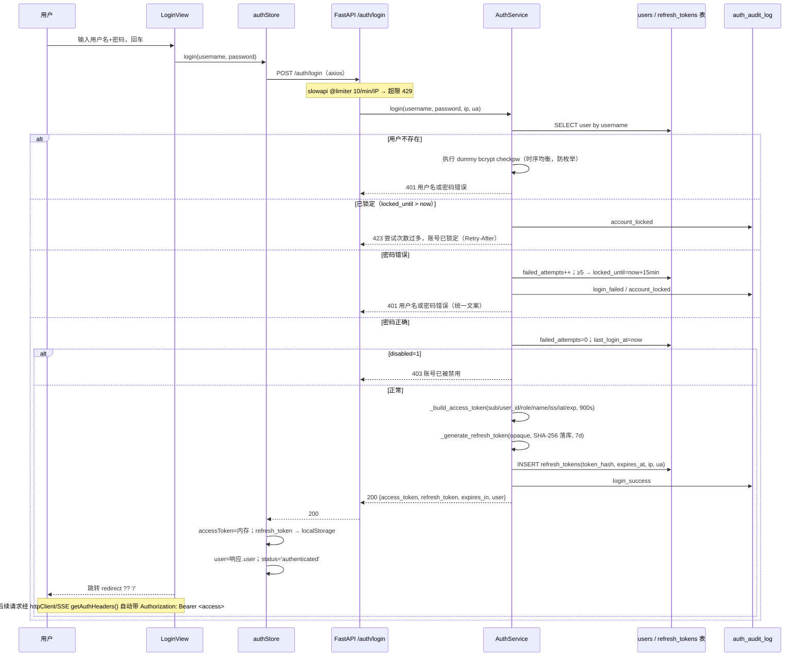
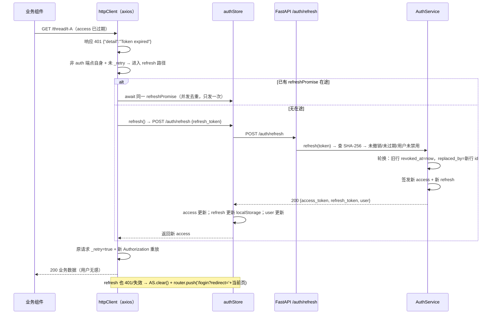
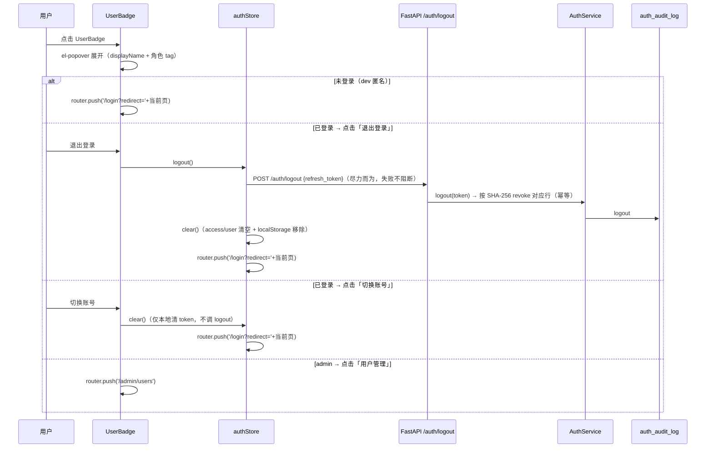
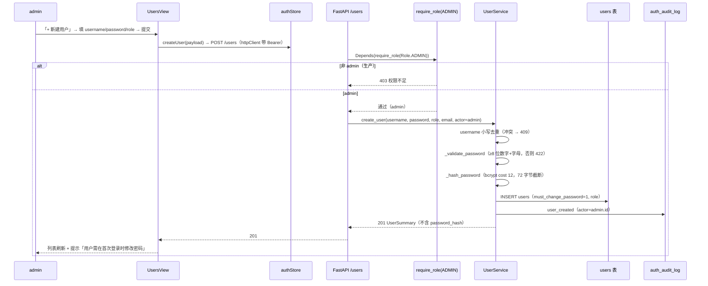

# GridMind（灵枢电网）系统架构设计 + 任务分解 · 真实登录 / 切换用户（UserBadge 点击）

**主题**：UserBadge 点击 → 真实登录 / 切换用户（`POST /auth/login` 签发 JWT，替换 dev 工具角色假身份）
**作者**：高见远（架构师 Bob）　**日期**：2026-08-11　**基线**：M-5 后 pytest 743 passed
**上游输入**：`docs/auth-prd-2026-08-11.md`（PM 许清楚）+ `docs/multiuser-architecture-2026-08-10.md` + `docs/session-mgmt-architecture-2026-08-10.md`
**主理人已拍板**（不可违背）：不接 SSO（P2）；密码策略 ≥8 位数字+字母、90 天过期提醒；多端点不强制单点；仅管理员创建用户；登录标识 username；MFA P2 留扩展点；**Token 全存 localStorage**（access 内存/Pinia + refresh localStorage；access TTL 短 + 自动 refresh + 监控异常登录）；初始管理员 env `ADMIN_INITIAL_PASSWORD` 注入；角色变更现有 token 保留到过期。
**落盘**：本文档 + `docs/auth-sequence-diagram.mermaid` + `docs/auth-class-diagram.mermaid`

---

## 〇、现状核实结论（设计前提，非凭空设计）

| 现状点 | 核实结果 | 对本设计的影响 |
|---|---|---|
| `api/services/auth.py` | `verify_jwt_token(credentials)`：验签/exp/iss + `sub`/`user_id` 必填（401）；`issue_test_token(user_id, thread_id=None, extra_claims=None, expires_in_s=3600)` 签发 claims = `{sub, user_id, iss, exp, iat, [thread_id], [extra]}`；`verify_jwt_if_prod` dev 放行返回 None；`verify_thread_ownership`/`ensure_thread_owned`/`verify_audit_thread_access` 已就绪 | 登录端点必须签发**与 `issue_test_token` 同构**的 access JWT（`sub`+`user_id`+`iss`+`exp`+`iat`），并**额外**注入 `role`/`name` claim；**绝不注入 `thread_id`**（否则 `_claim_fast_path` 会对无绑定会话的普通请求 403） |
| `api/services/rbac.py` | `Role` 5 枚举；`ROLE_VALUES`；`get_role(payload)` 缺省/未知 → dispatcher；`require_role(*roles)` dev 直接放行（返回 dev/dispatcher）、生产 JWT+角色命中、`X-Admin-Token` 等效管理员；`role_allows` | **零改动**。`/users*` 直接复用 `require_role(Role.ADMIN)`；登录后角色从 JWT `role` claim 解析，语义完全不变 |
| `api/config.py` | `jwt_secret`（JWT_SECRET，默认 dev 值，生产门禁强制覆盖）、`jwt_algorithm=HS256`、`jwt_issuer="gridmind"`、`rate_limit_per_minute=60`；**无 access/refresh TTL、无 ADMIN_INITIAL_PASSWORD**；`is_production`（APP_ENV=production 或 PRODUCTION=1）唯一开关 | **新增** `jwt_access_ttl_seconds`（默认 900）/`jwt_refresh_ttl_seconds`（默认 604800）/`admin_initial_password` 及锁定、密码策略配置项；JWT 复用既有 `jwt_secret`/`jwt_issuer` |
| `api/main.py` | 无任何 `/auth/*`、`/users*` 端点；limiter 定义在模块内（`Limiter(key_func=get_remote_address)`）且 `app.state.limiter = limiter`（**测试引用** `main_module.app.state.limiter._storage.reset()`）；lifespan 调 `init_db()`；已 include feature_intro/knowledge_upload 两个 router | 需新建 `routers/auth.py`、`routers/users.py` 并 `include_router`；**limiter 提升到共享模块** `api/services/rate_limit.py`（main 与 auth router 同一实例，避免双实例歧义，不破坏既有测试）；lifespan 在 `init_db()` 后追加 `ensure_initial_admin()` |
| slowapi 0.1.10 | `@limiter.limit` 装饰器 + `request.app.state.limiter` 中间件双路径；**同一 Limiter 实例**装饰与挂载最稳妥 | auth router 从共享模块导入同一 `limiter` 实例；`/auth/login` 叠加 `@limiter.limit("10/minute")`（per-IP） |
| `mcp_tools/db/database.py` | `init_db()` executescript 幂等建表 + `_ensure_*_columns` PRAGMA 迁移模式（如 `_ensure_threads_columns`）；主库 `data/gridmind.db`；无 users/refresh_tokens/auth_audit_log 表 | 新增 `_ensure_auth_tables(conn)`（CREATE TABLE IF NOT EXISTS 三表 + 索引，幂等），executescript 同步加 DDL（新库一步到位），init_db 末尾调用 |
| `requirements.txt` | **无 bcrypt**（已装 bcrypt 5.0.0，属传递依赖）；PyJWT/slowapi 已有 | **必须**显式加入 `bcrypt>=5.0.0`（唯一新增后端依赖） |
| `web/src/composables/useJwtAuth.ts` | token 读取：`VITE_DEV_JWT_TOKEN` env → 默认 `gridmind-dev-token`；**不存 localStorage**；`parseJwtPayload`/`getJwtRole`/`getJwtUserId`/`getJwtDisplayName`/`getAuthHeaders`；无 login/logout | 改为「先读 authStore.accessToken，无则回退 dev token」；`getAuthHeaders` 作为 axios 拦截器与 SSE 共同数据源 |
| `web/src/stores/` | **无 auth.ts**（有 chatStore/display/modelStore/audit 等 13 个 store） | **新建** `stores/auth.ts`（Pinia）：access 内存 + refresh localStorage + 用户信息 + login/refresh/logout/fetchMe/hydrate/clear |
| `web/src/api/chat.ts` | axios 实例 `http`（未导出）无请求/响应拦截器；SSE 用 `fetch` + `getAuthHeaders()` | **新建** `api/httpClient.ts`（共享 axios 实例 + 401 自动 refresh 并发去重 + 重放），chat.ts 改为复用；SSE 保持 fetch（不参与重放，见共享知识 #9） |
| `web/src/components/controls/UserBadge.vue` | 纯展示：图标 + `getJwtDisplayName()` + 角色 tag；**无点击事件** | 重构为点击弹下拉：当前用户/角色、分隔线、切换账号、退出登录、用户管理（admin）、dev 角色快速切换子菜单 |
| `web/src/router/index.ts` | 7 路由，无 `/login`、无 `/admin/users`；仅 onboarding 守卫（main.ts `setupOnboardingGuard`） | **新增** `/login`（public）、`/admin/users`（admin）；**新增** `setupAuthGuard`（仅 `import.meta.env.PROD` 生效，dev 不拦截） |
| `web/.env` | `VITE_DEV_JWT_TOKEN` 为可解析 dev JWT（user_id=dev，无 role claim） | dev 默认体验不变：解码 → user_id=dev、role 缺省 → 显示「访客 · 调度员」 |
| 多用户架构决策 | 「角色来源 = JWT role claim，**不建用户表**」（multiuser Q3） | **本需求正式推翻该决策**（真实登录必须有 users 表）；role 来源不变（仍从 JWT claim 读）→ 记录见共享知识 #10 |

---

## 一、实现方案 + 框架选型

### 1.1 技术难点分析

1. **登录签发 token 必须与既有鉴权体系同构**：`verify_jwt_token` 强制 `sub`/`user_id`/`iss`；`verify_thread_ownership` 有 `thread_id` claim 快速路径（不匹配 → 403）。登录 JWT 若误带 `thread_id` 会破坏普通请求 → **claims 白名单设计**（见 §3.2）。
2. **refresh token 轮换 + 多设备**：主理人拍板多端点不强制单点 → `refresh_tokens` 按设备成行；每次 refresh 轮换（旧行 `revoked_at`，`replaced_by` 成链），DB 只存 SHA-256 hash 不存明文。
3. **Token 双存 + 自动续期**：access 只存内存（Pinia）→ F5 后必须靠 refresh 恢复；401 自动 refresh 需并发去重（Promise 单例）+ 原请求重放 + 排除 auth 端点自身。
4. **dev 零破坏**：`verify_jwt_if_prod`/`require_role` dev 放行语义不动；dev-login 仅非生产；生产构建路由守卫仅 `import.meta.env.PROD` 生效。
5. **防枚举 + 防暴力**：登录失败统一 401 文案；per-account 5 次锁 15min + per-IP 10/min；伪造用户也执行一次 bcrypt 比对（时序均衡）。
6. **无新增架构范式**：后端保持 routers → services → db 分层；前端 store + composable 分层；新增文件全部落位既有目录。

### 1.2 框架与库选型

- **后端（唯一新增依赖）**：`bcrypt>=5.0.0` —— 密码 hash（成本因子 12，72 字节截断；不引入 passlib/argon2）。复用：`fastapi`（Depends）、`PyJWT`（HS256）、`slowapi`（per-IP 限流，共享 limiter）、`sqlite3`（标准库，三表幂等迁移）、`loguru`（审计降级告警）、`secrets`（标准库，refresh token 生成）。
- **前端（零新增依赖）**：复用 `pinia`（authStore）、`vue-router`（/login + 守卫）、`element-plus`（el-dropdown/el-form/el-dialog/ElMessage）、`axios`（拦截器）、既有 `useJwtAuth`（parseJwtPayload 等）。
- **架构模式**：后端分层（routers → services → db）不变；前端「store（唯一状态源）→ api（httpClient）→ 组件」分层，不引入新范式。

### 1.3 后端方案

| 模块 | 方案 |
|---|---|
| 数据层 | `users` / `refresh_tokens` / `auth_audit_log` 三表（DDL 见 §3.1），`_ensure_auth_tables` 幂等迁移；密码 bcrypt hash；refresh 存 SHA-256 hash |
| `api/services/auth_service.py` | `AuthService`：login / refresh / logout / me / change_password / dev_login + token 签发与轮换 + 账号锁定 + 审计；SQL 直连主库（复用 `get_connection()`） |
| `api/services/user_service.py` | `UserService`：ensure_initial_admin / list / create / update（角色/禁用/密码）+ 密码策略 + 防呆（最后 admin） |
| `api/services/rate_limit.py` | **新增共享 limiter**；main.py 改为从此导入（`app.state.limiter` 保持不变） |
| `api/routers/auth.py` | 端点：`POST /auth/login`、`POST /auth/refresh`、`POST /auth/logout`、`GET /auth/me`、`POST /auth/change-password`、`POST /auth/dev-login`（仅非生产） |
| `api/routers/users.py` | 端点：`GET /users`、`POST /users`、`PATCH /users/{id}`（全部 `require_role(Role.ADMIN)`，dev 放行） |
| 端点鉴权口径 | login/refresh/logout/dev-login 公开；`/auth/me`、`/auth/change-password` 用 `verify_jwt_if_prod`；`/users*` 用 `require_role(Role.ADMIN)`；dev-login 生产必须 404 |
| 初始管理员 | lifespan 在 `init_db()` 后调 `ensure_initial_admin()`：无 `admin` 用户名 → 用 `ADMIN_INITIAL_PASSWORD` 创建（`must_change_password=1`）；dev 无 env 时用固定 dev 密码并日志告警；生产未配置 → 启动拒绝（fail-closed，见 §八 待明确 1） |

### 1.4 前端方案

| 模块 | 方案 |
|---|---|
| `stores/auth.ts` | Pinia：`accessToken`（内存）/ `user` / `status`；refresh token 存 localStorage `gridmind.refresh_token`；actions：login / refresh / logout / fetchMe / hydrate / clear |
| `api/httpClient.ts` | 共享 axios 实例：请求拦截器（经 `getAuthHeaders()` 注入 Bearer）；响应拦截器 401 → 单例 refresh（并发去重）→ 重放原请求；refresh 失败 → clear + 跳 `/login?redirect=`；`/auth/login`、`/auth/refresh`、`/auth/logout` 自身不重放 |
| `composables/useJwtAuth.ts` | `getJwtToken()` 改为：authStore.accessToken 优先，无则回退 dev token（dev 零破坏）；`getAuthHeaders()` 不变签名（axios 拦截器与 SSE 共用） |
| `UserBadge.vue` | 点击 → el-popover 下拉：用户信息 + 角色 tag、分隔线、「切换账号」「退出登录」、admin 显示「用户管理」、「(dev) 以 X 角色登录 ▸」子菜单（仅 `import.meta.env.DEV`） |
| `LoginView.vue` | `/login`：用户名/密码、错误提示条（统一文案）、提交 loading、回车提交、首次登录强制改密面板（`must_change_password` 时同页切换） |
| `UsersView.vue` | `/admin/users`：用户表格（用户名/角色/状态/最近登录/创建时间）+ 新建/编辑对话框 + 禁用/启用 + 改角色 + 改密（密码策略校验） |
| 路由 | `/login`（public）、`/admin/users`（meta.roles=['admin']）；`setupAuthGuard`：仅 `import.meta.env.PROD` 生效，未登录访问受保护路由 → `/login?redirect=`；dev 不拦截 |
| 首次登录/过期 | 登录成功若 `must_change_password` → 跳改密面板；`/auth/me` 返回 `password_expires_at`，临近过期/已过期 → ElMessage 一次性提醒（90 天策略，拍板 #2） |

### 1.5 与既有体系的关系（不破坏项）

1. `get_role` / `require_role` / `verify_jwt_if_prod` / `verify_thread_ownership` / `ensure_thread_owned` / `verify_audit_thread_access` / `X-Admin-Token` 等效管理员 —— **全部零改动**。
2. 登录签发的 access JWT 与 `issue_test_token` 同构（`sub`+`user_id`+`iss`+`exp`+`iat`）+ `role`/`name`；**不含 `thread_id`**（§3.2）。
3. `GET /sessions` 仍按 owner 过滤（M-5 不回归）；登录用户新会话 `create_thread(owner=users.id)` 天然生效（`_identity_user_id` 已从 JWT sub 解析）。
4. 存量 dev thread（owner="dev"）保留；dev 模式不校验 owner（放行），生产新用户只见自己会话（无需迁移历史）。
5. `issue_test_token` 保留（tests 专用）；既有 743 条 pytest 不受影响。

---

## 二、文件列表（新增 / 修改，含改动内容）

### 后端（Backend）

| # | 文件（相对路径） | 类型 | 改动内容 |
|---|---|---|---|
| B01 | `requirements.txt` | 修改 | 显式加入 `bcrypt>=5.0.0`（当前为传递依赖） |
| B02 | `api/config.py` | 修改 | 新增：`jwt_access_ttl_seconds`（默认 900）、`jwt_refresh_ttl_seconds`（默认 604800）、`admin_initial_password`（env ADMIN_INITIAL_PASSWORD）、`login_rate_limit_per_minute`（默认 10）、`account_lock_threshold`（默认 5）、`account_lock_minutes`（默认 15）、`password_min_length`（默认 8）、`password_expiry_days`（默认 90） |
| B03 | `mcp_tools/db/database.py` | 修改 | ① executescript 增 `users`/`refresh_tokens`/`auth_audit_log` 三表 DDL + 索引（新库一步到位）；② 新增 `_ensure_auth_tables(conn)`（CREATE TABLE IF NOT EXISTS 幂等 + 索引），init_db 末尾调用 |
| B04 | `api/services/rate_limit.py` | **新增** | 共享 `limiter = Limiter(key_func=get_remote_address)`（main 与 auth router 共用同一实例） |
| B05 | `api/main.py` | 修改 | ① limiter 改为 `from api.services.rate_limit import limiter`（删本地定义，`app.state.limiter` 与异常处理器保留）；② `include_router(auth_router)` + `include_router(users_router)`；③ lifespan 在 `init_db()` 后调 `ensure_initial_admin()`（幂等，失败仅告警） |
| B06 | `api/schemas/auth.py` | **新增** | Auth Pydantic 模型：`LoginRequest`/`LoginResponse`/`RefreshRequest`/`LogoutRequest`/`MeResponse`/`ChangePasswordRequest`/`DevLoginRequest`/`UserSummary`/`UserCreateRequest`/`UserUpdateRequest`/`UsersListResponse`（详见 §3.3-3.4） |
| B07 | `api/services/auth_service.py` | **新增** | `AuthService` 全业务（login/refresh/logout/me/change_password/dev_login + token 签发/轮换 + 锁定 + 审计 + 防枚举时序均衡），方法签名见 §3.5 |
| B08 | `api/routers/auth.py` | **新增** | 6 端点（login/refresh/logout/me/change-password/dev-login）；login 叠加 `@limiter.limit("10/minute")`；dev-login 生产 404 |
| B09 | `api/services/user_service.py` | **新增** | `UserService` 全业务（ensure_initial_admin/list/create/update + 密码策略 + 防呆），方法签名见 §3.5 |
| B10 | `api/routers/users.py` | **新增** | 3 端点（GET/POST /users、PATCH /users/{id}），全部 `require_role(Role.ADMIN)`（dev 放行） |
| T01 | `tests/test_auth_db_migration.py` | **新增** | 三表建表/索引幂等；重复 init_db 不报错；既有表零影响 |
| T02 | `tests/test_auth_api.py` | **新增** | login 成功/失败统一文案/锁定/禁用/IP 限流；refresh 轮换 + 旧 token 撤销；logout 幂等；me；dev-login 生产 404；claims 结构（含 role/name、不含 thread_id） |
| T03 | `tests/test_users_admin.py` | **新增** | 管理员 CRUD；非 admin 403；用户名冲突 409；密码策略 422；禁用后 refresh 拒绝；最后 admin 防呆；审计事件落库 |

### 前端（Frontend）

| # | 文件（相对路径） | 类型 | 改动内容 |
|---|---|---|---|
| F01 | `web/src/types/index.ts` | 修改 | 新增 `AuthUser`/`LoginResponse`/`MeResponse`/`UserSummary`/`UsersListResponse`/`ChangePasswordRequest` 等 DTO（含 `mfa_required` 扩展点字段） |
| F02 | `web/src/api/auth.ts` | **新增** | `login/refresh/logout/fetchMe/changePassword/devLogin` + `fetchUsers/createUser/updateUser`，全部走 `httpClient` |
| F03 | `web/src/stores/auth.ts` | **新增** | Pinia authStore（state/actions 见 §3.6）；`hydrate()` 启动时用 refresh 恢复会话 |
| F04 | `web/src/api/httpClient.ts` | **新增** | 共享 axios 实例 + 请求拦截器（Bearer）+ 401 响应拦截器（单例 refresh + 重放 + 跳登录），见 §4.2 |
| F05 | `web/src/api/chat.ts` | 修改 | 内部 `http` 实例改为复用 `httpClient`（函数签名/导出不变）；SSE 保持 fetch + `getAuthHeaders()` |
| F06 | `web/src/composables/useJwtAuth.ts` | 修改 | `getJwtToken()` 优先 authStore.accessToken，无则回退 dev token（lazy 读取避免循环依赖）；`getAuthHeaders` 签名不变 |
| F07 | `web/src/components/controls/UserBadge.vue` | 修改 | 纯展示 → 点击下拉（props 见 §3.7）；未登录点击 → `/login?redirect=`；dev 子菜单「以 X 角色登录」 |
| F08 | `web/src/views/LoginView.vue` | **新增** | 登录页（含首次登录强制改密面板 + 90 天过期提醒） |
| F09 | `web/src/views/UsersView.vue` | **新增** | 用户管理页（表格 + 新建/编辑对话框 + 禁用/启用 + 改角色 + 改密） |
| F10 | `web/src/router/index.ts` | 修改 | 新增 `/login`（public）、`/admin/users`（meta.roles=['admin']）；导出 `setupAuthGuard` |
| F11 | `web/src/main.ts` | 修改 | 注册 `setupAuthGuard(router)`；`useAuthStore().hydrate()`（在 mount 前） |
| F12 | `web/src/App.vue` | 修改 | Header 用户管理入口（admin 显示，走 `visibleNavItems`/路由）；UserBadge 连接 authStore |

---

## 三、数据结构和接口

### 3.1 三表 DDL（主库 `data/gridmind.db`，幂等迁移）

```sql
-- users：真实账号（登录标识 username，小写唯一）
CREATE TABLE IF NOT EXISTS users (
    id                    TEXT PRIMARY KEY,             -- UUID（写入 JWT sub/user_id）
    username              TEXT NOT NULL UNIQUE,         -- 登录名（小写唯一）
    email                 TEXT,                         -- 可选（未启用邮箱登录）
    password_hash         TEXT NOT NULL,                -- bcrypt hash（72 字节截断）
    role                  TEXT NOT NULL DEFAULT 'dispatcher',  -- 5 角色之一（对齐 ROLE_VALUES）
    disabled              INTEGER NOT NULL DEFAULT 0,   -- 1=禁用（login/refresh/me 拒绝）
    must_change_password  INTEGER NOT NULL DEFAULT 0,   -- 1=首次登录强制改密
    password_changed_at   TEXT,                         -- UTC ISO
    password_history      TEXT NOT NULL DEFAULT '[]',   -- JSON：最近 N 次 bcrypt hash（P2 启用）
    failed_attempts       INTEGER NOT NULL DEFAULT 0,   -- 连续失败计数（成功/锁定期满清零）
    locked_until          TEXT,                         -- 锁定截止 UTC ISO；NULL=未锁定
    last_login_at         TEXT,                         -- 最近成功登录（UTC ISO）
    created_at            TEXT NOT NULL,
    updated_at            TEXT NOT NULL
);
CREATE INDEX IF NOT EXISTS idx_users_username ON users(username);
CREATE INDEX IF NOT EXISTS idx_users_role ON users(role);

-- refresh_tokens：多设备并发会话（每次刷新轮换，replaced_by 成链）
CREATE TABLE IF NOT EXISTS refresh_tokens (
    id            INTEGER PRIMARY KEY AUTOINCREMENT,
    user_id       TEXT NOT NULL REFERENCES users(id),
    token_hash    TEXT NOT NULL UNIQUE,      -- SHA-256(refresh_token)，不存明文
    expires_at    TEXT NOT NULL,             -- UTC ISO
    created_at    TEXT NOT NULL,
    revoked_at    TEXT,                      -- 退出/轮换/改密后置值
    replaced_by   INTEGER,                   -- 轮换链：新 refresh_tokens.id（NULL=未轮换）
    user_agent    TEXT,
    ip_address    TEXT
);
CREATE INDEX IF NOT EXISTS idx_refresh_user ON refresh_tokens(user_id);
CREATE INDEX IF NOT EXISTS idx_refresh_hash ON refresh_tokens(token_hash);

-- auth_audit_log：认证事件审计（与 hitl_audit_log 共存）
CREATE TABLE IF NOT EXISTS auth_audit_log (
    id          INTEGER PRIMARY KEY AUTOINCREMENT,
    event_type  TEXT NOT NULL,   -- login_success|login_failed|account_locked|logout|refresh|user_created|user_disabled|role_changed|password_changed
    user_id     TEXT,
    username    TEXT,
    ip_address  TEXT,
    user_agent  TEXT,
    detail      TEXT,            -- 补充（不存密码/明文 token）
    created_at  TEXT NOT NULL    -- UTC ISO
);
CREATE INDEX IF NOT EXISTS idx_auth_audit_user ON auth_audit_log(user_id);
CREATE INDEX IF NOT EXISTS idx_auth_audit_time ON auth_audit_log(created_at);
```

迁移实现：`_ensure_auth_tables(conn)` 用 `CREATE TABLE IF NOT EXISTS` + `CREATE INDEX IF NOT EXISTS`（自身幂等），与 `_ensure_kb_meta_table` 模式一致；executescript 同步建（新库一步到位）；重复 `init_db()` 零副作用。

### 3.2 JWT claims 结构（登录 / dev-login 签发）

```python
{
    "sub": user["id"],            # = users.id（UUID）
    "user_id": user["id"],        # 兼容 verify_jwt_token 双命名必填
    "role": user["role"],         # 5 角色之一（get_role 解析源）
    "name": user["display_name"], # 展示名（前端 getJwtDisplayName 优先读 name）
    "iss": settings.jwt_issuer,   # "gridmind"
    "iat": int(time.time()),
    "exp": int(time.time()) + settings.jwt_access_ttl_seconds,  # 默认 900s
    # 绝对不含 thread_id claim —— 原因：
    # auth.verify_thread_ownership 的 _claim_fast_path 会校验
    # token.thread_id == URL thread_id，登录签发的通用 token 若带
    # thread_id 会对无该绑定的会话请求 403（防 probing 快速路径误伤）。
}
```

签名：`jwt.encode(payload, settings.jwt_secret, algorithm=settings.jwt_algorithm)`（HS256，与 `issue_test_token` 完全同构）。access 由既有 `verify_jwt_token` 直接验签放行，**零鉴权改动**。

### 3.3 auth 端点契约（统一错误体 `{"detail": "..."}`）

| 端点 | 请求 | 响应 | 错误 |
|---|---|---|---|
| `POST /auth/login`（公开，限流 10/min/IP） | `{"username","password"}` | `200 {access_token, refresh_token, token_type:"bearer", expires_in:900, mfa_required:false, user:{id,username,display_name,role}}` | `401` 用户名或密码错误（统一文案）；`403` 账号已被禁用（密码验证通过后）；`423` 账号已锁定（`Retry-After` 剩余秒）；`429` IP 限流 |
| `POST /auth/refresh`（公开） | `{"refresh_token"}` | `200` 同 login（新 access + **轮换后**新 refresh） | `401` refresh 无效/过期/已撤销/用户被禁用 |
| `POST /auth/logout`（公开） | `{"refresh_token"}` | `200 {"ok":true}`（revoke 对应行；幂等——不存在也 200） | — |
| `GET /auth/me`（`verify_jwt_if_prod`） | — | `200 {id,username,display_name,role,must_change_password,last_login_at,password_expires_at,password_expiring}` | `401`（生产）无效/过期 token |
| `POST /auth/change-password`（`verify_jwt_if_prod`） | `{"old_password","new_password"}` | `200 {"ok":true}`；改密后撤销该用户全部 refresh_token，清除 `must_change_password`，审计 `password_changed` | `401` 旧密码错；`422` 新密码不满足策略（≥8 位数字+字母） |
| `POST /auth/dev-login`（**仅非生产**） | `{"role":"admin"}` | `200` 同 login（签发带 role claim 的真实 JWT） | `404` 生产环境（fail-closed）；`422` role 非法 |

dev 模式 `/auth/me` 行为：`verify_jwt_if_prod` 返回 None → 返回 dev 占位用户 `{id:"dev", username:"dev", display_name:"访客", role:"dispatcher", must_change_password:false}`（前端以 `id==="dev"` 区分 dev/prod）。

### 3.4 users 端点契约（`require_role(Role.ADMIN)`，dev 放行）

| 端点 | 请求 | 响应 | 错误 |
|---|---|---|---|
| `GET /users?role=&disabled=&q=&page=&page_size=` | query（均可选） | `200 {users:[UserSummary...], total}`（不含 password_hash） | `401/403`（生产）非管理员 |
| `POST /users` | `{"username","email"?,"password","role"}` | `201 UserSummary`（`must_change_password=1`） | `409` 用户名/邮箱已存在；`422` 角色非法 / 密码策略不满足 |
| `PATCH /users/{id}` | `{"role"?,"disabled"?,"password"?}`（至少一项） | `200 UserSummary` | `404` 不存在；`422` 角色非法/密码策略；`409` 防呆（最后一个 admin 禁止禁用/降级） |

`UserSummary`：`{id, username, email, role, disabled, must_change_password, last_login_at, created_at}`。

### 3.5 Service 方法签名（Python）

```python
# api/services/auth_service.py
class AuthService:
    def login(self, username: str, password: str,
              ip: str | None = None, user_agent: str | None = None) -> dict:
        """校验 + 限流 + 锁定 + 防枚举 + 签发 access/refresh + 审计 login_success/login_failed/account_locked"""
    def refresh(self, refresh_token: str,
                ip: str | None = None, user_agent: str | None = None) -> dict:
        """查 hash → 未撤销/未过期/用户未禁用 → 轮换（旧 revoked_at + replaced_by 成链）→ 新双 token + 审计 refresh"""
    def logout(self, refresh_token: str) -> None:
        """按 hash revoke 对应行（幂等）+ 审计 logout"""
    def get_me(self, user_id: str) -> dict:
        """读用户 + 计算 password_expires_at/password_expiring（90 天策略）"""
    def change_password(self, user_id: str, old_password: str, new_password: str,
                        ip: str | None = None, user_agent: str | None = None) -> None:
        """验证旧密码 → 策略校验 → 更新 hash/password_changed_at/清 must_change_password →
        撤销该用户全部 refresh + 审计 password_changed"""
    def dev_login(self, role: str,
                  ip: str | None = None, user_agent: str | None = None) -> dict:
        """仅非生产；生产直接 404；签发 dev 用户（id=f"dev-{role}"）的真实 JWT"""
    # 内部
    def _build_access_token(self, user: dict, ttl: int) -> str: ...
    def _generate_refresh_token(self, user: dict, ip: str | None, ua: str | None) -> str: ...
    def _revoke_refresh(self, token_hash: str, replaced_by: int | None = None) -> None: ...
    def _hash_refresh(self, token: str) -> str: ...   # sha256 hexdigest

# api/services/user_service.py
class UserService:
    def ensure_initial_admin(self) -> None:
        """幂等：无 admin 用户名 → 用 settings.admin_initial_password（生产必配）创建，must_change_password=1"""
    def list_users(self, role: str | None = None, disabled: int | None = None,
                   q: str | None = None, page: int = 1, page_size: int = 50) -> dict:
        """返回 {users, total}，不含 password_hash"""
    def get_by_username(self, username: str) -> dict | None: ...
    def get_user(self, user_id: str) -> dict | None: ...
    def create_user(self, username: str, password: str, role: str,
                    email: str | None = None, actor_id: str | None = None,
                    ip: str | None = None, user_agent: str | None = None) -> dict:
        """username 小写去重；密码策略校验；bcrypt hash；must_change_password=1；审计 user_created"""
    def update_user(self, user_id: str, role: str | None = None,
                    disabled: int | None = None, password: str | None = None,
                    actor_id: str | None = None,
                    ip: str | None = None, user_agent: str | None = None) -> dict:
        """改角色/禁用/改密；_guard_last_admin 防呆；审计 user_disabled/role_changed/password_changed"""
    def _validate_password(self, password: str) -> None: ...
        # ≥8 位 + 至少一个数字 + 至少一个字母 → 否则 HTTPException 422
    def _hash_password(self, password: str) -> str: ...
        # bcrypt.hashpw(password.encode()[:72], bcrypt.gensalt(rounds=12))
    def _verify_password(self, password: str, password_hash: str) -> bool: ...
        # bcrypt.checkpw(password.encode()[:72], hash)
    def _guard_last_admin(self, user_id: str, new_role: str | None, disabled: int | None) -> None: ...
        # 目标用户是 admin 且系统仅剩这一个 admin，且操作会使其失去 admin 资格 → 409

# api/services/auth_audit_service.py（可并入 auth_service 或独立）
class AuthAuditService:
    @staticmethod
    def record(event_type: str, user_id: str | None = None, username: str | None = None,
               ip_address: str | None = None, user_agent: str | None = None,
               detail: str | None = None) -> None:
        """INSERT auth_audit_log；失败仅 loguru.warning，绝不阻断主流程（共享知识 #8）"""
```

### 3.6 前端 authStore state shape（Pinia）

```ts
// web/src/stores/auth.ts
export const REFRESH_TOKEN_KEY = 'gridmind.refresh_token'

interface AuthState {
  accessToken: string | null        // 内存（F5 后经 hydrate() 用 refresh 恢复）
  user: AuthUser | null             // {id, username, display_name, role, must_change_password, last_login_at, password_expiring?}
  status: 'idle' | 'loading' | 'authenticated' | 'anonymous'
}

// actions
login(username: string, password: string): Promise<void>   // POST /auth/login → access 内存 + refresh localStorage + user
refresh(): Promise<string>                                  // POST /auth/refresh → 轮换双 token → 返回新 access（单例，供拦截器复用）
logout(): Promise<void>                                     // 尽力 POST /auth/logout → clear() → 跳 /login?redirect=
fetchMe(): Promise<void>                                    // GET /auth/me → 校验会话 + 刷新 user（password_expiring 提醒）
hydrate(): Promise<void>                                    // 启动时：有 refresh → refresh() 恢复；失败 → clear()
clear(): void                                               // access/user/status 清空 + localStorage 移除（不跳转）
// getters
isAuthenticated: boolean                                    // status==='authenticated' && accessToken
role: Role                                                  // user?.role ?? 'dispatcher'
displayName: string
```

### 3.7 UserBadge 交互 props

```vue
<script setup lang="ts">
// web/src/components/controls/UserBadge.vue
const props = withDefaults(defineProps<{
  placement?: 'bottom' | 'bottom-start' | 'bottom-end'  // el-popover 位置，默认 'bottom-end'
  trigger?: 'click' | 'hover'                            // 默认 'click'
}>(), { placement: 'bottom-end', trigger: 'click' })

// 交互状态（内部）：
// - 未登录（dev 匿名 / 生产跳转前）点击 → router.push(`/login?redirect=${route.fullPath}`)
// - 已登录点击 → el-popover：头部「displayName + 角色 tag」；分隔线；
//   「用户管理」(role==='admin')；「切换账号」；「退出登录」；
//   [dev 仅 import.meta.env.DEV]「以 X 角色登录 ▸」子菜单（5 角色 → devLogin(role)）
</script>
```

### 3.8 类图（mermaid，另存 `docs/auth-class-diagram.mermaid`）

```mermaid
classDiagram
    class User {
        +str id
        +str username
        +str email
        +str password_hash
        +str role
        +int disabled
        +int must_change_password
        +str password_changed_at
        +str password_history
        +int failed_attempts
        +str locked_until
        +str last_login_at
        +str created_at
        +str updated_at
    }
    class RefreshToken {
        +int id
        +str user_id
        +str token_hash
        +str expires_at
        +str created_at
        +str revoked_at
        +int replaced_by
        +str user_agent
        +str ip_address
    }
    class AuthAuditLog {
        +int id
        +str event_type
        +str user_id
        +str username
        +str ip_address
        +str user_agent
        +str detail
        +str created_at
    }
    class AuthService {
        +login(username, password, ip, ua) dict
        +refresh(refresh_token, ip, ua) dict
        +logout(refresh_token) None
        +get_me(user_id) dict
        +change_password(user_id, old, new, ip, ua) None
        +dev_login(role, ip, ua) dict
        -_build_access_token(user, ttl) str
        -_generate_refresh_token(user, ip, ua) str
        -_revoke_refresh(token_hash, replaced_by) None
    }
    class UserService {
        +ensure_initial_admin() None
        +list_users(role, disabled, q, page, page_size) dict
        +get_by_username(username) dict
        +get_user(user_id) dict
        +create_user(username, password, role, email, actor) dict
        +update_user(user_id, role, disabled, password, actor) dict
        -_validate_password(password) None
        -_hash_password(password) str
        -_verify_password(password, hash) bool
        -_guard_last_admin(user_id, new_role, disabled) None
    }
    class AuthAuditService {
        +record(event_type, user_id, username, ip, ua, detail) None
    }
    class AuthRouter {
        +POST /auth/login
        +POST /auth/refresh
        +POST /auth/logout
        +GET /auth/me
        +POST /auth/change-password
        +POST /auth/dev-login
    }
    class UsersRouter {
        +GET /users
        +POST /users
        +PATCH /users/{id}
    }
    class authStore {
        +accessToken string
        +user AuthUser
        +status AuthStatus
        +login(username, password) Promise
        +refresh() Promise
        +logout() Promise
        +fetchMe() Promise
        +hydrate() Promise
        +clear() void
    }
    class httpClient {
        +instance axios
        +requestInterceptor() void
        +responseInterceptor401() void
        +refreshPromise Promise~string~
    }

    User "1" --> "*" RefreshToken : has
    User "1" --> "*" AuthAuditLog : audited
    AuthService --> User : reads/verifies
    AuthService --> UserService : create/update/delegate
    AuthService --> AuthAuditService : writes
    UserService --> AuthAuditService : writes
    AuthRouter --> AuthService : delegates
    UsersRouter --> UserService : delegates
    authStore --> httpClient : via api/auth.ts
    httpClient --> authStore : lazy refresh (function-level import)
```

---

## 四、程序调用流程（时序图，mermaid；另存 `docs/auth-sequence-diagram.mermaid`）

### 4.1 登录流程（提交 → 失败限流 → 成功签发 → 前端保存 → 自动带 Authorization）



### 4.2 401 自动 refresh 流程（拦截器 → 并发去重 → 换新 → 重放原请求）



### 4.3 UserBadge 切换 / 登出流程



### 4.4 管理员创建用户流程



---

## 五、任务列表（有序、含依赖、按实现顺序）

> 分组原则：按「基础设施/数据层 → 后端认证 → 后端用户管理 → 前端数据层 → 前端交互层」五个功能模块横向分组；每任务 ≥3 文件，任务数 = 5（硬性上限）；依赖链 T1 → T2 → T3 / T2 → T4 → T5（T3 与 T4 可并行）。

### Task 1：基础设施 + 认证数据层（配置项 + 三表迁移 + 共享限流器）

- **涉及文件**：`requirements.txt`、`api/config.py`、`mcp_tools/db/database.py`、`api/services/rate_limit.py`（新）、`api/main.py`（仅 limiter 改共享导入）、`tests/test_auth_db_migration.py`（新）
- **依赖**：无
- **优先级**：P0
- **验收标准**：
  1. `requirements.txt` 显式含 `bcrypt>=5.0.0`；
  2. `settings` 新增 jwt TTL / ADMIN_INITIAL_PASSWORD / 锁定与密码策略配置，默认值正确（900s / 7d / 5 次 / 15min / 8 位 / 90 天）；
  3. `init_db()` 重复执行幂等：users/refresh_tokens/auth_audit_log 三表 + 索引创建成功，既有表零影响（743 基线不回归）；
  4. `api/services/rate_limit.py` 单例 limiter；main.py 引用后 `app.state.limiter` 仍是同一实例，`/admin/checkpoint-stats` 限流行为不变（既有测试通过）；
  5. `pytest tests/test_auth_db_migration.py` + 全量 pytest 通过。

### Task 2：后端认证闭环（auth schemas + AuthService + auth router + 接线 + 初始 admin）

- **涉及文件**：`api/schemas/auth.py`（新）、`api/services/auth_service.py`（新）、`api/routers/auth.py`（新）、`api/main.py`（include router + lifespan ensure_initial_admin）、`tests/test_auth_api.py`（新）
- **依赖**：Task 1
- **优先级**：P0
- **验收标准**：
  1. `POST /auth/login`：成功签发 access（claims 含 `sub`/`user_id`/`role`/`name`/`iss`/`iat`/`exp`，**不含 thread_id**）+ refresh（7d，DB 只存 SHA-256）；失败统一 `401 用户名或密码错误`；禁用 `403`；锁定 `423`（Retry-After）；IP 超 10/min → `429`；
  2. 同一账号连续失败 ≥5 → 锁定 15min，锁定期即使密码正确也 `423`；成功/锁定期满清零；
  3. `POST /auth/refresh`：轮换（旧行 `revoked_at` + `replaced_by` 成链），新双 token 返回；旧 token 二次使用 → `401`；用户被禁用 → `401`；
  4. `POST /auth/logout`：revoke 幂等（不存在也 200）；`GET /auth/me`：返回用户 + 密码过期信息（dev 返回占位用户）；
  5. `POST /auth/dev-login`：非生产签发带 role claim 的 JWT；`monkeypatch.setenv("APP_ENV","production")` 下 → 404；
  6. 初始 admin：lifespan 后 users 表有 `admin` 账号（dev 用 `ADMIN_INITIAL_PASSWORD` 或默认 dev 密码，`must_change_password=1`）；重复启动幂等；
  7. 审计：login_success/login_failed/account_locked/logout/refresh 落 `auth_audit_log`；审计写失败不阻断登录（降级 loguru.warning）；
  8. `pytest tests/test_auth_api.py` + 全量 pytest 通过。

### Task 3：后端用户管理（UserService + users router + 防呆 + 审计）

- **涉及文件**：`api/services/user_service.py`（新）、`api/routers/users.py`（新）、`api/services/auth_service.py`（修改：登录禁用/锁定联动 + 复用审计）、`tests/test_users_admin.py`（新）
- **依赖**：Task 2（AuthService / 审计 / 初始 admin 就绪）
- **优先级**：P0 / P1
- **验收标准**：
  1. `GET /users`：管理员可列表 + role/disabled/q/page 过滤；**不含 password_hash**；非 admin（生产）→ 403；dev 放行；
  2. `POST /users`：创建成功默认 `must_change_password=1`；用户名冲突 409；角色非法/密码不满足策略 422；`user_created` 审计；
  3. `PATCH /users/{id}`：改角色/禁用/改密；禁用后该用户 login 与 refresh 均拒绝（access 最长存活 TTL）；`role_changed`/`user_disabled`/`password_changed` 审计；
  4. 防呆：系统仅剩一个 admin 时，禁止禁用/降级该 admin（409）；
  5. `pytest tests/test_users_admin.py` + 全量 pytest 通过。

### Task 4：前端认证数据层（类型 + auth api + authStore + httpClient 拦截器 + useJwtAuth 改造）

- **涉及文件**：`web/src/types/index.ts`、`web/src/api/auth.ts`（新）、`web/src/stores/auth.ts`（新）、`web/src/api/httpClient.ts`（新）、`web/src/api/chat.ts`、`web/src/composables/useJwtAuth.ts`
- **依赖**：Task 2（后端 auth 端点就绪；可与 Task 3 并行）
- **优先级**：P0
- **验收标准**：
  1. auth DTO 类型就绪（含 `mfa_required` 扩展点字段）；
  2. `authStore`：login 存 access 内存 + refresh localStorage；`hydrate()` 启动时用 refresh 恢复；logout 尽力 revoke + clear；
  3. `httpClient`：请求自动带 Bearer；401 响应 → 单例 refresh（并发只发一次）→ 原请求重放；refresh 失败 → clear + 跳 `/login?redirect=`；`/auth/login|refresh|logout` 自身不重放；
  4. `useJwtAuth.getJwtToken()` 优先 authStore.accessToken，无则回退 dev token（dev 零破坏，既有角色解析/getAuthHeaders 行为不变）；
  5. `chat.ts` 复用共享 httpClient，既有 API 函数签名零变化；SSE 仍走 fetch + getAuthHeaders；
  6. `vue-tsc` 通过；既有单测/流程零回归。

### Task 5：前端交互层（UserBadge 下拉 + 登录页 + 用户管理页 + 路由守卫 + 集成）

- **涉及文件**：`web/src/components/controls/UserBadge.vue`、`web/src/views/LoginView.vue`（新）、`web/src/views/UsersView.vue`（新）、`web/src/router/index.ts`、`web/src/main.ts`、`web/src/App.vue`
- **依赖**：Task 4
- **优先级**：P0 / P1
- **验收标准**：
  1. UserBadge 点击弹下拉：用户 + 角色 tag、切换账号、退出登录；admin 显示「用户管理」；未登录点击 → `/login?redirect=`；外部点击/Esc 关闭；无事件冒泡误触；
  2. 登录页：用户名/密码、错误统一文案、loading 防重复提交、回车提交、`redirect` 回跳；`must_change_password` → 同页改密面板（改密后清标记）；90 天过期 → 一次性 ElMessage 提醒；
  3. 生产路由守卫：未登录访问受保护路由 → `/login?redirect=`；`/admin/users` 非 admin → 403 提示 + 回首页；`import.meta.env.PROD=false`（dev）不拦截；
  4. 用户管理页：列表 + 新建/编辑对话框（角色下拉、禁用开关、初始密码必填、密码策略校验）+ 禁用/启用 + 改角色；新建后提示「首次登录需改密」；
  5. dev 模式 UserBadge 下拉渲染「以 X 角色登录 ▸」子菜单（5 角色），生产构建不渲染；
  6. 全量 `pytest` + `vue-tsc` 双绿；生产模式端到端冒烟（登录 → 401 自动续期 → 切换账号 → 退出 → 管理员建号 → 禁用即时拒绝）一次通过。

---

## 六、依赖包列表

**后端唯一新增**：
- `bcrypt>=5.0.0` —— 密码 hash（当前已装 5.0.0，但属传递依赖，**必须显式写入 `requirements.txt`**，否则生产 `pip install -r requirements.txt` 会丢包）

**后端复用（无需新增）**：`fastapi`、`pydantic`、`PyJWT>=2.8.0`（HS256 签发/验签）、`slowapi>=0.1.9`（per-IP 限流）、`python-dotenv`、`loguru`、`sqlite3`（标准库）、`secrets`（标准库，refresh 生成）、`hashlib`（标准库，SHA-256）。

**前端（零新增）**：复用 `pinia`、`vue-router`、`element-plus`、`axios`、既有 `useJwtAuth`（base64url 解码）。

---

## 七、共享知识（跨文件约定）

1. **JWT claims 命名**
   - `sub`/`user_id` = `users.id`（UUID）；`role` = 5 角色之一；`name` = 展示名；`iss` = `settings.jwt_issuer`；`iat`/`exp` 必备。
   - **不含 `thread_id`**：`verify_thread_ownership._claim_fast_path` 会校验 `token.thread_id == URL thread_id`，登录签发的通用 token 带 thread_id 会对无绑定会话的请求 403（快速路径误伤）。会话绑定靠 DB owner 校验（`ensure_thread_owned`），不靠 claim。
   - access 由既有 `verify_jwt_token` 验签（401），**零鉴权改动**。
2. **Token 轮换规则**
   - access TTL `JWT_ACCESS_TTL_SECONDS`（默认 900s）；refresh TTL `JWT_REFRESH_TTL_SECONDS`（默认 604800s=7d）。
   - refresh 明文仅登录/轮换时返回一次；DB 只存 `SHA-256(token)` hex；每次 refresh：旧行 `revoked_at=now` + `replaced_by=新行id`（成链可审计）；旧 token 二次使用 → 401。
   - 登出 revoke 单行（幂等）；改密 revoke 该用户**全部** refresh；禁用用户 login/refresh/me 全部拒绝。
3. **失败统一文案（防枚举）**
   - `401 用户名或密码错误`：账号不存在与密码错误**同文案**；账号不存在也执行一次 dummy bcrypt 比对（时序均衡）。
   - `403 账号已被禁用`：仅密码验证通过后才返回（不向不知道密码的人泄漏账号状态）。
   - `423 尝试次数过多，账号已锁定，请稍后再试` + `Retry-After` 头（剩余秒）。
   - `429`：IP 限流（slowapi 标准体）。
   - 响应体 detail 一律不泄漏内部值（沿用 R-X3 口径）。
4. **bcrypt 约定**
   - 成本因子 12：`bcrypt.gensalt(rounds=12)`；**72 字节截断**：`password.encode('utf-8')[:72]`（hash 与 verify 两侧一致）；不引入 passlib。
   - 密码策略（拍板 #2）：≥8 位 + 至少一个数字 + 至少一个字母；90 天过期提醒（`/auth/me` 返回 `password_expiring`，前端一次性提示，不强制）。
5. **dev-login 仅非生产**
   - `POST /auth/dev-login` 在 `settings.is_production` 时**必须 404**（fail-closed）；前端 `import.meta.env.DEV` 才渲染入口。
   - dev 默认体验不变：`verify_jwt_if_prod`/`require_role` dev 放行；dev token 不可解析 → 前端默认「访客/调度员」。
6. **双层限流**
   - per-account：`failed_attempts` ≥5 → `locked_until=now+15min`（`ACCOUNT_LOCK_THRESHOLD`/`ACCOUNT_LOCK_MINUTES` 可配）；
   - per-IP：`@limiter.limit("10/minute")` 于 `/auth/login`（`LOGIN_RATE_LIMIT_PER_MINUTE` 可配）——共享 limiter 实例（`api/services/rate_limit.py`），main 与 router 同实例。
7. **防系统无管理员**
   - 最后一个 `admin` 账号禁止禁用/降级（`UserService._guard_last_admin` → 409）；创建用户不限制 role（首个 admin 由 seed/env 保证）。
8. **审计写失败不阻断登录主流程**
   - `AuthAuditService.record` 内部 try/except → loguru.warning 降级，绝不把审计当硬依赖（PRD AC7-4）。
9. **前端 refresh 拦截器并发去重**
   - 401 重放仅限**非 auth 端点自身**且 `_retry` 未置位；并发 401 共享同一 `refreshPromise`（Promise 单例），其余等待同一结果；refresh 失败 → `clear()` + `/login?redirect=`。
   - SSE（fetch）不参与 401 重放：流中 401 直接报错，由下一次 REST 操作触发 refresh（可接受边界）。
   - access 内存存储 → F5 后 `authStore.hydrate()` 用 refresh 恢复；localStorage 仅存 refresh（XSS 风险已由主理人拍板接受，access 短 TTL 缩小暴露面）。
10. **改造 multiuser Q3「不建用户表」决策的记录（架构变更声明）**
    - multiuser-architecture §1.5（Q3：角色来源 = JWT role claim，**不建用户表**）被本需求**正式推翻**——真实登录必须有 `users` 表。
    - **不影响 RBAC 语义**：`get_role` 仍从 JWT `role` claim 解析（零改动）；变化的只是「谁有资格拿 role claim」从「token 自证」改为「登录验证后签发」。
    - owner 一致性：登录后 JWT `sub`=users.id；新会话 `create_thread(owner=users.id)`；`GET /sessions` 按 owner 过滤不变（M-5 不回归）；存量 dev thread owner="dev" 保留（dev 放行，无需迁移）。
11. **目录/依赖约定**
    - 后端保持 routers → services → db 分层；`auth_service` 与 `user_service` 相互引用、以及 services 引用 `api.config` 一律**函数内 lazy import**（沿用 rbac/auth 既有约定，防循环）。
    - 前端 httpClient 与 authStore 相互引用（拦截器需读 token / 触发 refresh）→ **函数体内动态 import/读取**，禁止模块级互相 import（防循环）。
12. **测试约定**
    - 生产用例：`monkeypatch.setenv("APP_ENV", "production")` + 合法 JWT（登录签发或 `issue_test_token(extra_claims={"role": ...})`）；
    - 轮换/锁定/防枚举用例独立成组（test_auth_api.py / test_users_admin.py），不触碰既有 743 条基线；
    - 全量回归：`pytest` + `vue-tsc` 双绿。

---

## 八、待明确事项

1. **生产未配置 `ADMIN_INITIAL_PASSWORD` 时的启动策略**：建议 fail-closed——生产且 users 表无 admin 且 env 未注入 → 启动拒绝（对齐 JWT_SECRET 门禁）；dev 用固定 dev 密码（如 `Admin@123456`）并日志告警。待主理人确认是否接受生产拒绝启动。
2. **禁用用户已签发 access token 的即时性**：禁用即时性 = login/refresh/me 拒绝；已签发 access 最长存活 TTL（15min）——若要**即时踢下线**需 JWT/refresh 黑名单（P2）。待确认可接受。
3. **90 天过期提醒的呈现**：建议登录后 `password_expiring`（≤7 天或已过期）时一次性 ElMessage；是否要持续 banner 待确认。
4. **`/auth/me` dev 占位用户**：dev 返回 `{id:"dev", username:"dev", display_name:"访客", role:"dispatcher"}`，前端以 `id==="dev"` 区分；若希望 dev 也走真实账号体系（本地建库），可关 dev 占位（P2）。
5. **审计读端点**（`GET /auth/audit`）：PRD US-7 仅要求写审计；读接口沿用 `verify_jwt_if_prod` + `AUDIT_FULL_ACCESS_ROLES` 的口径**本批不做**，留 P2（管理员需要时再加）。
6. **MFA 扩展点落地形态**：本批仅在 `LoginResponse` 加 `mfa_required: bool = False` 占位字段 + 登录流程留 `mfa` 校验钩子；P2 再接 TOTP。
7. **refresh token 的 localStorage key**：`gridmind.refresh_token`（与既有 `gridmind.displayMode` 命名风格一致）；如需多标签页同步（同一账号多标签）可监听 `storage` 事件（P2）。

---

**架构设计完毕，待主理人审阅。**
