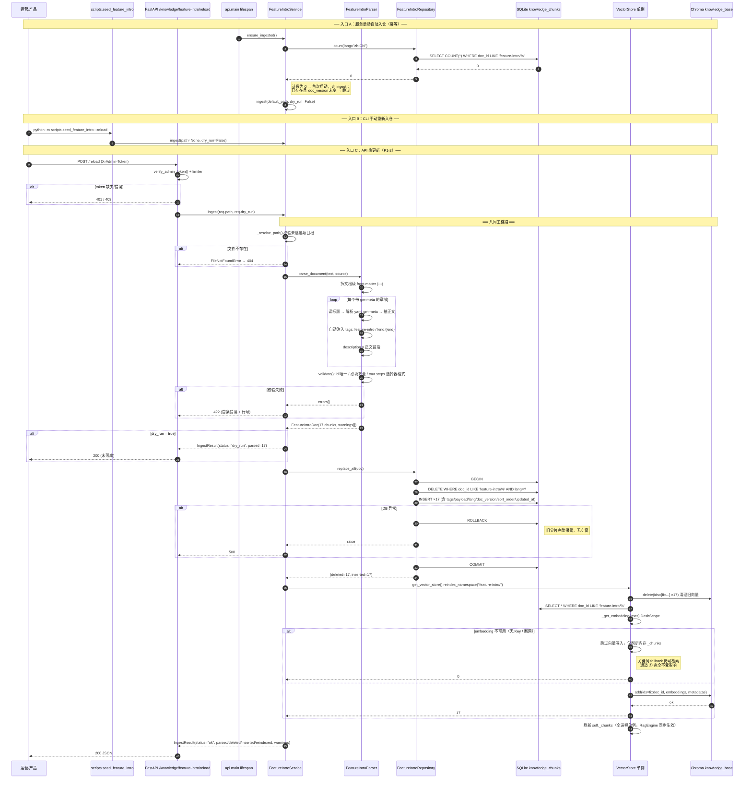
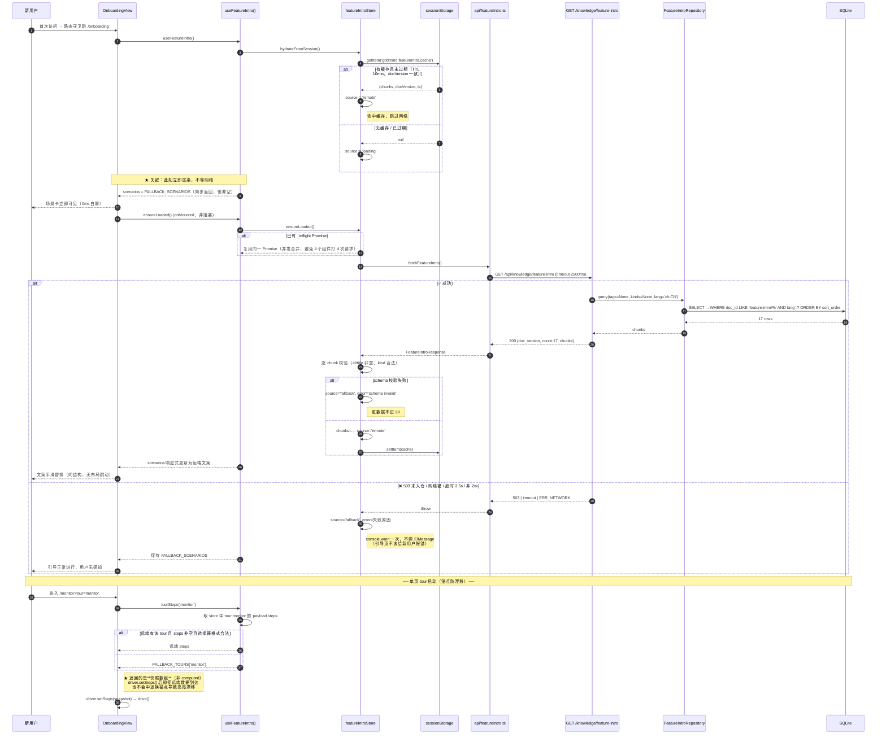

# 架构设计 · GridMind 功能介绍知识库化（Feature Intro KB）

> 文档版本：v1.0 · 2026-08-05
> 架构负责人：高见远（GridMind 架构师）
> 上游输入：`docs/feature-intro-kb-prd-2026-08-05.md`（许清楚 · v1.1）
> 目标读者：实现工程师（后端 Python / 前端 Vue）、QA
> 代码基线：已通读 `core/vector_store.py`、`core/rag_engine.py`、`mcp_tools/db/database.py`、`mcp_tools/db/seed_data.py`、`api/main.py`、`api/config.py`、`web/src/types/theme.ts`、`web/src/components/onboarding/*`、`web/vite.config.ts`

---

## 0. 摘要（TL;DR）

单一 Markdown 文档 `docs/gridmind-feature-introduction.md` 作为功能介绍的 single source of truth；
后端解析为 **17 个结构化 chunk**，落库到**现有** `knowledge_chunks` 表（幂等扩列，新增 `tags/payload/lang/doc_version/sort_order/updated_at`），并镜像索引进 **现有 Chroma `knowledge_base` collection** 供对话 RAG grounding；
前端新增 `useFeatureIntro()` composable，**从 SQLite 直读的结构化 API**（非向量检索）拉取引导文案，2.5s 超时后回退本地内置常量。

**双读取通道**是本架构的核心决策，详见 §1.2。

---

# Part A · 系统设计

## 1. 实现方案与框架选型

### 1.1 现状勘察结论（决定架构的 7 个既有事实）

实现前必须知道的既有约束，均已在代码中核实：

| # | 既有事实 | 位置 | 对本次架构的影响 |
|---|---|---|---|
| F1 | `seed_all()` 无条件执行 `DELETE FROM knowledge_chunks` | `mcp_tools/db/seed_data.py:112-118` | **功能介绍分片写进该表后，任何一次 reseed 都会被清空**。必须收窄 DELETE 作用域 |
| F2 | `VectorStore._load_chunks()` 仅在 `self._collection.count() == 0` 时写 Chroma | `core/vector_store.py:105` | **重复调用不会重新索引**，热更新必须新增显式 reindex 通道 |
| F3 | `VectorStore` **无进程级单例**：`RagEngine()` 自建一个、`knowledge_tools._rag_engine` 一个、`kg_chroma_sync._get_vector_store()` 又一个 | `core/rag_engine.py:58`、`mcp_tools/tools/knowledge_tools.py:15`、`core/kg_chroma_sync.py:491` | 每个实例各持一份 `self._chunks` 内存副本。热更新若只刷新其中一个，其余实例仍是旧数据 |
| F4 | 后端路由**无 `/api` 前缀**；Vite proxy 用 `rewrite: path.replace(/^\/api/, '')` 剥掉 | `api/main.py:275+`、`web/vite.config.ts` | 后端注册 `/knowledge/feature-intro`；前端请求 `/api/knowledge/feature-intro`。**PRD 建议的后端 `/api/...` 前缀是错的**，会变成 `/api/api/...` 失配 |
| F5 | 全项目**无 `{code,data,message}` 响应包封**，一律扁平领域字典 + `HTTPException` | `api/main.py:289,302,317,323` | 新端点必须沿用扁平风格，不可引入新包封 |
| F6 | `knowledge_chunks` 仅 5 列（`chunk_id/doc_id/title/content/source`），**无 tags** | `mcp_tools/db/database.py:155-161` | 需幂等扩列，沿用既有 `_ensure_devices_columns` / `_ensure_hitl_columns` 迁移范式 |
| F7 | `verify_admin_token`（`X-Admin-Token`，401/403 分离）+ `@limiter.limit` 已就绪 | `api/main.py:854-883` | 热更新端点**直接复用**，零新增鉴权代码 |

> **F1 / F2 / F3 是本需求最大的三个隐藏坑**。工程师若不处理，表现为：文档入仓后重启即消失（F1）、reload 接口返回成功但检索结果不变（F2）、reload 后 API 通道更新了而对话 RAG 通道仍是旧文案（F3）。

### 1.2 核心技术难点与解法

#### 难点 A：引导文案要「精确完整」，而向量检索天生「近似部分」

新手引导要的是「把 4 张场景卡全给我，顺序固定，字段齐全」；向量检索给的是「跟 query 最像的 top-k 段落」。用 RAG 喂引导卡片会导致卡片数量不定、顺序漂移、字段缺失。

**解法：双读取通道，同源不同路。**

```
                  ┌──────────────────────────────────────────┐
                  │  docs/gridmind-feature-introduction.md   │  ← 唯一事实源
                  └────────────────────┬─────────────────────┘
                                       │ FeatureIntroParser
                                       ▼
                          ┌────────────────────────┐
                          │  17 × FeatureIntroChunk │
                          └───────────┬────────────┘
                                      │ FeatureIntroRepository.replace_all()
                                      ▼
                       ┌──────────────────────────────┐
                       │ SQLite  knowledge_chunks     │  ← 唯一持久化
                       │ (doc_id LIKE 'feature-intro/%')│
                       └───────┬──────────────┬───────┘
             通道 ① 精确读取     │              │  通道 ② 语义检索
          （确定性 · 前端引导）   │              │ （近似 · 对话 grounding）
                                ▼              ▼
                 GET /knowledge/feature-intro   VectorStore → Chroma
                    SQL WHERE tags LIKE ...      → RagEngine.answer()
                                │                        │
                                ▼                        ▼
                     useFeatureIntro()            对话中的功能介绍问答
                     场景卡 / tour / 第3步
```

- **通道 ①（P0-3 / P1-1）**：`GET /knowledge/feature-intro` 直查 SQLite，按 tag 精确过滤、按 `sort_order` 排序，**完全确定性**，不经过 embedding、不依赖 DashScope Key、不受 Chroma 可用性影响。
- **通道 ②（P0-2）**：分片镜像进 Chroma `knowledge_base` collection，让 `RagEngine.answer()` 回答「GridMind 有哪些功能」时以本文档为准（PRD §关联需求「对话中的功能介绍类问答亦以该文档为主」）。

这样通道 ① 的可靠性不被通道 ② 的不确定性污染，而两者共享同一份 SQLite 数据，天然一致。

#### 难点 B：`seed_all()` 会清空知识库表（F1）

**解法：收窄 DELETE 作用域 + 命名空间隔离。**

所有功能介绍分片的 `doc_id` 统一以 `feature-intro/` 前缀开头，形成命名空间。`seed_all()` 的清空语句改为：

```python
# 原：conn.execute("DELETE FROM knowledge_chunks")
# 改：保护 feature-intro 命名空间，其余照旧清空
conn.execute("DELETE FROM knowledge_chunks WHERE doc_id NOT LIKE 'feature-intro/%'")
```

对 `tables` 循环做特判即可，改动 3 行。这样 `seed_db.py` / `quickstart.py` 的既有重置流程行为不变，而功能介绍分片独立生命周期。

#### 难点 C：热更新要真正生效（F2 + F3）

**解法：新增 `VectorStore.reindex_namespace()` + 引入进程级单例。**

1. `core/vector_store.py` 新增模块级 `get_vector_store()` 单例（`functools.lru_cache` 或模块变量），**并把 `RagEngine.__init__` 的默认值从 `VectorStore()` 改为 `get_vector_store()`**，`kg_chroma_sync._get_vector_store()` 同样收敛。这样全进程共享一份 `_chunks`。
2. 新增 `reindex_namespace(prefix: str)`：按 `doc_id` 前缀从 Chroma 删除旧 id → 从 SQLite 重读该命名空间 → 重新 embedding 写入 → 刷新 `self._chunks`。绕开 `count()==0` 的守卫。
3. Chroma id 用**稳定** `fi::{doc_id}`，不用现有的 `chunk-{自增id}`（自增 id 每次 reinsert 都变，会造成 Chroma 垃圾堆积）。

> 兼容性说明：`get_vector_store()` 是**新增**函数，`VectorStore` 类构造签名不变，现有 `tests/test_rag.py`、`tests/predict_chroma.py` 直接 `VectorStore()` 的用法零回归。

#### 难点 D：文档既要人可读，又要机器可解析

Markdown 标准 front-matter 只支持文件头一份，而我们需要**每个章节**一份元信息。

**解法：文档头 `---` YAML front-matter（文档级）+ 每个 chunk 标题后紧跟 ` ```yaml gm-meta ` 围栏块（章节级）。**

````markdown
---
doc_id_prefix: feature-intro
doc_version: 1.0.0
lang: zh-CN
title: GridMind 功能介绍
---

### 3.1 实时监控全览

```yaml gm-meta
id: monitor-overview
kind: scenario
title: 实时监控全览
icon: Monitor
sort_order: 310
tags: [scenario:monitor-overview]
starterMessage: 请给我介绍一下 GridMind 的 5 个核心视图
```

了解 5 个核心路由分别做什么。
````

- 围栏块用 `yaml gm-meta` 语言标签，**GitHub / VSCode 预览会正常折叠为代码块**，不破坏阅读体验；运营改文案时只碰围栏外的正文。
- 正文（围栏块之后、下一个同级标题之前）成为 `content`，其**首段**自动成为 `description`（场景卡副标题）。
- `kind` ∈ `overview | view | scenario | tour`，决定 payload 的结构。

不引入 `python-frontmatter` 等新依赖——用 `re` + 已有的 `PyYAML` 即可（见 §6）。

### 1.3 框架选型

| 层 | 选型 | 理由 |
|---|---|---|
| 文档格式 | Markdown + YAML 围栏块 | 零新依赖；Git 可 diff；运营可直接在 GitHub 网页端改 |
| 解析 | `re` + `PyYAML` | PyYAML 环境已存在（chromadb 传递依赖，实测 6.0.3），仅需在 `requirements.txt` 显式声明 |
| 持久化 | **复用** SQLite `knowledge_chunks` + 幂等扩列 | 不新建表：RAG 通道（`VectorStore._load_chunks` 全表扫描）自动吃到新数据，零改造 |
| 向量库 | **复用** Chroma `knowledge_base` collection | 不新建 collection：新建会导致 `RagEngine` 需跨 collection 查询，破坏现有检索链路 |
| API | FastAPI（扁平响应 + `HTTPException`） | 沿用 F5 既有约定 |
| 鉴权 | **复用** `verify_admin_token` + `slowapi` | 沿用 F7，零新增 |
| 前端状态 | Pinia store + composable | 沿用 `stores/onboarding.ts` + `composables/useOnboarding.ts` 既有范式 |
| 前端请求 | `axios`（**独立实例，timeout 2500ms**） | 现有 `api/monitor.ts` 是 60s 超时，引导场景不可接受；必须独立实例 |

### 1.4 架构模式

分层 + 仓储模式（Repository），前端 MVVM：

```
后端  Parser（纯函数，无 IO）
        ↓
      Repository（SQLite CRUD，命名空间隔离）
        ↓
      Service（编排：解析→落库→重索引，事务边界）
        ↓
      API Router（FastAPI 端点，鉴权 + 限流）

前端  api/featureIntro.ts（HTTP，短超时）
        ↓
      stores/featureIntro.ts（Pinia，缓存 + 降级状态机）
        ↓
      composables/useFeatureIntro.ts（对外统一入口，同步返回 fallback）
        ↓
      Onboarding 组件（Step1/Step2/Step3/Tour/View）
```

Parser 设计为**纯函数**（输入字符串 → 输出 chunk 列表，无文件 IO、无 DB），使其可被单测直接覆盖，无需搭数据库。

---

## 2. 文件列表

### 2.1 新增文件（12 个）

| 相对路径 | 类型 | 职责 |
|---|---|---|
| `docs/gridmind-feature-introduction.md` | 文档 | **交付物核心**：功能介绍单一事实源，4 章 17 chunk |
| `core/feature_intro/__init__.py` | Python | 包导出：`FeatureIntroChunk`、`parse_document`、`get_feature_intro_service` |
| `core/feature_intro/schema.py` | Python | `FeatureIntroChunk` / `FeatureIntroDoc` / `ChunkKind` Pydantic 模型 + 常量（前缀、tag 规则） |
| `core/feature_intro/parser.py` | Python | 纯函数解析器：Markdown → `FeatureIntroDoc`；含 front-matter、`gm-meta` 围栏、正文抽取、校验 |
| `core/feature_intro/repository.py` | Python | SQLite 仓储：`replace_all()` / `query(tags, kind, lang)` / `get_doc_meta()`，命名空间隔离 |
| `core/feature_intro/service.py` | Python | 编排层：`ingest(path, dry_run)` → 解析 + 落库 + 触发 Chroma 重索引；`load(tags,...)` |
| `scripts/seed_feature_intro.py` | Python | CLI 入口：`python -m scripts.seed_feature_intro [--reload] [--dry-run] [--path X]` |
| `api/schemas/feature_intro.py` | Python | API 请求/响应 Pydantic 模型（`FeatureIntroResponse` / `FeatureIntroReloadRequest` / `...Result`） |
| `web/src/types/featureIntro.ts` | TS | 前端类型 + **本地回退常量** `FALLBACK_SCENARIOS` / `FALLBACK_TOURS` / `FALLBACK_STEP3` |
| `web/src/api/featureIntro.ts` | TS | axios 独立实例（2500ms 超时）+ `fetchFeatureIntro(tags?)` |
| `web/src/stores/featureIntro.ts` | TS | Pinia store：缓存、降级状态机、`source: 'remote' \| 'fallback' \| 'loading'` |
| `web/src/composables/useFeatureIntro.ts` | TS | 对外入口：`scenarios` / `tourSteps(name)` / `step3` / `ensureLoaded()` |
| `tests/test_feature_intro.py` | Python | 解析器 / 仓储 / API / 降级 / 幂等 单测 |

> 注：表内 13 行，其中 `tests/test_feature_intro.py` 归入测试，故正文称「新增 12 个源文件 + 1 个测试文件」。

### 2.2 修改文件（10 个）

| 相对路径 | 改动要点 | 风险 |
|---|---|---|
| `mcp_tools/db/database.py` | 新增 `_ensure_knowledge_chunks_columns()`（6 列幂等迁移 + 2 索引），在 `init_db()` 中调用 | 低（沿用既有范式） |
| `mcp_tools/db/seed_data.py` | `seed_all()` 中 `knowledge_chunks` 的 DELETE 收窄为 `WHERE doc_id NOT LIKE 'feature-intro/%'` | **中**（F1，改错会丢数据） |
| `core/vector_store.py` | 新增 `get_vector_store()` 单例 + `reindex_namespace(prefix)`；`_load_chunks` 的 metadata 补 `tags`/`kind` | **中**（F2/F3） |
| `core/rag_engine.py` | `__init__` 默认 `VectorStore()` → `get_vector_store()` | 低 |
| `core/kg_chroma_sync.py` | `_get_vector_store()` 内部改用 `get_vector_store()` | 低 |
| `api/main.py` | 新增 2 端点 + lifespan 中调用 `ensure_feature_intro_ingested()` | 低 |
| `web/src/components/onboarding/Step1Scenario.vue` | `SCENARIOS` 常量 → `useFeatureIntro().scenarios` | 低 |
| `web/src/components/onboarding/Step2Dialogue.vue` | 快捷指令数据源改 composable | 低 |
| `web/src/components/onboarding/Step3Monitor.vue` | 硬编码标题/描述/3 条 bullet → composable（**图标仍由前端映射**，见 §8-K6） | 低 |
| `web/src/components/onboarding/OnboardingTour.vue` | `TOUR_STEPS` 常量 → composable，**且 `startTour()` 时快照**（见 §4.3） | **中**（driver.js 锚点漂移） |
| `web/src/views/OnboardingView.vue` | `ONBOARDING_SCENARIOS.find()` → composable | 低 |
| `web/src/types/theme.ts` | `ONBOARDING_SCENARIOS` **保留但标记 `@deprecated`**，转为 re-export `FALLBACK_SCENARIOS` | 低（保向后兼容） |
| `requirements.txt` | 显式声明 `pyyaml>=6.0` | 低 |

> `web/src/types/theme.ts` 中的 `ONBOARDING_SCENARIOS` **不删除**——它是 `OnboardingScenario` 类型的公开导出点，且 `web/src/types/index.ts:8` 有文档引用。改为从 `featureIntro.ts` re-export，保证任何遗漏的 import 仍能编译。

### 2.3 目录结构（新增部分）

```
GridMind · 灵枢电网/
├── docs/
│   ├── gridmind-feature-introduction.md          ← 【新】单一事实源
│   ├── feature-intro-kb-prd-2026-08-05.md        （已有 · 上游 PRD）
│   ├── feature-intro-kb-architecture-2026-08-05.md  ← 本文
│   ├── feature-intro-kb-class-diagram.mermaid       ← 【新】§3.5 类图
│   ├── feature-intro-kb-sequence-ingest.mermaid     ← 【新】§4.1 入仓时序
│   └── feature-intro-kb-sequence-render.mermaid     ← 【新】§4.2 读取渲染时序
├── core/
│   ├── feature_intro/                            ← 【新包】
│   │   ├── __init__.py
│   │   ├── schema.py
│   │   ├── parser.py
│   │   ├── repository.py
│   │   └── service.py
│   ├── vector_store.py                           （改）
│   ├── rag_engine.py                             （改）
│   └── kg_chroma_sync.py                         （改）
├── api/
│   ├── main.py                                   （改）
│   └── schemas/
│       └── feature_intro.py                      ← 【新】
├── mcp_tools/db/
│   ├── database.py                               （改）
│   └── seed_data.py                              （改）
├── scripts/
│   └── seed_feature_intro.py                     ← 【新】
├── tests/
│   └── test_feature_intro.py                     ← 【新】
└── web/src/
    ├── api/featureIntro.ts                       ← 【新】
    ├── types/featureIntro.ts                     ← 【新】
    ├── stores/featureIntro.ts                    ← 【新】
    ├── composables/useFeatureIntro.ts            ← 【新】
    ├── types/theme.ts                            （改）
    ├── views/OnboardingView.vue                  （改）
    └── components/onboarding/*.vue               （改 ×4）
```

---

## 3. 数据结构与接口

### 3.1 Markdown front-matter schema

**文档级**（文件首部，标准 `---` 围栏）：

| 字段 | 类型 | 必填 | 默认 | 说明 |
|---|---|---|---|---|
| `doc_id_prefix` | string | 否 | `feature-intro` | 命名空间前缀，改动会影响 §8-K1 全链路，**不建议改** |
| `doc_version` | string | **是** | — | 语义化版本，如 `1.0.0`。每次内容变更必须递增（运营公约） |
| `lang` | string | 否 | `zh-CN` | BCP-47。当前仅 `zh-CN`，schema 预留多语言（PRD 待确认 #4） |
| `title` | string | **是** | — | 文档标题 |
| `source` | string | 否 | 文档相对路径 | 写入 `knowledge_chunks.source` |

**章节级**（` ```yaml gm-meta ` 围栏块）：

| 字段 | 类型 | 必填 | 适用 kind | 说明 |
|---|---|---|---|---|
| `id` | string | **是** | 全部 | 章节内唯一，**必须与前端枚举一致**（如 `monitor-overview` / `chat`） |
| `kind` | enum | **是** | 全部 | `overview` \| `view` \| `scenario` \| `tour` |
| `title` | string | **是** | 全部 | 标题 |
| `icon` | string | 否 | `scenario`/`view` | Element Plus 图标名（`Monitor`/`FirstAidKit`/`Reading`/`Switch`） |
| `sort_order` | int | 否 | 全部 | 渲染顺序；缺省按文档出现顺序 ×10 自动生成 |
| `tags` | string[] | 否 | 全部 | 追加标签；`feature-intro` 与 `kind:{kind}` 由解析器**自动注入**，无需手写 |
| `starterMessage` | string | `scenario` 必填 | `scenario` | 场景卡种子问题 |
| `route` | string | 否 | `view` | 路由路径，如 `/monitor` |
| `steps` | Step[] | `tour` 必填 | `tour` | driver.js 步骤数组，见下 |

**`steps[]` 元素**（严格对齐 driver.js `DriveStep`）：

| 字段 | 类型 | 必填 | 说明 |
|---|---|---|---|
| `element` | string | **是** | CSS 选择器，**必须是 `[data-tour="..."]` 形式**（§8-K5） |
| `title` | string | **是** | → `popover.title` |
| `description` | string | **是** | → `popover.description` |
| `side` | enum | 否 | `top`\|`bottom`\|`left`\|`right`，默认 `bottom` |
| `align` | enum | 否 | `start`\|`center`\|`end`，默认 `center` |

### 3.2 知识库 chunk 元数据 schema

**SQLite `knowledge_chunks` 扩列**（幂等迁移，`_ensure_knowledge_chunks_columns()`）：

| 列 | 声明 | 说明 |
|---|---|---|
| `tags` | `TEXT NOT NULL DEFAULT ''` | **管道分隔** `\|feature-intro\|kind:scenario\|scenario:monitor-overview\|`，首尾各带 `\|` 以便 `LIKE '%\|tag\|%'` 精确匹配（避免 `tour:chat` 误命中 `tour:chat-extra`） |
| `payload` | `TEXT NOT NULL DEFAULT '{}'` | JSON：`starterMessage` / `steps` / `route` / `bullets` 等 kind 相关结构 |
| `lang` | `TEXT NOT NULL DEFAULT 'zh-CN'` | 语言 |
| `doc_version` | `TEXT NOT NULL DEFAULT ''` | 来源文档版本（**不叫 `version`**，避免与 `PRAGMA user_version` 语义混淆） |
| `sort_order` | `INTEGER NOT NULL DEFAULT 0` | 排序 |
| `updated_at` | `TEXT` | **可空**——SQLite `ALTER TABLE ADD COLUMN` **不允许非常量默认值**，故不能写 `DEFAULT (datetime('now','localtime'))`，改由应用层写入 |

新增索引：
```sql
CREATE INDEX IF NOT EXISTS idx_kc_doc_id ON knowledge_chunks(doc_id);
CREATE INDEX IF NOT EXISTS idx_kc_lang   ON knowledge_chunks(lang);
```

> ⚠️ `tags` 不建索引：`LIKE '%...%'` 前缀通配无法走索引，且本表量级仅百级，全表扫描 < 1ms。

**Chroma metadata**（`knowledge_base` collection）：

```python
{
  "doc_id":  "feature-intro/scenario/monitor-overview",
  "title":   "实时监控全览",
  "source":  "docs/gridmind-feature-introduction.md",
  "kind":    "scenario",          # 新增
  "tags":    "|feature-intro|kind:scenario|scenario:monitor-overview|",  # 新增，管道分隔字符串
  "lang":    "zh-CN",             # 新增
}
```

> Chroma metadata **值必须是标量**（str/int/float/bool），不能存 list。故 `tags` 序列化为管道分隔字符串。
> Chroma document id 使用 **`fi::{doc_id}`**（稳定），而非现有 `chunk-{自增id}`（每次 reinsert 变化会导致垃圾堆积）。

**chunk 清单（17 个）：**

| kind | 数量 | doc_id 示例 | 主要 tag |
|---|---|---|---|
| `overview` | 3 | `feature-intro/overview/1.1` | `kind:overview` |
| `view` | 5 | `feature-intro/view/monitor` | `view:monitor` |
| `scenario` | 4 | `feature-intro/scenario/monitor-overview` | `scenario:monitor-overview` |
| `tour` | 5 | `feature-intro/tour/chat` | `tour:chat` |

### 3.3 后端 API 契约

#### ① `GET /knowledge/feature-intro`

> 前端实际请求 `/api/knowledge/feature-intro`（Vite proxy 剥前缀，见 F4）

**Query 参数**

| 参数 | 类型 | 默认 | 说明 |
|---|---|---|---|
| `tag` | string | — | 逗号分隔，**OR 语义**。如 `scenario:monitor-overview,tour:chat` |
| `kind` | string | — | 逗号分隔，OR 语义。如 `scenario,tour` |
| `lang` | string | `zh-CN` | 语言 |

`tag` 与 `kind` 同时给出时为 **AND**（先 kind 过滤再 tag 过滤）。均不给 → 返回全部 17 个。

**200 响应**（扁平，遵循 F5）

```jsonc
{
  "doc_version": "1.0.0",
  "lang": "zh-CN",
  "source": "docs/gridmind-feature-introduction.md",
  "updated_at": "2026-08-05 14:20:31",
  "count": 1,
  "chunks": [
    {
      "doc_id": "feature-intro/scenario/monitor-overview",
      "id": "monitor-overview",
      "kind": "scenario",
      "title": "实时监控全览",
      "description": "了解 5 个核心路由分别做什么。",
      "content": "了解 5 个核心路由分别做什么。\n\nGridMind 的 5 个核心视图……",
      "icon": "Monitor",
      "tags": ["feature-intro", "kind:scenario", "scenario:monitor-overview"],
      "payload": { "starterMessage": "请给我介绍一下 GridMind 的 5 个核心视图" },
      "sort_order": 310
    }
  ]
}
```

**错误语义**（关键设计，直接决定前端降级是否正确）

| 场景 | 状态码 | 说明 |
|---|---|---|
| 文档从未入仓（表内无 `feature-intro/` 命名空间数据） | **503** `{"detail":"feature-intro not ingested"}` | 明确「服务未就绪」，前端降级 + 可被监控告警 |
| 已入仓，但 tag/kind 过滤后为空 | **200** `count: 0, chunks: []` | 正常空集，前端按「该 tag 无远端数据」降级到对应本地项 |
| `lang` 不支持 | **200** 回落 `zh-CN` 并在响应中标明实际 `lang` | 多语言未实现期的宽容策略 |

> 不用 404：404 在语义上表示「路径不存在」，会与路由未注册混淆，前端难以区分「后端版本旧」和「文档没入仓」。

#### ② `POST /knowledge/feature-intro/reload`（P1-2 热更新）

**鉴权**：`dependencies=[Depends(verify_admin_token)]`（复用 F7，`X-Admin-Token` header，缺失 401 / 错误 403）
**限流**：`@limiter.limit(lambda: f"{settings.rate_limit_per_minute}/minute")`

**请求体**

```jsonc
{
  "path": null,        // 可选，覆盖默认 docs/gridmind-feature-introduction.md（仅限项目内相对路径，见 §8-K8）
  "dry_run": false     // true = 只解析校验，不落库、不重索引
}
```

**200 响应**

```jsonc
{
  "status": "ok",              // ok | dry_run | failed
  "doc_version": "1.0.1",
  "parsed": 17,
  "deleted": 17,               // 清理的旧分片数
  "inserted": 17,
  "reindexed": 17,             // Chroma 重索引数；0 表示 Chroma 不可用（降级，不算失败）
  "duration_ms": 412,
  "warnings": ["chunk 'feature-intro/view/audit' 无 icon 字段"]
}
```

**错误**

| 场景 | 状态码 |
|---|---|
| 文档文件不存在 | 404 `{"detail":"document not found: <path>"}` |
| 解析失败（YAML 语法错、必填缺失、id 重复） | 422 `{"detail":"<首条错误 + 行号>"}` |
| `path` 逃逸项目根目录 | 400 `{"detail":"path must stay inside project root"}` |

**事务性**：解析全部成功才进入 DB 事务；DB 写入失败整体回滚，旧分片保留（**永不出现「删了旧的、新的没写进去」的空窗**）。Chroma 重索引失败**不回滚 DB**，仅记 warning——通道 ① 已可用，通道 ② 下次重启自愈。

### 3.4 前端数据结构

```ts
// web/src/types/featureIntro.ts
export type ChunkKind = 'overview' | 'view' | 'scenario' | 'tour'
export type TourName  = 'chat' | 'monitor' | 'grayscale' | 'audit' | 'system'
export type IntroSource = 'loading' | 'remote' | 'fallback'

export interface FeatureIntroChunk {
  doc_id: string
  id: string
  kind: ChunkKind
  title: string
  description: string
  content: string
  icon?: string
  tags: string[]
  payload: Record<string, unknown>
  sort_order: number
}

export interface FeatureIntroResponse {
  doc_version: string
  lang: string
  source: string
  updated_at: string
  count: number
  chunks: FeatureIntroChunk[]
}

/** tour 步骤（与 driver.js DriveStep 结构对齐，但保持自有类型避免强耦合） */
export interface IntroTourStep {
  element: string
  title: string
  description: string
  side?: 'top' | 'bottom' | 'left' | 'right'
  align?: 'start' | 'center' | 'end'
}
```

`useFeatureIntro()` 返回契约：

```ts
export function useFeatureIntro(): {
  scenarios:  ComputedRef<OnboardingScenario[]>   // 恒非空（远端为空即 fallback）
  tourSteps:  (name: TourName) => IntroTourStep[] // 同步返回快照，恒非空
  step3:      ComputedRef<Step3Content>           // 第 3 步文案
  source:     ComputedRef<IntroSource>            // 可观测：当前用的是远端还是回退
  docVersion: ComputedRef<string>
  ensureLoaded: () => Promise<void>               // 幂等；并发调用合并为一次请求
  refresh:      () => Promise<void>               // 强制重拉（忽略缓存）
}
```

### 3.5 类图

```mermaid
classDiagram
    %% ══════════ 后端 · 领域模型 ══════════
    class ChunkKind {
        <<enumeration>>
        overview
        view
        scenario
        tour
    }

    class FeatureIntroChunk {
        +str doc_id
        +str id
        +ChunkKind kind
        +str title
        +str description
        +str content
        +str icon
        +list~str~ tags
        +dict payload
        +int sort_order
        +str lang
        +str doc_version
        +str source
        +tags_pipe() str
        +to_row() tuple
        +from_row(row) FeatureIntroChunk$
    }

    class FeatureIntroDoc {
        +str doc_id_prefix
        +str doc_version
        +str lang
        +str title
        +str source
        +list~FeatureIntroChunk~ chunks
        +list~str~ warnings
        +by_tag(tag) list~FeatureIntroChunk~
        +validate() list~str~
    }

    %% ══════════ 后端 · 服务层 ══════════
    class FeatureIntroParser {
        <<core.feature_intro.parser>>
        +parse_document(text, source) FeatureIntroDoc$
        -_split_front_matter(text) tuple
        -_iter_sections(body) Iterator
        -_parse_gm_meta(block) dict
        -_first_paragraph(prose) str
        -_auto_tags(kind, id) list~str~
    }

    class FeatureIntroRepository {
        <<core.feature_intro.repository>>
        +str prefix
        +replace_all(doc) tuple~int,int~
        +query(tags, kinds, lang) list~FeatureIntroChunk~
        +get_doc_meta(lang) dict
        +count(lang) int
        -_ensure_namespace(conn) None
    }

    class FeatureIntroService {
        <<core.feature_intro.service>>
        -FeatureIntroRepository _repo
        -Path _default_path
        +ingest(path, dry_run) IngestResult
        +load(tags, kinds, lang) FeatureIntroResponse
        +ensure_ingested() bool
        -_resolve_path(path) Path
        -_reindex_vectors() int
    }

    class IngestResult {
        +str status
        +str doc_version
        +int parsed
        +int deleted
        +int inserted
        +int reindexed
        +int duration_ms
        +list~str~ warnings
    }

    %% ══════════ 后端 · 既有组件（改造）══════════
    class VectorStore {
        <<core.vector_store · MODIFIED>>
        +str collection_name
        -list _chunks
        -Any _collection
        +search(query, top_k) list
        +count() int
        +reindex_namespace(prefix) int
        -_load_chunks() None
    }

    class VectorStoreSingleton {
        <<core.vector_store · NEW>>
        +get_vector_store() VectorStore$
        +reset_vector_store() None$
    }

    class RagEngine {
        <<core.rag_engine · MODIFIED>>
        +VectorStore vector_store
        +retrieve(query, top_k, thread_id) RetrievalResult
        +answer(query, top_k, thread_id) KnowledgeAnswer
    }

    class Database {
        <<mcp_tools.db.database · MODIFIED>>
        +init_db() None
        +get_connection() Connection
        -_ensure_knowledge_chunks_columns(conn) None
    }

    %% ══════════ 后端 · API 层 ══════════
    class FeatureIntroAPI {
        <<api.main · MODIFIED>>
        +get_feature_intro(tag, kind, lang) FeatureIntroResponse
        +reload_feature_intro(req) ReloadResult
    }

    class SeedFeatureIntroCLI {
        <<scripts.seed_feature_intro>>
        +main(argv) int
    }

    %% ══════════ 前端 ══════════
    class FeatureIntroApiClient {
        <<web/src/api/featureIntro.ts>>
        -AxiosInstance http
        +int TIMEOUT_MS
        +fetchFeatureIntro(tags, kinds) Promise~FeatureIntroResponse~
    }

    class FeatureIntroStore {
        <<web/src/stores/featureIntro.ts Pinia>>
        +Ref~FeatureIntroChunk~ chunks
        +Ref~IntroSource~ source
        +Ref~string~ docVersion
        +Ref~string~ error
        -Promise _inflight
        +ensureLoaded() Promise~void~
        +refresh() Promise~void~
        +hydrateFromSession() void
        -_persistSession() void
    }

    class UseFeatureIntro {
        <<web/src/composables/useFeatureIntro.ts>>
        +scenarios ComputedRef
        +tourSteps(name) IntroTourStep[]
        +step3 ComputedRef
        +source ComputedRef
        +ensureLoaded() Promise
        +refresh() Promise
    }

    class FallbackConstants {
        <<web/src/types/featureIntro.ts>>
        +FALLBACK_SCENARIOS$
        +FALLBACK_TOURS$
        +FALLBACK_STEP3$
        +FALLBACK_DOC_VERSION$
    }

    class OnboardingComponents {
        <<Step1 Step2 Step3 Tour View MODIFIED>>
        +setup() void
    }

    %% ══════════ 关系 ══════════
    FeatureIntroChunk       --> ChunkKind          : kind
    FeatureIntroDoc    o-- "17" FeatureIntroChunk  : aggregates
    FeatureIntroParser      ..> FeatureIntroDoc    : creates
    FeatureIntroRepository  ..> FeatureIntroChunk  : persists/reads
    FeatureIntroRepository  --> Database           : get_connection()
    FeatureIntroService     *-- FeatureIntroRepository : owns
    FeatureIntroService     ..> FeatureIntroParser : uses
    FeatureIntroService     ..> IngestResult       : returns
    FeatureIntroService     ..> VectorStoreSingleton : triggers reindex
    VectorStoreSingleton    ..> VectorStore        : provides singleton
    RagEngine               --> VectorStore        : reads (channel 2)
    VectorStore             --> Database           : loads chunks
    FeatureIntroAPI         --> FeatureIntroService : delegates
    SeedFeatureIntroCLI     --> FeatureIntroService : delegates

    FeatureIntroApiClient   ..> FeatureIntroAPI    : HTTP /api/knowledge/feature-intro
    FeatureIntroStore       --> FeatureIntroApiClient : uses
    FeatureIntroStore       ..> FallbackConstants  : degrades to
    UseFeatureIntro         --> FeatureIntroStore  : wraps
    UseFeatureIntro         ..> FallbackConstants  : merges
    OnboardingComponents    --> UseFeatureIntro    : consumes
```



---

## 4. 程序调用流程

### 4.1 时序一 · 文档入仓（启动自动 + CLI + API 热更新，三入口同一条主链路）



### 4.2 时序二 · 前端读取与渲染（含降级，P0-3 + P0-4）



### 4.3 降级逻辑规格（P0-4 · 可直接作为验收用例）

**加载顺序**

1. 内存（Pinia store 本次会话已加载）→ 命中即返回
2. `sessionStorage` 缓存（key `gridmind.featureIntro.cache`，TTL **10 分钟**）→ 命中即返回，同时后台静默 revalidate
3. HTTP `GET /api/knowledge/feature-intro`（超时 **2500ms**）
4. 本地内置常量 `FALLBACK_*`（`web/src/types/featureIntro.ts`）

**失败判定**（任一命中即降级）

| 条件 | 判定 |
|---|---|
| 网络错误 / `ERR_NETWORK` / CORS 失败 | 失败 |
| 超时 > 2500ms | 失败 |
| HTTP 状态非 2xx（含 503 未入仓） | 失败 |
| 响应体缺 `chunks` 字段或非数组 | 失败 |
| 单个 chunk 缺 `id`/`title` 或 `kind` 非法 | **该 chunk** 丢弃（非整体失败） |
| 某 tour 的 `payload.steps` 为空 / 选择器不是 `[data-tour="..."]` | **该 tour** 回退本地（非整体失败） |
| 整体 `count === 0` | 失败（视为未入仓） |

**粒度**：降级是 **per-kind / per-tour** 的，不是全有全无。远端 4 个场景正常但 `tour:audit` 缺失 → 场景用远端、audit tour 用本地。

**用户可见性**：`source === 'fallback'` 时**不弹任何提示**——引导页面向新用户，报错只会制造焦虑。仅 `console.warn` 一次 + store 内 `error` 字段可供 E2E 断言。

**回退文案版本对齐**：`FALLBACK_DOC_VERSION` 常量标注其对应的文档版本；`tests/test_feature_intro.py` 中加一条测试，比对本地回退常量与 Markdown 文档解析结果的**信息点一致性**，防止文档更新后回退文案长期滞后（PRD §5 待确认 #1 的工程化答案）。

---

## 5. 待明确事项与默认方案

对应 PRD §5 的 4 个待确认问题，架构均给出**默认方案（已按此设计）+ 可选分支（切换成本）**：

| # | PRD 问题 | 架构默认方案 | 可选分支 | 切换成本 |
|---|---|---|---|---|
| 1 | 前端能否完全脱离写死文案？回退文案是**始终内置**还是**构建期注入**？ | **始终内置**。`FALLBACK_*` 手工维护在 `web/src/types/featureIntro.ts`，由单测保证与文档信息点一致 | 构建期注入：加 Vite 插件在 `build` 时读 Markdown 生成 `fallback.generated.ts` | 低。约 60 行插件 + `vite.config.ts` 挂载；数据结构完全不变 |
| 2 | 本期是否建 Neo4j 功能实体图（P2-1）？ | **不建**。仅预留扩展点：`FeatureIntroChunk.payload.entities: string[]`（默认空数组）+ `service.py` 中留 `_sync_to_kg()` 空实现并注释 TODO | 本期建：在 `_sync_to_kg()` 中调 `core/kg_client.get_kg_client()`，把 `entities` 建成 `(:Feature)-[:MENTIONS]->(:Entity)` | 中。schema 无需变更，仅补实现 + Cypher 模板 |
| 3 | 文档更新触发方式？ | **三入口**：① 启动幂等自动入仓 ② CLI `python -m scripts.seed_feature_intro --reload` ③ `POST /knowledge/feature-intro/reload`（admin token）。源文件托管 **Git**，无审批流 | 加文件监听（watchdog）自动同步 / 加 CI 钩子 | 低-中。Service 层已是幂等 `ingest()`，加 watcher 只需 ~40 行；但需评估 dev 环境频繁触发 embedding 的成本 |
| 4 | 文档版本与多语言？ | **仅中文**。但 schema **已预留**：`lang` 列（默认 `zh-CN`）+ `doc_version` 列 + API `?lang=` 参数（当前不支持则回落 zh-CN 并在响应标明） | 加英文：新增 `docs/gridmind-feature-introduction.en.md`，`lang: en-US`，同一套链路 | **极低**。仅需新增文档文件 + ingest 时传 lang；DB / API / 前端零改动 |

### 5.1 架构自身的未决点（需主理人拍板，均已给默认值不阻塞开发）

| 项 | 默认值 | 说明 |
|---|---|---|
| 前端超时阈值 | **2500ms** | 引导首屏体验与弱网可用性的折中。若主理人认为过长，可降至 1500ms（仅改 `TIMEOUT_MS` 常量） |
| sessionStorage 缓存 TTL | **10 分钟** | 满足 PRD 验收 5「≤1 次会话拿到新文案」。改用 `localStorage` 可跨会话，但热更新生效变慢 |
| `reload` 端点鉴权 | **`X-Admin-Token`**（复用 F7） | PRD 提到 ADMIN_TOKEN/JWT 二选一。选 admin token 是因为它与灰度切流端点同源，运营已有该凭据；JWT 面向终端用户，语义不符 |
| 启动自动入仓的判定 | **命名空间为空时入仓；非空时比对 `doc_version`，不同则重新入仓** | 兼顾「首次可用」与「不做无谓的 embedding 调用」 |
| Chroma 不可用时是否算 ingest 失败 | **否**，仅 warning | 通道 ① 是 P0，通道 ② 是增强。Chroma 挂了不应阻塞引导文案更新 |

---

# Part B · 任务分解

## 6. 依赖包清单

### 6.1 Python 新增

```
pyyaml>=6.0      # gm-meta 围栏块解析。环境实测已存在 6.0.3（chromadb 传递依赖），
                 # 但必须在 requirements.txt 显式声明——依赖间接引入不可靠，
                 # chromadb 升级可能移除该传递依赖
```

### 6.2 Python 复用（**均已在 `requirements.txt`，无需改动**）

```
fastapi>=0.111.0        # API 端点
pydantic>=2.7.0         # schema 定义
pydantic-settings>=2.2.0
chromadb>=0.5.0         # 通道 ② 向量索引
dashscope>=1.20.0       # embedding
loguru>=0.7.0           # 日志
slowapi>=0.1.9          # reload 端点限流（复用 F7）
python-dotenv>=1.0.0
# sqlite3 / re / json / pathlib —— Python 标准库
```

### 6.3 前端

**新增：无。** 全部复用现有依赖：

```
axios@^1.7.0                 # 已有 — HTTP（新建独立实例，2500ms 超时）
pinia@^2.1.0                 # 已有 — featureIntro store
vue@^3.4.0                   # 已有 — composable
driver.js@^1.8.0             # 已有 — tour（步骤数据源改为 composable）
element-plus@^2.7.0          # 已有
@element-plus/icons-vue@^2.3.1  # 已有 — icon 名 → 组件映射（见 §8-K6）
```

> 前端零新增依赖是有意为之：功能介绍是运营内容，不应引入新的构建期风险。

---

## 7. 任务列表（按依赖顺序）

### T01 · 文档 + 解析器 + 数据层地基

- **优先级**：P0
- **依赖**：无
- **源文件**：
  - `docs/gridmind-feature-introduction.md`（新建，**17 chunk 全量内容**）
  - `core/feature_intro/__init__.py`（新建）
  - `core/feature_intro/schema.py`（新建）
  - `core/feature_intro/parser.py`（新建）
  - `mcp_tools/db/database.py`（改：`_ensure_knowledge_chunks_columns()` + `init_db()` 调用）
  - `mcp_tools/db/seed_data.py`（改：DELETE 收窄）
  - `requirements.txt`（改：加 `pyyaml>=6.0`）
- **交付要点**：
  1. Markdown 文档信息点 **100% 覆盖** `ONBOARDING_SCENARIOS`（4 场景）+ `TOUR_STEPS`（**5 页面 19 步**：chat 4 / monitor 5 / grayscale 4 / audit 3 / system 3）+ `Step3Monitor.vue` 硬编码（1 标题 + 1 描述 + 3 bullet），内容照抄 PRD §4.2 表格与现有源码原文
     > ⚠️ `OnboardingTour.vue:42` 的注释写「≈ 总计 20 anchor」是**旧注释误差**，实测为 **19**。以代码为准，不要照抄注释。
  2. `parse_document()` **纯函数**：`(text: str, source: str) -> FeatureIntroDoc`，不碰文件系统、不碰 DB
  3. 校验规则：`id` 章节内唯一、`kind` 合法、`scenario` 必有 `starterMessage`、`tour` 必有非空 `steps` 且每个 `element` 匹配 `^\[data-tour="[a-z0-9-]+"\]$`；**错误信息必须带行号**
  4. 迁移严格套用既有 `_ensure_hitl_columns` 范式：先 `PRAGMA table_info` 再 `ALTER`，并兜底捕获 `duplicate column`
  5. ⚠️ `updated_at` 列**不能**写 `DEFAULT (datetime('now','localtime'))`——SQLite `ALTER TABLE ADD COLUMN` 禁止非常量默认值，声明为可空 `TEXT`
  6. ⚠️ `seed_data.py` 的改动是 `tables` 循环里对 `knowledge_chunks` 特判，**不要**误删其他表的清空逻辑
- **验收**：`python -c "from core.feature_intro.parser import parse_document; d=parse_document(open('docs/gridmind-feature-introduction.md',encoding='utf-8').read(),'x'); print(len(d.chunks), d.validate())"` 输出 `17 []`；`init_db()` 在旧库上重复执行不报错

---

### T02 · 仓储 + 入仓服务 + 向量重索引 + CLI

- **优先级**：P0
- **依赖**：T01
- **源文件**：
  - `core/feature_intro/repository.py`（新建）
  - `core/feature_intro/service.py`（新建）
  - `scripts/seed_feature_intro.py`（新建）
  - `core/vector_store.py`（改：`get_vector_store()` 单例 + `reindex_namespace()` + metadata 补 `tags`/`kind`/`lang`）
  - `core/rag_engine.py`（改：默认用 `get_vector_store()`）
  - `core/kg_chroma_sync.py`（改：`_get_vector_store()` 收敛到单例）
- **交付要点**：
  1. `replace_all()` **单事务**：`DELETE ... WHERE doc_id LIKE 'feature-intro/%' AND lang=?` → `INSERT ×N` → `COMMIT`；异常整体 `ROLLBACK`，旧数据保留
  2. `query()` 的 tag 匹配用 `tags LIKE '%|tag|%'`（**首尾管道符必须带**，否则 `tour:chat` 会误命中 `tour:chat-extra`）
  3. `reindex_namespace()` 必须**绕开** `_load_chunks()` 中 `count()==0` 的守卫（F2）；Chroma id 用稳定 `fi::{doc_id}`；先 `delete(ids=...)` 再 `add(...)`
  4. `get_vector_store()` 用模块级变量 + 可选 `reset_vector_store()`（供测试）；**保留 `VectorStore()` 直接构造能力**，`tests/test_rag.py`、`tests/predict_chroma.py` 零回归
  5. embedding 不可用时 `reindex_namespace` 返回 0 且**不抛异常**（降级，见 §5.1）
  6. CLI 支持 `--reload` / `--dry-run` / `--path X`，退出码 0=成功 / 1=解析失败 / 2=IO 失败
- **验收**：`python -m scripts.seed_feature_intro --reload` 打印 `inserted=17`；连续执行 2 次结果一致（幂等）；随后 `python -m scripts.seed_db`（若存在重置流程）**不会**清掉 feature-intro 分片

---

### T03 · API 端点 + 启动接线

- **优先级**：P0
- **依赖**：T02
- **源文件**：
  - `api/schemas/feature_intro.py`（新建）
  - `api/main.py`（改：2 个端点 + lifespan 中 `ensure_ingested()`）
  - `tests/test_feature_intro.py`（新建，后端部分）
- **交付要点**：
  1. 路由注册为 **`/knowledge/feature-intro`**，**不带 `/api` 前缀**（F4）——前端由 Vite proxy 补
  2. 响应**扁平**，无 `{code,data,message}` 包封（F5）
  3. `reload` 端点：`dependencies=[Depends(verify_admin_token)]` + `@limiter.limit(...)`，完全复用 F7，不写新鉴权
  4. 错误码严格按 §3.3：未入仓 **503**（非 404）、解析失败 422、路径逃逸 400、文件不存在 404
  5. `path` 参数必须 `Path(p).resolve().is_relative_to(ROOT_DIR)` 校验，防目录穿越
  6. lifespan 中的 `ensure_ingested()` 用 `try/except` 包裹并只记 warning——**入仓失败绝不能阻塞 API 启动**（沿用现有 `ChromaSyncService` 的容错写法）
- **验收**：`curl localhost:9900/knowledge/feature-intro?tag=scenario:monitor-overview` 返回 1 条；`curl -X POST .../reload` 无 token → 401，错 token → 403，对 token → 200

---

### T04 · 前端读取层（API / store / composable / 回退常量）

- **优先级**：P0
- **依赖**：T01（契约即 `schema.py`，**可与 T02/T03 并行开发**，联调时需 T03 就绪）
- **源文件**：
  - `web/src/types/featureIntro.ts`（新建，含 `FALLBACK_*` 全量常量）
  - `web/src/api/featureIntro.ts`（新建）
  - `web/src/stores/featureIntro.ts`（新建）
  - `web/src/composables/useFeatureIntro.ts`（新建）
  - `web/src/types/theme.ts`（改：`ONBOARDING_SCENARIOS` 标 `@deprecated` 并 re-export）
- **交付要点**：
  1. axios **独立实例**，`timeout: 2500`——**不要**复用 `api/monitor.ts` 的 60s 实例
  2. `ensureLoaded()` 幂等 + **并发合并**：用 `_inflight: Promise | null` 保证 5 个组件同时调用只发 1 个请求
  3. 降级**逐层**实现，粒度到 per-tour（§4.3），不是全有全无
  4. `tourSteps(name)` 返回**快照数组**（`JSON.parse(JSON.stringify(...))` 或结构化 clone），**不是 computed**——避免远端数据中途到达导致 driver.js 锚点漂移
  5. `FALLBACK_SCENARIOS` / `FALLBACK_TOURS` 内容从现有 `theme.ts:269-298` 与 `OnboardingTour.vue:43-237` **原样搬运**，一字不改
  6. `source==='fallback'` 时仅 `console.warn` 一次，**不弹 ElMessage**
- **验收**：`npm run type-check` 通过；后端停机时 `useFeatureIntro().scenarios.value.length === 4` 且 `source === 'fallback'`

---

### T05 · Onboarding 组件接入 + 端到端验证

- **优先级**：P0
- **依赖**：T03、T04
- **源文件**：
  - `web/src/components/onboarding/Step1Scenario.vue`（改）
  - `web/src/components/onboarding/Step2Dialogue.vue`（改）
  - `web/src/components/onboarding/Step3Monitor.vue`（改）
  - `web/src/components/onboarding/OnboardingTour.vue`（改）
  - `web/src/views/OnboardingView.vue`（改）
  - `tests/test_feature_intro.py`（补：回退文案与文档一致性测试）
- **交付要点**：
  1. `OnboardingTour.vue`：`TOUR_STEPS` 常量删除，改为 `startTour()` 内 `const steps = tourSteps(name)` 取快照后 `setSteps(steps)`；`IntroTourStep` → driver.js `DriveStep` 的映射（`{element, popover:{title,description,side,align}}`）在此完成
  2. `Step3Monitor.vue`：文案走 composable，**图标保持前端映射**——`payload` 里只存图标名字符串，组件侧用 `@element-plus/icons-vue` 的名称→组件字典解析（§8-K6）
  3. `OnboardingView.vue`：在 `onMounted` 调 `ensureLoaded()`（不 await，不阻塞渲染）
  4. 一致性测试：解析 Markdown 后，逐字段比对 `FALLBACK_SCENARIOS`/`FALLBACK_TOURS`，不一致则 fail——防止文档改了而回退文案滞后
  5. **零白屏验证**：后端停机 + 清空 sessionStorage，`/onboarding` 必须正常渲染 4 张场景卡
- **验收**：PRD §1 五条验收标准逐条通过；API 可用时文案与文档一致；API 不可用时**回退命中率 100%**、无白屏、无报错弹窗

---

### 7.1 任务规模概览

| 任务 | 新增文件 | 修改文件 | 预估 |
|---|---|---|---|
| T01 | 4 | 3 | 文档撰写占大头 |
| T02 | 3 | 3 | 核心逻辑，注意 F2/F3 |
| T03 | 2 | 1 | 端点较薄 |
| T04 | 4 | 1 | 回退常量搬运占大头 |
| T05 | 0 | 5(+1) | 集成 + 验证 |
| **合计** | **13** | **13** | **5 个任务（符合上限）** |

---

## 8. 共享知识（跨文件约定）

工程师实现时**必须**遵守的全局约定：

**K1 · doc_id 命名**
格式 `feature-intro/{kind}/{id}`，全小写 kebab-case。
示例：`feature-intro/scenario/monitor-overview`、`feature-intro/tour/chat`、`feature-intro/view/monitor`、`feature-intro/overview/1.1`。
前缀 `feature-intro/` 是命名空间边界，**所有** DELETE / 查询 / Chroma id 都以它为界。

**K2 · tag 前缀规范**

| 前缀 | 取值 | 注入方式 |
|---|---|---|
| `feature-intro` | 固定 | 解析器自动 |
| `kind:` | `overview`/`view`/`scenario`/`tour` | 解析器自动 |
| `scenario:` | 4 个场景 id | 文档手写 |
| `tour:` | 5 个页面名 | 文档手写 |
| `view:` | 5 个路由名 | 文档手写 |

**K3 · tags 存储格式**
SQLite 与 Chroma metadata 中均为**管道分隔字符串**，首尾各带一个 `|`：
`|feature-intro|kind:scenario|scenario:monitor-overview|`
查询一律 `tags LIKE '%|' || ? || '|%'`。**首尾管道符不可省**，否则前缀相同的 tag 会互相误命中。
API 响应中转回 `string[]` 数组。

**K4 · API 路径前缀**
后端注册 **`/knowledge/feature-intro`**（无 `/api`）；前端请求 **`/api/knowledge/feature-intro`**。
Vite proxy `rewrite: path.replace(/^\/api/, '')` 负责剥离。生产同源部署（9900）时前端 `baseURL` 需相应调整——沿用 `api/monitor.ts` 现有做法即可，本需求不改变该机制。

**K5 · tour 锚点选择器**
必须是 `[data-tour="xxx"]` 形式，`xxx` 为 kebab-case。
解析器用 `^\[data-tour="[a-z0-9-]+"\]$` 强校验——**锚点写错等于 tour 高亮到错误位置**，必须在入仓阶段拦截，而不是等到用户看到。
现有 **19** 个锚点见 `OnboardingTour.vue:43-237`（chat 4 / monitor 5 / grayscale 4 / audit 3 / system 3），文档中必须逐字一致。

**K6 · 图标传输约定**
`payload` / `icon` 中只存**图标名字符串**（`Monitor`/`FirstAidKit`/`Reading`/`Switch`/`DataAnalysis`/`WarningFilled`），
组件侧用 `@element-plus/icons-vue` 的名称→组件字典解析。
**绝不**通过 API 传组件引用或 SVG——那会让知识库耦合前端组件库版本。

**K7 · 响应格式**
扁平领域字典，无包封。错误一律 `HTTPException(status_code, detail)`。
布尔字段用 JSON `true/false`；时间字符串用 SQLite `datetime('now','localtime')` 的 `YYYY-MM-DD HH:MM:SS`（**与项目现有表一致，不用 ISO 8601 UTC**——`hitl_audit_log`、`diagnosis_fusion_log` 等既有表均为 localtime）。

**K8 · 路径安全**
任何接受外部 `path` 的入口（reload API、CLI `--path`）必须：
`Path(p).resolve().is_relative_to(api.config.ROOT_DIR)`，失败即 400/退出码 2。

**K9 · 降级永不抛异常**
前端 `useFeatureIntro()` 的**所有**导出永不 throw、永不返回空数组。
后端 `ensure_ingested()` 失败只 warning，绝不阻塞 lifespan（沿用 `ChromaSyncService` 的 `try/except + logger.warning` 写法）。

**K10 · 幂等**
`ingest()` / `replace_all()` / `_ensure_knowledge_chunks_columns()` / `reindex_namespace()` **全部幂等**，
连续执行 N 次与执行 1 次结果完全相同。

**K11 · 日志**
沿用 `loguru`。入仓关键节点打 JSON 结构化日志，`event` 字段取值 `feature_intro_ingest`，
字段含 `doc_version`/`parsed`/`inserted`/`reindexed`/`duration_ms`/`trigger`（`startup`/`cli`/`api`），
与 `rag_engine.py:147` 的 `rag_query` 埋点风格一致，便于统一采集。

**K12 · P2 扩展点（Neo4j）**
`FeatureIntroChunk.payload` 预留 `entities: string[]`（默认 `[]`）；
`service.py` 中预留 `_sync_to_kg(doc) -> int` 空实现 + `# TODO(P2-1)` 注释。
本期**不实现**，但 schema 与调用位已就位，P2 落地时无需改数据结构。

---

## 9. 任务依赖图

```mermaid
graph TD
    T01["<b>T01 · 文档 + 解析器 + 数据层</b><br/>docs/gridmind-feature-introduction.md<br/>core/feature_intro/{schema,parser}.py<br/>db/database.py 迁移 · seed_data.py 收窄<br/><i>P0 · 无依赖</i>"]

    T02["<b>T02 · 仓储 + 服务 + 重索引 + CLI</b><br/>core/feature_intro/{repository,service}.py<br/>scripts/seed_feature_intro.py<br/>vector_store.py 单例+reindex<br/><i>P0</i>"]

    T03["<b>T03 · API 端点 + 启动接线</b><br/>api/schemas/feature_intro.py<br/>api/main.py 2 端点 + lifespan<br/><i>P0</i>"]

    T04["<b>T04 · 前端读取层</b><br/>types/api/stores/composables<br/>featureIntro.* + FALLBACK_*<br/><i>P0 · 可与 T02/T03 并行</i>"]

    T05["<b>T05 · 组件接入 + 端到端验证</b><br/>Step1/Step2/Step3/Tour/View<br/>回退一致性测试<br/><i>P0</i>"]

    T01 -->|"chunk schema<br/>= 前后端共同契约"| T02
    T01 -.->|"契约先行<br/>无需等 T02/T03"| T04
    T02 -->|"Service.load/ingest"| T03
    T03 -->|"联调：真实端点"| T05
    T04 -->|"composable 就绪"| T05

    subgraph PARALLEL ["⚡ 可并行窗口（T01 完成后）"]
        T02
        T04
    end

    style T01 fill:#0d3b4f,stroke:#00e5ff,stroke-width:3px,color:#fff
    style T02 fill:#14324a,stroke:#4aa3df,stroke-width:2px,color:#fff
    style T03 fill:#14324a,stroke:#4aa3df,stroke-width:2px,color:#fff
    style T04 fill:#1a3d2e,stroke:#52c41a,stroke-width:2px,color:#fff
    style T05 fill:#4a2d14,stroke:#fa8c16,stroke-width:3px,color:#fff
    style PARALLEL fill:none,stroke:#888,stroke-dasharray: 5 5,color:#888
```



**关键路径**：`T01 → T02 → T03 → T05`（4 环）
**并行机会**：T04 只依赖 T01 的 schema 契约，可与 T02/T03 同时开工；若前后端分人，整体工期可压缩约 1 个环节。

---

## 10. 风险登记

| # | 风险 | 影响 | 缓解 | 归属 |
|---|---|---|---|---|
| R1 | `seed_all()` DELETE 未收窄 → 重启后功能介绍全部消失 | **高**（P0 失效，且现象隐蔽：入仓时正常，重启后才暴露） | T01 强制改造 + T02 验收步骤显式跑一次 reseed 验证 | T01/T02 |
| R2 | `VectorStore` 多实例导致热更新只生效一半 | 中（通道 ① 正常、对话 grounding 仍旧文案，极难排查） | T02 引入 `get_vector_store()` 单例，三处调用点全部收敛 | T02 |
| R3 | tour 锚点选择器文档写错 → 高亮漂移到错误元素 | 中（用户可见的体验事故） | K5 入仓期正则强校验 + T04 前端二次校验，双保险；不合法即回退本地 | T01/T04 |
| R4 | 远端数据在 tour 进行中到达 → driver.js 锚点中途切换 | 中（tour 高亮跳变） | T04 `tourSteps()` 返回快照数组而非 computed | T04 |
| R5 | 前端复用 60s 超时的 axios 实例 → 弱网下引导页卡 60 秒 | **高**（比不接知识库还糟） | T04 强制独立实例 2500ms；code review 重点检查项 | T04 |
| R6 | 回退文案与文档长期不一致 | 中（降级时展示过期信息，违背 PRD 目标） | T05 一致性单测，CI 拦截 | T05 |
| R7 | `ALTER TABLE ADD COLUMN` 带非常量默认值 → 旧库启动失败 | 中（升级即崩） | `updated_at` 声明为可空 TEXT（§3.2 已规避），并沿用 `duplicate column` 兜底捕获 | T01 |
| R8 | reload 端点被滥用 → 频繁 embedding 消耗 DashScope 配额 | 低 | 复用 `@limiter.limit`（默认 60/min）+ admin token 双闸 | T03 |

---

## 附录 A · 关键代码位点速查

| 需要改的地方 | 精确位置 |
|---|---|
| `seed_all()` DELETE 收窄 | `mcp_tools/db/seed_data.py:112-118` |
| `knowledge_chunks` 建表 | `mcp_tools/db/database.py:155-161` |
| 迁移函数范式参考 | `mcp_tools/db/database.py:47-105`（`_ensure_hitl_columns`） |
| `count()==0` 索引守卫 | `core/vector_store.py:105` |
| Chroma metadata 构造 | `core/vector_store.py:108-109` |
| `VectorStore` 三个构造点 | `core/rag_engine.py:58`、`mcp_tools/tools/knowledge_tools.py:15`、`core/kg_chroma_sync.py:491-495` |
| `verify_admin_token` | `api/main.py:854-879` |
| 限流装饰器用法 | `api/main.py:883` |
| lifespan 容错写法参考 | `api/main.py:164-170`（`ChromaSyncService`） |
| 扁平响应范例 | `api/main.py:289, 302, 317` |
| Vite proxy rewrite | `web/vite.config.ts` `server.proxy['/api']` |
| `ONBOARDING_SCENARIOS` 原文 | `web/src/types/theme.ts:269-298` |
| `TOUR_STEPS` 原文（**19** 锚点；`OnboardingTour.vue:42` 注释误写「≈20」已作废） | `web/src/components/onboarding/OnboardingTour.vue:43-237` |
| Step3 硬编码文案 | `web/src/components/onboarding/Step3Monitor.vue:3-38` |
| 4 个前端消费点 | `Step1Scenario.vue:72,78`、`Step2Dialogue.vue:66,77`、`OnboardingView.vue:111,154`、`OnboardingTour.vue:43,287` |
| axios 实例范式 | `web/src/api/monitor.ts:10-13`（注意：**不要**复用其 60s 超时） |

---

*文档结束 · 高见远 · 2026-08-05*
