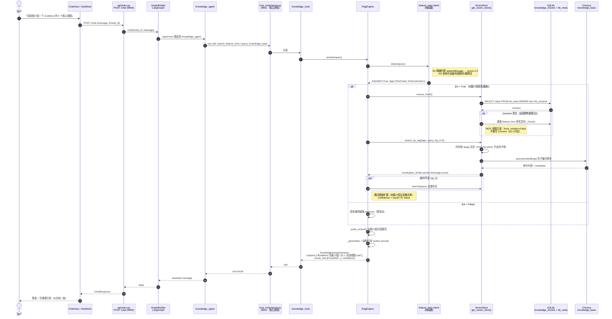

# 架构增补 · 功能介绍知识库化（P0-5 对话 grounding / wizard 分片 / 跨进程热更新）

> 文档版本：v1.0 · 2026-08-05
> 作者：高见远（架构师 · 第二评审人）
> 性质：**主架构文档的增补件，不替代主文档**
> 主文档：`docs/feature-intro-kb-architecture-2026-08-05.md`（同名架构师 v1.0）
> 上游：`docs/feature-intro-kb-prd-2026-08-05.md`（许清楚 v1.1）
> 代码基线复核：`core/vector_store.py`、`core/rag_engine.py`、`mcp_tools/tools/knowledge_tools.py`、`mcp_tools/server.py`、`scripts/start_all.py`、`api/main.py`、`api/config.py`、`.env`、`web/vite.config.ts`、`web/src/components/onboarding/*`

---

## 0. 评审结论（TL;DR）

主文档质量高，**F1–F7 七个既有事实全部核实无误**，尤其以下三点与我独立勘察结论完全一致，应予保留：

- **F1** `seed_all()` 无条件 `DELETE FROM knowledge_chunks` → 命名空间保护（`doc_id LIKE 'feature-intro/%'`）
- **F2** `VectorStore._load_chunks()` 的 `count()==0` 守卫 → 必须新增显式 reindex 通道
- **F4** 后端**无** `/api` 前缀（Vite proxy `rewrite` 剥掉）→ 后端注册 `/knowledge/feature-intro`

**双读取通道**（确定性 SQL 通道 ① + 语义检索通道 ②）是正确的核心决策。

但存在 **2 个 P0 阻断级缺口 + 1 个 P0 正确性缺陷**，按当前 T01–T05 交付将导致 **PRD P0-5 与 P1-2 验收不通过**：

| # | 缺口 | 严重度 | PRD 依据 | 当前状态 |
|---|---|---|---|---|
| **G1** | **P0-5 对话 grounding 全链路无任何任务承载** | 🔴 P0 阻断 | PRD §3 P0-5、验收标准 4 | T01–T05 中 `rag_engine.py` 唯一改动是「换单例」；无优先检索、无意图识别、无引用追溯、无 MCP 工具 |
| **G2** | **`wizard`/`step3` 分片无数据源**：`ChunkKind` 枚举与 17-chunk 清单均无 wizard，但 composable 契约要求 `step3` | 🔴 P0 阻断 | PRD §3 P0-1/P0-3、§4.2 | 契约自相矛盾；`Step3Content` 类型全文未定义 |
| **G3** | **热更新跨进程失效**：API(9900) 与 MCP(9901) 是**两个 `subprocess.Popen` 进程** | 🔴 P0 正确性 | PRD §3 P1-2、验收标准 5 | 主文档 F3/R2 的单例方案只解决**进程内**一致性 |
| G4 | PRD §5 **第 5 问未答**（待明确事项表仅覆盖 Q1–Q4） | 🟡 P1 | PRD §5.5 | 表格缺行 |
| G5 | 第三条时序图（对话 grounding）缺失 | 🟡 P1 | 交付要求 | 仅有 ingest / render 两条 |

**本增补件的处理原则：不新增任务**（尊重 ≤5 任务硬上限），全部缺口以**增量条目**折叠进既有 T01–T05，见 §6。

---

## 1. G1 · P0-5 对话 grounding 完整设计

### 1.1 问题定位：「入仓」不等于「优先」

主文档 §1.2 通道 ② 的表述是：分片镜像进 Chroma → `RagEngine.answer()` 自然会检索到。这是**被动可达**，而 PRD P0-5 要求的是**主动优先 + 可溯源**：

> PRD §3 P0-5：「作为对话中功能介绍类问答的**优先检索来源**；用户提问……**优先命中文档片段并支持引用追溯**」
> PRD §1 验收 4：「答案与文档一致、**可溯源到具体片段**，而非依赖泛化生成或过时写死话术」

被动可达在本代码基线下有 4 个具体失效点（均已在代码中核实）：

| 失效点 | 位置 | 后果 |
|---|---|---|
| `top_k` 默认 3，与 25 条电力规程分片**同池竞争** | `rag_engine.py:70`、`knowledge_tools.py:31` | 「介绍 5 个核心视图」可能被《变压器过载运行规程》挤占 |
| `_extract_entity_ids()` 正则全是电力设备词 | `rag_engine.py:38-44,350` | 功能介绍问答**抽不出实体** → 图谱扩展空转，还可能注入设备噪声 |
| `_calc_confidence()` 无图谱实体时封顶 **0.5** | `rag_engine.py:372-384` | 功能介绍问答结构性低分（`0.5*1 + 0 + 0`），劣于设备类问答 |
| `citations: list[str]` 存的是**原文 content 字符串** | `api/schemas/__init__.py:167` | **无法溯源到具体片段**——没有 section id / 标题 / 锚点，PRD 验收 4 直接不通过 |

### 1.2 解法：意图门控的「优先召回 + 结构化引用」

```
              用户 query
                  │
                  ▼
     ┌────────────────────────────┐
     │ core/feature_intro/intent.py│  纯函数 · 零 IO · 可单测
     │   detect(query) -> Intent   │
     └──────────┬─────────────────┘
                │
      hit=True  │  hit=False
      ┌─────────┴─────────┐
      ▼                   ▼
┌──────────────┐   ┌──────────────────┐
│ 优先召回通道  │   │ 现有通用 RAG 链路 │ ← 零改动、零回归
│ search_by_tag│   │ retrieve()       │
│('feature-    │   └──────────────────┘
│  intro')     │
│  top_k=5     │
└──────┬───────┘
       │ 命中不足 top_k 时用通用检索补位（不留空）
       ▼
┌──────────────────────────────────┐
│ _build_context() 功能介绍片段置顶 │
│ + 跳过图谱扩展（无设备实体）       │
│ + confidence 提升至 ≥0.75         │
└──────────────┬───────────────────┘
               ▼
        LLM 生成（强制引用）
               ▼
   KnowledgeAnswer.citations（人类可读）
 + KnowledgeAnswer.chunk_refs（结构化溯源）← 新增，默认 []，向后兼容
```

**关键设计：意图门控（gate）而非全局改排序。** 只有识别为功能介绍类问答时才走优先通道，一般电力知识问答**完全不受影响**——这正面回答了 PRD §5 第 5 问的「边界如何划分」。

### 1.3 意图识别规格（`core/feature_intro/intent.py`）

纯函数、无 IO、无 LLM 调用（避免给每轮对话加一次 LLM 往返）。

```python
@dataclass(frozen=True)
class FeatureIntroIntent:
    hit: bool
    score: float              # 0.0–1.0
    tags: tuple[str, ...]     # 建议优先过滤的 tag，如 ('kind:view',)
    matched: tuple[str, ...]  # 命中的关键词，用于日志与调试

def detect(query: str) -> FeatureIntroIntent: ...
```

**判定规则（加权计分，阈值 `score >= 0.5` 判 hit）：**

| 规则 | 权重 | 示例 |
|---|---|---|
| R1 精确命中场景 `starterMessage`（归一化后全等 / 编辑距离 ≤2） | **1.0**（直接 hit） | 「请给我介绍一下 GridMind 的 5 个核心视图」 |
| R2 产品名 + 功能疑问词共现 | 0.6 | `GridMind|灵枢电网` × `是什么\|有哪些\|介绍\|功能\|怎么用\|能做什么` |
| R3 视图/路由名词命中 | +0.3 | `核心视图\|路由\|对话视图\|监控视图\|灰度\|审计日志\|系统总览` |
| R4 引导词命中 | +0.3 | `新手引导\|引导\|教程\|tour\|上手\|演练场景` |
| R5 **反向排除**（命中则强制 `hit=False`） | — | 出现具体设备号 `#T1\|TR00x`、规程号 `DL/T\|GB/T\|Q/GDW`、故障词 `油温\|SF6\|局放\|跳闸` |

> R5 是防止「知识库检索」场景的种子问题（「解释一下《电力安全事故应急条例》…」）被误判为功能介绍问答的关键护栏。

**tag 推导**：R3 命中视图名 → `('kind:view', 'kind:overview')`；R4 命中引导词 → `('kind:scenario', 'kind:tour', 'kind:wizard')`；否则 → `('feature-intro',)` 全命名空间。

### 1.4 `VectorStore.search_by_tag()` 规格（`core/vector_store.py`）

```python
def search_by_tag(
    self,
    tags: Sequence[str],          # OR 语义
    query: str | None = None,     # 给定时在 tag 子集内做语义/关键词排序
    top_k: int = 5,
    require_all: bool = False,    # True = AND 语义
) -> list[dict[str, Any]]: ...
```

**实现要点（与主文档 §3.2 管道符约定完全对齐）：**

1. **在内存 `self._chunks` 上先做 tag 过滤**，不下推到 Chroma。理由：Chroma `where` 不支持子串匹配，而 tags 是管道分隔字符串 `|feature-intro|kind:view|view:chat|`；且本表量级百级，Python 过滤 <1ms。匹配用 `f"|{tag}|" in chunk_tags`，**首尾管道符必带**（同主文档 §7-T02-2 规避 `tour:chat` 误命中 `tour:chat-extra`）。
2. 过滤后若 `query` 非空：对**子集**做排序——优先复用 `_get_embedding` 余弦相似；embedding 不可用则退化到既有 `_keyword_fallback` 的中文 2-gram 打分（**复用，不重写**）。
3. 返回结构与 `search()` 一致（`content` / `metadata` / `score`），**额外保证 `metadata` 含 `doc_id`/`title`/`tags`/`kind`**，供 §1.6 引用追溯使用。
4. tag 过滤后为空 → 返回 `[]`，由调用方决定补位，**不抛异常**。

### 1.5 `RagEngine` 改造（`core/rag_engine.py`，增量 ~45 行）

```python
def retrieve(self, query, top_k=3, thread_id="default") -> RetrievalResult:
    intent = feature_intro_intent.detect(query)          # ← 新增
    if intent.hit:
        return self._retrieve_feature_intro(query, intent, top_k, thread_id)   # ← 新增分支
    ...                                                   # 既有逻辑，一行不改
```

`_retrieve_feature_intro()` 行为：

1. `self.vector_store.ensure_fresh()`（见 §3 跨进程一致性）
2. `chunks = vs.search_by_tag(intent.tags or ('feature-intro',), query, top_k=max(top_k, 5))`
3. 不足 `top_k` 时用 `vs.search(query, top_k)` 结果**去重补位**（保证不空转）
4. **跳过图谱扩展**：功能介绍无设备实体，`graph_entities=[]`、`graph_paths=[]`——同时省掉一次 Neo4j/NetworkX 往返
5. `confidence = max(0.75, base)`：命中专属命名空间且有 ≥1 片段时，置信度不应受「无图谱实体」结构性拖累（修正 §1.1 第 3 个失效点）
6. 复用既有 `rag_query` JSON 埋点，`backend` 字段写 `"feature_intro"`，与 `rag_engine.py:147` 风格一致，便于统一采集

**`_generate()` 的 system prompt 增量**（仅在 `intent.hit` 时附加）：

```
本次问答的权威来源是《GridMind 功能介绍》文档片段。
要求：① 只依据给定片段作答，不得引入片段外的产品描述；
② 必须在末尾以「参考：§<章节号> <标题>」列出所引片段；
③ 片段未覆盖的部分明确说明「文档未涵盖」，不要推测。
```

### 1.6 引用追溯：`chunk_refs`（向后兼容扩展）

`KnowledgeAnswer.citations: list[str]` 是既有契约，**不改类型**（`RagPanel.vue` 等消费方零回归）；新增可选字段：

```python
# api/schemas/__init__.py
class ChunkRef(BaseModel):
    doc_id: str        # feature-intro/view/chat
    section: str       # "2.1"
    title: str         # "对话视图 chat"
    kind: str          # view
    source: str        # docs/gridmind-feature-introduction.md
    score: float = 0.0

class RetrievalResult(BaseModel):
    ...                                   # 既有字段不动
    chunk_refs: list[ChunkRef] = []       # 新增，默认空 → 老调用方无感

class KnowledgeAnswer(BaseModel):
    ...                                   # 既有字段不动
    chunk_refs: list[ChunkRef] = []       # 新增，默认空
```

同时 `citations` 填**人类可读串**：`《GridMind 功能介绍》§2.1 对话视图 chat`，使既有 UI 无需改动即可看到可溯源文本。

> 为支持 `section` 字段，`gm-meta` 围栏块需增加 `section: "2.1"`（见 §2.2 schema 增量）。

### 1.7 MCP 工具暴露（`mcp_tools/tools/knowledge_tools.py` + `mcp_tools/server.py`）

新增工具，让 `knowledge_agent` 可显式调用（而非只能寄望通用检索）：

```python
async def search_feature_intro(
    query: str, tag: str | None = None, top_k: int = 5,
) -> dict[str, Any]:
    """检索 GridMind 功能介绍文档（产品功能/视图/引导类问题的权威来源）。"""
```

- 返回 `{"count": n, "chunks": [{doc_id, section, title, kind, content, score}], "source": "..."}`
- **docstring 即 LLM 的工具选择依据**，必须写明「产品功能/视图/引导类问题优先用本工具」
- 在 `mcp_tools/server.py` 按既有范式注册
- 顺带修复：既有 `search_knowledge_chunks` 的 `"score": 0.0` 恒为 0（`knowledge_tools.py:33`），本次改为透传真实分值

---

## 2. G2 · wizard / step3 分片补齐

### 2.1 缺陷确认

| 位置 | 内容 | 矛盾点 |
|---|---|---|
| 主文档 §1.2 难点 D | `kind` ∈ `overview \| view \| scenario \| tour` | **无 `wizard`** |
| 主文档 §3.2 chunk 清单 | 3 + 5 + 4 + 5 = **17** | **无 wizard 分片** |
| 主文档 §3.4 | `step3: ComputedRef<Step3Content>` | `Step3Content` **全文未定义**，且无数据源 |
| 主文档 §7 T01 | 要求覆盖「`Step3Monitor.vue` 硬编码（1 标题 + 1 描述 + 3 bullet）」 | 与 17-chunk 清单**互相矛盾** |
| 主文档 §7 T05 | `Step3Monitor.vue` 文案走 composable | 无后端数据可走 |

PRD §4.1 目录结构明确列有「第 5 章 引导流程 → 5.1 第三步 · 切换到实时监控视图」，且 PRD §4.2 要求保留 `wizard-step3` 标签。

### 2.2 修正：17 → 18 chunk，新增 `wizard` kind

**`ChunkKind` 增补：**

```python
# core/feature_intro/schema.py
ChunkKind = Literal["overview", "view", "scenario", "tour", "wizard"]
```

```ts
// web/src/types/featureIntro.ts
export type ChunkKind = 'overview' | 'view' | 'scenario' | 'tour' | 'wizard'
```

**chunk 清单修正（§3.2 表格）：**

| kind | 数量 | doc_id 示例 | 主要 tag |
|---|---|---|---|
| `overview` | 3 | `feature-intro/overview/1.1` | `kind:overview` |
| `view` | 5 | `feature-intro/view/monitor` | `view:monitor` |
| `scenario` | 4 | `feature-intro/scenario/monitor-overview` | `scenario:monitor-overview` |
| `tour` | 5 | `feature-intro/tour/chat` | `tour:chat` |
| **`wizard`** | **1** | **`feature-intro/wizard/step3`** | **`wizard:step3`** |
| **合计** | **18** | | |

> T01 验收命令的期望输出相应改为 `18 []`。

**文档第 5 章 `gm-meta` 示例（含 §1.6 要求的 `section` 字段）：**

```yaml gm-meta
id: step3
kind: wizard
section: "5.1"
title: 第三步 · 切换到实时监控视图
sort_order: 510
tags: [wizard:step3]
payload:
  ctaText: 前往实时监控
  ctaRoute: /monitor?tour=monitor
  ctaHint: 完成后点底部"完成，开始体验"统一结束引导。
  bullets:
    - icon: Monitor
      title: 设备实时列表
      description: 按健康分排序 · 严重设备置顶 · 颜色 + 图标 + 文字码四重区分。
    - icon: DataAnalysis
      title: 遥测趋势
      description: 打开任意设备抽屉 → 切换 6h / 24h / 48h 时间窗 → 查看温度/负载/电流曲线。
    - icon: WarningFilled
      title: 异常清单
      description: z-score 异常检测 · 自动标注严重程度 · 一键跳到 HITL 审批页。
```

**前端类型补全（主文档 §3.4 缺失项）：**

```ts
export interface Step3Bullet {
  icon: string          // 图标"名字符串"，组件侧映射（遵循主文档 §8-K6）
  title: string
  description: string
}

export interface Step3Content {
  title: string
  description: string
  bullets: Step3Bullet[]
  ctaText: string
  ctaRoute: string
  ctaHint: string
}
```

> 图标策略与主文档 §8-K6 一致：`payload` 只存名字符串，`Step3Monitor.vue` 侧用 `@element-plus/icons-vue` 名称→组件字典解析。现有 3 个图标 `Monitor`/`DataAnalysis`/`WarningFilled` 需登记进字典（当前 `Step1Scenario.vue:82` 的 `ICON_MAP` 只有 4 个场景图标，**不含这 3 个**）。

---

## 3. G3 · 跨进程热更新一致性（主文档 F3 的延伸）

### 3.1 问题：单例只解决进程内，而这是两个进程

主文档 F3 / R2 指出 `VectorStore` 有三个构造点，方案是引入 `get_vector_store()` 进程级单例。**方向正确但不充分**——已核实 `scripts/start_all.py`：

```python
# scripts/start_all.py:50-64   MCP 服务器
proc = subprocess.Popen([sys.executable, "-c", "from mcp_tools.server import start; start()"], ...)
# scripts/start_all.py:66-85   API 服务器
proc = subprocess.Popen([sys.executable, "-m", "uvicorn", "api.main:app", "--port", ...], ...)
```

**API(9900) 与 MCP(9901) 是两个独立 OS 进程。** 因此：

| 通道 | 归属进程 | reload 后状态 |
|---|---|---|
| ① 前端引导（`GET /knowledge/feature-intro` 直查 SQLite） | API 9900 | ✅ 立即最新 |
| ② 对话 grounding（`knowledge_tools._rag_engine` → `VectorStore._chunks`） | **MCP 9901** | ❌ **永远陈旧** |

`VectorStore._chunks` 是构造时一次性加载的 Python list（`vector_store.py:93-103`），MCP 进程内**没有任何重新加载路径**。API 进程刷新自己的单例，对 MCP 进程零影响。

> 后果正是主文档 R2 描述的最难排查场景，但**范围比其预估更大**：不是「只生效一半」，而是**对话通道 100% 不生效**，且重启 API 也没用——必须重启 MCP。这直接违反 PRD 验收 5「不重启服务……更新对对话问答与引导展示**同时**生效」。

### 3.2 解法：revision 戳 + 惰性自检（无 IPC，~35 行）

不引入消息队列、不引入 IPC，用**共享 SQLite 作为唯一同步点**：

**1) 新增轻量元表**（并入主文档 `_ensure_knowledge_chunks_columns()` 同一次迁移）：

```sql
CREATE TABLE IF NOT EXISTS kb_meta (
    key   TEXT PRIMARY KEY,
    value TEXT NOT NULL
);
-- 每次 ingest 成功后：kb_revision = 单调递增整数
```

**2) `FeatureIntroService.ingest()` 成功提交后**（与分片写入**同一事务**）执行
`INSERT INTO kb_meta(key,value) VALUES('kb_revision',?) ON CONFLICT(key) DO UPDATE SET value=?`。

**3) `VectorStore.ensure_fresh()`**：

```python
_REVISION_CHECK_INTERVAL_S = 5.0     # 节流：最多每 5s 查一次

def ensure_fresh(self) -> bool:
    """惰性检测知识库修订号；有变化则重载 _chunks 与 Chroma 索引。

    跨进程安全：以共享 SQLite 的 kb_meta.kb_revision 为唯一事实源。
    返回 True 表示本次发生了重载。
    """
    now = time.monotonic()
    if now - self._last_revision_check < _REVISION_CHECK_INTERVAL_S:
        return False
    self._last_revision_check = now
    remote = self._read_revision()          # 单行 SELECT，<1ms
    if remote == self._revision:
        return False
    self._load_chunks(force_reindex=True)   # 绕开 count()==0 守卫（F2）
    self._revision = remote
    return True
```

**4) 调用点**：`RagEngine._retrieve_feature_intro()` 入口、`search_by_tag()` 入口各调一次。开销 = 每 5 秒一次单行 SELECT，可忽略。

**5) 失败降级**：`kb_meta` 不存在 / SELECT 异常 → `except` 吞掉并返回 `False`，退化为当前行为（陈旧但可用），**绝不因自检失败而中断问答**。

> 附带收益：`kb_revision` 同时解决主文档 §5.1「启动自动入仓的判定」——比对 revision 比比对 `doc_version` 字符串更可靠（文档内容改了但作者忘了升版本号的情况同样能被 content hash 驱动的 revision 捕获）。

### 3.3 Chroma 多进程写入的补充约束

`.env` 中 `CHROMA_PERSIST_DIR=data/chroma_db` → 两个进程各自 `PersistentClient` 打开**同一目录**。chromadb 对同目录多进程并发写入无保证。

**约定（强制，写入 §8 共享知识）：**

- **只有 API 进程（9900）写 Chroma**（`reindex_namespace()` 仅由 ingest 链路调用，而 ingest 只在 API 进程与 CLI 中发生）
- **MCP 进程（9901）只读 Chroma**：`ensure_fresh()` 在 MCP 侧调用 `_load_chunks(force_reindex=False)`，只刷新 SQLite 侧的 `_chunks`（供 `search_by_tag` 的内存过滤 + 关键词兜底），**不重写 Chroma**
- 因此 `_load_chunks(force_reindex: bool)` 需要区分「重载内存」与「重建索引」两档
- CLI `seed_feature_intro.py` 属第三个写入者 → 文档中注明**服务运行期请用 `POST .../reload`，勿并发跑 CLI**

---

## 4. G4 · PRD §5 第 5 问答复（补主文档 §5 表格缺行）

| # | PRD 问题 | 架构默认方案 | 可选分支 | 切换成本 |
|---|---|---|---|---|
| **5** | **对话功能介绍问答如何优先 grounding 到该文档？是否强制引用？与一般电力知识问答的边界？** | **意图门控 + tag 优先召回**（§1.2）：`detect()` 判定为功能介绍类才走 `search_by_tag('feature-intro')` 优先通道，`top_k=5`，不足时通用检索补位；**强制引用**——system prompt 要求列出「§章节号 标题」，并通过 `chunk_refs` 结构化返回。**边界**由 R5 反向排除规则划定：出现设备号 / 规程号 / 故障词一律判非功能介绍，走原通用链路，**一般电力问答零影响** | ① 纯 LLM 意图分类（准确率更高，但每轮多一次 LLM 往返 + 延迟）；② 全局提高 feature-intro 分片权重（实现最简，但会污染一般问答） | 低。`intent.py` 是纯函数插拔点，换成 LLM 分类只需替换 `detect()` 实现，上下游契约不变 |

**补充：本期"强制引用"的落地边界**——`chunk_refs` 后端已返回，但前端 `RagPanel.vue` / `MessageBubble.vue` 的引用 UI 渲染**不在本期 5 个任务内**（PRD 未列为 P0）。本期以 `citations` 中的人类可读串 `《GridMind 功能介绍》§2.1 对话视图 chat` 达成"可溯源"验收，结构化 UI 留待后续迭代。

---

## 5. G5 · 时序图三 · 对话 grounding

> 同步落盘：`docs/feature-intro-kb-sequence-grounding.mermaid`



---

## 6. 任务分解增量（**不新增任务**，折叠进 T01–T05）

严格遵守 ≤5 任务硬上限。以下为对主文档 §7 的**增量条目**：

### T01 增量（文档 + 解析器 + 数据层）

- `core/feature_intro/schema.py`：`ChunkKind` 增加 `"wizard"`；`gm-meta` 增加 `section: str` 字段（供 §1.6 引用溯源）
- `docs/gridmind-feature-introduction.md`：补**第 5 章 引导流程 / 5.1**（wizard 分片），**总数 17 → 18**
- `mcp_tools/db/database.py`：本次迁移**一并**建 `kb_meta` 表（§3.2）
- ⚠️ 验收命令期望输出改为 `18 []`
- 新增校验：`kind=='wizard'` 必须有 `payload.bullets`（长度 3）与 `ctaRoute`

### T02 增量（仓储 + 服务 + 向量层）

- `core/vector_store.py`：新增 **`search_by_tag()`**（§1.4）+ **`ensure_fresh()`**（§3.2）；`_load_chunks()` 增加 `force_reindex: bool` 参数区分「重载内存」与「重建索引」（§3.3）
- `core/feature_intro/service.py`：`ingest()` 成功后**在同一事务内** bump `kb_meta.kb_revision`
- 新增 `core/feature_intro/intent.py`（纯函数，§1.3）——放在 T02 是因为它零依赖，可与仓储并行开发
- ⚠️ 约定：**只有 API 进程与 CLI 写 Chroma**，MCP 进程只读（§3.3）

### T03 增量（API + grounding 接线）

- `core/rag_engine.py`：`retrieve()` 增加意图门控分支 + `_retrieve_feature_intro()`（§1.5）；`_generate()` 强制引用 prompt
- `api/schemas/__init__.py`：新增 `ChunkRef`；`RetrievalResult` / `KnowledgeAnswer` 增加 `chunk_refs: list[ChunkRef] = []`（**默认空，向后兼容**）
- `mcp_tools/tools/knowledge_tools.py`：新增 `search_feature_intro()`；修复 `search_knowledge_chunks` 的 `score` 恒 0
- `mcp_tools/server.py`：注册新工具
- **验收增量**：`python -c` 直调 `RagEngine().answer('请给我介绍一下 GridMind 的 5 个核心视图')` → `confidence >= 0.75`、`chunk_refs` 非空且全部 `doc_id.startswith('feature-intro/')`；对照组 `answer('#T1 主变压器油温异常怎么处理')` → `chunk_refs == []`（证明边界隔离生效，一般问答零回归）

### T04 增量（前端读取层）

- `web/src/types/featureIntro.ts`：`ChunkKind` 加 `'wizard'`；补 **`Step3Content`** / `Step3Bullet` 类型定义（§2.2）+ `FALLBACK_STEP3` 常量（从 `Step3Monitor.vue:3-38` 原样搬运）

### T05 增量（组件接入）

- `Step3Monitor.vue` 的 3 个图标 `Monitor` / `DataAnalysis` / `WarningFilled` 需登记进图标字典（现有 `Step1Scenario.vue:82` 的 `ICON_MAP` 仅含 4 个场景图标，**不含这 3 个**，直接接 composable 会渲染成默认图标）
- **端到端增量验收**：`POST /knowledge/feature-intro/reload` 后，**不重启任何进程**，在对话中重新提问功能介绍问题，答案反映新文案（验证 §3.2 跨进程 revision 自检真实生效）——这是 PRD 验收 5 的直接用例

> 任务规模影响：T02 +2 方法、T03 +1 分支 +1 工具、T01 +1 分片。**总任务数仍为 5**。

---

## 7. 共享知识增补（并入主文档 §8）

| Key | 约定 |
|---|---|
| **K-A1** | 意图门控是**单一判定点**：只有 `core/feature_intro/intent.detect()` 能决定是否走优先通道。禁止在 `knowledge_agent` prompt、前端、MCP 工具中各写一套关键词判断 |
| **K-A2** | `tag` 匹配一律用 `f"\|{tag}\|" in tags_str`（首尾管道符），**后端 SQL / 后端内存 / 前端过滤三处必须一致** |
| **K-A3** | `chunk_refs` 为**新增可选字段**，默认 `[]`。所有既有消费方（`RagPanel.vue`、`knowledge_agent`）不得因该字段缺失而报错 |
| **K-A4** | **Chroma 单写者原则**：只有 API 进程（9900）与 CLI 写 Chroma；MCP 进程（9901）只读。违反会导致索引损坏 |
| **K-A5** | `kb_meta.kb_revision` 是跨进程知识库新鲜度的**唯一事实源**。任何修改 `knowledge_chunks` 的路径都必须在同一事务内 bump 它 |
| **K-A6** | `ensure_fresh()` 的任何异常都必须被吞掉并降级为「使用当前内存数据」，**绝不允许因新鲜度自检失败而中断对话** |
| **K-A7** | 图标一律以**名字符串**跨层传递；`payload` 不含组件引用。新增图标必须同步登记到前端 `ICON_MAP` |

---

## 8. 风险登记增补（并入主文档 §10）

| ID | 风险 | 影响 | 缓解 | 承接任务 |
|---|---|---|---|---|
| **R6** | **跨进程热更新失效**：API 刷新单例，MCP 进程 `_chunks` 永久陈旧 | **高**——PRD 验收 5 直接不通过，且现象为「引导文案更新了但对话答案没变」，极难定位 | `kb_meta.kb_revision` + `ensure_fresh()` 惰性自检（§3.2） | T02 / T03 |
| **R7** | 意图误判：一般电力问答被判为功能介绍，检索被 18 个功能分片污染 | 中 | R5 反向排除（设备号/规程号/故障词）+ T03 对照组验收用例 | T03 |
| **R8** | 意图漏判：功能介绍问答走通用链路，被 25 条电力规程挤占 | 中 | R1 对 4 个 `starterMessage` 精确匹配兜底（引导场景的主路径 100% 命中） | T03 |
| **R9** | 两进程并发写同一 Chroma 目录导致索引损坏 | 中 | K-A4 单写者原则；CLI 与在线 reload 不得并发 | T02 |
| **R10** | wizard 分片遗漏导致 `step3` 契约悬空、Step3Monitor 渲染空白 | **高** | §2.2 补 `wizard` kind，chunk 数 17→18，补 `Step3Content` 类型 | T01 / T04 |

---

## 9. 与主文档的关系说明

本增补件**不修改**主文档任何既有决策，仅做加法：

| 主文档决策 | 本件态度 |
|---|---|
| 双读取通道（SQL 精确 + 向量语义） | ✅ 完全采纳，P0-5 建在通道 ② 之上 |
| `feature-intro/` 命名空间 + DELETE 收窄（F1） | ✅ 完全采纳 |
| 管道符 tag 编码 `\|tag\|` | ✅ 完全采纳并扩展到内存过滤 |
| `get_vector_store()` 进程级单例（F3） | ✅ 采纳，**并补跨进程维度**（§3） |
| 后端无 `/api` 前缀（F4） | ✅ 完全采纳 |
| 扁平响应无包封（F5） | ✅ 完全采纳 |
| 复用 `verify_admin_token`（F7） | ✅ 完全采纳 |
| 5 任务上限 | ✅ 严格遵守，全部折叠为增量 |
| chunk 数 17 | ⚠️ **修正为 18**（补 wizard） |
| `ChunkKind` 四值枚举 | ⚠️ **修正为五值**（补 wizard） |

**建议合并方式**：由主架构师将 §1–§5 作为主文档新增章节（§4.4 时序三、§5 表格补第 5 行、§3.2 清单改 18），§6 增量并入 §7 各任务，§7/§8 并入主文档 §8/§10。合并后本件可归档。
