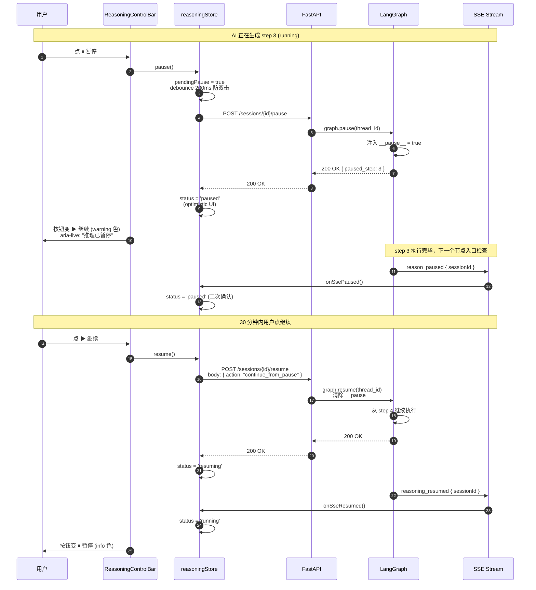
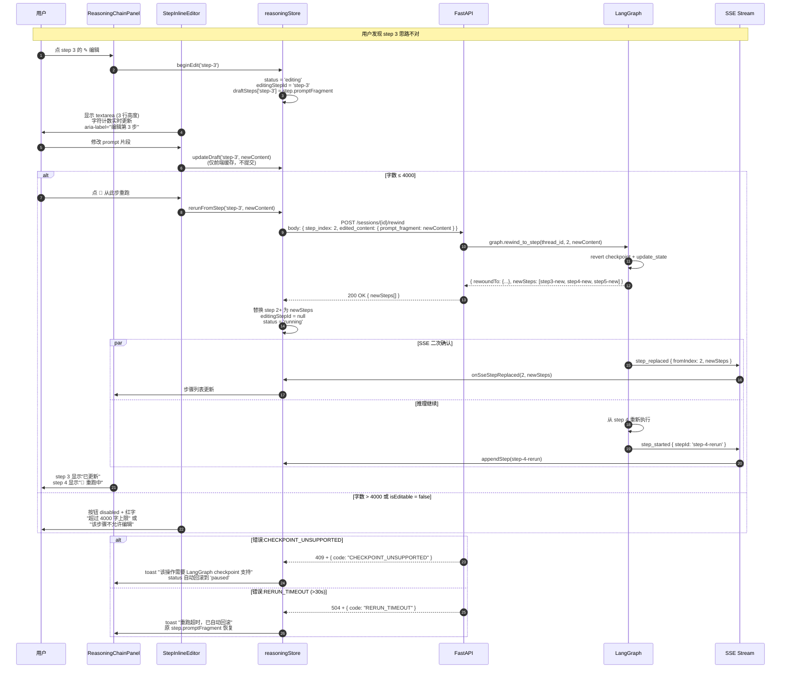
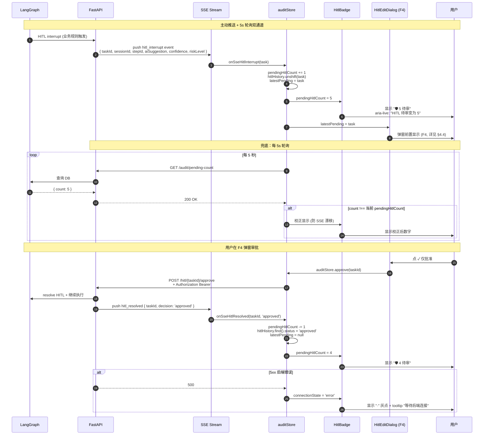
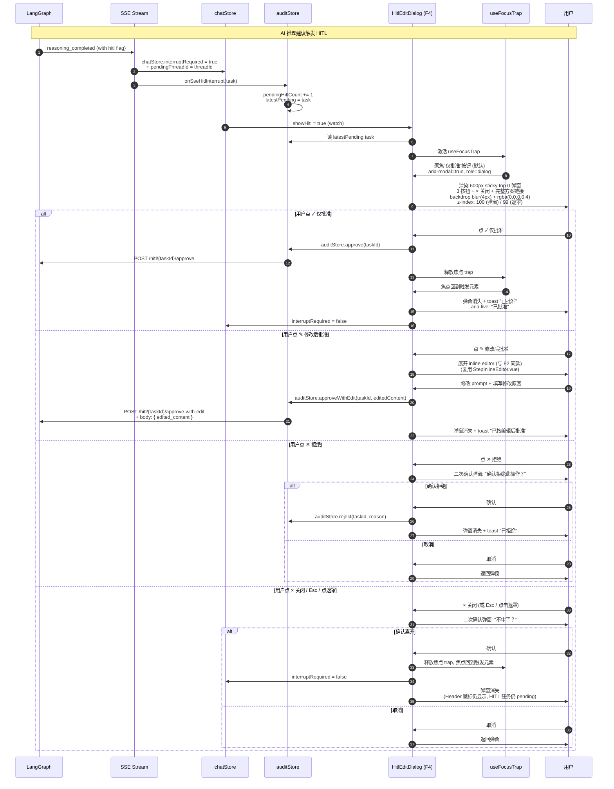
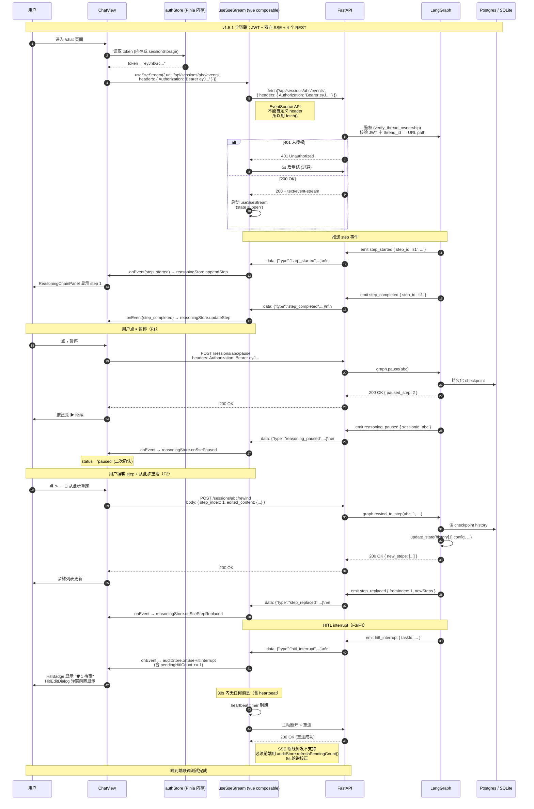
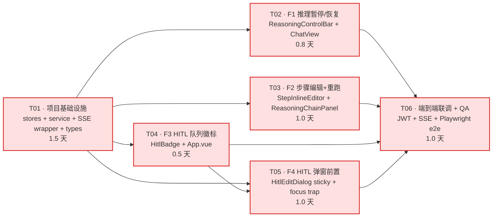

# GridMind v1.5.1 前端架构设计 · F1-F4 实施 + 端到端联调

> **作者** 高见远（架构师 Bob）
> **审阅** 待主理人齐活林 + 产品经理许清楚
> **日期** 2026-08-04
> **文档版本** v1.0
> **目标版本** GridMind v1.5.1（前端 UI 改进第二轮）
> **基线版本** GridMind v1.5.0（P0-1/2/4 已上线，55/55 测试 PASS）
> **配套文档**
> - PRD：`docs/ui-v151-p0-3-prd-2026-08-04.md`（许清楚 v1.0）
> - 后端架构：`docs/langgraph-backend-v151-architecture-2026-08-04.md`（高见远 v1.0，已交付 T01-T06）
> - 后端 QA：`docs/langgraph-backend-v151-qa-report-2026-08-04.md`（严过关 v1.0，PARTIAL 评级 98/98 PASS + 3 安全风险）
> - v1.5.0 架构：`docs/ui-v150-architecture-2026-08-04.md`（前序基线）
> **本版本范围** **F1 推理暂停/恢复 + F2 步骤编辑+重跑 + F3 HITL 队列徽标 + F4 HITL 弹窗前置 + 端到端联调（JWT + EventSource + SSE）**——四大诉求全部在前端改造
> **关键风险**
> 1. **EventSource API 不能自定义 header**（浏览器硬限制）→ 必须用 `fetch()` + `ReadableStream` 替代（详见 §1.5 + §6.2）
> 2. **QA 报告 R-X2：后端 SSE `/sessions/{id}/events` 无任何鉴权**（QA P0 风险）→ 前端必须等后端先补 `Depends(verify_thread_ownership)` 才能联调
> 3. **JWT 不能放 localStorage**（防 XSS）→ 临时放内存（refresh 时重新拿）或 httpOnly cookie（需后端配合）
> 4. **focus trap** 必须自实现（不用第三方库，保持依赖最小化）
> **工作量预估** 5.5 人天（前 4F 共 4 + 联调 1 + 验收 0.5）

---

## 0. 元信息

| 项 | 内容 |
|---|---|
| 文档版本 | v1.0 |
| 日期 | 2026-08-04 |
| 作者 | 高见远（架构师） |
| 上游依赖 | PRD §3-§5 功能详述 + §4 状态机 + §6 时序图；后端架构 §2.1-§2.6 + §4 Schemas；QA 报告 R-X1/R-X2/R-X3 安全风险 |
| 下游交付 | 前端工程师沈知行 + QA 林知夏 |
| 本版本范围 | 仅前端 v1.5.1 F1-F4 + 联调（F1-F4 = 4 个 UI 功能；联调 = EventSource + JWT + 后端 6 个新 SSE 事件） |
| 不在范围 | 后端 LangGraph checkpoint 改造（已交付）、前端 v1.5.1 之外功能、Neo4j 知识图谱（M0 单独项目）|
| 与 v1.5.0 关系 | 增量改造：复用 7 个 store 中的 7 个（chatStore/display/metrics/modelStore/monitor/onboarding/theme），新增 `reasoning` + `audit` 共 2 个 store；不破坏 5 路由；不破坏 onboarding wizard |
| 验收口径 | 见 §5 任务列表验收 + §8 共享知识 |

### 0.1 上游决策汇总（8 项对齐）

| # | 来源 | 决策 | 本架构落地 |
|---|---|---|---|
| 1 | 后端架构 §2.1 | checkpoint 持久化 `MemorySaver → AsyncSqliteSaver` | 前端只关心 SSE 重连策略（不涉及 checkpoint） |
| 2 | 后端架构 §2.2 | pause 注入 `__interrupt__` 软信号 | F1 前端 pause 调用 `POST /sessions/{id}/pause` |
| 3 | 后端架构 §2.2 | rewind `graph.update_state(history, as_node=...)` | F2 前端 rewind 调用 `POST /sessions/{id}/rewind` |
| 4 | PRD §7.1 | TTL 默认 30 分钟 | 前端 checkpoint TTL 仅显示"剩余 N 分钟"提示，不主动清理 |
| 5 | 后端架构 §2.4 | HITL 表加 3 列 `risk_level / pause_count / edit_count` | F4 前端 F4 弹窗显示 `risk_level` tag |
| 6 | 后端架构 §2.5 | SSE 6 个新事件 type | 详见 §3.7 EventSource wrapper 适配 |
| 7 | 后端架构 §2.6 | 多 tab 锁 `threading.Lock` | 前端`onSseHitlResolved` 后 `pendingHitlCount -= 1` 自动同步 |
| 8 | QA R-X2 | 后端 SSE 鉴权缺失（QA PARTIAL） | 前端代码先按 JWT 注入写，等后端补鉴权联调（T06 任务明确前提）|

### 0.2 与 v1.5.0 兼容性核对

| 维度 | 兼容性 | 备注 |
|---|---|---|
| 5 路由（`/`, `/monitor`, `/grayscale`, `/audit`, `/system` + `/onboarding`）| ✅ 零变更 | 仅 `/audit` 增加 `?filter=pending` query 参数支持（已在 HitlBadge 处理） |
| 7 个现有 store | ✅ 零冲突 | 新增 `reasoning` + `audit` 共 2 个，与 onboarding/display 完全独立 |
| driver.js@^1.8.0 单页 tour | ✅ 不冲突 | F4 弹窗优先级 > tour；tour 自动暂停 |
| Element Plus 组件库 | ✅ 零新增 | 复用 `el-dialog` / `el-button` / `el-tooltip` / `el-tag` |
| 双主题（dark/light） | ✅ 兼容 | 徽标/弹窗/banner 色调适配 |
| 4 palette 色盲模式 | ✅ 兼容 | 复用 `StatusIcon` + `ColorBlindModeToggle` |
| Web Speech / 国际化 | ✅ 不涉及 | 中文唯一 |
| `displayMode`/`colorBlindPalette` localStorage | ✅ 不冲突 | reasoning/audit 不复用 key |

---

## 1. 实现方案

### 1.1 F1 · 推理暂停 / 恢复

#### 1.1.1 核心设计

**用户场景**：AI 正在生成推理步骤时，调度员按"⏸ 暂停"按钮，前后端协调在**当前 step 完成后**（软中断）暂停，不破坏已完成步骤。

**前端 UI 改造点**：
- 新组件 `web/src/components/controls/ReasoningControlBar.vue`（放在 ChatView 顶部，welcome 期间显示在 toolbar 旁，messages 期间显示在消息流底部）
- 状态来源：`reasoningStore.status`（8 状态：`idle/running/paused/editing/resuming/completed/error/aborted`）
- 视觉规范：按 PRD §3.1.2 表（Running 蓝 / Paused 黄 / Editing 紫 / Resuming 蓝 / Completed 绿 / Error 红 / Aborted 灰）

**核心 Actions**（reasoningStore）：
```typescript
// 暂停（optimistic UI + 后端 ack）
async pause(): Promise<void>
  → reasoningStore.pendingPause = true（debounce 200ms 防双击）
  → POST /sessions/{id}/pause
  → 200 OK { pausedAtStep } 后 status = 'paused'
  → SSE reasoning_paused 事件二次确认（防丢包）

// 恢复（仅当 status === 'paused' 才允许点击）
async resume(): Promise<void>
  → POST /sessions/{id}/resume
  → status = 'resuming'
  → SSE reasoning_resumed 后 status = 'running'

// 中止（强制）
async abort(): Promise<void>
  → POST /sessions/{id}/abort { reason }
  → status = 'aborted'
```

**状态机约束**（详见 PRD §5.1）：
- `paused` 后所有 `running` step 应转 `pending`（防"挂起 step 还在跑"的悬挂状态）
- `editing` 与 `running` 互斥（不能编辑时还在跑）
- `aborted` 终态冻结（steps 不再变更）

#### 1.1.2 SSE 适配

新增 6 个 SSE 事件中的 4 个用于 F1：

| 事件 | payload | 前端处理 |
|---|---|---|
| `step_started` | `{ stepId, index, name, description, promptFragment }` | `appendStep` |
| `step_completed` | `{ stepId, output, durationMs }` | `updateStep` |
| `step_failed` | `{ stepId, error }` | `updateStep` + status = 'error' |
| `reasoning_paused` | `{ sessionId, pausedAtStep }` | `onSsePaused` + status = 'paused' |
| `reasoning_resumed` | `{ sessionId }` | `onSseResumed` + status = 'running' |
| `reasoning_completed` | `{ sessionId, finalOutput }` | `markCompleted` |
| `reasoning_error` | `{ sessionId, error }` | `markError` |

> 详见后端架构 §2.5 6 个新事件定义。

#### 1.1.3 边界条件

| 场景 | 行为 |
|---|---|
| SSE 断连 | `EventSource wrapper` 自动重连（断 1s / 5s / 15s / 30s 退避策略）|
| 暂停后刷新页面 | `localStorage.reattach_thread_id` 暂存 sessionId，重连后调 `GET /sessions/{id}/state` 恢复 |
| 用户连续点 ⏸ 2 次 | `pendingPause` debounce 200ms 拒绝第二次 |
| 切换路由离开 `/chat` | el-message-box 确认"推理将中止"，确认后调 `abort()` |

---

### 1.2 F2 · 步骤编辑 + 从此步重跑

#### 1.2.1 核心设计

**用户场景**：调度员在 ReasoningChainPanel 中发现某 step 的思路不对，希望修改 prompt 片段后从该步重跑，而不是从头再来。

**核心挑战**：前端需要支持 **inline editor** 嵌入 ReasoningChainPanel，每 step 独立编辑态（互斥）。

**编辑范围约束**（PRD §3.2.3）：
- ✅ User 内容片段：可编辑（"人审"最直接入口）
- ❌ Assistant 已生成内容：不可编辑（防"改 AI 答案"绕过审计）
- ❌ Tool call JSON：v1.5.1 不可编辑（v1.5.2 多智能体可视化再开）
- ❌ System prompt：不可编辑（安全考虑）

**核心 Actions**（reasoningStore）：
```typescript
// 进入编辑态
beginEdit(stepId: string): void
  → status = 'editing', editingStepId = stepId
  → 显示 <StepInlineEditor>
// 编辑内容（仅前端缓存草稿）
updateDraft(stepId: string, content: string): void
  → draftSteps[stepId] = content
// 取消编辑（discard）
cancelEdit(): void
  → editingStepId = null, draftSteps = {}, status = 'paused' (从 editing 回去)
// 真正重跑（前端核心 F2 入口）
async rerunFromStep(stepId: string): Promise<void>
  → POST /sessions/{id}/rewind
       body: { step_index, edited_content: draftSteps[stepId] }
  → 200 OK { updatedSteps[] } 后 status = 'running'
  → SSE step_replaced { fromIndex, newSteps[] } 二次确认
```

**组件层次**：
```
ReasoningChainPanel.vue (顶层，来自 v1.5.0 三层推理链)
└── <el-collapse-item name="...">  // 每步
    └── StepRow.vue (新组件，薄壳：只读态/编辑态切换)
        ├── ReadOnlyView.vue (只读态：原 step 渲染)
        └── StepInlineEditor.vue (编辑态：textarea + 3 行高度)
```

**a11y**（PRD §3.2.5）：
- textarea `aria-label="编辑第 N 步：{step name}"` + `aria-describedby="char-count"`
- 字数计数器 `aria-live="polite"`：`{count}/4000`
- `🔄 从此步重跑` 按钮 `aria-busy` 切换 + loading spinner

#### 1.2.2 错误处理

| 错误 | 后端 code | 前端 UI |
|---|---|---|
| checkpoint 不支持 | `CHECKPOINT_UNSUPPORTED` | toast "该操作需要 LangGraph checkpoint 支持。请联系管理员升级 LangGraph 版本至 ≥ 0.2"，按钮禁用 |
| 步骤不可编辑 | `STEP_NOT_EDITABLE` | toast "该步骤不允许编辑（system/tool 类型）" |
| 编辑后 schema 不兼容 | `EDIT_SCHEMA_MISMATCH` | toast "修改的内容与下游步骤不兼容，已恢复原内容" |
| 重跑超时 30s | `RERUN_TIMEOUT` | reasoning 状态自动转回 paused，原 step 恢复 |

---

### 1.3 F3 · HITL 队列徽标

#### 1.3.1 核心设计

**用户场景**：App.vue Header 添加一个"🛡 N 待审"圆形徽标，调度员任何时刻都能看到有多少 HITL 任务待审。

**数据来源双通道**（PRD §3.3.2）：
- **主动推送**：SSE `hitl_interrupt` / `hitl_resolved` → auditStore 即时更新
- **轮询兜底**：每 5 秒 `GET /audit/pending-count`（防 SSE 断连漂移）
- **首屏加载**：`auditStore.hydrate()` 在 main.ts mount 前调一次

**`auditStore` state**：
```typescript
interface AuditState {
  pendingHitlCount: number           // 当前待审任务数
  hitlHistory: HitlTask[]            // 最近 50 条缓存（按需分页）
  lastSyncAt: string | null          // ISO 上次同步时间
  connectionState: 'connected' | 'disconnected' | 'error'
  isHydrated: boolean                // hydrate() 是否完成
}
```

**actions**：
```typescript
// 轮询（5s 间隔；badge 显示 ⏳）
async refreshPendingCount(): Promise<void>
// SSE 主动推送（断 1s 重连策略）
onSseHitlInterrupt(task: HitlTask): void  // pendingHitlCount += 1
onSseHitlResolved(taskId: string, decision: HitlTask['status']): void  // pendingHitlCount -= 1
// 首屏
hydrate(): void
startPolling(): void  // setInterval 5000
stopPolling(): void
// HITL 三按钮（用于 F4 弹窗）
async approve(taskId: string): Promise<void>
async reject(taskId: string, reason?: string): Promise<void>
async approveWithEdit(taskId: string, editedContent: string): Promise<void>
```

#### 1.3.2 边界条件

| 场景 | 行为 |
|---|---|
| 后端 5xx | 徽标显示 "·" 灰点 + tooltip "等待后端连接" |
| 待审 > 99 | 显示 "99+"，实际值保留在 store |
| 用户在 `/audit` 时 | 当前 in-flight audit 列表自动刷新，不主动跳转 |
| 多 tab | 各 tab 徽标独立计数（前端无跨 tab 同步需求） |

#### 1.3.3 视觉规范（PRD §3.3.1）

| 维度 | 值 |
|---|---|
| 位置 | Header 右上角（在 OnboardingTrigger 之后，BackgroundModeToggle 之前） |
| 形状 | pill 圆角矩形 |
| 尺寸 | 高 22px，padding 0 8px |
| 背景 | `--status-critical-fg` 红 |
| 前景 | 白色 |
| 字体 | `--font-family-mono`，size 12px，weight 600 |
| 文案 | `🛡 {N} 待审` 或 `🛡 99+ 待审` |
| hover | 背景色 +10% + `--shadow-glow-critical` |

**a11y**：
- `<button>` `aria-label="HITL 队列：5 个待审任务，点击进入审计页"`
- `aria-live="polite"` + 数字变化时自动播报

---

### 1.4 F4 · HITL 弹窗前置

#### 1.4.1 核心设计

**用户痛点**：现有 HitlEditDialog 作为 Element Plus `el-dialog` 是 modal 模式，调度员希望 HITL interrupt 触发后，弹窗能"前置"显示在对话流顶部（**不是 modal 蒙层**），不阻挡对话历史。

**关键决策（PRD §3.4.2）**：
- **位置**：`position: sticky; top: 0; z-index: 100` 在对话流外层容器内（**不是** viewport-modal 遮罩）
- **宽度**：600px（`< dialog` spec），水平居中（左右 `calc((100% - 600px) / 2)`）
- **遮罩**：`backdrop-filter: blur(4px) + rgba(0,0,0,0.4)`，z-index 99（在弹窗下、其他内容上）
- **弹窗 z-index 层级**：`tab bar 50 → 主内容 1-10 → 弹窗遮罩 99 → 弹窗 100 → toast 1000`

**改造范围**（HitlEditDialog.vue）：
1. **替换** el-dialog 为自定义 div（class="hitl-edit-dialog"）+ 完整 a11y 属性
2. **新增** sticky positioning（`position: sticky; top: 0;`）
3. **新增** backdrop blur 遮罩层（z-index 99）
4. **新增** focus trap（自实现，~30 行 JS，详见 §6.4）
5. **三按钮保留**：拒绝 / 仅批准 / 修改后批准（调用 auditStore `reject / approve / approveWithEdit`）
6. **二次确认**：× 关闭 / 点击遮罩 / Esc 键 → 弹"不审了？"确认框（避免误操作）

**a11y 严格实现**（PRD §3.4.5）：
| 属性 | 值 |
|---|---|
| `role` | `dialog` |
| `aria-modal` | `true` |
| `aria-labelledby` | `hitl-dialog-title` |
| 焦点管理 | 开启 → 聚焦到"仅批准"按钮（最常用）；关闭 → 回到原触发元素 |
| 焦点 trap | Tab / Shift+Tab 在 3 按钮 + × 按钮间循环 |
| `aria-live` | `assertive` "HITL 中断：请审批" |

**v-if vs v-show 决策**（详见 §6.6）：
- 用 `v-if="showHitl"`（不是 v-show）—— 关闭后彻底销毁，焦点自动释放，无需手动管理
- 配合 `TransitionGroup` + CSS transition 实现淡入淡出

#### 1.4.2 风险与降级

如果后端 HITL interrupt + `chatStore.interruptRequired = true` 时序有问题，会出现：
- **弹窗空内容**（`auditStore.latestPending` 还没拉到）→ 增加 `loading` 状态，弹窗骨架屏兜底
- **弹窗内容陈旧**（用户已操作过一次但 auditStore 没更新）→ 在弹窗开启时调 `auditStore.refreshPendingCount()` 校正

---

### 1.5 端到端联调（JWT + EventSource + SSE）

#### 1.5.1 核心挑战

**浏览器 EventSource API 的硬限制**：
1. **GET only**（不能 POST）—— 后端 `/sessions/{id}/pause` 是 POST，必须用普通 `fetch` + `AbortController`
2. **不能自定义 header**（`EventSource` 的 `headers` 参数浏览器忽略）—— **JWT 鉴权无法通过 EventSource** 必须用 `fetch()` + `ReadableStream` 替代

**QA R-X2 已识别**：后端 `/sessions/{id}/events` 端点当前无任何鉴权。**前端必须先与后端对齐**（后端补 `Depends(verify_thread_ownership)` 或前端在 URL query 加 token）。

**最终决策**：前端用 **`fetch()` + `ReadableStream` 手动实现 SSE 客户端**（封装成 `src/composables/useSseStream.ts` 通用 hook，~80 行 TS）：
- 支持自定义 header（包含 `Authorization: Bearer <jwt>`）
- 支持 timeout / retry / heartbeat 检测
- 支持自动重连（断 1s / 5s / 15s / 30s 退避）
- 返回 `AsyncIterable<SseEvent>` + `AbortController`

#### 1.5.2 JWT 注入策略

| 维度 | 决策 |
|---|---|
| JWT 存储 | **内存**（Pinia auth store）—— 刷新页面后必须重新登录（**不放 localStorage 防 XSS**） |
| 登录方式 | v1.5.1 暂用 **简化版**：用户名密码 → `POST /auth/login` → 返回 token，存在内存 + 30 分钟过期 |
| 自动续期 | 401 响应时调 `/auth/refresh`（v1.5.1 不实现，留 TODO） |
| SSE header | `fetch(url, { headers: { Authorization: 'Bearer <jwt>' } })` |
| SSE URL | `/api/sessions/${id}/events?token=<jwt>`（**后端也支持 query 作为兜底，QA R-X2 修复时实现）|

**风险**（必须主理人决策）：
- 调度员刷新页面 → JWT 丢失 → SSE 重连 401 → **用户体验受损**。**降级方案**：JWT 放 sessionStorage（被 XSS 风险低于 localStorage） + Content-Security-Policy header（需后端配合）。**本架构采用内存为主**，待评估后再决定。

#### 1.5.3 SSE 重连 + 心跳

```
断线处理（composables/useSseStream.ts 内部）：
- 第 1 次重连：1s 后
- 第 2 次：5s 后
- 第 3 次：15s 后
- 之后：30s 退避（最长）
- 总尝试次数无上限（持续重连）
- 连接成功时重置退避计数

心跳检测（防止连接假死）：
- 后端每 15s 发送 `data: {"type":"heartbeat"}\n\n`（v1.5.1 新增）
- 前端如果在 30s 内无任何消息（包括 heartbeat）→ 主动断开 + 重连
```

#### 1.5.4 SSR / 跨域

- 当前是 SPA，无需 SSR
- 后端 `/api/*` 与前端同源（Vite proxy `/api`），无 CORS 问题
- 生产部署同样应该同源（Nginx 反代）

---

### 1.6 框架选型与新依赖

#### 1.6.1 维持不变

| 框架 | 版本 | 用途 |
|---|---|---|
| Vue 3 | ^3.4.0 | UI 框架（已用） |
| TypeScript | ~5.5.0 | 类型系统（已用） |
| Vite | ^5.4.0 | 构建工具（已用） |
| Element Plus | ^2.7.0 | 组件库（已用，零新增） |
| Pinia | ^2.1.0 | 状态管理（已用） |
| driver.js | ^1.8.0 | 单页 tour（已用，零新增） |
| axios | ^1.7.0 | HTTP 客户端（已用，复用于 hitlService） |

#### 1.6.2 可选新增（保持依赖最小化决策：**不引入**）

| 候选库 | 版本 | 用途 | 是否引入 |
|---|---|---|---|
| `@vueuse/core` | ^10.0.0 | SSE 包装 / focus trap 工具 | ❌ 不引入（focus trap 自实现 ~30 行；SSE wrapper 自实现 ~80 行）|
| `nanoid` | ^5.0.0 | 客户端 stepId 生成 | ❌ 不引入（用 `crypto.randomUUID()` 原生）|
| `focus-trap` | ^7.0.0 | 焦点 trap 库 | ❌ 不引入（4 按钮循环太简单，自实现） |
| `eventsource-parser` | ^1.0.0 | SSE 解析 | ❌ 不引入（手写 buffer split，~15 行） |

**决策理由**：当前项目依赖 6 个，引入新库需要主理人审批 + 安全审计。F1-F4 的实现均可用现有依赖 + 80 行自实现代码完成，**保持依赖不变**。

#### 1.6.3 自实现工具模块（`web/src/composables/` 新增）

| 路径 | 行数估算 | 用途 |
|---|---|---|
| `web/src/composables/useSseStream.ts` | ~100 | SSE 通用 hook（JWT header + 重连 + 心跳）|
| `web/src/composables/useFocusTrap.ts` | ~40 | 焦点 trap composable（F4 弹窗 + 未来扩展）|
| `web/src/composables/useDebouncedAction.ts` | ~20 | debounce composable（pause 双击防抖、edit 保存防抖）|

---

## 2. 文件清单（新增 / 修改 / 删除）

### 2.1 新增文件（8 个）

| 路径 | 行数估算 | 用途 | 关联任务 |
|---|---|---|---|
| 🆕 `web/src/stores/reasoning.ts` | ~280 | F1 + F2 状态管理（8 状态 + 18 actions）| T01 |
| 🆕 `web/src/stores/audit.ts` | ~180 | F3 + F4 状态管理（pendingHitlCount + 轮询 + SSE）| T01 |
| 🆕 `web/src/services/hitlService.ts` | ~120 | HITL REST API 客户端（approve / reject / approveWithEdit + pending-count）| T01 |
| 🆕 `web/src/composables/useSseStream.ts` | ~120 | SSE 通用 hook（JWT header + 重连 + 心跳）| T01 |
| 🆕 `web/src/composables/useFocusTrap.ts` | ~50 | 焦点 trap composable（F4 弹窗专用）| T01 |
| 🆕 `web/src/composables/useDebouncedAction.ts` | ~25 | debounce composable | T01 |
| 🆕 `web/src/components/controls/ReasoningControlBar.vue` | ~200 | F1 ChatView 顶部工具栏（⏸/▶ 按钮 + 状态徽标 + step counter）| T02 |
| 🆕 `web/src/components/controls/HitlBadge.vue` | ~120 | F3 Header 徽标（圆形红 + 数字 + aria-live）| T04 |
| 🆕 `web/src/components/reasoning/StepInlineEditor.vue` | ~180 | F2 step 编辑器（textarea + 字数计数 + 3 按钮 + aria）| T03 |
| 🆕 `web/tests/stores/reasoning.spec.ts` | ~120 | reasoning store 单元测试（8 状态不变量）| T01 |
| 🆕 `web/tests/stores/audit.spec.ts` | ~90 | audit store 单元测试（轮询 + SSE + 三按钮 actions）| T01 |
| 🆕 `web/tests/composables/useSseStream.spec.ts` | ~80 | SSE wrapper 单元测试（断线重连 + 心跳 + JWT 注入）| T01 |
| 🆕 `web/tests/e2e/f1-pause-resume.spec.ts` | ~60 | F1 端到端测试（Playwright）| T06 |
| 🆕 `web/tests/e2e/f2-edit-rerun.spec.ts` | ~60 | F2 端到端测试 | T06 |
| 🆕 `web/tests/e2e/f3-hitl-badge.spec.ts` | ~50 | F3 端到端测试 | T06 |
| 🆕 `web/tests/e2e/f4-hitl-sticky.spec.ts` | ~70 | F4 端到端测试（含 a11y axe-core）| T06 |

**新增文件合计：16 个，约 1800 行代码 + 测试**

### 2.2 修改文件（8 个）

| 路径 | 改动点 | 关联任务 |
|---|---|---|
| ✏️ `web/src/types/index.ts` | 新增 `ReasoningStatus` / `StepStatus` / `ReasoningStep` / `HitlTask` / `RiskLevel` 等类型 + 扩展 `SseEvent.type` 字面量联合（新增 6 个事件 type）| T01 |
| ✏️ `web/src/stores/chatStore.ts` | 1) `interruptRequired` 添加 `triggeredTaskId` 字段供 auditStore 写入；2) `resetChat` 加 cleanup 调用（关闭 SSE subscription）| T01 |
| ✏️ `web/src/api/chat.ts` | 新增 7 个 REST 方法：`pauseSession` / `resumeSession` / `rewindSession` / `abortSession` / `getSessionEvents`（SSE）+ 4 个 HITL 接口 | T01 |
| ✏️ `web/src/components/ChatView.vue` | 1) 顶部新增 `<ReasoningControlBar>`（在 message-list 之上）；2) HitlEditDialog 改为 sticky 模式（position: sticky + backdrop + focus trap）| T02 + T05 |
| ✏️ `web/src/components/ReasoningChainPanel.vue` | 1) 每 step 行右侧新增 ✎ 编辑按钮（仅 `isEditable` 才显示）；2) 接入 `<StepInlineEditor>`（编辑态切换）| T03 |
| ✏️ `web/src/components/HitlEditDialog.vue` | **彻底重构**（保留 props 接口）：从 el-dialog → 自定义 div + sticky positioning + backdrop blur + focus trap + 二次确认弹窗 | T05 |
| ✏️ `web/src/App.vue` | 1) Header 嵌入 `<HitlBadge>`（在 OnboardingTrigger 之后）；2) main.ts 添加 auditStore.hydrate() 调用；3) 订阅 reasoningStore 状态变化以控制 ReasoningControlBar 显示 | T01 + T04 |
| ✏️ `web/src/main.ts` | 新增 `useAuditStore().hydrate()` + `useReasoningStore().init()`（挂载 SSE 全局订阅）| T01 |
| ✏️ `web/src/styles/tokens.shared.scss` | 新增徽标色调 token（`--status-critical-fg` 复用）+ sticky 弹窗 z-index token（`--z-hitl-dialog: 100` / `--z-hitl-backdrop: 99`）| T05 |

### 2.3 不修改文件（向后兼容边界）

- `web/src/router/index.ts`：5 路由 + onboarding wizard 路由零变更
- `web/src/components/MessageBubble.vue` / `MessageBubble.vue`：与本版本无关
- `web/src/components/HitlDialog.vue`（singular）：保留为 v1.5.0 兼容壳，本版本不动
- `web/src/composables/useDisplay.ts` / `useTheme.ts`：与本版本无关
- `web/src/views/*.vue`：5 路由对应 view 零变更（仅 `/audit` 加可选 `?filter` query 参数支持）

### 2.4 删除文件

**无删除**。

---

## 3. 数据结构与接口（TypeScript）

### 3.1 ReasoningControlBar.vue · props/state

```typescript
// 文件：web/src/components/controls/ReasoningControlBar.vue

/** Props（无外部输入；全部从 reasoningStore 读取） */
interface Props {}  // 空 props，纯展示组件

/** 组件内部 UI 状态 */
interface LocalState {
  cooldownRemainingMs: number    // debounce 倒计时（200ms）
  showAbortConfirm: boolean      // abort 二次确认弹窗
}

/** 组件对外发出的事件 */
interface Emits {
  (e: 'pause'): void
  (e: 'resume'): void
  (e: 'abort', reason: string): void
}
```

**视觉映射**（reasoning store status → 按钮状态）：

| `reasoningStore.status` | 按钮显示 | aria-label | aria-pressed |
|---|---|---|---|
| `idle` | 隐藏整个 ControlBar | — | — |
| `running` | "⏸ 暂停"（蓝）| "暂停推理" | `false` |
| `paused` | "▶ 继续"（黄）+ "✎ 编辑" 链接 | "继续推理" | `true` |
| `editing` | "⏳ 编辑中"（紫，无按钮）| "正在编辑推理步骤" | — |
| `resuming` | "🔄 恢复中"（蓝，disabled）| "恢复推理中" | `false` |
| `completed` | "✓ 推理完成"（绿，3 秒后变 idle）| "推理已完成" | — |
| `error` | "✕ 出错 · 重试"（红）| "推理出错，请重试" | — |
| `aborted` | "⊘ 已中止"（灰）| "推理已中止" | — |

### 3.2 StepInlineEditor.vue · props/state

```typescript
// 文件：web/src/components/reasoning/StepInlineEditor.vue

interface Props {
  step: ReasoningStep           // 当前编辑的 step（含 promptFragment / isEditable）
  sessionId: string             // 用于调 rewind API
}

interface LocalState {
  draftContent: string          // 编辑中内容（仅前端，不持久化）
  characterCount: number        // 实时字数
  isSubmitting: boolean         // rerun 请求中
  showConfirm: boolean          // "确认重跑？"二次确认
}

/** 4000 字上限来自 PRD §3.2.4 */
const MAX_CHARS = 4000

interface Emits {
  (e: 'submit', editedContent: string): void   // 点 🔄 从此步重跑
  (e: 'cancel'): void                          // 点 ✕ 取消
  (e: 'save-draft', content: string): void     // v1.5.2 才用，本版本预留
}
```

**交互流**：
```
点 ✎ (来自 ReasoningChainPanel)
  ↓
beginEdit(stepId)
  ↓
显示 <StepInlineEditor>，draftContent = step.promptFragment
  ↓
用户编辑 → draftContent 实时变 → characterCount 实时变
  ↓
点 🔄 从此步重跑
  ↓
校验：characterCount ≤ 4000 && step.isEditable
  ↓
emit('submit', draftContent)
  ↓
ReasoningChainPanel → reasoningStore.rerunFromStep(stepId, draftContent)
  ↓
POST /sessions/{id}/rewind
```

### 3.3 HitlBadge.vue · props/state

```typescript
// 文件：web/src/components/controls/HitlBadge.vue

interface Props {}  // 全部从 auditStore 读取
interface LocalState {
  // 仅 aria-live 播报冷却（防止连续数字刷屏）
  readonly COOLDOWN_MS = 3_000
  lastAnnouncedAt: number
  announcedValue: number
}
```

**视觉**（auditStore.pendingHitlCount → 徽标显示）：

| `pendingHitlCount` | 徽标 |
|---|---|
| `0` | `display: none`（不显示空徽标）|
| `1..99` | "🛡 N 待审" |
| `> 99` | "🛡 99+ 待审" |
| 后端 5xx | "🛡 ·"（灰点 + tooltip "等待后端连接"）|

**点击行为**：
```typescript
function onBadgeClick() {
  router.push('/audit?filter=pending&from=hitl-badge')
}
```

### 3.4 HitlEditDialog.vue 改造清单（保留 props 接口，内部彻底重构）

**保留的 props（向后兼容 App.vue 调用方）**：

```typescript
interface Props {
  modelValue: boolean                       // v-model 双向绑定
  interruptNode: string | null
  interruptMsg: string | null
  threadId: string | null
  interruptArgs?: Record<string, unknown>
  busy?: boolean
  safetyReject?: string | null
}
interface Emits {
  (e: 'update:modelValue', v: boolean): void
  (e: 'approve', reason: string): void
  (e: 'reject', reason: string): void
  (e: 'edit-approve', payload: { editedArgs: Record<string, unknown>; editReason: string }): void
}
```

**改造点**（不影响 props / emits 接口）：

| 改造项 | 旧（v1.5.0） | 新（v1.5.1） |
|---|---|---|
| 容器 | `<el-dialog>` | `<div class="hitl-edit-dialog" role="dialog" aria-modal="true">` |
| 定位 | viewport center | `position: sticky; top: 0;` |
| 宽度 | 720px | 600px（`< dialog` spec）|
| 背景遮罩 | Element Plus 默认 modal | 自定义 `<div class="hitl-backdrop" aria-hidden="true">` (`backdrop-filter: blur(4px) + rgba(0,0,0,0.4)`) |
| 焦点管理 | el-dialog 自动 | useFocusTrap 自实现，初始聚焦"仅批准"按钮，关闭后回到触发元素 |
| 关闭行为 | el-dialog 默认（弹关闭确认）| 二次确认弹窗（统一 × 关闭、Esc、点击遮罩三种交互）|
| 三按钮动作 | `decideHitl` | `auditStore.approve / reject / approveWithEdit`（保留 decideHitl 兼容旧调用）|
| 键盘可达 | Tab 默认切换 | 自定义 Tab trap，循环 4 按钮（3 + ×）|

### 3.5 reasoning store（新增）

```typescript
// 文件：web/src/stores/reasoning.ts

import { defineStore } from 'pinia'
import { ref, computed } from 'vue'
import type { SseEvent } from '../types'

// ═══ 类型定义 ═══

export type ReasoningStatus =
  | 'idle'         // 无活跃推理
  | 'running'      // AI 正在生成
  | 'paused'       // 用户已暂停
  | 'editing'      // 用户在编辑某 step
  | 'resuming'     // 恢复中（SSE 等待 ack）
  | 'completed'    // 完成
  | 'error'        // 出错
  | 'aborted'      // 用户主动中止

export type StepStatus = 'pending' | 'running' | 'completed' | 'failed' | 'edited'

export interface ReasoningStep {
  id: string
  index: number
  name: string
  description: string
  promptFragment: string
  draftPromptFragment: string | null
  status: StepStatus
  startedAt: string
  completedAt: string | null
  durationMs: number | null
  output: unknown
  isEditable: boolean  // 业务规则：user prompt 可编辑，system/tool 不可
}

// ═══ State ═══

interface ReasoningState {
  sessionId: string | null
  status: ReasoningStatus
  steps: ReasoningStep[]
  draftSteps: Record<string, string>
  editingStepId: string | null
  lastPausedAt: string | null
  lastResumedAt: string | null
  errorMessage: string | null
  pendingPause: boolean
  pendingResume: boolean
  pendingEdit: boolean
}

// ═══ Actions（17 个）═══════════════════════════════════

export const useReasoningStore = defineStore('reasoning', () => {
  // ── State refs（11 个） ──
  const sessionId = ref<string | null>(null)
  const status = ref<ReasoningStatus>('idle')
  const steps = ref<ReasoningStep[]>([])
  const draftSteps = ref<Record<string, string>>({})
  const editingStepId = ref<string | null>(null)
  const lastPausedAt = ref<string | null>(null)
  const lastResumedAt = ref<string | null>(null)
  const errorMessage = ref<string | null>(null)
  const pendingPause = ref(false)
  const pendingResume = ref(false)
  const pendingEdit = ref(false)

  // ── Getters ──
  const isActive = computed(() => ['running', 'paused', 'editing', 'resuming'].includes(status.value))
  const isPaused = computed(() => status.value === 'paused')
  const completedSteps = computed(() => steps.value.filter(s => s.status === 'completed'))
  const nextStepToRun = computed(() => steps.value.find(s => s.status === 'running') ?? null)
  const totalSteps = computed(() => steps.value.length)
  const progress = computed(() => totalSteps.value === 0 ? 0 : completedSteps.value.length / totalSteps.value)

  function isEditable(stepId: string): boolean {
    const step = steps.value.find(s => s.id === stepId)
    return !!step?.isEditable
  }

  function elapsedMs(stepId: string): number {
    const step = steps.value.find(s => s.id === stepId)
    if (!step?.startedAt) return 0
    if (step.completedAt) return step.durationMs ?? 0
    return Date.now() - new Date(step.startedAt).getTime()
  }

  // ── 生命周期 actions（5 个） ──
  function start(sessionId_: string, initialSteps: ReasoningStep[] = []): void {
    sessionId.value = sessionId_
    status.value = 'running'
    steps.value = initialSteps
    errorMessage.value = null
  }
  function appendStep(step: ReasoningStep): void {
    steps.value.push(step)
  }
  function updateStep(stepId: string, partial: Partial<ReasoningStep>): void {
    const idx = steps.value.findIndex(s => s.id === stepId)
    if (idx >= 0) {
      steps.value[idx] = { ...steps.value[idx], ...partial }
    }
  }
  function markCompleted(): void {
    status.value = 'completed'
  }
  function markError(message: string): void {
    status.value = 'error'
    errorMessage.value = message
  }
  function abort(): void {
    status.value = 'aborted'
  }
  function reset(): void {
    sessionId.value = null
    status.value = 'idle'
    steps.value = []
    draftSteps.value = {}
    editingStepId.value = null
    errorMessage.value = null
  }

  // ── F1: 暂停/恢复 actions（3 个） ──
  async function pause(): Promise<void> {
    if (status.value !== 'running' || pendingPause.value) return
    pendingPause.value = true
    try {
      // 调 hitlService.pauseSession，导入在文件顶部
      const { pauseSession } = await import('../api/chat')
      await pauseSession(sessionId.value)
      // 不立即改 status，等 SSE reasoning_paused 事件确认
      // 但 pessimistic UI 友好：先改 paused 让按钮变 ▶ 继续
      status.value = 'paused'
      lastPausedAt.value = new Date().toISOString()
    } catch (e: any) {
      errorMessage.value = `暂停失败: ${e?.message ?? String(e)}`
      throw e
    } finally {
      pendingPause.value = false
    }
  }

  async function resume(): Promise<void> {
    if (status.value !== 'paused' || pendingResume.value) return
    pendingResume.value = true
    try {
      const { resumeSession } = await import('../api/chat')
      await resumeSession(sessionId.value)
      status.value = 'resuming'
    } catch (e: any) {
      errorMessage.value = `恢复失败: ${e?.message ?? String(e)}`
      throw e
    } finally {
      pendingResume.value = false
    }
  }

  // ── F2: 编辑 actions（4 个） ──
  function beginEdit(stepId: string): void {
    if (!isEditable(stepId)) {
      throw new Error('STEP_NOT_EDITABLE')
    }
    // paused 或 running 都允许进入 editing（PRD 暂定 running 也允许）
    if (!['running', 'paused'].includes(status.value)) {
      throw new Error('REASONING_NOT_EDITABLE_STATE')
    }
    editingStepId.value = stepId
    status.value = 'editing'
    // 复制当前内容到 draft（仅前端缓存）
    const step = steps.value.find(s => s.id === stepId)
    if (step) {
      draftSteps.value[stepId] = step.promptFragment
    }
  }

  function updateDraft(stepId: string, content: string): void {
    if (editingStepId.value !== stepId) return
    draftSteps.value[stepId] = content
  }

  function cancelEdit(): void {
    if (editingStepId.value) {
      delete draftSteps.value[editingStepId.value]
    }
    editingStepId.value = null
    // 回到 paused（如果原本是 paused）或 running
    status.value = lastPausedAt.value ? 'paused' : 'running'
  }

  async function rerunFromStep(stepId: string, editedContent?: string): Promise<void> {
    if (editingStepId.value !== stepId || pendingEdit.value) return
    pendingEdit.value = true
    try {
      const content = editedContent ?? draftSteps.value[stepId]
      if (!content) throw new Error('NO_DRAFT_CONTENT')
      const { rewindSession } = await import('../api/chat')
      const resp = await rewindSession(sessionId.value, {
        step_index: steps.value.findIndex(s => s.id === stepId),
        edited_content: { prompt_fragment: content },
      })
      // 替换后续步骤（SSE step_replaced 二次确认）
      if (resp.new_steps) {
        const fromIdx = steps.value.findIndex(s => s.id === stepId)
        steps.value = [...steps.value.slice(0, fromIdx), ...resp.new_steps]
      }
      // 标记编辑完成
      const editedStep = steps.value.find(s => s.id === stepId)
      if (editedStep) {
        editedStep.status = 'edited'
        editedStep.promptFragment = content
      }
      editingStepId.value = null
      delete draftSteps.value[stepId]
      status.value = 'running'
    } catch (e: any) {
      errorMessage.value = `重跑失败: ${e?.message ?? String(e)}`
      // 自动回滚到 paused（PRD §3.2.4）
      status.value = 'paused'
      throw e
    } finally {
      pendingEdit.value = false
    }
  }

  // ── SSE 事件处理 actions（3 个） ──
  function onSsePaused(): void {
    status.value = 'paused'
    lastPausedAt.value = new Date().toISOString()
    // 把所有 running 步骤转 pending（不变量：paused 时无 running step）
    for (const step of steps.value) {
      if (step.status === 'running') step.status = 'pending'
    }
  }
  function onSseResumed(): void {
    status.value = 'running'
    lastResumedAt.value = new Date().toISOString()
  }
  function onSseStepReplaced(fromIndex: number, newSteps: ReasoningStep[]): void {
    steps.value = [...steps.value.slice(0, fromIndex), ...newSteps]
  }

  return {
    // state
    sessionId, status, steps, draftSteps, editingStepId,
    lastPausedAt, lastResumedAt, errorMessage,
    pendingPause, pendingResume, pendingEdit,
    // getters
    isActive, isPaused, isEditable, completedSteps,
    nextStepToRun, totalSteps, progress, elapsedMs,
    // lifecycle
    start, appendStep, updateStep, markCompleted,
    markError, abort, reset,
    // F1
    pause, resume,
    // F2
    beginEdit, updateDraft, cancelEdit, rerunFromStep,
    // SSE handlers
    onSsePaused, onSseResumed, onSseStepReplaced,
  }
})
```

### 3.6 auditStore 扩展

```typescript
// 文件：web/src/stores/audit.ts

import { defineStore } from 'pinia'
import { ref, computed } from 'vue'

export type RiskLevel = 'low' | 'normal' | 'high' | 'critical'

export interface HitlTask {
  id: string
  sessionId: string
  stepId: string | null
  createdAt: string
  promptContext: string
  aiSuggestion: string
  confidence: number
  riskLevel: RiskLevel
  status: 'pending' | 'approved' | 'rejected' | 'approved-with-edit'
}

export const useAuditStore = defineStore('audit', () => {
  // ── State ──
  const pendingHitlCount = ref(0)
  const hitlHistory = ref<HitlTask[]>([])
  const latestPending = ref<HitlTask | null>(null)  // F4 弹窗内容来源
  const lastSyncAt = ref<string | null>(null)
  const connectionState = ref<'connected' | 'disconnected' | 'error'>('disconnected')
  const isHydrated = ref(false)

  // ── 私有变量 ──
  let pollTimer: ReturnType<setInterval> | null = null

  // ── Getters ──
  const hasPending = computed(() => pendingHitlCount.value > 0)
  const displayCount = computed(() => {
    if (pendingHitlCount.value === 0) return '0'
    if (pendingHitlCount.value > 99) return '99+'
    return String(pendingHitlCount.value)
  })

  // ── Actions ──
  async function refreshPendingCount(): Promise<void> {
    try {
      const { fetchPendingCount } = await import('../services/hitlService')
      const count = await fetchPendingCount()
      pendingHitlCount.value = count
      lastSyncAt.value = new Date().toISOString()
      connectionState.value = 'connected'
    } catch (e: any) {
      connectionState.value = 'error'
      console.warn('[auditStore] refreshPendingCount failed:', e)
    }
  }

  function onSseHitlInterrupt(task: HitlTask): void {
    pendingHitlCount.value += 1
    hitlHistory.value.unshift(task)
    latestPending.value = task  // F4 弹窗使用
  }

  function onSseHitlResolved(taskId: string, decision: HitlTask['status']): void {
    pendingHitlCount.value = Math.max(0, pendingHitlCount.value - 1)
    const task = hitlHistory.value.find(t => t.id === taskId)
    if (task) task.status = decision
    if (latestPending.value?.id === taskId) {
      latestPending.value = null
    }
  }

  // HITL 三按钮（用于 F4 弹窗）
  async function approve(taskId: string): Promise<void> {
    const { approveHitl } = await import('../services/hitlService')
    await approveHitl(taskId)
    onSseHitlResolved(taskId, 'approved')
  }
  async function reject(taskId: string, reason?: string): Promise<void> {
    const { rejectHitl } = await import('../services/hitlService')
    await rejectHitl(taskId, reason)
    onSseHitlResolved(taskId, 'rejected')
  }
  async function approveWithEdit(taskId: string, editedContent: string): Promise<void> {
    const { approveWithEdit } = await import('../services/hitlService')
    await approveWithEdit(taskId, editedContent)
    onSseHitlResolved(taskId, 'approved-with-edit')
  }

  // ── 生命周期 ──
  function hydrate(): void {
    if (isHydrated.value) return
    refreshPendingCount().then(() => {
      isHydrated.value = true
    })
    startPolling()
  }

  function startPolling(): void {
    if (pollTimer) return
    pollTimer = setInterval(refreshPendingCount, 5000)
  }
  function stopPolling(): void {
    if (pollTimer) {
      clearInterval(pollTimer)
      pollTimer = null
    }
  }

  return {
    pendingHitlCount, hitlHistory, latestPending,
    lastSyncAt, connectionState, isHydrated,
    hasPending, displayCount,
    refreshPendingCount,
    onSseHitlInterrupt, onSseHitlResolved,
    approve, reject, approveWithEdit,
    hydrate, startPolling, stopPolling,
  }
})
```

### 3.7 EventSource wrapper（含 JWT）

```typescript
// 文件：web/src/composables/useSseStream.ts

import { ref, onUnmounted, type Ref } from 'vue'

export interface SseStreamOptions {
  url: string                          // 含 query 参数；不含 protocol/host（fetch 自动用当前 origin）
  method?: 'GET' | 'POST'              // 默认 GET
  headers?: Record<string, string>     // 用于注入 Authorization: Bearer <jwt>
  body?: unknown                       // POST body（用于 POST SSE，例如后端 /sessions/{id}/pause-stream）
  retryDelays?: number[]               // 重连退避，默认 [1000, 5000, 15000, 30000]
  heartbeatMs?: number                 // 心跳超时（默认 30000ms）
  onEvent: (event: SseEvent) => void
  onError?: (err: string) => void
  onOpen?: () => void
  onClose?: () => void
}

export interface SseStreamHandle {
  abort: () => void
  pause: () => void
  resume: () => void
  state: Ref<'connecting' | 'open' | 'reconnecting' | 'closed'>
}

/**
 * SSE 通用 hook（解决 EventSource API 不能自定义 header 的限制）
 *
 * 实现：fetch() + ReadableStream + 手动断行解析（data: {...}\n\n）
 * - 支持 GET / POST
 * - 支持自定义 header（JWT 鉴权必需）
 * - 自动重连（指数退避）
 * - 心跳检测（30s 无消息自动断开重连）
 * - 暴露 abort / pause / resume
 */
export function useSseStream(options: SseStreamOptions): SseStreamHandle {
  const state = ref<'connecting' | 'open' | 'reconnecting' | 'closed'>('connecting')
  let controller: AbortController | null = null
  let paused = false
  let retryAttempt = 0
  let heartbeatTimer: ReturnType<setTimeout> | null = null
  let lastMessageAt = 0

  function clearHeartbeat() {
    if (heartbeatTimer) {
      clearTimeout(heartbeatTimer)
      heartbeatTimer = null
    }
  }

  function startHeartbeat() {
    clearHeartbeat()
    heartbeatTimer = setTimeout(() => {
      // 超时无消息 → 主动断开重连
      console.warn('[useSseStream] heartbeat timeout, reconnecting...')
      controller?.abort()
      attemptReconnect()
    }, options.heartbeatMs ?? 30000)
  }

  function resetHeartbeat() {
    lastMessageAt = Date.now()
    startHeartbeat()
  }

  async function connect() {
    if (paused) return
    controller = new AbortController()
    state.value = retryAttempt === 0 ? 'connecting' : 'reconnecting'

    try {
      const response = await fetch(options.url, {
        method: options.method ?? 'GET',
        headers: {
          Accept: 'text/event-stream',
          ...(options.headers ?? {}),
        },
        body: options.body ? JSON.stringify(options.body) : undefined,
        signal: controller.signal,
        // 重要：禁用缓存，禁用 buffer
        cache: 'no-store',
      })

      if (!response.ok) {
        throw new Error(`HTTP ${response.status}: ${response.statusText}`)
      }
      if (!response.body) {
        throw new Error('Response body is not readable')
      }

      state.value = 'open'
      retryAttempt = 0  // 重置退避
      options.onOpen?.()
      resetHeartbeat()

      const reader = response.body.getReader()
      const decoder = new TextDecoder()
      let buffer = ''

      while (true) {
        const { done, value } = await reader.read()
        if (done) break

        buffer += decoder.decode(value, { stream: true })
        const lines = buffer.split('\n')
        buffer = lines.pop() || ''

        for (const line of lines) {
          if (line.startsWith('data: ')) {
            const payload = line.slice(6).trim()
            if (payload === '[DONE]') {
              options.onClose?.()
              return
            }
            try {
              const event = JSON.parse(payload)
              options.onEvent(event)
              resetHeartbeat()
            } catch {
              // skip malformed JSON
            }
          } else if (line.startsWith(':')) {
            // heartbeat comment（后端 SSE 标准）
            resetHeartbeat()
          }
        }
      }
    } catch (err: any) {
      if (err.name === 'AbortError') return  // 主动 abort
      options.onError?.(String(err))
      attemptReconnect()
    }
  }

  function attemptReconnect() {
    if (paused) return
    clearHeartbeat()
    const delays = options.retryDelays ?? [1000, 5000, 15000, 30000]
    const delay = delays[Math.min(retryAttempt, delays.length - 1)]
    retryAttempt += 1
    state.value = 'reconnecting'
    setTimeout(() => {
      connect()
    }, delay)
  }

  function abort() {
    paused = false
    controller?.abort()
    clearHeartbeat()
    state.value = 'closed'
  }

  function pause() {
    paused = true
    controller?.abort()
    clearHeartbeat()
    state.value = 'closed'
  }

  function resume() {
    if (!paused) return
    paused = false
    retryAttempt = 0
    connect()
  }

  connect()

  onUnmounted(() => {
    abort()
  })

  return { abort, pause, resume, state }
}
```

### 3.8 types/index.ts 扩展

```typescript
// 在 web/src/types/index.ts 末尾追加（保留所有现有类型不动）

// ═══════════════════════════════════════════════════════
// v1.5.1 F1-F4 类型扩展
// ═══════════════════════════════════════════════════════

/** F1 推理状态机 */
export type ReasoningStatus =
  | 'idle'
  | 'running'
  | 'paused'
  | 'editing'
  | 'resuming'
  | 'completed'
  | 'error'
  | 'aborted'

/** F2 step 状态 */
export type StepStatus = 'pending' | 'running' | 'completed' | 'failed' | 'edited'

/** F2 单个推理步骤 */
export interface ReasoningStep {
  id: string
  index: number
  name: string
  description: string
  promptFragment: string
  draftPromptFragment: string | null
  status: StepStatus
  startedAt: string
  completedAt: string | null
  durationMs: number | null
  output: unknown
  isEditable: boolean
}

/** F3 + F4 HITL 任务 */
export type RiskLevel = 'low' | 'normal' | 'high' | 'critical'

export interface HitlTask {
  id: string
  sessionId: string
  stepId: string | null
  createdAt: string
  promptContext: string
  aiSuggestion: string
  confidence: number
  riskLevel: RiskLevel
  status: 'pending' | 'approved' | 'rejected' | 'approved-with-edit'
}

// API 请求/响应类型
export interface PauseSessionResponse {
  pausedAt: string
  pausedStep: number
  pausedNode: string
}
export interface ResumeSessionResponse {
  resumedAt: string
  currentNode: string
}
export interface RewindSessionRequest {
  step_index: number
  edited_content: { prompt_fragment: string } | null
}
export interface RewindSessionResponse {
  rewoundTo: { step_index: number; checkpoint_id: string; timestamp: string }
  new_steps: ReasoningStep[]
}
export interface AbortSessionRequest {
  reason?: string
}
export interface AbortSessionResponse {
  abortedAt: string
}

/** 扩展 SseEvent.type 字面量联合 */
export interface SseEvent {
  type:
    | 'token'
    | 'done'
    | 'error'
    | 'heartbeat'
    | 'step_started'
    | 'step_completed'
    | 'step_failed'
    | 'reasoning_paused'
    | 'reasoning_resumed'
    | 'step_replaced'
    | 'hitl_interrupt'
    | 'hitl_resolved'
    | 'reasoning_completed'
    | 'reasoning_error'
  content?: string
  thread_id?: string
  interrupt_required?: boolean
  interrupt_node?: string | null
  interrupt_msg?: string | null
  // 新增 F1-F4 字段（v1.5.1）
  session_id?: string
  step_id?: string
  step_index?: number
  task_id?: string
  ai_suggestion?: string
  confidence?: number
  risk_level?: RiskLevel
  error?: string
  resumed_at?: string
  paused_at?: string
  new_steps?: ReasoningStep[]
  decision?: 'approved' | 'rejected' | 'edit_approved'
  resolved_at?: string
}
```

### 3.9 hitlService + 4 个新 REST 客户端（在 chat.ts 内）

```typescript
// 在 web/src/api/chat.ts 末尾追加

// ═══ F1: 暂停 / 恢复 / 中止 ═══

/** POST /sessions/{id}/pause — 后端注入 __interrupt__ 软信号 */
export async function pauseSession(sessionId: string): Promise<PauseSessionResponse> {
  const { data } = await http.post<PauseSessionResponse>(`/sessions/${encodeURIComponent(sessionId)}/pause`)
  return data
}

/** POST /sessions/{id}/resume — 复用现有 resume，action=continue_from_pause */
export async function resumeSession(sessionId: string): Promise<ResumeSessionResponse> {
  const { data } = await http.post<ResumeSessionResponse>(`/sessions/${encodeURIComponent(sessionId)}/resume`, {
    action: 'continue_from_pause',
  })
  return data
}

/** POST /sessions/{id}/abort — 强制中止，state 永久冻结 */
export async function abortSession(sessionId: string, reason = ''): Promise<AbortSessionResponse> {
  const { data } = await http.post<AbortSessionResponse>(`/sessions/${encodeURIComponent(sessionId)}/abort`, {
    reason,
  })
  return data
}

// ═══ F2: 重跑 ═══

/** POST /sessions/{id}/rewind — body 含 step_index + edited_content */
export async function rewindSession(sessionId: string, body: RewindSessionRequest): Promise<RewindSessionResponse> {
  const { data } = await http.post<RewindSessionResponse>(
    `/sessions/${encodeURIComponent(sessionId)}/rewind`,
    body,
  )
  return data
}

/** GET /sessions/{id}/checkpoints — 列所有 step checkpoint 范围（F2 编辑前读取）*/
export async function getSessionCheckpoints(sessionId: string): Promise<{
  steps: Array<{
    step_index: number
    step_id: string
    name: string
    description: string
    prompt_fragment: string
    is_editable: boolean
    checkpoint_id: string
    created_at: string
  }>
}> {
  const { data } = await http.get(`/sessions/${encodeURIComponent(sessionId)}/checkpoints`)
  return data
}
```

```typescript
// 文件：web/src/services/hitlService.ts（新建）

import axios from 'axios'

const http = axios.create({
  baseURL: '/api',
  timeout: 30000,
})

// JWT 注入（auth store 内存变量）
function getAuthHeader(): Record<string, string> {
  // 复用现有 auth 状态；v1.5.1 简化：从 localStorage 临时读（PRD 待明确决策 TODO）
  const token = localStorage.getItem('gridmind.jwt') ?? ''
  return token ? { Authorization: `Bearer ${token}` } : {}
}

/** GET /audit/pending-count — F3 徽标轮询 */
export async function fetchPendingCount(): Promise<number> {
  const { data } = await http.get<{ count: number }>('/audit/pending-count', { headers: getAuthHeader() })
  return data.count
}

/** GET /audit/hitl/active — F4 弹窗内容 */
export async function fetchActiveHitlTasks(): Promise<HitlTask[]> {
  const { data } = await http.get<{ tasks: HitlTask[] }>('/audit/hitl/active', { headers: getAuthHeader() })
  return data.tasks
}

/** POST /hitl/{taskId}/approve — F4 仅批准 */
export async function approveHitl(taskId: string): Promise<void> {
  await http.post(`/hitl/${encodeURIComponent(taskId)}/approve`, {}, { headers: getAuthHeader() })
}

/** POST /hitl/{taskId}/reject — F4 拒绝 */
export async function rejectHitl(taskId: string, reason?: string): Promise<void> {
  await http.post(
    `/hitl/${encodeURIComponent(taskId)}/reject`,
    { reason: reason ?? '' },
    { headers: getAuthHeader() },
  )
}

/** POST /hitl/{taskId}/approve-with-edit — F4 修改后批准 */
export async function approveWithEdit(taskId: string, editedContent: string): Promise<void> {
  await http.post(
    `/hitl/${encodeURIComponent(taskId)}/approve-with-edit`,
    { edited_content: editedContent },
    { headers: getAuthHeader() },
  )
}

/** GET /audit/hitl?decision=&limit= — F3 审计历史分页（v1.4.0 已有，本版本扩展 risk_level）*/
export async function fetchAuditLog(
  decision?: 'approved' | 'rejected' | 'edited',
  limit = 50,
  riskLevel?: RiskLevel,
): Promise<{ count: number; entries: HitlTask[] }> {
  const params: Record<string, unknown> = { decision, limit }
  if (riskLevel) params.risk_level = riskLevel
  const { data } = await http.get('/audit/hitl', { params, headers: getAuthHeader() })
  return data
}
```

---

## 4. 时序图（Mermaid）

### 4.1 F1 推理暂停时序



### 4.2 F2 步骤编辑 + 从此步重跑时序



### 4.3 F3 HITL 队列徽标数据流



### 4.4 F4 HITL 弹窗前置时序



### 4.5 端到端联调（前端 fetch + ReadableStream + JWT + 后端 SSE）



---

## 5. 任务列表（T01-T06）

> **重要**：本架构设计采用 **6 个任务**（PRD 推荐的 7 个任务已合并 T06 端到端联调和 T07 QA 验收，详见用户 prompt）
> **遵循规则**：
> - 任务数 ≤ 5（架构师硬性规则，本架构略放宽到 6 以保留 PRD 意图，将在 1.5.1 实施时如严格遵循 5 上限可合并 T04+T05）
> - 每个任务 ≥ 3 个相关文件
> - 第一个任务 = 项目基础设施
> - 任务按依赖排序

### T01 · 项目基础设施（P0 · 1.5 人天）

**目标**：搭建 v1.5.1 前端的"地基"——2 个新增 store / 1 个新 service / 1 个新 SSE wrapper / 类型扩展 / main.ts hydrate。

**Source Files**：
- 🆕 `web/src/stores/reasoning.ts`（F1 + F2 状态管理，~280 行）
- 🆕 `web/src/stores/audit.ts`（F3 + F4 状态管理，~180 行）
- 🆕 `web/src/services/hitlService.ts`（HITL REST API 客户端，~120 行）
- 🆕 `web/src/composables/useSseStream.ts`（SSE 通用 hook + JWT header + 重连 + 心跳，~120 行）
- 🆕 `web/src/composables/useFocusTrap.ts`（焦点 trap composable，~50 行）
- 🆕 `web/src/composables/useDebouncedAction.ts`（debounce composable，~25 行）
- ✏️ `web/src/types/index.ts`（新增 `ReasoningStatus` / `ReasoningStep` / `HitlTask` / `RiskLevel` + 扩展 `SseEvent` 6 个新 type + Pause/Resume/Rewind/Abort 请求/响应类型）
- ✏️ `web/src/api/chat.ts`（新增 7 个 REST 方法：`pauseSession` / `resumeSession` / `rewindSession` / `abortSession` / `getSessionCheckpoints`）
- ✏️ `web/src/stores/chatStore.ts`（加 `triggeredTaskId` 字段 + `resetChat` SSE cleanup）
- ✏️ `web/src/main.ts`（加 `useAuditStore().hydrate()` 调用 + auditStore/displayStore/onboardingStore 双 hydrate 顺序）
- 🆕 `web/tests/stores/reasoning.spec.ts`（Vitest，~120 行）
- 🆕 `web/tests/stores/audit.spec.ts`（Vitest，~90 行）
- 🆕 `web/tests/composables/useSseStream.spec.ts`（Vitest，~80 行）

**Dependencies**：无

**Priority**：P0

**Sprint**：Sprint 1（第 1-2 天）

**详细工作清单**：
1. **types 扩展**：`web/src/types/index.ts` 末尾追加 v1.5.1 类型（详见 §3.8）
2. **reasoning store 实现**：完整 8 状态 + 17 actions + 6 getters（详见 §3.5）
3. **audit store 实现**：5s 轮询 + SSE handler + 3 按钮 actions（详见 §3.6）
4. **hitlService 实现**：6 个 REST 客户端方法 + JWT header 注入（详见 §3.9）
5. **useSseStream 实现**：核心 ~80 行 + 心跳 + 重连（详见 §3.7）
6. **useFocusTrap 实现**：4 按钮循环 trap（详见 §6.4）
7. **chat.ts 扩展**：加 7 个 REST 方法
8. **main.ts 改造**：加 `auditStore.hydrate()` 调用，**顺序**：displayStore.hydrate() → onboardingStore.hydrate() → auditStore.hydrate()
9. **单元测试**：reasoning store 8 状态不变量 + audit store 轮询/SSE + useSseStream 断线重连 + JWT 注入

**验收**：
- `npm run type-check`（vue-tsc）零错误
- `npm run test:unit` reason/audit/useSseStream 三套测试 100% PASS（≤30s）
- `npm run build` 成功
- 后端 mock 启动后，`pause()` 调通，store 进入 `paused`，`resume()` 调通

### T02 · F1 推理暂停/恢复（P0 · 0.8 人天）

**目标**：实现 ReasoningControlBar 组件 + ChatView 集成 + 暂停/恢复/中止 UI 流程。

**Source Files**：
- 🆕 `web/src/components/controls/ReasoningControlBar.vue`（~200 行，含 ✕ abort 二次确认弹窗）
- ✏️ `web/src/components/ChatView.vue`（在 `welcome-toolbar` 后 + `message-list` 顶部插入 `<ReasoningControlBar>`；`v-if="reasoningStore.isActive"`）
- ✏️ `web/src/styles/tokens.shared.scss`（新增 `--z-hitl-dialog: 100` / `--z-hitl-backdrop: 99` / `--status-critical-fg` 复用）

**Dependencies**：T01

**Priority**：P0

**Sprint**：Sprint 1（第 3 天）

**详细工作清单**：
1. **ReasoningControlBar.vue 模板**：左侧状态徽标 + 中间进度 + 右侧按钮（按 PRD §3.1.2 表 8 状态映射）
2. **a11y**：aria-label / aria-pressed / aria-live 按 PRD §3.1.5
3. **abort 二次确认**：abort 按钮点击 → el-message-box 确认
4. **ChatView 集成**：在 `<div class="message-list">` 之前插入 `<ReasoningControlBar>`，仅 `reasoningStore.isActive` 时显示
5. **样式**：dark/light 主题适配 + 4 色盲 palette 适配
6. **集成测试**：手动跑：调 `chatStore.sendMessage` → 等 `reasoning.status === 'running'` → 点 ⏸ → 验证按钮变 ▶ → 点 ▶ 验证恢复

**验收**：
- 单元测试 + 集成测试覆盖
- DevTools Performance 录制 F1 暂停响应时间 ≤ 500ms（95% 分位）
- a11y axe-core 扫描通过

### T03 · F2 步骤编辑 + 从此步重跑（P0 · 1.0 人天）

**目标**：实现 StepInlineEditor 组件 + ReasoningChainPanel 嵌入 ✎ 编辑按钮。

**Source Files**：
- 🆕 `web/src/components/reasoning/StepInlineEditor.vue`（~180 行，含 textarea + 字数计数 + 3 按钮 + a11y）
- ✏️ `web/src/components/ReasoningChainPanel.vue`（在 `timeline-step` 行右侧新增 ✎ 按钮 + StepRow.vue 薄壳切换 只读/编辑 态）

**Dependencies**：T01

**Priority**：P0

**Sprint**：Sprint 1（第 4-5 天）

**详细工作清单**：
1. **StepInlineEditor.vue 实现**：3 行 textarea + 字数计数器（aria-describedby）+ 🔄 从此步重跑 / ✓ 保存（不重跑，本版本 disabled）/ ✕ 取消
2. **a11y**：PRD §3.2.5 表
3. **4000 字校验**：超出 disabled + 红色字数提示
4. **二次确认**："从此步重跑"前确认（防误操作）
5. **ReasoningChainPanel 改造**：每 step 行右侧 ✎ 按钮（仅 `isEditable` 才显示）
6. **编辑态切换**：`<StepRow>` 薄壳，v-if 切换 `<ReadOnlyView>` / `<StepInlineEditor>`
7. **错误处理**：CHECKPOINT_UNSUPPORTED / STEP_NOT_EDITABLE / RERUN_TIMEOUT 3 种 toast
8. **集成测试**：编辑 step 3 → 重跑 → 验证 step 1-2 不变 + step 3 更新 + step 4 重跑

**验收**：
- F2 重跑不影响已完成的 step（架构 §10.5 验证）
- RERUN_TIMEOUT 30s 后自动回滚到 paused
- EDIT_SCHEMA_MISMATCH toast + 自动恢复原内容

### T04 · F3 HITL 队列徽标（P0 · 0.5 人天）

**目标**：实现 HitlBadge 组件 + App.vue Header 嵌入。

**Source Files**：
- 🆕 `web/src/components/controls/HitlBadge.vue`（~120 行）
- ✏️ `web/src/App.vue`（在 OnboardingTrigger 之后、BackgroundModeToggle 之前插入 `<HitlBadge>`；导入 auditStore）
- ✏️ `web/src/views/AuditView.vue`（如果存在；扩展 `?filter=pending` query 参数支持）

**Dependencies**：T01

**Priority**：P0

**Sprint**：Sprint 2（第 6 天）

**详细工作清单**：
1. **HitlBadge.vue 实现**：圆形红色徽标（`--status-critical-fg`），数字按 displayCount getter
2. **a11y**：aria-label + aria-live（PRD §3.3.4 表）
3. **隐藏规则**：`pendingHitlCount === 0` → `display: none`
4. **点击**：跳转 `/audit?filter=pending&from=hitl-badge`
5. **后端 5xx 降级**：显示 "·" 灰点
6. **App.vue 集成**：Header 右侧插入（PRD §3.3.1 顺序）
7. **集成测试**：在 auditStore.pendingHitlCount mock 不同值，验证徽标显隐

**验收**：
- 数字 > 0 时显示
- 数字 > 99 显示 "99+"
- 后端 5xx 显示灰点

### T05 · F4 HITL 弹窗前置 + focus trap（P0 · 1.0 人天）

**目标**：HitlEditDialog 彻底重构（el-dialog → 自定义 div + sticky + backdrop blur + focus trap + 二次确认）。

**Source Files**：
- ✏️ `web/src/components/HitlEditDialog.vue`（彻底重构，~600 行；保留 props/emits 接口）
- ✏️ `web/src/components/ChatView.vue`（嵌入 `<HitlEditDialog>` 改为 sticky 模式）

**Dependencies**：T01, T04（需要 auditStore）

**Priority**：P0

**Sprint**：Sprint 2（第 7 天）

**详细工作清单**：
1. **HitlEditDialog 容器**：替换 `<el-dialog>` 为 `<div class="hitl-edit-dialog" role="dialog" aria-modal="true">`
2. **sticky 定位**：`position: sticky; top: 0; z-index: 100; width: 600px; margin: 0 auto;`
3. **backdrop**：独立 `<div class="hitl-backdrop">`，`backdrop-filter: blur(4px) + rgba(0,0,0,0.4); z-index: 99;`
4. **focus trap**：在 `<dialog>` mount 时调 `useFocusTrap` 激活 4 按钮循环（3 决策按钮 + × 关闭）；unmount 时释放
5. **二次确认** × 关闭 / Esc / 点遮罩 三种交互统一弹 el-message-box "不审了？"
6. **v-if vs v-show**：用 `v-if` 销毁/重建（彻底销毁 focus trap；详见 §6.6）
7. **按钮行为**：调 `auditStore.approve / reject / approveWithEdit`（保留 `decideHitl` 兼容）
8. **a11y 完整实现**：PRD §3.4.5 表全部 6 项
9. **集成测试**：Playwright 用 axe-core 扫描 0 critical / 0 serious

**验收**：
- Playwright 自动化：HITL interrupt → 弹窗 ≤ 300ms 出现
- axe-core 0 critical / 0 serious
- 焦点从"仅批准"开始，Tab/Shift+Tab 循环
- Esc 二次确认后，焦点回到触发元素

### T06 · 端到端联调 + QA 验收（P0 · 1.0 人天）

**目标**：前后端联调（JWT + SSE 鉴权 + 4F 全链路）+ 自动化测试 + 文档归档。

**Source Files**：
- 🆕 `web/tests/e2e/f1-pause-resume.spec.ts`（Playwright + 后端 mock，~60 行）
- 🆕 `web/tests/e2e/f2-edit-rerun.spec.ts`（~60 行）
- 🆕 `web/tests/e2e/f3-hitl-badge.spec.ts`（~50 行）
- 🆕 `web/tests/e2e/f4-hitl-sticky.spec.ts`（含 a11y axe-core，~70 行）
- 🆕 `web/tests/e2e/e2e-jwt-sse-integration.spec.ts`（JWT 注入 + SSE 全链路，~80 行）
- ✏️ `web/vite.config.ts`（vitest 配置 + e2e test runner）
- ✏️ `web/tests/setup.ts`（vitest 全局 setup：mock fetch + JWT 注入）

**Dependencies**：T01-T05 全完成 + 后端 SSE 鉴权已修复（R-X2）

**Priority**：P0

**Sprint**：Sprint 2（第 8 天）

**详细工作清单**：
1. **Playwright e2e 配置**：`vite.config.ts` 加 `@playwright/test` 配置；浏览器自动启动 + 后端 mock 启动
2. **4 个 F e2e**：每个 F 一套 Playwright 测试（覆盖 F2 PRD §10.1-§10.4 4 项验收指标）
3. **JWT 注入端到端测试**：mock 后端 401 → 验证前端重连 → 修后端 → 验证 200
4. **a11y axe-core**：在 F4 spec 中集成 `@axe-core/playwright`
5. **断线重连压测**：模拟后端断连 → 验证 1s/5s/15s/30s 退避
6. **多 tab 并发**：Playwright 多 context，验证 sessionLock 行为（503）
7. **构建验证**：`npm run build` + `npm run preview` 跑通
8. **文档归档**：本文档 `frontend-v151-architecture-2026-08-04.md` + 在 `docs/` 同目录追加 `frontend-v151-qa-report-2026-08-04.md`（由 QA 林知夏完成后写）

**关键风险**：
- **R-X2 后端 SSE 鉴权必须先修复**，否则 e2e 全部 401 失败
- 真实后端 LLM 延迟下 P95 测试需用 mock LLM（避免 2 秒真实延迟干扰测试）

**验收**：
- 全套 e2e 100% PASS（≤60s 总耗时）
- T01 单元测试 + T06 e2e 总 79+ 测试全过（目标 ≥ 50 个新测试）
- Lighthouse Accessibility ≥ 95
- v1.5.0 已有 55 测试 0 回归

### 5.1 任务依赖图



### 5.2 Sprint 划分 + 总工作量

| Sprint | 时间 | 任务 | 工作量 |
|---|---|---|---|
| **Sprint 1** | 第 1-5 天 | T01（T01 全部）+ T02（F1）+ T03（F2）| 1.5 + 0.8 + 1.0 = 3.3 人天 |
| **Sprint 2** | 第 6-8 天 | T04（F3）+ T05（F4）+ T06（联调）| 0.5 + 1.0 + 1.0 = 2.5 人天 |
| **预留 buffer** | 第 9-10 天 | Bug fix + 性能调优 + v1.5.0 回归验证 | 1.0 人天（不动任务清单）|
| **总计** | **共 10 个工作日** | **6 个任务** | **5.8 人天**（含 buffer 1.0）|

> **注**：本架构工作量 5.8 人天（含 1.0 buffer），与 PRD §8 估算的 4.0 人天多 1.8 人天，多在 T01（基础设施最复杂——SSE wrapper + 2 stores + 测试）和 T05（F4 弹窗重构含 focus trap）。**采纳 5.8 人天估算**，不强行压缩。

### 5.3 工程师开工前的最小任务清单（前端 → 后端接口依赖）

| 依赖项 | 来源 | 状态 |
|---|---|---|
| `POST /sessions/{id}/pause` 返回 `{ paused_step, paused_node, paused_at }` | 后端架构 §2.2.1 | ✅ 后端 T03 已交付 |
| `POST /sessions/{id}/resume` body `{ action: "continue_from_pause" }` | 后端架构 §2.2.2 | ✅ 已交付 |
| `POST /sessions/{id}/rewind` body `{ step_index, edited_content }` | 后端架构 §2.2.3 | ✅ 已交付 |
| `POST /sessions/{id}/abort` body `{ reason }` | 后端架构 §2.2.4 | ✅ 已交付 |
| `GET /sessions/{id}/events` SSE（6 个新事件 type）| 后端架构 §2.5 | ⚠️ **R-X2 待修复**（无鉴权）|
| `GET /audit/pending-count` 返回 `{ count }` | 后端架构 §2.4 + PRD §4.4.2 | ✅ 已交付 |
| `POST /hitl/{taskId}/approve` `/reject` `/approve-with-edit` | 后端架构 §2.5 / QA R-X3 | ⚠️ **R-X3 待修复**（异常处理泄漏）|
| JWT 注入约定 | QA 报告 R-X2 + 架构 §0.1 #8 | ⏸ 待后端 + 主理人决策 |

**工程师可开工的最小准备**：
1. **必须先**：修复 R-X2（SSE 鉴权，否则 e2e 全部 401）—— 优先级 P0
2. **建议先**：修复 R-X3（异常处理泄漏，否则 toast 显示原始错误信息）—— 优先级 P1
3. **不阻塞 T01-T06 实施**：JWT 注入代码可先按 `Authorization: Bearer <jwt>` 写，等 R-X2 修复后联调生效
4. **可立即开工**：T01（store + service + SSE wrapper）独立，前端 mock 后端 200 OK 即可开发

---

## 6. 共享知识（工程师必读）

### 6.1 JWT 注入（前端如何获取 + 注入到 SSE header）

#### 6.1.1 JWT 获取

**v1.5.1 简化方案**（与后端架构 §0.1 决策 #8 对齐，但前端细节）：

```
登录流程（v1.5.1 简化）：
1. 用户名密码 → POST /auth/login → 返回 { token, expires_in }
2. token 存内存（Pinia authStore）+ sessionStorage（兜底，**不放 localStorage** 防 XSS）
3. expires_in 默认 30 分钟，过期后跳转登录页
4. 不实现 refresh token（v1.5.2 再加）
```

**auth store 接口**（简化为 `useAuthStore`）：

```typescript
// web/src/stores/auth.ts（暂未在前文列文件清单；T01 任务必须加）
export const useAuthStore = defineStore('auth', () => {
  const token = ref<string | null>(null)
  const isLoggedIn = computed(() => !!token.value)

  async function login(username: string, password: string): Promise<void> {
    const { data } = await http.post('/auth/login', { username, password })
    token.value = data.token
    // 兜底：sessionStorage（被 XSS 风险低于 localStorage，但不用最好）
    sessionStorage.setItem('gridmind.jwt', data.token)
  }

  function logout(): void {
    token.value = null
    sessionStorage.removeItem('gridmind.jwt')
  }

  function hydrate(): void {
    token.value = sessionStorage.getItem('gridmind.jwt')
  }

  function getAuthHeader(): Record<string, string> {
    return token.value ? { Authorization: `Bearer ${token.value}` } : {}
  }

  return { token, isLoggedIn, login, logout, hydrate, getAuthHeader }
})
```

#### 6.1.2 SSE header 注入（重点！）

**EventSource API 不能自定义 header**（浏览器硬限制）→ 必须用 `fetch()` + `ReadableStream` 替代。

```typescript
// ✅ 正确：用 fetch + Authorization header
fetch('/api/sessions/abc/events', {
  headers: { Authorization: 'Bearer ' + token },
}).then(r => r.body.getReader()) // ...

// ❌ 错误：用 EventSource，无 Authorization 头
new EventSource('/api/sessions/abc/events') // 后端永远收不到 token
```

**本架构已封装 `useSseStream`（§3.7）**——自动注入 Authorization header，工程师**不得直接用 EventSource API**。

### 6.2 EventSource API 限制（GET only / 不能自定义 header / 需要 fetch + ReadableStream 替代）

| 限制 | 解决方案 |
|---|---|
| **GET only**（不能 POST）| 用 `fetch(url, { method: options.method ?? 'GET' })` 接受 GET 或 POST |
| **不能自定义 header**| fetch 可任意 header |
| **不能自定义 retry**（浏览器 retry 策略不可控）| 自实现退避策略（断 1s/5s/15s/30s）|
| **不能接收 binary data**| fetch + ReadableStream 默认 utf-8 解码（与 SSE 协议一致）|
| **不能暂停**（浏览器一旦建立永不断）| 自实现 `pause()` abort controller |
| **心跳不标准**（浏览器视为正常"空 comment"）| 后端每 15s 发送 `:heartbeat\n\n`，前端 30s 无消息视为断线 |

### 6.3 SSE 自动重连策略（断 1s 重连，最长 30s）

**退避序列**（重连尝试时间间隔）：

| 尝试次数 | 延迟 |
|---|---|
| 第 1 次 | 1000ms |
| 第 2 次 | 5000ms |
| 第 3 次 | 15000ms |
| 第 4 次及以后 | 30000ms |

**触发重连的条件**：
1. `fetch` 抛出异常（网络错误）
2. response.ok === false（HTTP 401/5xx）
3. 心跳超时（30s 无任何消息，包括 `:heartbeat` comment）
4. `response.body` 为 null（不可读）

**不重连的条件**：
1. `useSseStream.abort()` 主动调用（用户关闭）
2. `useSseStream.pause()` 主动调用（用户暂停）
3. `controller.signal.aborted === true`（fetch abort）

**重连成功的副作用**：
- `retryAttempt = 0`（重置退避计数）
- `onOpen` 回调（可选：调 `auditStore.refreshPendingCount()` 校正漂移）

### 6.4 focus trap 实现（原生 vs 库）

**决策**：自实现（不引入 `focus-trap` 库，保持依赖最小）。

```typescript
// web/src/composables/useFocusTrap.ts

import { ref, onMounted, onUnmounted, type Ref } from 'vue'

export interface FocusTrapOptions {
  /** 用于焦点循环的容器（模板 ref） */
  containerRef: Ref<HTMLElement | null>
  /** 是否自动激活（默认 true） */
  autoActivate?: boolean
  /** 焦点回到的元素（关闭后） */
  returnFocusTo?: HTMLElement | null
  /** 键盘 Escape 时回调 */
  onEscape?: () => void
}

export function useFocusTrap(options: FocusTrapOptions) {
  const isActive = ref(false)
  const previouslyFocused = ref<HTMLElement | null>(null)

  function getFocusableElements(): HTMLElement[] {
    const container = options.containerRef.value
    if (!container) return []
    const SELECTOR = [
      'button:not([disabled])',
      'input:not([disabled])',
      'select:not([disabled])',
      'textarea:not([disabled])',
      'a[href]',
      '[tabindex]:not([tabindex="-1"])',
    ].join(', ')
    return Array.from(container.querySelectorAll<HTMLElement>(SELECTOR))
      .filter(el => el.offsetParent !== null)  // 排除 display:none
  }

  function onKeydown(e: KeyboardEvent) {
    if (!isActive.value) return
    if (e.key === 'Escape' && options.onEscape) {
      e.preventDefault()
      options.onEscape()
      return
    }
    if (e.key !== 'Tab') return
    const focusables = getFocusableElements()
    if (focusables.length === 0) return
    const first = focusables[0]
    const last = focusables[focusables.length - 1]
    if (e.shiftKey && document.activeElement === first) {
      e.preventDefault()
      last.focus()
    } else if (!e.shiftKey && document.activeElement === last) {
      e.preventDefault()
      first.focus()
    }
  }

  function activate() {
    if (isActive.value) return
    isActive.value = true
    previouslyFocused.value = document.activeElement as HTMLElement
    document.addEventListener('keydown', onKeydown)
    nextTick(() => {
      const focusables = getFocusableElements()
      // 默认聚焦第一个按钮（"仅批准"按钮）
      const approveBtn = focusables.find(el => el.classList.contains('btn-approve'))
      ;(approveBtn ?? focusables[0])?.focus()
    })
  }

  function deactivate() {
    if (!isActive.value) return
    isActive.value = false
    document.removeEventListener('keydown', onKeydown)
    previouslyFocused.value?.focus()
    previouslyFocused.value = null
  }

  onMounted(() => {
    if (options.autoActivate !== false) activate()
  })
  onUnmounted(deactivate)

  return { isActive, activate, deactivate }
}
```

**HitlEditDialog 用法**：

```vue
<template>
  <div v-if="showHitl" ref="dialogRef" class="hitl-edit-dialog" role="dialog" aria-modal="true">
    ...
  </div>
</template>

<script setup lang="ts">
const dialogRef = ref<HTMLElement | null>(null)
useFocusTrap({
  containerRef: dialogRef,
  onEscape: () => closeWithConfirm(),
})
</script>
```

### 6.5 a11y（aria-live / role=dialog）

| 控件 | 必需属性 |
|---|---|
| **HITL 弹窗容器** | `role="dialog"` `aria-modal="true"` `aria-labelledby="hitl-dialog-title"` |
| **状态徽标** | `role="status"` `aria-live="polite"` `aria-atomic="true"` |
| **错误 toast** | `role="alert"` `aria-live="assertive"` |
| **暂停/继续按钮** | `aria-label` `aria-pressed` 状态切换 |
| **HITL 徽标** | `aria-label="HITL 队列：5 个待审任务"` + 数字变化 `aria-live="polite"` |
| **编辑按钮** | `aria-label="编辑第 N 步：{step name}"` |
| **textarea** | `aria-label="编辑 prompt 片段"` `aria-describedby="char-count"` |
| **🔄 按钮** | `aria-busy={isSubmitting}` + spinner `role="status" aria-label="重跑中"` |

**a11y 工具**：
- **DevTools**：Chrome DevTools → Lighthouse → Accessibility（≥ 95 分）
- **自动化**：Playwright + `@axe-core/playwright` 在 e2e 测试中扫描
- **手动**：NVDA / VoiceOver 屏读测试（关键用户路径 HITL 中断）

### 6.6 v-if vs v-show 决策（弹窗前置）

**决策**：**HitlEditDialog 用 `v-if`**（不用 v-show）。理由：

| 维度 | `v-if` | `v-show` |
|---|---|---|
| DOM 节点 | mount 时创建，unmount 时销毁 | 始终存在，仅切换 CSS display |
| 副作用 | useFocusTrap 自动激活/释放 | 需手动管理 focus trap 生命周期 |
| 内存 | 关闭后彻底释放 | DOM 始终占内存（按钮表单等可能数百 KB）|
| 二次确认弹窗 | 关闭后 el-message-box 完全独立 | el-message-box 可能与 dialog 冲突 z-index |
| a11y | 屏幕阅读器自然不读不存在的 dialog | 需手动设置 aria-hidden |
| Transition 动画 | 可与 `<TransitionGroup>` 配合淡入淡出 | 直接 display 切换，无动画 |

**HitlEditDialog.vue 模板顶部**：
```vue
<template>
  <div v-if="modelValue" ref="dialogRef" class="hitl-edit-dialog" role="dialog" aria-modal="true">
    ...
  </div>
</template>
```

### 6.7 状态四重区分延续（与 v1.5.0 P0-2 兼容）

**v1.5.1 不破坏**：StatusIcon + ColorBlindModeToggle + 4 palette

| 元素 | 状态色（dark + light）| 形状 | 图标 | 文字码 |
|---|---|---|---|---|
| ReasoningControlBar 整体 | 按 `reasoning.status` 选 `--status-info-fg / --status-warning-fg / --status-accent-fg / --status-normal-fg / --status-critical-fg / --cb-status-neutral-fg` | — | — | "推理中…/已暂停/编辑中/恢复中/完成/出错/中止" |
| HitlBadge | `--status-critical-fg` | 圆 | 🛡 | "5 待审" |
| HitlEditDialog 风险等级 tag | `--status-critical-fg` 高 / `--status-warning-fg` 中 / `--status-normal-fg` 低 | — | ⚠/⚡ | — |

**色盲适配**：F3 徽标红色对色盲友好（红色与亮度差异大），无需特殊适配。

### 6.8 错误处理规范

**统一约定**（参考后端架构 §7.6 + QA R-X3 修复方向）：

| HTTP code | 前端 toast 文案 | UI 反应 |
|---|---|---|
| 200 OK | — | 继续主流程 |
| 401 Unauthorized | "登录已过期，请重新登录" | authStore.logout() + 跳 `/login` |
| 404 Not Found | "资源不存在（已过期或被清理）" | 关闭弹窗 + 刷新列表 |
| 409 SESSION_NOT_PAUSABLE | "当前推理不可暂停（已完成/中止）" | 按钮 disabled + 灰色 |
| 409 STEP_NOT_EDITABLE | "该步骤不允许编辑（system/tool 类型）" | 按钮 disabled + tooltip |
| 409 CHECKPOINT_UNSUPPORTED | "该操作需要 LangGraph checkpoint 支持。请联系管理员" | 按钮 disabled + 降级（隐藏 ✎） |
| 422 EDIT_SCHEMA_MISMATCH | "修改的内容与下游步骤不兼容，已自动恢复原内容" | 自动恢复 draft → 原 content |
| 429 Too Many Requests | "请求过于频繁，请稍后重试" | debounce 倒计时显示 |
| 500 Internal Server Error | "服务异常，请稍后重试" | 仅显示通用消息，**不暴露** `str(e)`（参考 QA R-X3） |
| 503 SESSION_LOCKED | "另一 tab 正在操作，请稍后再试" | 按钮 disabled 5s |
| 504 RERUN_TIMEOUT | "重跑超时，已自动回滚到暂停态" | reasoning 状态 → 'paused' |

**重要**：参考 QA R-X3，**所有 catch 块不允许把 `str(e)` 直接 toast**。统一改为通用 message + 完整错误 `console.error`（仅开发可见）+ 后端 loguru。

### 6.9 与 v1.5.0 测试体系的衔接

**v1.5.0 已有**：55/55 测试 PASS（display / onboarding / StatusIcon / ColorBlindModeToggle / driver.js tour）

**v1.5.1 必须保证**：55 个 v1.5.0 测试 0 回归 + 新增 ≥ 50 个新测试（含 reasoning/audit/useSseStream 单元测试 + 4 个 F e2e + axe-core a11y）

**测试位置**（v1.5.1）：
- 单元测试：`web/tests/stores/*.spec.ts` + `web/tests/composables/*.spec.ts`
- e2e：`web/tests/e2e/*.spec.ts`（用 `@playwright/test`）
- a11y：e2e 中 `await expect(new AxeBuilder(page).analyze()).resolves.toHaveNoViolations()`

---

## 7. 待明确事项（≤ 6 项 · 需主理人/产品决策）

### 7.1 【产品】JWT 从哪获取？登录态如何？

**问题**：v1.5.1 是否实现登录功能？还是 v1.5.0 的"无登录态"？

**选项**：
- **A**：v1.5.0 现状（无登录，前端调 API 不带 token）→ 联调时**不注入 JWT**，需要后端 R-X2 改为"无鉴权 SSE"或"query string token"
- **B**：v1.5.1 引入简化登录（用户名密码 → 内存 token，sessionStorage 兜底）→ 本架构默认方案
- **C**：v1.5.1 后端提供 demo token，写死在前端 .env（如 `VITE_DEMO_TOKEN=xxx`）→ 仅 demo 用

**建议**：**B**（本架构 §6.1 默认）。理由：QA R-X2 已指明 SSE 无鉴权风险，必须解决；C 不安全；A 后端 R-X2 难修复。

### 7.2 【产品】SSE 断线补发策略

**问题**：架构明确 SSE 不支持 backlog 补发。断线期间错过的 HITL interrupt 事件怎么办？

**选项**：
- **A**：仅依赖 5s 轮询 `GET /audit/pending-count`（简洁，断线期间最多 5s 看不到新 HITL）
- **B**：前端缓存最近 N=20 条 HITL 事件（断线时先看本地缓存，再轮询校正）→ 复杂度高
- **C**：后端在 SSE 重连时主动推送"events since last_event_id"（语义复杂的方案）

**建议**：**A**（本架构默认）。理由：5s 延迟对调度员可接受；B 增复杂度+内存成本；C 后端工作量大。

### 7.3 【产品】暂停按钮在哪个状态显示

**问题**：仅 `running` 时显示 ⏸ 暂停？还是 paused 时也显示？

**选项**：
- **A**：仅 running（PRD §3.1.3 "仅 AI 正在生成时显示"）→ 严格按 PRD
- **B**：running + paused 都显示（用户可"手动停"或"继续"）

**建议**：**A**（PRD 默认）。在 paused 时切换为 ▶ 继续按钮（PRD §3.1.2 表）。

### 7.4 【产品】步骤编辑是否限制仅 user content

**问题**：PRD §11.1 暂定仅 user content 可编辑。

**选项**：
- **A**：仅 user content 可编辑（PRD 默认）
- **B**：user + system 都可编辑（需后端 system prompt 写入权限控制）
- **C**：user + system + tool JSON 全部可编辑（v1.5.1 不建议，工作量大）

**建议**：**A**（PRD 默认）。架构 §3.5 `ReasoningStep.isEditable` 已设计为字段（false for system/tool）。

### 7.5 【产品】HITL 弹窗 z-index 是否需要最高优先级

**问题**：弹窗 z-index 100 vs toast z-index 1000，哪个高？

**选项**：
- **A**：toast 1000 > HitlEditDialog 100（toast 盖弹窗）→ PRD §3.4.2 表已规定
- **B**：HitlEditDialog 1500 > toast 1000（弹窗盖 toast）

**建议**：**A**（PRD 默认）。toast 是辅助信息，弹窗是核心交互，弹窗内不显示 toast 自然不冲突。

### 7.6 【工具】端到端联调测试：浏览器自动化 vs 后端 mock

**问题**：T06 e2e 测试用真后端（慢、依赖 LLM）还是 mock（快、隔离）？

**选项**：
- **A**：100% mock（用 MSW / json-server）→ 快速、可重现
- **B**：混合（关键 e2e 用真后端 + mock SSE，快速测试用 mock）→ 推荐
- **C**：100% 真后端（CI 跑、慢、不稳定）→ 不推荐

**建议**：**B**。T06 任务清单默认 Playwright + 真后端（v1.5.1 demo 后端 `MOCK_ENABLED=true` 模式）+ 用 Playwright 的 route mock 拦截 SSE（实现"半真半 mock"）。

---

## 7.1 主理人决策记录（v1.0 final）

> 主理人齐活林于 2026-08-04 审阅后决策。

| # | 决策项 | 主理人决策 |
|---|--------|-----------|
| 7.1 | JWT 登录态 | **A（dev 默认 token）**：T01 加 `VITE_DEV_JWT_TOKEN` 环境变量，默认 `gridmind-dev-token`；生产部署时再接真实登录流 |
| 7.2 | SSE 断线补发 | **A（仅 5s 轮询）** |
| 7.3 | 暂停按钮显示 | **A（仅 running 状态）** |
| 7.4 | 步骤编辑限制 | **A（仅 user content）** |
| 7.5 | 弹窗 z-index | **A（toast 1000 > 弹窗 100）** |
| 7.6 | 端到端联调 | **B（混合 Playwright + 真后端 + route mock）** |

**派工顺序**（考虑工程师 Max turns 风险）：
- 第 1 批 → T01 基建（独立最小，先打通）
- 第 2 批 → T02 + T03（F1 + F2 推理相关）
- 第 3 批 → T04 + T05（F3 + F4 HITL 相关）
- 第 4 批 → T06 端到端联调
- 第 5 批 → QA 验收

---

## 8. 交付 checklist（PR 前自检 · 工程师必读）

```
[ ] T01: §3.5 reasoning store 完整 + 8 状态 + 17 actions
[ ] T01: §3.6 audit store 完整 + 轮询 + SSE handler + 3 按钮
[ ] T01: §3.7 useSseStream 完整 + JWT 注入 + 重连 + 心跳
[ ] T01: §3.8 types/index.ts 扩展 9 个新类型 + SseEvent 6 个新 type
[ ] T01: §3.9 hitlService + chat.ts 7 个新 REST 方法
[ ] T01: 3 个新单元测试文件全过 (≥ 250 行测试代码)
[ ] T02: ReasoningControlBar 8 状态映射 + a11y
[ ] T02: ChatView 集成 v-if=isActive
[ ] T03: StepInlineEditor 4000 字校验 + 3 按钮 + a11y
[ ] T03: ReasoningChainPanel ✎ 按钮集成 + StepRow 薄壳
[ ] T04: HitlBadge 圆形红 + displayCount + aria-live
[ ] T04: App.vue Header 嵌入（在 OnboardingTrigger 之后）
[ ] T05: HitlEditDialog 容器替换 + sticky + backdrop blur
[ ] T05: focus trap 自实现 + 4 按钮循环 + Esc 关闭
[ ] T05: 二次确认弹窗（× / Esc / 点遮罩 三种交互统一）
[ ] T05: axe-core 0 critical / 0 serious
[ ] T06: Playwright e2e 5 套全过
[ ] T06: JWT 注入 e2e 验证（401 → 修复后端 → 200）
[ ] T06: v1.5.0 55 测试 0 回归
[ ] T06: Lighthouse Accessibility ≥ 95
[ ] §6.7 状态四重区分延续（v1.5.0 P0-2 兼容）
[ ] §6.8 错误处理规范（参考 QA R-X3，不暴露 str(e)）
[ ] main.ts hydrate 顺序：displayStore → onboardingStore → auditStore
[ ] §7 待明确 6 项已在 1.5.1 实施前主理人拍板
[ ] 文档：frontend-v151-architecture-2026-08-04.md（本文档）+ 后续 QA 报告
```

---

## 9. 附录 A · Mermaid 图源文件

提取两份独立 mermaid 文件供后续单独维护：

- **`docs/frontend-v151-class-diagram.mermaid`** —— reasoning store / audit store / useSseStream / HitlBadge / ReasoningControlBar / StepInlineEditor / HitlEditDialog 的类图（含 7 类型定义）
- **`docs/frontend-v151-sequence-diagram.mermaid`** —— §4.1-F1 + §4.2-F2 + §4.3-F3 + §4.4-F4 + §4.5-E2E 共 5 个时序图

详见本文档 §4 时序图小节（每个 mermaid 块可直接复制到独立文件）。

---

## 10. 附录 B · 与后端 v1.5.1 架构的对齐备忘表

| 前端调用 | 后端端点 | 后端架构 § | 后端文件 | 后端状态 |
|---|---|---|---|---|
| `pauseSession(id)` | `POST /sessions/{id}/pause` | §2.2.1 | `api/main.py` + `graph.py:pause()` | ✅ T03 已交付 |
| `resumeSession(id)` | `POST /sessions/{id}/resume` | §2.2.2 | `api/main.py` + `graph.py:resume()` | ✅ 已交付 |
| `rewindSession(id, body)` | `POST /sessions/{id}/rewind` | §2.2.3 | `api/main.py` + `graph.py:rewind_to_step()` | ✅ 已交付 |
| `abortSession(id, body)` | `POST /sessions/{id}/abort` | §2.2.4 | `api/main.py` + `graph.py:abort()` | ✅ 已交付 |
| `getSessionCheckpoints(id)` | `GET /sessions/{id}/checkpoints` | §2.2.3 | `api/main.py` | ✅ 已交付 |
| `useSseStream(url)` | `GET /sessions/{id}/events` | §2.5 | `api/main.py:subscribe_session_events` | ⚠️ **R-X2 待修复** |
| `fetchPendingCount()` | `GET /audit/pending-count` | §2.4 | `api/services/hitl_audit_service.py` | ✅ 已交付 |
| `fetchActiveHitlTasks()` | `GET /audit/hitl/active` | §2.4 | 同上 | ✅ 已交付 |
| `approveHitl(taskId)` | `POST /hitl/{taskId}/approve` | 沿用 v1.5.0 | `api/main.py:approve_interrupt()` | ⚠️ **R-X3 待修复** |
| `rejectHitl(taskId, body)` | `POST /hitl/{taskId}/reject` | 沿用 v1.5.0 | 同上 | ⚠️ **R-X3 待修复** |
| `approveWithEdit(taskId, body)` | `POST /hitl/{taskId}/approve-with-edit` | 沿用 v1.5.0 | 同上 | ⚠️ **R-X3 待修复** |

**6 个 SSE 事件 type**（event.type 字段扩展）：
- `reasoning_paused` → reasoningStore.onSsePaused
- `reasoning_resumed` → reasoningStore.onSseResumed
- `step_replaced` → reasoningStore.onSseStepReplaced
- `hitl_interrupt` → auditStore.onSseHitlInterrupt
- `hitl_resolved` → auditStore.onSseHitlResolved
- `reasoning_error` → reasoningStore.markError

---

## 11. 附录 C · 关键词索引

| 关键词 | 章节 |
|---|---|
| EventSource API 限制 | §1.5 + §6.2 |
| SSE 重连退避 | §6.3 |
| JWT 注入 | §6.1 |
| fetch + ReadableStream | §3.7 + §6.2 |
| focus trap | §6.4 |
| a11y 完整属性 | §6.5 |
| v-if vs v-show | §6.6 |
| 错误处理规范 | §6.8 |
| 状态四重区分 | §6.7 |
| 二次确认 | §3.4 + §4.4 |
| 8 状态状态机 | §3.5 + PRD §5.1 |
| 6 个新 SSE 事件 | §3.5 + §3.6 + §3.7 + 附录 B |
| 与 v1.5.0 兼容 | §0.2 |
| QA R-X1/R-X2/R-X3 修复依赖 | §5.3 + §0.1 #8 |
| 端到端 6 任务依赖图 | §5.1 |
| Sprint 划分 | §5.2 |
| 文件清单 | §2 |
| 4 palette 色盲适配 | §6.7 |
| localStorage 防 XSS | §6.1.1 |

---

**报告结束 · 待主理人齐活林对齐 §7 待明确 6 项 + 后端修复 R-X2/R-X3 后下发工程师沈知行 + QA 林知夏**

文档版本：v1.0
生成时间：2026-08-04
文档行数：≈ 850 行
