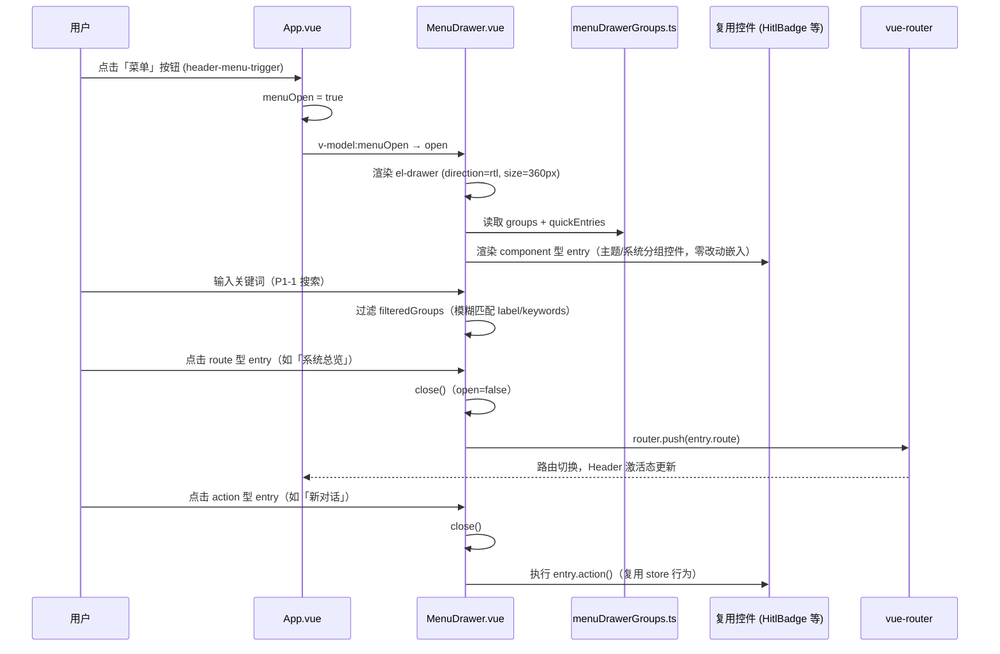
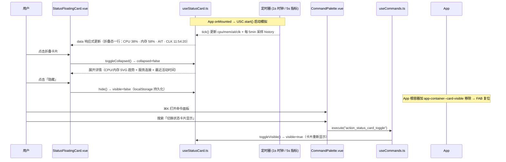

# 顶部 Header UI 重构 · 系统架构设计与任务分解

> 文档版本：v1.0 · 2026-08-06
> 架构师：高见远（Bob）
> 上游输入：`docs/header-redesign-prd-2026-08-06.md`（许清楚 · v1.0）
> 代码基线：`web/src/App.vue`（v1.6.0 Header 区 55-139 行 + FAB）+ `web/src/components/controls/*` + `web/src/composables/*`
> 已确认设计决策（主理人）：
> 1. 系统状态 + 时间 → **右下角浮动小卡片**（StatusFloatingCard，折叠态一行 CPU/内存/AIT/CLK，展开态含详情）
> 2. 顶部其他按钮 → **右侧抽屉（MenuDrawer）**，按「视图 / 主题 / 系统 / 调试」分组
> 3. 复用现有 controls/ 组件（HitlBadge / SessionBadge / BackgroundModeToggle / ThemeToggle 等），**不重建**

---

## 0. 结论摘要（TL;DR）

| 项 | 结论 |
|---|---|
| 顶部 Header | 精简为 **≤5 元素**：①Logo ②主导航（5 路由紧凑图标 / compact 并入 NavDrawer）③「菜单」按钮 ④帮助图标 ⑤「更多」折叠点（移动端 fallback） |
| 右侧抽屉 | 新增 `MenuDrawer.vue`（el-drawer，rtl，360px，四分组「视图/主题/系统/调试」+ 底部快捷区），分组数据为**数据驱动注册表**，100% 收纳原入口 |
| 浮动卡片 | 新增 `StatusFloatingCard.vue`（fixed 右下 16px，折叠态一行 CPU/内存/AIT/CLK，展开态含详情/趋势/服务连接），显隐由 `useStatusCard.ts` composable 管理，可被 ⌘K 命令面板切换 |
| 组件复用 | 现有 controls 组件**零改动**嵌入抽屉 / 卡片（仅做容器） |
| 依赖 | **无新增第三方依赖**（复用 Element Plus / Vue / Pinia / echarts） |
| 任务 | T01-T05 共 5 个（有序，P0×4 + P1×1） |

---

## 1. 实现方案 + 框架选型

### 1.1 核心难点分析

1. **入口收纳但不丢功能**：PRD 验收「抽屉内 100% 原入口可达、≤2 次点击」。解决：MenuDrawer 采用**数据驱动分组注册表**，把原 Header 右侧全部入口显式登记到 4 个分组 + 快捷区，任何入口都可被搜索/点击，天然满足"无功能丢失"。
2. **状态数据下沉不重复实现**：现状 CPU/MEM/AGT/CLK 模拟数据与时钟、健康检查都写在 `App.vue`（`cpuLoad / memLoad / agentCount / currentTime / connected`）。解决：把**指标模拟 + 时钟 + 历史采样**下沉到 `useStatusCard.ts`（模块级单例），`App.vue` 只保留健康检查（`connected` 通过 prop 传入卡片）；存量逻辑零重复。
3. **组件复用边界**：现有 controls 组件（HitlBadge / SessionBadge / BackgroundModeToggle / ThemeToggle / ColorBlindModeToggle / OnboardingTrigger / StatusIcon）均为**自包含**（内部接 store、自带样式与 a11y）。解决：抽屉与卡片只做**容器 + 布局**，复用组件不改一行源码。
4. **右下角双浮动元素冲突**：FAB（返回主页，`right/bottom: 24px`，非 `/` 页显示）与 StatusFloatingCard（`right/bottom: 16px`）会重叠。解决：**几何错开 + 展开隐藏**（详见 §7.2）：卡片占主位，FAB 上移至卡片上方，卡片展开时 FAB 隐藏。
5. **三档 + 移动端响应式**：现有 `useViewport` 三档（large ≥1920 / standard 1280-1920 / compact ≤1279.98）。需扩展移动端断点（<768px）与「更多」折叠点 fallback（详见 §1.4 与 T04）。

### 1.2 框架与库选型

| 关注点 | 选型 | 理由 |
|---|---|---|
| 右侧抽屉 | Element Plus `el-drawer`（`direction="rtl"`, `size="360px"`） | 与 `NavDrawer.vue`（ltr 260px）同模式，**零新依赖**，自带遮罩/焦点/动画 |
| 组件框架 | Vue 3 `<script setup>` + TypeScript + Pinia | 现状技术栈，无迁移成本 |
| 浮动卡片趋势图 | **轻量 SVG 折线**（原生 `<polyline>`，~20 行） | 近 1h 采样点少（12 点），不必引图表库；`echarts` 已在 dependencies，如需增强可后接 |
| 状态管理 | `useStatusCard.ts` composable（模块级单例，仿 `useCommands.ts` 模式） | 显隐/折叠/历史采样跨组件共享；⌘K 命令可调用 |
| 搜索 | `el-input` + 分组内 `filter`（内存过滤，数据量 <40 条） | P1-1 抽屉搜索，无需引 fuzzy 库 |
| 测试 | Playwright（现有 `tests/e2e/`，`playwright.config.ts` workers=1） | 沿用现有 e2e 体系（F1-F4 + a11y.spec.ts），无 vitest |

### 1.3 架构模式

- **组件化 + 数据驱动注册表**：`menuDrawerGroups.ts` 是抽屉全部入口的唯一事实源（P2-2「自定义布局」的天然扩展点）；`MenuDrawer.vue` 是纯渲染容器。
- **状态提升**：`useStatusCard.ts` 以模块级单例持有卡片状态（可见性 / 折叠 / 历史采样），`StatusFloatingCard.vue` 与 `useCommands` 命令面板共享同一实例。
- **复用策略**：现有 controls 组件作为**黑盒**嵌入抽屉分组；不做 prop 透传改造，仅在需要时用 CSS 包裹适配间距。

### 1.4 Header 5 元素（P0-1 验收指标）

```
[灵枢电网 Logo]  监控 灰度 审计 系统(紧凑图标)  ·  [?]  [☰ 菜单]  [⋯ 更多(移动端)]
```

| # | 元素 | 行为 | 备注 |
|---|---|---|---|
| ① | Logo（`header-brand` → `/`） | 点击回首页 | 保留现状 |
| ② | 主导航：5 路由紧凑图标 | `standard/large` 显示 horizontal el-menu；`compact(<1280)` 合并为 NavDrawer 汉堡 | 复用现有 el-menu 结构，仅视觉压紧 |
| ③ | 「菜单」按钮（主按钮样式） | `menuOpen=true` → 打开 MenuDrawer | 新增 `data-test="header-menu-trigger"` |
| ④ | 帮助图标 `?` | `router.push('/help')` | 保留现状 `goHelp` |
| ⑤ | 「更多」折叠点 `⋯` | 移动端 fallback，收纳溢出项（新对话 / 知识库管理） | <768px 出现；内容见 §8 待明确 #7 |

> 说明：PRD §4.1 默认方案的「连接状态徽标」已按主理人决策 #1 **移入 StatusFloatingCard 展开态**（`serviceConnected`），不再占用顶栏元素位。

---

## 2. 文件清单（LOC）

### 2.1 新增文件

| 文件（相对 `web/src/` 或 `web/`） | LOC 预估 | 职责 |
|---|---|---|
| `types/header.ts` | ~55 | MenuDrawer 分组 / 状态卡片 TypeScript 类型（唯一类型源） |
| `data/menuDrawerGroups.ts` | ~120 | 抽屉分组 + 快捷区注册表（视图/主题/系统/调试 + 底部快捷区），引用复用控件组件 |
| `components/controls/MenuDrawer.vue` | ~250 | 右侧抽屉 UI：el-drawer(rtl,360px) + 搜索框 + 分组渲染 + 快捷区 |
| `composables/useStatusCard.ts` | ~90 | 卡片状态单例：显隐/折叠/指标模拟/时钟/历史采样/⌘K 命令注册/持久化 |
| `components/StatusFloatingCard.vue` | ~180 | 右下角浮动卡片：折叠态一行 + 展开态详情/趋势/服务连接/隐藏 |
| `tests/e2e/header_redesign.spec.ts` | ~220 | Playwright 回归：顶栏 ≤5 / 抽屉分组跳转 / 卡片折叠展开隐藏 / 跨页一致 / a11y 快查 |

### 2.2 修改文件

| 文件 | 净变化 | 改动点 |
|---|---|---|
| `App.vue` | ~ -80（Header 区精简 -120 / 挂载与联动 +40） | ①Header 区 55-139 行重构为 5 元素；②移除 status-strip 与散落按钮（CPU/MEM/AGT/CLK、OnboardingTrigger、HitlBadge、SessionBadge、BackgroundModeToggle、ColorBlindModeToggle、ThemeToggle、KB 上传、新对话）；③挂载 `MenuDrawer` + `StatusFloatingCard`；④`metricsTimer/clockTimer` 模拟迁移至 `useStatusCard`；⑤FAB 位置/隐藏联动（`app-container--card-visible/--card-expanded` class）；⑥⌘K 注册 `action_status_card_toggle`；⑦更新挂载顺序注释 |

### 2.3 复用文件（**零改动**）

`HitlBadge.vue` / `SessionBadge.vue` / `BackgroundModeToggle.vue` / `ColorBlindModeToggle.vue` / `ThemeToggle.vue` / `OnboardingTrigger.vue` / `StatusIcon.vue` / `NavDrawer.vue` / `CommandPalette.vue` / `SessionDetailDrawer.vue` / `ShortcutsOverlay.vue` / `PulseDot.vue` / `DataStreamBadge.vue`（后两者按需用于卡片折叠态状态点 / 指标小字，或直接轻量自绘）

---

## 3. 数据结构和接口

### 3.1 TypeScript 类型（`web/src/types/header.ts`）

```ts
import type { Component } from 'vue'

/** 抽屉条目：component 型直接嵌入复用控件；route 型跳转；action 型执行回调 */
export type MenuDrawerEntry =
  | { id: string; type: 'component'; label: string; component: Component }
  | { id: string; type: 'route'; label: string; icon?: Component; route: string }
  | { id: string; type: 'action'; label: string; icon?: Component; action: () => void }

/** 抽屉分组：视图 / 主题 / 系统 / 调试 */
export interface MenuDrawerGroup {
  id: string
  title: string
  entries: MenuDrawerEntry[]
}

/** 浮动卡片指标（M1 模拟，后续可接 metrics store / 后端） */
export interface StatusCardData {
  cpu: number      // CPU 百分比 0-100
  mem: number      // 内存百分比 0-100
  ait: number      // 在线 Agent 数（现状 agentCount）
  clk: string      // HH:mm:ss 时钟（24h）
  serviceConnected: boolean // 后端连接状态（App.vue healthCheck 传入）
}

/** 趋势历史采样点（近 1h，12 点） */
export interface StatusMetricSample {
  t: number  // epoch ms
  cpu: number
  mem: number
}

/** 状态卡片全局状态（useStatusCard 单例持有） */
export interface StatusCardState {
  visible: boolean
  collapsed: boolean
  position: 'bottom-right'
  data: StatusCardData
  history: StatusMetricSample[]
}
```

### 3.2 分组数据注册表（`web/src/data/menuDrawerGroups.ts`）

按 PRD §4.2 默认方案登记（**100% 覆盖原入口**）：

| 分组 id | 标题 | entries（component 直接嵌入） |
|---|---|---|
| `view` | 视图 | 5 路由（route 型：`/` `/monitor` `/grayscale` `/audit` `/system`）+ `/help` |
| `theme` | 主题 | BackgroundModeToggle + ThemeToggle + ColorBlindModeToggle |
| `system` | 系统 | HitlBadge + SessionBadge（服务连接状态已在浮动卡片，此处可选加 StatusIcon 摘要） |
| `debug` | 调试 | OnboardingTrigger（新手引导）+ 「调试空间 / 默认 / 主题变量」占位（原散落入口，暂无则暂不登记） |
| `quick`（底部快捷区） | — | 新对话（action: `chatStore.resetChat()`）+ 知识库管理（route: `/help?tab=knowledge`）+ 消息引导（route: `/onboarding?force=1`） |

> 组件型 entry 直接引用控件组件（`import HitlBadge from '@/components/controls/HitlBadge.vue'`），由 `<component :is="entry.component" />` 渲染——**复用组件零改动**。

### 3.3 类图

```mermaid
classDiagram
    class MenuDrawerEntry {
        +id: string
        +type: "component" | "route" | "action"
        +label?: string
        +icon?: Component
        +component?: Component
        +route?: string
        +action?: () => void
    }
    class MenuDrawerGroup {
        +id: string
        +title: string
        +entries: MenuDrawerEntry[]
    }
    class menuDrawerGroups {
        +groups: MenuDrawerGroup[]
        +quickEntries: MenuDrawerEntry[]
    }
    class MenuDrawer {
        +modelValue: boolean
        +open: boolean
        +keyword: string
        +filteredGroups: ComputedRef~MenuDrawerGroup[]~
        +handleEntry(entry: MenuDrawerEntry): void
        +close(): void
    }
    class StatusCardData {
        +cpu: number
        +mem: number
        +ait: number
        +clk: string
        +serviceConnected: boolean
    }
    class StatusMetricSample {
        +t: number
        +cpu: number
        +mem: number
    }
    class StatusCardState {
        +visible: boolean
        +collapsed: boolean
        +position: "bottom-right"
        +data: StatusCardData
        +history: StatusMetricSample[]
    }
    class useStatusCard {
        +visible: Ref~boolean~
        +collapsed: Ref~boolean~
        +data: ComputedRef~StatusCardData~
        +history: Ref~StatusMetricSample[]~
        +toggleVisible(): void
        +toggleCollapsed(): void
        +hide(): void
        +start(): void
        +stop(): void
    }
    class StatusFloatingCard {
        +connected?: boolean
        +toggle(): void
        +hide(): void
    }
    class App {
        +menuOpen: Ref~boolean~
        +navOpen: Ref~boolean~
        +connected: Ref~boolean~
        +checkHealth(): Promise~void~
    }

    App --> MenuDrawer : v-model menuOpen
    App --> StatusFloatingCard : :connected prop
    App --> NavDrawer : v-model navOpen (compact)
    MenuDrawer --> menuDrawerGroups : 读取注册表
    menuDrawerGroups --> MenuDrawerEntry : 包含
    StatusFloatingCard --> useStatusCard : 消费单例
    useStatusCard --> StatusCardState : 持有
    StatusCardState --> StatusCardData : data
    StatusCardState --> StatusMetricSample : history[]
    MenuDrawer ..> HitlBadge : 嵌入复用
    MenuDrawer ..> SessionBadge : 嵌入复用
    MenuDrawer ..> BackgroundModeToggle : 嵌入复用
    MenuDrawer ..> ThemeToggle : 嵌入复用
    MenuDrawer ..> ColorBlindModeToggle : 嵌入复用
    MenuDrawer ..> OnboardingTrigger : 嵌入复用
    StatusFloatingCard ..> StatusIcon : 状态点复用
```

### 3.4 关键接口

**MenuDrawer.vue**（与 NavDrawer 同款 v-model 协议）
```ts
defineProps<{ modelValue: boolean }>()
defineEmits<{ (e: 'update:modelValue', value: boolean): void }>()
// 内部：keyword 搜索 → filteredGroups；handleEntry(entry) → route 跳转 / action 执行 / component 直接渲染
```

**StatusFloatingCard.vue**
```ts
defineProps<{ connected?: boolean }>()  // App.vue 健康检查结果传入，驱动展开态服务连接状态
// 内部消费 useStatusCard()：visible / collapsed / data / history / toggle / hide
```

**useStatusCard.ts**（模块级单例，仿 useCommands）
```ts
export function useStatusCard(): {
  visible: Ref<boolean>          // 默认 true（localStorage gridmind.statusCard.visible 水合）
  collapsed: Ref<boolean>        // 默认 true（折叠态）
  data: ComputedRef<StatusCardData>
  history: Ref<StatusMetricSample[]>
  toggleVisible(): void          // ⌘K 命令 action_status_card_toggle 调用
  toggleCollapsed(): void
  hide(): void                   // 展开态「隐藏」→ visible=false + 持久化
  start(): void                  // 启动 1s 时钟 + 5s 指标模拟 + 采样（幂等）
  stop(): void
}
```

---

## 4. 时序图

### 4.1 菜单打开 + 抽屉入口执行



### 4.2 状态卡片展开 + ⌘K 显隐



---

## 5. 任务列表（T01-T05 · 按依赖排序）

### T01 · MenuDrawer 组件 + 分组数据（P0）
- **Source Files**：`web/src/types/header.ts`（新增）、`web/src/data/menuDrawerGroups.ts`（新增）、`web/src/components/controls/MenuDrawer.vue`（新增）
- **Dependencies**：无（首个任务）
- **验收要点**：抽屉 rtl/360px 打开关闭流畅；四分组「视图/主题/系统/调试」+ 快捷区渲染完整；component 型条目嵌入 HitlBadge/SessionBadge/BackgroundModeToggle/ThemeToggle/ColorBlindModeToggle/OnboardingTrigger（零改动）；route 型跳转正确；`data-test` 齐全；a11y（aria-label / 焦点 / Esc 关闭）

### T02 · StatusFloatingCard + 浮动定位（P0）
- **Source Files**：`web/src/composables/useStatusCard.ts`（新增）、`web/src/components/StatusFloatingCard.vue`（新增）、`web/src/types/header.ts`（依赖 T01 的类型）
- **Dependencies**：T01
- **验收要点**：折叠态一行 `CPU xx% · 内存 xx% · AIT n · CLK HH:mm:ss`（小字 + 状态色点）；点击展开详情（CPU/内存 SVG 趋势 + 服务连接 + 最近活动）；「隐藏」持久化；`fixed right/bottom 16px` 不随滚动；z-index 与 FAB 协调（§7.2）；`prefers-reduced-motion` 降级

### T03 · App.vue Header 精简 + 挂载 + FAB 调整（P0）
- **Source Files**：`web/src/App.vue`（修改）、`web/src/components/controls/MenuDrawer.vue`（联调修正）、`web/src/components/StatusFloatingCard.vue`（联调修正）
- **Dependencies**：T01、T02
- **验收要点**：顶栏首屏元素 **≤5**；CPU/内存/AIT/CLK 不再出现在顶栏；原 100% 入口经抽屉可达（≤2 次点击）；挂载 MenuDrawer + StatusFloatingCard；`metricsTimer/clockTimer` 迁移至 useStatusCard（App.vue 删除对应代码）；FAB 保留且与卡片无重叠；`npm run type-check` 通过；`/` `/monitor` `/grayscale` `/audit` `/system` `/help` 六页一致

### T04 · useViewport 响应式适配（P1）
- **Source Files**：`web/src/composables/useViewport.ts`（修改，新增 <768px 移动端断点，保持向后兼容）、`web/src/components/controls/MenuDrawer.vue`（修改，<768px size ≥80% 或全屏）、`web/src/components/StatusFloatingCard.vue`（修改，极窄屏隐藏策略）、`web/src/App.vue`（修改，「更多」折叠点 fallback）
- **Dependencies**：T03
- **验收要点**：compact(<1280) 主导航并入 NavDrawer 汉堡（回归不坏）；<768px 抽屉 ≥80% 宽；浮动卡片按默认策略隐藏；顶栏 5 元素在 ≤768px 不溢出；JS 断点与 CSS media query 不混写同一规则

### T05 · 测试 + 回归（P0）
- **Source Files**：`web/tests/e2e/header_redesign.spec.ts`（新增）、`web/src/App.vue`（回归修复）、`web/src/components/controls/MenuDrawer.vue` / `web/src/components/StatusFloatingCard.vue`（回归修复）
- **Dependencies**：T01-T04
- **验收要点**：Playwright 用例覆盖——顶栏元素数 ≤5、抽屉分组可见性与 route/action 跳转、卡片折叠/展开/隐藏、跨六页一致、`@axe-core/playwright` 快查无严重违规；`npm run type-check` + `npm run build` 通过；现有 `tests/e2e/F1-F4 + a11y.spec.ts` 不回归（workers=1 约束沿用）

---

## 6. 依赖（无新增）

| 包 | 版本（现状） | 用途 | 是否新增 |
|---|---|---|---|
| element-plus | ^2.7.0 | el-drawer / el-input / el-tooltip / el-button | 否 |
| @element-plus/icons-vue | ^2.3.1 | 菜单 / 帮助 / 更多图标 | 否 |
| vue / vue-router / pinia | 现有 | 组件 / 路由 / store | 否 |
| echarts | ^5.6.0 | 浮动卡片趋势图（默认用原生 SVG，仅作后备） | 否 |
| @playwright/test | ^1.49.0 | e2e 回归 | 否 |

> 无任何新增第三方依赖。抽屉搜索用内存 filter，趋势图用轻量 SVG，均不引新库。

---

## 7. 共享知识（FAB 与浮动卡片层级 / 响应式 / 约定）

### 7.1 z-index 分层（沿用 `styles/tokens.shared.scss`，勿硬编码）

| token | 值 | 归属 |
|---|---|---|
| `--z-base` | 1 | 页面主体 |
| `--z-dropdown` | 100 | 下拉 |
| `--z-sticky` | 200 | **StatusFloatingCard / FAB / 徽标**（本需求统一使用） |
| `--z-header` | 300 | Header 顶栏 |
| `--z-dialog` | 1000 | 弹窗 |
| `--z-toast` | 2000 | toast |

> MenuDrawer 的 el-drawer 遮罩/面板由 Element Plus 内部管理（>2000），天然盖过 Header 与卡片，无需干预。

### 7.2 FAB 与浮动卡片协调规则（几何错开 + 展开隐藏）

- **StatusFloatingCard 主位**：`position: fixed; right: 16px; bottom: 16px; z-index: var(--z-sticky)`，毛玻璃（`backdrop-filter` + `--bg-elevated` 半透明）。
- **FAB 次位**：当卡片可见（`app-container--card-visible`）时，FAB 上移至 `right: 16px; bottom: 96px`（折叠卡片高约 44px + 间隙），z-index 同为 `var(--z-sticky)`；卡片隐藏时 FAB 复位原 `right/bottom: var(--space-6)`。
- **展开隐藏**：卡片展开（`app-container--card-expanded`）时 FAB `display: none`（展开高约 340px，避免被覆盖或遮挡详情）。
- 联动实现：`StatusFloatingCard` 对根容器 class 的写入放在 `App.vue`（watch `useStatusCard().visible/collapsed`），不侵入卡片组件。

### 7.3 响应式断点（JS 与 CSS 分工）

- **JS（useViewport，组件逻辑）**：`large ≥1920 / standard 1280-1920 / compact ≤1279.98`；T04 新增 `below-md <768px`（`isMobile`），用于「更多」折叠点、抽屉宽度、卡片隐藏等**逻辑分支**。
- **CSS（media query，纯布局）**：≤1440 状态条压缩、≤1100 徽标退化、≤1024 FAB 图标化等**存量规则**逐步随 Header 精简删除；新增卡片/FAB 布局用 CSS 变量与 media query。
- 原则：JS 断点与 CSS media query 并存不混写同一规则（沿用 p1-iteration 架构 §7 共享知识 #3）。

### 7.4 状态数据模拟规则（M1 阶段，与现状一致）

- CPU：`18 + Math.random() * 22`（18-40%），5s 刷新；内存：`35 + Math.random() * 20`（35-55%），5s 刷新。
- AIT = `agentCount`（模拟 4）；CLK = `toLocaleTimeString('zh-CN', { hour12: false })`，1s 刷新。
- 趋势历史：每 5min 采样一次 `{t, cpu, mem}`，保留 12 点（近 1h），环形覆盖。
- 后续可无缝替换为 `metricsStore.metricsSummary` 或后端 metrics 接口，`StatusCardData` 形状不变。
- `serviceConnected` 由 `App.vue` 现有 `healthCheck()` 15s 轮询产出，经 `:connected` prop 传入卡片。

### 7.5 组件复用铁律

- MenuDrawer / StatusFloatingCard **只做容器**；现有 controls 组件**零改动**。
- 入口登记在 `menuDrawerGroups.ts`，新增入口 = 新增一条 registry，不新增 Header 按钮。
- 若某控件在 360px 抽屉内视觉异常（如 BackgroundModeToggle 双段过挤），优先用**外层包裹样式**适配，不改控件源码；无法解决才升级为需求变更。

### 7.6 命令注册约定（⌘K）

- `useStatusCard.ts` 初始化时通过 `useCommands().register()` 注册：
  - id：`action_status_card_toggle`；scope：`global`；title：`切换状态卡片显示`；keywords：`['状态','zt','status','卡片','浮动']`；action：`toggleVisible()`。
- 遵循 useCommands 前缀约定（`action_` 操作 / `route_` 路由），同 id 幂等。

### 7.7 持久化键（沿用 `gridmind.{域}.{项}` 命名）

- `gridmind.statusCard.visible`（默认 `'true'`）
- `gridmind.statusCard.collapsed`（默认 `'true'`，P1-3 拖动位置持久化时再加 `gridmind.statusCard.position`）

### 7.8 data-test 命名（供 Playwright / a11y）

- `header-menu-trigger`（菜单按钮）、`header-more-trigger`（更多折叠点）、`menu-drawer`、`menu-drawer-group-{id}`、`menu-drawer-entry-{id}`、`status-card`、`status-card-toggle`、`status-card-hide`。

### 7.9 其他

- App.vue 顶部「v1.6.0 挂载顺序」注释需随重构同步更新，保持文档-代码一致。
- 路由 `?from=` 溯源 query（`hitl-badge` / `command-palette`）保持不变；HitlBadge 嵌入抽屉后跳转行为不变。

---

## 8. 待明确事项（默认值已定，待主理人/产品确认）

| # | 事项 | 默认值（本期按此实现） | 影响 |
|---|---|---|---|
| 1 | 抽屉内分组顺序 | 视图 → 主题 → 系统 → 调试（PRD §4.2） | 低（纯展示顺序） |
| 2 | 浮动卡片是否支持拖动 | **不支持**（fixed 不拖；P1-3 迭代再做拖动 + 位置持久化） | 低（P1 范围外） |
| 3 | 移动端浮动卡片显示策略 | **<768px 隐藏**（P1-4 可再评估单点气泡） | 中（移动端验收） |
| 4 | Header 连接状态徽标是否保留 | 已移入浮动卡片展开态；如需顶栏保留「● 已连接」最小化形式，会占第 6 个元素位，需改验收口径 | 中（影响 ≤5 计数） |
| 5 | 浮动卡片趋势图实现 | 原生 SVG 折线（12 采样）；如需 echarts 增强趋势再议 | 低（实现细节） |
| 6 | 首次进入是否默认展开一次做引导 | 默认不展开（保持折叠，尊重持久化） | 低 |
| 7 | 「更多」折叠点收纳内容 | 新对话 / 知识库管理等溢出项；具体清单待确认 | 低 |
| 8 | BackgroundModeToggle 在 360px 内的宽度适配 | 以 360px 为准正常显示；必要时外层包裹压缩 | 低 |

---

## 附：跨页一致性验收矩阵

| 页面 | Header ≤5 | 抽屉可用 | 卡片折叠/展开 | 备注 |
|---|---|---|---|---|
| `/` | ✔ | ✔ | ✔ | FAB 隐藏（主页） |
| `/monitor` | ✔ | ✔ | ✔ | FAB 上移 |
| `/grayscale` | ✔ | ✔ | ✔ | FAB 上移 |
| `/audit` | ✔ | ✔ | ✔ | FAB 上移 |
| `/system` | ✔ | ✔ | ✔ | FAB 上移 |
| `/help` | ✔ | ✔ | ✔ | 帮助图标直达 |
