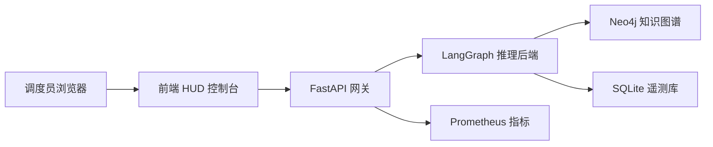

# GridMind 架构总览

GridMind（灵枢电网）是一套面向电网调度场景的 **AI 决策辅助控制台**，由三部分组成：前端 HUD 控制台、LangGraph 推理后端、知识库与可观测性组件。

## 1. 整体架构



> 说明：上方为 mermaid 流程图占位渲染，详细架构图请参阅研发文档。

## 2. 前端控制台

| 模块 | 说明 |
|---|---|
| 智能对话 `/` | 对话式故障诊断、知识检索与高危操作确认 |
| 实时监控 `/monitor` | 设备健康评分、遥测趋势与异常检测 |
| 灰度面板 `/grayscale` | 双 backend 灰度切流与可视化方案对比 |
| HITL 审计 `/audit` | 高危操作审批记录与审计追踪 |
| 系统总览 `/system` | 聚合指标、灰度状态与模型信息 |

### 2.1 设计令牌体系

所有组件颜色 / 尺寸统一走 `tokens` 体系（深色 / 浅色双主题 + 4 套色盲 palette）。新组件禁止硬编码色值。

```css
/* 示例：状态色中间层（组件唯一引用入口） */
.status-icon {
  fill: var(--cb-status-normal-soft);
  stroke: var(--cb-status-normal-fg);
}
```

### 2.2 全局快捷键

- `⌘K` / `Ctrl+K` 打开命令面板
- `?` 打开快捷键速查浮层
- `⌘1-5` 直达 5 个核心路由

## 3. 后端推理

后端基于 **LangGraph** 状态机，单个推理会话（Session）包含多个步骤（Step），步骤之间通过 checkpoint 支持回滚重跑。

- 会话状态：`idle / running / paused / editing / resuming / completed / error / aborted`
- 实时事件流：SSE（`/sessions/{id}/events`）
- 暂停 / 恢复 / 回滚：`/sessions/{id}/pause|resume|rewind|abort`

## 4. 知识库

知识库以 Neo4j 图谱 + 向量检索双通道支撑问答，命中结果附带引用追溯路径，便于调度员核验结论来源。
