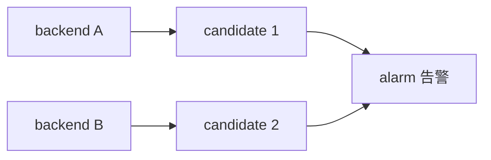

# 灰度切流指南

灰度（Grayscale）用于把新模型 / 新配置 **分批上线**，在真实流量中逐步放量，异常时可一键回滚。

## 1. 核心概念

| 概念 | 说明 |
|---|---|
| 切流比例 | 当前打到 backend B 的流量占比（0% / 10% / 50% / 100%） |
| 监控窗口 | 最近 300 秒滚动样本，观测错误率与 P95 延迟 |
| 自动回滚 | 错误率 / 延迟超阈值时自动切回，保障业务可用性 |

## 2. 手动切流

1. 进入 **灰度面板**（`/grayscale`）；
2. 在「手动切流」卡片输入管理员令牌（`X-Admin-Token`）；
3. 输入目标比例（合法值：`0` / `10` / `50` / `100`）；
4. 点击 **切流到 X%**，面板自动刷新监控窗口与切换历史。

> 注意：比例仅支持离散档位，防止高频抖动。

## 3. 可视化方案对比

灰度面板新增「拓扑视图 + 方案对比」区块，支持两种模式：

- **探索模式**：系统基于当前负载与错误率推荐 3 套方案（A / B / C），只读；
- **规划模式**：人工勾选候选节点，系统按「操作开关数量 / 负载率 / 保护适配性」三维打分生成方案。

点击方案卡片的 **应用方案** 后，将直接联动切流接口，把切流比例更新为方案目标值。

## 4. 回滚

| 场景 | 操作 |
|---|---|
| 自动回滚已触发 | 状态机进入 `rollback`，面板红色告警 |
| 手动回滚 | 输入令牌后点击「手动回滚」 |

## 5. 拓扑图节点编码

- **节点大小** = 负载率（越高越大）
- **节点颜色** = 错误率（绿 → 黄 → 红）
- **节点类型**：backend（当前后端）/ candidate（候选）/ alarm（关联告警）/ metric（指标）

## 6. 常见问题

**Q：切流后没有生效？** 检查管理员令牌是否正确、目标比例是否合法。
**Q：方案「应用」按钮置灰？** 规划模式下需先勾选至少 1 个候选节点。
