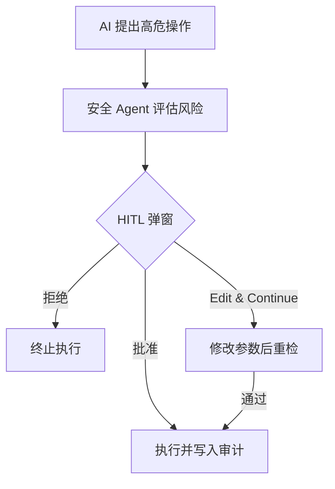

# HITL 使用指南

HITL（Human-in-the-Loop，人在回路）确保 **高危操作必须由调度员人工确认** 后才执行。

## 1. 何时触发 HITL

触发条件包括（但不限于）：

- 涉及停机 / 检修 / 紧急操作的调度建议；
- 安全规则匹配到 `hitl_required` 动作；
- 机理校验关键项失败且与 LLM 结论矛盾。

## 2. 审批流程

### 2.1 三种决策

| 决策 | 说明 |
|---|---|
| **批准** | 原样执行 AI 方案 |
| **拒绝** | 终止本次执行 |
| **Edit & Continue** | 修改关键参数后重新走安全校验，通过才执行 |

## 3. 审计追踪

所有审批记录写入审计日志（`/audit`），包含：

- 操作内容与 AI 建议；
- 审批人、决策类型与原因；
- 风险等级（low / normal / high / critical）。

## 4. Header 徽标

Header 右侧的 **HITL 徽标** 显示待审批数量：

- 1-4 个 → 黄色警告；
- ≥5 个 → 红色脉冲告警；
- 点击直达审计页（`/audit?filter=pending`）。

> 色盲模式下徽标同时以「数字 + 图标」双重区分，不依赖颜色。

## 5. 常见问题

**Q：审批后没有继续执行？** 若返回 `rejected_by_safety: true`，说明安全重检未通过，需修改参数后重试。
**Q：如何批量审批？** 当前版本支持逐条审批；审计页可按决策 / 风险等级筛选。
