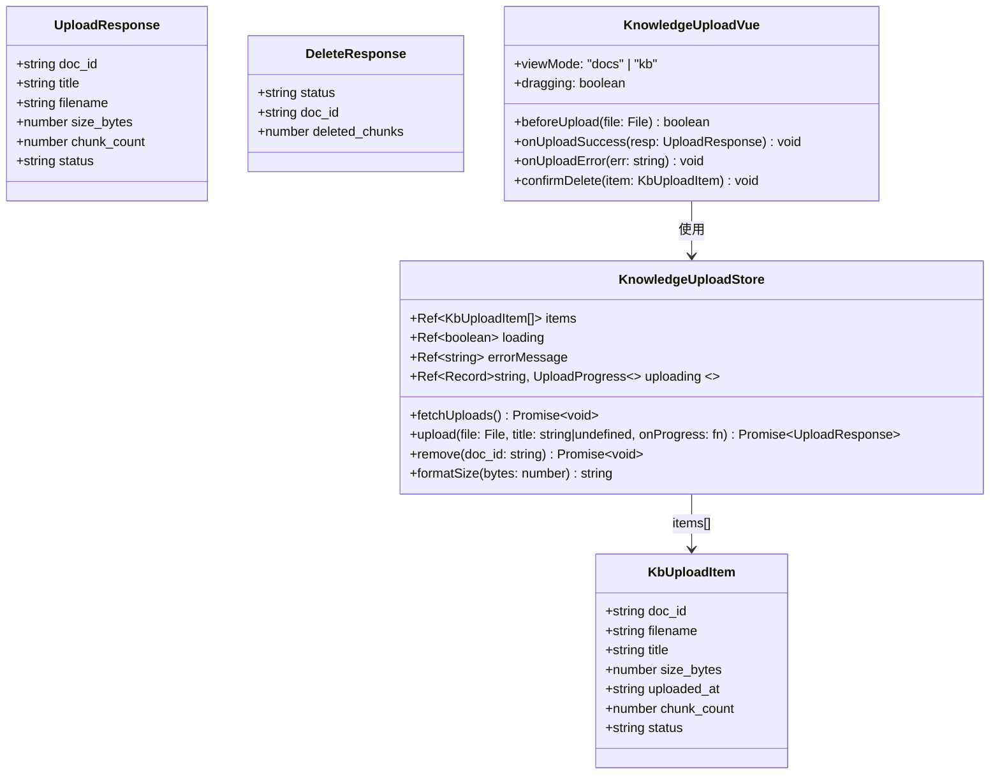
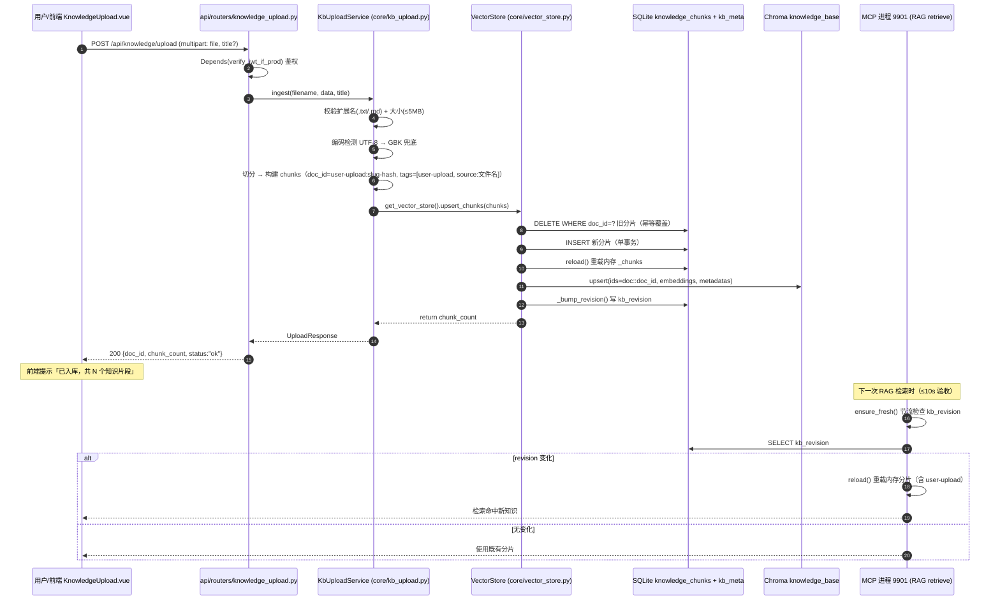
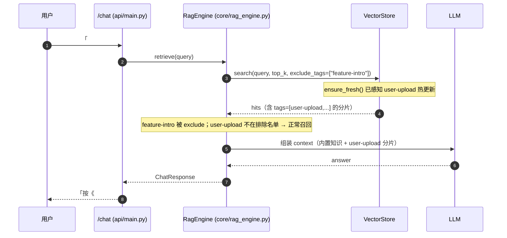
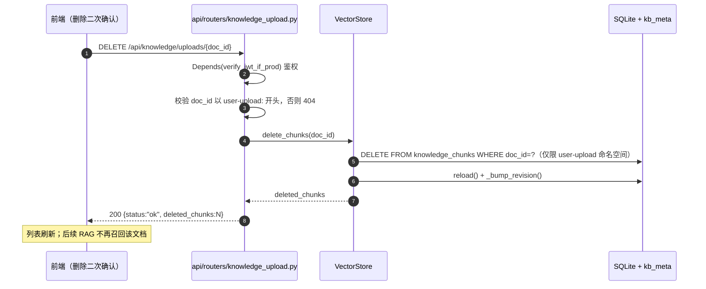

# 架构设计 · 用户上传知识库（KB Upload）

> 文档版本：v1.0 · 2026-08-06
> 架构师：高见远（GridMind Architect）
> 上游输入：`docs/kb-upload-prd-2026-08-06.md`（v1.0）
> 复用链路（V1.6 已交付）：`core/vector_store.py`（`upsert_chunks` / `search_by_tag` / `get_vector_store` / `ensure_fresh`）、`mcp_tools/db/database.py`（`knowledge_chunks` + `kb_meta`）、`api/services/auth.py`（`verify_jwt_token` / `verify_jwt_if_prod`）、`api/routers/feature_intro.py`（API 模式）、`web/src/views/HelpCenter.vue`（候选入口）、`web/src/composables/useFeatureIntro.ts`、`web/src/api/chat.ts`

---

## 1. 实现方案 + 框架选型

### 1.1 核心难点与对策

| # | 难点 | 对策 |
|---|------|------|
| 1 | multipart 文件上传 + 格式/大小校验 | FastAPI `UploadFile` + `File`；`python-multipart` 已装（0.0.32，实测可用），**P0 零新增依赖** |
| 2 | txt/md 文本编码不确定 | 纯 stdlib 编码检测：先按 UTF-8 解码，失败回退 GBK，再失败抛「编码不支持」错误文案 |
| 3 | 大文件切分质量与检索召回 | 段落聚合切分：md 按 `##` 章节优先（复用 `seed_feature_intro` 思路简化）；txt 按空行分段聚合到 ~500 字符，段间 80 字符重叠；content 前缀带标题提升 keyword fallback 召回 |
| 4 | 命名空间隔离，不与 `feature-intro` 冲突 | `doc_id = user-upload:{slug}-{8位hash}`；tags 根标签 `user-upload` + `source:{原始文件名}`；删除/覆盖仅限 `doc_id LIKE 'user-upload:%'` |
| 5 | 入库后 MCP 进程热更新（10s 验收） | 复用 `VectorStore.upsert_chunks()`：写 SQLite + Chroma + bump `kb_revision`；MCP 进程 `ensure_fresh()` 节流 ≤5s 自动重载 |
| 6 | 鉴权 | 写操作（上传/删除）与列表读操作均 `Depends(verify_jwt_if_prod)`：生产强制 JWT，dev 放行（与既有 `/devices` 等数据端点一致） |
| 7 | 同名重传幂等覆盖 | hash=文件名 sha1 前 8 位 → 同名文件 doc_id 稳定 → `upsert_chunks` 按 doc_id 先删后插，天然覆盖更新（顺带满足 P2-1） |

### 1.2 架构模式

- **后端**：分层结构 `router（API 层）→ core/kb_upload.py（service 层）→ core/vector_store.py + SQLite（存储层）`，与 `feature_intro` 路由模式完全对齐。
- **前端**：Vue SFC（MVVM）+ Pinia store（`knowledgeUpload.ts`）+ axios（复用 `web/src/api/chat.ts` 的 `resolveBaseUrl` / `getAuthHeaders` 模式）+ Element Plus `el-upload`（拖拽）。

### 1.3 端点一览

| 方法 | 路径 | 鉴权 | 请求 | 响应 | 优先级 |
|------|------|------|------|------|--------|
| POST | `/api/knowledge/upload` | `Depends(verify_jwt_if_prod)` | `multipart/form-data`：`file`（必填）+ `title`（可选，默认取文件名） | `UploadResponse` | P0 |
| GET | `/api/knowledge/uploads` | `Depends(verify_jwt_if_prod)` | — | `KbUploadListResponse` | P0 |
| DELETE | `/api/knowledge/uploads/{doc_id}` | `Depends(verify_jwt_if_prod)` | path 参数 | `DeleteResponse` | P1 |

**上传限制**（P1-4 提前纳入 P0，成本极低）：
- 单文件 ≤ 5MB（超限返回 413 或 400，前端展示「文件大小不能超过 5MB」）。
- 格式白名单 `.txt` / `.md`（按扩展名小写判断；其余返回 400「仅支持 txt / md 文件」）。
- 上传为**同步**流程：解析→切分→入库在一次请求内完成，成功即「已入库」，失败返回可读错误文案；「处理中」状态由前端上传进度条表达。

**删除语义**：物理删除 SQLite `knowledge_chunks` 中该 doc_id 全部分片 + 同步 Chroma（重载后按 doc_id 从 collection 移除），并 bump `kb_revision` 触发跨进程热更新。命名空间守卫：`doc_id` 必须以 `user-upload:` 开头，否则 404。

---

## 2. 文件列表及相对路径（新增 / 修改 + LOC 预估）

### 新增

| 相对路径 | 职责 | LOC 预估 |
|----------|------|----------|
| `core/kb_upload.py` | 上传知识库 service：doc_id/tags 常量、编码检测、txt/md 切分、chunk 构建、入库编排、文档列表、删除编排 | ~190 |
| `api/routers/knowledge_upload.py` | 三端点 + Pydantic 响应模型（`UploadResponse` / `KbUploadItem` / `KbUploadListResponse` / `DeleteResponse`），错误文案映射 | ~200 |
| `web/src/types/knowledgeUpload.ts` | 前端 TS 类型：`KbUploadItem` / `UploadResponse` / `DeleteResponse` / 上传状态枚举 | ~40 |
| `web/src/api/knowledgeUpload.ts` | 前端 axios API：`uploadKnowledge`（带进度回调）/ `fetchUploads` / `deleteUpload` | ~85 |
| `web/src/stores/knowledgeUpload.ts` | Pinia store：文档列表、上传中集合（文件名→进度/状态）、上传/删除/刷新动作、错误文案 | ~140 |
| `web/src/components/controls/KnowledgeUpload.vue` | 上传组件：拖拽/选择区 + 校验提示 + 进度条 + 结果反馈 + 文档列表表格（含删除二次确认） | ~260 |
| `tests/test_kb_upload_parser.py` | 单测：doc_id 生成幂等、编码检测、txt/md 切分（长度/重叠/章节）、tags 结构 | ~120 |
| `tests/test_kb_upload_api.py` | API 集成测试：三端点 + 鉴权（生产 401 / dev 放行）+ 格式/大小错误文案 | ~140 |
| `tests/test_kb_upload_rag.py` | 全链路验收：上传→`ensure_fresh` 热更新→`search` 检索命中→删除后不可检索 | ~120 |

### 修改

| 相对路径 | 改动 | LOC 增量 |
|----------|------|----------|
| `core/vector_store.py` | 新增 `delete_chunks(doc_id) -> int`（沿用 `upsert_chunks` 的事务模式：SQLite DELETE → reload → Chroma 移除 → bump revision） | +45 |
| `api/routers/__init__.py` | 导出 `knowledge_upload_router` | +2 |
| `api/main.py` | `app.include_router(knowledge_upload_router)` | +3 |
| `requirements.txt` | 在文件末尾追加 pypdf P1 扩展点注释（P0 **不安装**） | +4（注释） |
| `web/src/views/HelpCenter.vue` | 新增「帮助文档 / 知识库管理」Tab 切换 + 嵌入 `<KnowledgeUpload />` + 支持 `?tab=knowledge` 直达 | +80 |
| `web/src/router/index.ts` | `/help` 路由注释与 meta 支持 tab query（不改路径结构） | +6 |
| `web/src/App.vue` | `goHelp()` 支持透传 `?tab=knowledge`（帮助中心入口旁提供「知识库管理」快捷入口） | +8 |
| `tests/test_backend_integration_e2e.py` | 追加一个上传→检索 smoke 用例（回归基线） | +40 |

---

## 3. 数据结构和接口

### 3.1 后端（Python）

```mermaid
classDiagram
    class VectorStore {
        +str collection_name
        +list _chunks
        +str _revision
        +upsert_chunks(chunks: list[dict]) int
        +delete_chunks(doc_id: str) int  <<NEW>>
        +search(query: str, top_k: int, exclude_tags: list[str]|None) list[dict]
        +search_by_tag(tag: str|None, top_k: int) list[dict]
        +ensure_fresh() bool
        +reload() int
        +count() int
    }

    class KbUploadService {
        +str DOC_ID_PREFIX = "user-upload"
        +str ROOT_TAG = "user-upload"
        +int MAX_FILE_BYTES = 5 * 1024 * 1024
        +frozenset ALLOWED_EXT = {".txt", ".md"}
        +ingest(filename: str, data: bytes, title: str|None) UploadResult
        +list_docs() list[KbUploadItem]
        +delete(doc_id: str) int
        -_detect_encoding(data: bytes) str
        -_split_text(text: str, ext: str) list[str]
        -_build_chunks(filename, title, text) list[dict]
        +build_doc_id(filename: str) str  <<staticmethod>>
    }

    class UploadResponse {
        +str doc_id
        +str title
        +str filename
        +int size_bytes
        +int chunk_count
        +str status = "ok"
    }

    class KbUploadItem {
        +str doc_id
        +str filename
        +str title
        +int size_bytes
        +str uploaded_at
        +int chunk_count
        +str status = "ok"
    }

    class KbUploadListResponse {
        +list[KbUploadItem] items
        +int total
    }

    class DeleteResponse {
        +str status = "ok"
        +str doc_id
        +int deleted_chunks
    }

    class UploadError {
        +str code
        +str message
        +int http_status
    }

    KbUploadService --> VectorStore : 复用单例 get_vector_store()
    KbUploadService ..> UploadResponse : 构造
    KbUploadService ..> KbUploadItem : 构造
    KbUploadService ..> UploadError : 抛出
    KbUploadListResponse o-- KbUploadItem : items
```

**`KbUploadService` 关键约定**

- `build_doc_id(filename)`：`slug = 文件名去扩展名`（非字母数字 → `-`，小写）；`hash = sha1(原始文件名含扩展名).hexdigest()[:8]`；返回 `user-upload:{slug}-{hash}`。同名文件 → 相同 doc_id → 幂等覆盖。
- 每个 chunk 结构（对齐 `VectorStore.upsert_chunks` 入参）：
  ```python
  {
      "doc_id": "user-upload:main-transformer-ops-a1b2c3d4",
      "title": "<title 或文件名>",
      "content": "<标题前缀>\n\n<切分正文>",
      "source": "user-upload/<原始文件名>",
      "tags": ["user-upload", "source:<原始文件名>"],
      "icon": None,
      "starter_message": None,
      "meta": {"filename": 原始文件名, "size_bytes": N, "uploaded_at": "...",
               "chunk_index": i, "total_chunks": N, "lang": "zh-CN"},
  }
  ```
- 编码检测：`data.decode("utf-8")` → `except UnicodeDecodeError: data.decode("gbk")` → 再失败抛 `UploadError("ENCODING_UNSUPPORTED")`。
- 切分：md 优先按 `##` 章节（无章节则按段落）；txt 按空行分段聚合至 ~500 字符，段间重叠 80 字符；空内容抛 `UploadError("EMPTY_DOC")`。

### 3.2 前端（TypeScript）



- 前端上传走 `FormData` + axios `onUploadProgress`（进度百分比）；成功文案按 PRD §4.2：`《{文件名}》已入库，共 {N} 个知识片段，现在可以在对话中提问相关规程。`
- 状态机：`idle → uploading（进度 0-100）→ success | error`；列表状态列仅「已入库」+「删除」按钮（同步上传无持久「处理中/失败」态，失败即时弹错误文案并可重试）。

---

## 4. 程序调用流程

### 4.1 上传 → 解析 → 入库 → 跨进程热更新



### 4.2 对话检索 user-upload（RAG 主链路）



### 4.3 删除



---

## 5. 任务列表（有序、按依赖）

| 任务 | 名称 | 源文件 | 依赖 | 优先级 |
|------|------|--------|------|--------|
| T01 | 后端解析 + 入库核心 | 新增 `core/kb_upload.py`；修改 `requirements.txt`（pypdf P1 注释）；新增 `tests/test_kb_upload_parser.py` | — | P0 |
| T02 | API 三端点 | 新增 `api/routers/knowledge_upload.py`；修改 `core/vector_store.py`（`delete_chunks`）、`api/routers/__init__.py`、`api/main.py` | T01 | P0 |
| T03 | 前端 store + 上传组件 | 新增 `web/src/types/knowledgeUpload.ts`、`web/src/api/knowledgeUpload.ts`、`web/src/stores/knowledgeUpload.ts`、`web/src/components/controls/KnowledgeUpload.vue` | —（仅依赖 §3.2 接口契约，可与 T01/T02 并行） | P0 |
| T04 | HelpCenter 集成 + 入口 | 修改 `web/src/views/HelpCenter.vue`、`web/src/router/index.ts`、`web/src/App.vue` | T03 | P0 |
| T05 | 测试验证 | 新增 `tests/test_kb_upload_api.py`、`tests/test_kb_upload_rag.py`；修改 `tests/test_backend_integration_e2e.py` | T01, T02 | P0 |

> 说明：T01 与 T03 相互独立可并行；T02 依赖 T01 的 `KbUploadService` 与 `VectorStore.delete_chunks`；T04 依赖 T03 的组件与 store；T05 收敛全链路验收。

### T01 后端解析 + 入库核心（P0）
- 实现 `KbUploadService`：`build_doc_id` / `_detect_encoding` / `_split_text` / `_build_chunks` / `ingest`。
- `ingest` 编排：校验 → 编码 → 切分 → `get_vector_store().upsert_chunks()` → 返回 `UploadResult`。
- `requirements.txt` 追加 pypdf P1 注释；`tests/test_kb_upload_parser.py` 覆盖 doc_id 幂等、编码、切分、tags。

### T02 API 三端点（P0/P1）
- `VectorStore.delete_chunks(doc_id)`：SQLite DELETE + reload + Chroma 移除 + bump revision，仅允许 `user-upload:` 前缀。
- `POST /api/knowledge/upload`、`GET /api/knowledge/uploads`、`DELETE /api/knowledge/uploads/{doc_id}`；响应模型 + 错误文案映射（400 格式 / 413 大小 / 422 编码 / 404 不存在 / 500 服务异常）。
- 注册到 `api/main.py`（`include_router`）。

### T03 前端 store + 上传组件（P0）
- `types` + `api`（axios `onUploadProgress` 进度）+ Pinia store（列表/上传中/删除/刷新）。
- `KnowledgeUpload.vue`：`el-upload-dragger` 拖拽、多选、校验即时提示、进度条、成功/失败文案、列表表格 + 删除二次确认。

### T04 HelpCenter 集成 + 入口（P0）
- HelpCenter 主区顶部新增 Tab：「帮助文档 / 知识库管理」；`?tab=knowledge` 直达；`App.vue` 帮助中心入口旁增加「知识库管理」快捷入口。

### T05 测试验证（P0）
- API 集成测试（三端点 + 鉴权 + 错误文案）；RAG 全链路验收（上传 → `ensure_fresh` → `search` 命中 → 删除后不再命中，覆盖 10s 热更新验收）；e2e 回归 smoke。

---

## 6. 依赖包列表

**P0 无新增第三方包**（已实测环境）：
- `python-multipart`（0.0.32 已安装）— FastAPI `UploadFile` multipart 解析所需，无需新增。
- 解析/切分/编码检测全部使用 Python stdlib（`hashlib` / `re` / `codecs`）。
- 前端零新增：`element-plus`（`el-upload` / `el-upload-dragger` / `ElMessage` / `ElMessageBox`）、`pinia`、`axios` 均已存在。

**P1 扩展点（本期不安装）**：
```
# --- P1 扩展点（用户上传 PDF 解析；本期不安装）---
# pypdf>=4.0.0   # 文本型 PDF 解析；扫描件不做 OCR
```
- 设计上已在 `core/kb_upload.py` 预留 `ALLOWED_EXT` 常量与「解析器按扩展名分发」的扩展位，P1 引入 pypdf 时新增一个 `_parse_pdf()` 分支即可，不影响 P0 链路。

---

## 7. 共享知识（跨任务约定）

1. **doc_id 命名**：`user-upload:{slug}-{8位hash}`；slug = 文件名去扩展名（非字母数字 → `-`，小写）；hash = sha1(原始文件名含扩展名) 前 8 位。同名重传 → 相同 doc_id → `upsert_chunks` 幂等覆盖（顺带满足 P2-1）。
2. **tags 结构**：每个分片 tags = `["user-upload", "source:{原始文件名}"]`；根标签 `user-upload` 用于 `search_by_tag("user-upload")` 与列表分组；`source:` 标签保留原始文件名（含扩展名，精确匹配）。
3. **exclude 语义（已确认）**：业务 RAG 查询走 `rag_engine.py:147` `search(query, top_k, exclude_tags=["feature-intro"])`；`user-upload` **不在**排除名单 → 用户上传分片**可被对话检索**。`feature-intro` 与 `user-upload` 两个命名空间互不覆盖、互不污染。
4. **大小与格式**：单文件 ≤ 5MB（超限 413「文件大小不能超过 5MB」）；仅 `.txt` / `.md`（其余 400「仅支持 txt / md 文件」）；pdf 属 P1。
5. **编码策略**：UTF-8 优先，`UnicodeDecodeError` 时 GBK 兜底，均失败返回「编码不支持，请转换为 UTF-8 或 GBK」。
6. **热更新机制**：写库进程（API 9900）`upsert_chunks`/`delete_chunks` 成功后必 bump `kb_revision`；读进程（MCP 9901）`ensure_fresh()` 节流 ≤5s 检测并重载 → 上传成功后 10s 内可检索（PRD 验收 1）。
7. **鉴权**：上传/列表/删除均 `Depends(verify_jwt_if_prod)`；前端统一 `getAuthHeaders()`（`Authorization: Bearer <jwt>`）；dev 模式放行，生产 fail-closed。
8. **删除守卫**：删除仅允许 `doc_id LIKE 'user-upload:%'` 的文档，绝不触碰 `feature-intro` / 老 seed（`doc-*`）。
9. **前端 API 基址**：统一复用 `web/src/api/chat.ts` 的 `resolveBaseUrl()`（默认 `/api`，Vite proxy 到 9900）；上传用 `FormData`，不要手动设 `Content-Type`（交给浏览器带 boundary）。
10. **错误文案三分类**：格式不符 / 大小超限 / 解析失败（含编码）——前端必须展示可读文案，禁止静默失败或空白页（PRD 验收 2）。
11. **同步语义**：上传接口同步返回入库结果（无持久「处理中」态）；前端进度条仅表达传输阶段，解析入库阶段文案为「正在解析入库…」。

---

## 8. 待明确事项（含默认方案）

1. **上传入口位置**：默认采纳 PRD §4.1 默认方案——HelpCenter 新增「知识库管理」Tab；`App.vue` 帮助中心入口旁加快捷入口。若产品希望移到 SystemOverview 卡片，仅影响 T04 三个文件，后端与 store 不动。
2. **是否按用户隔离**：默认全局共享（PRD §5.5）——上传后所有用户可检索、可删除，不做多租户。若后续要求按用户隔离，需在 meta 增加 `uploader` 字段并在检索/列表/删除加过滤（P2 评估）。
3. **删除审计**：默认仅写 loguru 日志（含 principal / doc_id / deleted_chunks），不新增审计表；如需复用 `hitl_audit_log` 或新增 `kb_upload_audit` 表，待主理人确认后纳入 T02。
4. **上传频率限制**：本版不新增 slowapi 限流（与既有 `/chat` 行为一致）；如担心滥用，可在 T02 给 upload 端点加 `@limiter.limit`（默认 30/min/IP），默认关闭。
