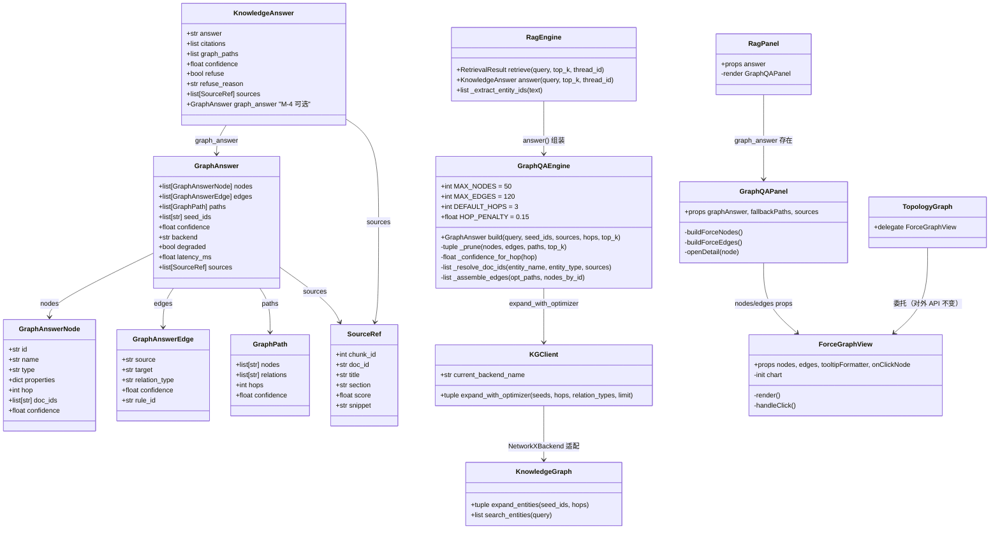
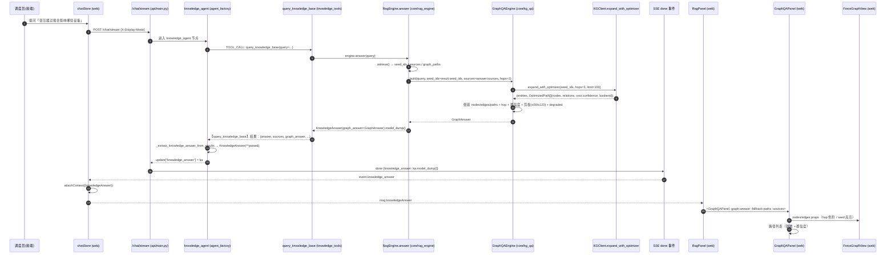
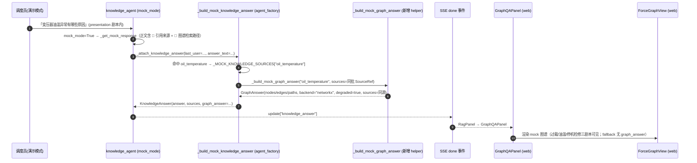
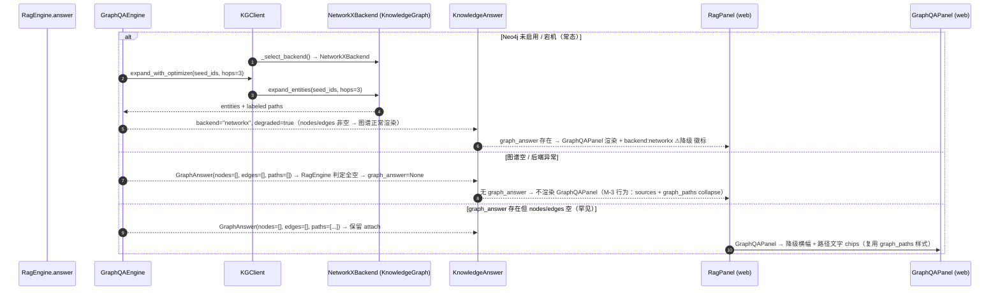

# GridMind（灵枢电网）M-4：知识图谱问答 UI · 系统架构设计与任务分解

**版本**：v1（2026-08-10）
**作者**：高见远（架构师）
**上游**：`docs/kg-qa-prd-2026-08-10.md`（M-4 PRD v1）+ 主理人已拍板的 7 个决策
**基线**：git HEAD `4752ab3`（P2 修复后 681 pytest passed）
**范围**：仅本批变更。**不做 M-5 会话记忆、不做独立 `/api/kg/qa` 端点、不做规则推导边**。
**约束**：向后兼容（KnowledgeAnswer 旧字段 + M-3 sources 不破坏；TopologyGraph 对外 API 不变 → 灰度页零回归）；中文 UI；无新增第三方依赖。

---

## 〇、现状核实摘要（已实测，代码为准）

| 项 | 实测结果 | 对 M-4 设计的影响 |
|---|---|---|
| `mcp_tools/tools/kg_reasoning_tools.py` | `kg_multi_hop_reason(seed_ids, hops=3, relation_types, top_k=5, min_confidence, use_optimizer)` 返回 `{entities: list[dict{id,name,type,properties}], paths: list[dict{nodes, relations, hops, confidence, estimated_latency_ms, backend}], backend, latency_ms, cache_hit, status}`；`kg_apply_rules(entity_id, ctx, rule_ids, min_confidence)` 返回 `{inferred_relations, rules_fired, rules_total, backend}`，且 `inference_engine_enabled=False` 时 inferred_relations=[] | **返回结构已满足图谱可视化所需，直接复用**；`kg_apply_rules` 注册但天然不产出规则边（决策 3 自动满足） |
| `core/rag_engine.py` | `retrieve()`：意图门控 → 向量检索 → `_extract_entity_ids`（私有方法，正则 ENTITY_PATTERNS + device_map）→ 灰度路由 → `_expand_via_neo4j` / `_expand_via_networkx`（NetworkX 2 跳）；`answer()` 产出 KnowledgeAnswer；`RetrievalResult` **无 seed_ids 字段** | 需把 `_extract_entity_ids` 提升为**模块级公开 util**（保留方法委托）；`RetrievalResult` 增 `seed_ids: list[str] = []`（可选，向后兼容） |
| `api/agents/agent_factory.py` | `AGENT_TOOLS_MAP.knowledge_agent` 当前 11 个工具（query_knowledge_base / search_knowledge_chunks / search_graph_entities / get_entity_relations / cypher_query / multi_hop_expand / find_devices_by_substation / get_fault_chain / get_applicable_regulations / search_feature_intro），**未注册 kg_multi_hop_reason / kg_apply_rules**；M-3 链路 `_extract_knowledge_answer_from_results` 用 `KnowledgeAnswer(**parsed)` 反解（工具结果含 `answer` 键）；`_build_mock_knowledge_answer` 基于 `_MOCK_KNOWLEDGE_SOURCES`（4 剧本） | **P0-3 注册 2 个图谱工具**；KnowledgeAnswer 加 `graph_answer` 后，`query_knowledge_base` 的 `answer.model_dump()` 可**零额外管道**自然透传（P0-4） |
| `api/schemas/__init__.py` | `KnowledgeAnswer{answer, citations, graph_paths, confidence, refuse, refuse_reason, sources}`；`GraphEntity{id,name,type,properties}`；`GraphRelation{source_id,target_id,relation_type}`；`SourceRef`（M-3 全字段）；前端 `web/src/types/index.ts` 已镜像 | 扩展点为 `graph_answer: GraphAnswer | None = None`，向后兼容 |
| `core/kg_client.py` / `core/knowledge_graph.py` | `KGClient._select_backend()`：`neo4j_enabled=False`（当前 .env 未设）→ `NetworkXBackend`；`expand_with_optimizer(seeds, hops, relation_types, limit)` → `(entities, list[OptimizedPath{nodes, relations, cost{hops, edge_count, estimated_latency_ms, confidence}, backend}])`；`current_backend_name`；`KGPathOptimizer.estimate_cost` 置信度公式**已是** `max(0, 1 - hops*0.15)`；KnowledgeGraph（NetworkX）`expand_entities` 返回**带标签的路径字符串** `名称--[label]-->名称` | GraphQAEngine 直接调 `expand_with_optimizer` 即得结构化 nodes/relations/confidence（决策 1/2/4 的公式已在 optimizer 内实现，无需重复造轮子） |
| `api/main.py` SSE done | `final["knowledge_answer"] = ka_raw.model_dump()`（当 result 含 knowledge_answer）；阻塞 /chat 路径 `KnowledgeAnswer(**ka_raw)` 反解 | **graph_answer 随 KnowledgeAnswer 内联，SSE done / ChatResponse / 前端 chatStore 管道零改动**（决策 6 天然成立） |
| `web/src/components/grayscale/TopologyGraph.vue` | ECharts 力导向图（GraphChart + tooltip XSS 转义 escapeTooltip + 主题联动 watchThemeChange），但**强绑定 grayscaleGraph store**（graph.nodes 的 load/errorRate/type 五类、mode/selectedNodeIds、source）；外部仅在 `GrayscalePanel.vue` 以 `<TopologyGraph />`（无 props）使用 | 抽 `ForceGraphView` props 子组件；TopologyGraph 委托且**对外零 props 不变**（决策 5） |
| `web/src/components/RagPanel.vue` | `answer` props；结构：标题（置信度 tag）→ sources 卡片区（CitationCard + DocFilterChips + 折叠）→ citations 文本回退 → graph_paths 文本 collapse | GraphQAPanel **内嵌在 sources 区之前**；nodes 空时复用 graph_paths collapse 样式兜底 |
| `web/src/stores/chatStore.ts` | `attachContext({knowledgeAnswer})` 挂到最近 assistant 消息；SSE done `event.knowledge_answer` → pendingKnowledgeAnswer → attachContext；阻塞路径 `resp.knowledge_answer` → attachContext | 前端类型加 `graph_answer` 后**管道零改动** |

---

## 一、实现方案与框架选型

### 1.1 核心难点与对策

| 难点 | 对策 |
|---|---|
| 图谱问答「结构化图数据」从哪来（现有 `graph_paths` 只是节点 id 串） | 新增 `core/kg_qa.py`（GraphQAEngine）编排层：复用公开实体抽取 → `KGClient.expand_with_optimizer(seed_ids, hops=3)` 拿结构化 `(entities, OptimizedPath{nodes, relations, cost.confidence, backend})` → 组装 `GraphAnswer`（节点/边/路径/置信度） |
| Neo4j 不可用是**常态**（当前环境 networkx 即默认后端） | KGClient 已内置 `_select_backend()` 自动降级；GraphQAEngine 只感知 `client.current_backend_name`；`backend=="networkx"` 时 `degraded=true`（US-4 语义），但 nodes/edges 非空 → 图谱**正常渲染**，问答不中断 |
| `TopologyGraph` 强绑定灰度 store，不能直接喂图谱问答数据 | 抽 `ForceGraphView.vue` props 子组件（nodes/edges 由调用方算好颜色/大小/载荷），TopologyGraph 委托之且对外 API 不变（零回归）；职责边界见共享知识 §7 |
| SSE done 内联多跳图载荷 | **载荷剪枝**（决策 4）：nodes ≤ 50 / edges ≤ 120 / paths top_k=5；剪枝优先保留 seed 与 hop 小、置信度高的路径 |
| 规则推导边是否引入行为变更 | 不启用（决策 3）：`kg_apply_rules` 仅注册，`inference_engine_enabled=False` 时天然返回空；GraphQAEngine 只展示 KG 已有关系边，`GraphAnswerEdge.rule_id` 恒为 None |
| 无 LLM Key 演示时也要见图谱面板 | mock `graph_answer` 覆盖 3 个知识剧本（过载/油温/停机检修），sources 与 `_MOCK_KNOWLEDGE_SOURCES` 同源（决策 7） |

### 1.2 后端架构：GraphQAEngine 图谱问答编排层

```
用户提问
  → knowledge_agent（AGENT_TOOLS_MAP 已含 kg_multi_hop_reason/kg_apply_rules + 提示词引导）
  → TOOL_CALL: query_knowledge_base → RagEngine.answer()
      ├─ retrieve()：向量召回 → extract_entity_ids（公开 util）→ 图谱扩展 → sources
      └─ GraphQAEngine.build(query, seed_ids=result.seed_ids, sources=answer.sources, hops=3)
           ├─ KGClient.expand_with_optimizer(seed_ids, hops=3, limit=100)
           │    └─ 自动 backend 选择：neo4j / networkx（KGClient 内置降级）
           ├─ 组装 GraphAnswerNode/Edge/Path（hop=最短距离、置信度公式）
           ├─ 载荷剪枝（nodes≤50 / edges≤120 / paths top_k=5）
           └─ GraphAnswer{backend, degraded, confidence, latency_ms, sources}
  → KnowledgeAnswer{answer, sources, graph_answer}
  → query_knowledge_base 返回 answer.model_dump()（含 graph_answer）
  → _extract_knowledge_answer_from_results → KnowledgeAnswer(**parsed)   # 零额外管道
  → SSE done 事件 knowledge_answer → chatStore.attachContext → RagPanel → GraphQAPanel
```

**组装规则（GraphQAEngine 内部）**：
1. **seed 提取**：未显式传 seed_ids 时用公开 util `extract_entity_ids(query)`（RagEngine 提升而来）；`RagEngine.answer()` 显式传 `result.seed_ids` 保证与检索同源（US-1「同源」）。
2. **扩展**：`expand_with_optimizer(seed_ids, hops=3, limit=100)`；异常/空 → 不抛错，返回空 GraphAnswer（由调用方决定是否 attach）。
3. **节点**：`hop` = 该节点到任一 seed 的最短距离（BFS over 组装边集；seed=0）；`confidence` = `_confidence_for_hop(hop)`（seed=1.0，其余 `max(0, 1-0.15*hop)`）；`doc_ids` = 按名称/类型模糊匹配 sources（title/filename 子串），P1-4 协同。
4. **边**：从每条 OptimizedPath 的 `nodes[i]→nodes[i+1]` + `relations[i]` 重建；`confidence = min(端点节点置信度)`；按 `(source, target, relation_type)` 去重。
5. **路径**：直接映射 OptimizedPath → GraphPath（`nodes` 为节点 id 序列、`relations` 长度 = hops、`confidence = max(0, 1-0.15*hops)`），按 confidence 降序取 top_k=5。
6. **综合置信度**：`GraphAnswer.confidence` = 路径置信度按 `weight_i = 1/(hops_i+1)` 加权平均（无路径但有节点 → 0.85；仅 seed → 1.0；全空 → 0.0）。
7. **降级标记**：`backend = client.current_backend_name`；`degraded = (backend == "networkx") or 组装过程异常`。

### 1.3 前端架构：ForceGraphView 泛化 + GraphQAPanel

```
RagPanel.vue
  ├─ GraphQAPanel.vue（answer.graph_answer 存在时渲染，位于 sources 区之前）
  │    ├─ 头部行：[图谱答案] backend 徽标(neo4j/networkx) ⚠降级  hops 截断标注
  │    ├─ ForceGraphView.vue（props 驱动力导向图；hover tooltip 转义；点击节点→详情）
  │    ├─ 路径列表（按跳数分组/排序：路径N (X跳) 置信度%）
  │    └─ 实体详情浮层（属性表 + 关联来源 CitationCard 列表 + 复制 doc_id）
  │    └─ 降级回退：nodes/edges 空 → 横幅 + 路径文字（复用 graph_paths collapse 样式）
  └─ 来源引用卡片区（M-3 原样，不受影响）
```

**ForceGraphView 泛化原则**：组件只负责 ECharts 力导向渲染（init/dispose、主题联动 watchThemeChange、tooltip formatter 注入、click 回调、图例、force 布局、roam/draggable、escapeTooltip 转义），**不感知任何业务语义**（灰度 load/errorRate 或图谱 hop/doc_ids 均在调用方算好成 props）。

### 1.4 框架选型结论（无新增依赖）

- 后端：Pydantic v2（现有）、NetworkX/Neo4j 双 backend（现有 KGClient）、无新增。
- 前端：ECharts ^5.6.0（**已在用**，因 F8 公告锁定 <6.1.0，本批**不升级**；ForceGraphView 抽离后未来升级回归面更小）、Vue 3 + Element Plus + Pinia（现有）。
- 无需新包、无需新配置、无需新端点（决策 6）。

---

## 二、文件列表（新增 / 修改，含相对路径）

### 后端（6 个：新增 2 + 修改 4）

| 文件 | 类型 | 改动内容 |
|---|---|---|
| `api/schemas/__init__.py` | 修改 | 新增 `GraphAnswerNode / GraphAnswerEdge / GraphPath / GraphAnswer`；`KnowledgeAnswer += graph_answer: GraphAnswer | None = None`；`__all__` 导出 4 个新类 |
| `core/kg_qa.py` | **新增** | `GraphQAEngine`（build / _prune / _confidence_for_hop / _resolve_doc_ids / _assemble_edges）+ `get_graph_qa_engine()` 单例 |
| `core/rag_engine.py` | 修改 | ① 模块级公开 util `extract_entity_ids(text, knowledge_graph=None)`（原 `_extract_entity_ids` 逻辑提升；原方法保留委托）；② `RetrievalResult.seed_ids` 透传（在 `retrieve()` 返回时写入）；③ `answer()` 正常路径调用 GraphQAEngine 组装 `graph_answer`（懒加载防循环；异常不阻断 RAG）；④ `entity/关系` 侧不做行为变更 |
| `mcp_tools/tools/knowledge_tools.py` | 修改 | `query_knowledge_base` 透传（`answer.model_dump()` 自动含 graph_answer，**几乎零改动**，仅确认/注释）；无需新端点 |
| `api/agents/agent_factory.py` | 修改 | ① `AGENT_TOOLS_MAP.knowledge_agent` 注册 `kg_multi_hop_reason` + `kg_apply_rules`（P0-3）；② `_build_mock_knowledge_answer` 为 3 个知识剧本补 `graph_answer`（P1-3，新增 `_build_mock_graph_answer` helper，sources 与 `_MOCK_KNOWLEDGE_SOURCES` 同源） |
| `prompts/system_prompts.py` | 修改 | `KNOWLEDGE_AGENT_PROMPT` 增加 2 个图谱工具说明 + 图谱类问题调用引导（「过载影响哪些设备/油温关联原因/停机检修流程」类问题优先 `kg_multi_hop_reason` 探索 + `query_knowledge_base` 取完整回答） |

### 前端（7 个：新增 4 + 修改 3）

| 文件 | 类型 | 改动内容 |
|---|---|---|
| `web/src/types/index.ts` | 修改 | 新增 `GraphAnswerNode / GraphAnswerEdge / GraphPath / GraphAnswer`（snake_case 镜像）+ `KnowledgeAnswer.graph_answer?: GraphAnswer | null`；新增 ForceGraphView 通用输入类型 `ForceGraphNodeInput / ForceGraphEdgeInput` |
| `web/src/utils/escape.ts` | **新增** | 导出 `escapeTooltip(s)`（TopologyGraph 现有实现上移为共享 util；`<`/`>` → `&lt;`/`&gt;`），三处复用（TopologyGraph / ForceGraphView / GraphQAPanel） |
| `web/src/components/grayscale/ForceGraphView.vue` | **新增** | props 驱动 ECharts 力导向图（见 §3.5）；init/dispose、主题联动、tooltip formatter、click 回调、图例、force 布局、转义 |
| `web/src/components/grayscale/TopologyGraph.vue` | 修改 | 重构为委托 ForceGraphView：把 store 的 graph.nodes/edges 映射为 ForceGraphView props（symbolSize=18+load*0.5、typeColor/errorRateColor、selected 边框），保留 plan 勾选逻辑；**对外 API 不变（零 props）** |
| `web/src/components/GraphQAPanel.vue` | **新增** | 图谱问答面板（头部 + 图谱图 + 路径列表 + 实体详情浮层 + 降级回退）；见 §3.6 |
| `web/src/components/RagPanel.vue` | 修改 | `answer.graph_answer` 存在时在 sources 区之前渲染 `<GraphQAPanel :graph-answer="answer.graph_answer" :fallback-paths="answer.graph_paths" :sources="answer.sources" />`；现有 sources/citations/graph_paths 行为不动 |
| `web/src/composables/useGraphAnswer.ts` | **新增** | 纯函数聚合：hop 色阶、type→symbolSize、`buildForceNodes/buildForceEdges`、`groupSourcesByDocIds`、`highlightPath` |

### 测试 / 脚本 / 文档（5 个：新增 4 + 修改 1）

| 文件 | 类型 | 改动内容 |
|---|---|---|
| `tests/test_kg_qa_schema.py` | **新增** | Schema 一致性断言（字段名/默认值）、KnowledgeAnswer 向后兼容（无 graph_answer 旧数据 model_dump 不包含该键）、GraphAnswer 序列化往返 |
| `tests/test_kg_qa_engine.py` | **新增** | GraphQAEngine 单测（NetworkX 路径：nodes/edges/paths/confidence/degraded）、载荷剪枝（>50 节点/120 边截断）、置信度公式、空 seed、sources 同源（US-5） |
| `tests/test_kg_qa_e2e.py` | **新增** | 真实链路（mock_mode 降级路径亦可）：`query_knowledge_base` → KnowledgeAnswer.graph_answer 非空；SSE done 事件含 graph_answer；降级路径（backend=networkx + 空图 → graph_answer=None） |
| `scripts/qa_m4_verify.py` | **新增** | 手工验证脚本（参照 `qa_m3_backend_verify.py` 模式）：打印 graph_answer 结构、backend/degraded、载荷数量、mock 三剧本 |
| `docs/kg-qa-architecture-2026-08-10.md` | **新增** | 本文档 + `docs/kg-qa-class-diagram.mermaid` + `docs/kg-qa-sequence-diagram.mermaid`（提取件，交付物维护） |

---

## 三、数据结构与接口

### 3.1 Schema（`api/schemas/__init__.py`，对齐 PRD §四 + 决策 2/4）

```python
class GraphAnswerNode(BaseModel):
    id: str
    name: str
    type: str                       # 设备/故障/处置/规程/部件/…
    properties: dict[str, Any] = {}  # 复用 KG 实体 properties
    hop: int | None = None          # 距 seed 最短距离（seed=0）；未知 → None
    doc_ids: list[str] = []         # 关联文档（P1-4 填充；名称/类型匹配 sources）
    confidence: float | None = None # seed=1.0；其余 max(0, 1-0.15*hop)

class GraphAnswerEdge(BaseModel):
    source: str
    target: str
    relation_type: str              # 触发/导致/包含/关联/处置/CAUSES/…
    confidence: float | None = None # min(端点节点置信度)
    rule_id: str | None = None      # 本批恒为 None（规则边不启用，决策 3）

class GraphPath(BaseModel):
    nodes: list[str]                # 节点 id 序列（有序）
    relations: list[str]            # 关系类型序列（len = nodes - 1）
    hops: int
    confidence: float               # max(0, 1 - 0.15*hops)

class GraphAnswer(BaseModel):
    nodes: list[GraphAnswerNode] = []
    edges: list[GraphAnswerEdge] = []
    paths: list[GraphPath] = []
    seed_ids: list[str] = []
    confidence: float = 0.0         # 路径置信度按 1/(hops+1) 加权平均
    backend: str = "networkx"       # "neo4j" | "networkx"
    degraded: bool = False          # backend=="networkx" 或组装异常 → True
    latency_ms: float = 0.0
    sources: list[SourceRef] = []   # 与 KnowledgeAnswer.sources 同源/子集（US-5）

class KnowledgeAnswer(BaseModel):
    ...  # 既有字段不变（向后兼容）
    graph_answer: GraphAnswer | None = None   # M-4 新增；无图谱问答时 None
```

### 3.2 GraphQAEngine（`core/kg_qa.py`）

```python
class GraphQAEngine:
    MAX_NODES = 50        # 载荷上限（决策 4）
    MAX_EDGES = 120
    DEFAULT_HOPS = 3
    HOP_PENALTY = 0.15    # 与 KGPathOptimizer.estimate_cost 一致

    def __init__(self, client: "KGClient | None" = None) -> None:
        self.client = client or get_kg_client()

    def build(
        self,
        query: str,
        seed_ids: list[str] | None = None,
        sources: list[SourceRef] | None = None,
        hops: int = DEFAULT_HOPS,
        top_k: int = 5,
    ) -> GraphAnswer:
        """组装 GraphAnswer。永不抛错：异常 → 返回空/degraded 的 GraphAnswer。
        无 seed → 返回空 GraphAnswer（调用方据此决定是否 attach）。"""

    def _prune(self, nodes, edges, paths, top_k) -> tuple[list, list, list]:
        """剪枝：paths 按 confidence 降序取 top_k；nodes≤MAX_NODES（保 seed +
        小 hop 优先）；edges≤MAX_EDGES（保高置信度路径上的边）。"""

    def _confidence_for_hop(self, hop: int) -> float:
        """seed=1.0；其余 max(0, 1 - 0.15*hop)。"""

    def _resolve_doc_ids(self, entity_name: str, entity_type: str, sources: list[SourceRef]) -> list[str]:
        """实体→doc_id：entity_name/type 与 sources[].title/filename 子串匹配；无 → []。"""

    def _assemble_edges(self, opt_paths, nodes_by_id) -> list[GraphAnswerEdge]:
        """从 OptimizedPath{nodes, relations} 重建边；(source,target,relation_type) 去重。"""

def get_graph_qa_engine() -> GraphQAEngine:
    """进程级单例（与 get_kg_client 同模式）。"""
```

### 3.3 RagEngine 增量（`core/rag_engine.py`）

```python
# 模块级公开 util（M-4 P0-1）——原 _extract_entity_ids 逻辑提升
def extract_entity_ids(text: str, knowledge_graph: Any | None = None) -> list[str]: ...

class RetrievalResult(BaseModel):   # api/schemas 内
    ...
    seed_ids: list[str] = []        # M-4 新增：本轮实体抽取的 seed（可选，向后兼容）

class RagEngine:
    def _extract_entity_ids(self, text: str) -> list[str]:
        return extract_entity_ids(text, self.knowledge_graph)   # 委托，保持私有方法

    def retrieve(...):  # 返回时写入 result.seed_ids = seed_ids

    def answer(self, query, top_k=3, thread_id="default") -> KnowledgeAnswer:
        # 正常路径（refuse 分支不组装 graph_answer）：
        answer = KnowledgeAnswer(...)
        if result.seed_ids:
            from core.kg_qa import get_graph_qa_engine      # 懒加载防循环
            ga = get_graph_qa_engine().build(
                query=query, seed_ids=result.seed_ids,
                sources=answer.sources, hops=3,
            )
            if ga.nodes or ga.edges or ga.paths:            # 全空 → 不 attach（M-3 行为）
                answer.graph_answer = ga
        return answer
```

### 3.4 agent_factory 增量（`api/agents/agent_factory.py`）

```python
AGENT_TOOLS_MAP["knowledge_agent"] = [
    # ... 既有 11 个 ...
    # M-4 P0-3：图谱问答工具（kg_apply_rules 注册但规则边默认不启用）
    "kg_multi_hop_reason",
    "kg_apply_rules",
]

# P1-3：mock graph_answer helper —— 3 剧本（oil_temperature/overload/shutdown）
# sources 复用 _MOCK_KNOWLEDGE_SOURCES 同一份 SourceRef 列表（US-5 同源）
def _build_mock_graph_answer(script: str, sources: list[SourceRef]) -> GraphAnswer: ...

# _build_mock_knowledge_answer 内：
#   油温/过载/停机检修 → ga = _build_mock_graph_answer(script, sources)；answer.graph_answer = ga
#   fallback 剧本 / feature-intro → 不附 graph_answer（决策 7）
```

### 3.5 ForceGraphView props（`web/src/components/grayscale/ForceGraphView.vue`）

```ts
// web/src/types/index.ts（T01 定义）
export interface ForceGraphNodeInput {
  id: string
  name: string
  symbolSize: number          // 直径 px，调用方算好（负载/类型权重）
  color: string               // 填充色（tokens），调用方算好
  borderColor?: string
  borderWidth?: number
  shadowBlur?: number
  shadowColor?: string
  category?: string           // 图例分类（可选）
  raw?: Record<string, unknown> | null   // 透传给 tooltipFormatter/click 的业务载荷
}
export interface ForceGraphEdgeInput {
  source: string
  target: string
  label?: string              // 边标签（如 relation_type）
  color?: string
  width?: number
  curveness?: number
  opacity?: number
}

// ForceGraphView.vue props（与 TopologyGraph 解耦的输入）
export interface ForceGraphViewProps {
  nodes: ForceGraphNodeInput[]
  edges: ForceGraphEdgeInput[]
  height?: number             // 默认 420
  minHeight?: number          // 默认 320
  legendData?: string[]       // 图例项（可选）
  tooltipFormatter?: (params: {
    dataType?: string
    data?: { name?: string; raw?: Record<string, unknown> | null }
  }) => string                // 调用方负责 escapeTooltip 转义
  onClickNode?: (node: { id: string; name?: string; raw?: Record<string, unknown> | null }) => void
  hintText?: string[]         // 底部图例提示行
  dataTest?: string
  emptyText?: string          // nodes/edges 空时展示
}
```

组件内部：`echarts.init/dispose`、`watchThemeChange(() => render())`、`roam:true, draggable:true`、force 布局常量（repulsion 180 / edgeLength 90 / gravity 0.1 / friction 0.6）、emphasis adjacency、`chart.on('click')` → `onClickNode`、tooltip `trigger:'item'` 使用注入的 formatter。

### 3.6 GraphQAPanel 组件接口（`web/src/components/GraphQAPanel.vue`）

```ts
export interface GraphQAPanelProps {
  graphAnswer: GraphAnswer
  fallbackPaths?: string[][]   // answer.graph_paths（降级回退文字）
  sources?: SourceRef[]        // answer.sources（节点详情关联来源聚合）
}
// emits: 无（详情浮层为组件内部状态）
```

行为规格：
- **头部行**：`[图谱答案]` + backend 徽标（neo4j=success / networkx=warning 文案）+ `degraded` 时弱提示 tag「当前为降级图谱，数据有限」+ 超 3 跳截断标注（`hops 上限 3`）。
- **图谱区**（nodes/edges 非空）：ForceGraphView，节点大小按类型权重（设备 28 / 故障 24 / 处置 20 / 其他 18），颜色按 hop 色阶（seed=0 brand 高亮边框 accent；1/2/3 跳 brand→info→warning 渐变），边标签 = relation_type；tooltip：名称(转义)/类型/hop/关联来源数/关键属性(≤3)；点击节点 → 实体详情浮层（属性表 + 关联来源 CitationCard 列表（按 node.doc_ids 过滤）+ 每个 doc_id 复制按钮 `navigator.clipboard`）。
- **路径列表区**：按跳数升序，每行「路径N (X跳) 置信度%」+ 节点链 chips（seed 高亮）；点击路径行 → 图谱高亮该路径（`highlightPath`，P1）。
- **降级回退**（nodes/edges 空但 graph_answer 存在）：显示降级横幅 + 路径文字 chips（复用 RagPanel 现有 graph_paths collapse 样式）。

### 3.7 类图（Mermaid classDiagram）



---

## 四、程序调用流程（时序图）

### 4.1 真实链路（US-1，SSE done 零新端点）



### 4.2 mock 链路（US-4 / P1-3，无 LLM Key 演示可见）



### 4.3 降级链路（US-4，Neo4j 挂 → NetworkX → 图谱空 → 路径文字回退）



---

## 五、任务列表（有序、含依赖、按实现顺序）

> 任务数 5（硬性上限）；每个任务 ≥ 3 个相关文件；按功能模块/层次分组；T01 为项目基础设施（数据契约 + 共享 util）。

### T01 数据契约与基础设施（P0）

- **名称**：GraphAnswer Schema + 前端类型镜像 + 实体抽取公开化
- **涉及文件**：
  - `api/schemas/__init__.py`（新增 4 个 GraphAnswer* 类；KnowledgeAnswer.graph_answer；__all__）
  - `web/src/types/index.ts`（镜像 GraphAnswer* + ForceGraphNodeInput/ForceGraphEdgeInput + KnowledgeAnswer.graph_answer）
  - `core/rag_engine.py`（模块级 `extract_entity_ids` 公开 util；`RetrievalResult.seed_ids`；`_extract_entity_ids` 委托）
  - `tests/test_kg_qa_schema.py`（新增）
- **依赖**：无（基础设施）
- **验收标准**：
  - must：`GraphAnswer*` 字段与 §3.1 完全一致；`KnowledgeAnswer.graph_answer` 默认 None；
  - must：旧数据（无 graph_answer 键）`KnowledgeAnswer(**parsed)` 正常反解，`model_dump()` 不含 graph_answer（向后兼容）；有 graph_answer 时序列化往返一致；
  - must：`core.rag_engine.extract_entity_ids("变压器过载")` 返回非空 seed；`RagEngine._extract_entity_ids` 行为与 M-3 完全一致；
  - must：`pytest tests/test_kg_qa_schema.py` 通过；`cd web && npm run type-check` 通过。

### T02 后端图谱问答编排层（P0）

- **名称**：GraphQAEngine + RagEngine 组装 + knowledge_agent 挂载图谱工具 + mock graph_answer
- **涉及文件**：
  - `core/kg_qa.py`（新增 GraphQAEngine + get_graph_qa_engine 单例）
  - `core/rag_engine.py`（`answer()` 组装 graph_answer，懒加载防循环，异常不阻断）
  - `api/agents/agent_factory.py`（注册 kg_multi_hop_reason/kg_apply_rules；`_build_mock_graph_answer` + `_build_mock_knowledge_answer` 补 3 剧本 graph_answer）
  - `prompts/system_prompts.py`（KNOWLEDGE_AGENT_PROMPT 图谱工具说明与调用引导）
  - `tests/test_kg_qa_engine.py`（新增）
- **依赖**：T01
- **验收标准**：
  - must：`GraphQAEngine.build(query="变压器过载会影响哪些设备", seed_ids=[...])` 返回 nodes/edges/paths 非空；`backend=="networkx"` 时 `degraded==true`；`paths[].confidence` 满足 `max(0, 1-0.15*hops)`；
  - must：`graph_answer.nodes` 至少含 1 个 seed（hop=0）及其 1/2 跳可达节点；`edges` 每条含 `relation_type`；`paths ≥ 1` 且 nodes/edges/paths 同源（同一轮 query 同一份数据）；
  - must：载荷剪枝生效（构造 >50 节点/120 边数据 → 截断且 seed 保留）；
  - must：`RagEngine.answer()` 正常路径产出带 graph_answer 的 KnowledgeAnswer；`query_knowledge_base` 的 model_dump 含 graph_answer；`_extract_knowledge_answer_from_results` 能反解（**零额外管道**）；
  - must：mock 模式 过载/油温/停机检修 三剧本 KnowledgeAnswer.graph_answer 非空且 `sources` 与 `_MOCK_KNOWLEDGE_SOURCES` 同源；fallback 剧本无 graph_answer；
  - must：`AGENT_TOOLS_MAP.knowledge_agent` 含 2 个新工具；`inference_engine_enabled=False` 时 `kg_apply_rules` 返回空（无规则边）；
  - must：`pytest tests/test_kg_qa_engine.py` 通过。

### T03 前端力导向图泛化（P0）

- **名称**：ForceGraphView props 子组件抽取 + TopologyGraph 委托（灰度零回归）
- **涉及文件**：
  - `web/src/components/grayscale/ForceGraphView.vue`（新增）
  - `web/src/components/grayscale/TopologyGraph.vue`（重构委托，对外 API 不变）
  - `web/src/utils/escape.ts`（新增，共享 escapeTooltip）
- **依赖**：T01（ForceGraphNodeInput 类型）
- **验收标准**：
  - must：ForceGraphView 纯 props 驱动（不 import grayscaleGraph store、不感知 GraphAnswer）；
  - must：主题/色盲 palette 联动（watchThemeChange）、tooltip 转义、click 回调、图例、roam/draggable 均可用；
  - must：TopologyGraph 以 `<TopologyGraph />`（零 props）在 `GrayscalePanel.vue` 正常渲染，灰度页（探索/规划勾选/load 大小/errorRate 颜色/source mock 提示）与重构前一致（**零回归**）；
  - must：`cd web && npm run type-check && npm run build` 通过。

### T04 前端图谱问答面板（P0/P1）

- **名称**：GraphQAPanel + RagPanel 内嵌 + 交互（hover/点击详情/复制 doc_id）+ 降级回退
- **涉及文件**：
  - `web/src/components/GraphQAPanel.vue`（新增）
  - `web/src/components/RagPanel.vue`（graph_answer 存在时内嵌 GraphQAPanel）
  - `web/src/composables/useGraphAnswer.ts`（新增：hop 色阶/type 权重/buildForceNodes/buildForceEdges/groupSourcesByDocIds/highlightPath）
- **依赖**：T01、T03
- **验收标准**：
  - must：`graph_answer` 存在时图谱面板出现在回答气泡内（RagPanel 内嵌），不跳转新页面；
  - must：图谱图渲染 nodes/edges；seed 高亮、边标签显示 relation_type、节点颜色按 hop 区分（US-1 should）；
  - must：hover 显示 tooltip（名称/类型/关键属性/距 seed 跳数/关联来源数），0.3s 内出现，文本经 escapeTooltip 转义（US-2）；
  - must：点击节点弹出实体详情（属性表 + 关联来源 CitationCard 列表 + doc_id 复制按钮），来源与来源卡片区指向同一批 doc_id（US-2/US-5 should）；
  - must：路径列表按跳数分组/排序，显示跳数与置信度（US-3）；
  - must：`degraded` 时显示 backend 徽标 + 弱提示；nodes/edges 空 → 降级为路径文字（不白屏不报错）（US-4）；
  - must：无 graph_answer 时 RagPanel 行为与 M-3 完全一致（来源卡片区不受影响）（US-5）；
  - must：`cd web && npm run type-check && npm run build` 通过。

### T05 端到端联调与收尾（P0）

- **名称**：全链路验证（真实 + mock + 降级）+ 全量回归 + 交付文档
- **涉及文件**：
  - `tests/test_kg_qa_e2e.py`（新增：SSE done 含 graph_answer / mock 三剧本 / 降级空图 → graph_answer=None）
  - `scripts/qa_m4_verify.py`（新增：手工验证脚本，打印 graph_answer/backend/degraded/载荷数量）
  - `docs/kg-qa-architecture-2026-08-10.md` + `docs/kg-qa-class-diagram.mermaid` + `docs/kg-qa-sequence-diagram.mermaid`（交付物维护）
- **依赖**：T02、T04
- **验收标准**：
  - must：`pytest` 全量通过（≥681 存量 + 新增 kg_qa 用例）；
  - must：`cd web && npm run type-check && npm run build` 通过；
  - must：SSE done 事件 `knowledge_answer.graph_answer` 透传且前端 attachContext 后 RagPanel 渲染图谱面板（真实 + mock 两路径手动验证）；
  - must：降级路径（Neo4j 关闭、空图）不白屏、无 graph_answer 时 M-3 行为一致；
  - must：三张交付文档（架构 + class + sequence）落盘且 mermaid 语法可渲染。

---

## 六、依赖包列表

**无新增第三方依赖。**

| 包 | 版本（现状） | 说明 |
|---|---|---|
| `echarts` | ^5.6.0（锁定，F8 豁免） | 已在用；ForceGraphView 复用现有 GraphChart + CanvasRenderer；**本批不升级 6.x**（P1-5 另立项回归，抽离后升级面更小） |
| `networkx` / `neo4j` | 现有 | KGClient 双 backend 已内置，GraphQAEngine 不新增驱动 |
| `pydantic` v2 | 现有 | GraphAnswer* 走现有 BaseModel 风格 |
| `vue` / `element-plus` / `pinia` / `vite` | 现有 | 前端零新增 |

---

## 七、共享知识（跨文件约定）

1. **graph_answer 命名规范**：全链路 snake_case 对齐——后端 Pydantic 字段名即下发字段名，前端 `web/src/types/index.ts` 逐字段同名镜像（`relation_type / seed_ids / latency_ms / doc_ids` 等），禁止前端再转 camelCase。
2. **backend / degraded 字段语义**：`backend ∈ {"neo4j","networkx"}`；`degraded = (backend=="networkx") or 组装异常`。注意**本环境 Neo4j 未启用，networkx 是常态降级**——degraded=true 仅作为 UI 弱提示（「当前为降级图谱，数据有限」），**不阻断问答**，也不表示错误。
3. **载荷剪枝规则**：`nodes ≤ 50 / edges ≤ 120 / paths top_k=5`；剪枝优先级：seed 节点必保留 → 保 hop 小 → 保置信度高；前端 hops>3 时截断并在面板标注（`hops 上限 3`）。
4. **置信度口径**（决策 2）：seed 节点=1.0；节点/路径 = `max(0, 1 - 0.15*hop)`；边 = `min(端点节点置信度)`；`GraphAnswer.confidence` = 路径置信度按 `1/(hops+1)` 加权平均（无路径有节点 → 0.85；仅 seed → 1.0；全空 → 0.0）。此公式与 `KGPathOptimizer.estimate_cost` 一致，禁止出现第二种口径。
5. **mock 一致性**（决策 7）：mock `graph_answer.sources` 必须与同轮 `KnowledgeAnswer.sources` **同一份 SourceRef 列表**（复用 `_MOCK_KNOWLEDGE_SOURCES` 构建），与正文「📄 引用来源」完全一致；mock 图谱的 nodes/edges/paths 要与正文「🔗 图谱检索路径」语义一致（同一批实体与关系）。
6. **ForceGraphView 职责边界**：只做 ECharts 力导向渲染（props 驱动 + 主题联动 + 转义 + 点击回调 + 图例）；**不感知**灰度 store（load/errorRate）与图谱问答（hop/doc_ids）。颜色/大小/业务 tooltip 一律在调用方（TopologyGraph / GraphQAPanel）算好成 props。TopologyGraph 对外 API（零 props）不变。
7. **降级展示规则**：① nodes/edges 非空 → 图谱正常渲染；② graph_answer 存在但 nodes/edges 空 → GraphQAPanel 显示降级横幅 + 路径文字 chips（复用 RagPanel 现有 graph_paths collapse 样式，不白屏）；③ graph_answer 整体为空（None）→ 不渲染 GraphQAPanel，RagPanel 完全 M-3 行为。
8. **SSE 透传**：graph_answer 随 `knowledge_answer` 内联；`api/main.py` SSE done / ChatResponse 与前端 `chatStore` 管道**零改动**（仅在类型层加字段）。后端任何环节为 graph_answer 做「额外管道」均属越界。
9. **规则边**：`kg_apply_rules` 注册但不作为 graph_answer 边来源（`inference_engine_enabled=False` 返回空）；`GraphAnswerEdge.rule_id` 本批恒为 None（决策 3）。
10. **向后兼容红线**：`RagEngine._extract_entity_ids` 保留（委托公开 util）；`KnowledgeAnswer` 旧字段与 M-3 sources 不变；`TopologyGraph` 对外 API 不变（灰度页零回归）；旧后端无 graph_answer 时前端行为与 M-3 完全一致。

---

## 八、待明确事项

1. **图谱节点 → 文档跳转**：本批只做「实体详情浮层 + 关联来源卡片 + 复制 doc_id」（决策 1）；独立文档浏览/定位页后续议，决定 US-2 could 与 P2-3。
2. **echarts 6.x 升级（PRD P1-5）**：本批**不升级**（F8 豁免持续；ForceGraphView 抽离后升级回归面已缩小），建议下批单独排期并回归拓扑渲染 + tooltip 富文本。
3. **`GraphAnswer.confidence` 加权口径**：已按主理人决策 2 定稿（1/(hops+1) 加权）；如需改为 min/算术平均，仅需改 `GraphQAEngine._prune`/组装处一行，测试已断言现口径。
4. **图谱问题触发面**：本批以「实体抽取 seed 非空」触发 graph_answer；若后续需显式「图谱意图分类器」提高召回（如「影响」「关联」等动词意图），可评估但**不引入新依赖**（当前提示词引导 + seed 触发已覆盖三剧本）。
5. **独立 `/api/kg/qa` 端点（P2-4）与规则推导边（P2-5）**：本批不做，留待后续立项；架构已预留（GraphQAEngine 独立可复用；rule_id 字段已存在）。

---

**分析完毕，待主理人审阅。** 全部结论基于代码/环境实测；任务列表可直接交工程师排期实现。
