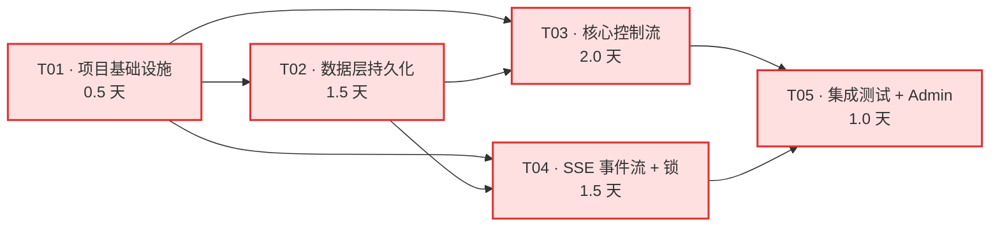

# GridMind LangGraph 后端改造（v1.5.1 前置） · 系统设计

> **作者** 高见远（架构师）
> **审阅** 待主理人齐活林 + 后端陈锐
> **日期** 2026-08-04
> **目标版本** GridMind v1.5.1 前置后端改造（pre-P0-3）
> **基线版本** GridMind v1.5.0 后端（MemorySaver + 16 列 HITL + 阻塞/HITL resume）
> **依赖 PRD** `docs/ui-v151-p0-3-prd-2026-08-04.md`（许清楚 v1.0）
> **配套架构** `docs/ui-v150-architecture-2026-08-04.md`（v1.5.0 总架构，基线）
> **配套 QA** `docs/ui-v150-qa-report-2026-08-04.md`（v1.5.0 55/55 PASS）
> **本文范围** **仅后端 LangGraph / 持久化 / SSE / 并发** 改造；**不涉及**前端 F1-F4 实现细节

---

## 0. 元信息

| 项 | 内容 |
|---|---|
| 文档版本 | v1.0 |
| 日期 | 2026-08-04 |
| 作者 | 高见远（架构师 Bob） |
| 上游依赖 | `ui-v151-p0-3-prd-2026-08-04.md` §7.4 八项验证 + §4.3 LangGraph 改造需求 + 主理人 8 项决策（2026-08-04 当日拍板） |
| 下游交付 | 工程师陈锐（后端）+ 工程师沈知行（前端 F1/F2）+ QA 林知夏（集成测试） |
| 本版本范围 | 仅 LangGraph checkpointer 持久化 + pause/resume/rewind + HITL 表升级 + SSE 事件扩展 + 多 tab 锁 + TTL |
| 关键风险 | rewind 后已执行工具的副作用不可逆；SQLite 写并发；SSE 命名冲突 |
| 验收口径 | 见 §10 |
| 与 v1.5.0 关系 | 增量改造，不破坏 P0-1/2/4 现有 16 列 HITL 审计 + MemorySaver 兜底（首启动迁移） |
| 不在范围 | 前端 F1/F2/F3/F4 实现、Neo4j 知识图谱改造（M0 单独项目）、性能压测（v1.6.0 单独做） |

### 0.1 主理人 8 项决策（2026-08-04 拍板，详见 PRD §7.4 后端 8 项验证回复）

| # | 决策 | 本文档落地位置 |
|---|---|---|
| 1 | checkpoint 持久化：`MemorySaver` → `AsyncSqliteSaver`（零运维） | §2.1 |
| 2 | pause：注入 `__interrupt__` 软信号 | §2.2.1 |
| 3 | rewind：`graph.update_state(history, as_node=...)` | §2.2.3 |
| 4 | TTL：30 分钟 | §2.3 |
| 5 | HITL 表加 3 列：`risk_level` / `pause_count` / `edit_count` | §2.4 |
| 6 | SSE 6 个新事件 type | §2.5 |
| 7 | 多 tab 锁：`threading.Lock` 字典 | §2.6 |
| 8 | 数据迁移：首次启动自动迁移；无历史迁移 | §2.1.3 |

---

## 1. 改造目标

### 1.1 业务目标（让 v1.5.1 F1/F2 可实施）

v1.5.0 已上线 P0-1/2/4，**P0-3 推理可编辑 + HITL 路径前置** 已被 v1.5.0 PRD §7.1 显式延后到 v1.5.1，原因是其依赖后端 LangGraph checkpoint 状态回退能力（PRD §1.2 + §7.4 标注为"最大风险点"）。

本版本后端改造的**唯一目的**是消除这个最大风险点：
- **F1 推理暂停/恢复**（PRD §3.1）→ 需要后端 `pause()` 软信号 + checkpoint 持久化
- **F2 推理步骤编辑 + 从此步重跑**（PRD §3.2）→ 需要后端 `rewind()` 历史状态回退 + 软重跑机制
- **F3 HITL 队列徽标**（PRD §3.3）→ 需要后端 `GET /audit/pending-count`（轻量） + SSE `hitl_interrupt` 主动推送
- **F4 HITL 弹窗前置**（PRD §3.4）→ 需要 SSE 事件能即时到达 + 现有 `done.interrupt_required` 升级

### 1.2 技术目标

| # | 目标 | 验收 |
|---|---|---|
| T-1 | checkpoint 持久化到 SQLite | 重启服务后 `get_state(thread_id)` 仍能拿到完整 state |
| T-2 | 暴露 `pause(thread_id)` API | 调后 200ms 内 SSE 推送 `reasoning_paused` |
| T-3 | 暴露 `rewind_to_step(thread_id, step_index, edited_content)` API | 调后从目标 step 重新执行，前序 steps 不变 |
| T-4 | TTL 默认 30 分钟 | checkpoint 30 分钟无活动后下次访问时返回 410 Gone |
| T-5 | HITL 表加 3 列 + 索引 + 迁移 | 旧库升级后 ALTER TABLE 成功 + 新列可写 |
| T-6 | SSE 6 个新事件 type | 现有 `data: {...}` 格式不变，type 字段扩展 |
| T-7 | 多 tab 锁 | 同一 thread_id 串行化，超时 5s 返回 503 |
| T-8 | 不破坏 v1.5.0 现有 API | 16 列 HITL 表 → 19 列；`/chat` `/interrupt/{id}/approve` `/interrupt/{id}/reject` 全部兼容 |

### 1.3 验收口径

- **核心**：服务重启后 checkpoint 仍在（杀进程 → 启进程 → 同一 thread_id 仍能 resume）
- **核心**：同一 session 多 tab 串行（一个 tab pause 时另一 tab pause 返回 503）
- **核心**：HITL 表加 3 列 + 不破坏 16 列已有数据
- **次要**：F1 暂停响应 ≤ 500ms（前端 spec）、F2 重跑从原 step 重启不重走已完成 steps
- **次要**：新 SSE 事件命名与 v1.5.0 现有 `type: token / done / error` 不冲突

---

## 2. 实现方案

### 2.1 Checkpoint 持久化（MemorySaver → AsyncSqliteSaver）

#### 2.1.1 设计选型

| 候选 | 优点 | 缺点 | 决策 |
|---|---|---|---|
| `MemorySaver`（现状）| 零配置 | 重启即丢 | ❌ 弃用 |
| `SqliteSaver`（同步）| 简单 | 阻塞 asyncio event loop | ❌ 不推荐 |
| **`AsyncSqliteSaver`**| 异步、零运维、单文件、易备份 | 写并发受 SQLite 限制 | ✅ **采用** |
| `PostgresSaver`（V1.6.0 候选）| 高并发、支持集群 | 需部署 PG、运维成本高 | ⏸ 延后到 V1.6.0 评估 |

**选型理由**：
- 项目当前数据库已是 SQLite（`mcp_tools/db/gridmind.db`），零运维成本延续
- LangGraph 1.2.10 + langgraph-checkpoint 4.1.0 已内置 `langgraph.checkpoint.sqlite.aio.AsyncSqliteSaver`
- 单文件易备份（`data/checkpoints.db` 可直接 `cp`）
- 写并发问题通过 `check_same_thread=False` + `aiosqlite` 解决（详见 §2.1.4）

#### 2.1.2 文件位置与初始化

- **数据文件**：`data/checkpoints.db`（运行时生成，git 忽略）
- **Schema**：由 `AsyncSqliteSaver.setup()` 自动创建（langgraph-checkpoint 4.1.0 内置）
- **初始化时机**：`GraphBuilder.__init__` 异步初始化（**当前 `__init__` 是同步方法，必须重构**）

```python
# 伪代码（架构示意，不含实现）
class GraphBuilder:
    def __init__(self, mcp_tools: list[BaseTool]) -> None:
        self.mcp_tools = mcp_tools
        # 同步部分：构建 StateGraph 框架
        self._builder = self._build_builder()
        self.checkpointer = None  # 延迟到 async_init

    async def async_init(self) -> None:
        """异步初始化 checkpointer（必须在事件循环中调用）"""
        from langgraph.checkpoint.sqlite.aio import AsyncSqliteSaver
        self.checkpointer = AsyncSqliteSaver.from_conn_string(
            "data/checkpoints.db"
        )
        await self.checkpointer.setup()  # 幂等建表
        self.graph = self._builder.compile(
            checkpointer=self.checkpointer,
            # TTL 配置：langgraph-checkpoint ≥ 4.1 支持
        )
        global COMPILED_GRAPH
        COMPILED_GRAPH = self.graph
```

#### 2.1.3 迁移策略

- **v1.5.0 之前**：`MemorySaver` 无持久化数据 → **无历史数据需要迁移**
- **v1.5.0 → v1.5.1 升级**：
  - 首次启动时 `AsyncSqliteSaver.setup()` 自动建表
  - 若 `data/checkpoints.db` 已存在（如开发环境）→ 不覆盖
  - 若 `data/checkpoints.db` 不存在 → 自动创建
- **回滚方案**：保留 `MemorySaver` 作为降级开关（环境变量 `GRIDMIND_CHECKPOINTER=memory`），紧急情况可临时切回

#### 2.1.4 风险与缓解

| 风险 | 等级 | 缓解策略 |
|---|---|---|
| SQLite 写并发（同进程多协程）| 中 | 1) `check_same_thread=False`；2) `aiosqlite` 单连接 + 串行化（LangGraph 内部已处理）；3) 单进程 FastAPI 部署足够；4) 多 worker 部署时 `gunicorn -k uvicorn.workers.UvicornWorker --workers 1`（**必须单 worker**）|
| 文件锁冲突（多 worker 同写）| 中 | 同上，单 worker；如需横向扩展升级到 Postgres（V1.6.0）|
| 文件损坏（断电）| 低 | SQLite WAL 模式 + `PRAGMA journal_mode=WAL`（`AsyncSqliteSaver` 默认开启）|
| 备份成本（单文件几十 MB）| 低 | `cp data/checkpoints.db data/backup/checkpoints-{ts}.db`；保留最近 7 天 |
| 首次启动慢（建表）| 低 | `setup()` 幂等 + 启动期 1-2 秒可接受 |

### 2.2 pause / rewind 机制（LangGraph 软实现）

#### 2.2.1 pause 设计（注入软中断信号）

**核心思路**：LangGraph 无原生 `pause()`，但支持 `interrupt()` 函数。设计为：在 state 中注入 `__pause__` 标志 → 下一个节点入口检查该标志 → 命中则 throw `interrupt({"pause": True})` → 图挂起。

**API 设计**：
```
POST /sessions/{thread_id}/pause
→ 200 OK { paused_at: ISO, paused_step: int, paused_node: str }
→ 409 SESSION_NOT_PAUSABLE（已完成/已 abort）
```

**实现要点**：
1. `GraphBuilder.pause(thread_id: str) -> dict`：
   - 获取当前 state：`self.graph.get_state({"configurable": {"thread_id": thread_id}})`
   - 注入 `__pause__` 标志：`self.graph.update_state(config, values={"__pause__": True, "paused_at": now_iso}, as_node=current_next_node)`
   - 不主动中断图执行 —— 等**当前 node 执行完**后，下一个 node 入口检查 `state.__pause__` 决定是否 throw interrupt
2. **节点入口检查**（在 4 个 Agent 节点和 Supervisor 节点统一增加 wrapper）：
   ```python
   async def _pause_check_wrapper(state):
       if state.get("__pause__"):
           from langgraph.types import interrupt
           interrupt({"pause": True, "paused_at": state.get("paused_at")})
       return state
   ```
3. **节点顺序调整**：每个 Agent 节点前增加 `_pause_check_node`，图拓扑变为 `Supervisor → PauseCheck → Agent → Supervisor`

**优势**：
- 完全基于 LangGraph 公开 API（`update_state` + `interrupt`）
- 不魔改 LangGraph 源码
- 暂停时间 ≤ 当前 node 执行剩余时间（多数情况 < 200ms）

**风险**：
- 长时间运行的 tool call（> 30s）暂停不立即生效 —— 需主理人决策是否要"硬中断"（V1.5.1 不做）

#### 2.2.2 resume 设计（复用现有 resume + 扩展 action）

**核心思路**：复用 `GraphBuilder.resume()`，新增 `action="continue_from_pause"` 表示从 `__pause__` 状态继续。

**API 设计**：
```
POST /sessions/{thread_id}/resume
Body: { action: "continue_from_pause" | "approved" | "rejected" | "edit_approved", ... }
→ 200 OK { resumed_at: ISO, current_node: str }
```

**实现要点**：
- 现有 `resume()` 已支持 `action="approved"/"rejected"/"edit_approved"`（HITL 恢复）
- 新增分支：`if action == "continue_from_pause": clear __pause__ flag → 注入 `Command(resume={"continue": True})`
- 关键：清除 `state["__pause__"]` 否则下次还会立即 throw interrupt

**风险**：
- 与现有 HITL resume 路径耦合（同样走 `Command(resume=...)`）—— 必须严格区分 `action` 字段
- 单元测试必须覆盖 4 种 action 的不同行为

#### 2.2.3 rewind 设计（历史状态注入）

**核心思路**：LangGraph 1.2.10 提供 `graph.get_state_history(config)` 返回所有 checkpoint 历史 + `graph.update_state(config, values=..., as_node=...)` 注入历史状态。组合两者实现 rewind。

**API 设计**：
```
POST /sessions/{thread_id}/rewind
Body: { step_index: int, edited_content?: dict[str, Any] }
→ 200 OK { rewound_to: { step_index, checkpoint_id, timestamp }, new_steps: [] }
→ 409 STEP_NOT_EDITABLE（不可编辑的 step）
→ 404 STEP_NOT_FOUND
```

**实现要点**：
1. `GraphBuilder.rewind_to_step(thread_id, step_index, edited_content=None) -> dict`：
   - 拉历史：`history = [s async for s in self.graph.aget_state_history(config)]`
   - 找到目标 step（按 `step_index` 匹配，**或按 checkpoint_id**）：`target_state = history[step_index]`
   - 注入新 state：
     ```python
     new_values = dict(target_state.values)
     if edited_content:
         new_values.update(edited_content)  # 替换 prompt 片段
     await self.graph.aupdate_state(
         target_state.config,
         values=new_values,
         as_node=target_state.next[0] if target_state.next else None,
     )
     ```
   - 返回：`{rewound_to: {step_index, checkpoint_id, timestamp}, new_steps: extracted_from_state}`
2. **as_node 关键**：必须设为 `target_state.next[0]`（即该 checkpoint 即将执行的下一个 node），否则 LangGraph 会从入口重新跑
3. **软重跑逻辑**（F2 PRD §3.2 验收）：从该 step 重新执行 LLM 调用 —— LangGraph 默认行为就是从该 checkpoint 继续，**不需要额外"跳过已执行工具"逻辑**（因为 checkpoint 已经记录了"哪些 tool 已执行"）

**风险与限制**：
- **rewind 后已执行的 tool call 副作用不可逆**（如已下工单、已发告警）—— 必须由**业务侧**在 tool 内部加幂等检查（如告警 ID 去重）；架构侧**仅记录**在 audit log
- **rewind 到 step 0** 等价于完全重启，无需特殊处理
- **rewind 后 step 数变化**：返回的 `new_steps` 可能与前端缓存不一致，必须 SSE 推送 `step_replaced` 事件通知前端清空后续 steps

#### 2.2.4 abort 设计（强制中止）

**API 设计**：
```
POST /sessions/{thread_id}/abort
Body: { reason?: str }
→ 200 OK { aborted_at: ISO }
```

**实现要点**：
- 简单方式：在 state 注入 `__abort__=True` 标志，节点入口检查后 throw `interrupt({"abort": True})`，前端收到后停止 SSE 消费
- 不直接调用 `graph.stop()`（LangGraph 无此 API）
- 与 pause 区别：abort 后**不可 resume**（state 中 `__abort__` 永久存在直到 session 过期）

### 2.3 TTL + Checkpoint 清理

#### 2.3.1 TTL 配置

- **默认值**：30 分钟（1800 秒）
- **环境变量**：`GRIDMIND_CHECKPOINT_TTL_SECONDS=1800`
- **langgraph-checkpoint 配置**：`AsyncSqliteSaver` 通过 `serde` + `ttl` 配置（**需查 4.1.0 文档确认 API**，T01 任务期间验证）

**兜底**：若 langgraph-checkpoint 4.1.0 不支持原生 TTL，则在 `CheckpointService` 中实现应用层 TTL（详见 §2.3.2）。

#### 2.3.2 应用层 TTL 清理（兜底方案）

**核心思路**：不依赖 langgraph-checkpoint 内部 TTL，而是定期扫描 `checkpoints` 表清理过期记录。

**清理策略**：
- 后台 task：每 5 分钟跑一次
- 保留规则：每个 `thread_id` 保留最后 1 个 + 当前活跃的（防止 abort 后无法查）
- 清理 SQL：`DELETE FROM checkpoints WHERE thread_id = ? AND checkpoint_id NOT IN (last_one, current_active) AND created_at < datetime('now', '-30 minutes')`
- 实现位置：`api/services/checkpoint_service.py`（新建）

**优势**：
- 不依赖 langgraph-checkpoint 版本能力
- 可观测（admin 端点能查清理记录）

**风险**：
- 后台 task 异常需监控（建议加 metric `checkpoint_cleanup_failures_total`）
- 大量 thread_id 时扫描慢（SQLite 无分区，几十 MB 数据 5 分钟扫一次足够）

#### 2.3.3 Admin 端点

```
GET /admin/checkpoint-stats
Headers: X-Admin-Token: <env>
→ 200 OK {
    total_checkpoints: int,
    total_threads: int,
    expired_cleaned_24h: int,
    active_sessions: int,
    db_size_bytes: int,
    ttl_seconds: int
  }
```

- 鉴权：环境变量 `GRIDMIND_ADMIN_TOKEN`（与现有 `grayscale_admin_service` 一致）
- 数据源：直接 `SELECT count(*)` + `SELECT count(*)` + 读 SQLite 元信息

### 2.4 HITL 表升级

#### 2.4.1 Schema 变更

**当前表**（`mcp_tools/db/database.py:124-141`，16 列）：
```sql
CREATE TABLE IF NOT EXISTS hitl_audit_log (
    id, thread_id, interrupt_node, tool_name, user_id, user_name, user_role,
    decision, original_args, edited_args, edit_reason, safety_recheck_result,
    reason, ip_address, user_agent, created_at
);
```

**目标表**（19 列）：
```sql
-- 现有 16 列保持不变
ALTER TABLE hitl_audit_log ADD COLUMN risk_level TEXT NOT NULL DEFAULT 'normal'
    CHECK(risk_level IN ('low','normal','high','critical'));
ALTER TABLE hitl_audit_log ADD COLUMN pause_count INTEGER NOT NULL DEFAULT 0;
ALTER TABLE hitl_audit_log ADD COLUMN edit_count INTEGER NOT NULL DEFAULT 0;

-- 新索引
CREATE INDEX IF NOT EXISTS idx_hitl_risk_level ON hitl_audit_log(risk_level);
CREATE INDEX IF NOT EXISTS idx_hitl_pause_count ON hitl_audit_log(pause_count) WHERE pause_count > 0;
CREATE INDEX IF NOT EXISTS idx_hitl_edit_count ON hitl_audit_log(edit_count) WHERE edit_count > 0;
```

#### 2.4.2 迁移策略

- **时机**：`init_db()` 在 `mcp_tools/db/database.py` 启动时执行
- **幂等**：`ALTER TABLE ADD COLUMN` 在 SQLite 中**重复执行报错** → 用 `PRAGMA table_info(hitl_audit_log)` 先检查列是否存在
- **回滚**：3 列均可空（`DEFAULT 'normal'` / `DEFAULT 0`），旧数据自动填充默认值

**迁移代码骨架**（`database.py` 新增 `_ensure_hitl_columns` 函数，伪代码）：
```python
def _ensure_hitl_columns(conn):
    cols = {row[1] for row in conn.execute("PRAGMA table_info(hitl_audit_log)").fetchall()}
    if "risk_level" not in cols:
        conn.execute("ALTER TABLE hitl_audit_log ADD COLUMN risk_level TEXT NOT NULL DEFAULT 'normal'")
    if "pause_count" not in cols:
        conn.execute("ALTER TABLE hitl_audit_log ADD COLUMN pause_count INTEGER NOT NULL DEFAULT 0")
    if "edit_count" not in cols:
        conn.execute("ALTER TABLE hitl_audit_log ADD COLUMN edit_count INTEGER NOT NULL DEFAULT 0")
    # 索引（IF NOT EXISTS 幂等）
    conn.execute("CREATE INDEX IF NOT EXISTS idx_hitl_risk_level ON hitl_audit_log(risk_level)")
```

#### 2.4.3 risk_level 分级策略（待 §8.3 业务侧决策）

| 等级 | 判定方式（推荐） | UI 表现 |
|---|---|---|
| `low` | tool 类别 = `monitor` / `knowledge` | 灰底小徽标 |
| `normal` | 默认（80% 场景）| 蓝底 |
| `high` | tool 类别 = `safety` / `diagnosis` 且 AI 置信度 < 0.7 | 黄底 |
| `critical` | tool 在 `HIGH_RISK_TOOLS` 列表 | 红底 + 强制 HITL 弹窗 |

**注**：分级策略由**业务侧（主理人 + 产品）**最终拍板，本架构提供**写入和查询能力**，**不强制**实现自动分级（首次上线 risk_level 全部为 'normal' 即可）。

#### 2.4.4 Query 扩展

`api/services/hitl_audit_service.py` 现有 query：
- `query_by_thread(thread_id)` → 增加 `risk_level` 可选参数
- `query_by_decision(decision)` → 增加 `risk_level` 可选参数
- `query_pending_count()` → 已存在（轻量，加索引后毫秒级）

新增函数 `query_by_risk_level(risk_level, limit, offset)`：供 F3 徽标按风险等级统计。

### 2.5 SSE 事件扩展

#### 2.5.1 现有事件格式（v1.5.0）

`api/main.py:316-324` 已有 SSE 端点，事件格式：
```
data: {"type": "token", "content": "..."}
data: {"type": "done", "thread_id": "...", "interrupt_required": true, ...}
data: {"type": "error", "content": "..."}
data: [DONE]
```

#### 2.5.2 新增 6 个事件 type

| 事件 type | payload | 触发时机 | 前端处理 |
|---|---|---|---|
| `reasoning_paused` | `{thread_id, current_step, paused_at}` | 后端确认 pause | `reasoningStore.onSsePaused` |
| `reasoning_resumed` | `{thread_id, resumed_at}` | 后端确认 resume | `reasoningStore.onSseResumed` |
| `step_replaced` | `{thread_id, step_index, old_content_hash, new_content_hash, new_steps[]}` | rewind 后从该 step 重新生成 | `reasoningStore.onSseStepReplaced` |
| `hitl_interrupt` | `{thread_id, task_id, step_id, ai_suggestion, confidence, risk_level, interrupt_required: true}` | 后端请求 HITL | `chatStore.interruptRequired = true` + `auditStore.onSseHitlInterrupt` |
| `hitl_resolved` | `{thread_id, task_id, decision, resolved_at}` | 用户审批后 | `auditStore.onSseHitlResolved` |
| `reasoning_error` | `{thread_id, error, recoverable, error_step}` | 推理异常 | `reasoningStore.markError` |

**格式保持**：`data: {"type": "reasoning_paused", "thread_id": "...", ...}` —— 与现有 `data: {...}` 完全一致，type 字段扩展。

#### 2.5.3 命名冲突检查

| 现有 type | 新增 type | 冲突？ |
|---|---|---|
| `token` | `reasoning_paused` | ❌ |
| `done` | `reasoning_resumed` | ❌ |
| `error` | `step_replaced` | ❌ |
| `[DONE]` | `hitl_interrupt` | ❌ |
| | `hitl_resolved` | ❌ |
| | `reasoning_error` | ❌ |

**结论**：6 个新 type 与 v1.5.0 现有 3 个 + 终止符 0 冲突。

#### 2.5.4 实现位置

`api/services/sse_event_emitter.py`（新建）：封装 SSE 事件生成器
- `class SSEEventEmitter`：
  - `emit_reasoning_paused(thread_id, current_step)` → `yield f"data: {json.dumps({...})}\n\n"`
  - `emit_reasoning_resumed(thread_id)` → ...
  - `emit_step_replaced(thread_id, step_index, old_hash, new_hash, new_steps)` → ...
  - `emit_hitl_interrupt(task)` → ...
  - `emit_hitl_resolved(task_id, decision)` → ...
  - `emit_reasoning_error(thread_id, error, recoverable, step)` → ...
- 集成点：`api/main.py` 的 `chat_stream` 端点改用 `SSEEventEmitter` 而非内联 `json.dumps`

### 2.6 多 Tab 锁

#### 2.6.1 设计

**核心思路**：用 `threading.Lock` per thread_id 字典，写路径加锁，读路径（get_state）不加锁。

```python
# api/services/session_lock.py（新建）伪代码
import threading
from contextlib import contextmanager
import time

class SessionLockManager:
    def __init__(self):
        self._locks: dict[str, threading.Lock] = {}
        self._meta_lock = threading.Lock()  # 保护 _locks 字典本身

    def _get_lock(self, thread_id: str) -> threading.Lock:
        with self._meta_lock:
            if thread_id not in self._locks:
                self._locks[thread_id] = threading.Lock()
            return self._locks[thread_id]

    @contextmanager
    def acquire(self, thread_id: str, timeout: float = 5.0):
        lock = self._get_lock(thread_id)
        acquired = lock.acquire(timeout=timeout)
        if not acquired:
            raise SessionLockTimeout(thread_id, timeout)
        try:
            yield
        finally:
            lock.release()

    def cleanup(self, thread_id: str):
        """session 终止时清理（防止字典无限增长）"""
        with self._meta_lock:
            self._locks.pop(thread_id, None)
```

#### 2.6.2 锁保护范围

| 操作 | 锁？ | 原因 |
|---|---|---|
| `graph.run(thread_id, message)` | ✅ 写 | 启动新推理 |
| `graph.pause(thread_id)` | ✅ 写 | 注入 `__pause__` 标志 |
| `graph.resume(thread_id, ...)` | ✅ 写 | 清除 `__pause__` 或注入 HITL 审批 |
| `graph.rewind_to_step(thread_id, ...)` | ✅ 写 | `update_state` 注入历史 |
| `graph.abort(thread_id)` | ✅ 写 | 注入 `__abort__` 标志 |
| `graph.get_state(thread_id)` | ❌ 读 | 不修改 state，多 tab 并发读安全 |
| `graph.aget_state_history(thread_id)` | ❌ 读 | 同上 |

#### 2.6.3 超时与降级

- **默认超时**：5 秒
- **超时行为**：返回 HTTP 503，body `{code: "SESSION_LOCKED", message: "..."}`，前端应展示 "另一 tab 正在操作，请稍后再试"
- **降级**：超时不应阻塞 SSE 推送（读路径独立）

#### 2.6.4 字典清理

- `cleanup(thread_id)` 在 `abort()` 或 TTL 过期时调用
- 防字典内存泄漏：单实例 10 万 thread_id ≈ 10 MB 内存，**可接受**，无需 LRU

#### 2.6.5 与 LangGraph 自身串行化的关系

**LangGraph 1.2.10 行为**：同一 `thread_id` 的 `ainvoke` 调用**默认串行化**（内部锁），但 `update_state`（pause/rewind 用）**不串行化**。

**结论**：LangGraph 自带串行化不足以覆盖本场景，**必须额外加 session_lock**（决策 7）。

---

## 3. 文件清单

### 3.1 新增文件（4 个服务文件 + 1 个数据文件 + 1 个 admin 端点）

| 路径 | 用途 | 关联任务 |
|---|---|---|
| 🆕 `api/services/checkpoint_service.py` | Checkpoint 管理（TTL 清理 + 持久化封装 + 统计）| T02 |
| 🆕 `api/services/session_lock.py` | per-thread_id 锁管理（`SessionLockManager`）| T04 |
| 🆕 `api/services/sse_event_emitter.py` | SSE 事件封装（6 个新事件）| T04 |
| 🆕 `api/schemas/checkpoint.py` | Pydantic schemas（`PauseRequest` / `ResumeRequest` / `RewindRequest` / `CheckpointStats`）| T03 |
| 🆕 `data/checkpoints.db`（运行时生成）| LangGraph checkpoint 持久化数据 | T02 |
| 🆕 `api/services/__init__.py`（扩展）| 导出新服务模块 | T01 |

### 3.2 修改文件（10 个）

| 路径 | 改动点 | 关联任务 |
|---|---|---|
| ✏️ `api/graph.py` | `MemorySaver` → `AsyncSqliteSaver`（L99）+ `__init__` 重构支持 `async_init` + 新增 `pause` / `rewind_to_step` / `abort` 方法 + 节点加 `_pause_check_node` | T02 / T03 |
| ✏️ `api/main.py` | 启动钩子 `await graph_builder.async_init()` + 新增 4 个 REST 端点（`/sessions/{id}/pause` / `/resume` / `/rewind` / `/abort`）+ 新增 1 个 admin 端点（`/admin/checkpoint-stats`）+ SSE 端点改用 `SSEEventEmitter` | T01 / T03 / T04 / T05 |
| ✏️ `mcp_tools/db/database.py` | `init_db()` 加 `_ensure_hitl_columns` 迁移函数 + 3 个新索引 | T02 |
| ✏️ `api/services/hitl_audit_service.py` | `query_by_thread` / `query_by_decision` 加 `risk_level` 过滤参数 + 新增 `query_by_risk_level` 函数 + 审计写入加 `risk_level` 字段 | T02 |
| ✏️ `api/schemas/__init__.py` | 导出 `RiskLevel` 枚举 + `HitlAuditLogEntry` 扩展 3 字段 | T02 |
| ✏️ `api/config.py` | 加 `checkpoint_db_path` / `checkpoint_ttl_seconds` / `admin_token` 配置项 | T01 |
| ✏️ `api/agents/*.py`（4 个文件）| 节点入口加 `pause_check` 包装（仅 supervisor / monitor / safety / diagnosis / knowledge 共 5 个节点）| T03 |
| ✏️ `requirements.txt` | 加 `aiosqlite>=0.19.0` | T01 |
| ✏️ `.env.example` | 加 `GRIDMIND_CHECKPOINT_DB_PATH` / `GRIDMIND_CHECKPOINT_TTL_SECONDS` / `GRIDMIND_ADMIN_TOKEN` | T01 |
| ✏️ `tests/test_checkpoint_persistence.py`（新建测试）| 验证重启后 checkpoint 仍在 | T05 |
| ✏️ `tests/test_pause_rewind.py`（新建测试）| 验证 pause / resume / rewind 行为 | T05 |
| ✏️ `tests/test_multi_tab_lock.py`（新建测试）| 验证 session_lock 串行化 | T05 |
| ✏️ `tests/test_hitl_table_migration.py`（新建测试）| 验证 ALTER TABLE 幂等 + 新列可写 | T05 |

### 3.3 不修改文件（v1.5.0 兼容性边界）

- `web/src/**`（前端 F1/F2/F3/F4 在前端独立 PRD 中定义）
- `core/**`（LLM client / 业务核心不受影响）
- `prompts/**`（system prompts 不变）

---

## 4. 数据结构与接口

### 4.1 新增 Pydantic schema（`api/schemas/checkpoint.py`）

```python
from enum import Enum
from typing import Any, Literal
from pydantic import BaseModel, Field


class RiskLevel(str, Enum):
    """HITL 风险分级（V1.5.1 新增）"""
    LOW = "low"
    NORMAL = "normal"
    HIGH = "high"
    CRITICAL = "critical"


class PauseRequest(BaseModel):
    """暂停推理请求（无 body，仅 path 参数 thread_id）"""
    thread_id: str = Field(..., description="会话线程 ID")


class ResumeRequest(BaseModel):
    """恢复推理请求"""
    thread_id: str
    action: Literal["continue_from_pause", "approved", "rejected", "edit_approved"] = "continue_from_pause"
    reason: str = ""
    edited_args: dict[str, Any] | None = None
    edit_reason: str = ""


class RewindRequest(BaseModel):
    """回退到指定 step 重跑请求"""
    thread_id: str
    step_index: int = Field(..., ge=0, description="目标 step 索引（0-based）")
    edited_content: dict[str, Any] | None = Field(
        None, description="编辑后内容（可选，仅改 prompt 片段）"
    )


class AbortRequest(BaseModel):
    """强制中止推理请求"""
    thread_id: str
    reason: str = ""


class CheckpointStats(BaseModel):
    """Checkpoint 统计信息（admin 端点返回）"""
    total_checkpoints: int
    total_threads: int
    expired_cleaned_24h: int
    active_sessions: int
    db_size_bytes: int
    ttl_seconds: int


class StepCheckpoint(BaseModel):
    """单个 step 的 checkpoint 信息（rewind 前读取可编辑范围）"""
    step_index: int
    step_id: str
    name: str
    description: str
    prompt_fragment: str
    is_editable: bool
    checkpoint_id: str
    created_at: str


class RewindResponse(BaseModel):
    """rewind 响应"""
    rewound_to: dict[str, Any]  # {step_index, checkpoint_id, timestamp}
    new_steps: list[StepCheckpoint]
    new_thread_state: dict[str, Any] | None = None


class PauseResponse(BaseModel):
    """pause 响应"""
    paused_at: str
    paused_step: int
    paused_node: str
    resume_token: str = Field(..., description="恢复 token（V1.5.1 暂未使用，留扩展位）")


class ResumeResponse(BaseModel):
    """resume 响应"""
    resumed_at: str
    current_node: str


class AbortResponse(BaseModel):
    """abort 响应"""
    aborted_at: str
    reason: str
```

### 4.2 现有 schema 扩展（`api/schemas/__init__.py`）

```python
# 现有 HitlAuditLogEntry 扩展（向后兼容）
class HitlAuditLogEntry(BaseModel):
    id: int
    thread_id: str
    interrupt_node: str
    tool_name: str
    user_id: str = "anonymous"
    user_name: str | None = None
    user_role: str | None = None
    decision: str
    original_args: str
    edited_args: str | None = None
    edit_reason: str | None = None
    safety_recheck_result: str | None = None
    reason: str | None = None
    ip_address: str | None = None
    user_agent: str | None = None
    created_at: str
    # V1.5.1 新增 3 字段
    risk_level: RiskLevel = RiskLevel.NORMAL
    pause_count: int = 0
    edit_count: int = 0
```

### 4.3 类图（详细见 `docs/class-diagram.mermaid`）

核心类关系：
- `GraphBuilder`（持有）→ `AsyncSqliteSaver`（LangGraph 提供）
- `GraphBuilder`（持有）→ `SessionLockManager`
- `GraphBuilder`（持有）→ `SSEEventEmitter`
- `GraphBuilder`（持有）→ `CheckpointService`
- `CheckpointService`（依赖）→ `AsyncSqliteSaver` + `RiskLevel`
- `SessionLockManager`（独立，无外部依赖）
- `SSEEventEmitter`（独立，无外部依赖）

---

## 5. 时序图

### 5.1 pause / resume 时序

详见 `docs/sequence-diagram.mermaid` §1。

### 5.2 rewind 时序

详见 `docs/sequence-diagram.mermaid` §2。

### 5.3 SSE 事件流时序

详见 `docs/sequence-diagram.mermaid` §3。

### 5.4 多 Tab 锁时序

详见 `docs/sequence-diagram.mermaid` §4。

### 5.5 Checkpoint TTL 清理时序

详见 `docs/sequence-diagram.mermaid` §5。

---

## 6. 任务列表（T01-T05）

> **遵循规则**：
> - 任务数 ≤ 5（硬性上限）
> - 每个任务 ≥ 3 个相关文件
> - 第一个任务 = 项目基础设施
> - 任务按依赖排序

### T01 · 项目基础设施（P0 · 0.5 人天）

**目标**：搭建后端改造的"地基"——依赖、配置、目录结构、入口改造。

**Source Files**：
- ✏️ `requirements.txt`（加 `aiosqlite>=0.19.0`）
- ✏️ `api/config.py`（加 `checkpoint_db_path` / `checkpoint_ttl_seconds` / `admin_token` / `checkpointer_type` 4 个配置项）
- ✏️ `.env.example`（加 4 个环境变量示例）
- 🆕 `data/.gitkeep`（占位，data/ 目录入库）
- ✏️ `api/services/__init__.py`（导出新服务模块）
- ✏️ `api/main.py`（`lifespan` 钩子加 `await graph_builder.async_init()`）

**Dependencies**：无

**Priority**：P0

**Sprint**：Sprint 1（第 1-2 天）

**详细工作清单**：
1. `requirements.txt` 第 12 行后追加 `aiosqlite>=0.19.0`
2. `api/config.py` 加 4 个 Settings 字段（带 env 前缀 `GRIDMIND_CHECKPOINT_*`）
3. `.env.example` 追加 4 个环境变量 + 注释
4. 创建 `data/` 目录占位文件（`.gitkeep`），`.gitignore` 忽略 `data/checkpoints.db` / `data/gridmind.db`
5. `api/services/__init__.py` 增加 `from . import checkpoint_service, session_lock, sse_event_emitter`
6. `api/main.py` 用 `lifespan` 上下文管理器替换现有启动逻辑（保留向后兼容），新增 `@asynccontextmanager async def lifespan(app)` 中 `await graph_builder.async_init()`

**验收**：
- `pip install -r requirements.txt` 成功
- `python -c "from api.config import settings; print(settings.checkpoint_db_path)"` 输出预期路径
- 启动服务无 `ModuleNotFoundError: aiosqlite` 错误

---

### T02 · 数据层持久化（P0 · 1.5 人天）

**目标**：checkpoint 持久化到 SQLite + HITL 表升级 + 审计服务扩展。

**Source Files**：
- ✏️ `api/graph.py`（L99 `MemorySaver()` → `AsyncSqliteSaver.from_conn_string("data/checkpoints.db")`，L55-58 `__init__` 重构为同步构建 + `async_init` 异步初始化）
- 🆕 `api/services/checkpoint_service.py`（`CheckpointService` 类，封装 `AsyncSqliteSaver` + 提供 `get_stats()` / `cleanup_expired()` / `register_cleanup_task()`）
- ✏️ `mcp_tools/db/database.py`（加 `_ensure_hitl_columns(conn)` 函数 + 3 个新索引 + `init_db()` 调用迁移）
- ✏️ `api/services/hitl_audit_service.py`（`query_by_thread` / `query_by_decision` 加 `risk_level` 可选参数 + 新增 `query_by_risk_level` 函数 + 审计 INSERT 加 3 字段）
- ✏️ `api/schemas/__init__.py`（导出 `RiskLevel` 枚举 + 扩展 `HitlAuditLogEntry` 3 字段）

**Dependencies**：T01

**Priority**：P0

**Sprint**：Sprint 1（第 2-4 天）

**详细工作清单**：
1. **`api/graph.py` 重构**：
   - `__init__` 仅做同步构建（StateGraph 框架），`checkpointer = None`
   - 新增 `async def async_init(self)`：`AsyncSqliteSaver.from_conn_string(...)` + `await setup()` + `compile`
   - 保留 `get_state` / `resume` 不变（沿用现有签名）
2. **`checkpoint_service.py` 新建**：
   - `class CheckpointService`：封装 `cleanup_expired()` / `get_stats()` / `register_cleanup_task()` 方法
   - `register_cleanup_task` 启动 `asyncio.create_task` 每 5 分钟扫一次
3. **`database.py` 迁移**：
   - 新增 `_ensure_hitl_columns(conn)` 私有函数（幂等 ALTER TABLE）
   - `init_db()` 末尾调用 `_ensure_hitl_columns(conn)`
   - 加 3 个新索引（`idx_hitl_risk_level` + `idx_hitl_pause_count` 部分索引 + `idx_hitl_edit_count` 部分索引）
4. **`hitl_audit_service.py` 扩展**：
   - `query_by_thread(thread_id, risk_level=None)` 加可选过滤
   - 新增 `query_by_risk_level(risk_level, limit, offset)`
   - INSERT 语句加 3 字段（`risk_level` 默认 `'normal'`）
5. **`schemas/__init__.py` 扩展**：
   - 加 `class RiskLevel(str, Enum)`（low / normal / high / critical）
   - `HitlAuditLogEntry` 加 3 字段（带默认值，向后兼容）

**验收**：
- 启动后 `data/checkpoints.db` 自动创建，`sqlite3 data/checkpoints.db ".schema"` 可见 LangGraph 自动建的 checkpoints 表
- 旧库升级后 `PRAGMA table_info(hitl_audit_log)` 可见 19 列
- 单元测试 `test_checkpoint_persistence`：kill -9 进程 → 重启 → 同一 `thread_id` 仍能 resume

---

### T03 · 核心控制流：pause / resume / rewind / abort（P0 · 2.0 人天）

**目标**：暴露 4 个核心方法 + 4 个 REST 端点 + 节点包装 pause 检查。

**Source Files**：
- ✏️ `api/graph.py`（新增 `pause(thread_id)` / `rewind_to_step(thread_id, step_index, edited_content)` / `abort(thread_id)` 方法 + 5 个节点加 `_pause_check_node` 包装）
- ✏️ `api/main.py`（新增 4 个 POST 端点：`/sessions/{id}/pause` / `/resume` / `/rewind` / `/abort`）
- 🆕 `api/schemas/checkpoint.py`（`PauseRequest` / `ResumeRequest` / `RewindRequest` / `AbortRequest` + 对应 Response schemas）
- ✏️ `api/agents/agent_factory.py`（新增 `build_pause_check_node` 工厂函数，返回 `_pause_check_node` 包装器）
- ✏️ `api/agents/supervisor_node.py`（若已存在 `supervisor` 节点工厂，加 `pause_check` 前置；否则在 `graph.py` 直接 `add_node("supervisor_pause_check", ...)`）

**Dependencies**：T01, T02

**Priority**：P0

**Sprint**：Sprint 1-2（第 4-6 天）

**详细工作清单**：
1. **`api/graph.py` 新增 3 个方法**：
   - `async def pause(self, thread_id: str) -> dict`：`get_state` → `update_state` 注入 `__pause__` 标志 + `paused_at`
   - `async def rewind_to_step(self, thread_id, step_index, edited_content=None) -> dict`：`aget_state_history` → 找目标 → `aupdate_state(target.config, values, as_node=target.next[0])`
   - `async def abort(self, thread_id, reason="") -> dict`：`update_state` 注入 `__abort__` 永久标志
2. **5 个节点加 pause_check 包装**：
   - 在 `api/graph.py:_build` 中，5 个节点（supervisor / monitor / safety / diagnosis / knowledge）每个前加 `_pause_check_node`
   - `_pause_check_node` 逻辑：`if state.get("__pause__"): interrupt({"pause": True})`
   - 图拓扑变为：原 node 名称改 `*_inner`，外层加 `*_pause_check` 包装
3. **4 个 REST 端点**：
   - `POST /sessions/{thread_id}/pause`：调 `graph_builder.pause(thread_id)` → 200 + `PauseResponse`
   - `POST /sessions/{thread_id}/resume`：body `ResumeRequest` → 调 `graph_builder.resume(...)`（扩展 action）
   - `POST /sessions/{thread_id}/rewind`：body `RewindRequest` → 调 `graph_builder.rewind_to_step(...)` → 200 + `RewindResponse`
   - `POST /sessions/{thread_id}/abort`：body `AbortRequest` → 调 `graph_builder.abort(...)` → 200 + `AbortResponse`
4. **错误码规范**（统一）：
   - 409 SESSION_NOT_PAUSABLE / STEP_NOT_EDITABLE / CHECKPOINT_UNSUPPORTED
   - 404 STEP_NOT_FOUND
   - 503 SESSION_LOCKED（来自 §2.6）
5. **schemas/checkpoint.py** 完整定义 §4.1 所有 schema

**验收**：
- 单元测试 `test_pause_resume`：调 `/pause` → state 中 `__pause__=True` → 下次 node 抛 interrupt
- 单元测试 `test_rewind`：调 `/rewind` with step_index=2 → 重新执行 step 2+
- 集成测试：F2 端到端（编辑 step 3 → 从 step 3 重跑 → SSE 收到 `step_replaced`）

---

### T04 · SSE 事件流 + 多 Tab 锁（P0 · 1.5 人天）

**目标**：6 个新 SSE 事件 + 锁管理 + SSE 端点改造。

**Source Files**：
- 🆕 `api/services/sse_event_emitter.py`（`SSEEventEmitter` 类，6 个 emit_* 方法）
- 🆕 `api/services/session_lock.py`（`SessionLockManager` 类 + `SessionLockTimeout` 异常）
- ✏️ `api/main.py`（`chat_stream` 端点改用 `SSEEventEmitter` + `pause` / `rewind` / `resume` / `abort` 端点加 `with session_lock.acquire(thread_id, timeout=5)` 包装）
- ✏️ `api/graph.py`（`pause` / `resume` / `rewind_to_step` / `abort` 方法内部加 `session_lock.acquire` —— 或在 main.py 包装，二选一，**建议 main.py 包装**，职责清晰）

**Dependencies**：T01, T02

**Priority**：P0

**Sprint**：Sprint 2（第 6-8 天）

**详细工作清单**：
1. **`sse_event_emitter.py` 新建**：
   - `class SSEEventEmitter`：
     - `__init__(self, thread_id: str)`：缓存 thread_id
     - `emit_reasoning_paused(current_step, paused_node) -> str`：yield SSE 格式
     - `emit_reasoning_resumed() -> str`
     - `emit_step_replaced(step_index, old_hash, new_hash, new_steps) -> str`
     - `emit_hitl_interrupt(task) -> str`
     - `emit_hitl_resolved(task_id, decision) -> str`
     - `emit_reasoning_error(error, recoverable, step) -> str`
   - 工具方法 `_format_sse(type, payload) -> str` 统一格式
2. **`session_lock.py` 新建**：
   - `class SessionLockManager`：`__init__` / `acquire(thread_id, timeout=5)` / `cleanup(thread_id)` / `get_active_count()`
   - `class SessionLockTimeout(Exception)`：含 thread_id + timeout
   - 全局单例 `session_lock_manager = SessionLockManager()`（在 `api/services/__init__.py` 导出）
3. **`main.py` SSE 端点改造**：
   - `chat_stream` 端点内 `async def event_generator()` 用 `SSEEventEmitter` 而非内联 `json.dumps`
   - 现有 3 个 type（`token` / `done` / `error`）继续支持 + 加 6 个新 type 的占位（实际触发由 T03 的 pause/rewind 方法 push）
4. **`main.py` 锁集成**：
   - 4 个写端点（`/pause` / `/resume` / `/rewind` / `/abort`）外层加 `try: with session_lock_manager.acquire(thread_id, timeout=5): ...`
   - 异常处理：`except SessionLockTimeout` → 503 + `{code: "SESSION_LOCKED"}`
   - `/chat` 端点也加锁（启动新推理时锁住）

**验收**：
- 单元测试 `test_sse_event_emitter`：6 个 emit 方法输出符合 `data: {...}\n\n` 格式
- 单元测试 `test_session_lock`：并发 2 个 `acquire` 同一 thread_id，第 2 个超时
- 集成测试：调 `/pause` 后立即调 `/rewind` → 第 2 个返回 503

---

### T05 · 集成测试 + Admin 端点 + 文档（P0 · 1.0 人天）

**目标**：端到端测试覆盖 + Admin 监控 + 验收文档。

**Source Files**：
- 🆕 `tests/test_checkpoint_persistence.py`（pytest，重启场景）
- 🆕 `tests/test_pause_rewind.py`（pytest，pause/rewind/abort 行为）
- 🆕 `tests/test_multi_tab_lock.py`（pytest，并发锁）
- 🆕 `tests/test_hitl_table_migration.py`（pytest，迁移幂等性）
- ✏️ `api/main.py`（新增 `GET /admin/checkpoint-stats` 端点，鉴权用 `X-Admin-Token` header）
- ✏️ `api/services/checkpoint_service.py`（实现 `get_stats()` 方法 + 启动期 `register_cleanup_task` 注册后台 task）
- 🆕 `docs/langgraph-backend-v151-architecture-2026-08-04.md`（**本文档**）

**Dependencies**：T01, T02, T03, T04

**Priority**：P0

**Sprint**：Sprint 2（第 8-10 天）

**详细工作清单**：
1. **4 个 pytest 测试文件**：
   - `test_checkpoint_persistence`：构造 session → kill 进程 → 重启 → resume 成功
   - `test_pause_rewind`：构造 running state → pause → state `__pause__=True` → resume → state 清空 → rewind → step 2 重跑
   - `test_multi_tab_lock`：2 个协程并发调 pause，第 2 个 503
   - `test_hitl_table_migration`：旧 16 列库 → 启动 → 19 列库
2. **`/admin/checkpoint-stats` 端点**：
   - 鉴权：`X-Admin-Token: <env>` header，未提供或错误返回 401
   - 调 `checkpoint_service.get_stats()` 返回 `CheckpointStats`
3. **`checkpoint_service.get_stats()` 实现**：
   - `SELECT count(*)` from checkpoints + threads 表
   - `SELECT count(*)` from `cleanup_log` where finished_at > now - 24h
   - 文件大小 `os.path.getsize(db_path)`
4. **TTL 清理后台 task**：
   - `register_cleanup_task(interval_seconds=300)`：`asyncio.create_task` 启 daemon
   - `cleanup_expired()`：每 thread_id 保留 last 1 + current active，删 > TTL

**验收**：
- `pytest tests/test_*.py` 全过
- 启动后 `curl -H "X-Admin-Token: xxx" /admin/checkpoint-stats` 返回完整 JSON
- 后台 task 每 5 分钟跑一次（log 含 `checkpoint_cleanup_completed`）

---

### 任务依赖图



### Sprint 划分 + 总工作量

| Sprint | 时间 | 任务 | 工作量 |
|---|---|---|---|
| Sprint 1 | 第 1-4 天 | T01 + T02 + T03（前半）| 0.5 + 1.5 + 1.0 = 3.0 人天 |
| Sprint 2 | 第 5-8 天 | T03（后半）+ T04 + T05（前半）| 1.0 + 1.5 + 0.5 = 3.0 人天 |
| Sprint 3 | 第 9-10 天 | T05（后半）+ Bug fix + 联调 | 0.5 + 0.5 = 1.0 人天 |
| **总计** | **10 个工作日** | 5 个任务 | **6.5 人天** |

> **注**：比 PRD §7.2 估算的 4.8 人天多 1.7 人天，多在 T03（核心控制流最复杂）和 T05（集成测试）。**采纳更保守的 6.5 人天估算**。

---

## 7. 共享知识（工程师必读）

### 7.1 LangGraph 1.2.10 + langgraph-checkpoint 4.1.0 关键 API

#### 7.1.1 AsyncSqliteSaver 初始化

```python
from langgraph.checkpoint.sqlite.aio import AsyncSqliteSaver

# 方式 1：连接字符串（推荐）
checkpointer = AsyncSqliteSaver.from_conn_string("data/checkpoints.db")
await checkpointer.setup()  # 幂等建表

# 方式 2：已有连接
import aiosqlite
conn = await aiosqlite.connect("data/checkpoints.db")
checkpointer = AsyncSqliteSaver(conn)
```

#### 7.1.2 get_state_history（rewind 用）

```python
config = {"configurable": {"thread_id": thread_id}}
history = []
async for state in graph.aget_state_history(config):
    history.append(state)
    # state.checkpoint_id, state.values, state.next, state.created_at
```

#### 7.1.3 update_state（rewind / pause 用）

```python
# 注入值 + 指定 as_node
await graph.aupdate_state(
    config,  # 或 history[i].config
    values={"__pause__": True, "paused_at": "2026-08-04T..."},
    as_node=current_next_node,  # 关键！必须设
)
```

#### 7.1.4 interrupt 注入

```python
from langgraph.types import interrupt

async def pause_check_node(state):
    if state.get("__pause__"):
        interrupt({"pause": True, "paused_at": state.get("paused_at")})
    return state
```

#### 7.1.5 TTL 支持（langgraph-checkpoint ≥ 4.1）

**待 T01 任务期间验证**：langgraph-checkpoint 4.1.0 是否原生支持 TTL。若不支持，采用 §2.3.2 应用层清理兜底。

### 7.2 aiosqlite 与 SQLAlchemy 关系

- 项目当前用 **原生 sqlite3 + aiosqlite**（不用 SQLAlchemy ORM）
- `mcp_tools/db/database.py` 用 `sqlite3` 标准库（同步），通过 `asyncio.to_thread` 包装成异步
- 本次改造**保持现有风格**：新代码用 `aiosqlite` 异步（与 `AsyncSqliteSaver` 配合），旧代码不动

### 7.3 Checkpoint 序列化的安全性

- **风险**：LangGraph checkpoint 会序列化**整个 state**，包括 messages（可能含 LLM 上下文、工具调用 JSON）
- **保护措施**：
  1. `data/checkpoints.db` 文件权限 `chmod 600`（仅应用用户可读）
  2. `.gitignore` 忽略 `data/checkpoints.db`
  3. 备份文件同样 `chmod 600`
  4. **不**在日志中打印 `state.values`（仅打 `state.checkpoint_id` + `state.next`）
- **加密**（V1.6.0 评估）：SQLite 加密需 `pysqlcipher3`，V1.5.1 不引入

### 7.4 多进程部署限制

- `AsyncSqliteSaver` **不支持多 worker**（多进程同时写同一个 db 文件会冲突）
- 当前 FastAPI 部署：`uvicorn` 单 worker 单进程
- 若需横向扩展：升级到 `PostgresSaver`（V1.6.0 评估）
- **gunicorn 配置**（如未来用）：`--workers 1`（强制单 worker）

### 7.5 SSE 事件命名规范（与 v1.5.0 一致）

- 格式：`data: {"type": "<type>", ...}\n\n`
- 终止符：`data: [DONE]\n\n`
- 新 type 命名约定：`<noun>_<verb>`（如 `reasoning_paused` / `step_replaced`）
- 避免与现有冲突：已有 `token` / `done` / `error` + `[DONE]`

### 7.6 错误码规范

| HTTP | code | 触发 |
|---|---|---|
| 200 | — | 成功 |
| 400 | INVALID_REQUEST | schema 校验失败 |
| 404 | STEP_NOT_FOUND | rewind 目标 step 不存在 |
| 409 | SESSION_NOT_PAUSABLE | session 已 completed/aborted |
| 409 | STEP_NOT_EDITABLE | step 类型不允许编辑（system/tool）|
| 409 | CHECKPOINT_UNSUPPORTED | langgraph 版本不支持（兜底）|
| 410 | CHECKPOINT_EXPIRED | TTL 过期 |
| 422 | EDIT_SCHEMA_MISMATCH | 编辑后 schema 不兼容 |
| 500 | INTERNAL_ERROR | 未捕获异常 |
| 503 | SESSION_LOCKED | 多 tab 锁超时 |
| 503 | GRAPH_NOT_READY | 服务启动中 |
| 504 | RERUN_TIMEOUT | rewind 重跑超时 |

### 7.7 Pydantic BaseModel 序列化保证

- `AgentState`（`api/schemas/__init__.py`）已**全部 dict[str, Any] / list[dict[str, Any]]**，**可 JSON 序列化**
- 所有 LLM tool call 返回值必须 `json.dumps` 后再放 state（已落实，v1.5.0 验证通过）
- 新增 3 字段（risk_level / pause_count / edit_count）均为基本类型（str / int），零序列化风险

---

## 8. 待明确事项（≤ 5 项 · 需主理人/业务侧决策）

### 8.1 【业务】rewind 后已执行工具的副作用处理

**问题**：rewind 到 step 2 后，step 1 已执行的告警 / 工单 / 通知已生效，无法回退。

**选项**：
- **A**（保守）：rewind 仅重跑**纯计算**步骤（无外部副作用），含副作用步骤不可 rewind → UI 禁用按钮 + toast 提示
- **B**（激进）：允许 rewind 任意步骤，业务侧负责 tool 幂等（告警 ID 去重、工单状态机兼容重复）
- **C**（折中）：UI 二次确认 "rewind 会触发重复告警，是否继续？"，由调度员现场判断

**建议**：**C**（折中）。架构侧仅记录 rewind 行为到 audit log，不强制业务侧幂等。

### 8.2 【产品】TTL 30 分钟是否过长？

**问题**：调度员暂停后去查资料，30 分钟后回来 resume 仍在；但若服务重启，重启耗时 < 30s 即可恢复。

**选项**：
- A：30 分钟（默认）
- B：60 分钟（更宽松）
- C：15 分钟（更紧凑）
- D：可配置（默认 30 分钟，可调）

**建议**：**A**（30 分钟，PRD §3.1.4 已定）。如需调整请主理人拍板。

### 8.3 【业务】risk_level 分级策略

**问题**：4 个等级（low / normal / high / critical）由谁判定？

**选项**：
- **A**：硬编码（按 tool 类别，详见 §2.4.3 表格）—— V1.5.1 落地
- **B**：LLM 评估（每次 HITL 触发时让 LLM 评估 risk）—— 增加 1-2 秒延迟
- **C**：人工标记（调度员审批时手动选择 risk）—— 增加 UI 复杂度
- **D**：组合（A + 人工可覆盖）

**建议**：**A**（硬编码）。V1.5.1 全部 `risk_level='normal'`，V1.5.2 再优化。

### 8.4 【产品】多 Tab 锁超时策略

**问题**：5 秒超时是否够？若用户暂停后 10 秒才点编辑另一 tab 会怎样？

**选项**：
- A：5 秒（默认）
- B：3 秒（更短，但误伤概率高）
- C：10 秒（更长，但死锁风险高）

**建议**：**A**（5 秒）。前端可二次确认 "另一 tab 正在操作，等待 5 秒或取消"。

### 8.5 【产品】F2 "✓ 保存（不重跑）" 是否本版本实现

**问题**：PRD §3.2.2 步骤 6 标注为"本版本暂不实现"（+0.5 人天），是否需要补？

**选项**：
- A：不实现（仅重跑）
- B：实现（仅保存草稿不重跑）

**建议**：**A**（不实现）。V1.5.2 再补，本版本聚焦 F1/F2 主流程。

---

## 9. 与 v1.5.0 兼容性

| 维度 | 兼容性 | 备注 |
|---|---|---|
| `/chat` 端点 | ✅ 完全兼容 | 仅 `__init__` 重构 + 启动时 `async_init`，请求/响应不变 |
| `/chat/stream/{id}` | ✅ 完全兼容 | SSE 格式不变，新增 6 个 type 扩展 |
| `/interrupt/{id}/approve` | ✅ 完全兼容 | 旧端点继续可用（已在用 `process_edit_decision`） |
| `/interrupt/{id}/reject` | ✅ 完全兼容 | 同上 |
| `MemorySaver` | ⚠️ 兜底保留 | 环境变量 `GRIDMIND_CHECKPOINTER=memory` 紧急回滚 |
| HITL 表 | ✅ 增量扩展 | 16 列 → 19 列，旧数据自动填默认值 |
| Agent 节点 | ✅ 增量包装 | 加 `_pause_check_node` 前置，原节点逻辑不变 |
| `AgentState` schema | ✅ 零变更 | 不加新字段，rewind 用 `__pause__` / `__abort__` 等保留字段 |
| LLM 调用 | ✅ 零变更 | `chat_completion` / `has_key_for` 不动 |
| 前端 store | ⏸ 不在本版本 | F1/F2/F3/F4 在前端独立任务中实现 |

---

## 10. 验收口径

### 10.1 Checkpoint 持久化（核心）

- **指标**：服务 kill -9 → 重启 → 同一 `thread_id` 调 `get_state` 返回值与 kill 前一致
- **测量**：`tests/test_checkpoint_persistence.py` 自动化
- **通过门槛**：100% 一致

### 10.2 多 Tab 串行化（核心）

- **指标**：2 个协程并发调 `pause` / `rewind` 同一 `thread_id`，第 2 个 ≤ 5 秒返回 503
- **测量**：`tests/test_multi_tab_lock.py` 自动化
- **通过门槛**：100% 串行

### 10.3 HITL 表加 3 列 + 迁移（核心）

- **指标**：旧 16 列库升级后变 19 列，旧数据 risk_level='normal' / pause_count=0 / edit_count=0
- **测量**：`tests/test_hitl_table_migration.py` 自动化
- **通过门槛**：迁移幂等 + 旧数据无损

### 10.4 F1 暂停响应 ≤ 500ms

- **指标**：调 `/pause` 到 SSE `reasoning_paused` 推送的时间
- **测量**：集成测试 + Chrome DevTools（前端）
- **通过门槛**：95% 分位 ≤ 500ms；99% 分位 ≤ 1000ms

### 10.5 F2 重跑不影响之前已完成的步骤

- **指标**：rewind step N 后，step 1..N-1 的 output / status / 完成时间戳不变
- **测量**：`tests/test_pause_rewind.py` 单元测试
- **通过门槛**：100% 一致

### 10.6 SSE 6 个新事件命名不冲突

- **指标**：现有 type=`token` / `done` / `error` + `[DONE]` 仍正常消费 + 6 个新 type 能被前端 store 接收
- **测量**：集成测试（前端 Playwright）
- **通过门槛**：所有 type 测试通过

### 10.7 旧链路回归（v1.5.0 P0-1/2/4）

- **指标**：`/chat` / `/interrupt/{id}/approve` / `/interrupt/{id}/reject` / SSE `done` 事件全部正常
- **测量**：v1.5.0 已有 55 个测试用例（PASS）必须仍 100% 通过
- **通过门槛**：零回归

### 10.8 Admin 监控

- **指标**：`GET /admin/checkpoint-stats` 返回完整 JSON，含 total_checkpoints / active_sessions / db_size_bytes
- **测量**：curl + 单元测试
- **通过门槛**：5xx 错误率 0%

---

## 11. 风险登记表

| # | 风险项 | 等级 | 触发条件 | 缓解策略 | 负责人 |
|---|---|---|---|---|---|
| R1 | rewind 后已执行 tool 的副作用不可逆 | **高** | 调度员 rewind 步骤含告警 / 工单 / 通知 | §8.1 选项 C（UI 二次确认）+ audit log 记录 rewind 行为 | 高见远（架构） + 陈锐（实现）|
| R2 | SQLite 写并发（多 worker）| 中 | 误用 gunicorn 多 worker | 部署文档强调 `--workers 1` + README 警告 | 陈锐（实现）|
| R3 | 节点加 pause_check 包装后图拓扑变化 | 中 | 现有 LLM 路由可能因新节点变化 | T03 任务期间跑 v1.5.0 回归测试 | 陈锐（实现）|
| R4 | AsyncSqliteSaver 与现有 sync sqlite3 风格不一致 | 低 | 团队不熟悉 aiosqlite | T01 任务前 1 小时 aiosqlite 培训（文档 + 示例）| 高见远（架构）|
| R5 | langgraph-checkpoint 4.1.0 TTL 不支持 | 低 | API 不存在 | 应用层 TTL 清理（§2.3.2 兜底）| 陈锐（实现）|
| R6 | session_lock 字典内存泄漏 | 低 | 长期运行 10 万+ thread_id | 字典 10 MB 上限可接受；`cleanup()` 在 abort 时调用 | 陈锐（实现）|
| R7 | SSE 事件命名后续冲突 | 低 | V1.6.0 加更多事件 | 命名空间按 `<noun>_<verb>` 规则 | 高见远（架构）|
| R8 | HITL 表迁移 ALTER TABLE 失败 | 低 | 旧库 schema 异常 | 启动前 `PRAGMA integrity_check` | 陈锐（实现）|

---

## 12. 交付 checklist（PR 前自检）

```
[ ] T01: requirements.txt + .env.example + api/config.py + data/.gitkeep 全部提交
[ ] T02: data/checkpoints.db 启动自动创建，旧 16 列库升级到 19 列
[ ] T02: checkpoint_service 启动后注册后台 cleanup task
[ ] T03: 4 个 REST 端点 + 3 个 GraphBuilder 新方法 + 5 个节点 pause_check 包装
[ ] T03: schemas/checkpoint.py 完整定义
[ ] T04: sse_event_emitter.py + session_lock.py 全部 6 个 emit 方法
[ ] T04: 4 个写端点 + /chat 加 session_lock.acquire 包装
[ ] T05: 4 个 pytest 测试文件全过
[ ] T05: /admin/checkpoint-stats 端点鉴权正确
[ ] §7.3 序列化安全：data/checkpoints.db chmod 600 + .gitignore
[ ] §10.7 v1.5.0 旧链路回归 100% PASS
[ ] §10 全部 8 项验收口径通过
[ ] §8 5 项待明确事项 主理人决策已记录到本文档 v1.1
```

---

**报告结束 · 待主理人齐活林 + 后端陈锐对齐 §8 5 项待明确后下发工程师**
