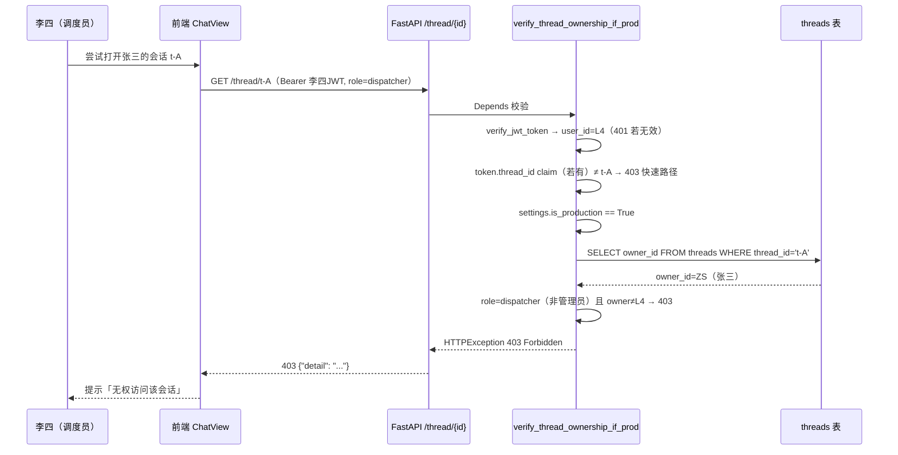
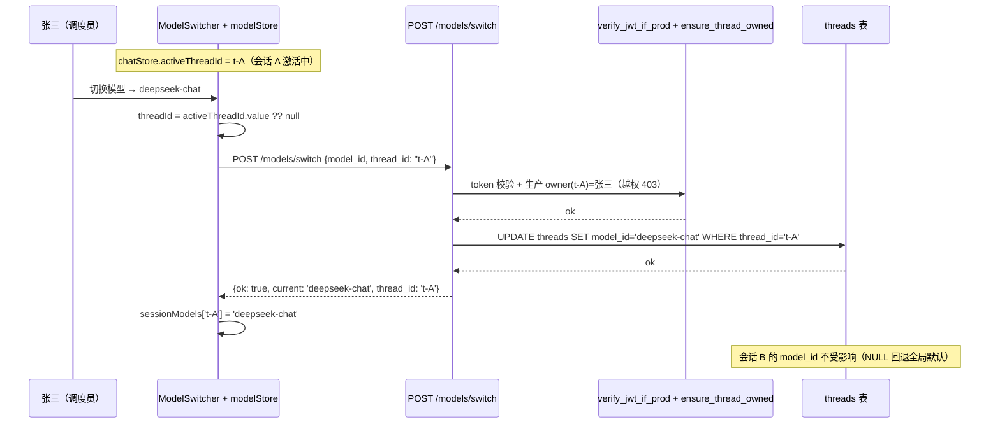
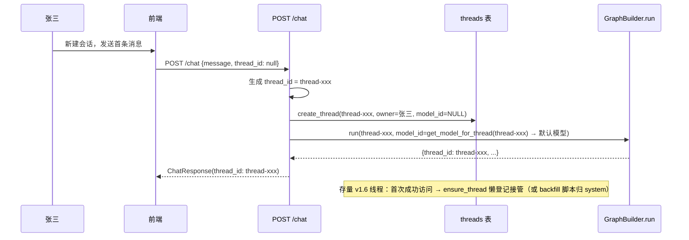

# GridMind（灵枢电网）v1.7.0 第一批迭代 · 系统架构设计 + 任务分解

**主题**：多用户地基（M-1 数据隔离 + M-2 per-session 模型隔离 + KB 角色写权限）+ 大屏接口预留（F-1）
**作者**：高见远（架构师 Bob）　**日期**：2026-08-10　**基线**：git `4752ab3`
**上游输入**：`docs/multiuser-prd-2026-08-10.md`（PM 许清楚，增量 PRD）
**技术栈**：Python FastAPI（后端）+ Vite + Vue3 + Pinia（前端，维持现状）
**落盘**：本文档 + `docs/sequence-diagram.mermaid` + `docs/class-diagram.mermaid`

---

## 〇、现状核实结论（设计前提，非凭空设计）

| 现状点 | 核实结果 | 对设计的影响 |
|---|---|---|
| `api/services/auth.py` | `verify_jwt_token` 校验签名/exp/iss + `sub`/`user_id` 必填；**当前无 role claim 解析**；`verify_thread_ownership` 仅做 token `thread_id` claim 快速路径（无 DB）；`verify_jwt_if_prod` 生产强制/dev 放行 | 角色解析需新增；owner 校验需升级为 DB 查询但**保留 claim 快速路径**；dev/prod 双轨沿用 |
| `api/main.py` 会话端点 | `/chat`、`/chat/stream/{id}`、`/thread/{id}`、`/diagnosis/{id}/reasoning`、`/interrupt/{id}/*`、`/sessions/{id}/pause\|resume\|rewind\|abort\|events`、`/audit/hitl/{id}` 均为 `verify_jwt_if_prod` 或 `verify_thread_ownership`（仅 events 严格要 token） | 需逐个接线新依赖；`/chat` 的 thread_id 在 **body** 中 → owner 校验须在 handler 内联 |
| `core/llm_client.py` | `_current_model` 进程级全局（RLock 保护）；`get_current_model()` 回退 `get_default_model()`；`chat_completion`/`achat_completion` 的 `model_id=None` 时取全局 | 模型消费点 = agent 节点内 `achat_completion`（无 model_id）→ 需经 `AgentState.model_id` 注入 |
| `api/schemas/__init__.py` | `ChatRequest.thread_id` 可选；`AgentState` 无 model_id 字段；`ModelSwitchRequest` 仅有 `model_id` | `ModelSwitchRequest` 加可选 `thread_id`；`AgentState` 加 `model_id` |
| `api/routers/knowledge_upload.py` | 上传/删除/列表均 `verify_jwt_if_prod`（读与写同权） | 写操作改 `require_role(KB_ADMIN, ADMIN)`；读保持全员 |
| `web/src/stores/display.ts` + `types/theme.ts` | `DisplayMode = 'standard'\|'presentation'`；`isDisplayMode` 守卫仅 2 值 | 加 `'bigscreen'` + `isBigScreen` getter；`applyAttrs` 已通用（data-display-mode） |
| `web/src/stores/modelStore.ts` | `current` 单值；`switchTo` 无 session 维度 | 改 `sessionModels` 映射 + `activeThreadId` + `getEffectiveModel` |
| `web/src/api/chat.ts` + `api/models.ts` | `fetchModels()`/`switchModel(modelId)` 无 thread 参数 | 加可选 `thread_id` 透传 |
| 数据库 | 主库 `data/gridmind.db`（`init_db` 幂等建表）；checkpoint 库 `data/checkpoints.db`（TTL 1800s 清理）；`mcp_tools/db/database.py` 已有 PRAGMA 幂等迁移模式 | threads 表建在主库；backfill 跨库读取 checkpoint 表 |

---

## 一、实现方案 + 框架选型

### 1.1 技术难点分析

1. **会话端点全覆盖**：9 类会话端点鉴权口径不一（events 严格要 token、其余 dev 放行），且 `/chat` 的 thread_id 在请求体而非路径 —— 需要「路径型依赖 + handler 内联」两套接线方式。
2. **存量数据不丢**：v1.6 checkpoint 无归属信息，多用户上线后必须可访问 —— 需 backfill + 懒登记双保险。
3. **模型选择点在 agent 节点深处**：`achat_completion` 内部回退 `get_current_model()`，无法感知 thread —— 需把会话模型显式注入 `AgentState` 并贯通 graph 入口。
4. **dev 不破坏**：新增校验必须严格对齐 `verify_jwt_if_prod` 语义（生产强制、dev 放行），本地开发零改动。
5. **无新增依赖约束**：全部能力用既有 FastAPI Depends + SQLite + JWT 实现，不引入用户表/权限框架。

### 1.2 框架与库选型

- **无新增第三方依赖**（约束达成）。复用：
  - FastAPI `Depends` 依赖注入体系 —— 实现 `require_role` / `verify_thread_ownership_if_prod` 等鉴权依赖；
  - SQLite（主库 `gridmind.db`）—— threads 归属表；
  - `PyJWT` —— role claim 解析（`jwt.decode` 已返回 payload dict，直接读 `payload["role"]`）；
  - Pinia —— 前端 sessionModels 会话级模型映射；
  - Vue Router —— `/bigscreen` 占位路由。
- 架构模式：后端保持**分层**（routers → services → core/db），新增两个 service（`thread_store` / `rbac`），不引入新的架构范式。

### 1.3 多用户数据隔离方案（M-1）

- **threads 表落库**（主库 `gridmind.db`，见 §3.1 DDL），`thread_id` 直接复用 LangGraph checkpoint 主键，不设代理主键。
- **owner 校验升级为 DB 查询，保留 token claim 快速路径**：
  1. `verify_jwt_token` 先验 token（401）—— 既有行为不动；
  2. token `thread_id` claim 与 URL 不匹配 → 403（**快速路径，先于 DB，防 probing**）；
  3. `settings.is_production` 才做 DB owner 查询（dev 直接放行，PRD US-1.3）；
  4. 管理员角色 / admin token → 放行（US-1.2）；
  5. threads 表无记录但 checkpoint 存在（存量）→ **懒登记**：首个成功访问的已认证用户接管为 owner（Q2 决策：backfill + 懒登记）；
  6. 严格模式（未知 thread 一律拒绝）作为 `settings.threads_strict_mode` 配置项预留，默认 `False`。
- **新会话**：`POST /chat` 无 thread_id → 服务端生成 thread_id 并 `create_thread(owner=当前用户)`；dev 下 owner 记 `"dev"`。
- **存量**：`scripts/backfill_threads.py` 幂等登记（owner=`system`，model_id=NULL）。

### 1.4 per-session 模型隔离方案（M-2）

- **存储位选择：`threads.model_id`（DB 列），不写入 checkpoint 状态**。理由：
  1. checkpoint 有 **TTL 清理**（默认 1800s），偏好存 checkpoint 会在 30 分钟后丢失，违背 US-2.2「刷新/重进会话后偏好仍在」；
  2. threads 表可 SQL 查询/索引，为后续会话列表、M-5 上下文管理复用；
  3. NULL 语义天然 = 全局默认，兼容 US-2.3。
- **统一读写接口**（跨文件命名规范见 §7.4）：
  - `thread_store.get_model_for_thread(thread_id) -> str`：`threads.model_id` 非 NULL 返回之，否则回退 `get_current_model()`（进程级全局；初始即默认模型）；
  - `thread_store.set_model_for_thread(thread_id, model_id)`：校验在 `AVAILABLE_MODELS` 内，UPSERT 写入；
  - 旧路径 `get_current_model()/set_current_model()` **原样保留**（US-2.3 全局语义）。
- **贯通链路**：API 层在 `/chat`、`/chat/stream/{id}`、`resume` 入口用 `get_model_for_thread(thread_id)` 解析生效模型 → 传给 `graph_builder.run(..., model_id=...)` → 写入 `AgentState.model_id` → agent 节点 `achat_completion(model_id=state.model_id)`（`None` 时回退全局，向后兼容）。

### 1.5 RBAC 方案（P1-1）

- **角色来源 = JWT `role` claim**（Q3 决策，不建用户表）：5 角色枚举 `dispatcher / operator / kb_admin / auditor / admin`。
- **解析规则**：`get_role(payload)` —— 无 `role` claim 或未知值 → 默认 `dispatcher`（最小权限、不 500）。
- **`require_role(*roles)` 依赖**：dev 直接放行；生产先 `verify_jwt_token`（401），角色命中即过；未命中再验 `X-Admin-Token`，通过则等效「管理员」（二选一通过，兼容既有 admin token 客户端）。
- **admin token 与管理员角色关系**：等效。`/grayscale/set`、`/admin/*`、`/debug/*` 等原 `verify_admin_token` 端点替换为 `require_role(OPERATOR, ADMIN)`，旧 admin token 仍可通过（等效逻辑内置于 require_role）。

### 1.6 KB 角色写权限方案（P1-3）

- 写（`POST /api/knowledge/upload`、`DELETE /api/knowledge/uploads/{id}`）→ `require_role(KB_ADMIN, ADMIN)`；
- 读（列表/检索）保持 `verify_jwt_if_prod`，全局共享（D3 决策）；
- dev 放行（Q5 决策，与 `verify_jwt_if_prod` 一致）。

### 1.7 F-1 大屏接口预留方案（P2-1）

纯前端扩展点，不做大屏 UI：
1. `DisplayMode` 联合类型加 `'bigscreen'`；
2. `display.ts` 的 `isDisplayMode` 守卫支持新值 + 新增 `isBigScreen` getter；
3. `App.vue` 暴露 `isBigScreen` 计算属性（仅暴露，不接任何布局逻辑）；
4. 注册 `/bigscreen` 占位路由 → `BigScreenPlaceholder.vue`（标题 + 返回入口）；
5. `tokens.shared.scss` 预留 `$bp-bigscreen` 断点变量 + `tokens.scss` 预留 `--bp-bigscreen` CSS 变量与 `data-display-mode="bigscreen"` 占位块（当前不产生可见样式变化）。

---

## 二、文件列表（新增 / 修改，含改动内容）

### 后端（Backend）

| # | 文件（相对路径） | 类型 | 改动内容 |
|---|---|---|---|
| B01 | `mcp_tools/db/database.py` | 修改 | `init_db()` 的 executescript 增加 `threads` 表 DDL + `idx_threads_owner_updated` 索引（幂等） |
| B02 | `api/services/thread_store.py` | **新增** | `ThreadStore` 服务（get_thread/get_owner/create_thread/ensure_thread/set_model/get_model/list_by_owner/count）+ 模块级统一接口 `get_model_for_thread` / `set_model_for_thread` / `ensure_thread_owned` |
| B03 | `api/services/rbac.py` | **新增** | `Role` 枚举 + `get_role(payload)` + `require_role(*roles)` 依赖 + `role_allows` |
| B04 | `api/services/auth.py` | 修改 | `verify_thread_ownership` 升级（DB owner + admin 放行 + 懒登记，保留 claim 快速路径）；新增 `verify_thread_ownership_if_prod`（dev 放行）、`verify_audit_thread_access`（审计/运维/管理员全放行，其余 owner 校验） |
| B05 | `api/schemas/__init__.py` | 修改 | `ModelSwitchRequest` 加 `thread_id: str | None = None`；`AgentState` 加 `model_id: str | None = None`；新增 `ThreadSummary`（thread_id/title/model_id/created_at/updated_at） |
| B06 | `api/main.py` | 修改 | 9 类会话端点接线新依赖；`/chat` 内联 owner 校验 + 新会话登记 + 传 `model_id`；`/models`、`/models/switch` 支持可选 `thread_id`；灰度读/写与 `/admin/*`、`/debug/*` 收口 `require_role`；`/audit/hitl` 列表按角色过滤 |
| B07 | `api/routers/knowledge_upload.py` | 修改 | 上传/删除依赖改为 `require_role(KB_ADMIN, ADMIN)`；读端点不变 |
| B08 | `api/services/hitl_audit_service.py` | 修改 | 新增 `query_by_decision_with_threads(decision, limit, thread_ids, risk_level)`（支持 `thread_id IN (...)` 过滤，`decision=None` 返回全部，供列表角色过滤） |
| B09 | `api/graph.py` | 修改 | `run(...)` 增加 `model_id: str | None = None` 参数并写入 `AgentState`；`resume(...)` 同样增加；supervisor 节点 `achat_completion` 传 `model_id=state.model_id` |
| B10 | `api/agents/agent_factory.py` | 修改 | `_synthesize_via_llm` 的 `achat_completion` 传 `model_id=state.model_id` |
| B11 | `api/config.py` | 修改 | 新增 `threads_strict_mode: bool`（默认 False，未知 thread 严格拒绝开关预留） |
| B12 | `scripts/backfill_threads.py` | **新增** | 幂等 backfill：读 `data/checkpoints.db` 的 checkpoints 表去重 thread_id → INSERT OR IGNORE 进主库 threads（owner=`system`，title=`存量会话`） |

### 前端（Frontend）

| # | 文件（相对路径） | 类型 | 改动内容 |
|---|---|---|---|
| F01 | `web/src/types/index.ts` | 修改 | `ModelsResponse` 加 `thread_id?: string | null`；`ModelSwitchResponse` 加 `thread_id?: string | null` |
| F02 | `web/src/api/models.ts` | 修改 | `fetchModels(threadId?)` 带 `?thread_id=`；`switchModel(modelId, threadId?)` 带 `{model_id, thread_id?}` |
| F03 | `web/src/stores/modelStore.ts` | 修改 | `current` 单值 → `sessionModels: Record<threadId, modelId>` + `globalCurrent` + `activeThreadId`；`getEffectiveModel` getter；`setActiveThread(threadId)`；`switchTo` 自动携带 activeThreadId；无激活会话时走全局（US-2.3） |
| F04 | `web/src/components/ModelSwitcher.vue` | 修改 | 展示与选中用 `getEffectiveModel` / `sessionModels[active]`，切换调 `switchTo` |
| F05 | `web/src/components/ChatView.vue` | 修改 | 会话激活/新建时调 `modelStore.setActiveThread(threadId)` |
| F06 | `web/src/types/theme.ts` | 修改 | `DisplayMode` 加 `'bigscreen'`；更新注释 |
| F07 | `web/src/stores/display.ts` | 修改 | `isDisplayMode` 守卫加 `'bigscreen'`；新增 `isBigScreen` getter |
| F08 | `web/src/App.vue` | 修改 | 暴露 `isBigScreen` 计算属性（扩展点，不接布局） |
| F09 | `web/src/router/index.ts` | 修改 | 注册 `/bigscreen` 路由（懒加载 BigScreenPlaceholder） |
| F10 | `web/src/views/BigScreenPlaceholder.vue` | **新增** | 占位页：标题「大屏模式（开发中）」+ 扩展点说明 + 返回工作台入口 |
| F11 | `web/src/styles/tokens.shared.scss` | 修改 | 新增 `$bp-bigscreen: 2560px;`（对齐 useViewport 语义 tier 注释） |
| F12 | `web/src/styles/tokens.scss` | 修改 | `:root` 预留 `--bp-bigscreen` CSS 变量 + `data-display-mode="bigscreen"` 占位块（无可见样式变化） |

### 测试（Tests）

| # | 文件（相对路径） | 类型 | 改动内容 |
|---|---|---|---|
| T01 | `tests/test_thread_store.py` | **新增** | threads 表建表/索引幂等、create/ensure/set/get/list、get_model_for_thread NULL 回退、set_model_for_thread 校验 |
| T02 | `tests/test_multiuser_ownership.py` | **新增** | 生产模式跨用户访问 9 类端点 → 403/404 越权攻击用例；管理员/admin token 放行；懒登记；dev 放行回归 |
| T03 | `tests/test_rbac_matrix.py` | **新增** | 权限矩阵逐项单测：5 角色解析、缺 role 默认调度员、灰度读/写收口、KB 写权限、审计列表角色过滤、admin token 等效 |
| T04 | `tests/test_session_models.py` | **新增** | 双会话模型隔离、无 thread_id 全局兼容、新会话回退默认、切换越权 403 |

---

## 三、数据结构和接口

### 3.1 threads 表 schema（SQL DDL）

```sql
-- P0-1：会话归属表（owner 校验 + M-2 模型偏好存储位）
CREATE TABLE IF NOT EXISTS threads (
    thread_id   TEXT PRIMARY KEY,                     -- 与 LangGraph checkpoint thread_id 一致
    owner_id    TEXT NOT NULL,                        -- 归属用户（JWT sub / user_id；管理员视角可跨用户）
    title       TEXT NOT NULL DEFAULT '新会话',        -- 会话标题（为 M-5 预留扩展位）
    model_id    TEXT,                                 -- M-2 per-session 模型偏好（NULL = 全局默认）
    created_at  TEXT NOT NULL DEFAULT (datetime('now')),  -- UTC ISO 串
    updated_at  TEXT NOT NULL DEFAULT (datetime('now'))
);

-- 按 owner 的会话列表查询（前端会话侧栏 / /audit/hitl 角色过滤）
CREATE INDEX IF NOT EXISTS idx_threads_owner_updated
    ON threads(owner_id, updated_at DESC);
```

### 3.2 新依赖注入函数签名（Python）

```python
# api/services/thread_store.py
class ThreadStore:
    def get_thread(self, thread_id: str) -> dict[str, Any] | None: ...
    def get_owner(self, thread_id: str) -> str | None: ...
    def create_thread(self, thread_id: str, owner_id: str,
                      title: str = "新会话", model_id: str | None = None) -> None: ...
    def ensure_thread(self, thread_id: str, owner_id: str,
                      title: str = "新会话") -> dict[str, Any]: ...   # 懒登记（INSERT OR IGNORE + 返回行）
    def set_model(self, thread_id: str, model_id: str) -> None: ...   # UPSERT
    def get_model(self, thread_id: str) -> str | None: ...
    def list_by_owner(self, owner_id: str) -> list[dict[str, Any]]: ...
    def count(self) -> int: ...

# 统一模型读写接口（跨文件命名规范 §7.4）
def get_model_for_thread(thread_id: str) -> str: ...      # threads.model_id ?? get_current_model()
def set_model_for_thread(thread_id: str, model_id: str) -> None: ...  # 校验 AVAILABLE_MODELS + UPSERT

# 越权判定 helper（供 /chat、/models/switch 等 body 内 thread_id 的 handler 内联调用）
def ensure_thread_owned(thread_id: str, user_id: str, role: str,
                        strict: bool | None = None) -> None:
    # 生产：管理员角色放行；无行 → 懒登记；owner 不符 → 403；严格模式未知 thread → 404
    ...

# api/services/rbac.py
class Role(str, Enum):
    DISPATCHER = "dispatcher"   # 调度员
    OPERATOR   = "operator"     # 运维
    KB_ADMIN   = "kb_admin"     # 知识管理员
    AUDITOR    = "auditor"      # 审计
    ADMIN      = "admin"        # 管理员

def get_role(payload: dict[str, Any] | None) -> Role: ...   # 缺省/未知 → DISPATCHER（fail-safe 最小权限）

async def require_role(*roles: Role) -> dict[str, Any]:
    # dev → 直接返回 {"user_id": "dev", "role": "dispatcher"}（放行）
    # prod → verify_jwt_token（401）→ get_role 命中即过；
    #        未命中 → 校验 X-Admin-Token，有效则等效 ADMIN（放行）；否则 403

# api/services/auth.py（升级 + 新增）
async def verify_thread_ownership(thread_id: str, credentials=...) -> dict[str, Any]:
    # 1. verify_jwt_token（401） 2. token thread_id claim 不匹配 → 403（快速路径）
    # 3. 非生产 → 返回（dev 仅保留 claim 校验，SSE 既有行为不变）
    # 4. 生产：get_role(payload)==ADMIN → 放行
    # 5. DB：无行 → 懒登记；owner 不符 → 403；通过 → 返回

async def verify_thread_ownership_if_prod(thread_id: str, credentials=...) -> dict[str, Any] | None:
    # dev → None（放行）；prod → 委托 verify_thread_ownership 全量校验

async def verify_audit_thread_access(thread_id: str, credentials=...) -> dict[str, Any]:
    # dev → 放行；prod：admin/auditor/operator（或 admin token）→ 全放行；
    #        dispatcher/kb_admin → owner 校验（Q1：本人放行）
```

### 3.3 `/models/switch`、`/models` 请求/响应模型变更

```python
# api/schemas/__init__.py
class ModelSwitchRequest(BaseModel):
    model_id: str
    thread_id: str | None = None   # 新增可选；缺省 = 全局（US-2.3 向后兼容）

# POST /models/switch
#   请求  : {"model_id": "deepseek-chat"}                     （旧，全局）
#   请求  : {"model_id": "deepseek-chat", "thread_id": "t-A"} （新，会话级）
#   响应  : {"ok": true, "current": "deepseek-chat"}                    （无 thread_id，与 v1.6 一致）
#   响应  : {"ok": true, "current": "deepseek-chat", "thread_id": "t-A"}（新增字段，向后兼容）
#   生产校验：thread_id 存在 → ensure_thread_owned（403/404/懒登记）；无 thread_id → 仅 verify_jwt_if_prod

# GET /models
#   请求  : /models                          → {"available", "current": 全局, "default"}
#   请求  : /models?thread_id=t-A            → {"available", "current": get_model_for_thread("t-A"),
#                                                "default", "thread_id": "t-A"}（新增可选字段）
```

`AgentState` 新增字段（M-2 贯通用）：

```python
class AgentState(BaseModel):
    ...
    model_id: str | None = None   # API 层解析后的会话生效模型；None → agent 回退 get_current_model()
```

### 3.4 RBAC 角色枚举 + 端点权限映射表

| 端点类别（代表端点） | 调度员 dispatcher | 运维 operator | 知识管理员 kb_admin | 审计 auditor | 管理员 admin | 生产依赖 |
|---|---|---|---|---|---|---|
| 会话管理（`/chat`、`/chat/stream/{id}`、`/thread/{id}`、`/diagnosis/{id}/reasoning`、`/interrupt/{id}/*`、`/sessions/{id}/pause\|resume\|rewind\|abort\|events`） | 仅本人 | 仅本人 | 仅本人 | 仅本人 | 全部 | `verify_thread_ownership_if_prod` / `verify_thread_ownership`（events） |
| 灰度管理写（`/grayscale/set`、`/grayscale/manual_rollback`） | ✗ | ✓ | ✗ | ✗ | ✓ | `require_role(OPERATOR, ADMIN)`（admin token 等效） |
| 灰度管理读（`/grayscale/status\|history\|metrics`） | ✗ | ✓ | ✗ | ✗ | ✓ | `require_role(OPERATOR, ADMIN)`（收口匿名读） |
| KB 读（知识检索、`GET /api/knowledge/uploads`） | ✓ | ✓ | ✓ | ✓ | ✓ | `verify_jwt_if_prod`（不变） |
| KB 写（`POST /api/knowledge/upload`、`DELETE /api/knowledge/uploads/{id}`） | ✗ | ✗ | ✓ | ✗ | ✓ | `require_role(KB_ADMIN, ADMIN)` |
| 审计读列表（`GET /audit/hitl`） | 仅本人 thread | 全部 | 仅本人 thread | 全部 | 全部 | `verify_jwt_if_prod` + handler 角色过滤 |
| 审计读单条（`GET /audit/hitl/{id}`） | 仅本人 thread | 全部 | 仅本人 thread | 全部 | 全部 | `verify_audit_thread_access` |
| 系统配置（`/admin/checkpoint-stats`、`/debug/sync_lag\|sync_force`） | ✗ | ✓ | ✗ | ✗ | ✓ | `require_role(OPERATOR, ADMIN)` |
| 模型切换（`POST /models/switch`、`GET /models`） | ✓（session 级） | ✓ | ✓ | ✓ | ✓ | `verify_jwt_if_prod` + 有 thread_id 时内联 owner 校验 |

**矩阵说明**：
1. dev 模式整张矩阵不生效（各依赖 dev 分支直接放行），本地开发零改动。
2. admin token（`X-Admin-Token`）与「管理员」角色等效，二选一通过 —— 兼容既有灰度/管理客户端。
3. 审计读单条对审计/运维/管理员全放行，调度员/知识管理员仅本人（Q1 决策：本人放行）。

---

## 四、程序调用流程（时序图）

### 4.1 多用户访问他人会话被拒（生产）



### 4.2 per-session 模型切换



### 4.3 新会话创建 + 存量懒登记



---

## 五、任务列表（有序、含依赖、按实现顺序）

> 分组原则：按「数据层 → 安全层 → 模型层 → 前端模型绑定 → 大屏预留+回归」五个功能模块横向分组，每任务 ≥3 文件。

### Task 1：数据层地基 —— threads 表 + ThreadStore + 迁移脚本

- **涉及文件**：`mcp_tools/db/database.py`、`api/services/thread_store.py`（新）、`api/config.py`、`scripts/backfill_threads.py`（新）、`tests/test_thread_store.py`（新）
- **依赖**：无
- **优先级**：P0
- **验收标准**：
  1. `init_db()` 重复执行幂等，threads 表 + 索引创建成功；
  2. `ThreadStore` 全方法单测通过：create/ensure（懒登记）/get_owner/set_model/get_model/list_by_owner/count；
  3. `get_model_for_thread(NULL 行)` 回退 `get_current_model()`；`set_model_for_thread` 对未知模型抛 ValueError；
  4. `scripts/backfill_threads.py` 可重复执行（INSERT OR IGNORE），存量 checkpoint thread_id 全部登记（owner=system）；
  5. `settings.threads_strict_mode` 默认 False 且可配置；
  6. `pytest tests/test_thread_store.py` 全绿。

### Task 2：安全层 —— RBAC + owner 校验升级 + 端点接线

- **涉及文件**：`api/services/rbac.py`（新）、`api/services/auth.py`、`api/main.py`、`api/routers/knowledge_upload.py`、`api/services/hitl_audit_service.py`、`tests/test_multiuser_ownership.py`（新）、`tests/test_rbac_matrix.py`（新）
- **依赖**：Task 1（thread_store）
- **优先级**：P0 / P1
- **验收标准**：
  1. 生产模式下李四 token 访问张三的 9 类会话端点（`/chat/stream/{id}`、`/thread/{id}`、`/diagnosis/{id}/reasoning`、`/interrupt/{id}/approve|reject|decision`、`/sessions/{id}/pause|resume|rewind|abort|events`、`/audit/hitl/{id}`、`/chat`（body thread_id））全部 403/404；张三访问自己全部正常；
  2. 管理员角色 / admin token 通过全部 owner 校验；dev 模式全部放行（既有 dev 测试零改动）；
  3. `require_role` 5 角色解析、缺 role 默认调度员、未知 role 默认调度员（不 500）单测通过；
  4. 灰度读/写端点匿名访问不再 200（运维/管理员 + admin token 可通过）；`/admin/*`、`/debug/*` 同理；
  5. KB 写操作非知识管理员/管理员 → 403；KB 读全员可读；dev 上传/删除照常；
  6. `GET /audit/hitl` 列表按角色返回可见范围（调度员/知识管理员仅本人 thread，审计/运维/管理员全部）；
  7. `pytest tests/test_multiuser_ownership.py tests/test_rbac_matrix.py` + 全量 pytest 通过。

### Task 3：模型层 —— per-session 模型隔离（后端）

- **涉及文件**：`api/schemas/__init__.py`、`api/graph.py`、`api/agents/agent_factory.py`、`api/main.py`（/models、/models/switch、/chat、/chat/stream、resume 传 model_id）、`tests/test_session_models.py`（新）
- **依赖**：Task 1（threads.model_id + 读写接口）、Task 2（owner 校验函数）
- **优先级**：P0
- **验收标准**：
  1. 双会话并发：`get_model_for_thread(A)=deepseek-chat`、`get_model_for_thread(B)=qwen-plus`（或默认），互不影响；
  2. `POST /models/switch {model_id}`（无 thread_id）行为与 v1.6 完全一致（进程级全局）；`GET /models` 不传 thread_id 返回全局 current；
  3. 新会话（threads 无 model_id）走 `get_default_model()`；切换后刷新/重进会话偏好仍在（threads 持久）；
  4. 生产模式切换他人会话模型 → 403；
  5. agent 推理实际使用会话模型（`AgentState.model_id` 贯通 supervisor 与合成节点）；
  6. `pytest tests/test_session_models.py` + 全量 pytest 通过。

### Task 4：前端模型绑定 —— modelStore 会话级映射

- **涉及文件**：`web/src/types/index.ts`、`web/src/api/models.ts`、`web/src/stores/modelStore.ts`、`web/src/components/ModelSwitcher.vue`、`web/src/components/ChatView.vue`
- **依赖**：Task 3（后端 /models 接口就绪）
- **优先级**：P0
- **验收标准**：
  1. `sessionModels: Record<threadId, modelId>` + `globalCurrent` + `activeThreadId` 就绪；`getEffectiveModel() = sessionModels[active] ?? globalCurrent ?? defaultModel`；
  2. `switchTo(modelId)` 自动携带 `activeThreadId`（无激活会话时走全局，US-2.3）；
  3. `setActiveThread(threadId)` 切换会话时拉取/回退该会话模型；ModelSwitcher 展示当前会话生效模型；
  4. `vue-tsc` 通过，既有单会话流程零回归。

### Task 5：大屏接口预留 + 全量回归

- **涉及文件**：`web/src/types/theme.ts`、`web/src/stores/display.ts`、`web/src/App.vue`、`web/src/router/index.ts`、`web/src/views/BigScreenPlaceholder.vue`（新）、`web/src/styles/tokens.shared.scss`、`web/src/styles/tokens.scss`
- **依赖**：Task 1（可并行；实现顺序放最后以便统一回归）
- **优先级**：P2（不阻断）+ 收尾回归
- **验收标准**：
  1. `DisplayMode` 含 `'bigscreen'`；`isDisplayMode` 守卫支持；`isBigScreen` getter 就绪；standard/presentation 行为零回归；
  2. 访问 `/bigscreen` 返回占位页（标题 + 返回入口），不 404/白屏；既有路由不受影响；
  3. `tokens.shared.scss` 有 `$bp-bigscreen`；`tokens.scss` 有 `--bp-bigscreen` 与 `data-display-mode="bigscreen"` 占位块，当前无可见样式变化；
  4. 全量 `pytest` + `vue-tsc` 通过；生产模式端到端冒烟（多用户并发 → 各自模型 → KB 角色写权限 → 审计读过滤 → 灰度权限）一次通过。

---

## 六、依赖包列表

**无新增第三方依赖**。

- 后端：全部能力复用既有 `fastapi`、`pydantic`、`PyJWT`、`sqlite3`（标准库）、`loguru`；
- 前端：复用既有 `pinia`、`vue-router`、`vue`、`axios`；
- 理由：RBAC 用 FastAPI 依赖注入 + JWT claim 实现（Q3 决策，不建用户表）；归属表用既有 SQLite 主库；模型隔离用既有 threads 表列。新增用户表/权限框架均属后续批次（M-4/M-5）范畴。

---

## 七、共享知识（跨文件约定）

1. **JWT claim 约定**
   - `role` claim 字段名固定为 `role`，取值空间：`dispatcher | operator | kb_admin | auditor | admin`；
   - **缺失或未知值一律解析为 `dispatcher`**（最小权限，绝不 500）；
   - `sub`/`user_id` 为 owner 判定依据（`verify_jwt_token` 已保证非空）；`thread_id` claim 为快速路径绑定（不匹配 → 403，防 probing，不泄漏具体值）。
2. **错误语义**
   - **401**：token 缺失/无效/过期/缺必需 claim（统一 `WWW-Authenticate: Bearer`）；
   - **403**：越权 —— 跨用户访问**已存在**的 thread、角色权限不足、token thread_id claim 不匹配；
   - **404**：资源不存在 —— thread 既无 checkpoint 也无 threads 行（严格模式）、审计/KB 文档不存在；
   - **懒登记优先于 404**：生产默认未知 thread 由首个已认证访问者接管（Q2），严格模式开启后才 404；
   - 响应体 detail 一律不泄漏内部值（沿用 V1.5.1 R-X3 口径）。
3. **dev / prod 行为差异统一口径**
   - `settings.is_production`（APP_ENV=production 或 PRODUCTION=1）为唯一开关；
   - 新增鉴权依赖（`verify_thread_ownership_if_prod`、`require_role`）与 `verify_jwt_if_prod` 同语义：**生产强制、dev 放行**；
   - 例外：`/sessions/{id}/events` 的 `verify_thread_ownership` 保持「始终要求 token」的既有行为（现有测试依赖），dev 仅不加 DB owner 校验；
   - dev 下新会话 owner 记 `"dev"`，懒登记照常（保证 dev 模型偏好可持久）。
4. **后端 model 读写接口命名规范**
   - 全局（旧路径，保留）：`get_current_model()` / `set_current_model(model_id)` / `get_default_model()`；
   - 会话级（统一接口，唯一入口）：`thread_store.get_model_for_thread(thread_id) -> str`（`threads.model_id ?? get_current_model()`）与 `thread_store.set_model_for_thread(thread_id, model_id)`；
   - 解析辅助：`resolve_model(thread_id: str | None) -> str = thread_id ? get_model_for_thread(thread_id) : get_current_model()`；
   - agent 节点一律读 `state.model_id`（None 时 `achat_completion` 内部回退全局），禁止再调 `get_current_model()` 覆盖会话模型。
5. **后端目录分层**：routers（端点）→ services（鉴权/业务：auth、rbac、thread_store、hitl_audit_service）→ core（LLM/图：llm_client、graph、agent_factory）→ db（mcp_tools/db）。`rbac` 与 `auth` 相互引用必须**函数内 lazy import**（避免模块级循环依赖）。
6. **前端模型绑定约定**：`modelStore` 是会话模型唯一状态源；`sessionModels` 键 = LangGraph `thread_id`；激活会话由 `chatStore.activeThreadId` 提供，`ChatView` 负责调 `setActiveThread` 同步。
7. **测试约定**：生产模式用例用 `monkeypatch.setenv("APP_ENV", "production")` + 合法 JWT（复用 `issue_test_token(extra_claims={"role": ...})`）；越权用例覆盖 PRD 列出的每个端点；全量回归必须 `pytest` + `vue-tsc` 双绿。

---

## 八、待明确事项

1. **灰度读端点收口（`/grayscale/status|history|metrics` 匿名 → RBAC 运维/管理员）是否本批做？**
   - **建议：本批做**。理由：① PRD P1-2 已将其列入需求池（「收口匿名读，衔接 R-1c」），验收标准明确「匿名访问灰度读/写端点不再 200/成功」；② 实现成本低 —— 3 个读端点加 `require_role(OPERATOR, ADMIN)`，dev 放行、admin token 等效，不影响本地开发；③ 留到后续批次会形成「匿名信息泄漏窗口」。已并入 Task 2。
2. **前端角色感知 UI（导航显隐/角色徽标/KB 写按钮显隐）**：PRD §6.1 为设计稿，但 P0/P1/P2 验收标准均不涉及前端 UI 角色过滤 —— **本批不做**，仅做后端强校验（前端即使显示也拿不到权限）。建议 v1.7 第二批随 M-5/M-6 一起落地。
3. **`GET /sessions`（本人会话列表）端点**：PRD UI 提及「会话侧栏只列本人会话」，但需求池无对应项；`thread_store.list_by_owner` 已就绪，本批**不新增列表端点**（避免前端侧栏改造范围膨胀），留给 M-5。
4. **`GET /audit/hitl` 在 `decision=None` 时的行为**：现状返回空列表；本批角色过滤路径将改为「返回全部（按角色过滤）」以支撑审计页，属轻微行为修正，已并入 Task 2 并配测试（若主理人要求严格保持旧行为可回退为仅 decision 过滤）。
5. **`/debug/sync_lag` 收口**：现状匿名可读；本批按矩阵并入 `require_role(OPERATOR, ADMIN)`（Task 2）。若监控脚本依赖匿名读取，需在部署侧改配 token —— 请主理人确认监控脚本是否受影响。

---

**架构设计完毕，待主理人审阅。**
