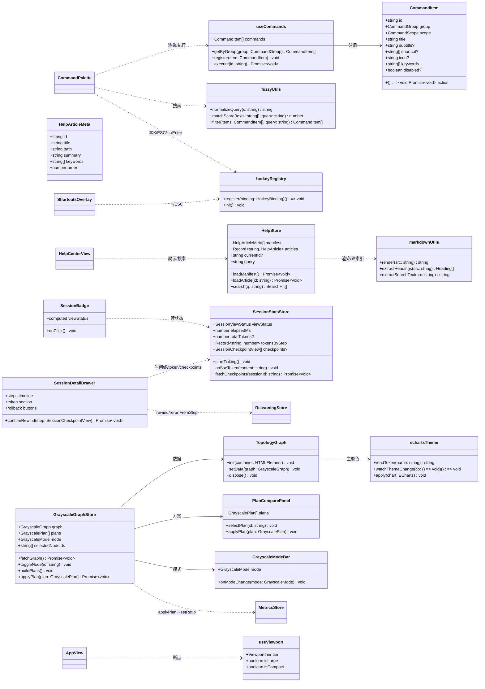
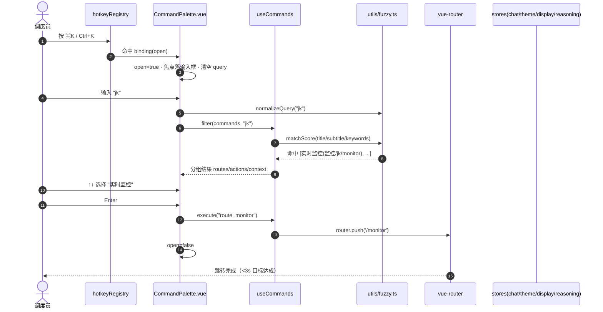
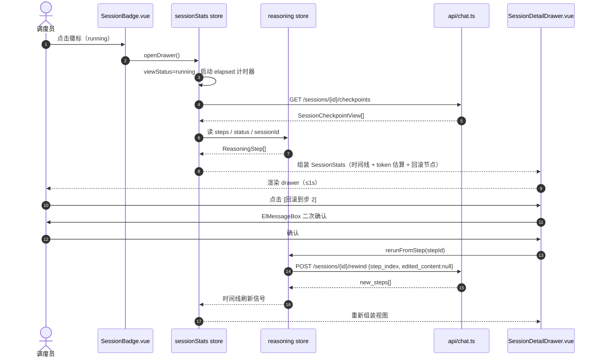
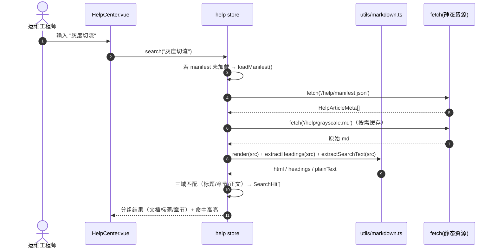

# GridMind v1.6.0 P1 迭代架构设计

**文档版本**: v1.0
**日期**: 2026-08-05
**作者**: 高见远 · 架构师
**审阅**: 待主理人齐活林
**上游文档**: `docs/p1-iteration-prd-2026-08-05.md`（P1 六项增量 PRD）· `docs/ui-competitive-analysis-2026-08-04.md`（§7.2 P1 原始定义）
**范围声明**: 本架构覆盖 v1.6.0 P1 全部 6 项（P1-1 命令面板 / P1-2 帮助中心 / P1-3 Session 可观测 / P1-4 KG 灰度 / P1-5 响应式 / P1-6 Auto-grid）。P0 四项（v1.5.x）已落地，不在本文档范围，不重复设计。

---

## 0. 现状基线（架构视角复核）

| 项 | 现状 | 架构影响 |
|---|---|---|
| 技术栈 | Vue 3 + Vite + TS + Element Plus + Pinia + SCSS tokens（7 模块） | 保持，不引入框架级替代 |
| 路由 | `web/src/router/index.ts`：`/` `/monitor` `/grayscale` `/audit` `/system` `/onboarding` | 新增 `/help`，onboarding 不进命令面板 |
| 命令面板 | `CommandPalette.vue` 2.3KB 占位：已有 `CommandItem`/`CommandPaletteProps` 类型 + ⌘K/Ctrl+K 注册 + ESC 关闭 + 输入框；**无命令注册中心、无 fuzzy、无结果列表** | 骨架复用；但现有 `document.addEventListener('keydown')` 需迁移到统一快捷键注册中心 |
| 帮助中心 | ❌ 缺失；`docs/` 有 20+ 篇 md（architecture/、feature-intro、ui-*、langgraph-*、kg-* 等） | 内容源现成；精选 6-8 篇构建时复制为静态资源 |
| Session 可观测 | ❌ 徽标/drawer 缺失；后端 API 已就绪（`/sessions/{id}/pause\|resume\|rewind\|abort`、`/checkpoints`、`/state`、SSE events）；`stores/reasoning.ts` 已有 sessionId + steps + 8 态状态机 + actions；`api/chat.ts` 有 `getSessionCheckpoints` 但**缺 `getSessionState`** | 前端壳为主；token 字段后端 schema 未确认 → 降级策略 |
| KG 灰度 | `GrayscalePanel.vue` 已有 4 统计卡 + 手动切流 + 回滚 + 监控窗口 + 历史 + Prometheus 摘要；`stores/metrics.ts` 提供 status/history/setRatio/rollback；**echarts 不在 deps** | 新增 echarts；拓扑/方案/双模式为增量区块，不动既有切流逻辑 |
| 响应式 | `App.vue` 零散 media queries（1440/1100/1024/768），仅处理 Header 单项 | 需系统化 3 断点 + 紧凑模式；Header 改造必须保留 P0/P1-3 已挂载组件 |
| Auto-grid | `MonitoringView.vue` 固定 `repeat(4,1fr)→repeat(2,1fr)→1fr` | 替换为 `auto-fit + minmax` |

---

## 1. 实现方案 + 框架选型（P1 六项逐项）

### P1-1 ⌘K 全局命令面板（增强）

**技术决策**：

| 决策点 | 方案 | 理由 |
|---|---|---|
| fuzzy search | **自研**（`utils/fuzzy.ts`，约 80 LOC），**不引 fuse.js** | 语料极小（5 路由 + 10 操作 + 少量上下文命令），自研可精确控制"中文/拼音首字母/英文"三种命中语义；fuse.js 对中文分词与拼音首字母支持并不比自研好 |
| 拼音首字母匹配 | 命令注册时**显式携带 keywords**（如"实时监控"→ `['监控','jk','monitor']`），匹配器对 title/subtitle/keywords 做归一化 + 子串/子序列打分 | 语料可控、确定性高、零依赖；避免引入 pinyin-pro 字典 |
| 快捷键注册 | **统一快捷键注册中心** `utils/hotkeys.ts`（单 document keydown 监听器 + 注册表 + 优先级），⌘K / `?` / ESC / ⌘1-5 / ↑↓ / Enter 统一管理 | 现有 CommandPalette 直接 `document.addEventListener` 会导致 ⌘K 与 `?` 浮层、drawer 的 ESC 争抢；注册中心按优先级仲裁 ESC（面板 > 浮层 > drawer） |
| 命令注册模式 | `composables/useCommands.ts` 返回 `CommandItem[]`（路由组/操作组/上下文组），各业务模块用 `register()` 注入；**禁止在组件内写死命令** | 命令面板是"插件式"入口，后续 P2 大屏/语音等新命令只需注册 |
| 结果渲染 | 面板内按 group 渲染分组列表 + 右侧快捷键 hint + 空态引导 | 沿用现有 el-dialog 560px 壳，仅内部增强 |

**10 个常用操作与 store 对接**（默认方案，见 §8 待明确 #1）：

| # | 命令 | 对接目标 |
|---|---|---|
| 1 | 新建对话 | `chatStore.resetChat()` |
| 2 | 清空当前对话 | `chatStore.resetChat()` + `ElMessage` |
| 3 | 切换主题（深/浅） | `themeStore.toggle()` |
| 4 | 背景模式切换（标准/演示） | `displayStore.setDisplayMode()` |
| 5 | 色盲模式切换（4 palette 循环） | `displayStore.setColorBlindPalette()` |
| 6 | 暂停当前推理（仅 running） | `reasoningStore.pause()`，disabled 条件 `!isRunning` |
| 7 | 恢复当前推理（仅 paused） | `reasoningStore.resume()`，disabled 条件 `!isPaused` |
| 8 | 查看 Session 详情 | 打开 P1-3 `SessionDetailDrawer`（通过事件总线/store 信号） |
| 9 | 打开 HITL 审计队列 | `router.push('/audit?filter=pending&from=command-palette')` |
| 10 | 回滚到上一步（二次确认） | `ElMessageBox.confirm` → `reasoningStore.rerunFromStep(lastCheckpoint)` |

### P1-2 帮助中心 + 快捷键速查

**技术决策**：

| 决策点 | 方案 | 理由 |
|---|---|---|
| 文档源 | **内置精选集**：`web/scripts/sync-help-docs.mjs` 在构建时从 `docs/` 精选 6-8 篇复制到 `web/public/help/*.md`（随前端打包）；清单由 `web/public/help/manifest.json` 白名单驱动 | PRD §5 默认方案；前端产物部署到独立 Web 服务器后无法访问磁盘 docs/；且 docs/ 含研发内部文档不宜全部暴露 |
| Markdown 渲染 | **自研 subset 渲染器** `utils/markdown.ts`（约 200 LOC），支持：标题 h1-h6 / 段落 / **加粗** / `行内代码` / 围栏代码块 / 表格 / 无序-有序列表 / 引用 / 分隔线 / 链接 / **mermaid 围栏块 → 占位容器** | 精选文档受信且格式受控，subset 足够覆盖验收标准（标题/代码块/表格/流程图占位）；`marked` 引入需连带 XSS 清理成本，本期不引入；内容扩张时再评估 |
| 全文搜索 | 自研 `stores/help.ts`：加载 manifest → 按需 fetch md → `extractHeadings()` 建目录 + `extractSearchText()` 建纯文本索引；查询在标题/章节/关键字三域匹配，命中高亮 | 语料 ≤8 篇 × 几十 KB，内存索引 < 1MB，≤100ms 无压力；与 P1-1 fuzzy 复用归一化思路 |
| 快捷键速查 | `?` 键任意页面唤起 `ShortcutsOverlay.vue`（快捷键总表浮层），ESC 关闭 | 经 hotkey 注册中心注册，避免与 ⌘K 冲突 |
| 入口 | Header 增加帮助图标 → `/help`；`/help` 路由懒加载 | 与既有 Header 组件体系一致 |

**精选文档建议清单**（PM + 架构师联合敲定，最终以 manifest.json 为准）：

| id | 标题 | 来源建议 |
|---|---|---|
| architecture | 架构总览 | 精选自 `docs/architecture/` + `frontend-v151-architecture` 提炼 |
| grayscale | 灰度切流指南 | 精选自 `docs/kg-m3c-observability.md` + `kg-m3a-design.md` 提炼 |
| hitl | HITL 使用指南 | 精选自 `docs/ui-v151-p0-3-prd` + `frontend-v151` 提炼 |
| shortcuts | 快捷键总表 | 新建（与 ShortcutsOverlay 内容同源） |
| monitoring | 监控面板说明 | 精选自竞品分析 §3 监控相关 + 产品文案提炼 |
| faq | 常见问题 FAQ | 新建（面向 3 类用户角色） |

### P1-3 Session 状态徽标 + 可观测面板

**技术决策**：

| 决策点 | 方案 | 理由 |
|---|---|---|
| 数据源 | **复用 `reasoningStore`**（sessionId / status / steps / pause/resume/rewind actions）为唯一事实来源；新增薄壳 `stores/sessionStats.ts` 做视图派生 | reasoning store 已是 8 态状态机且 v1.5.1 发布稳定，不在其上做大改，避免回归 |
| 徽标 4 态映射 | `sessionStats.viewStatus`：`idle / running / paused / error`（由 reasoning 8 态聚合：idle+completed+aborted→idle；running+resuming→running；paused+editing→paused；error→error） | 徽标只需 4 态，内部状态机保持 8 态不动 |
| 色盲友好 | 复用 `StatusIcon.vue`（status=normal/warning/critical/info + shape/glyph 四重区分），running 时脉冲动效、error 时抖动 | 与 P0-2 体系一致，零新图标 |
| token 消耗 | **默认降级可运行**：优先消费 SSE `token` 事件（`content` 字符数聚合为估算值 + 若事件带数字 token 字段则优先）；后端 schema 确认无 token 字段时降级为"步骤数 + 耗时"，token 区标注"待接入" | PRD §5 待确认 #3 的默认方案；前端不阻塞 |
| 回滚节点 | `GET /sessions/{id}/checkpoints`（`api/chat.ts` 已有）→ `SessionDetailDrawer` 渲染"回滚到此步"按钮 → `ElMessageBox` 二次确认 → `reasoningStore.rerunFromStep(stepId)` 或直接 `rewindSession` | 复用 F2 链路 |
| 步骤时间线 | 由 `reasoningStore.steps`（`startedAt/finishedAt/durationMs/status/name/nodeName`）直接渲染 | 已有字段足够，无需新数据 |

**`api/chat.ts` 增量**：新增 `getSessionState(sessionId)` → `GET /sessions/{id}/state`（重建 steps 用，PRD 已声明端点存在；当前 api 客户端未封装）。

### P1-4 KG 灰度可视化（接 GrayscalePanel.vue）

**技术决策**：

| 决策点 | 方案 | 理由 |
|---|---|---|
| 图表库 | **新增 `echarts@^5.5`**（必须项），按需引入 `GraphChart`/`force` 相关模块 | 力导向图（节点拖拽/缩放/编码）自研成本远高于引入；gzip 后约 ~350KB，可接受；**不封装 vue-echarts**（少一层依赖，直接用 `init` + `onUnmounted.dispose`，代码量相当） |
| 主题对齐 | 新增 `utils/echartsTheme.ts`：初始化/切换时 `getComputedStyle` 读取 tokens（`--brand-primary` / `--status-*` / `--bg-card`），`MutationObserver` 监听 `:root[data-theme]` / `:root[data-cb-palette]` 变化并 `chart.setOption` 或重建 | canvas 图表无 CSS 继承，必须显式注入颜色；色盲模式需实时生效 |
| 数据源 | 默认**前端模拟**：`stores/grayscaleGraph.ts` 基于 `metricsStore.status/checkpoints` + 固定拓扑模板生成节点（≤200 个）；若后端提供 `GET /grayscale/graph` 则优先（接口探测 404 → 回落模拟） | PRD §5 待确认 #4 默认方案；前后端可并行 |
| 节点编码 | 节点大小 = 负载率（load），颜色 = 错误率（errorRate → status 色阶），类型分 backend/candidate/alarm/metric | 对标 OPEN-3000 拓扑着色 + Grafana 颜色规范化 |
| 方案对比 | `PlanComparePanel.vue`：≥3 方案卡片，每卡 3 维打分条（操作开关数量/负载率/保护适配性）+ 总分 + "应用"按钮 | 对标雄安多方案打分；评分由 grayscaleGraph store 生成（规则 + 模拟数据） |
| 双模式 | `GrayscaleModeBar.vue`：探索模式（AI 推荐方案，只读）/ 规划模式（勾选节点 → 生成方案，可编辑） | 对标 Coze 双模式 |
| 联动切流 | 方案"应用"→ `metricsStore.setRatio(plan.targetRatio, 'panel', adminToken)`（复用现有切流接口） | 与 P0 手动切流零冲突 |

### P1-5 响应式 + 小屏适配（最低 1024×768）

**技术决策**：

| 决策点 | 方案 | 理由 |
|---|---|---|
| 断点体系 | 系统化 3 档：**large ≥1920**（内容区 max-width 1280→1600）/ **standard 1280-1920**（维持现状）/ **compact 1024-1280**（汉堡导航 + 精简 Header + 2 列统计卡 + 监控单列） | PRD §4.5；tokens.shared.scss 新增 `$bp-2xl: 1920px`，保留既有 `$bp-*` |
| 断点读取 | 新增 `composables/useViewport.ts`（matchMedia 三查询，暴露 `tier / isLarge / isCompact`） | 组件内逻辑分支（如 compact 强制背景降级）用 composable；纯 CSS 布局用 media query，两者并存 |
| 导航折叠 | 新增 `NavDrawer.vue`：compact 断点下左侧导航替换为汉堡按钮 + `el-drawer`（5 路由） | 复用 Element Plus drawer，无新依赖 |
| 紧凑附加行为 | 背景动效自动降级（compact 时 `displayStore` 强制 standard 背景强度）、FAB 图标化、Header 右侧状态条精简（仅保留 CLK + 关键徽标） | 与 P0-1 背景开关联动，不破坏 tokens |
| Header 改造约束 | **增量式**：T02/T03 只追加挂载（帮助图标、SessionBadge），T04 统一做断点化重构时必须保留既有挂载（见 §7 共享知识） | 避免多任务并行冲突 |

### P1-6 MonitoringView Auto-grid 自适应

**技术决策**：

| 决策点 | 方案 | 理由 |
|---|---|---|
| 布局 | `grid-template-columns: repeat(auto-fit, minmax(320px, 1fr))` 替换固定列模板；compact 断点（`<1280`）minmax 下限收窄至 280px | 纯 CSS，无 gridstack.js 等库；对标 Grafana 12 Auto-grid |
| 条件渲染 | 无数据面板 `v-if` 自动隐藏（`store.devices.length === 0` 等） | 减少视觉噪音 |
| 图表防抖 | `TelemetryChart.vue` 增加 `ResizeObserver` + 300ms 防抖重绘 | 验收标准 ④：布局变化不触发图表重绘卡顿 |
| 范围 | `MonitoringView.vue` 的 stats-row + 面板区；GrayscalePanel 的 stats-row 同步 auto-fit（顺手统一） | 与 P1-5 联动：紧凑断点单列 |

---

## 2. 文件列表及相对路径（含 LOC 预估）

> 相对路径均以仓库根 `F:/GridMind · 灵枢电网/` 计；LOC 为工程师排期参考（±20%）。

### 2.1 新增文件

| 文件 | 说明 | LOC 预估 |
|---|---|---|
| `web/scripts/sync-help-docs.mjs` | 构建时文档复制脚本（读 manifest → 复制到 public/help） | 80 |
| `web/public/help/manifest.json` | 帮助文档白名单清单（id/title/path/summary/keywords/order） | 40 |
| `web/public/help/*.md`（6-8 篇） | 精选文档内容（内容型，PM+架构师联合精选） | 60-120/篇 |
| `web/src/utils/fuzzy.ts` | 模糊搜索（归一化 + 打分 + 过滤） | 80 |
| `web/src/utils/hotkeys.ts` | 全局快捷键注册中心（单监听 + 注册表 + 优先级） | 70 |
| `web/src/utils/markdown.ts` | Markdown subset 渲染器 + headings/纯文本抽取 | 200 |
| `web/src/utils/echartsTheme.ts` | echarts 主题色读取 + 主题/色盲切换监听 | 70 |
| `web/src/composables/useCommands.ts` | 命令注册中心（routes/actions/context 分组 + execute） | 140 |
| `web/src/composables/useViewport.ts` | 3 档断点 composable | 70 |
| `web/src/stores/help.ts` | 帮助中心 store（manifest/文章缓存/搜索） | 120 |
| `web/src/stores/sessionStats.ts` | session 视图派生 + token 聚合 + checkpoints | 150 |
| `web/src/stores/grayscaleGraph.ts` | 灰度图数据（节点/边/方案/双模式） | 180 |
| `web/src/views/HelpCenter.vue` | 帮助中心页（目录 + 搜索 + Markdown 渲染） | 280 |
| `web/src/components/controls/ShortcutsOverlay.vue` | `?` 键快捷键速查浮层 | 140 |
| `web/src/components/controls/SessionBadge.vue` | Session 状态徽标（4 态） | 160 |
| `web/src/components/controls/SessionDetailDrawer.vue` | Session 详情抽屉（时间线/token/回滚） | 280 |
| `web/src/components/controls/NavDrawer.vue` | 紧凑模式汉堡导航（el-drawer + 5 路由） | 120 |
| `web/src/components/grayscale/TopologyGraph.vue` | ECharts 力导向图 | 240 |
| `web/src/components/grayscale/PlanComparePanel.vue` | 方案对比 tab（3 维打分条 + 应用） | 220 |
| `web/src/components/grayscale/GrayscaleModeBar.vue` | 探索/规划双模式切换条 | 80 |

### 2.2 修改文件

| 文件 | 改动内容 | LOC 变化 |
|---|---|---|
| `web/package.json` | +`echarts@^5.5.0` 依赖；+`"sync:help": "node scripts/sync-help-docs.mjs"`；build 前置 | +12 |
| `web/src/types/theme.ts` | `CommandItem.group` 扩展 + 新增 P1 类型（HelpArticleMeta / SessionStepView / SessionCheckpointView / GrayscaleGraphNode / GrayscalePlan / ...） | +130 |
| `web/src/types/index.ts` | 补充 session/grayscale 相关 DTO 导出 | +10 |
| `web/src/styles/tokens.shared.scss` | +`$bp-2xl: 1920px` 断点变量 | +6 |
| `web/src/components/controls/CommandPalette.vue` | 增强：命令注册中心接入 + fuzzy 搜索 + 分组列表 + 键盘导航 + 空态 | 89 → ~320 |
| `web/src/views/GrayscalePanel.vue` | 集成拓扑视图 + 方案对比 tab + 双模式切换（置于手动切流之下） | 520 → ~760 |
| `web/src/components/MonitoringView.vue` | stats-row/面板区 auto-fit + 空面板条件渲染 | 758 → ~800 |
| `web/src/components/TelemetryChart.vue` | ResizeObserver + 300ms 防抖重绘 | +20 |
| `web/src/App.vue` | 断点系统化 + Header 挂载（帮助图标/SessionBadge/汉堡）+ compact 态样式 | 478 → ~650 |
| `web/src/router/index.ts` | +`/help` 路由（懒加载，meta.title） | +8 |
| `web/src/api/chat.ts` | +`getSessionState(sessionId)` | +25 |
| `web/src/api/metrics.ts` | +`getGrayscaleGraph()`（可选探测） | +20 |

---

## 3. 数据结构和接口（类图 / Schema）

### 3.1 类图（Mermaid classDiagram）



### 3.2 关键 Schema（TypeScript 契约）

**命令项扩展**（`types/theme.ts`，向后兼容）：

```ts
export type CommandGroup = 'routes' | 'actions' | 'context'

export interface CommandItem {
  id: string
  group: CommandGroup          // 新增：分组
  scope: CommandScope          // 既有：global/chat/monitor/rag
  title: string
  subtitle?: string
  shortcut?: string[]          // 例 ['⌘', '1']
  icon?: string
  keywords?: string[]          // 中文 / 拼音首字母 / 英文：['监控','jk','monitor']
  action: () => void | Promise<void>
  disabled?: boolean
}
```

**帮助中心**（`types/theme.ts` + `stores/help.ts`）：

```ts
export interface HelpArticleMeta {
  id: string
  title: string
  path: string                 // '/help/architecture.md'
  summary: string
  keywords: string[]
  order: number
}
export interface SearchHit {
  articleId: string
  type: 'title' | 'heading' | 'body'
  text: string
  snippet: string              // 命中片段（含高亮标记）
  score: number
}
```

**Session 可观测**（`types/theme.ts` + `stores/sessionStats.ts`）：

```ts
export type SessionViewStatus = 'idle' | 'running' | 'paused' | 'error'

export interface SessionStepView {
  index: number
  name: string
  nodeName: string
  status: StepStatus           // pending/running/completed/failed/edited
  durationMs: number | null
  tokens: number | null        // 该步 token（后端提供才非空）
  startedAt: string
}
export interface SessionCheckpointView {
  stepIndex: number
  stepId: string
  name: string
  checkpointId: string
  createdAt: string
  isEditable: boolean
}
export interface SessionStats {
  viewStatus: SessionViewStatus
  sessionId: string
  elapsedMs: number
  totalSteps: number
  completedSteps: number
  totalTokens: number | null   // null = 待接入（降级展示）
  checkpoints: SessionCheckpointView[] | null
  errorMessage: string
}
```

**KG 灰度**（`types/theme.ts` + `stores/grayscaleGraph.ts`）：

```ts
export type GrayscaleNodeType = 'backend' | 'candidate' | 'alarm' | 'metric' | 'checkpoint'
export type GrayscaleMode = 'explore' | 'plan'

export interface GrayscaleGraphNode {
  id: string
  name: string
  type: GrayscaleNodeType
  load: number                 // 0-100 → 节点大小
  errorRate: number            // 0-1 → 节点颜色（status 色阶）
  status: 'active' | 'candidate' | 'excluded'
  meta?: Record<string, unknown>
}
export interface GrayscaleGraphEdge {
  source: string
  target: string
  label?: string
  weight?: number
}
export interface GrayscaleGraph { nodes: GrayscaleGraphNode[]; edges: GrayscaleGraphEdge[] }

export type GrayscalePlanDimension = 'switchCount' | 'loadRate' | 'protectionFit'
export interface GrayscalePlanScore {
  dimension: GrayscalePlanDimension
  label: string                 // 操作开关数量 / 负载率 / 保护适配性
  value: number                 // 0-100 打分
  raw: string                   // '3 个' / '62%' / '优'
}
export interface GrayscalePlan {
  id: string
  name: string                  // 方案 A / B / C
  mode: GrayscaleMode
  scores: GrayscalePlanScore[]
  total: number
  targetRatio: number           // 应用后切流比例
  selectedNodeIds: string[]
  recommended?: boolean
}
```

---

## 4. 程序调用流程（时序图）

### 4.1 命令面板唤起执行（⌘K → 搜索 → 执行）



### 4.2 Session 徽标点击展开（时间线 / token / 回滚）



### 4.3 （补充）帮助中心检索（`/help` 搜索）



---

## 5. 任务列表（T01-T05，有序含依赖）

> 约束：任务 ≤5；每任务 ≥3 文件；T01 = 基础设施（依赖声明 + 配置 + 入口 + 共享层）。

### T01 项目基础设施与共享层（P0）

- **源文件**：
  - `web/package.json`（+echarts 依赖、+sync:help script）
  - `web/scripts/sync-help-docs.mjs`（新建）
  - `web/public/help/manifest.json` + 6-8 篇 `web/public/help/*.md`（新建，内容由 PM+架构师联合精选，本任务先落骨架 + 2 篇样稿）
  - `web/src/types/theme.ts`（CommandItem.group 扩展 + P1 新类型）
  - `web/src/types/index.ts`（补充导出）
  - `web/src/styles/tokens.shared.scss`（+$bp-2xl）
  - `web/src/utils/fuzzy.ts` / `web/src/utils/hotkeys.ts` / `web/src/utils/echartsTheme.ts`（新建）
  - `web/src/composables/useViewport.ts`（新建）
- **依赖**：无
- **优先级**：P0
- **验收**：`npm i echarts` 后 `npm run build` 通过；`npm run sync:help` 可复制文档到 `web/public/help/`；`fuzzy`（"jk"→实时监控）、`hotkeys`（注册/注销/优先级）、`echartsTheme`（读 token + 主题切换回调）、`useViewport`（三档 tier）单测通过。

### T02 命令面板 + 帮助中心（P1-1 + P1-2）

- **源文件**：
  - `web/src/composables/useCommands.ts`（新建：命令注册中心）
  - `web/src/components/controls/CommandPalette.vue`（增强：fuzzy + 分组 + 键盘导航 + 空态；迁移 keydown 到 hotkey 注册中心）
  - `web/src/utils/markdown.ts`（新建：subset 渲染器）
  - `web/src/stores/help.ts`（新建：帮助索引 + 搜索）
  - `web/src/views/HelpCenter.vue`（新建）
  - `web/src/components/controls/ShortcutsOverlay.vue`（新建：`?` 速查浮层）
  - `web/src/router/index.ts`（+/help 路由）
  - `web/src/App.vue`（增量挂载：CommandPalette + 帮助图标 + ShortcutsOverlay）
- **依赖**：T01
- **优先级**：P0
- **验收**：⌘K/Ctrl+K 全局唤起、ESC 关闭、焦点落输入框；"监控 / jk / monitor" 均命中"实时监控"；5 路由 + 10 操作全部可执行且执行后面板关闭；空态引导文案正确；`/help` 可访问、Markdown（标题/代码块/表格/流程图占位）渲染正常；搜索 ≤100ms 命中高亮；`?` 键任意页面唤起浮层、ESC 关闭；Header 帮助入口可点开 `/help`。

### T03 Session 可观测（P1-3）

- **源文件**：
  - `web/src/api/chat.ts`（+getSessionState）
  - `web/src/stores/sessionStats.ts`（新建：视图派生 + 计时 + token 聚合 + checkpoints）
  - `web/src/components/controls/SessionBadge.vue`（新建：4 态徽标，复用 StatusIcon）
  - `web/src/components/controls/SessionDetailDrawer.vue`（新建：时间线/token/回滚）
  - `web/src/App.vue`（增量挂载 SessionBadge，置于 HitlBadge 之后）
- **依赖**：T01（建议在 T02 之后执行，App.vue 顺序叠加）
- **优先级**：P0
- **验收**：5 个核心视图 Header 常驻徽标，4 态颜色+图标+文案可区分（色盲模式可用）；running 脉冲、error 抖动；点击徽标 ≤1s 打开 drawer；展示步骤时间线 + token（或降级"步骤数+耗时"）+ 回滚按钮；回滚二次确认成功后时间线刷新；idle 点击有引导提示。

### T04 响应式 + Auto-grid（P1-5 + P1-6）

- **源文件**：
  - `web/src/components/controls/NavDrawer.vue`（新建：紧凑汉堡导航）
  - `web/src/App.vue`（断点系统化 + compact 态 Header/背景降级/FAB 图标化 + 挂载 NavDrawer）
  - `web/src/components/MonitoringView.vue`（auto-fit + 空面板条件渲染）
  - `web/src/components/TelemetryChart.vue`（ResizeObserver + 300ms 防抖）
  - `web/src/views/GrayscalePanel.vue`（stats-row auto-fit 顺手统一；紧凑态微调）
- **依赖**：T01（软依赖 T02/T03——Header 增量挂载须被保留，建议按序执行）
- **优先级**：P0
- **验收**：1024×768 下 5 个核心视图无横向滚动、无遮挡、核心操作可达；compact 断点导航折叠为汉堡菜单且抽屉可访问 5 路由；≥1920 监控图表 4 列铺满、无大片留白；1080p/2K/4K 三档分辨率自动换列；单面板最小宽度 ≥280px 可读；空数据面板自动隐藏；布局变化不触发图表重绘卡顿。

### T05 KG 灰度可视化（P1-4）

- **源文件**：
  - `web/src/stores/grayscaleGraph.ts`（新建：节点/边/方案/双模式）
  - `web/src/components/grayscale/TopologyGraph.vue`（新建：ECharts 力导向图）
  - `web/src/components/grayscale/PlanComparePanel.vue`（新建：方案对比 tab）
  - `web/src/components/grayscale/GrayscaleModeBar.vue`（新建：探索/规划切换）
  - `web/src/views/GrayscalePanel.vue`（集成拓扑 + 方案 + 双模式，置于手动切流之下）
  - `web/src/api/metrics.ts`（+getGrayscaleGraph 可选探测）
- **依赖**：T01（echartsTheme）
- **优先级**：P0
- **验收**：/grayscale 力导向图加载 ≤2s，节点 ≤200 拖拽/缩放流畅；方案对比 tab 展示 ≥3 方案、每方案 3 维打分条 + 总分；双模式可切换（探索只读 / 规划可勾选节点并生成方案）；方案"应用"后与现有切流接口联动、切流比例更新。

### 任务依赖图

```mermaid
graph LR
    T01[T01 基础设施与共享层] --> T02[T02 命令面板+帮助中心]
    T01 --> T03[T03 Session 可观测]
    T01 --> T04[T04 响应式+Auto-grid]
    T01 --> T05[T05 KG 灰度可视化]
    T02 -.App.vue 增量叠加.-> T03
    T03 -.App.vue 增量叠加.-> T04
```

> 说明：T02/T03/T04 均涉及 `App.vue`，但均为**增量挂载/改造**（见 §7 共享知识），工程按 T01→T05 顺序执行即无冲突；若并行，仅需在合并时按 §7 的 Header 挂载顺序协调。

---

## 6. 依赖包列表（新增 npm 依赖 + 必要性判断）

| 包 | 版本 | 必要性 | 判断 |
|---|---|---|---|
| `echarts` | `^5.5.0` | **必须** | P1-4 力导向图（拖拽/缩放/节点编码）自研成本过高；按需引入 graph 模块控制体积（gzip ~350KB）；不封装 vue-echarts |
| `fuse.js` | — | **不加** | 语料极小，自研 `utils/fuzzy.ts` 可精确覆盖中文/拼音首字母/英文三语义；fuse 对中文拼音支持并不更优 |
| `marked` | — | **不加（本期）** | 精选文档受信且格式受控，subset 渲染器 `utils/markdown.ts` 足够；若未来开放用户文档再评估（届时需配 DOMPurify） |
| `pinyin-pro` | — | **不加** | 命令关键词显式携带拼音首字母（注册期人工/脚本生成），零依赖且确定性高 |
| `gridstack.js` | — | **不加** | Auto-grid 用 CSS `auto-fit + minmax` 即可，无需拖拽布局库 |

> 其余能力（搜索、快捷键、断点、Markdown）全部自研复用既有依赖（vue/pinia/vue-router/element-plus）。

---

## 7. 共享知识（跨文件约定）

1. **快捷键注册中心**：所有全局快捷键（⌘K / `?` / ESC / ⌘1-5）统一走 `utils/hotkeys.ts` 的 `registerHotkey(binding)`；组件自注册、`onUnmounted` 自注销；**禁止**在组件内直接 `document.addEventListener('keydown')`（CommandPalette 现有代码需迁移）。ESC 按优先级仲裁：命令面板 > 速查浮层 > Session drawer > 其他。
2. **命令注册模式**：新增命令一律在 `useCommands()` 中注册 `CommandItem`（id 全局唯一、group 必填、keywords 含中文/拼音首字母/英文）；禁止在 `CommandPalette.vue` 内写死命令列表。路由命令 id 前缀 `route_`，操作命令 `action_`，上下文命令 `ctx_`。
3. **断点变量命名**：`tokens.shared.scss` 新增 `$bp-2xl: 1920px`；语义 tier 三档：`large(≥1920) / standard(1280-1920) / compact(1024-1280)`，统一由 `useViewport()` 暴露（`tier / isLarge / isCompact`）；纯 CSS 布局用 media query，逻辑分支用 composable，二者不得混写同一规则。
4. **echarts 主题色与 tokens 对齐**：所有 ECharts 图表颜色必须经 `utils/echartsTheme.ts` 读取 CSS 变量（`--brand-primary` / `--status-{success|warning|danger|info}` / `--bg-card` / `--text-secondary`），禁止硬编码色值；`MutationObserver` 监听 `:root[data-theme]` 与 `:root[data-cb-palette]`，变化时 `chart.setOption`（或重建）保证双主题 + 色盲模式实时生效；组件 `onUnmounted` 必须 `chart.dispose()`。
5. **App.vue 增量挂载约定**：Header 右侧挂载顺序固定为 `StatusBadge → StatusStrip → OnboardingTrigger → HitlBadge → SessionBadge → BackgroundModeToggle → ColorBlindModeToggle → ThemeToggle → 新对话`；T02/T03 只追加挂载标签，T04 断点化重构时必须保留既有挂载；compact 断点下按序隐藏 `StatusStrip`（保留 CLK）与"新对话"文字。
6. **状态四重区分**：SessionBadge / drawer 状态一律复用 `StatusIcon`（status + shape + glyph + aria-label），色盲友好；新增状态色走 `--cb-status-{tone}-*` 中间层，不直接引用 palette 具体值。
7. **SSE token 聚合**：`sessionStats.onSseToken(content)` 以字符数累计为估算 token；若后端事件增加数字 `token` 字段则优先使用；`totalTokens === null` 表示"待接入"，UI 隐藏 token 区并标注降级原因。
8. **帮助中心渲染安全**：`HelpCenter.vue` 使用 `v-html` 渲染 `markdownUtils.render()` 输出；内容仅限 `web/public/help/` 内置受信精选文档；渲染器不支持原始 HTML 标签（转义输出）；mermaid 围栏块渲染为占位容器（`<div class="gm-mermaid-placeholder">`），不做客户端渲染。
9. **命名与存储约定**：localStorage 键 `gridmind.{域}.{项}`（如 `gridmind.sessionStats.xxx`、`gridmind.help.currentDoc`）；测试钩子 `data-test="..."`；组件根类名 `gm-{name}`（如 `gm-session-badge`）。
10. **数据获取失败降级**：所有新 fetch（help 文档、checkpoints、grayscale graph）失败时保留旧数据/展示空态 + `ElMessage` 提示，不静默崩溃（与 metrics/reasoning store 风格一致）。

---

## 8. 待明确事项（附默认方案）

1. **SSE events 是否含 token 字段？**
   默认：按 `content` 字符数聚合估算 token；若后端事件流增加数字 `token` 字段则优先使用；后端确认无 token 字段时降级为"步骤数 + 耗时"展示（P1-3 验收标准 ② 中 token 部分降级）。**需后端确认 events schema。**

2. **P1-4 力导向图数据源：后端 `GET /grayscale/graph` 是否排期？**
   默认：前端基于 `metricsStore.status/checkpoints` + 固定拓扑模板模拟节点（≤200 个）先上线探索/规划双模式；后端 graph 端点就绪后 `grayscaleGraphStore.fetchGraph()` 优先走 API（404 → 回落模拟）。**需与后端排期对齐。**

3. **帮助中心精选清单与"文档更新 → 前端发版"联动机制？**
   默认：`web/public/help/manifest.json` 白名单 + `scripts/sync-help-docs.mjs` 构建时复制；清单由 PM + 架构师联合敲定（§1 P1-2 给出 6 篇建议）；文档更新需随前端发版生效（内置静态资源方案固有约束）。**需主理人确认清单与发版流程。**

---

## 附录 A：与 PRD 需求池映射

| PRD 项 | 架构章节 | 任务 | 关键决策 |
|---|---|---|---|
| P1-1 命令面板 | §1 / §3.1 / §4.1 | T02 | 自研 fuzzy + keywords 拼音；hotkey 注册中心 |
| P1-2 帮助中心 | §1 / §3.1 / §4.3 | T02 | 构建时复制精选集 + 自研 subset 渲染器 + 自研索引 |
| P1-3 Session 可观测 | §1 / §3.1 / §4.2 | T03 | 复用 reasoning store + sessionStats 薄壳；token 降级 |
| P1-4 KG 灰度 | §1 / §3.1 | T05 | echarts 必须；前端模拟图数据；方案对比 + 双模式 |
| P1-5 响应式 | §1 / §2.2 | T04 | 3 断点 + useViewport + NavDrawer + compact 行为 |
| P1-6 Auto-grid | §1 / §2.2 | T04 | auto-fit + minmax + ResizeObserver 防抖 |

---

**架构设计结束 · 待主理人审阅 · 工程师可据此执行 T01-T05**
