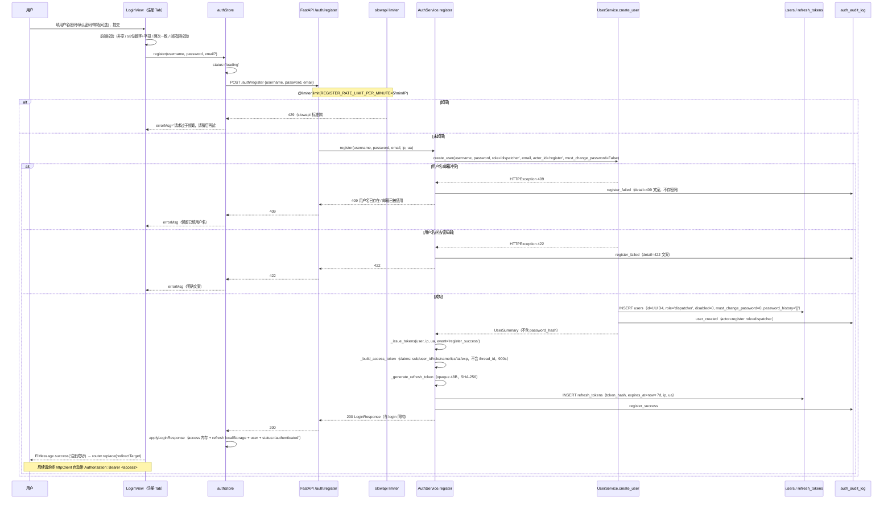
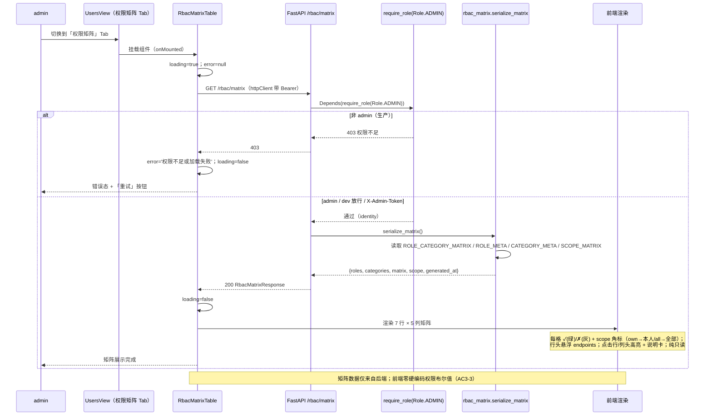

# GridMind（灵枢电网）系统架构设计 + 任务分解 · 开放注册 + 管理员角色×端点权限矩阵可视化

**主题**：① 开放注册（默认 dispatcher、注册即登录、per-IP 限流 + 审计）；② 5 角色 × 7 端点类别权限矩阵可视化（后端单一权威定义 + 一致性测试守护）
**作者**：高见远（架构师 Bob）　**日期**：2026-08-11　**基线**：V1.8.0 认证已上线（auth + users CRUD + RBAC）
**上游输入**：`docs/register-rbac-prd-2026-08-11.md`（PM 许清楚）+ `docs/auth-architecture-2026-08-11.md` + `docs/multiuser-architecture-2026-08-10.md`
**主理人已拍板**（不可违背）：
1. 注册限流随 P0 同批：per-IP 5/min（`REGISTER_RATE_LIMIT_PER_MINUTE`）；per-IP 日上限 P1；
2. 注册入口：LoginView 同页 Tab 切换（登录/注册）；
3. email 可选（与 create_user 一致）；
4. 矩阵仅 admin 可访问（随 UsersView，`require_role(ADMIN)`）；
5. 注册 `must_change_password=0`（用户自设密码）；
6. 矩阵接受 `scope`（own/all）扩展字段表达「仅本人」语义；
7. 一致性测试方案：不改 `require_role` 装饰器，仅新增权威定义（`ROLE_CATEGORY_MATRIX`）+ 一致性测试守护；
8. 前端导航同源仅确认方向（本批不做）。
**落盘**：本文档 + `docs/register-rbac-class-diagram.mermaid` + `docs/register-rbac-sequence-diagram.mermaid`

---

## 〇、现状核实结论（设计前提，非凭空设计）

| 现状点 | 核实结果 | 对本设计的影响 |
|---|---|---|
| `api/services/user_service.py` `create_user` | 完整签名：`create_user(username, password, role, email=None, actor_id=None, ip_address=None, user_agent=None, must_change_password=True, user_id=None)`；username 小写唯一（`^[a-z0-9_.-]{1,64}$`）；`_validate_password` ≥8 位 + 数字 + 字母；bcrypt cost 12 + 72 字节截断；冲突 `409 用户名已存在 / 邮箱已被使用`、策略 `422` | **可完整复用为 register**：传 `role="dispatcher"`、`must_change_password=False`（拍板 5）、`actor_id="register"`（标识自助注册来源）；409/422 语义直接继承，**零复制逻辑** |
| `api/services/auth_service.py` `AuthService` | `login()` 完整链路；内部 `_issue_tokens(user, ip, user_agent, event)` = `_build_access_token`（claims: sub/user_id/role/name/iss/iat/exp，**不含 thread_id**）+ `_generate_refresh_token`（opaque + SHA-256 落库 refresh_tokens）+ 审计 event；`_build_token_response` 组装与 login 同构响应 | **注册即登录 = `create_user` + `_issue_tokens(event="register_success")`**——签发链、refresh 落库、审计一条龙复用，无需复制 login 逻辑 |
| `api/services/rbac.py` | `Role` 5 枚举 + `ROLE_VALUES` + `ADMIN_ROLES` + `AUDIT_FULL_ACCESS_ROLES` + `get_role` + `role_allows` + `require_role`（dev 放行 / X-Admin-Token 等效管理员）；**无「端点类别→角色」映射表**（实际强制散落在 main.py / knowledge_upload.py 的 `Depends(require_role(...))`） | **零改动**。新增单一权威定义放**新模块** `api/services/rbac_matrix.py`（导入 `rbac.py` 的 Role/常量），保持 rbac.py 纯净 + 符合拍板 7「不改 require_role」 |
| `api/routers/auth.py` | 6 端点；`@limiter.limit(lambda: f"{settings.login_rate_limit_per_minute}/minute")` 模式；`_request_meta(request)` 提取 IP/UA；limiter 从共享模块导入 | 新增 `POST /auth/register` 落位本 router，复用 `_request_meta` + `@limiter.limit` 装饰器模式（per-IP 5/min） |
| `api/routers/users.py` | 3 端点，`_AdminIdentity = Annotated[dict, Depends(require_role(Role.ADMIN))]` | 矩阵端点用**同一模式**（`require_role(Role.ADMIN)`，dev 放行、X-Admin-Token 等效） |
| `api/config.py` | 已有 `login_rate_limit_per_minute`（默认 10）；**无注册限流配置** | 新增 `register_rate_limit_per_minute`（默认 5）——与 login 区分（拍板 1） |
| `api/schemas/auth.py` | `LoginRequest/LoginResponse/RefreshRequest/LogoutRequest/MeResponse/ChangePasswordRequest/DevLoginRequest/UserSummary/UserCreateRequest/UserUpdateRequest/UsersListResponse`；`LoginResponse` 与 login 同构 | 新增 `RegisterRequest`（**不含 role**）；矩阵响应模型放**新文件** `api/schemas/rbac_matrix.py`（避免与 T01 同文件并行冲突） |
| `api/main.py` | 已 `include_router(auth_router)` + `include_router(users_router)`；limiter 共享单例 | 新增 `include_router(rbac_router)`（`/rbac/matrix`）；其余零改动 |
| `web/src/views/LoginView.vue` | 无 Tab 结构；`form = {username, password}`；`onSubmit` 成功后 `must_change_password` 分支 + `router.replace(redirectTarget)`；footnote「账号由管理员创建」 | **Tab 切换插入点**：`el-tabs`（登录/注册）+ 注册表单（username/password/confirmPassword/email 可选）+ 前端校验 + 复用 `authStore.register` → `router.replace(redirectTarget)` |
| `web/src/views/UsersView.vue` | 无 el-tabs；表格 + 工具栏 + 新建/编辑对话框；`ROLE_OPTIONS` 硬编码 5 角色 | **权限矩阵 Tab 插入点**：外层包 `el-tabs`（用户列表 / 权限矩阵），矩阵 Tab 挂 `RbacMatrixTable` 组件；`ROLE_OPTIONS` 保留（用户管理角色下拉用，非矩阵数据源） |
| `web/src/api/auth.ts` | 已有 `login/refresh/logout/fetchMe/changePassword/devLogin` + `fetchUsers/createUser/updateUser`，全部走 httpClient | 新增 `register()` + `fetchRbacMatrix()` 落点（与既有函数同风格） |
| `web/src/stores/auth.ts` | `applyLoginResponse(resp)` 内部函数：access 内存 + refresh localStorage + user + status=authenticated；`login/devLogin/refresh` 复用 | 新增 `register(username, password, email?)` action 复用 `applyLoginResponse`——注册即登录一行接入（PRD §〇 核实结论同款） |
| `web/src/types/index.ts` | 已有 `Role`/`AuthUser`/`LoginResponse`/`UserSummary` 等 | 新增 `RegisterRequest`/`RbacMatrixResponse` 等 DTO |
| `tests/test_rbac_matrix.py` | 已有 6 组测试（角色解析 / 灰度 / 系统配置 / KB / 审计过滤 / 模型切换） | **扩展**一致性断言：矩阵允许角色 == 各端点 `Depends(require_role(...))` 实参与 owner 语义，任一漂移 → 红 |
| 数据库 | `users` / `refresh_tokens` / `auth_audit_log` 三表已建；`auth_audit_log.event_type` 自由文本 | **无新表/新字段**（本批）；注册仅 INSERT users 一行 + 新增审计事件类型 `register_success` / `register_failed` |
| 第三方依赖 | bcrypt 已显式入 requirements（V1.8.0 T01 完成） | **无新增依赖** |

---

## 一、实现方案 + 框架选型

### 1.1 技术难点分析

1. **注册即登录必须复用既有签发链，不复制逻辑**：`AuthService.login` 的「签发双 token + refresh 落库 + 审计」集中在 `_issue_tokens`；注册 = `UserService.create_user(role="dispatcher", must_change_password=False)` + `_issue_tokens(event="register_success")`——响应与 login 完全同构（`LoginResponse`），前端 `applyLoginResponse` 一行接入。
2. **防注册即提权**：`RegisterRequest` **不含 role 字段**；即使恶意传 `role`，Pydantic 默认 `extra="ignore"` 静默忽略，后端固定 `role="dispatcher"`。
3. **注册限流**：`POST /auth/register` 叠加 `@limiter.limit(lambda: f"{settings.register_rate_limit_per_minute}/minute")`（per-IP 5/min，比 login 10/min 更严）——共享 limiter 单例（`api/services/rate_limit.py`），与 login 同模式。
4. **矩阵权威定义与 require_role 同源**：不改 `require_role`/`get_role`/`verify_*` 任何语义（拍板 7），新增 `ROLE_CATEGORY_MATRIX` + `ROLE_META` + `CATEGORY_META` + `SCOPE_MATRIX`（放新模块 `api/services/rbac_matrix.py`），`GET /rbac/matrix` 直接序列化；一致性测试逐类别断言「矩阵允许角色 == 各端点 Depends 实参」防漂移。
5. **矩阵 scope 语义**：`own`=仅本人数据（会话对 dispatcher/operator/kb_admin/auditor；审计对 dispatcher/kb_admin）、`all`=全量可见（会话对 admin；审计对 operator/auditor/admin）——由 `SCOPE_MATRIX` 表达，前端渲染 ✓(本人)/✓(全部) 角标。
6. **前端矩阵只读**：矩阵组件零勾选/零编辑交互；即使显示 ✓ 实际访问仍由后端判定，前端不承担安全边界。
7. **无新表/新字段**：注册仅 INSERT users 一行 + refresh_tokens 一行 + auth_audit_log 事件（`event_type` 自由文本列，无需迁移）。

### 1.2 框架与库选型

- **后端**：复用 `fastapi`（Depends/APIRouter/Pydantic 模型）、`slowapi`（共享 limiter per-IP 限流）、`bcrypt`（密码 hash，create_user 已封装）、`PyJWT`（签发，AuthService 已封装）、`sqlite3`（标准库）、`loguru`（审计降级告警）。**零新增依赖**。
- **前端**：复用 `element-plus`（el-tabs/el-form/el-table/el-alert/ElMessage）、`pinia`（authStore）、`vue-router`、`axios`（httpClient）。**零新增依赖**。
- **架构模式**：后端分层（routers → services → schemas → db）不变；前端「组件 → store → api → httpClient」分层不变；不引入新范式。

### 1.3 后端方案

| 模块 | 方案 |
|---|---|
| `api/config.py` | 新增 `register_rate_limit_per_minute: int = 5`（env `REGISTER_RATE_LIMIT_PER_MINUTE`）——per-IP 注册限流阈值（拍板 1） |
| `api/schemas/auth.py` | 新增 `RegisterRequest`（username/password/email 可选；**不含 role**） |
| `api/services/auth_service.py` | 新增 `register(username, password, email=None, ip=None, user_agent=None)`：`create_user(role="dispatcher", must_change_password=False, actor_id="register")` + `_issue_tokens(event="register_success")`；失败（409/422）→ 审计 `register_failed` 后 re-raise |
| `api/routers/auth.py` | 新增 `POST /auth/register`（公开 + `@limiter.limit(5/min)`）→ `AuthService().register(...)` → `LoginResponse` |
| `api/services/rbac_matrix.py`（**新**） | 单一权威定义：`ROLE_CATEGORY_MATRIX` / `ROLE_META` / `CATEGORY_META` / `SCOPE_MATRIX` + `serialize_matrix()`（roles/categories/matrix/scope/generated_at） |
| `api/schemas/rbac_matrix.py`（**新**） | `RbacRoleMeta` / `RbacCategoryMeta` / `RbacMatrixResponse` |
| `api/routers/rbac.py`（**新**） | `GET /rbac/matrix` → `Depends(require_role(Role.ADMIN))`（dev 放行、X-Admin-Token 等效）→ `RbacMatrixResponse` |
| `api/main.py` | `include_router(rbac_router)`（唯一改动） |

### 1.4 前端方案

| 模块 | 方案 |
|---|---|
| `web/src/types/index.ts` | 新增 `RegisterRequest` / `RbacRoleMeta` / `RbacCategoryMeta` / `RbacMatrixResponse` |
| `web/src/api/auth.ts` | 新增 `register(payload): Promise<LoginResponse>`（POST /auth/register）+ `fetchRbacMatrix(): Promise<RbacMatrixResponse>`（GET /rbac/matrix） |
| `web/src/stores/auth.ts` | 新增 `register(username, password, email?)` action：`authApi.register` → `applyLoginResponse(resp)`（注册即登录） |
| `web/src/views/LoginView.vue` | 外层 `el-tabs`（登录/注册）：登录表单保持现状；注册表单 = 用户名/密码/确认密码/邮箱（可选）+ 前端校验（用户名非空、密码 ≥8 数字+字母、两次一致、邮箱轻校验）+ loading 防重复 + 错误条复用 `el-alert`；注册成功 → `ElMessage.success('注册成功')` → `router.replace(redirectTarget)`；底部小字说明「注册即登录；默认角色为调度员；密码至少 8 位且包含数字和字母」 |
| `web/src/views/UsersView.vue` | 外层包 `el-tabs`：Tab1「用户列表」= 现有表格内容整体搬入；Tab2「权限矩阵」= `<RbacMatrixTable />` |
| `web/src/components/controls/RbacMatrixTable.vue`（**新**） | 矩阵组件：`onMounted fetchRbacMatrix()`；行=7 端点类别、列=5 角色；每格 ✓(绿)/✗(灰) + scope 角标（own→「本人」/all→「全部」）；行头悬浮显示 `categories[].endpoints`；点击行/列头高亮 + 说明卡（`roles[].description` / `categories[].description`）；加载态 `v-loading`、错误态 + 重试按钮；**纯只读** |

### 1.5 与既有体系的关系（不破坏项）

1. `get_role` / `require_role` / `role_allows` / `verify_jwt_if_prod` / `verify_thread_ownership*` / `ensure_thread_owned` / `verify_audit_thread_access` / `AUDIT_FULL_ACCESS_ROLES` / X-Admin-Token 等效管理员 —— **全部零改动**。
2. 现有 auth 端点（login/refresh/logout/me/change-password/dev-login）与 users CRUD（GET/POST /users、PATCH /users/{id}）——契约与行为零改动（全量 pytest 回归）。
3. `AuthService._issue_tokens` / `_build_token_response` / `UserService.create_user` —— 复用不修改；`create_user` 的 `actor_id="register"` 只是审计 detail 标识。
4. 矩阵权威定义是**新增**只读数据源，不改变任何强制判定；`require_role` 调用点保持现状（拍板 7）。
5. 前端 `navItems.ts` / `menuDrawerGroups.ts` 导航角色显隐常量保持现状（导航 UX 与端点能力分离；P2 再考虑同源派生，拍板 8）。

---

## 二、文件列表（新增 / 修改，含改动内容）

### 后端（Backend）

| # | 文件（相对路径） | 类型 | 改动内容 |
|---|---|---|---|
| B01 | `api/config.py` | 修改 | 新增 `register_rate_limit_per_minute: int = 5`（env `REGISTER_RATE_LIMIT_PER_MINUTE`）——注册 per-IP 限流阈值（默认 5/min，比 login 10/min 更严） |
| B02 | `api/schemas/auth.py` | 修改 | 新增 `RegisterRequest`（`username` / `password` / `email: str | None = None`；**不含 role**——防注册即提权） |
| B03 | `api/services/auth_service.py` | 修改 | 新增 `register(username, password, email=None, ip=None, user_agent=None) -> dict`：`UserService.create_user(role="dispatcher", must_change_password=False, actor_id="register", ...)` → 成功 `_issue_tokens(event="register_success")`；`HTTPException`（409/422）→ `AuthAuditService.record("register_failed", ...)` 后 re-raise |
| B04 | `api/routers/auth.py` | 修改 | 新增 `POST /auth/register`（公开）：`@limiter.limit(lambda: f"{settings.register_rate_limit_per_minute}/minute")` → `AuthService().register(...)` → `LoginResponse`（与 login 同构，注册即登录） |
| B05 | `api/services/rbac_matrix.py` | **新增** | 单一权威定义 + 序列化：`ROLE_CATEGORY_MATRIX`（5 角色 × 7 类别 bool）、`ROLE_META`（label/description）、`CATEGORY_META`（label/description/endpoints）、`SCOPE_MATRIX`（类别→角色→own/all）、`serialize_matrix() -> dict`（roles/categories/matrix/scope/generated_at） |
| B06 | `api/schemas/rbac_matrix.py` | **新增** | Pydantic 模型：`RbacRoleMeta` / `RbacCategoryMeta` / `RbacMatrixResponse` |
| B07 | `api/routers/rbac.py` | **新增** | `GET /rbac/matrix`：`Depends(require_role(Role.ADMIN))`（dev 放行、X-Admin-Token 等效）→ `RbacMatrixResponse(**serialize_matrix())` |
| B08 | `api/main.py` | 修改 | `from api.routers.rbac import router as rbac_router` + `app.include_router(rbac_router)`（唯一改动；auth/users router 接线不变） |

### 测试（Tests）

| # | 文件（相对路径） | 类型 | 改动内容 |
|---|---|---|---|
| T01 | `tests/test_register_api.py` | **新增** | 注册成功（role=dispatcher、must_change_password=0、注册即登录返回双 token + user）、409 用户名/邮箱冲突、422 用户名非法/密码弱、429 IP 限流（5/min）、register_success/register_failed 审计落库、dev 注册可用、现有 auth 端点零回归 |
| T02 | `tests/test_rbac_matrix.py` | 修改 | **新增一致性断言组**：矩阵允许角色 == 各端点 `Depends(require_role(...))` 实参（灰度/系统=OPERATOR,ADMIN；KB 写=KB_ADMIN,ADMIN；KB 读=全员；审计=AUDIT_FULL_ACCESS_ROLES + owner；会话/模型=全员 + owner 语义）；新增 `GET /rbac/matrix` 端点测试（admin 200 / 非 admin 403 / dev 放行 / 响应结构含 roles/categories/matrix/scope/generated_at） |

### 前端（Frontend）

| # | 文件（相对路径） | 类型 | 改动内容 |
|---|---|---|---|
| F01 | `web/src/types/index.ts` | 修改 | 新增 `RegisterRequest` / `RbacRoleMeta` / `RbacCategoryMeta` / `RbacMatrixResponse`（含 `scope: Record<string, Record<Role, 'own' | 'all'>>`） |
| F02 | `web/src/api/auth.ts` | 修改 | 新增 `register(payload: RegisterRequest): Promise<LoginResponse>`（POST /auth/register）+ `fetchRbacMatrix(): Promise<RbacMatrixResponse>`（GET /rbac/matrix） |
| F03 | `web/src/stores/auth.ts` | 修改 | 新增 `register(username, password, email?)` action：`authApi.register` → `applyLoginResponse(resp)`（复用登录会话持久化路径） |
| F04 | `web/src/views/LoginView.vue` | 修改 | 外层 `el-tabs`（登录/注册）；注册表单（用户名/密码/确认密码/邮箱可选）+ 前端校验 + loading 防重复 + 错误条 + 成功跳 `redirectTarget`；登录模式 footnote 改为「没有账号？立即注册」入口 |
| F05 | `web/src/views/UsersView.vue` | 修改 | 外层包 `el-tabs`：Tab1「用户列表」（现有表格整体搬入）、Tab2「权限矩阵」（`<RbacMatrixTable />`）；现有对话框/过滤逻辑零改动 |
| F06 | `web/src/components/controls/RbacMatrixTable.vue` | **新增** | 矩阵组件：5×7 矩阵 ✓/✗ + scope 角标（own→本人/all→全部）+ 行头悬浮 endpoints + 点击行/列头高亮说明卡 + 加载/错误/重试态；**纯只读** |

---

## 三、数据结构和接口

### 3.1 `POST /auth/register` 请求/响应模型（与 login 同构）

```python
# api/schemas/auth.py（新增）
class RegisterRequest(BaseModel):
    """POST /auth/register 请求体（**不含 role**——固定 dispatcher，防注册即提权）。

    即使客户端恶意传 ``role``，Pydantic 默认 ``extra="ignore"`` 静默忽略，
    后端固定 ``role="dispatcher"``（拍板 3 + PRD §八 2）。
    """
    username: str = Field(..., min_length=1, max_length=128)
    password: str = Field(..., min_length=1, max_length=256)
    email: str | None = Field(default=None, max_length=256)   # 可选（与 create_user 一致，拍板 3）
```

- **响应 `200`**：复用 `LoginResponse`（与 `POST /auth/login` 完全同构）：
```json
{
  "access_token": "<jwt>",
  "refresh_token": "<opaque>",
  "token_type": "bearer",
  "expires_in": 900,
  "mfa_required": false,
  "user": { "id": "uuid", "username": "alice", "display_name": "alice", "role": "dispatcher" }
}
```
- **错误**：`409 用户名已存在 / 邮箱已被使用`（继承 create_user）；`422 用户名非法 / 密码不满足策略`（继承 create_user）；`429` IP 限流超 5/min（slowapi 标准体）。
- **审计**：成功 `register_success`（`_issue_tokens` 内记录）；失败 `register_failed`（detail 记 `409/422: 文案`，不存密码/明文 token）；`create_user` 内部另记 `user_created`（`detail="actor=register role=dispatcher"`）。

### 3.2 `GET /rbac/matrix` 响应模型（admin，P0）

```python
# api/schemas/rbac_matrix.py（新增）
class RbacRoleMeta(BaseModel):
    key: str            # 5 角色之一（dispatcher/operator/kb_admin/auditor/admin）
    label: str          # 展示名（调度员/运维/知识管理员/审计/管理员）
    description: str    # 一句话职责说明（P1-3，后端权威维护）

class RbacCategoryMeta(BaseModel):
    key: str            # 7 类别之一（session/grayscale/kb_write/kb_read/audit/system/model）
    label: str          # 展示名（会话管理/灰度/KB 写/KB 读/审计/系统配置/模型切换）
    description: str    # 类别说明
    endpoints: list[str]  # 代表端点（行头悬浮展示）

class RbacMatrixResponse(BaseModel):
    roles: list[RbacRoleMeta]
    categories: list[RbacCategoryMeta]
    matrix: dict[str, dict[str, bool]]        # role -> category -> bool（核心契约）
    scope: dict[str, dict[str, str]]          # category -> role -> 'own'|'all'（扩展字段）
    generated_at: str                          # UTC ISO（实时序列化生成）
```

### 3.3 `ROLE_CATEGORY_MATRIX` 单一权威定义（dict 形态，`api/services/rbac_matrix.py`）

```python
"""RBAC 权限矩阵 · 单一权威定义（V1.8.0 增量）。

**与 require_role 调用点的一致性约定（共享知识 #4）**：
- 本文件是「端点类别 → 角色可访问性」的**唯一权威**，`GET /rbac/matrix` 直接序列化；
- 一致性测试（tests/test_rbac_matrix.py）逐类别断言矩阵 == 各端点
  ``Depends(require_role(...))`` 实参与 owner 语义，任一漂移 → 测试红；
- ``require_role`` / ``get_role`` / ``verify_*`` 语义零改动（主理人拍板 7）。
"""

#: 角色 → 端点类别 → 是否可访问（与 multiuser-architecture §3.4 矩阵一致）
ROLE_CATEGORY_MATRIX: dict[str, dict[str, bool]] = {
    "dispatcher": {"session": True,  "grayscale": False, "kb_write": False, "kb_read": True,  "audit": True,  "system": False, "model": True},
    "operator":   {"session": True,  "grayscale": True,  "kb_write": False, "kb_read": True,  "audit": True,  "system": True,  "model": True},
    "kb_admin":   {"session": True,  "grayscale": False, "kb_write": True,  "kb_read": True,  "audit": True,  "system": False, "model": True},
    "auditor":    {"session": True,  "grayscale": False, "kb_write": False, "kb_read": True,  "audit": True,  "system": False, "model": True},
    "admin":      {"session": True,  "grayscale": True,  "kb_write": True,  "kb_read": True,  "audit": True,  "system": True,  "model": True},
}

#: 类别 → 角色 → 数据可见范围（'own'=仅本人数据；'all'=全量可见）——扩展字段（拍板 6）
SCOPE_MATRIX: dict[str, dict[str, str]] = {
    "session": {"dispatcher": "own", "operator": "own", "kb_admin": "own", "auditor": "own", "admin": "all"},
    "audit":   {"dispatcher": "own", "operator": "all", "kb_admin": "own", "auditor": "all", "admin": "all"},
}

#: 角色元信息（P1-3：description 随矩阵同源下发）
ROLE_META: dict[str, dict[str, str]] = {
    "dispatcher": {"label": "调度员",     "description": "日常调度与对话；仅能访问自己的会话"},
    "operator":   {"label": "运维",       "description": "会话 + 灰度 + 系统配置（监控与运维）"},
    "kb_admin":   {"label": "知识管理员", "description": "会话 + 知识库读写"},
    "auditor":    {"label": "审计",       "description": "会话（仅本人）+ 审计全量只读"},
    "admin":      {"label": "管理员",     "description": "全部权限 + 用户管理"},
}

#: 端点类别元信息（行头悬浮展示代表端点）
CATEGORY_META: dict[str, dict[str, object]] = {
    "session":    {"label": "会话管理", "description": "对话、历史、诊断推理、HITL 审批、会话控制", "endpoints": ["/chat", "/chat/stream/{thread_id}", "/thread/{thread_id}", "/diagnosis/{thread_id}/reasoning", "/interrupt/{thread_id}/approve|reject|decision", "/sessions/{thread_id}/pause|resume|rewind|abort|events"]},
    "grayscale":  {"label": "灰度",     "description": "灰度切流、回滚、状态/历史/指标",             "endpoints": ["/grayscale/status", "/grayscale/set", "/grayscale/history", "/grayscale/metrics", "/grayscale/manual_rollback"]},
    "kb_write":   {"label": "KB 写",    "description": "知识库上传与删除（角色写权限）",             "endpoints": ["POST /api/knowledge/upload", "DELETE /api/knowledge/uploads/{id}"]},
    "kb_read":    {"label": "KB 读",    "description": "知识库列表与检索（全局共享）",               "endpoints": ["GET /api/knowledge/uploads"]},
    "audit":      {"label": "审计",     "description": "HITL 审计查询（全量或仅本人）",              "endpoints": ["GET /audit/hitl", "GET /audit/hitl/{thread_id}"]},
    "system":     {"label": "系统配置", "description": "检查点统计、同步状态/强制同步",              "endpoints": ["/admin/checkpoint-stats", "/debug/sync_lag", "/debug/sync_force"]},
    "model":      {"label": "模型切换", "description": "模型列表与切换（会话级 owner 校验）",         "endpoints": ["GET /models", "POST /models/switch"]},
}

def serialize_matrix() -> dict[str, Any]:
    """GET /rbac/matrix 数据源：roles/categories/matrix/scope/generated_at。

    直接由权威定义生成（前端**不硬编码**任何权限布尔值）。
    generated_at = 当前 UTC ISO（每次实时生成，数据量小无需缓存）。
    """
    from api.services.rbac import ROLE_VALUES  # 5 角色值空间（顺序权威）
    roles = [{"key": r, **ROLE_META[r]} for r in sorted(ROLE_VALUES)]
    categories = [{"key": c, **CATEGORY_META[c]} for c in ROLE_CATEGORY_MATRIX["dispatcher"]]
    return {
        "roles": roles,
        "categories": categories,
        "matrix": ROLE_CATEGORY_MATRIX,
        "scope": SCOPE_MATRIX,
        "generated_at": _now_iso(),
    }
```

矩阵语义（与 multiuser-architecture §3.4 一致）：
- 会话管理 = 全员 + owner 校验（`verify_thread_ownership_if_prod` / `verify_thread_ownership`）；admin 全量 → scope own/all；
- 灰度 = `require_role(OPERATOR, ADMIN)`；KB 写 = `require_role(KB_ADMIN, ADMIN)`；KB 读 = 全员（`verify_jwt_if_prod`）；
- 审计 = `AUDIT_FULL_ACCESS_ROLES`（auditor/operator/admin 全量）+ dispatcher/kb_admin 仅本人；
- 系统配置 = `require_role(OPERATOR, ADMIN)`；模型切换 = 全员 + 有 thread_id 时 owner 校验。

### 3.4 前端类型（`web/src/types/index.ts` 新增）

```ts
/** POST /auth/register 请求体（不含 role——固定 dispatcher） */
export interface RegisterRequest {
  username: string
  password: string
  email?: string | null
}

/** GET /rbac/matrix 角色元信息 */
export interface RbacRoleMeta {
  key: Role
  label: string
  description: string
}

/** GET /rbac/matrix 端点类别元信息 */
export interface RbacCategoryMeta {
  key: string
  label: string
  description: string
  endpoints: string[]
}

/** GET /rbac/matrix 响应（只读展示；前端不硬编码权限布尔值） */
export interface RbacMatrixResponse {
  roles: RbacRoleMeta[]
  categories: RbacCategoryMeta[]
  matrix: Record<Role, Record<string, boolean>>
  scope: Record<string, Record<Role, 'own' | 'all'>>
  generated_at: string
}
```

### 3.5 类图（mermaid，另存 `docs/register-rbac-class-diagram.mermaid`）

```mermaid
classDiagram
    class RegisterRequest {
        +str username
        +str password
        +str|None email
    }
    class LoginResponse {
        +str access_token
        +str refresh_token
        +str token_type
        +int expires_in
        +bool mfa_required
        +LoginUserInfo user
    }
    class RbacRoleMeta {
        +str key
        +str label
        +str description
    }
    class RbacCategoryMeta {
        +str key
        +str label
        +str description
        +list~str~ endpoints
    }
    class RbacMatrixResponse {
        +list~RbacRoleMeta~ roles
        +list~RbacCategoryMeta~ categories
        +dict matrix
        +dict scope
        +str generated_at
    }
    class AuthService {
        +login(username, password, ip, ua) dict
        +register(username, password, email, ip, ua) dict
        +refresh(refresh_token, ip, ua) dict
        +logout(refresh_token) None
        +get_me(user_id) dict
        +change_password(user_id, old, new, ip, ua) None
        +dev_login(role, ip, ua) dict
        -_issue_tokens(user, ip, ua, event) dict
        -_build_access_token(user) str
        -_generate_refresh_token(user, ip, ua) str
    }
    class UserService {
        +create_user(username, password, role, email, actor_id, ip, ua, must_change_password, user_id) dict
        +get_by_username(username) dict
        +update_user(user_id, role, disabled, password, actor_id, ip, ua) dict
        -_validate_password(password) None
        -_hash_password(password) str
    }
    class AuthAuditService {
        +record(event_type, user_id, username, ip, ua, detail) None
    }
    class RbacMatrixModule {
        +dict ROLE_CATEGORY_MATRIX
        +dict SCOPE_MATRIX
        +dict ROLE_META
        +dict CATEGORY_META
        +serialize_matrix() dict
    }
    class AuthRouter {
        +POST /auth/login
        +POST /auth/register
        +POST /auth/refresh
        +POST /auth/logout
        +GET /auth/me
        +POST /auth/change-password
        +POST /auth/dev-login
    }
    class RbacRouter {
        +GET /rbac/matrix
    }
    class authStore {
        +accessToken string
        +user AuthUser
        +status AuthStatus
        +login(username, password) Promise
        +register(username, password, email) Promise
        +refresh() Promise
        +logout() Promise
        +hydrate() Promise
        -applyLoginResponse(resp) void
    }
    class authApi {
        +login(username, password) Promise
        +register(payload) Promise
        +fetchRbacMatrix() Promise
        +refresh(token) Promise
        +logout(token) Promise
    }
    class LoginView {
        +mode login|register
        +registerForm reactive
        +onSubmitRegister() Promise
    }
    class UsersView {
        +el-tabs activeTab
        +RbacMatrixTable matrixTab
    }
    class RbacMatrixTable {
        +matrix RbacMatrixResponse|None
        +loading boolean
        +error string
        +load() Promise
        +retry() Promise
    }

    AuthService --> UserService : create_user (register)
    AuthService --> AuthAuditService : register_success/register_failed
    AuthRouter --> AuthService : delegates
    RbacRouter --> RbacMatrixModule : serialize_matrix
    RbacRouter --> require_role(Role.ADMIN) : Depends
    authStore --> authApi : via httpClient
    LoginView --> authStore : register()
    UsersView --> RbacMatrixTable : mounts
    RbacMatrixTable --> authApi : fetchRbacMatrix()
```

---

## 四、程序调用流程（时序图，mermaid；另存 `docs/register-rbac-sequence-diagram.mermaid`）

### 4.1 注册即登录流程（表单 → register → create_user + 签发双 token + refresh 落库 + 审计 → applyLoginResponse → 跳主页）



### 4.2 权限矩阵加载流程（UsersView → GET /rbac/matrix → 渲染）



---

## 五、任务列表（有序、含依赖、按实现顺序）

> 分组原则：按「基础设施 + 注册后端 → 矩阵后端 + 一致性测试 → 前端数据层 → 前端交互层」四个功能模块横向分组；每任务 ≥3 文件，任务数 = 4（硬性上限 5）；依赖链 T1、T2 并行 → T3 → T4。

### Task 1：基础设施 + 开放注册后端闭环（配置项 + RegisterRequest + AuthService.register + /auth/register 端点 + 测试）

- **涉及文件**：`api/config.py`、`api/schemas/auth.py`、`api/services/auth_service.py`、`api/routers/auth.py`、`tests/test_register_api.py`（新）
- **依赖**：无
- **优先级**：P0
- **验收标准**：
  1. `settings.register_rate_limit_per_minute` 默认 5（env `REGISTER_RATE_LIMIT_PER_MINUTE` 可配）；
  2. `RegisterRequest` 仅含 username/password/email（可选）——**不含 role**；恶意传 role 被静默忽略，后端固定 `role="dispatcher"`；
  3. `POST /auth/register` 公开可用：成功返回 `200 LoginResponse`（与 login 完全同构：access+refresh+expires_in+mfa_required+user{role=dispatcher}）；新用户 `role=dispatcher`、`disabled=0`、`must_change_password=0`（拍板 5）；
  4. 冲突 `409 用户名已存在 / 邮箱已被使用`；用户名非法/密码弱 `422`（继承 create_user 文案）；IP 超 5/min → `429`（slowapi）；
  5. 审计：成功 `register_success` + `user_created`（actor=register）；失败 `register_failed`（detail 记状态码+文案，不存密码/明文 token）；审计写失败不阻断注册；
  6. dev 模式注册可用（连本地库建真实 dispatcher 账号）；现有 auth 端点（login/refresh/logout/me/change-password/dev-login）零回归；
  7. `pytest tests/test_register_api.py` + 全量 pytest 通过。

### Task 2：RBAC 权限矩阵权威定义 + 矩阵端点 + 一致性测试（rbac_matrix 模块 + /rbac/matrix + 防漂移测试）

- **涉及文件**：`api/services/rbac_matrix.py`（新）、`api/schemas/rbac_matrix.py`（新）、`api/routers/rbac.py`（新）、`api/main.py`、`tests/test_rbac_matrix.py`
- **依赖**：无（与 Task 1 并行——B05/B06/B07/B08 与 B01-B04 互不触碰同一文件）
- **优先级**：P0
- **验收标准**：
  1. `ROLE_CATEGORY_MATRIX`（5 角色 × 7 类别 bool）+ `SCOPE_MATRIX`（类别→角色→own/all）+ `ROLE_META`（label/description）+ `CATEGORY_META`（label/description/endpoints）就绪；矩阵语义与 multiuser-architecture §3.4 一致；
  2. `GET /rbac/matrix`：`require_role(Role.ADMIN)`（dev 放行、X-Admin-Token 等效）；响应 `{roles, categories, matrix, scope, generated_at}` 结构正确；`roles[].description` / `categories[].endpoints` 后端权威下发（P1-3 同源）；
  3. **一致性测试（防漂移）**：逐类别断言矩阵允许角色 == 各端点 `Depends(require_role(...))` 实参——灰度/系统 = {operator, admin}；KB 写 = {kb_admin, admin}；KB 读 = 全员；审计 = AUDIT_FULL_ACCESS_ROLES 全量 + dispatcher/kb_admin 仅本人（scope own）；会话/模型 = 全员 + owner 语义（scope own/all）；任一漂移 → 测试红；
  4. `require_role` / `get_role` / `verify_*` / `AUDIT_FULL_ACCESS_ROLES` —— **零改动**（拍板 7）；现有 6 组矩阵测试不回归；
  5. 端点测试：admin（生产 JWT role=admin）→ 200；dispatcher → 403；dev 匿名 → 200（放行）；X-Admin-Token → 200（等效管理员）；
  6. `pytest tests/test_rbac_matrix.py` + 全量 pytest 通过。

### Task 3：前端数据层（注册 + 矩阵 DTO / API / authStore）

- **涉及文件**：`web/src/types/index.ts`、`web/src/api/auth.ts`、`web/src/stores/auth.ts`
- **依赖**：Task 1、Task 2（后端端点就绪）
- **优先级**：P0
- **验收标准**：
  1. 类型就绪：`RegisterRequest` / `RbacRoleMeta` / `RbacCategoryMeta` / `RbacMatrixResponse`（含 `scope: Record<string, Record<Role, 'own' | 'all'>>`）；`LoginResponse` 复用不变；
  2. `api/auth.ts` 新增 `register(payload): Promise<LoginResponse>`（POST /auth/register）+ `fetchRbacMatrix(): Promise<RbacMatrixResponse>`（GET /rbac/matrix），走共享 httpClient（自动 Bearer + 401 自动 refresh）；
  3. `authStore.register(username, password, email?)`：`authApi.register` → `applyLoginResponse`（access 内存 + refresh localStorage + user + status='authenticated'）——注册即登录一行接入；失败 status='anonymous' 并 re-throw；
  4. `vue-tsc` 通过；既有 login/devLogin/refresh/hydrate 行为零回归。

### Task 4：前端交互层（登录页注册 Tab + 用户页权限矩阵 Tab）

- **涉及文件**：`web/src/views/LoginView.vue`、`web/src/views/UsersView.vue`、`web/src/components/controls/RbacMatrixTable.vue`（新）
- **依赖**：Task 3
- **优先级**：P0 / P1
- **验收标准**：
  1. LoginView：`el-tabs`（登录/注册）切换；注册表单 = 用户名/密码/确认密码/邮箱（可选）；前端校验（用户名非空、密码 ≥8 位含数字+字母、两次一致本地拦截不提交、邮箱轻校验）；提交中按钮 loading 防重复；失败错误条复用 `el-alert`（409/422/429 明确文案），**不清空已填用户名**；注册成功 → `ElMessage.success('注册成功')` → `router.replace(redirectTarget)`（与登录一致）；登录/注册 Tab 各自表单状态保留；底部小字「注册即登录；默认角色为调度员；密码至少 8 位且包含数字和字母」；
  2. UsersView：外层 `el-tabs`——Tab1「用户列表」（现有表格/过滤/对话框整体搬入，零逻辑改动）、Tab2「权限矩阵」（挂 `RbacMatrixTable`）；
  3. RbacMatrixTable：`onMounted fetchRbacMatrix()`；7 行（端点类别）× 5 列（角色）矩阵；每格 ✓(绿)/✗(灰) + scope 角标（own→「本人」/all→「全部」）；行头悬浮显示 `categories[].endpoints`；点击行/列头高亮 + 说明卡（`roles[].description` / `categories[].description`）；加载态 `v-loading`；失败 → 错误态 + 「重试」按钮（不渲染伪造矩阵）；**纯只读**（无任何勾选/编辑交互）；
  4. 矩阵数据**只来自** `GET /rbac/matrix`，前端**零硬编码**权限布尔值（`ROLE_OPTIONS` 仅用于用户管理角色下拉，非矩阵数据源）；
  5. 全量 `pytest` + `vue-tsc` 双绿；生产模式端到端冒烟（注册 → 自动登录跳主页 → admin 打开权限矩阵 → 核对 5×7 矩阵 → 非 admin 访问 /rbac/matrix 403）一次通过。

---

## 六、依赖包列表

**无新增第三方依赖**（本批）。

- 后端：复用既有 `fastapi`、`pydantic`、`PyJWT`、`slowapi`（共享 limiter）、`bcrypt`（create_user 已封装）、`sqlite3`（标准库）、`loguru`、`secrets`/`hashlib`（标准库，refresh 签发）。
- 前端：复用既有 `pinia`、`vue-router`、`element-plus`（el-tabs/el-table/el-form/el-alert）、`axios`（httpClient）、既有 `useJwtAuth`。
- 理由：注册复用 `create_user` + `_issue_tokens` 既有链路；矩阵为纯序列化（无新存储）；限流复用共享 limiter 单例；前端矩阵为既有 Element Plus 表格能力。若后续 P1-1（per-IP 日上限）需要跨分钟窗口计数，可评估 slowapi 多 key 或自建计数表——本批不做。

---

## 七、共享知识（跨文件约定）

1. **register 请求体不含 role（防注册即提权）**
   - `RegisterRequest` 仅含 username/password/email；后端固定 `role="dispatcher"`（拍板 3）。
   - Pydantic 默认 `extra="ignore"`：即使恶意传 `role` 也静默忽略，不 422、不泄漏校验逻辑。
2. **注册审计事件**
   - 成功：`register_success`（`_issue_tokens` 内记录，含 user_id/username/ip/ua）；另由 `create_user` 内部记 `user_created`（`detail="actor=register role=dispatcher"`）。
   - 失败：`register_failed`（`AuthService.register` 捕获 HTTPException 后记录，detail 记 `409/422: 文案`；**不存密码/明文 token**）。
   - 审计写失败仅 `loguru.warning` 降级，**绝不阻断注册主流程**（复用 AuthAuditService 语义）。
3. **注册限流**
   - `POST /auth/register` 叠加 `@limiter.limit(lambda: f"{settings.register_rate_limit_per_minute}/minute")`（per-IP，默认 5/min，`REGISTER_RATE_LIMIT_PER_MINUTE` 可配）。
   - 与 login（10/min）**独立计数**（不同装饰器实例，但共享同一 Limiter storage——计数键均为 IP，实际按装饰器各自维护计数规则，互不影响）。
   - per-IP 日上限（P1-1）本批不做（拍板 1）。
4. **矩阵权威定义与 require_role 调用点一致性 + 一致性测试守卫**
   - `api/services/rbac_matrix.py` 的 `ROLE_CATEGORY_MATRIX` / `SCOPE_MATRIX` / `ROLE_META` / `CATEGORY_META` 是端点类别权限的**唯一权威**；`GET /rbac/matrix` 直接序列化，前端零硬编码。
   - 一致性测试（`tests/test_rbac_matrix.py`）逐类别断言「矩阵允许角色 == 各端点 `Depends(require_role(...))` 实参 + owner 语义」；**不重构 require_role 装饰器**（拍板 7）——装饰器保持现状，测试只守护不漂移。
   - 新增端点若引入新权限类别：必须同步更新 `ROLE_CATEGORY_MATRIX` 与一致性测试，否则测试红。
5. **scope 语义（own/all）**
   - `own` = 仅本人数据（会话对 dispatcher/operator/kb_admin/auditor；审计对 dispatcher/kb_admin）；`all` = 全量可见（会话对 admin；审计对 operator/auditor/admin）。
   - 前端将 `scope=own` 的 ✓ 渲染为「✓(本人)」角标/悬浮说明；`all` 渲染「✓(全部)」。
6. **前端矩阵只读不承担安全**
   - 矩阵组件零勾选/零编辑；即使显示 ✓ 实际访问仍由后端 `require_role` / `verify_*` 判定；前端不拦截、不授权、不改后端映射。
7. **create_user / login 链路复用约定（不复制逻辑）**
   - register = `UserService.create_user(role="dispatcher", must_change_password=False, actor_id="register")` + `AuthService._issue_tokens(event="register_success")`。
   - **禁止**复制 login 的密码校验/签发/refresh 落库逻辑；`create_user` 的 409/422 语义、`_issue_tokens` 的签发语义直接继承。
8. **must_change_password 语义**
   - 注册（用户自设密码）= `0`（拍板 5）；管理员创建 = `1`（`POST /users` 默认，需首次改密）——两路径区分由 `create_user(must_change_password=...)` 参数控制。
9. **JWT claims / Token 语义（继承 auth-architecture）**
   - 注册签发的 access/refresh 与 login 完全同构（claims 含 `sub`/`user_id`/`role`/`name`/`iss`/`iat`/`exp`，**不含 thread_id**）；自动获得 401 自动续期、轮换、登出撤销能力。
10. **dev 模式兼容**
    - register 在 dev 可用且叠加限流（防本地误刷）；`GET /rbac/matrix` dev 放行（返回真实矩阵，便于前端联调）；`/auth/dev-login` 生产 404 语义不变。
11. **目录/依赖约定**
    - 后端分层（routers → services → schemas → db）不变；`auth_service` 对 `user_service` / `rbac_matrix` 一律**函数内 lazy import**（沿用既有约定，防循环）。
    - 前端 httpClient 与 authStore 相互引用 → 函数体内动态读取，禁止模块级互 import（沿用 auth-architecture 共享知识 #11）。
12. **测试约定**
    - 生产用例：`monkeypatch.setenv("APP_ENV", "production")` + 合法 JWT（`issue_test_token(extra_claims={"role": ...})`）或登录签发；矩阵一致性断言引用 `rbac_matrix` 权威定义与 `api/main.py` / `knowledge_upload.py` 端点装饰器实参；
    - 注册限流用例：TestClient 连续 6 次 → 第 6 次 429；测试间 `app.state.limiter._storage.reset()`（既有模式）；
    - 全量回归：`pytest` + `vue-tsc` 双绿（含既有 743+ 基线）。

---

## 八、待明确事项

1. **email 格式校验（P1-4）**：本批 register 与 `create_user` 完全一致（仅非空唯一，不校验格式）；前端做轻校验（填了才校验基础格式）。若主理人要求后端严格格式校验（422 明确文案），需在 `RegisterRequest` 加 `EmailStr` 或手动校验——**建议本批不动 create_user**，P1 再评估是否统一在 create_user 层加。
2. **矩阵端点缓存**：`generated_at` 每次实时序列化（数据量小、无 DB 依赖，开销可忽略）；若未来矩阵变大或需审计「矩阵版本」，可加进程内缓存（P2）。
3. **register_failed 是否记录所有失败**：本设计记录业务失败（409/422）；**429 限流由 slowapi 在 handler 外拦截**，不进 `register_failed`（与 login_failed 对 429 的口径一致）。若主理人要求 429 也审计，需加 slowapi 回调——建议保持现状（避免刷审计表）。
4. **`actor_id="register"` 审计标识**：`create_user` 的 `user_created` 审计 detail 为 `actor=register role=dispatcher`（标识自助注册来源）。若需区分「管理员创建 vs 自助注册」做运营分析，P1 可低成本加 `users.source` 列（PRD §五 P2 预留）——本批不加。
5. **导航同源（P2-5，拍板 8 仅确认方向）**：`navItems.ts` / `menuDrawerGroups.ts` 角色显隐常量保持现状；后续若派生自 `GET /rbac/matrix`，需先定义「页面级导航可见性 vs 端点级权限」的映射规则（页面可能包含多类别端点），本批不做。

---

**架构设计完毕，待主理人审阅。**
