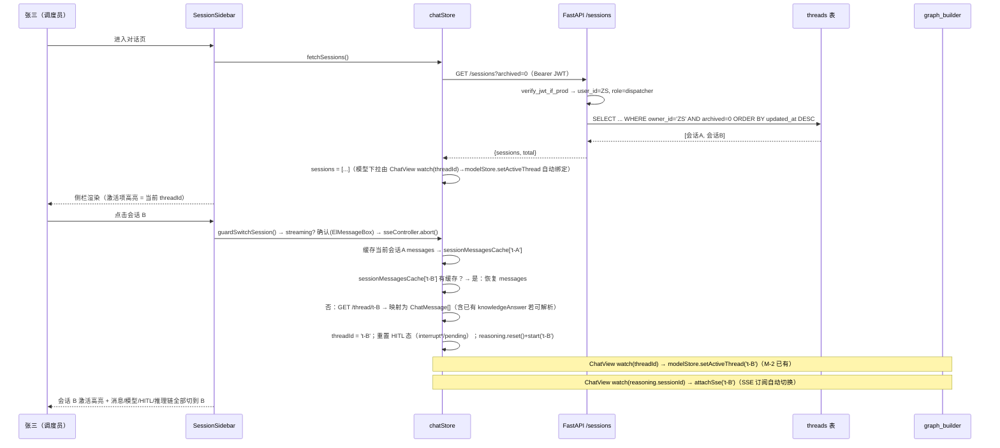
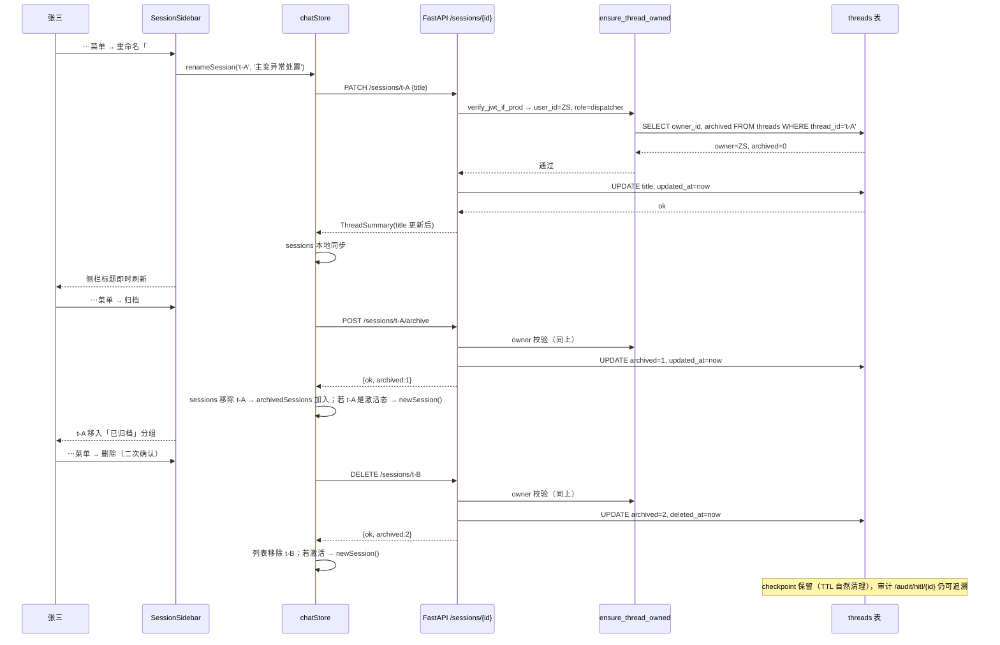
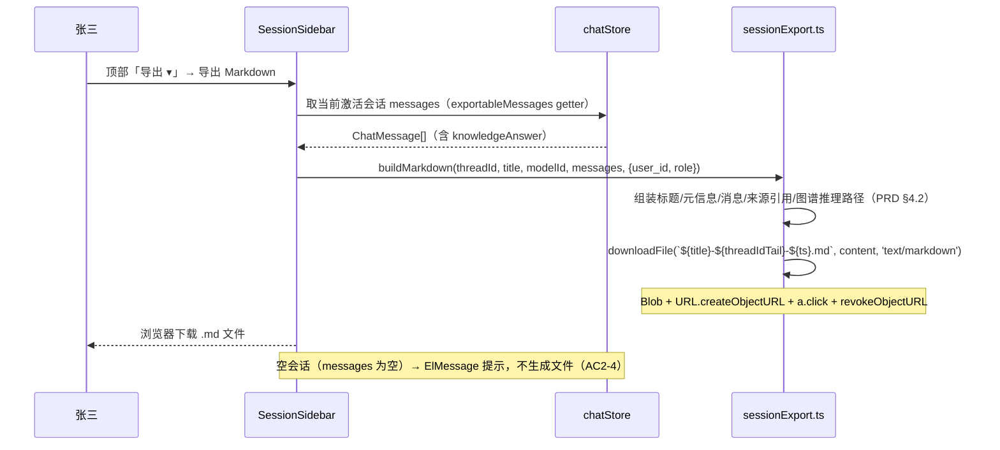
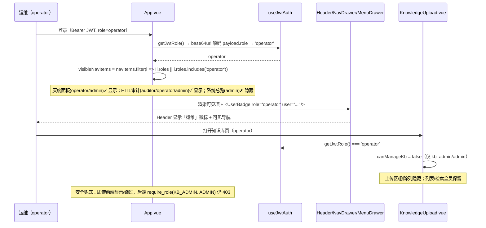

# GridMind（灵枢电网）M-5 系统架构设计 + 任务分解 · 对话体验（会话管理 + 导出 + 前端角色感知 UI）

**版本**：v1.7.0 第二批（M-5）　**作者**：高见远（架构师 Bob）　**日期**：2026-08-10
**上游输入**：`docs/session-mgmt-prd-2026-08-10.md`（PM 许清楚）+ `docs/multiuser-architecture-2026-08-10.md`（第一批多用户地基）
**技术栈**：Python FastAPI（后端）+ Vite + Vue3 + Pinia + Element Plus（前端，维持现状）
**基线**：M-4 后 pytest 717 passed / 18 skipped；RBAC 5 角色后端强制；threads 表 + owner 校验 + per-session 模型已落地
**落盘**：本文档 + `docs/session-mgmt-class-diagram.mermaid` + `docs/session-mgmt-sequence-diagram.mermaid`

---

## 〇、现状核实结论（设计前提，非凭空设计）

| 现状点 | 核实结果 | 对设计的影响 |
|---|---|---|
| `api/services/thread_store.py` | `ThreadStore` 已有 get_thread/get_owner/thread_exists/create_thread/ensure_thread/set_model/get_model/list_by_owner/list_thread_ids_by_owner/count；模块级 `ensure_thread_owned`、`get_model_for_thread`/`set_model_for_thread`/`resolve_model` 已就绪；**无 rename/archive/delete 方法**；`_THREADS_DDL` 无 archived 列 | 在既有类上加 3 方法 + 模块 DDL 同步加列（双保险幂等）；`ensure_thread_owned` 增加「archived=2 → 404」分支 |
| `mcp_tools/db/database.py` | `init_db()` executescript 建 threads 表（无 archived）；已有幂等迁移模式 `_ensure_*_columns`（PRAGMA table_info + ALTER TABLE ADD COLUMN + catch duplicate column） | 新增 `_ensure_threads_columns`（加 archived/deleted_at + 索引），init_db 末尾调用；executescript 的 threads DDL 同步加列（新库一步到位） |
| `api/main.py` | **无 `GET /sessions` 列表端点**；已有 `POST /sessions/{thread_id}/pause\|resume\|rewind\|abort`、`GET /sessions/{thread_id}/events`（V1.5.1）；`/chat` body 内 thread_id 已用 `ensure_thread_owned` 内联；`/models`、`/models/switch` 已支持 thread_id（M-2）；`verify_jwt_if_prod`/`verify_thread_ownership_if_prod`/`require_role`/`get_role`/`_identity_user_id` 均可复用 | 新增 `/sessions` 系列端点与既有 `/sessions/{id}/pause` 等**路径段数不同、无路由冲突**；写端点复用 `ensure_thread_owned`（含 admin 跨用户放行） |
| `api/schemas/__init__.py` | 已有 `ThreadSummary`（thread_id/title/model_id/created_at/updated_at，M-5 预留）；`ChatResponse.knowledge_answer` 已含 M-3/M-4 字段 | `ThreadSummary` 加 `archived`；新增 `SessionListResponse`/`SessionRenameRequest`/`SessionActionResponse` |
| `api/services/rbac.py` | `Role` 5 角色枚举 + `get_role`（缺省 dispatcher）+ `require_role` + `role_allows` 已就绪 | **零改动**；前端角色感知仅镜像后端矩阵 |
| `web/src/stores/chatStore.ts` | 单会话状态（messages/threadId/loading/streaming/interrupt*）；`resetChat()` 已有（abort + 清态 + 新 threadId）；`activeThreadId: threadId` 别名（M-2 契约）；**无 sessions/切换/命名/归档/导出** | 扩展 state + 新增 fetchSessions/activateThread/newSession/rename/archive/restore/delete；**内存会话缓存 map**（AC4-2 多会话不丢状态） |
| `web/src/components/ChatView.vue` | 布局为 flex column（背景层 + ReasoningControlBar + HitlEditDialog + message-list + input-area）；**无侧栏** | 外层改 flex row：左侧插入 `SessionSidebar`，右侧保留现有内容；切换后 `modelStore.setActiveThread` 由已有 watch(threadId) 自动处理 |
| `web/src/App.vue` | Header 5 个**硬编码**导航项（对话/监控/灰度/审计/系统）；Header 右侧为帮助图标+菜单按钮+更多折叠点；**无用户/角色徽标** | 导航改数据驱动 + `roles` 过滤；Header 右侧加 `UserBadge` |
| `web/src/data/menuDrawerGroups.ts` | 4 分组 + 快捷区；`MenuDrawerEntry`（types/header.ts）**无 roles 元数据** | `MenuDrawerEntry` 加可选 `roles?: Role[]`；VIEW_GROUP route 条目补 roles；MenuDrawer/NavDrawer 渲染过滤 |
| `web/src/components/controls/KnowledgeUpload.vue` | 上传拖拽区 + 删除列**对所有用户显示**，无角色判断 | `canManageKb = role ∈ {kb_admin, admin}` 控制上传区 + 删除列显隐；读列表全员保留 |
| `web/src/composables/useJwtAuth.ts` | 仅 getJwtToken/getAuthHeaders（token + Authorization header）；**不解析 JWT claim** | 新增 `parseJwtPayload`/`getJwtRole`/`getJwtUserId`（base64url 解码，缺省 dispatcher） |
| `web/src/types/index.ts` | `ChatMessage`/`KnowledgeAnswer`/`SourceRef`/`GraphAnswer`/`GraphAnswerNode`/`GraphAnswerEdge`/`GraphPath` 齐全（M-3/M-4）；**无 SessionSummary/导出类型/Role 类型** | 新增 `Role`/`SessionSummary`/`SessionsResponse`/`SessionRenameRequest`/`SessionActionResponse` |
| `web/src/api/chat.ts` | sendMessage/streamChat/getThread/healthCheck + resolveBaseUrl 已有；**无会话管理 API** | 新建 `web/src/api/sessions.ts`（fetchSessions/rename/archive/restore/delete） |
| 导出能力 | **全代码库无** Blob/createObjectURL 下载逻辑 | M-5 全新能力，用浏览器原生 Blob + URL.createObjectURL，零新依赖 |

---

## 一、实现方案 + 框架选型

### 1.1 技术难点分析

1. **archived 列平滑迁移**：threads 表已在 v1.7.0 第一批建表，M-5 必须对存量库做幂等 ALTER（加 `archived` + `deleted_at` 列），同时让新库在 `init_db()` 一次性建全 —— 复用既有 `_ensure_*_columns` 迁移模式（PRAGMA table_info + ALTER + catch duplicate column），并在 `thread_store._ensure_threads_schema` 同步（双保险）。
2. **软删除后的访问语义**：删除（archived=2）后，`/thread/{id}`、`/chat`（body thread_id）、`/models?thread_id=` 等**所有**以 thread 为入口的端点必须 404（防泄漏「会话曾存在」）。落点集中在 `ensure_thread_owned` + `auth.verify_thread_ownership`（生产路径）两处，全覆盖既有 9 类端点 + 新端点，零遗漏。
3. **多会话并行切换不丢状态**：现有 chatStore 是单 messages 数组，切换历史会话必须：① 缓存当前会话内存消息；② 目标会话有缓存则秒切、无缓存则 `GET /thread/{id}` 拉历史；③ 同步 HITL 态/推理链/reasoning 状态机/模型绑定（ChatView 已有 watch(threadId)→modelStore.setActiveThread，reasoning 由 done 事件 start，切换时需重建）。
4. **流式中断**：切换时若正在 SSE 流式输出，复用 chatStore 内部既有 `sseController.abort()`，先轻量确认（ElMessageBox），不静默丢输入。
5. **导出保真**：P1 只导出当前激活会话 —— 数据源就是前端内存 `ChatMessage[]`（已 attach `knowledgeAnswer`），序列化时对齐 PRD §4.2 的 sources/graph_answer 结构，**零后端改动**；缺省字段（非 knowledge_agent 轮次）自动跳过。
6. **前端角色感知零后端改动**：base64url 解码 JWT payload 读 `role` claim；dev token 不可解析 → 默认 dispatcher（fail-closed 展示层）。**安全由后端 RBAC 兜底，前端仅 UX**。

### 1.2 框架与库选型

- **无新增第三方依赖**（约束达成）。复用：
  - 后端：FastAPI `Depends`（`verify_jwt_if_prod` + handler 内联 `ensure_thread_owned`）、SQLite 主库 `gridmind.db`（threads 表）、既有 `_ensure_*_columns` 迁移模式；
  - 前端：Pinia（chatStore 扩展会话状态）、Vue Router（导航过滤）、Element Plus（`ElMessage`/`ElMessageBox`/下拉菜单/确认框）、浏览器原生 `Blob` + `URL.createObjectURL`（导出下载）、`atob`（JWT base64url 解码）。
- 架构模式：后端保持分层（main → services/thread_store → mcp_tools/db）；前端组件 + store 分层，不引入新范式。

### 1.3 后端方案

1. **表结构**：`threads` 加 `archived INTEGER NOT NULL DEFAULT 0`（0=活跃 1=归档 2=删除软删）+ `deleted_at TEXT`（软删时间戳，NULL=未删）+ 索引 `idx_threads_owner_archived_updated ON threads(owner_id, archived, updated_at DESC)`。迁移函数 `_ensure_threads_columns` 幂等。
2. **ThreadStore 新方法**（签名见 §3.2）：
   - `rename_thread(thread_id, title) -> bool`：UPDATE title + updated_at；
   - `set_archived(thread_id, archived, deleted_at=None) -> bool`：UPDATE archived（+ deleted_at，仅删除时写）；删除复用（archived=2 + deleted_at）；
   - `list_by_owner(owner_id, archived=None)`：**签名扩展**（`archived=None` = 全量，保持既有调用方行为；`0/1/2` = 过滤）——注意 `list_thread_ids_by_owner` **保持全量不过滤**（审计页需看到已删会话的 HITL 记录，供追溯）；
   - `get_thread` 返回行增加 archived/deleted_at 字段。
3. **`ensure_thread_owned` 升级**：`row is not None` 且 `row["archived"] == 2` → 404（无论 dev/prod，软删除=资源不存在，非权限）；管理员同样 404（已删会话不可复活访问）。`auth.verify_thread_ownership`（生产路径）同样加该分支。
4. **新端点**（挂在 main.py 新增「M-5 会话管理端点」小节，与 V1.5.1 会话控制端点并列）：
   - `GET /sessions?archived=0|1|2|all` → `{sessions: SessionSummary[], total}`：owner=当前用户（`_identity_user_id`）；**管理员角色或 admin token 有效 → 跨用户全量**（不传 owner 参数，见 §八 待明确 1）；按 `updated_at DESC`；archived 默认 `0`；
   - `PATCH /sessions/{thread_id}` body `{title}` → 重命名：`ensure_thread_owned` 校验 → `rename_thread` → 返回更新后 SessionSummary；
   - `POST /sessions/{thread_id}/archive` → `set_archived(1)`；`POST /sessions/{thread_id}/restore` → `set_archived(0)`；
   - `DELETE /sessions/{thread_id}` → `set_archived(2, deleted_at=now)`（软删，保留 checkpoint 供审计）；
   - 全部写端点 handler 内联 `ensure_thread_owned(thread_id, user_id, role)`（复用 admin 放行 + 懒登记 + 404 语义），**不新增无鉴权路径**。
   - 路由冲突检查：新端点与既有 `POST /sessions/{thread_id}/pause|resume|rewind|abort`、`GET /sessions/{thread_id}/events` 段数/方法不同，**无冲突**。

### 1.4 前端方案

1. **数据层**（T02）：`types/index.ts` 加会话/角色/导出类型；新建 `api/sessions.ts`（5 个方法，带 `getAuthHeaders()`）；`chatStore` 扩展 `sessions`/`archivedSessions` + `fetchSessions`/`newSession`/`activateThread`/`renameSession`/`archiveSession`/`restoreSession`/`deleteSession` + `sessionMessagesCache` + `guardSwitchSession`（Q7）。
2. **会话侧栏**（T03）：新建 `SessionSidebar.vue`；`ChatView.vue` 外层改 flex row（左侧栏 + 右侧原内容）；侧栏含「＋ 新建会话」/激活高亮/每项「⋯」菜单（重命名/归档/删除，删除二次确认）/空态/加载态/错误态；顶部工具栏「导出 ▾」仅当前激活会话可用。
3. **导出**（T04）：新建 `components/export/sessionExport.ts`（纯函数 buildMarkdown/buildJson/downloadFile）；侧栏导出入口接入；文件名约定 `{title}-{thread_id 尾 8 位}-{YYYYMMDD-HHmmss}.md/.json`；空会话（无 messages）提示不生成文件。
4. **角色感知 UI**（T05）：`useJwtAuth.ts` 加 `parseJwtPayload`/`getJwtRole`/`getJwtUserId`；`App.vue` 导航数据驱动 + roles 过滤 + Header 加 `UserBadge`；`types/header.ts` 加 `roles?`；`menuDrawerGroups.ts` 补 roles；`MenuDrawer.vue`/`NavDrawer.vue` 渲染过滤；`KnowledgeUpload.vue` 上传区 + 删除列按 `canManageKb` 显隐。

---

## 二、文件列表（新增 / 修改，含改动内容）

### 后端（Backend）

| # | 文件（相对路径） | 类型 | 改动内容 |
|---|---|---|---|
| B01 | `mcp_tools/db/database.py` | 修改 | ① `init_db()` executescript 的 threads DDL 加 `archived` + `deleted_at` 列（新库一步到位）；② 新增 `_ensure_threads_columns(conn)`（PRAGMA + ALTER 幂等补列 + 索引 `idx_threads_owner_archived_updated`），init_db 末尾调用 |
| B02 | `api/services/thread_store.py` | 修改 | ① `_THREADS_DDL` 同步加 archived/deleted_at 列；`_ensure_threads_schema` 执行同样的 ALTER 迁移（双保险）；② `get_thread` SELECT 加 archived/deleted_at；③ 新增 `rename_thread`/`set_archived`；④ `list_by_owner(owner_id, archived=None)` 扩展过滤；⑤ `ensure_thread_owned` 增加 archived==2 → 404 分支；⑥ 新增模块级 `delete_thread`（软删封装，archived=2 + deleted_at） |
| B03 | `api/schemas/__init__.py` | 修改 | `ThreadSummary` 加 `archived: int = 0`；新增 `SessionListResponse`（sessions+total）、`SessionRenameRequest`（title 非空 ≤100）、`SessionActionResponse`（ok/thread_id/archived/title）；加入 `__all__` |
| B04 | `api/main.py` | 修改 | 新增「M-5 会话管理端点」：`GET /sessions`、`PATCH /sessions/{thread_id}`、`POST /sessions/{thread_id}/archive\|restore`、`DELETE /sessions/{thread_id}`；复用 `_identity_user_id`/`get_role`/`ensure_thread_owned`/`ThreadStore`；列表管理员跨用户全量 |
| B05 | `api/services/auth.py` | 修改 | `verify_thread_ownership`（生产路径）拿到 row 后检查 `archived==2` → 404（与 ensure_thread_owned 语义一致，覆盖 `/sessions/{id}/events`、`/audit/hitl/{id}` 等路径型依赖端点） |
| T01 | `tests/test_session_mgmt_api.py` | **新增** | archived 迁移幂等、list_by_owner 过滤、rename/archive/restore/delete 端点、生产越权 403、软删后 /thread/{id} 404、管理员跨用户列表、dev 放行回归 |

### 前端（Frontend）

| # | 文件（相对路径） | 类型 | 改动内容 |
|---|---|---|---|
| F01 | `web/src/types/index.ts` | 修改 | 新增 `Role` 联合类型、`SessionSummary`（archived: 0\|1\|2）、`SessionsResponse`、`SessionRenameRequest`、`SessionActionResponse`；导出相关类型（`ExportMessage` 等可内联在 export 模块，这里仅加最小 DTO） |
| F02 | `web/src/api/sessions.ts` | **新增** | `fetchSessions(archived?)`/`renameSession`/`archiveSession`/`restoreSession`/`deleteSession`，全部带 `getAuthHeaders()` |
| F03 | `web/src/stores/chatStore.ts` | 修改 | state：`sessions`/`archivedSessions`/`sessionsLoading`/`sessionError`/`sessionMessagesCache`；actions：`fetchSessions`/`newSession`（懒登记）/`activateThread`（缓存+切换+reasoning 重建）/`renameSession`/`archiveSession`/`restoreSession`/`deleteSession`/`guardSwitchSession`（Q7 确认+abort）；导出数据 getter `exportableMessages` |
| F04 | `web/src/components/SessionSidebar.vue` | **新增** | 会话侧栏：新建/列表/激活高亮/⋯菜单（重命名/归档/删除）/已归档折叠分组（P2，后端已就绪）/空态/加载态/错误态/顶部导出工具栏 |
| F05 | `web/src/components/ChatView.vue` | 修改 | 布局改 flex row：左侧挂 `SessionSidebar`，右侧保留现有 message-list + input-area；onMounted 拉一次 `fetchSessions`；激活会话删除时回退 `newSession` |
| F06 | `web/src/components/export/sessionExport.ts` | **新增** | 纯函数：`buildMarkdown`/`buildJson`/`downloadFile`（Blob + createObjectURL + revoke）；对齐 PRD §4.2 |
| F07 | `web/src/composables/useJwtAuth.ts` | 修改 | 新增 `parseJwtPayload`（base64url 解码中段，失败 null）/`getJwtRole`（合法 role → Role；否则 dispatcher）/`getJwtUserId`/`getJwtDisplayName` |
| F08 | `web/src/App.vue` | 修改 | Header 5 导航改数据驱动数组（path/label/icon/roles?）+ `visibleNavItems` 按 role 过滤；Header 右侧加 `<UserBadge />`；移动端「更多」折叠点命令沿用 |
| F09 | `web/src/types/header.ts` | 修改 | `MenuDrawerEntry` 三态统一加可选 `roles?: Role[]` |
| F10 | `web/src/data/menuDrawerGroups.ts` | 修改 | VIEW_GROUP route 条目补 roles（grayscale=[operator,admin]；audit=[auditor,operator,admin]；system=[admin]；chat/monitor/help 全员=缺省）；快捷区 route-knowledge 全员保留 |
| F11 | `web/src/components/controls/UserBadge.vue` | **新增** | Header 右侧「用户名 + 角色徽标」（张三 · 调度员）；数据源 getJwtRole/getJwtUserId；解析失败显示「访客 · 调度员」 |
| F12 | `web/src/components/controls/KnowledgeUpload.vue` | 修改 | `canManageKb = role ∈ {kb_admin, admin}`；上传区 `v-if` + 删除列 `v-if`；读列表/刷新全员保留 |
| F13 | `web/src/components/controls/MenuDrawer.vue` | 修改 | 渲染分组/快捷区时按 `entry.roles`（缺省全员）过滤（读 `getJwtRole`） |
| F14 | `web/src/components/controls/NavDrawer.vue` | 修改 | compact 汉堡导航内 5 路由入口同样按 roles 过滤（复用 App.vue 的可见项规则或直接 import 同一数据源） |

> 说明：F13/F14 为导航过滤的**渲染落点**（MenuDrawer 渲染 menuDrawerGroups、NavDrawer 渲染 5 路由），与 F08/F10 配套；若 MenuDrawer/NavDrawer 内部已统一走某个共享数组，可在该共享数据源上过滤，减少改动面（工程师可合并实现）。

---

## 三、数据结构和接口

### 3.1 threads 表 ALTER DDL（幂等迁移）

```sql
-- 新库：init_db() executescript 的 threads DDL 直接建全（与既有 CREATE TABLE IF NOT EXISTS 一致）
CREATE TABLE IF NOT EXISTS threads (
    thread_id   TEXT PRIMARY KEY,
    owner_id    TEXT NOT NULL,
    title       TEXT NOT NULL DEFAULT '新会话',
    model_id    TEXT,
    created_at  TEXT NOT NULL DEFAULT (datetime('now')),
    updated_at  TEXT NOT NULL DEFAULT (datetime('now')),
    archived    INTEGER NOT NULL DEFAULT 0,      -- 0=活跃 1=归档 2=删除（软删）
    deleted_at  TEXT                              -- 软删时间戳（UTC ISO 串）；NULL=未删
);

-- 存量库：_ensure_threads_columns（PRAGMA table_info + ALTER，幂等）
--   IF 'archived' NOT IN columns:  ALTER TABLE threads ADD COLUMN archived INTEGER NOT NULL DEFAULT 0;
--   IF 'deleted_at' NOT IN columns: ALTER TABLE threads ADD COLUMN deleted_at TEXT;

-- 侧栏查询索引（owner + 状态 + 时间）
CREATE INDEX IF NOT EXISTS idx_threads_owner_archived_updated
    ON threads(owner_id, archived, updated_at DESC);
```

### 3.2 后端接口（Python）

```python
# api/services/thread_store.py
class ThreadStore:
    def get_thread(self, thread_id: str) -> dict[str, Any] | None:
        """返回行含 archived/deleted_at（SELECT 列扩展）。"""
    def rename_thread(self, thread_id: str, title: str) -> bool:
        """UPDATE threads SET title=?, updated_at=datetime('now') WHERE thread_id=?；返回是否命中。"""
    def set_archived(self, thread_id: str, archived: int,
                     deleted_at: str | None = None) -> bool:
        """UPDATE threads SET archived=?, deleted_at=COALESCE(?, deleted_at),
        updated_at=datetime('now') WHERE thread_id=?；archived ∈ {0,1,2}。"""
    def list_by_owner(self, owner_id: str,
                      archived: int | None = None) -> list[dict[str, Any]]:
        """archived=None=全量（既有行为不变，供审计过滤）；0/1/2=按状态过滤；
        仍按 updated_at DESC, thread_id ASC。"""
    # list_thread_ids_by_owner 保持全量（审计追溯需看到已删会话的 HITL 记录）

def delete_thread(thread_id: str) -> bool:
    """软删封装：set_archived(2, deleted_at=datetime('now', 'utc'))。"""

def ensure_thread_owned(thread_id, user_id, role, strict=None) -> None:
    """升级：row 存在且 row['archived']==2 → HTTPException 404「会话不存在」
    （软删=资源不存在，dev/prod 一致；管理员同样 404）。其余逻辑不变。"""

# api/schemas/__init__.py
class ThreadSummary(BaseModel):
    thread_id: str
    title: str = "新会话"
    model_id: str | None = None
    created_at: str | None = None
    updated_at: str | None = None
    archived: int = 0            # 新增：0/1/2（与 threads 列一致）

class SessionListResponse(BaseModel):
    sessions: list[ThreadSummary]
    total: int

class SessionRenameRequest(BaseModel):
    title: str = Field(..., min_length=1, max_length=100, description="新标题")

class SessionActionResponse(BaseModel):
    ok: bool
    thread_id: str
    archived: int = 0
    title: str | None = None
```

### 3.3 新端点契约（HTTP）

| 端点 | 请求 | 响应 | 鉴权 |
|---|---|---|---|
| `GET /sessions?archived=0` | query `archived: 0\|1\|2\|all`（默认 0） | `200 {sessions: ThreadSummary[], total}` | `verify_jwt_if_prod` + handler：admin 角色/admin token → 全量；否则 `list_by_owner(user_id, archived)` |
| `PATCH /sessions/{thread_id}` | body `{title}` | `200 ThreadSummary`（更新后） | `verify_jwt_if_prod` + 内联 `ensure_thread_owned` |
| `POST /sessions/{thread_id}/archive` | — | `200 {ok, thread_id, archived:1}` | 同上 |
| `POST /sessions/{thread_id}/restore` | — | `200 {ok, thread_id, archived:0}` | 同上 |
| `DELETE /sessions/{thread_id}` | — | `200 {ok, thread_id, archived:2}` | 同上（软删） |

错误语义（沿用第一批架构 §七.2）：
- `401`：token 缺失/无效；
- `403`：跨用户操作他人**活跃/归档**会话（owner 校验，不泄漏存在性）；
- `404`：严格模式未知 thread、**软删会话（archived=2）**、/thread/{id} 无 checkpoint。

### 3.4 前端类型（TypeScript）

```ts
// web/src/types/index.ts
export type Role = 'dispatcher' | 'operator' | 'kb_admin' | 'auditor' | 'admin'

export interface SessionSummary {
  thread_id: string
  title: string
  model_id: string | null
  created_at: string | null
  updated_at: string | null
  archived: 0 | 1 | 2          // 0=活跃 1=归档 2=删除（与后端 threads.archived 对齐）
}

export interface SessionsResponse {
  sessions: SessionSummary[]
  total: number
}

export interface SessionRenameRequest { title: string }

export interface SessionActionResponse {
  ok: boolean
  thread_id: string
  archived: 0 | 1 | 2
  title?: string | null
}

// web/src/composables/useJwtAuth.ts（新增）
export function parseJwtPayload(token: string): Record<string, unknown> | null
export function getJwtRole(): Role          // payload.role 合法 → Role；缺失/未知/不可解析 → 'dispatcher'
export function getJwtUserId(): string | null
export function getJwtDisplayName(): string // sub/user_id 截断或 name claim；缺省 '访客'
```

### 3.5 导出格式（对齐 PRD §四 4.2）

**Markdown（.md）**：

```markdown
# 会话复盘：{title}
- 会话 ID：{thread_id}
- 导出时间：{exported_at}
- 导出人：{user_id}
- 模型：{model_id ?? '全局默认'}

## 消息

### 用户（2026-08-10 10:00:00）
{content}

### 助手（2026-08-10 10:02:00）
{content}

#### 来源引用          ← 仅 assistant 消息且 knowledgeAnswer.sources 非空
- 《{filename}》·{section} — 匹配度 {score} — {snippet}

#### 图谱推理路径      ← 仅 knowledgeAnswer.graph_answer 非空
- 节点：{node.name}({node.type})
- 边：{source} —[{relation_type}]→ {target}
- 路径：{n1} → {n2} → {n3}（置信度 {confidence}）
```

**JSON（.json）**：

```json
{
  "format_version": 1,
  "exported_at": "2026-08-10T10:35:00Z",
  "thread_id": "thread-7f3a...",
  "title": "#1 主变异常处置",
  "model_id": "qwen-plus",
  "messages": [
    { "role": "user", "content": "…", "timestamp": "…" },
    {
      "role": "assistant",
      "content": "…",
      "timestamp": "…",
      "knowledge_answer": {
        "answer": "…",
        "sources": [{ "doc_id": "…", "filename": "…", "section": "…", "score": 0.92, "snippet": "…" }],
        "graph_answer": {
          "nodes": [{ "id": "…", "name": "…", "type": "…", "confidence": 1.0 }],
          "edges": [{ "source": "…", "target": "…", "relation_type": "CAUSES", "confidence": 0.85 }],
          "paths": [{ "nodes": ["…"], "relations": ["CAUSES"], "hops": 2, "confidence": 0.8 }],
          "backend": "neo4j",
          "degraded": false
        }
      }
    }
  ]
}
```

- JSON 字段与 `ChatMessage`/`KnowledgeAnswer`/`GraphAnswer` 前端类型对齐，`knowledge_answer` 由 `ChatMessage.knowledgeAnswer` 直接映射（snake_case）；非 knowledge_agent 轮次无此键（缺省跳过，AC5-1）。

---

## 四、程序调用流程（时序图，mermaid）

> 完整 mermaid 另存 `docs/session-mgmt-sequence-diagram.mermaid`，此处给出 4 个关键流程的正文。

### 4.1 会话列表加载 + 切换（activateThread）



### 4.2 重命名 / 归档 / 删除（owner 校验 + 软删）



### 4.3 导出 Markdown（前端 Blob，零后端调用）



### 4.4 角色感知导航渲染



---

## 五、任务列表（有序、含依赖、按实现顺序）

> 分组原则：按「后端数据层/API → 前端数据层 → 侧栏 UI → 导出 → 角色感知 + 回归」五个功能模块横向分组，每任务 ≥3 文件，任务数 ≤5。

### Task 1：后端会话管理闭环 —— archived 迁移 + ThreadStore 方法 + /sessions 端点（P0）

- **涉及文件**：`mcp_tools/db/database.py`、`api/services/thread_store.py`、`api/schemas/__init__.py`、`api/main.py`、`api/services/auth.py`、`tests/test_session_mgmt_api.py`（新）
- **依赖**：无（第一批多用户地基已交付）
- **优先级**：P0
- **验收标准**：
  1. `init_db()` 幂等：存量库加 archived/deleted_at 列不报错；新库一步建全；索引 `idx_threads_owner_archived_updated` 存在；
  2. `ThreadStore.rename_thread`/`set_archived`/`list_by_owner(archived=)`/`delete_thread` 单测通过；`list_thread_ids_by_owner` 保持全量（审计追溯不丢已删会话）；
  3. `ensure_thread_owned` 与 `auth.verify_thread_ownership`：archived=2 的会话 → 404（dev/prod 一致；管理员同样 404）；
  4. `GET /sessions` 默认只返本人活跃会话（updated_at DESC）；管理员/admin token 跨用户全量；`?archived=1/2/all` 过滤正确；
  5. `PATCH /sessions/{id}` 重命名成功返回更新后行；`POST .../archive|restore`、`DELETE .../archive=2` 正确；生产模式他人会话写操作 → 403；
  6. 回归：软删后 `GET /thread/{id}` 404；既有 `/chat`、HITL、审计、灰度、KB 流程零回归；
  7. `pytest tests/test_session_mgmt_api.py` + 全量 pytest（M-4 基线 717 passed 不回归）通过。

### Task 2：前端会话数据层 —— 类型 + API + chatStore 扩展（P0）

- **涉及文件**：`web/src/types/index.ts`、`web/src/api/sessions.ts`（新）、`web/src/stores/chatStore.ts`
- **依赖**：Task 1（/sessions 端点就绪）
- **优先级**：P0
- **验收标准**：
  1. `Role`/`SessionSummary`/`SessionsResponse`/`SessionRenameRequest`/`SessionActionResponse` 类型就绪（archived: 0|1|2）；
  2. `api/sessions.ts` 5 方法可调用（带 Authorization header）；
  3. `chatStore.fetchSessions()` 拉活跃 + 归档两组；`newSession()` = 本地 resetChat（懒登记，不产生空会话垃圾行）；
  4. `activateThread(tid)`：guardSwitchSession（流式确认 + AbortController 中断）→ 内存缓存切换/`GET /thread/{id}` 拉历史 → 重置 HITL 态 → reasoning 重建会话状态机 → threadId 更新（ChatView 既有 watch 自动同步 modelStore + SSE）；
  5. `renameSession`/`archiveSession`/`restoreSession`/`deleteSession` 调用 API 并本地同步列表；删除/归档激活会话 → 自动回退 `newSession`；
  6. `vue-tsc` 通过；既有单会话流程（sendMessage/SSE/HITL）零回归。

### Task 3：前端会话侧栏 UI —— SessionSidebar + ChatView 布局（P0）

- **涉及文件**：`web/src/components/SessionSidebar.vue`（新）、`web/src/components/ChatView.vue`、`web/src/api/chat.ts`（仅 getThread 复用确认，如需导出历史映射逻辑可放本任务）、`web/src/stores/chatStore.ts`（联动）
- **依赖**：Task 2（chatStore 会话 actions 就绪）
- **优先级**：P0
- **验收标准**：
  1. ChatView 外层 flex row：左侧侧栏（含「＋ 新建会话」顶部 + 会话列表 + 激活高亮 + 空态/加载态/错误态），右侧消息列表 + 输入区结构不变；
  2. 每项「⋯」菜单：重命名（内联输入）/归档/删除（二次确认，对齐 KB 删除交互）；重命名成功后列表即时刷新；
  3. 「＋ 新建会话」= `newSession()`；点击会话 = `activateThread`；切换后消息/HITL/推理链/模型选择器全部切到目标会话，切回原会话上下文不丢（内存缓存）；
  4. 归档会话从活跃列表移入「已归档」折叠分组（P2 恢复按钮可后补，后端 restore 已就绪）；
  5. 侧栏空态引导文案、加载中骨架、错误态重试按钮就绪；
  6. `vue-tsc` 通过；移动端 <768px 侧栏行为不劣化（可收起，复用既有断点）。

### Task 4：对话导出 —— Markdown/JSON 下载（P1）

- **涉及文件**：`web/src/components/export/sessionExport.ts`（新）、`web/src/components/SessionSidebar.vue`（导出入口）、`web/src/types/index.ts`（导出 DTO 补充）、`web/src/stores/chatStore.ts`（exportableMessages getter）
- **依赖**：Task 2、Task 3（侧栏入口宿主）
- **优先级**：P1
- **验收标准**：
  1. `buildMarkdown` 输出含标题/thread_id/导出时间/导出人/模型 + 按时间顺序消息 + assistant 消息的来源引用（`《{filename}》·{section} — 匹配度 {score} — {snippet}`）+ 图谱节点/边/路径（缺省字段自动跳过，不报错）；
  2. `buildJson` 输出 `format_version:1` 结构化 JSON，`messages[].knowledge_answer` 含 sources/graph_answer 原样保留（与 ChatMessage.knowledgeAnswer 映射）；
  3. `downloadFile` 用 Blob + `URL.createObjectURL` 下载 `.md`/`.json`，文件名 `{title}-{thread_id 尾 8 位}-{YYYYMMDD-HHmmss}.md/.json`；
  4. 侧栏导出入口仅当前激活会话可用（非激活项菜单不显示导出；空会话提示「当前会话暂无内容可导出」不生成文件）；
  5. 回归：导出不修改任何 /chat /thread 端点行为（纯前端能力）；`vue-tsc` 通过。

### Task 5：角色感知 UI + 全量回归（P1）

- **涉及文件**：`web/src/composables/useJwtAuth.ts`、`web/src/App.vue`、`web/src/types/header.ts`、`web/src/data/menuDrawerGroups.ts`、`web/src/components/controls/UserBadge.vue`（新）、`web/src/components/controls/KnowledgeUpload.vue`、`web/src/components/controls/MenuDrawer.vue`、`web/src/components/controls/NavDrawer.vue`
- **依赖**：Task 1（后端角色来源已存在）；可与 Task 2/3 并行
- **优先级**：P1
- **验收标准**：
  1. `useJwtAuth` 新增 `parseJwtPayload`/`getJwtRole`/`getJwtUserId`：合法 role claim → 对应 Role；缺失/未知/不可解析（dev token）→ `dispatcher`（fail-closed，不抛错）；
  2. Header 显示「用户名 + 角色徽标」（`UserBadge`）；导航按角色过滤：灰度=operator/admin、HITL 审计=auditor/operator/admin、系统=admin，对话/监控全员；Header、MenuDrawer、NavDrawer（compact）三处过滤一致；
  3. `menuDrawerGroups.ts` VIEW_GROUP 条目补 `roles` 元数据；`MenuDrawerEntry` 类型支持可选 `roles`；
  4. `KnowledgeUpload.vue`：上传区 + 删除列仅 kb_admin/admin 显示；列表/刷新全员保留；`canManageKb` 计算正确；
  5. 安全验收（与前端显隐无关）：绕过前端直接调 API，非授权角色 KB 写 → 403、他人会话管理 → 403/404（复用 M-1 测试，本任务仅补前端展示断言）；
  6. 全量 `pytest` + `vue-tsc` 双绿；生产模式端到端冒烟（多角色登录 → 导航/徽标/KB 按钮差异 → 会话管理 → 导出）一次通过。

---

## 六、依赖包列表

**无新增第三方依赖。**

- 后端：复用 `fastapi`、`pydantic`、`sqlite3`（标准库）、`loguru`；
- 前端：复用 `pinia`、`vue-router`、`vue`、`element-plus`、`axios`；导出下载用浏览器原生 `Blob`/`URL.createObjectURL`，JWT 解码用原生 `atob`；
- 理由：archived 列走既有 SQLite 幂等迁移；导出是纯前端 Blob 能力；角色解析是 JWT payload 读取，均无需引入新库。

---

## 七、共享知识（跨文件约定）

1. **archived 语义统一（0/1/2）**
   - 后端 `threads.archived` 与前端 `SessionSummary.archived` 一致：`0=活跃`、`1=归档`、`2=删除（软删）`；API 响应直接返回 int，前端不做布尔转换。
   - `deleted_at` 仅删除（archived=2）时写入（UTC ISO 串）；归档/恢复不改 deleted_at。
2. **软删除后访问语义**
   - archived=2 的会话：`/thread/{id}`、`/chat`（body thread_id）、`/chat/stream/{id}`、`/diagnosis/{id}/reasoning`、`/interrupt/{id}/*`、`/sessions/{id}/*`、`/audit/hitl/{id}` 一律 **404**（防泄漏「会话曾存在」）；管理员同样 404。
   - checkpoint 数据保留（TTL 自然清理），审计表保留可追溯（`list_thread_ids_by_owner` 不过滤 archived）。
3. **前端角色解析约定（零后端改动，仅 UX）**
   - `getJwtRole()` = base64url 解码 JWT 中段 payload 读 `role` claim；合法值 `dispatcher|operator|kb_admin|auditor|admin` → 对应 Role；缺失/未知/解码失败（含 dev token `gridmind-dev-token`）→ `dispatcher`（fail-closed 展示层，绝不抛错）。
   - 前端角色感知 **不承担安全**：验收以后端 403/404 为准；展示层规则与后端矩阵同源（灰度=operator/admin；审计=auditor/operator/admin；系统=admin；KB 写=kb_admin/admin）。
4. **导出命名约定**
   - `{title}-{thread_id 尾 8 位}-{YYYYMMDD-HHmmss}.md|.json`；title 中的 `/ \ : * ? " < > |` 替换为 `_`，空格保留或替换为 `_`（按浏览器安全为准）。
5. **会话切换状态一致性约定（AC4-2）**
   - 切换时：① 当前会话 messages 存入 `sessionMessagesCache[threadId]`（仅非空会话缓存，空会话不产生缓存项）；② 目标会话有缓存 → 恢复，无 → `GET /thread/{id}` 映射为 ChatMessage[]；③ HITL 态（interruptRequired/interruptNode/interruptMsg/pendingThreadId/interruptArgs/interruptOriginalArgs）全部重置；④ `reasoning.reset()+start(tid)` 重建会话状态机（ChatView watch reasoning.sessionId 自动切 SSE）；⑤ threadId 更新 → ChatView 既有 `watch(threadId)→modelStore.setActiveThread` 自动绑定模型。
6. **流式切换确认（Q7）**
   - `guardSwitchSession()`：`streaming===true` 时 `ElMessageBox.confirm('当前会话正在生成，切换将中断，确定？')`；确定 → `sseController.abort()` + `streaming=false` + 继续切换；取消 → 不切换。
7. **侧栏空态/加载态/错误态**
   - 空态：无会话 → 显示「暂无会话，点击上方 ＋ 新建会话开始」；加载中 → 列表骨架/loading 态；错误态 → 显示「会话列表加载失败」+ 重试按钮（调 fetchSessions）。
8. **导出数据源与空会话**
   - P1 导出数据源 = **当前激活会话**前端内存 `ChatMessage[]`（含已 attach 的 knowledgeAnswer，保真最高、零后端改动）；历史会话导出属 P2（需后端 /thread/{id} 扩展携带 knowledge_answer 或新增导出端点）。
   - 空会话（无 user/assistant 消息）导出 → `ElMessage.warning('当前会话暂无内容可导出')`，不生成文件（AC2-4）。
9. **测试约定**
   - 生产模式用例沿用 `monkeypatch.setenv("APP_ENV", "production")` + `issue_test_token(extra_claims={"role": ...})`；越权用例覆盖每个新写端点（他人会话 rename/archive/delete → 403，软删后访问 → 404）；全量回归 `pytest` + `vue-tsc` 双绿。

---

## 八、待明确事项

1. **管理员跨用户列表是否需要 `?owner_id=` 参数**：本批按「管理员/admin token 有效 → 全量」实现（不新增参数，范围最小）；若后续要「按指定用户查列表」可加 `?owner_id=`（仅 admin 可用）——建议 P2 再评估。
2. **「已归档」分组 + 一键恢复 UI（P2-1）**：后端 `restore` 端点本批交付（成本一行）；前端「已归档」折叠分组建议本批先展示（读 archivedSessions），**恢复按钮可后补**（P2），不阻塞 P0 闭环。请主理人确认是否要恢复按钮纳入本批。
3. **dev 下前端 KB 上传按钮不可见**（dev token 不可解析 → dispatcher → canManageKb=false）：与 PRD §3.2/§六 决策一致（前端镜像后端矩阵、不与 dev 放行冲突），但会给本地开发上传调试带来不便——dev 下可通过 `VITE_DEV_JWT_TOKEN` 配置可解析的含 `role=kb_admin` JWT 解决。请知悉。
4. **软删会话的 checkpoint 保留期**：仍受 TTL（默认 1800s）自然清理；软删不改变 TTL 策略。「删除后仍能在 TTL 内被审计追溯」符合 Q2 决策；若需长期保留需调整 TTL 或加独立归档策略（P2）。
5. **MenuDrawer/NavDrawer 角色过滤范围**：默认「路由入口按 roles 过滤、快捷区全员保留（知识库读入口、新对话、消息引导）」；若产品要求快捷区也过滤，请明确。
6. **SessionSummary.archived 返回 int 而非 boolean**：PRD §4.1 示例为 boolean，但主理人决策 Q1 已定 `archived INTEGER 0/1/2` 语义，为保持前后端一致采用 int；前端在侧栏用 `archived===1` 判断归档态。若主理人希望 API 输出 boolean（活跃/归档二态），可改为 `archived: bool` + 删除态用 `deleted` 字段——本设计按 int 执行，待确认。

---

**架构设计完毕，待主理人审阅。**
