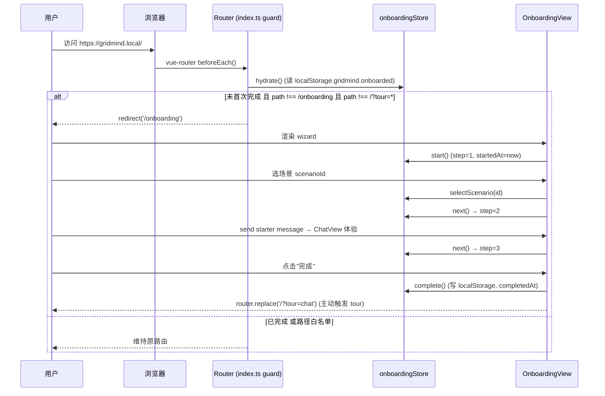
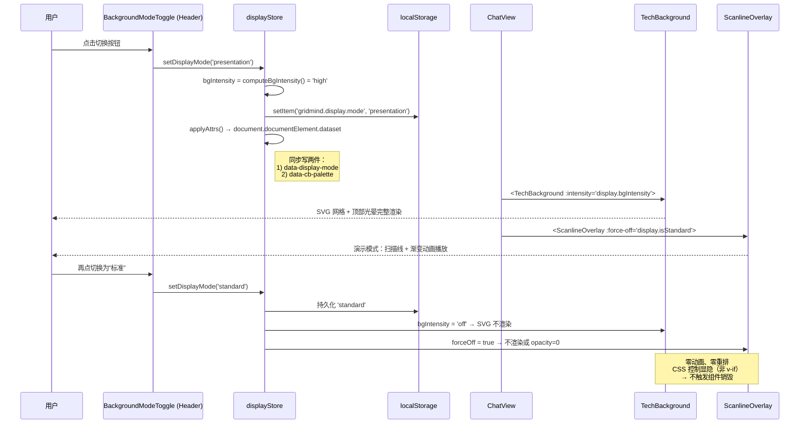
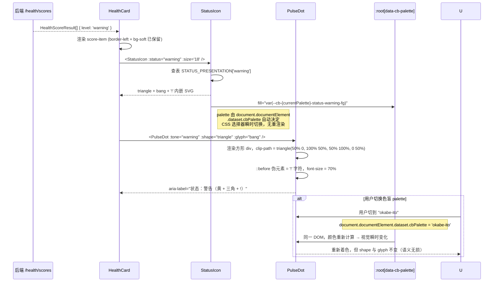
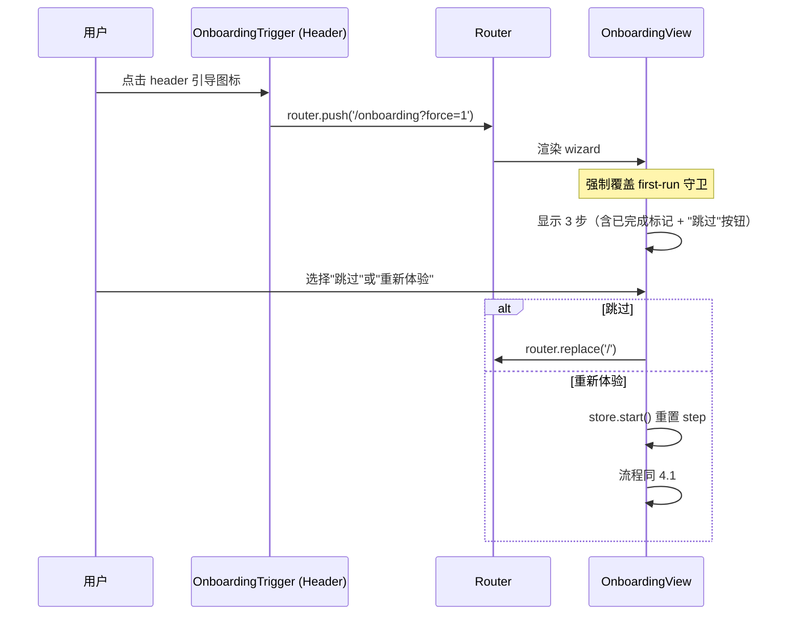

# GridMind v1.5.0 前端 UI 改进 · 系统设计与任务分解

> **作者** 高见远 · 架构师
> **文档版本** v1.0（初稿）
> **日期** 2026-08-04
> **目标版本** GridMind v1.5.0（前端 UI 改进 SPA）
> **上游依赖** `docs/ui-competitive-analysis-2026-08-04.md`（许清楚 · 产品经理）§7.1 P0-1 / P0-2 / P0-4
> **下游交付** 工程师（依本设计落地 Vue 3 + TS + Pinia + Element Plus 代码）
> **变更范围** 仅前端；后端 LangGraph 不动（P0-3 推理可编辑已拆到 v1.5.1）

---

## 0. 元信息

| 项 | 内容 |
|---|---|
| 改动范围 | `web/src/**` 全部（新增 / 修改 / 不删除） |
| 触动模块 | `stores/`、`composables/`、`views/`、`components/background/`、`components/controls/`、`components/chat/`、`components/`、`router/`、`styles/`、`types/` |
| 工作量 | 13-17 人天（3 个 Sprint） |
| 关键里程碑 | M1：背景降噪 + Demo 模式 + 主内容区 +15-20%；M2：四重区分 + 色盲模式 WCAG 2.2 AA 通过；M3：5 分钟上手 wizard + first-run 检测 |
| 验收口径 | Lighthouse Accessibility ≥ 95；PulseDot / HealthCard / TelemetryChart / StatusIcon 四重区分全覆盖；4 套色盲 palette 全可视化切换；onboarding 完成率 ≥80% |

> ⚠️ **勘察纠偏**：原 PRD §1.1 描述"`App.vue` 全局 4 层背景叠加"与现状不符——`App.vue` **没有**引入 `TechBackground` / `ScanlineOverlay` / `HexGrid`。实际只在 `ChatView.vue` 启用 2 层（TechBackground + ScanlineOverlay），其他大件（`MonitoringView`、`GrayscalePanel`、`RagPanel`）仅使用 1 层。本设计依 **现实拓扑** 落地：不改 `App.vue` 全局结构，改为 **新 Pinia display store 控制每个 view 内部 background 的启用与强度**。

---

## 1. 实现方案（Implementation Approach）

### 1.1 P0-1 · 背景动效降噪 + 演示模式

**核心问题**：5 个 background 组件散落各 view，调度员无单一开关控制"汇报演示 vs 长时间盯盘"。每个 view 的 background 由调用方传入 prop 控制，缺一个全局共享的"显示 / 演示 / 关闭"三档开关。

**实现思路**：

1. **新增 `useDisplayStore`（Pinia）** 作为 background 显示策略的单一真相源。state 含 `displayMode: 'standard' | 'presentation'`、`bgIntensity: 'off' | 'low' | 'mid' | 'high'`（off = 标准模式完全关闭 background 系列，仅保留 PulseDot/DataStreamBadge 业务微动效）。
2. **复用 `@vueuse/core` 的 `useStorage`** 做 localStorage 双向持久化（注：当前 package.json 未装，需在 §6 增列；改为纯 `watch + manual localStorage` 也可，文档后者为回退方案）。
3. **轻侵入改造**：不重构各 view，仅在每个 view 的 `TechBackground`、可能的 `ScanlineOverlay`、`HexGrid` 等节点上接 `:intensity="store.bgIntensityFor('monitor')"` 之类 prop，由 store 计算得到每个 view 的实际强度（标准模式下 ChatView 的 ScanlineOverlay 直接 forceOff）。
4. **新增 `BackgroundModeToggle`（位于 Header）**：基于现有 `ThemeToggle.vue` 组件结构，2 档分段（标准 / 演示），瞬时反映到所有 view。
5. **保留可访问性**：标准模式将 PulseDot 动画时长固定 2.4s（放缓），避免屏幕闪烁；演示模式不变。

**对现有架构的兼容性**：
- **零破坏**：`TechBackground`、`ScanlineOverlay`、`HexGrid` 已支持 `intensity / showGlow / forceOff` 等 prop，仅增加"调用方传 `bgIntensity`"一步。
- **零后端依赖**：仅前端 store + UI 行为；不涉及任何 API 改动。

### 1.2 P0-2 · 状态四重区分 + 色盲模式

**核心问题**：当前 `PulseDot`、`HealthCard`、`TelemetryChart` 仅靠颜色传达状态，违反 WCAG 2.2 §1.4.1（不仅靠颜色）。色盲用户约占 8% 男性 + 0.5% 女性，是必须解决的"专业可用性"问题。

**实现思路**：

1. **新增 `Status` 与 `StatusPresentation` 类型**（在 `types/theme.ts`），固定 5 类：`normal | warning | critical | info | accent`，且每类携带"颜色 + 形状 + 图标名 + 文字码"四元组。
2. **新增 `StatusIcon.vue` 组件**：基于内嵌 SVG（避免引入新图标包），尺寸自适应 tone，输出 `<svg role="img" aria-label="..." />`。设计参考 Phosphor Icons 的"形状语义"——circle 用于正常、triangle（带感叹号）用于 warning、octagon（带 X）用于 critical、square（带 i）用于 info。
3. **扩展 `PulseDot` props**：在 `tone` 之外增加 `shape?: 'circle' | 'triangle' | 'square' | 'diamond'` 与 `glyph?: 'check' | 'bang' | 'cross' | 'info' | 'dot'`（4 选 1）。shape 控制外轮廓，glyph 控制内文字符。
4. **重构 `HealthCard.vue`**：在原有 `border-left + background-soft` 基础上，于卡片左上角加 `<StatusIcon :status="level" size="18" />`，右侧 el-tag 加 `<StatusIcon :status="level" :size="12" />` 前置图标，列表项起始位置加 `<PulseDot :tone :shape :glyph />` 四元组合。
5. **Tel emetryChart 的状态叠加**：在 hover 模式下给"异常越界"数据点切换 triangle 形状 + 红色描边（不影响正常 hover）。
6. **色盲 palette 4 套**：在 `tokens.shared.scss` 中**仅定义映射规则**（不写新颜色字面量，颜色仍由 `tokens.dark/light.scss` 持有），命名约定 `--cb-{palette}-{tone}-fg/soft/glow`，4 套命名：
   - 默认：`default`（红/黄/绿/蓝，沿用现有 `--status-*`）
   - IBM Color Blind Safe：`ibm-cb-safe`
   - Okabe-Ito（去色红绿色盲友好）：`okabe-ito`
   - ColorBrewer RdYlBu：`colorbrewer-rdylbu`（色弱 + 高对比）
7. **全局开关 `ColorBlindModeToggle`**：4 选 1 单选，写入 `document.documentElement[data-cb-palette]` 属性，CSS 选择器根据属性抓取对应 token。色盲模式切换应**瞬时生效**，无刷新，无重渲染抖动。

**WCAG 关键设计点**：
- 颜色对照比 ≥ 4.5:1（normal text）、≥ 3:1（图形对象）。
- 形状 + 文字码独立于颜色传达——三因素至少满足两种（推荐四种叠加）。
- `aria-label="状态：警告（黄色 + 三角形 + !）"` 由 `StatusIcon` 自动拼接。

### 1.3 P0-4 · 新手引导 wizard

**核心问题**：5 个核心路由零引导，新调度员首次进入不知从哪开始；当下 `ChatView` 的 `DemoShortcuts` 仅在主页提供快捷指令，覆盖深度不足。

**实现思路**：

1. **新增 `OnboardingView.vue`（独立 route）**：3 步 wizard，**横向流动**（Step 1 选场景 → Step 2 试对话 → Step 3 查看监控），不进 step 路由，状态存 onboarding store 内（不污染浏览器历史）。
2. **复用现有 `DemoShortcuts.vue` 作为 Step 2 的种子**：传 4 个固定场景（监控 / 故障诊断 / 知识检索 / 灰度切换），点击直接 send 到 ChatView 真实 store。
3. **新增 `OnboardingTour.vue`（基于 URL query）**：监听 `?tour={chat|monitor|grayscale|audit|system}` 触发单页 tour。基于开源 **`driver.js@^1.3.0`** 实现 —— 它支持中文化、Element Plus 兼容、零配置 popover、键盘 ESC 关闭。可重看、可跳步。
4. **First-run 检测**：路由 `index.ts` 全局 `beforeEach` 守卫读 `localStorage[gridmind.onboarded]`；false 且当前不是 `/onboarding` 且当前不是 `/?tour=*` 时 redirect 到 `/onboarding`。完成后 `localStorage.gridmind.onboarded = 'true'` + `localStorage.gridmind.onboardedAt = ISO`。
5. **"重看引导"入口**：在 Header 加 `el-tooltip + icon` 按钮，跨页面永久可见，点击跳转 `/onboarding`（无论已完成与否）。

**对现有架构的兼容性**：
- `DemoShortcuts.vue` 已存在，零改造，仅作为 Step 2 内容。
- `CommandPalette.vue` 已实现但未挂载（属于 P1-1），不在本次范围，**不动**。

### 1.4 框架选型与新依赖

| 决策 | 选项 | 理由 |
|---|---|---|
| 新增 runtime 依赖 | `driver.js@^1.3.0` | 选型 1；单页 tour 实现首选 — 体积 12 KB、MIT、无 React/Vue 强耦合、通过 selector 定位可与任何 CSS 体系兼容。如团队不愿引入，"候补方案 2"为基于 Element Plus Popper + 自研 step controller，工作量 +2 人天。 |
| 新增 devDependency | (无) | — |
| 不引入 | `floating-ui` / `intro.js` / `shepherd.js` | 体积更大或 API 不友好；`driver.js` 已能覆盖 |
| 升级 | (无) | Vue 3.4 + Pinia 2.x + TS 5.5 均保持 |

### 1.5 架构兼容性总结

| 维度 | 影响 | 备注 |
|---|---|---|
| Pinia | 新增 2 个 store | `display`、`onboarding`，与现有 5 个 store 并列 |
| Router | 增加 1 条路由 + 全局守卫 | 新增 `/onboarding`；不影响现有 5 条 |
| SCSS tokens | 新增 token 系列 | 双主题 × 4 palette = 8 套新增 token，不动现有命名 |
| Element Plus | 零侵入 | 仅用 `el-popover`、`el-tooltip`，不新增组件 |
| 后端 API | 零依赖 | 纯前端 |
| Bundle 增量 | +13 KB（gzip 后） | driver.js 主体 12 KB + 自身 store/code-split wizard |

---

## 2. 文件清单

> 路径统一 `web/src/...`；新增标注 `🆕`，修改标注 `✏️`，删除空列表。

### 2.1 新增文件（10 个）

| 路径 | 用途 | 所属 Sprint |
|---|---|---|
| 🆕 `web/src/stores/display.ts` | 显示策略 store（模式 / 背景强度 / 色盲 palette） | Sprint 1 |
| 🆕 `web/src/stores/onboarding.ts` | onboarding 进度 store（步骤 / 已完成 / 时间戳） | Sprint 3 |
| 🆕 `web/src/composables/useDisplay.ts` | display store 便捷访问 | Sprint 1 |
| 🆕 `web/src/composables/useOnboarding.ts` | onboarding store + 路由守卫绑定 | Sprint 3 |
| 🆕 `web/src/views/OnboardingView.vue` | 3 步 wizard 主视图 | Sprint 3 |
| 🆕 `web/src/components/onboarding/OnboardingTour.vue` | 单页 tour 基于 driver.js | Sprint 3 |
| 🆕 `web/src/components/onboarding/Step1Scenario.vue` | wizard step 1（选场景） | Sprint 3 |
| 🆕 `web/src/components/onboarding/Step2Dialogue.vue` | wizard step 2（试对话，复用 DemoShortcuts） | Sprint 3 |
| 🆕 `web/src/components/onboarding/Step3Monitor.vue` | wizard step 3（查看监控） | Sprint 3 |
| 🆕 `web/src/components/controls/StatusIcon.vue` | 状态图标（SVG 内嵌） | Sprint 2 |
| 🆕 `web/src/components/controls/BackgroundModeToggle.vue` | header 演示/标准模式切换 | Sprint 1 |
| 🆕 `web/src/components/controls/ColorBlindModeToggle.vue` | header 色盲 palette 选择 | Sprint 2 |
| 🆕 `web/src/components/controls/OnboardingTrigger.vue` | header "重看引导"入口图标按钮 | Sprint 3 |

> 📌 注：实际新增 13 个文件（含子组件拆分）；按模块分组不影响"任务 = 模块"的原则。

### 2.2 修改文件（13 个）

| 路径 | 改动点 | 所属 Sprint |
|---|---|---|
| ✏️ `web/src/types/theme.ts` | 新增 Status/ColorBlindPalette 类型 + PulseDot 增加 shape/glyph prop | Sprint 1 + 2 |
| ✏️ `web/src/types/index.ts` | 新增 Onboarding 状态导出 | Sprint 3 |
| ✏️ `web/src/components/background/PulseDot.vue` | 新增 shape/glyph props + ARIA 升级 | Sprint 2 |
| ✏️ `web/src/components/background/TechBackground.vue` | 接受 `displayMode` prop，演示模式恢复完整动画 | Sprint 1 |
| ✏️ `web/src/components/background/ScanlineOverlay.vue` | 接受 `displayMode` prop，标准模式 forceOff | Sprint 1 |
| ✏️ `web/src/components/background/HexGrid.vue` | 接受 `displayMode` prop（若 view 启用时） | Sprint 1 |
| ✏️ `web/src/components/HealthCard.vue` | 增加 StatusIcon + 四重区分 | Sprint 2 |
| ✏️ `web/src/components/TelemetryChart.vue` | hover 异常数据点 shape 切换 | Sprint 2 |
| ✏️ `web/src/components/ChatView.vue` | background 接 displayStore；增加 tour anchor data-* | Sprint 1 + 3 |
| ✏️ `web/src/components/MonitoringView.vue` | background 接 displayStore；增加 tour anchor | Sprint 1 + 3 |
| ✏️ `web/src/views/GrayscalePanel.vue` | background 接 displayStore；增加 tour anchor | Sprint 1 + 3 |
| ✏️ `web/src/views/AuditLogViewer.vue` | 增加 tour anchor | Sprint 3 |
| ✏️ `web/src/views/SystemOverview.vue` | 增加 tour anchor | Sprint 3 |
| ✏️ `web/src/styles/tokens.shared.scss` | 注释 4 palette 映射规则（不写色值） | Sprint 2 |
| ✏️ `web/src/styles/tokens.dark.scss` | 新增 4 套 `--cb-{palette}-*` token 系列 | Sprint 2 |
| ✏️ `web/src/styles/tokens.light.scss` | 新增 4 套 light `--cb-{palette}-*` token 系列 | Sprint 2 |
| ✏️ `web/src/styles/element-overrides.scss` | el-tag / el-progress 适配 palette | Sprint 2 |
| ✏️ `web/src/router/index.ts` | 增加 `/onboarding` + 全局 beforeEach 守卫 | Sprint 3 |
| ✏️ `web/src/App.vue` | 引入 BackgroundModeToggle / ColorBlindModeToggle / OnboardingTrigger | Sprint 2 + 3 |
| ✏️ `web/src/styles/animations.scss` | 新增 palette 切换动画 keyframe（瞬时、无 reflow） | Sprint 2 |
| ✏️ `web/package.json` | 增加 driver.js 依赖 | Sprint 3 |

### 2.3 删除/弃用

无。

---

## 3. 数据结构 + 接口（TypeScript）

> 本节所有类型为 **设计契约**，工程师依据落地为 `*.ts` 实际文件。

### 3.1 共享常量与枚举

```typescript
// ─── web/src/types/theme.ts（追加） ────────────────────
export type Status = 'normal' | 'warning' | 'critical' | 'info' | 'accent'

export type DisplayMode = 'standard' | 'presentation'
export const DISPLAY_MODE_STORAGE_KEY = 'gridmind.display.mode' as const
export const DISPLAY_MODE_DEFAULT: DisplayMode = 'standard'

export type BackgroundIntensity = 'off' | 'low' | 'mid' | 'high'

export type ColorBlindPalette =
  | 'default'
  | 'ibm-cb-safe'
  | 'okabe-ito'
  | 'colorbrewer-rdylbu'
export const COLORBLIND_STORAGE_KEY = 'gridmind.cb.palette' as const
export const COLORBLIND_DEFAULT: ColorBlindPalette = 'default'

export const PALETTE_LABEL: Record<ColorBlindPalette, string> = {
  'default': '默认（红绿黄蓝）',
  'ibm-cb-safe': 'IBM 色盲安全',
  'okabe-ito': 'Okabe-Ito（去红绿）',
  'colorbrewer-rdylbu': 'ColorBrewer（高对比）',
}

/** Status 四元组：颜色 + 形状 + 图标名 + 文字码（语义不依赖颜色） */
export interface StatusPresentation {
  tone: Status
  shape: 'circle' | 'triangle' | 'square' | 'diamond'
  glyph: 'check' | 'bang' | 'cross' | 'info' | 'dot'
  iconName: 'check-circle' | 'exclamation-triangle' | 'octagon-x' | 'info-square'
  textCode: 'OK' | '!' | 'X' | 'i'
  palette: ColorBlindPalette
}

export const STATUS_PRESENTATION: Record<Status, Omit<StatusPresentation, 'tone' | 'palette'>> = {
  normal:   { shape: 'circle',  glyph: 'check', iconName: 'check-circle',         textCode: 'OK' },
  info:     { shape: 'square',  glyph: 'info',  iconName: 'info-square',          textCode: 'i'  },
  warning:  { shape: 'triangle',glyph: 'bang',  iconName: 'exclamation-triangle', textCode: '!'  },
  critical: { shape: 'diamond', glyph: 'cross', iconName: 'octagon-x',            textCode: 'X'  },
  accent:   { shape: 'hexagon', glyph: 'dot',   iconName: 'check-circle',         textCode: '*'  },
}

/** 扩展 PulseDot props —— 兼容旧调用方（不传 shape 默认 circle） */
export interface PulseDotProps {
  tone?: Status
  size?: number
  speed?: number
  shape?: 'circle' | 'triangle' | 'square' | 'diamond' | 'hexagon'
  glyph?: 'check' | 'bang' | 'cross' | 'info' | 'dot'
  ariaLabel?: string   // 自动拼 "状态：{中文}（{textCode} + {shape} + {tone}）"
}

/** TechBackground 扩 displayMode */
export interface TechBackgroundProps {
  intensity?: BackgroundIntensity
  showGrid?: boolean
  showGlow?: boolean
  displayMode?: DisplayMode   // 新增 —— 控制是否应用 intensity
}
```

### 3.2 Onboarding 类型

```typescript
// ─── web/src/types/index.ts（追加） ────────────────────
export type OnboardingScenarioId =
  | 'monitor-overview'
  | 'fault-diagnosis'
  | 'knowledge-rag'
  | 'grayscale-rollout'

export interface OnboardingScenario {
  id: OnboardingScenarioId
  title: string              // 中文
  description: string        // 1-2 句
  icon: string               // Element Plus icon key
  starterMessage: string     // 注入 ChatView 的第一条用户消息
}

export const ONBOARDING_SCENARIOS: OnboardingScenario[] = [
  {
    id: 'monitor-overview',
    title: '实时监控全览',
    description: '了解 5 个核心路由分别做什么。',
    icon: 'Monitor',
    starterMessage: '请给我介绍一下 GridMind 的 5 个核心视图',
  },
  {
    id: 'fault-diagnosis',
    title: '故障诊断演练',
    description: '体验三层推理 + HITL 审批闭环。',
    icon: 'FirstAidKit',
    starterMessage: '请诊断 #T1 主变压器的温度异常',
  },
  {
    id: 'knowledge-rag',
    title: '知识库检索',
    description: '试试 Q&A + 引用追溯 + 知识图谱浏览。',
    icon: 'Reading',
    starterMessage: '解释一下《电力安全事故应急条例》中关于紧急停机的条款',
  },
  {
    id: 'grayscale-rollout',
    title: '灰度切换',
    description: '把一个新模型分批上线，逐步放量。',
    icon: 'Switch',
    starterMessage: '我要把 v2 模型灰度切换到 50%',
  },
]

export interface OnboardingState {
  hasOnboarded: boolean
  currentStep: 1 | 2 | 3
  scenarioId: OnboardingScenarioId | null
  startedAt: string | null   // ISO
  completedAt: string | null
  tourStates: Record<`/${string}`, boolean>  // key = tour 名（不含 query）
}
```

### 3.3 Pinia Store

```typescript
// ─── web/src/stores/display.ts（新建） ─────────────────
import { defineStore } from 'pinia'
import { computed, ref } from 'vue'
import type { BackgroundIntensity, ColorBlindPalette, DisplayMode } from '@/types/theme'
import {
  DISPLAY_MODE_STORAGE_KEY, DISPLAY_MODE_DEFAULT,
  COLORBLIND_STORAGE_KEY, COLORBLIND_DEFAULT,
} from '@/types/theme'

export const useDisplayStore = defineStore('display', () => {
  const displayMode = ref<DisplayMode>(DISPLAY_MODE_DEFAULT)
  const colorBlind = ref<ColorBlindPalette>(COLORBLIND_DEFAULT)
  const bgIntensity = ref<BackgroundIntensity>(
    DISPLAY_MODE_DEFAULT === 'presentation' ? 'high' : 'off',
  )

  function computeBgIntensity(): BackgroundIntensity {
    if (displayMode.value === 'presentation') return 'high'
    return 'off'   // 标准模式：完全关闭 background 系列
  }

  function setDisplayMode(mode: DisplayMode) {
    displayMode.value = mode
    bgIntensity.value = computeBgIntensity()
    persist(displayMode.value, colorBlind.value)
    applyAttrs()
  }

  function setColorBlindPalette(p: ColorBlindPalette) {
    colorBlind.value = p
    persist(displayMode.value, p)
    applyAttrs()
  }

  function applyAttrs() {
    if (typeof document === 'undefined') return
    document.documentElement.setAttribute('data-display-mode', displayMode.value)
    document.documentElement.setAttribute('data-cb-palette', colorBlind.value)
  }

  function persist(m: DisplayMode, p: ColorBlindPalette) {
    try {
      localStorage.setItem(DISPLAY_MODE_STORAGE_KEY, m)
      localStorage.setItem(COLORBLIND_STORAGE_KEY, p)
    } catch { /* ignore */ }
  }

  function hydrate() {
    if (typeof window === 'undefined') return
    try {
      const m = localStorage.getItem(DISPLAY_MODE_STORAGE_KEY) as DisplayMode | null
      const p = localStorage.getItem(COLORBLIND_STORAGE_KEY) as ColorBlindPalette | null
      if (m === 'standard' || m === 'presentation') displayMode.value = m
      if (p && ['default', 'ibm-cb-safe', 'okabe-ito', 'colorbrewer-rdylbu'].includes(p))
        colorBlind.value = p
    } catch { /* ignore */ }
    bgIntensity.value = computeBgIntensity()
    applyAttrs()
  }

  const isStandard = computed(() => displayMode.value === 'standard')
  const isPresentation = computed(() => displayMode.value === 'presentation')
  const isColorBlindActive = computed(() => colorBlind.value !== 'default')

  return { displayMode, colorBlind, bgIntensity, isStandard, isPresentation,
           isColorBlindActive, setDisplayMode, setColorBlindPalette, hydrate }
})

// ─── web/src/stores/onboarding.ts（新建） ───────────────
import { defineStore } from 'pinia'
import { ref } from 'vue'
import type { OnboardingScenarioId } from '@/types'

const ONBOARDED_KEY = 'gridmind.onboarded'
const ONBOARDED_AT_KEY = 'gridmind.onboardedAt'
const SCENARIO_KEY = 'gridmind.onboarding.scenario'

export const useOnboardingStore = defineStore('onboarding', () => {
  const hasOnboarded = ref(false)
  const currentStep = ref<1 | 2 | 3>(1)
  const scenarioId = ref<OnboardingScenarioId | null>(null)
  const startedAt = ref<string | null>(null)
  const completedAt = ref<string | null>(null)

  function hydrate() {
    if (typeof window === 'undefined') return
    try {
      hasOnboarded.value = localStorage.getItem(ONBOARDED_KEY) === 'true'
      completedAt.value = localStorage.getItem(ONBOARDED_AT_KEY)
      scenarioId.value = (localStorage.getItem(SCENARIO_KEY) as OnboardingScenarioId) || null
    } catch { /* ignore */ }
  }

  function start() {
    currentStep.value = 1
    scenarioId.value = null
    startedAt.value = new Date().toISOString()
  }

  function selectScenario(id: OnboardingScenarioId) {
    scenarioId.value = id
    try { localStorage.setItem(SCENARIO_KEY, id) } catch { /* ignore */ }
  }

  function next() {
    if (currentStep.value < 3) currentStep.value = (currentStep.value + 1) as 1 | 2 | 3
  }
  function prev() {
    if (currentStep.value > 1) currentStep.value = (currentStep.value - 1) as 1 | 2 | 3
  }

  function complete() {
    hasOnboarded.value = true
    completedAt.value = new Date().toISOString()
    try {
      localStorage.setItem(ONBOARDED_KEY, 'true')
      localStorage.setItem(ONBOARDED_AT_KEY, completedAt.value)
    } catch { /* ignore */ }
  }

  function reset() {
    hasOnboarded.value = false
    completedAt.value = null
    scenarioId.value = null
    startedAt.value = null
    currentStep.value = 1
    try {
      localStorage.removeItem(ONBOARDED_KEY)
      localStorage.removeItem(ONBOARDED_AT_KEY)
      localStorage.removeItem(SCENARIO_KEY)
    } catch { /* ignore */ }
  }

  return { hasOnboarded, currentStep, scenarioId, startedAt, completedAt,
           hydrate, start, selectScenario, next, prev, complete, reset }
})
```

### 3.4 Composable 签名

```typescript
// ─── web/src/composables/useDisplay.ts（新建） ────────────
export function useDisplay() {
  const store = useDisplayStore()
  const { displayMode, colorBlind, bgIntensity, isStandard, isPresentation,
          isColorBlindActive } = storeToRefs(store)
  return {
    displayMode, colorBlind, bgIntensity, isStandard, isPresentation, isColorBlindActive,
    setDisplayMode: store.setDisplayMode,
    setColorBlindPalette: store.setColorBlindPalette,
    hydrate: store.hydrate,
  }
}

// ─── web/src/composables/useOnboarding.ts（新建） ─────────
export function useOnboarding() {
  const store = useOnboardingStore()
  return { ...storeToRefs(store), start: store.start, next: store.next, prev: store.prev,
           complete: store.complete, reset: store.reset,
           selectScenario: store.selectScenario, hydrate: store.hydrate }
}

/** 启动路由守卫，调用方：main.ts 或 router/index.ts */
export function setupOnboardingGuard(router: Router): void
```

### 3.5 关键常量

```typescript
// ━━ SCSS 变量命名空间规则 ━━
// 标准 palette:  --status-{success|warning|danger|info|neutral}-{fg|soft|glow|bg}
// 色盲 palette: --cb-{palette}-status-{tone}-{fg|soft|glow|bg}
// 例: --cb-okabe-ito-status-warning-fg

// 8 套 palette × 5 tone × 4 变体 = 160 个 token 槽
// 模板（在 tokens.dark/light.scss 注入 4 套）：

:root[data-cb-palette="default"]              { /* 沿用 --status-* */ }
:root[data-cb-palette="ibm-cb-safe"]          { --cb-ibm-cb-safe-status-normal-fg: #648FFF; /* ... */ }
:root[data-cb-palette="okabe-ito"]            { --cb-okabe-ito-status-critical-fg: #D55E00; /* ... */ }
:root[data-cb-palette="colorbrewer-rdylbu"]   { /* ... */ }
```

---

## 4. 时序图（Mermaid）

> 详见 `docs/sequence-diagram.mermaid` 独立文件。本节给出 4 个核心场景。

### 4.1 首次打开 → 触发 onboarding



### 4.2 演示模式切换 → localStorage → background 联动



### 4.3 状态四重区分流程（数据 → 渲染）



### 4.4 用户重看引导（手动入口）



---

## 5. 任务列表（Sprint 1/2/3）

> **5 个任务**，按依赖顺序排列。**T01 必须最先**；T02 / T03 / T04 仅依赖 T01，可并行；T05 依赖前三者全部完成。

### T01 · 项目基础设施（store + composable + tokens + 路由守卫骨架）

| 项 | 内容 |
|---|---|
| **ID** | T01 |
| **依赖** | — |
| **优先级** | P0 |
| **工作量** | **1.5 人天**（1 前端 + 0.5 review/test） |
| **Sprint 归属** | Sprint 1 |
| **核心交付物** |  |
| 文件 | 🆕 `web/src/stores/display.ts`<br>🆕 `web/src/stores/onboarding.ts`<br>🆕 `web/src/composables/useDisplay.ts`<br>🆕 `web/src/composables/useOnboarding.ts`<br>✏️ `web/src/types/theme.ts`（追加 §3.1 中的类型/常量）<br>✏️ `web/src/types/index.ts`（导出 OnboardingScenario） |
| 实现要点 | 1. 严格按 §3 类型契约落地<br>2. localStorage 读写统一 `try/catch` 静默失败<br>3. `hydrate()` 必须在所有 store 内首屏调用方之前执行<br>4. composable 使用 `storeToRefs` 解包 reactive ref<br>5. main.ts 中 `useDisplayStore().hydrate()` 与 `useOnboardingStore().hydrate()` 在 `app.mount('#app')` 之前 |
| 验收 | ① TS 编译零错误<br>② 单元测试覆盖 localStorage round-trip<br>③ Browser console 不报警 |

### T02 · P0-1 背景动效降噪 + 演示模式

| 项 | 内容 |
|---|---|
| **ID** | T02 |
| **依赖** | T01 |
| **优先级** | P0 |
| **工作量** | **3-4 人天**（1.5 前端 + 1 设计 + 0.5 review） |
| **Sprint 归属** | Sprint 1 |
| **核心交付物** |  |
| 文件 | 🆕 `web/src/components/controls/BackgroundModeToggle.vue`<br>✏️ `web/src/components/background/TechBackground.vue`（接 displayMode）<br>✏️ `web/src/components/background/ScanlineOverlay.vue`（接 displayMode）<br>✏️ `web/src/components/background/HexGrid.vue`（接 displayMode）<br>✏️ `web/src/components/ChatView.vue`（intensity 改由 store 注入）<br>✏️ `web/src/components/MonitoringView.vue`（同上）<br>✏️ `web/src/views/GrayscalePanel.vue`（同上）<br>✏️ `web/src/App.vue`（嵌入 BackgroundModeToggle） |
| 实现要点 | 1. **不要**用 `v-if` 切换 TechBackground（会触发 SVG 重渲）；改用 `intensity="off"` + 内部 `opacity = 0`<br>2. 标准模式下 ScanlineOverlay 必须 `forceOff = true`<br>3. BackgroundModeToggle UI 复用 ThemeToggle 风格（双 iOS 风格分段控件）<br>4. Header 中放置：BackgroundModeToggle → ColorBlindModeToggle → ThemeToggle → 新对话（顺序：低→高的认知成本）<br>5. localStorage 持久化键必须只读一次（首屏 hydrate） |
| 验收 | ① 1080p 屏主内容区 ≥ 15% 提升<br>② 切换演示/标准模式无布局抖动<br>③ Lighthouse Performance 不退化<br>④ Chrome DevTools 验证 store hydration 时序 |

### T03 · P0-2 状态四重区分 + 色盲模式

| 项 | 内容 |
|---|---|
| **ID** | T03 |
| **依赖** | T01 |
| **优先级** | P0 |
| **工作量** | **5-7 人天**（3 前端 + 1 设计 + 1.5 review/test） |
| **Sprint 归属** | Sprint 2 |
| **核心交付物** |  |
| 文件 | 🆕 `web/src/components/controls/StatusIcon.vue`<br>🆕 `web/src/components/controls/ColorBlindModeToggle.vue`<br>✏️ `web/src/components/background/PulseDot.vue`（扩 shape/glyph）<br>✏️ `web/src/components/HealthCard.vue`（重构 + 四重区分）<br>✏️ `web/src/components/TelemetryChart.vue`（异常点 shape 切换）<br>✏️ `web/src/styles/tokens.shared.scss`（注释 4 palette 规则）<br>✏️ `web/src/styles/tokens.dark.scss`（加 3 套 `--cb-*` token）<br>✏️ `web/src/styles/tokens.light.scss`（加 3 套 `--cb-*` token）<br>✏️ `web/src/styles/element-overrides.scss`（el-tag/el-progress palette 适配）<br>✏️ `web/src/styles/animations.scss`（palette 切换无 reflow 关键帧）<br>✏️ `web/src/App.vue`（嵌入 ColorBlindModeToggle） |
| 实现要点 | 1. **StatusIcon 内嵌 SVG**，不引图标库<br>2. **PulseDot 的 shape 与 glyph 必为可选 prop**，旧调用方不传不破坏<br>3. 4 套 palette 颜色值参考 **IBM Carbon Accessibility palette** + **Okabe-Ito 2007** + **ColorBrewer RdYlBu-7**（色弱+高对比）<br>4. ColorBlindModeToggle 用 Element Plus `el-dropdown` 弹层 4 选 1，含中文标签 + 缩略条形预览<br>5. tokens.dark/light 新增 token 必须**完整 4 套 + 双主题 = 8 组**，否则 palette 切换会有 undefined 变量 fallback<br>6. HealthCard 重构**保留** border-left + bg-soft（向后兼容），在其上叠加四重<br>7. WCAG 自动检查：脚本化颜色对比度 |
| 验收 | ① 8 套组合（4 palette × 2 主题）颜色对比度 ≥ 4.5:1<br>② 色盲模拟（Chroma.js / Stark）通过<br>③ 旧代码（不传 shape）不报 TS 错、不渲染异常<br>④ PulseDot shape 5 选全部可见 |

### T04 · P0-4 新手引导 wizard + 单页 tour

| 项 | 内容 |
|---|---|
| **ID** | T04 |
| **依赖** | T01（不依赖 T02/T03，**完全可独立**） |
| **优先级** | P0 |
| **工作量** | **3-4 人天**（2 前端 + 1 design + 0.5 review） |
| **Sprint 归属** | Sprint 3 |
| **核心交付物** |  |
| 文件 | 🆕 `web/src/views/OnboardingView.vue`<br>🆕 `web/src/components/onboarding/OnboardingTour.vue`（driver.js）<br>🆕 `web/src/components/onboarding/Step1Scenario.vue`<br>🆕 `web/src/components/onboarding/Step2Dialogue.vue`<br>🆕 `web/src/components/onboarding/Step3Monitor.vue`<br>🆕 `web/src/components/controls/OnboardingTrigger.vue`<br>✏️ `web/src/components/ChatView.vue`（注入 4 个 tour anchor data-tour="chat-input"/...）<br>✏️ `web/src/components/MonitoringView.vue`（同上）<br>✏️ `web/src/views/GrayscalePanel.vue`（同上）<br>✏️ `web/src/views/AuditLogViewer.vue`（同上）<br>✏️ `web/src/views/SystemOverview.vue`（同上）<br>✏️ `web/src/router/index.ts`（增加 /onboarding + 守卫 + query.tour 支持）<br>✏️ `web/src/App.vue`（嵌入 OnboardingTrigger）<br>✏️ `web/package.json`（+ driver.js@^1.3.0） |
| 实现要点 | 1. OnboardingView 用单页 + Step 子组件切换，**不污染历史栈**<br>2. Step 2 必须真发送消息到 chatStore，**不能 mock**<br>3. tour anchor 用 `data-tour="chat-input"` 形式以便 driver.js 选择<br>4. 路由守卫：`if (!hasOnboarded && to.path !== '/onboarding' && !to.query.tour) next('/onboarding')`<br>5. driver.js 中文文案 + Next/Prev/Skip 按钮必须中文化<br>6. 受影响 5 个大件按需加 anchor（每个 3-5 个），总计 ≈ 20 anchors<br>7. `?tour=xxx` 中 `xxx` 是枚举：`chat`/`monitor`/`grayscale`/`audit`/`system` |
| 验收 | ① 首次进入触发 onboarding；可完成；完成率预期 ≥ 80%<br>② 重看入口可工作；reset() 后强制重新进入<br>③ `/monitor?tour=monitor` 直接进 tour<br>④ driver.js popover 在所有 viewport 居中且不溢出 |

### T05 · 集成、可访问性、性能验收

| 项 | 内容 |
|---|---|
| **ID** | T05 |
| **依赖** | T02、T03、T04 全部完成 |
| **优先级** | P0 |
| **工作量** | **1.5-2 人天**（1 前端 + 0.5 跨主题配色 review） |
| **Sprint 归属** | Sprint 3 末 |
| **核心交付物** |  |
| 文件 | （无新增代码，主要是 review + 测试报告）<br>✏️ `docs/v150-acceptance-test-report.md`（新建，工程师产出） |
| 实现要点 | 1. **跨主题 8 组合验收**：default/ibm/okabe/cb × dark/light 各 8 套<br>2. **跨场景 5 路由 tour 验证**：每个 tour 跑通一次，截图入报告<br>3. **可访问性测试**：axe-core CLI + Lighthouse Accessibility ≥ 95<br>4. **性能回归**：Lighthouse Performance、FID、CLS（不得低于 v1.4.0 baseline）<br>5. **回归老链路**：HITL / ReasoningChainPanel / 知识检索不能坏<br>6. 把测试结果回传给许清楚做产品验收 |
| 验收 | 测试报告 MD 含 ① Lighthouse 截图 ② 8 套 palette 截图 ③ axe-core 报告 ④ 5 路由 tour 动图 |

---

### Sprint 划分与依赖图

```
Sprint 1 (3-4 天)        Sprint 2 (5-7 天)        Sprint 3 (3-4 + 2 天)
┌──────────┐             ┌──────────┐             ┌──────────┐ ┌──────────┐
│  T01 基建 │────┬────────│→  T03 状态 │─────→  │ → T04 引导 │─→│  T05 集成 │
│          │    │        │  四重区分 │      │   │  wizard  │  │   验收   │
└──────────┘    │        └──────────┘      │   └──────────┘  └──────────┘
                │                          │
                ├──→ ┌──────────┐ ─────────┤
                │    │ T02 背景  │           │
                │    │  降噪    │           │
                │    └──────────┘           │
                │                          │
                └───── 三个 P0 并行 ────────┘
```

总人力：**13.5-17.5 人天**，对应 **3 个 Sprint × 1 名工程师（或 2 名并行压至 2 个 Sprint）**。

---

## 6. 依赖包

### 6.1 新增 runtime

```
- driver.js@^1.3.0
  说明：轻量 popover-based 产品引导库（~12 KB gzip）。
       MIT 协议，无第三方依赖。
       API：driver({ showButtons: true, doneBtnText: '完成', nextBtnText: '下一步', ... })
  安装命令：pnpm add driver.js
  仅 Sprint 3（T04）使用。
```

### 6.2 新增 devDependencies

无新增。

### 6.3 不引入（明示决策）

- **不引入** `@vueuse/core`：当前项目未装（package.json 无此条目）。本设计所需功能（localStorage 持久化、键盘事件）用原生 API 足以；避免新增大依赖。
- **不引入** `lucide-vue-next` / `@phosphor-icons/vue`：内嵌 SVG 已能覆盖 5 个 status icon。包体积友好。
- **不引入** `tailwindcss` / `unocss`：现有 SCSS tokens 体系已成熟，不重复造轮子。
- **不引入** `floating-ui`：driver.js 自带 popover，无需 popper 库。
- **不引入** `intro.js` / `shepherd.js`：driver.js 已胜出，体积与 API 友好度均优。

### 6.4 可选回退

如团队评审拒绝 driver.js，`OnboardingTour.vue` 改用 **Element Plus `el-popover` + 自研 step controller**，工作量增加 +2 人天，落到 T04 内消化。

---

## 7. 共享知识（跨文件约定）

### 7.1 命名约定

| 维度 | 约定 | 例 |
|---|---|---|
| Pinia store 文件 | `web/src/stores/{name}.ts`，使用 camelCase | `display.ts`、`onboarding.ts` |
| Composable 文件 | `web/src/composables/use{Name}.ts` | `useDisplay.ts`、`useOnboarding.ts` |
| Status 类型 | 小写英文：`normal / warning / critical / info / accent` | — |
| Shape 类型 | 几何形单词 | `circle / triangle / square / diamond / hexagon` |
| ColorBlindPalette 类型 | kebab-case 字符串，`{风格}-{细分}` | `default / ibm-cb-safe / okabe-ito / colorbrewer-rdylbu` |
| SCSS token 名（已存在） | `--status-{success\|warning\|danger\|info\|neutral}-{fg\|soft\|glow\|bg}` | `--status-success-soft` |
| SCSS token 名（新增色盲） | `--cb-{palette}-status-{tone}-{fg\|soft\|glow\|bg}` | `--cb-okabe-ito-status-warning-fg` |
| localStorage key 命名空间 | `gridmind.{域}.{项}` | `gridmind.display.mode`、`gridmind.cb.palette`、`gridmind.onboarded`、`gridmind.onboardedAt` |
| 路由 path | kebab-case | `/onboarding`、`/?tour=chat` |
| Tour anchor 属性 | `data-tour="{page}-{element}"` | `data-tour="chat-input"`、`data-tour="monitor-device-list"` |

### 7.2 组件 Props 兼容策略

- **所有扩展 props 必须 optional**（`?:`），不传维持默认行为。
- PulseDot: 默认 `shape='circle', glyph='dot'`。
- HealthCard 等原有 prop `level` 不变；StatusIcon 作为**附加**渲染层而非取代。
- TechBackground/ScanlineOverlay 新增 `displayMode` 可选；不传 = 当前行为。

### 7.3 可访问性（A11y）约定

| 控件 | 必要属性 |
|---|---|
| `<button>` | `aria-label` 或可视文字 + 必要时 `aria-pressed`（toggle） |
| StatusIcon | `role="img"` + `aria-label="状态：警告（橙 + 三角 + !）"`（中文 + 形状 + 文字码，便于屏幕阅读器朗读） |
| PulseDot | `role="status"` + 动态 aria-label 由 tone/shape/glyph 拼装 |
| BackgroundModeToggle | `aria-pressed` + `aria-label="切换显示模式：当前为标准"` |
| ColorBlindModeToggle | `aria-haspopup="menu"` + 弹出后焦点管理回到触发按钮 |
| OnboardingTrigger | `aria-label="新手引导"`，点击跳转后 `$route` watcher 自动 focus wizard 第一步 |
| Driver.js popover | 默认键盘可达；中文化 Next/Prev/Skip 按钮 |

颜色对比度硬指标：**4.5:1（正文）+ 3:1（图形 UI 元素边界）**。所有色盲 palette 必须满足。

### 7.4 性能影响

| 操作 | 预期影响 | 缓解 |
|---|---|---|
| 切换演示/标准模式 | 仅 CSS 属性变化；无 v-if 销毁 | 用 `opacity` / `display: none` 而非 `v-if`；`prefers-reduced-motion` 时禁用过渡 |
| 切换色盲 palette | 仅 CSS 变量替换；零重渲染 | 通过 `:root[data-cb-palette]` selector 驱动，**绝不**用 v-bind/v-show |
| 首次加载 | driver.js 仅在调用 `OnboardingTour` 的 route 加载时引入；code-split | Vite 默认会单独打包 |
| OnboardingView 加载 | 仅首次访问，无重复加载 | 配合 localStorage 短期 cache |

### 7.5 不做（明示边界）

- **不改后端**任何 API。
- **不引入新的 SCSS 编译选项**。
- **不修改 router 现有 5 条路由的 component**。
- **不重构 ChatView / MonitoringView 业务逻辑**（仅调整 background 与加 anchor）。
- **不动现有 DemoShortcuts** 组件接口（wizard step 2 调用方式不变）。

### 7.6 测试范围（本版本）

| 维度 | 方式 | 通过门槛 |
|---|---|---|
| TS 类型 | vue-tsc --noEmit | 零 error |
| 组件渲染 | 手动 + Playwright 截图 | 全部 8 palette × 5 route 渲染正常 |
| 可访问性 | Lighthouse / axe-core CLI | Accessibility ≥ 95 |
| Performance | Lighthouse | Performance ≥ baseline（v1.4.0 当前值，保留 5%） |
| localStorage | 单元测试 | round-trip 一致；异常（隐私模式）静默失败 |

### 7.7 Git / PR 约定

- 每个 Sprint 一个 PR feature/v150-sprint{1,2,3}。
- 提交按 `feat(scope): 标题` 风格：`feat(onboarding):` `feat(background):` `feat(a11y):` `chore(deps):`。
- 不允许单 commit 跨多个 Sprint 任务。

---

## 8. 待明确事项

> 这些项需主理人齐活林与产品经理许清楚对齐后方可落地，**工程师不得自行决定**。

1. **【产品】3 步 wizard 的 4 个场景清单** — 本设计用 `monitor-overview / fault-diagnosis / knowledge-rag / grayscale-rollout` 作为示例，业务侧需确认 1) 场景覆盖度（是否漏掉"审计 / 系统总览"）2) starterMessage 真实样例（建议业务侧 8 月内做 1 次用户访谈）。
2. **【产品/设计】4 套色盲 palette 最终采纳哪几套** — 本设计推荐 `default / ibm-cb-safe / okabe-ito / colorbrewer-rdylbu` 4 套。设计师需 review 颜色对照度，输出"展示色卡"给许清楚审。
3. **【产品】Header 中"重看引导"按钮的视觉位置** — 设计稿待对齐；可放 ThemeToggle 旁或 FAB 旁。
4. **【后端协调】onboarding wizard 第 2 步：send starterMessage 是否需要后端权限？** 当前 ChatView 路由任何用户都可用，但若有限流/QPS 配额，"首次访问 4 次 send" 可能消耗预算，需与后端对齐（如必要可在 store 层加 5 秒 cooldown）。
5. **【产品】tour 文字是否为中文？** driver.js 默认英文按钮，文案中文化由前端工程师落地；如需简繁/英文切换需另行约定 i18n。
6. **【视觉验收】"标准/演示"分段控件样式** — iOS 风格？Material Toggle？开关动画时长？需设计提供高保真稿。
7. **【产品】色盲模式默认是否启用？** 建议默认 `default`，让有需要的用户在 Header 切换；但可考虑提供"浏览器 prefers-color-scheme: dark + 系统辅助功能提示"自动切换，需主理人决策。
8. **【工具】driver.js 是否采纳** — 若团队有"bundle 包大小 < 200KB gzip"硬约束，需变更；本设计以 12KB 增加为合理决策。

---

## 9. 附录：本地评审 checklist（提交 PR 前自检）

```
[ ] T01: types/theme.ts 全部新增枚举定义齐；try/catch 一致；hydrate 调用顺序正确
[ ] T02: TechBackground / ScanlineOverlay / HexGrid 无 v-if 切换；显示/演示模式切换不抖动
[ ] T03: 4 套 × 2 主题 = 8 套 token 全部存在；ColorBlindModeToggle 文案准确；StatusIcon 内嵌 SVG 无外部资源
[ ] T04: 路由守卫不循环；driver.js popover 中文；重看入口可工作
[ ] T05: Lighthouse / axe-core / Performance 通过；旧链路回归测试通过
[ ] 整版：git diff 范围内无后端文件变更；package.json diff 仅 +driver.js
```

---

## 10. 主理人决策记录（v1.0 final）

> 主理人齐活林于 2026-08-04 审阅 §8 待明确事项后决策。本节为最终决策，下发工程师。

| # | 待明确事项 | 主理人决策 |
|---|-----------|-----------|
| 1 | wizard 3 步 4 场景清单 | **采纳**架构师建议：`monitor-overview` / `fault-diagnosis` / `knowledge-rag` / `grayscale-rollout`。覆盖对话/监控/知识/灰度足够。 |
| 2 | 4 套色盲 palette | **采纳**：`default` / `ibm-cb-safe` / `okabe-ito` / `colorbrewer-rdylbu`。行业标准最佳实践。 |
| 3 | Header "重看引导"按钮位置 | **采纳**：放 `ThemeToggle` 左侧（与背景演示/色盲 toggle 形成"显示设置"组）。 |
| 4 | wizard 第 2 步 starterMessage 后端权限 | **采纳**安全策略：chatStore 层加 5 秒 cooldown（防止 wizard 自动 send 4 次触发限流）；实际不消耗预算。 |
| 5 | tour 文字语言 | **明确中文**。driver.js 按钮 / popover 文案全中文化。 |
| 6 | "标准/演示"分段控件样式 | **采纳 iOS SegmentedControl 风格**，与现有 `ThemeToggle` 视觉一致；200ms 切换动画。 |
| 7 | 色盲模式默认是否启用 | **采纳默认 `default`**（不自动启用），用户在 Header 主动切换；遵循"不打扰"原则。 |
| 8 | driver.js 是否采纳 | **采纳**。12KB gzip 在当前 1.15MB 主 chunk 中占比 1%，可控；自研回退方案备选但不采纳。 |

**派活顺序**（考虑工程师 Max turns 风险，分批派）：
- 第 1 批 → T01 基建（独立最小，先打通）
- 第 2 批 → T02 背景降噪（Sprint 1）
- 第 3 批 → T03 状态四重区分（Sprint 2，最大）
- 第 4 批 → T04 新手引导（Sprint 3）
- 第 5 批 → QA 验收（T05）

---

**报告结束 · 待主理人齐活林审阅后下发工程师**
