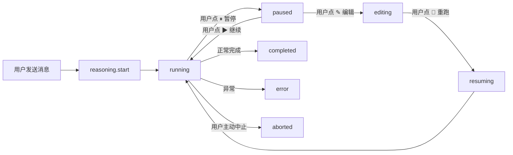
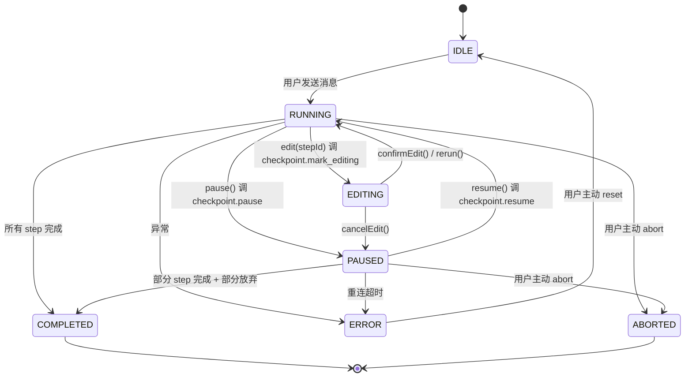
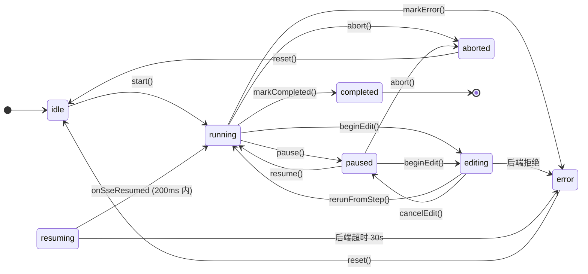
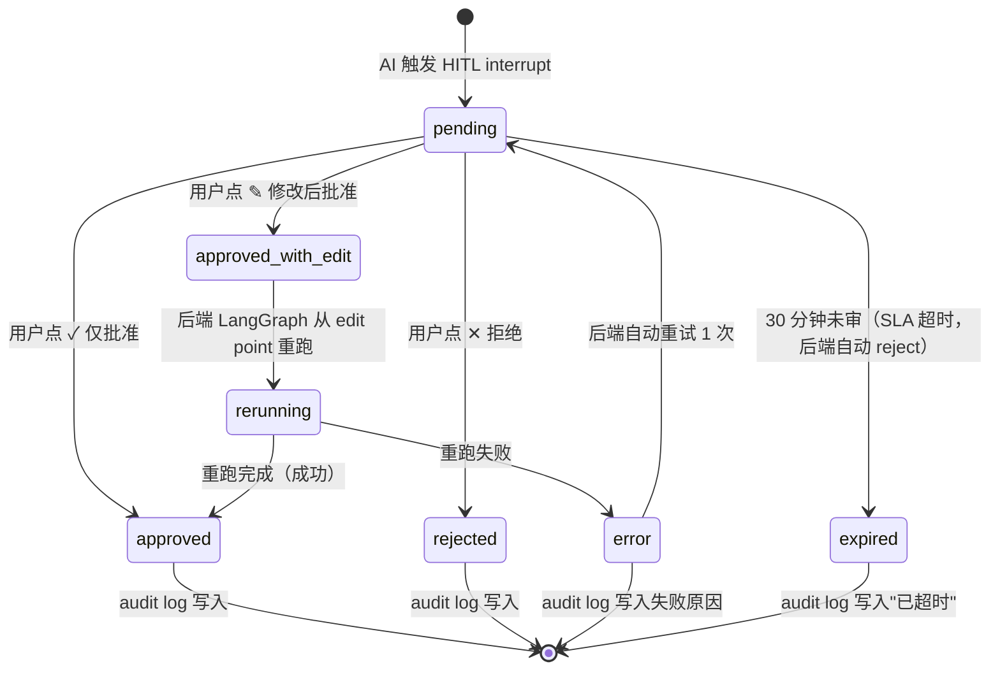
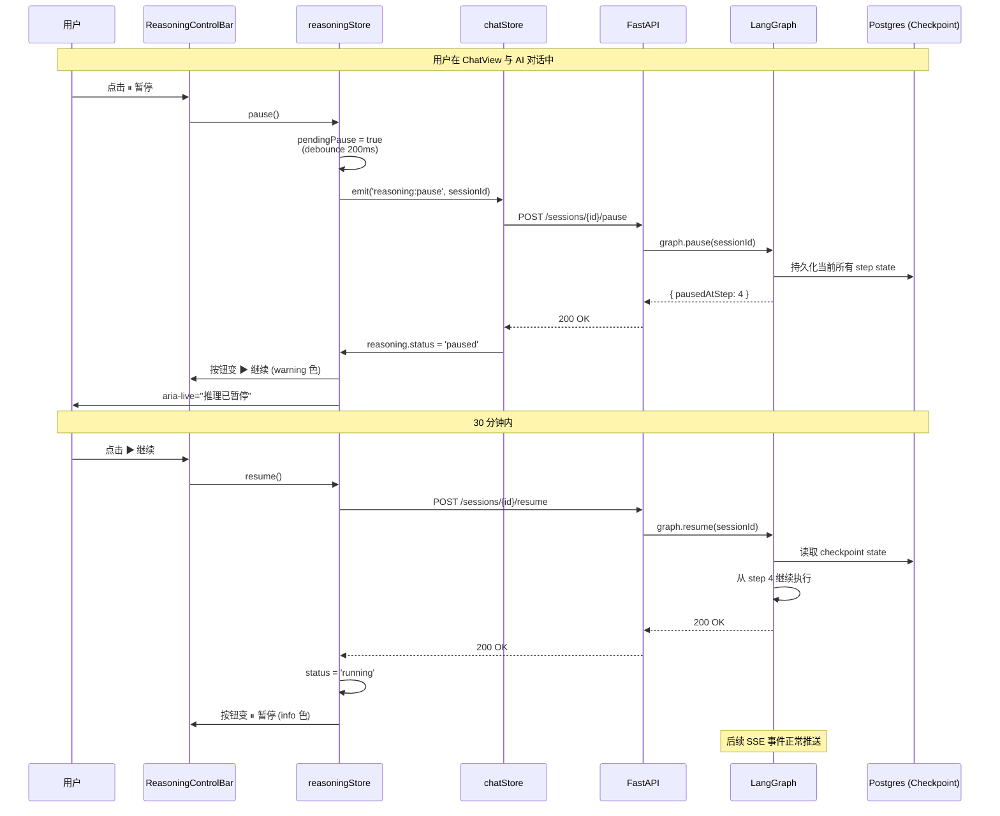
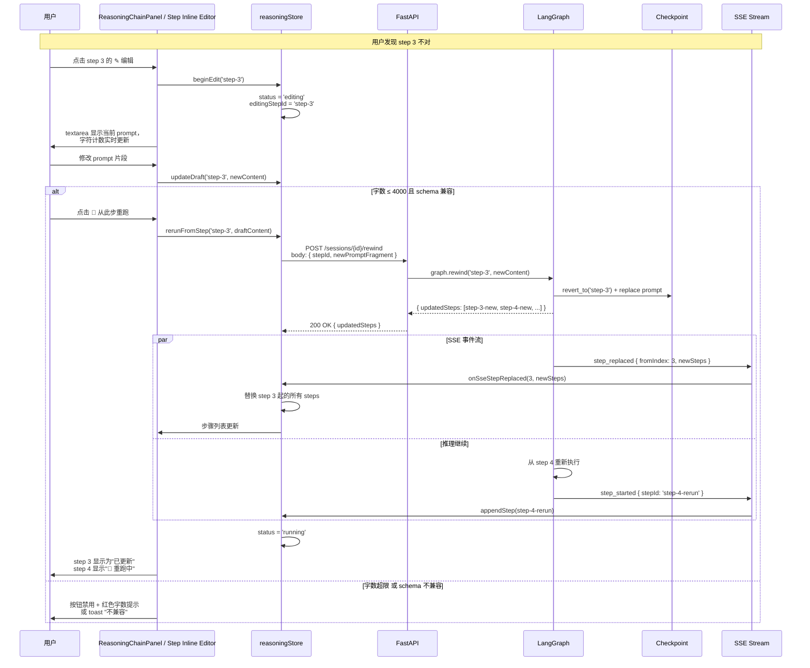
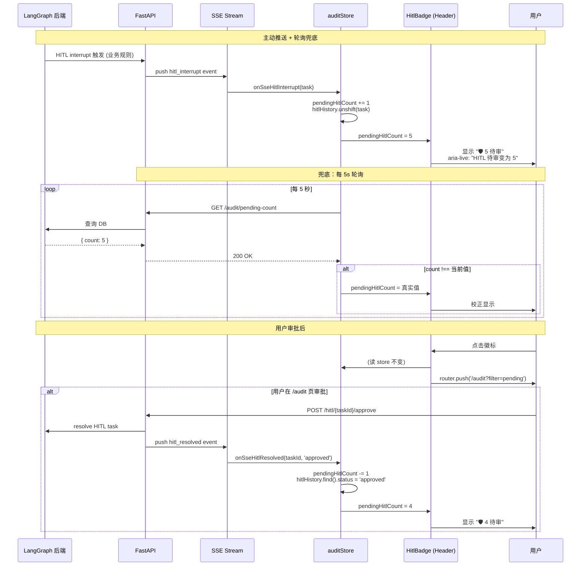
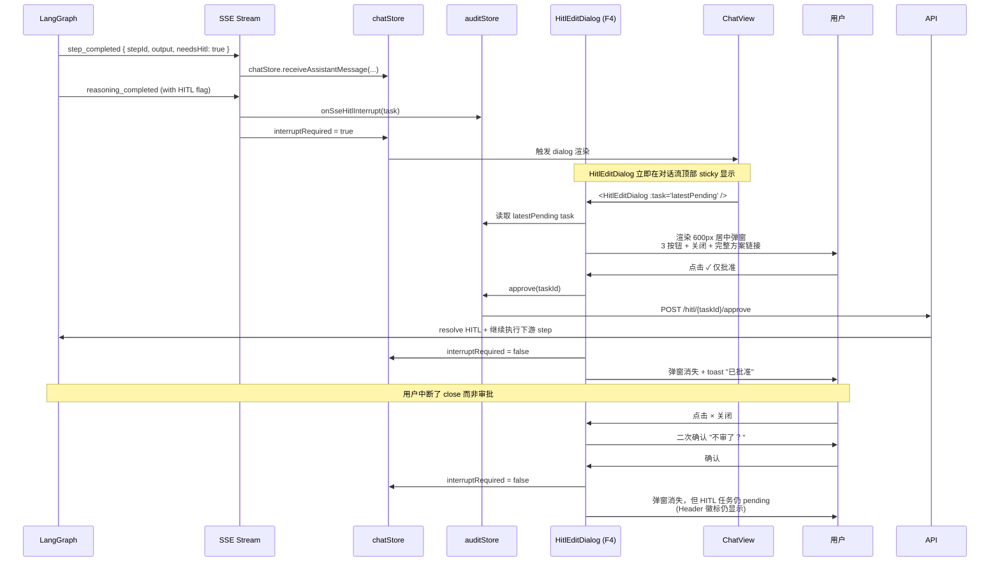

# GridMind v1.5.1 增量 PRD · P0-3 推理可编辑 + HITL 路径前置

> **作者** 许清楚 · 产品经理
> **审阅** 待主理人齐活林
> **日期** 2026-08-04
> **目标版本** GridMind v1.5.1（前端 UI 改进第二轮）
> **基线版本** GridMind v1.5.0（已发布，P0-1/2/4 已上线）
> **本版本范围** **仅 P0-3（推理可编辑 + HITL 路径前置）**——四大诉求 F1 暂停/恢复、F2 步骤编辑、F3 HITL 队列徽标、F4 HITL 弹窗前置
> **工作量预估** 9 人天（前 4 + 后 3 + 测 2）

---

## 0. 元信息

| 项 | 内容 |
|---|---|
| 文档版本 | v1.0 |
| 日期 | 2026-08-04 |
| 作者 | 许清楚（产品经理） |
| 上游依赖 | `docs/ui-competitive-analysis-2026-08-04.md` §7.1 P0-3（v1.5.0 PRD 总案）<br>`docs/ui-v150-architecture-2026-08-04.md` v1.5.0 系统设计<br>`docs/ui-v150-qa-report-2026-08-04.md` v1.5.0 QA 报告（PASS） |
| 本版本范围 | 仅 P0-3（详见 §3） |
| 后续依赖 | v1.6.0（P1-1 命令面板、P1-3 session 可观测）将以本版本 chatStore / reasoning store 为基础 |
| 关键风险 | **后端 LangGraph checkpoint 状态回退能力**——见 §7、§9 |
| 验收口径 | 见 §10 |
| 与 v1.5.0 关系 | 增量，不破坏 P0-1/2/4。store 名空间 `display` / `onboarding` 已存在，新增 `reasoning` / `audit` 共 2 个 store |

---

## 1. 背景与价值

### 1.1 v1.5.0 已交付内容回顾（3 个 P0）

v1.5.0 已通过 QA 验收（PASS，55/55 自动化测试通过，详见 `docs/ui-v150-qa-report-2026-08-04.md`），3 个 P0 已上线：

| P0 | 内容 | 状态 |
|---|---|---|
| **P0-1** | 背景动效降噪 + 演示模式开关（`BackgroundModeToggle`，display store）| ✅ 已上线 |
| **P0-2** | 状态四重区分（颜色 + 形状 + 图标 + 文字码） + 4 palette 色盲模式（`StatusIcon` + `ColorBlindModeToggle`）| ✅ 已上线 |
| **P0-4** | 新手引导 wizard（`/onboarding` 3 步）+ driver.js 单页 tour（`OnboardingTour`，5 路由 × 19 anchors）| ✅ 已上线 |

**未交付**：P0-3（推理可编辑）被有意延后到 v1.5.1，因为其依赖后端 LangGraph checkpoint 状态回退能力（详见 §7，最大风险点）。

### 1.2 为什么 v1.5.1 必须做 P0-3

引用 v1.5.0 PRD §7.1 P0-3：

> **目标**：从"AI 跑完调度员审"升级为"AI 跑中调度员可介入"。
>
> **核心改动**：
> - `ChatView.vue`：对话流增加"⏸ 暂停推理"按钮（仅当 AI 正在生成时显示）
> - `ReasoningChainPanel.vue`：每一步增加"✎ 编辑"按钮，点击后变 inline editor（支持改 prompt 片段），改完"🔄 从此步重跑"
> - `App.vue` Header：增加"HITL 队列"徽标（待审任务数 + 跳转链接）
> - 状态管理：增加 `reasoning.pause()` / `reasoning.resume()` / `reasoning.edit(stepId, newContent)` actions
>
> **预期效果**：对标 Cursor Manual 模式 + Coze 暂停机制。
>
> **工作量**：7-10 人天（前端 4 + 后端 LangGraph 状态机 3 + 测试 2）。
>
> **风险**：中，需要后端 LangGraph 支持 checkpoint 状态回退。
>
> **价值**：GridMind **最深护城河**（参考雄安智能体"调度员 + AI 同题竞技"）。

### 1.3 业务价值

| 维度 | 价值 |
|---|---|
| **专业差异化** | 雄安智能体作为最强对标，其 HITL 描述极少。GridMind 把"AI 跑中调度员可介入"做深，是 AI 调度类产品中**独一份**的护城河。 |
| **对标参考** | Cursor 2.0 Manual 模式 + Coze 扣子空间"任务执行中可暂停+调整参数+修正关键词权重" + Dify 提示词 IDE——三者都是 2025-2026 行业最佳实践。 |
| **电网场景** | 调度员"在 AI 给出方案时能插入自己的判断"——这是电网安全规程要求的"人审优先"。HITL 从"事后审"升级到"事中介入"，更符合电网现场实际。 |
| **Q3 OKR 命中** | v1.5.0 PRD §8.3 提出的 Q3 OKR 2："HITL 主动干预率（调度员主动暂停/编辑/重跑次数）≥20%"，本版本上线后才能度量。 |
| **替代 HitlEditDialog 的二级菜单触达** | 现有 HITL 流程"藏在二级菜单"是 PRD §3.4 痛点 4 之一，本版本通过 F3 徽标 + F4 弹窗前置彻底解决。 |

---

## 2. 用户故事（4 个）

### US-1：推理暂停 / 恢复

**作为** 电网调度员
**我想** 在 AI 推理过程中能暂停，让 AI 暂停生成结果，让我在它继续之前确认推理方向
**以至于** 我能在 AI 给出最终方案前插入自己的判断，避免"一步错步步错"。

**验收口径**：
- AI 正在生成时（`reasoning.status === 'running'`），ChatView 对话流底部出现"⏸ 暂停"按钮；
- 点击暂停 → 按钮变为"▶ 继续" + warning 色，`aria-live="polite"` 提示"推理已暂停"；
- 已完成的步骤全部保留为可编辑状态（不被清除）；
- 响应时间 ≤ 500ms（从 click 到 UI 状态切换）；
- 恢复后从暂停点继续生成，不重新走已完成的步骤。

### US-2：推理步骤编辑 + 从此步重跑

**作为** 电网调度员
**我想** 编辑推理链路中某一步的 prompt 片段，让 AI 从此步重跑，而不是从头开始
**以至于** 我能在 AI 推理中途"换一种思路"，节省从头跑的 token 与时间。

**验收口径**：
- `ReasoningChainPanel.vue` 每一步右侧出现"✎ 编辑"按钮；
- 点击后该步骤变为 inline editor（textarea，≥ 3 行高度，含 syntax 提示）；
- 修改后点击"🔄 从此步重跑"→ 推理 store 调 `reasoning.edit(stepId, newContent)` → 后端 LangGraph 从该 step checkpoint 回退重跑；
- 此步骤及之前步骤已完成的 state 保留，**仅从该步骤重新执行**；
- 重跑中显示 loading spinner，已完成步骤保持只读视图；
- 错误处理：后端若不支持 checkpoint 状态回退，显示 toast "该操作需要 LangGraph checkpoint 支持"。

### US-3：HITL 队列徽标（一键跳审计页）

**作为** 电网调度员
**我想** 在 Header 看到"HITL 队列"待审任务数徽标，一键跳转到审计页处理
**以至于** 我不需要扫菜单，**任何时刻都能看到当前有多少任务需要我审**。

**验收口径**：
- Header 左上角（在 OnboardingTrigger 之后）出现"🛡 5 待审"圆形徽标（数字=待审 HITL 任务数）；
- 数字为 0 时徽标隐藏（不显示空徽标）；
- 数字 > 99 时显示 "99+"；
- 点击徽标 → 跳转 `/audit`；
- 数据来源：`auditStore.pendingHitlCount`（后端 `GET /audit/pending-count` 轮询 5s + HITL interrupt 事件主动推送）；
- 徽标背景色：`--status-critical-fg` 红（danger），白字，圆形 ≥ 22px 高。

### US-4：HITL 弹窗前置

**作为** 电网调度员
**我想** 推理结束后 HITL 弹窗能在对话流前置显示，不需要去二级菜单找
**以至于** AI 报告"需要您审"时我能立刻看到，不会因为消息流末端而漏看。

**验收口径**：
- HITL interrupt 事件触发 → `chatStore.interruptRequired = true`；
- `HitlEditDialog.vue` 立即在 ChatView 对话流顶部 sticky 显示（不是末尾）；
- 弹窗宽度 600px，居中（左右边距 `calc((100% - 600px) / 2)`），z-index 1000（高于其他元素）；
- 含三按钮：拒绝 / 仅批准 / 修改后批准；
- 弹窗可关闭（×），关闭后 `interruptRequired = false`，但 Header 徽标仍显示待审数；
- a11y：`role="dialog"` + `aria-modal="true"` + `aria-labelledby` + 焦点 trap（关闭后焦点回到触发元素）；
- 键盘可达：Tab 在三按钮 + 关闭按钮之间循环，Esc 关闭。

---

## 3. 功能详述

### 3.1 F1 · 推理暂停 / 恢复

#### 3.1.1 UI mockup 描述

**对话流底部工具栏**（`welcome-toolbar` 旁，新组件 `ReasoningControlBar.vue`）：

```
┌──────────────────────────────────────────────────────────────────────┐
│  💬 ChatView 对话流                                                   │
│  ────────────────────────────────────────────────────────────         │
│  [用户消息] #T1 主变压器温度异常，请诊断                               │
│  [AI 推理中...  ⏸ 暂停]   ← 暂停按钮，仅 running 时显示              │
│  ├ Step 1: 查询遥测数据  ✓                                          │
│  ├ Step 2: 知识图谱定位  ✓                                          │
│  ├ Step 3: 因果分析     🔄 ← 当前正在执行                            │
│  └ Step 4: 给出方案     ⏳ 等待中                                   │
└──────────────────────────────────────────────────────────────────────┘
```

暂停后工具栏变为：
```
│  💬 ChatView 对话流                                                   │
│  [Step 1 ✓] [Step 2 ✓] [Step 3 完成-可编辑] [Step 4 ⏸ 等待]          │
│  ───────────────                                                    │
│  [▶ 继续]  [✎ 编辑当前步骤]  ← 警告色 warning，提醒需要人工介入     │
└──────────────────────────────────────────────────────────────────────┘
```

#### 3.1.2 视觉规范

| 状态 | 颜色 | 图标 | 文案 | aria-label |
|---|---|---|---|---|
| Running | `--status-info-fg` 蓝 | 加载旋转图标 | "推理中…" | "AI 推理中" |
| Paused | `--status-warning-fg` 黄 | ⏸ 暂停图标 | "已暂停（点继续）" | "暂停推理" |
| Editing | `--status-accent-fg` 紫 | ✎ 编辑图标 | "编辑中…" | "正在编辑推理步骤" |
| Resuming | `--status-info-fg` 蓝 | 加载旋转图标 | "恢复中…" | "恢复推理中" |
| Completed | `--status-normal-fg` 绿 | ✓ 勾选 | "推理完成" | "推理已完成" |
| Error | `--status-critical-fg` 红 | ✕ 叉 | "推理出错" | "推理出错，请重试" |
| Aborted | `--cb-status-neutral-fg` 灰 | ⊘ 禁符 | "已中止" | "推理已中止" |

#### 3.1.3 行为详解



**触发链**：
1. 用户在 ChatView 发送消息 → chatStore.sendMessage → 后端 LangGraph 启动推理 → SSE 流式推送 step event；
2. 前端 `reasoningStore.appendStep(event)` 更新 step 列表 → `reasoningStore.status = 'running'`；
3. 用户点 ⏸ 暂停 → 调 `reasoning.pause()` → 后端 LangGraph checkpoint 暂停生成，保留已完成所有 step；
4. 后端确认 pause → SSE `paused` event → 前端 `reasoningStore.status = 'paused'`；
5. 用户可点 ▶ 继续 → 调 `reasoning.resume()` → 后端从 checkpoint 恢复 → 状态回到 running；
6. 用户点 ✎ 编辑某 step → F2 路径，详见 §3.2。

#### 3.1.4 边界条件

| 场景 | 行为 |
|---|---|
| 用户切换路由离开 /chat | 弹"确定离开？推理将中止"确认，对话状态保留在 chatStore |
| 后端 SSE 断连 | 自动重连 3 次，失败则 reasoning 状态转为 error，提示用户刷新或重跑 |
| 用户连续点 ⏸ 暂停 2 次 | 第 2 次被 debounce 拒绝，前端 disabled 200ms |
| 暂停时刷新页面 | 后端 checkpoint 保留 30 分钟（详见 §7），前端 localStorage 暂存 sessionId，重连后恢复 |
| 多 tab 同时打开同一 session | 由后端 LangGraph 处理 session 锁，前端通过 SSE 同步状态 |

#### 3.1.5 a11y 详细

| 控件 | 属性 |
|---|---|
| `<button>` 暂停 / 继续 | `aria-label="暂停推理"` / `aria-label="继续推理"` + `aria-pressed={status==='paused'}` + 切换时 `aria-live="polite"` 提示 "推理已暂停" / "继续推理" |
| 状态徽标（推理中…） | `role="status"` + `aria-live="polite"` + `aria-atomic="true"` |
| 错误 toast | `role="alert"` + `aria-live="assertive"` |

### 3.2 F2 · 推理步骤编辑 + 从此步重跑

#### 3.2.1 UI mockup 描述

**`ReasoningChainPanel.vue` 的 step 行**（编辑态与只读态切换）：

**只读态**（默认）：
```
┌──────────────────────────────────────────────────────────────┐
│ ① Step 1: 查询遥测数据                          ✓ 完成   ✎   │
│    prompt: "查询 220kV 张家口变电站 #T1 主变压器 24 小时温度"   │
│    output: {"temperature": [65.2, 67.1, 89.5, 92.3, ...]}    │
└──────────────────────────────────────────────────────────────┘
```

**编辑态**（用户点 ✎ 后）：
```
┌──────────────────────────────────────────────────────────────┐
│ ① Step 1: 查询遥测数据                          ⚙ 编辑中     │
│ ┌────────────────────────────────────────────────────────┐   │
│ │ prompt: [textarea 3 行，可编辑]                         │   │
│ │ 查询 220kV 张家口变电站 #T1 主变压器 24 小时温度         │   │
│ │ 改为：查询 #T1 主变压器的 30 天温度，并标注超过 70℃ 时段 │   │
│ │                                                        │   │
│ └────────────────────────────────────────────────────────┘   │
│       [🔄 从此步重跑]   [✓ 保存（不重跑）]   [✕ 取消]        │
└──────────────────────────────────────────────────────────────┘
```

**重跑中**：
```
┌──────────────────────────────────────────────────────────────┐
│ ① Step 1: 查询遥测数据                          ✓ 已更新      │
│    prompt: "(编辑后版本)"                                       │
│ ② Step 2: 知识图谱定位         🔄 重跑中...                     │
│ ③ Step 3: 因果分析            ⏳ 等待中                          │
└──────────────────────────────────────────────────────────────┘
```

#### 3.2.2 行为详解

1. 用户在 ReasoningChainPanel 点某 step 的 ✎ → 该 step 切换为编辑态（其他 step 不受影响）；
2. 用户修改 prompt 片段 → 实时更新 `reasoningStore.draftSteps[stepId]`（不直接提交，仅前端缓存）；
3. 用户点 🔄 从此步重跑 → 调 `reasoningStore.edit(stepId, newContent)` → 后端 LangGraph 调 `checkpoint.revert_to(stepId)` 然后从该 step 重新执行；
4. 后端 SSE 推送新 step event → 前端逐步替换原 step 列表中的后续 steps；
5. 用户点 ✕ 取消 → discard draft，回到只读态；
6. 用户点 ✓ 保存（不重跑）→ 仅保存修改到后端，但**不重跑**（便于事后审计，但较弱，工作量增加 0.5 人天，本版本暂不实现，见 §11 待明确）。

#### 3.2.3 编辑范围

| prompt 类型 | 是否可编辑 | 理由 |
|---|---|---|
| User 内容片段 | ✅ 可编辑 | 这是 HITL "人工裁判"最直接的入口 |
| Assistant 已生成内容 | ❌ 不可编辑 | 防止"改 AI 答案"绕过审计 |
| Tool call JSON | ❌ 不可编辑（v1.5.1）<br>✅ P2-4 多智能体可视化时可编辑 | 工作量大，验证规则复杂 |
| System prompt | ❌ 不可编辑 | 安全考虑，需主理人决策（见 §11） |

#### 3.2.4 错误处理

| 错误场景 | UI 表现 |
|---|---|
| 后端不支持 checkpoint 状态回退 | toast："该操作需要 LangGraph checkpoint 支持。请联系管理员升级 LangGraph 版本至 ≥0.2。"（持续 5s）<br>按钮禁用，恢复只读态 |
| 编辑内容超过 4000 字符 | 实时字数提示，超过则禁用"🔄 从此步重跑"按钮 |
| 编辑后与该 step 后所有 step 的输入 schema 不兼容 | toast："修改的 prompt 与下游 step 类型不兼容，请恢复默认。"<br>自动恢复到原内容 |
| 后端重跑超时（> 30s 无响应）| 提示"重跑超时，正在回滚..."，强制将 reasoning 状态转回 paused，原 step 内容恢复 |

#### 3.2.5 a11y

| 控件 | 属性 |
|---|---|
| ✎ 按钮 | `aria-label="编辑第 N 步：{step name}"` |
| textarea | `aria-label="编辑 prompt 片段"` + 必填字符数提示 + 字数计数器 `aria-describedby="char-count"` |
| 🔄 按钮 | `aria-label="从此步重跑"` + 重跑中 `aria-busy="true"` + loading spinner 含 `role="status" aria-label="重跑中"` |

### 3.3 F3 · HITL 队列徽标

#### 3.3.1 UI mockup 描述

**App.vue Header**（v1.5.0 顺序：OnboardingTrigger → BackgroundModeToggle → ColorBlindModeToggle → ThemeToggle → 新对话）：

```
┌──────────────────────────────────────────────────────────────────────────────────┐
│ [LogoHorizontal]   [🎓][🎬][🌈][🌓]  …………  🛡 5待审  [新对话 💬]                       │
│                       ↑ v1.5.0 已交付 4 个 toggle            ↑ v1.5.1 新增徽标    │
└──────────────────────────────────────────────────────────────────────────────────┘
```

**徽标细节**：
- 形状：pill 形（圆角矩形）或圆形 ← **采纳圆形**（更醒目）
- 尺寸：高 22px，padding 0 8px
- 背景：`--status-critical-fg`（红），前景：白色
- 字体：`--font-family-mono`，size 12px，weight 600
- 文案：🛡 + 数字；如 "🛡 5 待审" 或 "🛡 99+ 待审"
- 数字为 0 时整个徽标 `display: none`
- hover：背景色提亮 10% + 阴影 `--shadow-glow-critical`

#### 3.3.2 行为详解

**数据来源**：
- **主动推送**：SSE `hitl_interrupt` / `hitl_resolved` 事件 → `auditStore.pendingHitlCount +=/-= 1`
- **轮询兜底**：每 5 秒 `GET /audit/pending-count` → 校正 `auditStore.pendingHitlCount`（防止 SSE 断连漂移）
- **首屏加载**：`auditStore.hydrate()` 在 main.ts mount 前调用，从后端 `GET /audit/pending-count` 拉一次

**点击行为**：
```typescript
function onBadgeClick() {
  router.push('/audit?filter=pending&from=hitl-badge')
}
```

**filter 行为**：进入 `/audit` 后默认筛选 status=pending，保证用户看到的全部是待审任务。

#### 3.3.3 边界条件

| 场景 | 行为 |
|---|---|
| 后端 5xx 错误 | 徽标显示 "·" 灰点（无法获取），hover tooltip "等待后端连接" |
| 用户在 `/audit` 时待审数变 0 | 徽标隐藏，不主动跳转 |
| 待审 > 99 | 显示 "99+"，实际数字仍存 store |
| 调度员当前 session 已在 audit 路径 | 点击徽标不跳转，仅刷新列表（避免无意义 history push） |
| 多 tab /audit | 各 tab 徽标独立计数（避免冲突） |

#### 3.3.4 a11y

| 控件 | 属性 |
|---|---|
| 徽标 `<button>` | `aria-label="HITL 队列：5 个待审任务，点击进入审计页"` + `aria-live="polite"` + 数字变化时自动播报 "HITL 待审变为 X 个" |

### 3.4 F4 · HITL 弹窗前置

#### 3.4.1 UI mockup 描述

**ChatView 对话流**（HITL interrupt 触发后）：

```
┌──────────────────────────────────────────────────────────────────────────────────┐
│  💬 ChatView                                                                       │
│  ┌──────────────────────────────────────────────────────────────────────────────┐ │
│  │  📣 HITL 中断 · 等待您审批                                       [× 关闭]    │ │ ← sticky
│  │  ─────────────────────────────────────────────────────────────              │ │
│  │  AI 推理建议：                                                                │ │
│  │  对 #T1 主变压器执行冷却系统手动启动，负载降至 60%。                           │ │
│  │  置信度 87%，风险评估：中。                                                   │ │
│  │                                                                              │ │
│  │  [📋 完整方案]  [🔍 查看推理链]                                              │ │
│  │  ─────────────────────────────────────────────────────────                  │ │
│  │  [✕ 拒绝]                [✓ 仅批准]               [✎ 修改后批准]              │ │
│  └──────────────────────────────────────────────────────────────────────────────┘ │
│  ↓ 以下是历史对话                                                                 │
│  [用户消息] #T1 主变压器温度异常                                                 │
│  [AI 推理] Step 1 ✓ / Step 2 ✓ / Step 3 ✓ / Step 4 等待审批                      │
└──────────────────────────────────────────────────────────────────────────────────┘
```

#### 3.4.2 位置与层级

- **位置**：`position: sticky; top: 0; z-index: 100` 在对话流外层容器
- **宽度**：600px（`< dialog` spec），水平居中
- **margin**：水平 `calc((100% - 600px) / 2)`，垂直距顶部 16px
- **遮罩**：`backdrop-filter: blur(4px) + rgba(0,0,0,0.4)`，z-index 99（在弹窗下，但在其他内容上）
- **z-index 层级**：tab bar 50 → 主内容 1-10 → 弹窗遮罩 99 → 弹窗 100 → toast 1000

#### 3.4.3 三按钮行为

| 按钮 | 行为 | 后端 API |
|---|---|---|
| **✕ 拒绝** | 关闭弹窗 + `interruptRequired = false` + 弹 toast "已拒绝" + 后端 LangGraph 收到 reject signal 后中止推理 | `POST /hitl/{taskId}/reject` |
| **✓ 仅批准** | 关闭弹窗 + `interruptRequired = false` + 提交 audit log "调度员直接批准" + 后端 LangGraph 继续执行 | `POST /hitl/{taskId}/approve` |
| **✎ 修改后批准** | 关闭弹窗 + 打开 `HitlEditDialog`（v1.5.0 已有）允许编辑 prompt 后再提交 | `POST /hitl/{taskId}/approve-with-edit` (payload 含 editedContent) |

#### 3.4.4 关闭行为分级

| 关闭方式 | 行为 |
|---|---|
| 点击 × | 弹 "不审了？" 二次确认；确认后 `interruptRequired = false`，弹窗消失，但 Header 徽标仍显示（仍待审） |
| 点击遮罩 | 同 ×，需二次确认 |
| Esc 键 | 同 × |
| 用户审批通过（任一三按钮） | 不需要二次确认，直接关闭 |

#### 3.4.5 a11y

| 属性 | 说明 |
|---|---|
| `role="dialog"` | 必须 |
| `aria-modal="true"` | 必须 |
| `aria-labelledby="hitl-dialog-title"` | title 元素 id |
| 焦点管理 | 弹窗开启：焦点聚焦到"仅批准"按钮（最常用）；关闭：焦点回到原触发元素 |
| 焦点 trap | Tab / Shift+Tab 在 三按钮 + 关闭按钮之间循环 |
| `aria-live="assertive"` | "HITL 中断：请审批"（中断类信息用 assertive） |

### 3.5 数据持久化摘要（4 个 F 的横切关注）

| 数据 | 存储 | 时机 |
|---|---|---|
| `auditStore.pendingHitlCount` | `sessionStorage` | 每 5 秒轮询时持久化；sessionStorage 用于跨刷新保持 |
| `reasoningStore.activeSessionId` | `localStorage` | 推理启动时；用于重连/重入 |
| `reasoningStore.draftSteps` | **不入持久化** | 仅内存草稿，关页面即丢（防止脏数据）|
| `auditStore.hitlHistory` | 由后端持久，前端仅缓存 | 翻页时按需请求 |

---

## 4. 数据结构与接口

### 4.1 前端 reasoning store（state / actions / getters）

#### 4.1.1 State

```typescript
// web/src/stores/reasoning.ts（新建）

export type ReasoningStatus =
  | 'idle'          // 无活跃推理
  | 'running'       // AI 正在生成
  | 'paused'        // 用户已暂停
  | 'editing'       // 用户在编辑某 step
  | 'resuming'      // 恢复中（SSE 等待 ack）
  | 'completed'     // 完成
  | 'error'         // 出错
  | 'aborted'       // 用户主动中止

export type StepStatus = 'pending' | 'running' | 'completed' | 'failed' | 'edited'

export interface ReasoningStep {
  id: string                          // 后端 checkpoint ID，UUID 形式
  index: number                       // 1-based
  name: string                        // e.g. "查询遥测数据"
  description: string                 // 中文描述
  promptFragment: string              // 当前生效的 prompt 片段（只读模式显示）
  draftPromptFragment: string | null  // 编辑中的草稿（仅 editing 态有）
  status: StepStatus
  startedAt: string                   // ISO
  completedAt: string | null          // ISO
  durationMs: number | null
  output: unknown                     // JSON，可选
  isEditable: boolean                 // 业务规则：user prompt 可编辑，system/tool 不可
}

export interface ReasoningState {
  sessionId: string | null            // 关联 chatStore session
  status: ReasoningStatus
  steps: ReasoningStep[]              // 当前 session 的 step 列表
  draftSteps: Record<string, string>  // stepId -> draftPromptFragment（编辑中）
  editingStepId: string | null        // 当前正在编辑哪一步
  lastPausedAt: string | null
  lastResumedAt: string | null
  errorMessage: string | null         // 当 status === 'error'
  pendingPause: boolean               // debounce 中
  pendingResume: boolean
  pendingEdit: boolean
}
```

#### 4.1.2 Actions

```typescript
export interface ReasoningActions {
  // 生命周期
  start(sessionId: string, initialSteps: ReasoningStep[]): void
  appendStep(step: ReasoningStep): void             // SSE stream event
  updateStep(stepId: string, partial: Partial<ReasoningStep>): void
  markCompleted(): void
  markError(message: string): void
  abort(): void
  reset(): void

  // F1: 暂停/恢复
  pause(): Promise<void>           // 调后端；optimistic UI；rollback on reject
  resume(): Promise<void>
  isPaused(): boolean              // getter

  // F2: 编辑
  beginEdit(stepId: string): void            // status = 'editing'
  updateDraft(stepId: string, content: string): void
  cancelEdit(): void
  confirmEdit(): Promise<void>              // 仅保存草稿到 draftPromptFragment，不重跑
  rerunFromStep(stepId: string): Promise<void>  // 真正重跑（F2 主流程）

  // SSE 事件处理（由 main.ts 或 ws.ts 调用）
  onSsePaused(stepId: string): void
  onSseResumed(): void
  onSseStepReplaced(fromIndex: number, newSteps: ReasoningStep[]): void
}
```

#### 4.1.3 Getters

```typescript
export interface ReasoningGetters {
  isActive: boolean                      // status in ['running', 'paused', 'editing', 'resuming']
  isPaused: boolean                      // status === 'paused'
  isEditable(stepId: string): boolean    // ReasoningStep.isEditable
  completedSteps: ReasoningStep[]        // status === 'completed'
  nextStepToRun: ReasoningStep | null    // step.status === 'running' 或 highest pending
  elapsedMs(stepId: string): number      // 当前 step 累计时间（结合 store.nowTick）
  totalSteps: number
  progress: number                       // 0-1，completedSteps / totalSteps
}
```

#### 4.1.4 与现有 store 的关系

| 关系 | 说明 |
|---|---|
| `chatStore.sessionId` | `reasoningStore.sessionId` 从 chatStore 读取，start 时绑定 |
| `chatStore.interruptRequired` | SSE `hitl_interrupt` 事件触发 chatStore.interruptRequired = true；reasoningStore 同步进入 completed 状态 |
| `auditStore.pendingHitlCount` | HITL interrupt 触发后由 auditStore 增量；reasoningStore 不直接管理 |
| `displayStore` | reasoningStore 不依赖 displayStore |
| `onboardingStore` | reasoningStore 不依赖 onboardingStore |

### 4.2 前端 auditStore / hitlService 接口

#### 4.2.1 auditStore（新建）

```typescript
// web/src/stores/audit.ts（新建）

export interface AuditState {
  pendingHitlCount: number            // 当前待审任务数
  hitlHistory: HitlTask[]             // 最近 50 条 HITL 任务缓存（分页时按需加载）
  lastSyncAt: string | null           // ISO
  connectionState: 'connected' | 'disconnected' | 'error'
  isHydrated: boolean
}

export interface HitlTask {
  id: string                          // task ID
  sessionId: string
  stepId: string | null               // 关联的 reasoning step
  createdAt: string                   // ISO
  promptContext: string               // 触发 HITL 的 prompt 上下文
  aiSuggestion: string                // AI 建议内容
  confidence: number                  // AI 置信度 0-1
  riskLevel: 'low' | 'medium' | 'high'
  status: 'pending' | 'approved' | 'rejected' | 'approved-with-edit'
}

export interface AuditActions {
  // 轮询（5s）
  refreshPendingCount(): Promise<void>

  // SSE 主动推送
  onSseHitlInterrupt(task: HitlTask): void
  onSseHitlResolved(taskId: string, resolution: HitlTask['status']): void

  // HITL 操作（与 F4 三按钮对应）
  approve(taskId: string): Promise<void>
  reject(taskId: string): Promise<void>
  approveWithEdit(taskId: string, editedContent: string): Promise<void>

  // 首屏
  hydrate(): void                     // mount 前调一次
  startPolling(): void                // 每 5s 轮询
  stopPolling(): void
}
```

#### 4.2.2 hitlService（API 客户端）

```typescript
// web/src/services/hitlService.ts（新建）

import type { HitlTask } from '@/stores/audit'

export const hitlService = {
  /** 获取当前待审 HITL 任务数 */
  async getPendingCount(): Promise<number>

  /** 获取当前活跃的 HITL 任务列表（用于 F4 弹窗内容） */
  async listActive(): Promise<HitlTask[]>

  /** 批准（仅批准） */
  async approve(taskId: string): Promise<void>

  /** 拒绝 */
  async reject(taskId: string): Promise<void>

  /** 修改后批准 */
  async approveWithEdit(taskId: string, editedContent: string): Promise<void>

  /** 历史分页查询 */
  async listHistory(params: {
    cursor?: string
    limit?: number         // 默认 20
    status?: HitlTask['status'][]
    fromDate?: string
    toDate?: string
  }): Promise<{ items: HitlTask[]; nextCursor: string | null }>
}
```

### 4.3 后端 LangGraph checkpoint 改造需求（关键！）

> **本节是 v1.5.1 最大风险点**，主理人在批准本 PRD 前必须与后端对齐。

#### 4.3.1 LangGraph checkpoint 必须支持的操作

| 操作 | API（建议） | 用途 | 优先级 |
|---|---|---|---|
| **Checkpoint 暂停生成** | `POST /sessions/{id}/pause` | F1 暂停 | **P0** |
| **Checkpoint 恢复生成** | `POST /sessions/{id}/resume` | F1 继续 | **P0** |
| **从某 step 回退重跑** | `POST /sessions/{id}/rewind { stepId, newPromptFragment }` | F2 编辑后重跑 | **P0** |
| **查询所有 step checkpoint** | `GET /sessions/{id}/checkpoints` | F2 编辑前读取可编辑范围 | **P0** |
| **强制中止** | `POST /sessions/{id}/abort` | 用户主动中止 | **P1** |
| **Checkpoint TTL 设置** | 配置项，默认 30 分钟 | 暂停/恢复跨刷新支持 | **P1** |

#### 4.3.2 LangGraph 状态机改造



#### 4.3.3 数据持久化

| 持久化内容 | 存储 | 原因 |
|---|---|---|
| 当前 session 完整 state（包括 prompt、step 输出）| LangGraph Checkpoint（后端 Postgres/SQLite） | pause/resume/rewind 必须能回退到任意时点 |
| HITL 任务（HitlTask）| Postgres，独立表 | 与 session 解耦，便于 audit 查询 |
| 用户编辑历史 | Postgres，独立表（可选）| 追溯"调度员改了什么" |
| SSE 推送状态 | 仅在 WebSocket session 内 | 无状态 |

#### 4.3.4 错误码规范

| HTTP | code | message | 前端 UI 反应 |
|---|---|---|---|
| 409 | `SESSION_NOT_PAUSABLE` | 当前 session 不支持暂停（已 completed/aborted） | toast "当前推理不可暂停"+ 按钮禁用 |
| 409 | `STEP_NOT_EDITABLE` | step 不可编辑（system/tool prompt） | toast "该步骤不允许编辑，请另寻方式" |
| 409 | `CHECKPOINT_UNSUPPORTED` | LangGraph 版本不支持 checkpoint 回退 | toast "该操作需要 LangGraph checkpoint 支持" + 功能降级（隐藏按钮） |
| 422 | `EDIT_SCHEMA_MISMATCH` | 修改的 prompt 与下游 step 输入 schema 不兼容 | toast "修改的内容与下游步骤不兼容" + 自动恢复 |
| 504 | `RERUN_TIMEOUT` | 重跑超时 | 自动回滚 reasoning 状态到 paused |

### 4.4 前端 ↔ 后端 API 契约

#### 4.4.1 SSE 事件（v1.5.1 新增）

| 事件名 | payload | 触发时机 | 前端处理 |
|---|---|---|---|
| `step_started` | `{ stepId, index, name, description, promptFragment }` | AI 开始执行 step | `reasoningStore.appendStep` |
| `step_completed` | `{ stepId, output, durationMs }` | AI 完成 step | `reasoningStore.updateStep` |
| `step_failed` | `{ stepId, error }` | AI 执行 step 出错 | `reasoningStore.updateStep` + status = error |
| `reasoning_paused` | `{ sessionId, pausedAtStep }` | 后端确认 pause | `reasoningStore.onSsePaused` |
| `reasoning_resumed` | `{ sessionId }` | 后端确认 resume | `reasoningStore.onSseResumed` |
| `step_replaced` | `{ fromIndex, newSteps[] }` | rewind 后重新生成 | `reasoningStore.onSseStepReplaced` |
| `hitl_interrupt` | `{ taskId, sessionId, stepId, aiSuggestion, confidence, riskLevel }` | 后端请求 HITL | `chatStore.interruptRequired = true` + `auditStore.onSseHitlInterrupt` |
| `hitl_resolved` | `{ taskId, resolution }` | 用户在 F4 审批后 | `auditStore.onSseHitlResolved` |
| `reasoning_completed` | `{ sessionId, finalOutput }` | 全部 step 完成 | `reasoningStore.markCompleted` |
| `reasoning_error` | `{ sessionId, error }` | 推理异常 | `reasoningStore.markError` |

> **重要**：SSE 事件命名约定沿用 v1.5.0 chatStore，已有的 `step_started`/`step_completed` 复用，本版本新增 6 个。

#### 4.4.2 REST API（v1.5.1 新增）

| 方法 | 路径 | body | response | 用途 |
|---|---|---|---|---|
| POST | `/sessions/{id}/pause` | — | `{ pausedAtStep }` | F1 暂停 |
| POST | `/sessions/{id}/resume` | — | `{ resumedAt }` | F1 继续 |
| POST | `/sessions/{id}/rewind` | `{ stepId, newPromptFragment }` | `{ updatedSteps[] }` | F2 编辑重跑 |
| GET  | `/sessions/{id}/checkpoints` | — | `{ steps: StepCheckpoint[] }` | F2 编辑范围 |
| GET  | `/audit/pending-count` | — | `{ count, lastUpdated }` | F3 徽标 |
| GET  | `/audit/hitl/active` | — | `HitlTask[]` | F4 弹窗内容 |
| POST | `/hitl/{taskId}/approve` | — | `{ resolvedAt }` | F4 仅批准 |
| POST | `/hitl/{taskId}/reject` | `{ reason? }` | `{ resolvedAt }` | F4 拒绝 |
| POST | `/hitl/{taskId}/approve-with-edit` | `{ editedContent }` | `{ resolvedAt, newSessionId? }` | F4 修改后批准 |
| POST | `/sessions/{id}/abort` | `{ reason? }` | `{ abortedAt }` | 用户主动中止 |

---

## 5. 状态机

### 5.1 推理状态机



### 5.2 HITL 任务生命周期状态机



### 5.3 状态机不变量（Invariants）

| 不变量 | 说明 |
|---|---|
| `paused` 状态下所有 `running` step 应转为 `pending` | 防止"暂停时某 step 还在跑"的悬挂状态 |
| `editing` 状态下 `editingStepId !== null` | 互斥约束 |
| `editing` 状态下 `status !== 'running'` | editing 与 running 互斥 |
| `aborted` 后 `steps` 不再变更 | 终态冻结 |
| `error` 后用户只能 `reset()` 或 `abort()` | 不能直接转 running |
| HITL `pending` 数 ≠ auditStore.pendingHitlCount 时 | F3 徽标显示"·"灰点（兜底） |

---

## 6. 时序图（Mermaid）

### 6.1 推理暂停时序



### 6.2 推理编辑时序



### 6.3 HITL 队列徽标数据流



### 6.4 HITL 弹窗前置时序



---

## 7. 后端依赖清单

> ⚠️ **本节是 v1.5.1 关键路径，主理人在批准本 PRD 前必须与后端对齐。**

### 7.1 LangGraph checkpoint 必须支持的操作

| 操作 | LangGraph 能力要求 | 状态（主理人需确认） |
|---|---|---|
| **Checkpoint 暂停生成** | `graph.pause()` / `Pregel.pause()` API（LangGraph ≥ 0.2.0 提供，需配置 `checkpointer=True`）| ☐ 待确认 |
| **Checkpoint 恢复生成** | `graph.resume()` API | ☐ 待确认 |
| **从某 step 回退重跑** | `graph.rewind()` 或 `update_state(history, ...)` API（LangGraph ≥ 0.2.0，部分能力需 ≥ 0.2.5）| ☐ 待确认 |
| **Checkpoint TTL** | 配置 `checkpointer.ttl_seconds`（默认 30 分钟）| ☐ 待确认 |
| **Checkpoint 存储** | 后端需支持 Postgres / SQLite Checkpoint（不能仅 in-memory） | ☐ 待确认 |
| **多 step 的 state 序列化** | 所有 node 的 input/output 必须可 JSON 序列化（任何含 lambda / 闭包的 state 不可用） | ☐ 待确认 |
| **SSE / WebSocket 推送 step event** | v1.5.0 已有 `step_started` / `step_completed`；本版本新增 6 个事件类型（见 §4.4.1） | ✅ v1.5.0 已具备，仅需扩展 |

### 7.2 后端 API 改造列表

| API | 方法 | 优先级 | 工作量 | 后端依赖 |
|---|---|---|---|---|
| `/sessions/{id}/pause` | POST | P0 | 0.5 人天 | LangGraph pause API |
| `/sessions/{id}/resume` | POST | P0 | 0.5 人天 | LangGraph resume API |
| `/sessions/{id}/rewind` | POST | P0 | 1.0 人天 | LangGraph rewind API + checkpoint 替换 |
| `/sessions/{id}/checkpoints` | GET | P0 | 0.5 人天 | Checkpoint 存储读取 |
| `/sessions/{id}/abort` | POST | P1 | 0.3 人天 | LangGraph abort |
| `/audit/pending-count` | GET | P0 | 0.2 人天 | 已有 audit 服务的查询（轻量） |
| `/audit/hitl/active` | GET | P0 | 0.3 人天 | 已有 audit 服务的查询 |
| `/hitl/{taskId}/approve` | POST | P0 | 0.3 人天 | 已有 HITL 状态机 |
| `/hitl/{taskId}/reject` | POST | P0 | 0.2 人天 | 已有 HITL 状态机 |
| `/hitl/{taskId}/approve-with-edit` | POST | P0 | 0.5 人天 | HITL state + LangGraph rewind 联动 |
| SSE 新增 6 个事件类型 | — | P0 | 0.5 人天 | SSE 通道已有 |
| **总后端工作量** | | | **4.8 人天** | （架构评估 3 人天，留 1.5 人天 buffer） |

### 7.3 数据持久化需求

| 数据 | 表 | 字段 | 索引 | 备注 |
|---|---|---|---|---|
| Checkpoint state | `langgraph_checkpoints` | `session_id, step_id, state_json, created_at, expires_at` | `(session_id, step_id)` UNIQUE<br/>`(expires_at)` 用于 TTL 清理 | 由 LangGraph 自身管理 |
| HITL 任务 | `hitl_tasks`（v1.5.0 已存在）| `id, session_id, step_id, prompt_context, ai_suggestion, confidence, risk_level, status, created_at, resolved_at` | `(status, created_at)`<br/>`(session_id)` | 本版本加 `risk_level` 字段（v1.5.0 可能没有）|
| 用户编辑历史 | `hitl_edit_history` | `id, hitl_task_id, original_content, edited_content, user_id, created_at` | `(hitl_task_id)` | 用于审计"调度员改了什么" |
| 用户 abort 历史 | `session_abort_log` | `id, session_id, user_id, reason, created_at` | `(session_id)` | 用于追责 |

### 7.4 后端验证清单（主理人需与后端确认的 8 项）

| # | 验证项 | 负责人 | 截止 |
|---|---|---|---|
| 1 | LangGraph 版本是否 ≥ 0.2.0？ | 后端陈锐 | 2026-08-08 |
| 2 | LangGraph 是否支持 pause / resume / rewind API（≥ 0.2.5 部分能力才完整）？ | 后端陈锐 | 2026-08-08 |
| 3 | 现有 checkpoint 存储是否支持持久化（不是 in-memory）？ | 后端陈锐 | 2026-08-09 |
| 4 | Checkpoint TTL 默认多少？能否调整到 ≥ 30 分钟？ | 后端陈锐 | 2026-08-09 |
| 5 | HITL 任务表是否已有 status 字段？是否需要补 `risk_level`？ | 后端陈锐 | 2026-08-10 |
| 6 | SSE 通道能否新增 6 个事件类型（命名规范是否统一）？ | 后端陈锐 | 2026-08-10 |
| 7 | 现有 LangGraph state 中所有 input/output 是否可 JSON 序列化？ | 后端陈锐 | 2026-08-10 |
| 8 | 多 tab / 多端并发同一 session 的处理策略（session 锁 or 允许并发）？ | 后端陈锐 | 2026-08-11 |

> 如果第 1/2/3 项任意一个为"否"，P0-3 风险升级为"高"，需要主理人决策是降级实施（仅 F3 徽标 + F4 弹窗前置）还是延期。

---

## 8. 工作量估算

| 角色 | 工作量 | 备注 |
|---|---|---|
| 前端工程师 | 4 人天 | reasoning store / audit store / hitlService / ChatView 暂停按钮 / ReasoningChainPanel 编辑器 / Header 徽标 / HitlEditDialog 前置逻辑 / 单元测试 |
| 后端工程师 | 3 人天 | LangGraph pause/resume/rewind API 验证与封装 / 4 个新 REST / 6 个 SSE 事件 / 数据表字段调整 |
| QA / 测试工程师 | 2 人天 | 单元测试（reasoning store / audit store）+ 集成测试（4 个 F 端到端）+ 跨刷新场景验证 + 多 tab 并发验证 |
| **总计** | **9 人天** | v1.5.0 PRD 估 7-10 天，本估算 9 天，落在中位数 |

### 8.1 前端详细分解（4 人天）

| 子任务 | 工作量 | 说明 |
|---|---|---|
| reasoning store | 0.8 人天 | state / actions / getters / SSE 适配（见 §4.1） |
| audit store | 0.5 人天 | state / actions / 轮询 + SSE 适配（见 §4.2.1） |
| hitlService | 0.3 人天 | API 客户端方法（见 §4.2.2） |
| ChatView 暂停按钮 + ReasoningControlBar 组件 | 0.5 人天 | F1 |
| ReasoningChainPanel step 编辑器 + rerunFromStep | 0.6 人天 | F2 |
| Header HitlBadge 组件 + App.vue 嵌入 | 0.4 人天 | F3 |
| HitlEditDialog 弹窗前置改造 + 二次确认 | 0.4 人天 | F4 |
| 单元测试 + 集成测试（前端）| 0.5 人天 | reasoning store / audit store / HitlBadge |
| **前端小计** | **4.0 人天** | |

### 8.2 后端详细分解（3 人天）

| 子任务 | 工作量 | 说明 |
|---|---|---|
| LangGraph pause / resume / rewind API 验证与封装 | 1.0 人天 | 包含版本升级测试（如需要） |
| 4 个新 REST（pause / resume / rewind / checkpoints） | 0.8 人天 | |
| 6 个 SSE 新增事件类型 | 0.5 人天 | |
| 2 个数据表调整（hitl_tasks 加 risk_level、新增 hitl_edit_history）| 0.4 人天 | |
| HITL 审批 3 个 API（approve / reject / approve-with-edit）| 0.3 人天 | |
| **后端小计** | **3.0 人天** | |

### 8.3 测试详细分解（2 人天）

| 子任务 | 工作量 | 说明 |
|---|---|---|
| reasoning store 单元测试 | 0.4 人天 | state machine 7 状态 + SSE 适配 + debounce |
| audit store 单元测试 | 0.4 人天 | 轮询 + SSE + 三按钮 actions |
| F1 端到端集成测试 | 0.3 人天 | 暂停 / 恢复 / 跨刷新 |
| F2 端到端集成测试 | 0.3 人天 | 编辑 + 重跑 + 错误处理 |
| F3 + F4 端到端集成测试 | 0.3 人天 | 徽标实时刷新 + 弹窗前置 |
| 多 tab 并发场景 | 0.2 人天 | 同一 session 多 tab 状态一致性 |
| 跨刷新场景 | 0.1 人天 | 关闭浏览器后再打开恢复 |
| **测试小计** | **2.0 人天** | |

### 8.4 工期建议

| 阶段 | 时间 | 备注 |
|---|---|---|
| 后端先行 | 2026-08-05 → 2026-08-11（5 工作日）| 先与后端陈锐对齐 §7.4 8 项 |
| 前端开发 | 2026-08-12 → 2026-08-18（5 工作日）| 依赖后端 API mock（可先 Mock） |
| 集成 + 测试 | 2026-08-19 → 2026-08-22（3 工作日）| |
| **总工期** | **2026-08-05 → 2026-08-22（共 14 工作日，含 buffer 4 天）** | v1.5.1 上线目标日 |

---

## 9. 风险与缓解

| # | 风险项 | 等级 | 缓解策略 | 触发条件 |
|---|---|---|---|---|
| R1 | **后端 LangGraph checkpoint 不支持状态回退** | **高** | 1) 8 月 8 日前与后端对齐；2) 不支持则 v1.5.1 仅交付 F3 + F4（徽标 + 弹窗前置），F1 + F2 延期到 v1.5.2；3) LangGraph 文档参考：langgraph.readthedocs.io/en/latest/concepts/persistence.html | §7.4 验证项 1/2/3 任一为否 |
| R2 | **编辑 prompt 后状态回退的一致性** | 中 | 1) 后端需保证 rewind API 原子性；2) 前端做"修改预览"二次确认；3) 失败则自动回滚到 paused 态 | F2 实施时验证 |
| R3 | **多用户并发编辑同一 session** | 中 | 1) 后端 session 锁（同一 session 同时间只允许 1 个"编辑中"）；2) SSE 推送 `editing_started_by_other` 事件，前端禁用按钮 | 多调度员共用大屏时 |
| R4 | **暂停响应时间 > 500ms** | 中 | 1) 前端 optimistic UI（先变 paused 色，再等后端 ack）；2) 后端 pause 应 ≤ 200ms；3) 超过 200ms 显示"暂停请求中..." spinner | F1 E2E 测试发现 |
| R5 | **SSE 断连导致徽标计数漂移** | 中 | 1) 5 秒轮询兜底已落地；2) 断连 > 30s 显示徽标灰点；3) 用户可手动刷新 | F3 E2E 测试发现 |
| R6 | **HITL 弹窗前置与 onboarding tour 冲突** | 低 | 1) 优先级：HITL > tour；2) tour 自动暂停；3) HITL 关闭后 tour 可继续 | 第一轮 e2e |
| R7 | **浏览器内存泄漏（旧 step 状态未清理）** | 低 | 1) reasoning store.reset() 在 sessionId 变化时触发；2) 单元测试验证 | 调度员一天 100+ session 时 |
| R8 | **暂停跨刷新后恢复失败** | 低 | 1) checkpoint TTL 30 分钟（前 1/3 时间由前端 alert）；2) 失败则强制 abort + 标记 error | 调度员暂停后忘记，下班后打开 |

---

## 10. 验收口径

### 10.1 F1 暂停 / 恢复响应 < 500ms

- **指标**：从用户点 ⏸ 到 UI 按钮变 ▶ 继续（warning 色）的时间
- **测量**：Chrome DevTools Performance 录制
- **通过门槛**：95% 分位 ≤ 500ms；99% 分位 ≤ 1000ms

### 10.2 F2 编辑后重跑不影响之前已完成的步骤

- **指标**：在 step N 编辑重跑后，step 1..N-1 的 output / status / 完成时间戳不变
- **测量**：单元测试覆盖（reasoning store + Step Replaced 逻辑）
- **通过门槛**：100% 一致

### 10.3 F3 徽标实时刷新（5 秒轮询 + interrupt 事件主动）

- **指标**：HITL interrupt 触发后徽标数字变化延迟
- **测量**：SSE 推送 + 5s 轮询双通道
- **通过门槛**：主动推送延迟 ≤ 200ms；轮询兜底延迟 ≤ 5s

### 10.4 F4 HITL 弹窗前置显示，符合 a11y

- **指标**：HITL interrupt 触发后弹窗出现延迟 + a11y 检查
- **测量**：自动化 Playwright + axe-core（用户浏览器）
- **通过门槛**：弹窗出现 ≤ 300ms；axe-core 0 critical / 0 serious；焦点 trap 验证通过；屏幕阅读器朗读 "HITL 中断·对话型名称 三按钮"

### 10.5 综合验收

| 验收项 | 指标 | 通过门槛 |
|---|---|---|
| 构建 + 类型 | `npm run build` + `vue-tsc --noEmit` | 0 错误 |
| 单元测试 | reasoning store / audit store / hitlService | 全通过 |
| 集成测试 | F1/F2/F3/F4 端到端 | 全通过 |
| a11y | Lighthouse Accessibility | ≥ 95 |
| 性能 | Lighthouse Performance / FID / CLS | 不低于 v1.5.0 baseline |
| 旧链路回归 | v1.5.0 4 套 palette × 5 路由 × onboarding | 100% 通过 |
| HITL 主动干预率（Q3 OKR 2）| 上线后 4 周度量 | 调度员主动 pause/edit/approve 比 ≥ 20% |

---

## 11. 待明确事项（≤ 8 项）

> 这些项需主理人齐活林与产品经理许清楚对齐后方可落地，工程师不得自行决定。

1. **【产品】F2 的"修改 prompt 片段"是只允许改 user content 还是 system prompt 也可改？** —— 本 PRD 暂定仅 user content 可编辑（见 §3.2.3），系统提示词安全考虑不应让调度员改。如允许则需要后端增加 system prompt 写入权限控制。
2. **【产品】F3 徽标的"待审"定义是什么？** —— 是仅指"AI 主动请求 HITL 审批"的任务，还是包括"调度员手动标记的待审"？本 PRD 暂定前者（仅 `hitl_interrupt` 来源），后者需与 HitlEditDialog 现有 v1.5.0 流程打通。
3. **【产品】F4 弹窗二次确认的"不审了？"文案是否合适？** —— 也可以是"稍后处理"按钮（更柔和），需要 UX 决定。二次确认也算上工作量（额外 0.1 人天）。
4. **【后端协调】LangGraph checkpoint 是否支持 §7.1 列出的全部 API？** —— **最大风险点**，详见 §7.4 八项验证列表。如不支持需要拆版本。
5. **【产品】F2 "✓ 保存（不重跑）"按钮是否本版本实现？** —— 本 PRD §3.2.2 步骤 6 标注为"工作量增加 0.5 人天，本版本暂不实现"。是否需要评估后补？
6. **【后端】HITL 任务的 30 分钟 SLA 超时策略是什么？** —— 本 PRD §5.2 提到"30 分钟未审自动 reject"，但是否合理？是否符合电网规程？需要业务侧确认。
7. **【产品】暂停时刷新页面后是否自动恢复推理？** —— 本 PRD §3.1.4 边界条件提到"重连后恢复"，但更保守的做法是"刷新后停留在 paused 态，由用户手动点继续"。需要 UX 决策。
8. **【工具】前端是否引入新依赖（如 `nanoid` 生成 stepId 客户端缓存）？** —— 当前项目未装 `@vueuse/core`，新增依赖需主理人决策。本 PRD 暂定不引入（用 `crypto.randomUUID()` 原生）。

---

## 附录 A：跨版本文件影响清单

### A.1 新增文件

| 路径 | 用途 |
|---|---|
| 🆕 `web/src/stores/reasoning.ts` | F1 + F2 状态管理 |
| 🆕 `web/src/stores/audit.ts` | F3 + F4 状态管理 |
| 🆕 `web/src/services/hitlService.ts` | HITL API 客户端 |
| 🆕 `web/src/components/controls/ReasoningControlBar.vue` | F1 ChatView 底部工具栏 |
| 🆕 `web/src/components/controls/HitlBadge.vue` | F3 Header 徽标 |
| 🆕 `web/src/components/reasoning/StepInlineEditor.vue` | F2 step 编辑器 |

### A.2 修改文件

| 路径 | 改动点 |
|---|---|
| ✏️ `web/src/components/ChatView.vue` | 集成 ReasoningControlBar；HitlEditDialog 改造为前置（sticky） |
| ✏️ `web/src/components/ReasoningChainPanel.vue` | 每 step 加 ✎ 按钮；接入 StepInlineEditor |
| ✏️ `web/src/components/HitlEditDialog.vue` | 位置改为 sticky；新增二次确认；改造三按钮 actions 调 hitlService |
| ✏️ `web/src/components/App.vue` | Header 嵌入 HitlBadge（在 OnboardingTrigger 之后） |
| ✏️ `web/src/stores/chatStore.ts` | 新增 `interruptRequired` state + listener；连接 reasoning store |
| ✏️ `web/src/main.ts` | `useAuditStore().hydrate()` 在 mount 前；SSE 适配 auditStore |
| ✏️ `web/src/types/index.ts` | 导出 ReasoningStatus / ReasoningStep / HitlTask 等类型 |
| ✏️ `web/src/styles/tokens.shared.scss` | 新增徽标色调 token（danger 圆形 + warning 暂停按钮色） |

### A.3 删除文件

无。

---

## 附录 B：与 v1.5.0 兼容性

| 维度 | 兼容性 | 备注 |
|---|---|---|
| display store | 零冲突 | reasoning store 与之完全独立 |
| onboarding store | 零冲突 | audit store 与之完全独立 |
| StatusIcon + ColorBlindModeToggle | 复用 | F4 弹窗内的"完整方案链接"按钮可继续使用 StatusIcon |
| driver.js 单页 tour | 复用 | F4 弹窗优先于 tour，但 tour 关闭后仍可继续 |
| 5 路由 | 零变更 | 仅 `/audit` 增加 `?filter=pending` query 参数支持 |
| Element Plus | 零新增组件 | 仅复用 `el-tag` / `el-tooltip` / `el-button` / `el-dialog` 已有 |
| driver.js | 复用 | 不新增 tour，chat 端 onboard tour 不变 |
| 双主题 | 兼容 | 徽标 + 弹窗色调适配 dark/light |

---

## 附录 C：交付 checklist（PR 前自检）

```
[ ] §4.1 reasoning store 类型与 v1.5.0 已发布的 chatStore 类型一致
[ ] §4.2 audit store 与前端现有 7 个 store 共存无冲突
[ ] §4.4.1 SSE 6 个新事件命名遵守后端约定（与 v1.5.0 既有事件风格一致）
[ ] §5.1 7 状态不变量单元测试覆盖（边界 + 异常路径）
[ ] §5.2 HITL 5 状态不变量单元测试覆盖
[ ] §10.1 F1 暂停 500ms 响应：Chrome DevTools 截图入测试报告
[ ] §10.2 F2 编辑 step 不影响之前步骤：单元测试 8 项 + 集成测试 3 项
[ ] §10.3 F3 徽标实时刷新：SSE + 轮询双通道截图
[ ] §10.4 F4 弹窗前置 + a11y：axe-core + 焦点 trap 截图
[ ] §11 待明确事项 主理人决策已记录到本文档 v1.1
[ ] 整版：git diff 范围内含后端文件（api/, core/ 等），与前端独立 PR 提交
```

---

**报告结束 · 待主理人齐活林对齐 §7.4 后端 8 项 + §11 待明确 8 项后下发工程师**
